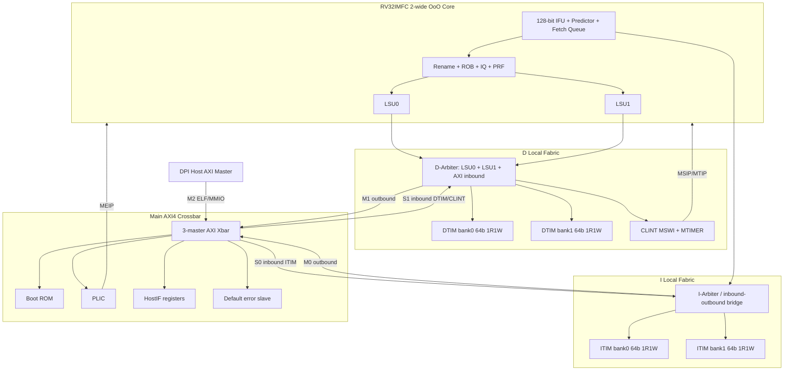
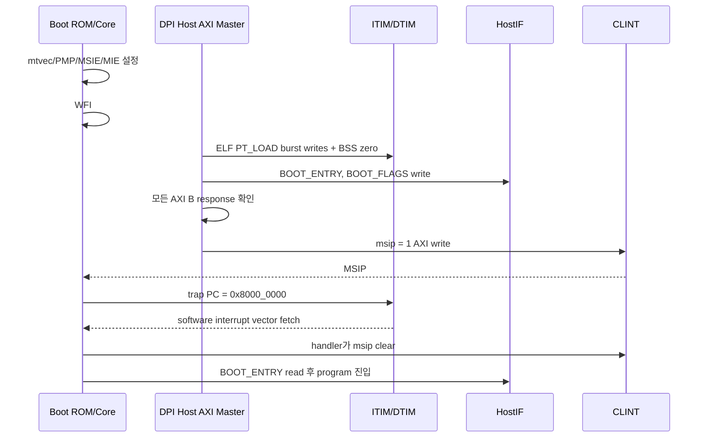

# Hardware Design Description: RV OoO Core SoC

| 항목 | 값 |
|---|---|
| 문서 ID | HDD-SOC-CORE-001 |
| 상태 | Implementation baseline v1.5.0 (RTL structure complete, verification deferred) |
| 1차 ISA | RV32IMFC_Zicsr_Zifencei |
| 확장 타깃 | RV64IMFC_Zicsr_Zifencei |
| 마이크로아키텍처 | 2-wide superscalar, out-of-order execute, in-order retire |
| 초기 privilege | Machine + User, Supervisor 확장 hook |
| 초기 memory | 128 KiB ITIM + 128 KiB DTIM |
| SoC interconnect | AXI4, 32-bit address / 64-bit data |
| 구현 언어 | SystemVerilog |

## 0. Executive Summary

이 문서는 코어와 초기 SoC를 구현할 때 우선하는 단일 설계 기준이다. 모듈 이름만 나열하지 않고 각 블록의 목적, 저장 상태, 상태 전이, 불변조건, 성능·복잡도 trade-off를 함께 설명한다. 현재 목표는 학습과 검증이 가능한 baseline을 만들되, 인터페이스와 recovery 구조는 향후 상용화·RV64·S-mode/MMU 확장을 막지 않도록 설계하는 것이다.

| 영역 | 확정 baseline |
|---|---|
| ISA | RV32IMFC + Zicsr + Zifencei, little-endian |
| Privilege | M/U 구현, `HAS_SMODE` 확장 frame, PMP 8 entries |
| Frontend | 128-bit fetch, 64-byte fetch queue, 2-wide align/decode, C 지원 |
| Predictor | 256-entry 4-way BTB, 2 Ki-entry gshare, 16-entry RAS |
| OoO window | ROB 48, branch checkpoint 8 |
| Rename | INT/FP RAT+RRAT, INT/FP PRF 각 80 entries |
| Issue | global 2 uop/cycle, INT IQ 24, MEM IQ 16, FP IQ 16 |
| Execute | ALU 2, BRU 1, MUL 1, DIV 1, LSU/AGU 2, FP cluster 1 |
| Memory ordering | LQ 24, SQ 16, store buffer 16, conservative older-store blocking |
| Precise state | execution OoO, commit 최대 2개/cycle in order |
| Initial memory | ITIM/DTIM 각 128 KiB, 2-bank × 64-bit, bank별 1R1W |
| SoC fabric | D local fabric 3 initiators, I local fabric, AXI4 main crossbar |
| Interrupt | CLINT-compatible MSIP/MTIMER, PLIC 32 sources/1 M context |
| Boot/test | Boot ROM WFI → DPI ELF PT_LOAD/Host AXI → HostIF → CLINT MSIP → ITIM vector |
| RV64 확장 | `XLEN`, W-op decode, 64-bit LSU/CSR, Sv39 hook 분리 |

architectural state는 commit에서만 바뀐다. 특히 store는 execute 시 SQ에 주소와 데이터를 기록할 뿐 TIM/MMIO에 write하지 않는다. ROB head에서 정상 commit된 store만 store buffer를 거쳐 D local fabric에 보인다. 두 LSU 때문에 load가 store를 추월할 수 있으므로 초기 구현은 주소가 미확정인 older store가 하나라도 있으면 younger load를 issue하지 않는다.

현재 구현 상태(2026-08-31)는 **RV32IMFC 1차 RTL 구조 구현 완료, 일괄 검증 전**이다. SoC address package, 1R1W SRAM, 2-bank ITIM/DTIM, CLINT, PLIC, Boot ROM, HostIF, I/D-Fabric, AXI bridge와 Main Xbar가 `rv_soc_top`에 연결된다. core는 2-wide C align/decode, INT/FP RAT·RRAT·free-list·PRF, ROB 48, unified issue window/global 2-wide select, ALU2/BRU/MUL/DIV, dual LSU/LSQ/store buffer, CSR·M/U privilege·precise trap·PMP를 하나의 speculation/recovery 경계로 통합한다. `rv_fpu`는 RV32F arithmetic/FMA/divsqrt/misc/convert 결과와 `fflags`를 ROB에 보관하고 commit 시에만 FCSR에 누적하며, `rv_branch_predictor`는 256-entry 4-way BTB, 2048-entry gshare, 16-entry speculative/committed RAS를 2-wide frontend와 branch resolve/commit에 연결한다. trap/interrupt/WFI/post-commit redirect와 FENCE/FENCE.I drain은 각각 독립 controller로 분리했다. DPI 구조는 ELF32/ELF64 little-endian RISC-V PT_LOAD를 최대 16-beat Host AXI burst로 ITIM/DTIM에 적재하고 HostIF entry/flags 뒤 마지막 write로 CLINT MSIP를 발생시킨다. v1.3.8까지의 integer/LSU/CSR/trap/PMP/directed boot 회귀는 통과했지만, v1.4.0 이후 신규 FPU·predictor·DPI 및 v1.5.0 controller 분리는 사용자 요청에 따라 아직 실행 검증하지 않았다. 따라서 구현 완료는 RTL 구조 경계를 뜻하며 sign-off가 아니다. 다음 단계에서 compile/elaboration, unit, core integration, SoC ELF boot, ISA 및 differential 검증을 일괄 수행하고 발견 결함을 보완한다.

## 1. 목적과 성능 포지션

이 코어는 Cortex-A53보다 높은 단일 스레드 성능을 장기 목표로 하지만, 특정 상용 코어와의 우열은 구조 이름만으로 판단하지 않는다. 동일 공정·주파수·메모리 시스템에서 IPC, Fmax, 면적, 전력, 분기 실패율, L1 miss율을 측정해 판정한다.

초기 구현의 목적은 다음과 같다.

- 사이클당 최대 2개 명령어 fetch/decode/rename/dispatch/issue/retire
- register renaming과 ROB를 사용한 out-of-order 실행
- precise exception, precise interrupt, branch misprediction recovery
- RV32IMFC의 완전한 architectural behavior
- M-mode와 U-mode, 8-entry PMP, machine interrupt 동작
- AXI4 기반 SoC, ITIM/DTIM, CLINT, PLIC, DPI Host bring-up
- `XLEN`에 의존하는 로직을 분리해 RV64 전환 시 구조 재작성 방지
- FPGA bring-up과 ASIC 합성 모두 가능한 순수 SystemVerilog RTL

초기 범위 밖이지만 인터페이스와 복구 구조에 확장 지점을 남기는 항목은 S-mode, Sv32/Sv39 MMU, A/B 확장, cache/coherent L2, external debug module이다. U-mode는 초기 범위에 포함한다.

## 2. 명세 기준과 해석 정책

구현 기준 버전은 아래와 같이 고정한다.

| 구성 | 버전 | 상태 |
|---|---:|---|
| RV32I / RV64I | 2.1 | Ratified |
| M | 2.0 | Ratified |
| F | 2.2 | Ratified |
| C | 2.0 | Ratified |
| Zicsr | 2.0 | Ratified |
| Zifencei | 2.0 | Ratified |
| RVWMO | 2.0 | Ratified |
| Machine privileged ISA | 1.13 | Ratified |
| PLIC | 1.0.0 | Ratified |
| ACLINT register behavior | 1.0 계열 | CLINT-compatible subset |
| AMBA AXI | AXI4 | IHI 0022 |

공식 참조:

- [RISC-V Unprivileged ISA](https://docs.riscv.org/reference/isa/unpriv/)
- [RISC-V Privileged ISA](https://docs.riscv.org/reference/isa/priv/)
- [ISA extension naming](https://docs.riscv.org/reference/isa/unpriv/naming.html)
- [RISC-V PLIC Specification](https://github.com/riscv/riscv-plic-spec)
- [RISC-V ACLINT Specification archive](https://github.com/riscvarchive/riscv-aclint)
- [Arm AMBA AXI Protocol Specification](https://developer.arm.com/documentation/ihi0022/latest/)

정책:

- little-endian만 지원한다.
- C 확장 때문에 `IALIGN=16`이다.
- misaligned load/store는 1차 구현에서 access를 분할하지 않고 address-misaligned exception을 발생시킨다.
- F 확장은 `fcsr`, `frm`, `fflags` CSR을 포함하므로 Zicsr를 필수로 둔다.
- `FENCE.I`의 구현을 위해 Zifencei를 포함한다.
- instruction/data access fault의 상세 원인은 memory response와 PMA가 제공한다.
- reserved encoding은 illegal-instruction exception으로 처리한다.
- PLIC memory-mapped register는 32-bit naturally aligned access를 기준으로 한다.
- initial CLINT는 single-hart MSWI와 MTIMER register behavior를 구현한다.
- AXI4 narrow transfer와 INCR burst를 지원하고 exclusive/locked/WRAP burst는 초기 범위 밖이다.

## 3. 전체 구조와 주소 지도

### 3.1 SoC dataflow



I/D local fabric은 각각 AXI master outbound port와 AXI slave inbound port를 따로 가진다. 코어 자신의 local 주소는 AXI로 내보내기 전에 local decode에서 흡수하므로 `I outbound → I inbound`, `D outbound → D inbound` self-loop는 발생하지 않는다. 반면 LSU가 ITIM을 data로 읽거나 IFU가 DTIM에서 fetch하는 cross-local access는 Main Xbar를 통해 허용한다.

### 3.2 초기 physical memory map

| 시작 주소 | 끝 주소 | 크기 | 대상 | 속성 |
|---:|---:|---:|---|---|
| `0x0000_1000` | `0x0000_1FFF` | 4 KiB | Boot ROM | RX, reset vector |
| `0x0020_0000` | `0x0020_FFFF` | 64 KiB | CLINT-compatible | device, strongly ordered |
| `0x0C00_0000` | `0x0C3F_FFFF` | 4 MiB | PLIC | device, 32-bit register access |
| `0x1000_0000` | `0x1000_0FFF` | 4 KiB | HostIF | device, DPI mailbox/console |
| `0x8000_0000` | `0x8001_FFFF` | 128 KiB | ITIM | RWX, 2-bank 1R1W |
| `0x8002_0000` | `0x8003_FFFF` | 128 KiB | DTIM | RW, optional X by PMP policy |
| 그 외 | - | - | Error slave | AXI `DECERR`, core access fault |

`mtvec`의 boot 값과 ITIM base는 모두 `0x8000_0000`이다. CLINT base는 요청에 따라 일반적인 `0x0200_0000`이 아니라 `0x0020_0000`을 사용한다. 주소는 `rv_soc_pkg` 한 곳에서만 정의하며 RTL에 literal을 반복하지 않는다.

### 3.3 Address parameterization

모든 region은 `rtl/soc/rv_soc_pkg.sv`에 `*_BASE_ADDR`와 `*_SIZE_KB`로 정의한다. byte 수와 exclusive end address는 package가 파생한다.

```systemverilog
parameter logic [31:0] ITIM_BASE_ADDR   = 32'h8000_0000;
parameter int unsigned ITIM_SIZE_KB     = 128;
parameter logic [31:0] DTIM_BASE_ADDR   = 32'h8002_0000;
parameter int unsigned DTIM_SIZE_KB     = 128;
parameter logic [31:0] HOSTIF_BASE_ADDR = 32'h1000_0000;
parameter int unsigned HOSTIF_SIZE_KB   = 4;
```

동일 방식으로 Boot ROM, CLINT, PLIC, HostIF를 정의한다. CLINT/PLIC/HostIF 내부 register offset도 package constant만 사용한다. address hit는 `base <= addr < base + size_bytes`인 half-open range로 비교한다.

`rv_soc_top`은 package 값을 default parameter로 다시 노출한다. 따라서 사용자는 다음 두 방법을 쓸 수 있다.

1. 프로젝트 공통 memory map 변경: `rv_soc_pkg.sv`의 default 값 수정
2. 특정 test/instance만 변경: `rv_soc_top #(.ITIM_BASE_ADDR(...))` override

모든 하위 fabric/peripheral에는 top parameter를 전달하며 하위 module이 package default를 다시 참조해 override를 무시하지 않게 한다. elaboration check module은 다음을 `$fatal`로 검사한다.

- 모든 size가 0보다 크고 KiB 단위인지
- 모든 region의 base가 최소 4 KiB aligned인지
- 모든 region pair가 overlap하지 않는지
- TIM size가 16-byte block과 2-bank interleave 조건을 만족하는지
- `BOOT_MTVEC_ADDR`가 ITIM range 안이고 4-byte aligned인지
- 32-bit address에서 `base + size`가 overflow하지 않는지

SystemVerilog testbench는 package/top parameter 값을 DPI-C `host_config()` 인자로 넘긴다. DPI ELF loader와 C code는 ITIM/DTIM/CLINT/HostIF 주소를 하드코딩하지 않는다. linker script는 `--defsym` 또는 generated include로 같은 값을 받는다.

## 4. 기준 파라미터

| 파라미터 | 기본값 | 근거 |
|---|---:|---|
| `XLEN` | 32 | 1차 RV32, 허용값 32/64 |
| Front/rename/dispatch width | 2 | 목표 issue 폭과 정렬 |
| Global issue width | 2 | 클러스터 전체 합산 최대 2 uop/cycle |
| Commit width | 2 | 정상 경로 2 inst/cycle |
| ROB entries | 48 | 지연 은닉과 초기 구현 복잡도의 절충 |
| Integer physical registers | 80 | x0 포함 32 architectural + 최대 48 speculative destination |
| FP physical registers | 80 | 32 architectural + speculative destination |
| Integer IQ | 24 | ALU/branch/multiply 대기 |
| Memory IQ | 16 | AGU issue 대기 |
| FP IQ | 16 | FP 연산 대기 |
| Load queue | 24 | dual LSU의 speculative load 추적 |
| Store queue | 16 | 두 store address/data update와 forwarding |
| Committed store buffer | 16 | dual enqueue와 cache backpressure 흡수 |
| Branch checkpoints | 8 | RAT/free-list 즉시 복구 |
| Fetch block | 16 bytes | C 포함 2개 이상 명령어 정렬 여유 |
| Fetch queue | 64 bytes | TIM/AXI 응답과 decode decouple |
| ITIM / DTIM | 각 128 KiB | 초기 deterministic memory |
| TIM banks | 2 × 64-bit 1R1W | dual fetch/data bandwidth |
| Main AXI | A32/D64/ID6 | Host burst와 16-byte fetch 지원 |
| I outstanding fetch | 4 blocks | non-local AXI fetch latency 은닉 |
| RAS | 16 entries | call/return 예측 |
| BTB | 256 entries, 4-way | 강한 IFU 기준선 |
| Direction predictor | 2 Ki-entry gshare, 2-bit | 초기 검증 가능한 예측기 |
| PLIC sources | 32 | source 0 reserved, M-context 1 |
| PMP entries | 8 | M/U 초기 protection |

모든 용량은 parameter로 노출하되, 검증 configuration은 무분별하게 늘리지 않는다. 최초 sign-off 구성은 `rv32_default`와 `rv64_smoke` 두 개다.

## 5. 파이프라인

### 5.1 정상 ITIM-hit 경로

| 단계 | 이름 | 주요 동작 |
|---:|---|---|
| F0 | Predict | next PC, BTB, gshare, RAS lookup |
| F1 | ITIM | PMP/PMA check, 2-bank ITIM read 또는 AXI request |
| F2 | IFData | 128-bit data 반환, fetch queue 삽입 |
| F3 | Align | 16/32-bit 경계 검출, 최대 2개 instruction 추출 |
| D0 | Decode | C expand, opcode decode, immediate 생성, early illegal 검출 |
| R0 | Rename | RAT lookup, physical destination allocation, intra-pair dependency bypass |
| D1 | Dispatch | ROB/IQ/LQ/SQ를 원자적으로 할당 |
| I0 | Select | ready wakeup, age 기반 select, global 2-uop grant |
| E0..n | Execute | ALU/BRU 1, MUL 2, DIV variable, FPU variable, load 3+ cycles |
| W0 | Writeback | PRF write, dependent wakeup, ROB completion |
| C0 | Commit | head부터 최대 2개 retire, RRAT/CSR/fflags 갱신 |

동일 cycle의 두 rename lane 사이에는 lane 0의 새 destination을 lane 1 source가 참조할 수 있어야 한다. 두 instruction이 같은 architectural destination을 쓰면 lane 1이 최종 speculative mapping이 된다.

### 5.2 backpressure

다음 자원 중 하나라도 두 lane 전체를 수용하지 못하면 dispatch bundle을 부분 삽입하지 않고 stall한다.

- ROB free entry
- 필요한 integer/FP physical destination
- 대상 IQ entry
- load/store인 경우 LQ/SQ entry
- branch checkpoint

lane 0만 유효하거나 lane 1이 decode 단계에서 제거된 경우에는 실제 유효 uop 수만 검사한다. architectural instruction을 여러 uop으로 분해하는 기능은 초기 버전에 사용하지 않으며, 필요해질 경우 dispatch 전에 uop count를 확정한다.

## 6. Frontend

### 6.1 fetch와 정렬

- fetch PC는 2-byte aligned여야 한다.
- local ITIM fetch block은 16-byte aligned 128-bit이며 bank0/1에서 64-bit씩 같은 cycle에 읽는다.
- fetch queue는 64 byte를 보유하고 SRAM/AXI 응답과 decode backpressure를 분리한다.
- block 경계를 넘는 32-bit instruction은 queue의 연속 byte view에서 조립한다.
- aligner는 cycle당 최대 2개 architectural instruction을 출력하고, 16/32-bit 길이 조합을 모두 지원한다.
- 각 instruction에는 `pc`, raw instruction, expanded instruction, original length, prediction metadata, fetch fault를 부착한다.
- C expansion은 decode 입력에서 canonical 32-bit instruction으로 변환하지만 original raw bits와 length는 trace/exception을 위해 보존한다.
- taken prediction 뒤의 동일 bundle younger instruction은 무효화한다.
- redirect는 fetch epoch를 증가시키며 이전 epoch의 outstanding AXI response를 폐기한다.
- non-local fetch는 64-bit AXI beat 두 개의 INCR burst로 16-byte block을 만들고 최대 4 block을 outstanding으로 둔다.

ITIM bank mapping은 64-bit beat 기준으로 `bank = address[3]`, `row = (address - ITIM_BASE)[16:4]`이다. 16-byte aligned IFU fetch는 bank0과 bank1을 한 번씩 읽으므로 매 cycle 128-bit 공급이 가능하다.

### 6.2 I-Arbiter

I local fabric은 IFU request와 Main Xbar inbound access를 ITIM에 연결하고, ITIM/로컬 범위 밖 IFU request를 AXI master로 내보낸다.

- ITIM bank별 read port: IFU fetch와 AXI inbound read가 경쟁한다.
- ITIM bank별 write port: AXI inbound write가 사용하며 IFU read와 1R1W로 동시 수행할 수 있다.
- IFU read 우선이 기본이지만 inbound read가 8회 연속 대기하면 한 번 grant하는 bounded fairness를 적용한다.
- Host ELF loading은 코어가 Boot ROM의 WFI에 있을 때 수행하므로 정상 boot에서는 IFU/Host ITIM 충돌이 없다.
- 실행 중 Host가 ITIM을 수정할 경우 software halt 또는 store completion 뒤 `FENCE.I`가 필요하다.
- AXI inbound burst는 64-bit beat로 분해해 bank write/read로 변환하고 ID와 beat 순서를 response queue에 유지한다.

불변조건:

- 한 ITIM bank의 read port와 write port는 각각 cycle당 최대 한 번만 grant된다.
- `valid && !ready`인 request/response payload는 변하지 않는다.
- flush된 epoch의 fetch data는 decode queue에 들어갈 수 없다.
- fetch fault는 해당 instruction의 ROB entry까지 전달되며 speculative fetch 시점에 즉시 trap하지 않는다.

### 6.3 branch predictor

초기 predictor는 다음 세 요소를 사용한다.

- 256-entry 4-way BTB: tag, target, branch type, instruction length
- 2048-entry 2-bit gshare PHT와 11-bit global history
- 16-entry RAS: JAL/JALR hint에 따른 call/return 추적

예측기는 speculative history와 committed/recovery state를 구분한다. branch resolve 시 direction 또는 target이 틀리면 해당 branch checkpoint로 rename state와 predictor history를 복구하고 younger state를 flush한다.

## 7. Decode와 명령어 표현

decode 결과는 최소 다음 제어 정보를 가진다.

- instruction class와 functional-unit class
- integer/FP source 최대 3개와 destination 1개
- immediate와 PC-relative 여부
- branch/jump type와 predicted target/direction
- load/store size, sign extension, fence 속성
- CSR address와 read/write semantics
- FP rounding mode와 fflags write 여부
- serializing, illegal, fetch fault 표시

초기 구현은 macro-op fusion을 사용하지 않는다. C는 별도 uop이 아니라 32-bit canonical instruction으로 확장한다.

## 8. Rename, PRF, free list

### 8.1 목적

rename은 architectural register 이름의 false dependency인 WAR/WAW를 제거한다. 실제 RAW dependency만 physical tag로 남기므로 younger independent instruction이 older long-latency instruction을 추월해 실행할 수 있다. RRAT은 commit된 architectural mapping, RAT은 speculative mapping을 나타낸다.

### 8.2 보관 상태

| 상태 | 크기 | 내용 |
|---|---:|---|
| Integer RAT/RRAT | 각 32 × 7-bit | x0..x31 → p0..p79 |
| FP RAT/RRAT | 각 32 × 7-bit | f0..f31 → fp0..fp79 |
| Integer PRF | 80 × XLEN | speculative/committed integer value |
| FP PRF | 80 × 32 | F-extension value, `FLEN=32` |
| Free list | INT/FP 각 80 bits+allocator | 사용 가능한 physical register |
| Busy/ready table | INT/FP 각 80 bits | producer writeback 완료 여부 |
| Branch checkpoint | 8 entries | RAT/free-list/predictor/queue recovery state |

x0는 zero 전용 physical register p0에 고정하고 ready=1/value=0으로 유지한다. destination x0에는 새 physical register를 할당하지 않는다.

### 8.3 2-wide rename 상태 전이

1. lane0과 lane1의 source architectural register로 현재 RAT을 읽는다.
2. destination이 있는 lane마다 free-list에서 새 physical tag를 할당한다.
3. lane1 source가 lane0 destination과 같으면 RAM/RAT read 결과 대신 lane0의 새 tag를 bypass한다.
4. 두 lane destination이 같으면 lane1의 stale tag는 lane0의 새 tag이고, 최종 RAT mapping은 lane1의 새 tag다.
5. 각 ROB entry에 architectural destination, new tag, stale tag를 기록한다.
6. 새 tag의 ready를 0으로 만들고 dispatch가 원자적으로 성공한 경우에만 RAT/free-list를 갱신한다.
7. writeback이 승인되면 PRF value를 기록하고 ready를 1로 만든다.
8. commit 시 RRAT을 new tag로 갱신하고 stale tag를 free-list에 반환한다.

dispatch에 필요한 ROB/IQ/LSQ/checkpoint 중 하나라도 부족하면 두 lane 모두 rename state를 변경하지 않는다. lane0만 부분 할당한 뒤 lane1 실패로 되돌리는 동작은 금지한다.

### 8.4 recovery

- branch mispredict: branch checkpoint의 RAT/free-list allocation state를 복원하고 younger ROB/IQ/LQ/SQ entry를 무효화한다.
- exception: exception instruction이 ROB head일 때 RRAT→RAT 복사, committed allocation bitmap→free-list 복구 후 전체 speculative state를 flush한다.
- interrupt: commit 경계에서 exception recovery와 같은 committed-state 복구를 사용한다.
- stale long-latency writeback: ROB valid+sequence와 destination allocation generation이 일치할 때만 PRF/ready를 갱신한다.

### 8.5 핵심 불변조건과 trade-off

- physical register 하나가 동시에 free와 RAT/RRAT mapped일 수 없다.
- architectural register마다 RAT과 RRAT에 각각 정확히 하나의 mapping이 있다.
- commit 전에는 stale physical register를 free-list로 반환하지 않는다.
- flush된 instruction이 할당한 physical register는 정확히 한 번 반환한다.
- 80-entry PRF는 32 architectural + 최대 48 ROB destination을 수용해 PRF 부족이 ROB보다 먼저 발생하지 않는 기준선이다.
- logical INT 4R2W, FP 4R2W는 구현이 단순한 flop-array로 먼저 검증하고, PPA 단계에서 banking/replication으로 교체한다.

## 9. ROB와 precise state

### 9.1 ROB가 필요한 이유

실행은 순서가 바뀌지만 software가 보는 register, memory, CSR, exception 순서는 program order여야 한다. ROB는 speculative instruction의 program order를 보존하고 완료 여부와 side effect를 모아 in-order commit을 수행한다. 따라서 younger load가 먼저 끝나도 older exception이 있으면 younger 결과는 architectural state가 되지 않는다. 단, memory에서 잘못 읽은 load 값으로 younger instruction이 실행되는 문제는 ROB만으로 해결되지 않으므로 LSQ ordering과 forwarding이 별도로 필요하다.

### 9.2 ROB entry

48-entry circular ROB의 각 entry는 다음을 저장한다.

| 분류 | 필드 |
|---|---|
| Identity/order | valid, monotonically wrapped sequence, ROB index, PC, raw/expanded instruction, length |
| Rename | destination class, architectural destination, new physical tag, stale physical tag, writes-destination |
| Completion | dispatched, issued(optional debug), complete, result/writeback accepted |
| Exception | exception valid, cause, `tval`, fetch/access/illegal source |
| Branch | checkpoint ID, predicted direction/target, actual direction/target, mispredict |
| Memory | load/store flag, LQ/SQ index, size/mask, store-commit-ready |
| System | CSR address/op/value, fence/serializing, privilege snapshot |
| FP | rounding metadata, accrued `fflags` |

`sequence`는 ROB index가 wrap된 뒤에도 age를 비교할 수 있게 한다. IQ와 LQ/SQ는 ROB index만이 아니라 sequence 또는 wrap-aware age 정보를 함께 보관한다.

### 9.3 상태 전이

| 이벤트 | ROB 상태 변화 |
|---|---|
| Dispatch | tail에서 최대 2 entry 원자 할당, metadata 기록, complete=0 |
| Issue | architectural 상태 변화 없음; debug/timeout용 issued 상태만 선택 기록 |
| Execute | branch actual, memory address, exception metadata를 해당 entry에 기록 |
| Writeback | PRF write가 승인되면 destination instruction complete=1 |
| Store execute | SQ address/data 준비를 기록하되 ROB complete는 필요한 store operand가 모두 준비된 때 설정 |
| Commit | head부터 최대 2 entry 제거, RRAT/CSR/fflags/store-buffer side effect 적용 |

head/tail 규칙:

- free count가 유효 dispatch lane 수보다 작으면 어떤 entry도 할당하지 않는다.
- lane0은 lane1보다 older sequence를 받는다.
- writeback은 임의 순서로 complete bit를 세울 수 있지만 head만 commit 후보가 된다.
- lane1 commit은 lane0이 같은 cycle에 정상 commit되고 lane1도 complete이며 serializing/exception/store-buffer 제약을 만족할 때만 가능하다.
- head가 complete가 아니면 younger complete entry가 있어도 retire하지 않는다.

### 9.4 precise exception, interrupt, branch recovery

- head exception: faulting instruction은 commit하지 않는다. `mepc/mcause/mtval`을 기록하고 younger ROB/IQ/LQ/SQ, execution result를 flush한다. RAT은 RRAT에서 복원한다.
- interrupt: 현재 head 이전까지 정상 commit된 instruction 경계에서 받는다. 선택된 commit lane 뒤를 `mepc`로 만들고 speculative state를 flush한다.
- branch mispredict: branch 자신은 complete 상태로 남고 해당 checkpoint보다 younger인 state만 제거한다. RAT/free-list, fetch history, ROB tail, LQ/SQ tail을 checkpoint로 복구한다.
- store: commit된 store만 store buffer로 이동한다. store buffer가 필요한 entry를 받을 수 없으면 ROB head에서 commit을 대기한다.

### 9.5 불변조건과 예시

- ROB sequence는 program order와 동일하고 commit sequence는 감소하거나 건너뛸 수 없다.
- exception instruction과 그 younger instruction은 register/CSR/memory side effect를 만들 수 없다.
- 같은 cycle의 dual commit에서 lane1 side effect는 lane0 side effect보다 논리적으로 뒤다.
- ROB 밖 또는 generation이 다른 writeback은 PRF ready와 complete를 변경할 수 없다.

예: `I0: DIV x5`, `I1: ADD x6`, `I2: STORE x6`. ADD가 먼저 끝나도 I0가 head에서 완료되기 전에는 I1/I2가 commit하지 않는다. I2는 execute 후 SQ에만 존재하며 I0와 I1이 정상 commit된 뒤에야 store buffer로 이동한다. I0가 exception을 내면 I1 PRF 값과 I2 SQ entry는 모두 폐기된다.

## 10. Issue와 실행 유닛

### 10.1 issue policy

Issue Queue의 목적은 operand가 준비된 uop을 program order와 무관하게 실행 유닛으로 보내 latency를 숨기는 것이다. 각 entry는 `valid`, ROB index/sequence, functional-unit mask, physical source tag 최대 3개, source-ready bit, destination tag, immediate/operation control, LQ/SQ index를 저장한다.

상태 전이:

1. dispatch가 ROB와 대상 IQ entry를 같은 cycle에 원자 할당한다.
2. dispatch 시 busy table과 같은-cycle writeback/bypass로 source-ready 초기값을 만든다.
3. writeback tag broadcast와 일치하는 source를 ready로 바꾼다.
4. INT/MEM/FP queue가 각각 oldest-ready candidate를 만든다.
5. central arbiter가 포트 호환성과 unit busy를 검사해 전 클러스터 합산 최대 2 uop을 grant한다.
6. execution unit이 request를 accept한 때에만 IQ entry를 제거한다. backpressure이면 payload를 유지한다.

INT/MEM/FP queue는 분리하지만 age는 공통 ROB sequence로 비교한다. oldest-ready를 기본으로 하되 compatible pair를 선택해 한 포트의 제한 때문에 다른 독립 포트가 비지 않게 한다.

불변조건:

- source-ready가 0인 uop은 issue할 수 없다.
- 같은 IQ entry가 두 포트에 중복 issue될 수 없다.
- unit `ready=0`이면 grant/entry 제거가 일어나지 않는다.
- flush된 ROB sequence의 entry는 다음 cycle까지 모두 invalid가 되어야 한다.
- 실행 포트는 5개지만 global issue count는 cycle당 2 이하이다.

split IQ는 unified IQ보다 wakeup/select timing과 CAM 전력을 줄이지만, 한 queue가 가득 찬 동안 다른 queue의 빈 entry를 빌릴 수 없다. queue-full 성능 counter로 실제 imbalance를 측정한 뒤 용량을 조정한다.

### 10.2 확정 execution resource

| 자원 | 개수 | 역할 |
|---|---:|---|
| 범용 integer ALU | 2 | 두 개의 독립 integer uop 동시 실행 |
| Branch unit | 1 | INT0에 결합, branch/jump resolve |
| Pipelined integer multiplier | 1 | INT1에서 accept 후 독립 파이프 진행 |
| Iterative integer divider | 1 | INT1 side unit, accept 후 ALU1을 점유하지 않음 |
| LSU pipeline | 2 | cycle당 최대 2 memory uop issue |
| AGU | 2 | 두 load/store virtual address 동시 생성 |
| D-TLB/PMP path | 2 | 초기 PMP/PMA, 향후 D-TLB를 LSU0/1과 1:1 추가 |
| D local request path | 2 | LSU0/1 → D-Arbiter |
| FP cluster | 1 | cycle당 최대 1 FP uop accept |
| FP FMA pipeline | 1 | add/sub/mul/FMA의 주 pipelined datapath |
| FP misc pipeline | 1 | compare/classify/sign/min/max/convert/move, FP issue slot 공유 |
| FP div/sqrt side unit | 1 | iterative long-latency unit |
| CSR/privileged unit | 1 | commit과 INT0에 결합, serializing 처리 |

`FP cluster 1개`는 모든 FP 연산을 하나의 blocking unit에서 처리한다는 뜻이 아니다. FMA/misc pipeline과 iterative div/sqrt unit은 내부적으로 분리한다. FP issue bandwidth는 1 uop/cycle이지만, div/sqrt가 실행되는 동안 다음 FP add/mul/FMA를 계속 받을 수 있다. 두 unit 결과가 같은 cycle에 완료되면 FP writeback arbiter와 skid buffer가 순서를 조정한다.

### 10.3 execution port binding

| 논리 포트 | 연결 실행 유닛 | 지원 uop | accept bandwidth |
|---|---|---|---:|
| P0 / INT0 | ALU0 + BRU + CSR hook | add/sub, logic, shift, compare, branch/jump, CSR address/control | 1/cycle |
| P1 / INT1 | ALU1 + MUL + DIV accept | add/sub, logic, shift, compare, multiply, divide/remainder | 1/cycle |
| P2 / MEM0 | AGU0 + LSU0 | integer/FP load/store | 1/cycle |
| P3 / MEM1 | AGU1 + LSU1 | integer/FP load/store | 1/cycle |
| P4 / FP | FP FMA/misc + div/sqrt accept | F extension arithmetic/convert/compare/move | 1/cycle |

모든 포트가 동시에 grant되지는 않는다. central arbiter는 준비된 후보 중 age, 포트 호환성, long-latency unit ready를 검사해 최대 2개를 선택한다.

| 조합 | 동시 issue | 설명 |
|---|---|---|
| ALU + ALU | 가능 | P0 + P1 |
| branch + ALU | 가능 | branch는 P0, ALU는 P1 |
| ALU + load/store | 가능 | INT + MEM |
| ALU + FP | 가능 | INT + FP |
| load/store + FP | 가능 | MEM + FP |
| multiply/divide accept + ALU | 가능 | P1 + P0 |
| load + load | 가능 | 서로 다른 DTIM bank면 두 access 진행; 같은 bank면 초기 RTL에서 younger backpressure |
| load + store | 가능 | 두 AGU 사용, store는 SQ update 후 commit까지 cache write 금지 |
| store + store | 가능 | SQ가 cycle당 두 address/data update 수용 |
| FP + FP | 불가 | FP issue bandwidth가 1 |
| branch + branch | 불가 | BRU가 1개 |

INT IQ는 P0/P1에 호환되는 최대 두 후보를 만들고 MEM IQ는 최대 두 후보, FP IQ는 한 후보를 만든다. central arbiter는 oldest-ready를 우선하되, 한 포트에만 실행 가능한 older uop 때문에 다른 독립 포트가 불필요하게 비지 않도록 compatible pair를 선택한다. 두 MEM 후보는 AGU 이후 계산된 bank가 같을 수 있으므로 bank-conflict replay metadata를 보존한다.

### 10.4 latency와 throughput

| unit | RV32 latency 목표 | RV64 latency 목표 | throughput |
|---|---:|---:|---:|
| ALU/shift/compare | 1 | 1 | 1/cycle/ALU |
| branch/jump resolve | 1 | 1 | 1/cycle |
| integer multiply | 2 | 3 | 1/cycle |
| integer divide/remainder | 2~34 | 2~66 | non-pipelined, early-out |
| DTIM-hit integer/FP load | 3 이상 | 3 이상 | 최대 2/cycle, bank conflict 제외 |
| FP add/sub/mul | 3 | 3 | 1/cycle |
| FP fused multiply-add | 4 | 4 | 1/cycle |
| FP compare/classify/move | 1~2 | 1~2 | 1/cycle |
| FP convert | 2~3 | 2~3 | 1/cycle |
| FP divide/square-root | 구현 측정 후 고정 | 구현 측정 후 고정 | iterative |

integer multiplier는 `2*XLEN` full product를 만든다. divider와 FP div/sqrt는 operand를 받아 side unit으로 넘긴 다음 해당 issue port를 해제한다. side unit이 busy이면 같은 종류의 새 uop만 stall하고 일반 ALU/FMA 연산은 계속 진행한다.

### 10.5 PRF와 writeback bandwidth

논리 register-file port 기준선은 다음과 같다.

- Integer PRF: 4 read port, 2 write port
- FP PRF: 4 read port, 2 write port
- integer 4 read는 두 개의 integer store 또는 ALU + integer store 동시 issue를 지원한다.
- FP 4 read는 3-source FMA와 FP store의 동시 issue를 지원한다.
- 두 write port는 dual integer/FP load가 같은 cycle에 반환되는 경우를 지원한다.
- FP compare/convert-to-integer 결과는 integer writeback network로 들어간다.

variable-latency 결과가 겹치면 실행 유닛 output skid buffer가 결과를 유지한다. integer 결과와 FP 결과는 각각 최대 2개를 cycle당 PRF에 기록하고, 실제 writeback이 승인된 때에만 dependent wakeup과 ROB completion을 발생시킨다. destination이 없는 store/branch도 별도 completion event가 필요하므로 ROB completion 입력은 PRF write port 수와 동일하다고 가정하지 않는다.

물리 PRF는 논리 포트를 그대로 flop으로 만들지 않고 bank/replication 가능성을 유지한다. 최초 기능 구현에서는 flop-array PRF로 correctness를 검증하고, 합성 결과에 따라 banked 또는 replicated SRAM 구조로 교체한다.

### 10.6 Dual LSU 구조

LSU0와 LSU1은 load/store 기능이 같은 symmetric pipeline이다. 두 번째 LSU를 단순 AGU 추가로 만들지 않고 다음 경로를 모두 dual 처리한다.

- MEM IQ에서 최대 두 ready memory uop select
- integer/FP PRF source read
- 두 AGU의 virtual address 계산
- PMP/PMA check 두 개와 향후 D-TLB hook
- LQ/SQ allocation과 age/order 검사
- older store 검색과 store-to-load forwarding compare
- D-Arbiter의 2-bank DTIM CPU access
- load-result alignment/extension와 writeback

DTIM은 64-bit beat interleave 방식의 2-bank SRAM이다. `bank=(addr-DTIM_BASE)[3]`, `row=(addr-DTIM_BASE)[16:4]`로 선택하며 각 bank는 8192×64-bit 1R1W이다. 두 load가 서로 다른 bank면 동시에 진행한다. 같은 bank이면 초기 tightly-coupled RTL은 older load만 `req_ready=1`로 accept하고 younger request에 backpressure를 건다. decoupled request queue를 추가하는 단계에서는 younger를 accept한 뒤 `bank_conflict` replay response로 돌려주는 방식도 허용한다.

store issue는 address/data를 SQ에 기록할 뿐 cache를 변경하지 않는다. SQ는 cycle당 두 entry update를 지원하고 commit된 store만 16-entry store buffer로 이동한다. store buffer는 최대 두 store를 enqueue하며, 서로 다른 bank이고 ordering/PMA 조건을 만족할 때 최대 두 store를 drain할 수 있다. MMIO와 fault 가능 access는 항상 하나씩 ROB head에서 처리한다.

동일 cycle의 두 memory uop 사이에서도 ROB age를 보존한다. older store와 younger load의 주소가 같은 cycle에 계산되어 overlap하면 store data가 준비된 경우 pair-forwarding하고, 그렇지 않으면 younger load를 replay한다. memory exception과 replay가 동시에 발생하면 older uop의 exception이 우선이다.

dual LSU 때문에 LQ는 24, SQ는 16, committed store buffer는 16 entry로 확장한다. DTIM/CLINT 밖 요청은 D-Arbiter outbound queue가 AXI transaction으로 변환한다.

### 10.7 completion 충돌

서로 다른 latency의 완료 충돌은 unit output skid buffer와 writeback arbitration으로 처리한다. 결과가 받아들여지기 전에는 해당 실행 유닛이 ROB tag, physical destination tag, result, exception/fflags를 유지한다. flush된 ROB tag의 결과는 writeback arbitration 전에 제거한다.

### 10.8 branch resolve

branch/jump는 INT0에서 resolve한다. actual direction, target, next PC 중 하나라도 prediction과 다르면 misprediction이다. 해당 branch 자신은 유지하고 모든 younger ROB/IQ/LSQ 상태를 제거한다.

## 11. LSU, LSQ, memory ordering

### 11.1 목적과 불변조건

두 LSU는 서로 다른 cycle과 latency로 완료되므로 ROB의 in-order commit만으로 memory dependency를 보장할 수 없다. 예를 들어 older store가 아직 주소를 계산하지 못한 동안 younger load가 같은 주소의 DTIM 값을 읽으면 잘못된 값이 PRF와 dependent chain에 전파된다. LSQ는 ROB age와 memory 주소를 함께 추적해 이 문제를 막는다.

핵심 불변조건:

- load는 모든 older store의 address 상태를 검사하기 전 memory request를 보낼 수 없다.
- 같은 byte를 쓰는 older store가 여러 개면 program order상 가장 젊은 older store의 byte가 load에 전달된다.
- uncommitted store는 DTIM, CLINT, PLIC, HostIF 또는 AXI write를 만들 수 없다.
- memory exception이 있는 store와 그 younger store는 외부에 보일 수 없다.
- 두 LSU가 같은 주소를 처리해도 결과는 단일 program-order LSU와 동일해야 한다.

### 11.2 LQ/SQ entry와 ROB age 연계

| Queue | Entry field |
|---|---|
| LQ 24 | valid, ROB index/sequence, destination tag/class, virtual/physical address, address-valid, size, byte mask, signed, issued, executed, forwarded, forwarding SQ sequence, data, exception, replay reason, epoch |
| SQ 16 | valid, ROB index/sequence, address, address-valid, size, byte mask, data, data-valid, FP/int source, committed, store-buffer allocated, exception, epoch |
| Store buffer 16 | valid, ROB sequence, physical address, data, strobe, target type, AXI attributes, response pending |

LQ/SQ age는 circular index 대소 비교가 아니라 ROB sequence 또는 wrap-aware comparison으로 판단한다. dispatch lane0/1의 ROB sequence와 LQ/SQ sequence가 동일한 order를 가져야 한다.

### 11.3 Store와 load 상태 전이

Store:

1. dispatch에서 SQ entry를 할당하고 ROB에 SQ index를 기록한다.
2. execute에서 AGU가 주소를 만들고 store operand가 준비되면 address/data를 SQ에 독립적으로 기록한다.
3. address와 data가 모두 valid이고 exception이 없으면 ROB store entry를 complete로 표시한다.
4. ROB head에서 정상 commit될 때만 SQ entry를 committed store buffer로 이동한다.
5. store buffer가 D-Arbiter write를 승인하고 target response가 정상일 때 entry를 제거한다.

Load:

1. dispatch에서 LQ entry를 할당한다.
2. source-ready가 되면 MEM IQ에서 issue candidate가 된다.
3. AGU address가 준비되면 모든 valid older SQ entry를 병렬 또는 단계적 CAM으로 검사한다.
4. ordering/forwarding 조건을 만족한 경우에만 DTIM/AXI read 또는 SQ forwarding을 실행한다.
5. data와 exception을 LQ/ROB에 기록하고 PRF writeback이 승인되면 ROB complete를 설정한다.
6. commit 또는 flush에서 LQ entry를 제거한다.

### 11.4 Store-to-load forwarding

forwarding 선택 규칙:

1. load보다 older인 SQ entry만 후보로 만든다.
2. address-valid 후보의 byte mask와 load byte mask를 비교한다.
3. 겹치는 후보 중 ROB sequence가 가장 큰, 즉 youngest older store를 우선한다.
4. load의 모든 요청 byte가 data-valid인 older store byte로 완전히 덮이면 SQ data를 정렬·확장해 load 결과로 사용한다.
5. 여러 older store가 서로 다른 byte를 덮는 merge forwarding은 후속 최적화다. 초기 구현은 한 youngest store가 full-cover할 때만 forwarding한다.
6. partial overlap 또는 matching store data-invalid이면 load를 memory로 보내지 않고 stall/replay한다.
7. 주소가 알려진 모든 older store가 non-overlap이면 memory read를 허용한다.

동일 cycle에 `older store + younger load`가 LSU0/1으로 issue되고 주소가 겹치면 pair-comparator가 SQ array write보다 먼저 결과를 bypass한다. store data까지 준비되어 full-cover하면 직접 forwarding하고, 그렇지 않으면 younger load를 replay한다.

### 11.5 미확정 older store 정책

초기 구현은 correctness-first conservative policy를 사용한다.

- address-valid=0인 older SQ entry가 하나라도 있으면 younger load는 LSU로 issue하지 않는다.
- address는 valid지만 matching store의 data-valid=0이면 해당 load를 stall한다.
- 이 stall 원인은 `unknown_store_addr`, `store_data_wait`, `partial_overlap`으로 성능 counter에 구분한다.
- 이 정책에서는 store address resolution 뒤 이미 실행된 younger load를 찾는 violation recovery가 정상 경로에 필요하지 않다.

향후 speculative mode에서는 unknown older store를 load가 추월할 수 있다. 그 경우 store address가 resolve될 때 모든 younger executed LQ address와 비교하고, overlap violation이 있으면 가장 오래된 violating load와 그 dependent younger instruction을 squash/replay한다. store-set predictor와 selective replay는 별도 milestone이며 초기 RTL에서 enable하지 않는다.

### 11.6 두 LSU와 bank arbitration

- 두 load가 서로 다른 DTIM bank면 같은 cycle에 read를 시작한다.
- 두 load가 같은 bank면 older ROB sequence를 grant한다. 초기 RTL은 younger request의 `req_ready=0`을 유지하고, 향후 decoupled accept 모드만 `bank_conflict` replay response를 사용한다.
- load와 committed store-buffer drain이 같은 bank를 접근하면 1R1W이므로 read와 write를 동시에 허용한다. 같은 row/byte overlap은 program-order bypass로 read value를 명시한다.
- 두 committed store가 서로 다른 bank면 같은 cycle에 write할 수 있다. 같은 bank면 older store만 drain한다.
- CLINT/PLIC/HostIF 같은 device access는 speculative하지 않고 ROB head에서 한 건씩 수행한다.
- two-LSU memory issue가 global issue 두 slot을 모두 사용하므로 같은 cycle에 ALU/FP uop을 추가 issue하지 않는다.

### 11.7 Commit, flush, exception

- Store external visibility point는 ROB head commit 후 store-buffer enqueue다. execute/SQ complete는 visibility가 아니다.
- commit lane0/lane1이 모두 store이면 store buffer에 두 entry 공간이 있을 때만 두 개를 순서대로 enqueue한다.
- branch recovery는 checkpoint보다 younger인 LQ/SQ entry를 sequence로 무효화한다.
- exception/interrupt recovery는 uncommitted LQ/SQ를 모두 비우고 committed store buffer는 유지한다. 이미 commit된 store는 trap보다 older이므로 drain을 계속할 수 있다.
- flush 당시 이미 request handshake된 LQ entry는 `killed_outstanding` tombstone으로 남기고 response ID가 돌아올 때까지 그 LQ index를 재할당하지 않는다. 현재 D-memory response에는 epoch/ROB sequence echo가 없으므로 이 규칙으로 stale response가 새 load entry를 오염시키는 것을 막는다. response는 받아 버리되 PRF/ROB를 갱신하지 않는다.
- store access fault 가능성이 있는 external/MMIO write는 commit 시 non-speculative transaction으로 실행하고 response를 받은 뒤 trap 여부를 확정한다. 해당 store가 head를 점유하는 동안 younger commit을 막는다.

### 11.8 FENCE와 FENCE.I

- 초기 `FENCE`는 conservative full fence로 구현한다: older load 완료, SQ의 older store commit, store buffer drain, outstanding D-AXI response 완료 후 younger memory operation을 허용한다.
- `FENCE.I`는 위 data ordering을 만족한 뒤 IFU fetch queue와 outstanding fetch epoch를 invalidate하고 현재 다음 PC에서 refetch한다.
- 초기 TIM에는 I-cache가 없으므로 cache invalidate는 필요 없지만 ITIM write가 fetch queue에 남아 있을 수 있으므로 frontend flush는 필수다.

### 11.9 초기 TIM과 향후 cache

초기 모델은 I/D cache 없이 ITIM/DTIM을 사용한다. TIM wrapper에 parity/ECC hook과 future cacheable attribute를 둔다. 후속 cache 단계에서는 32 KiB 4-way 64-byte-line L1 I/D cache, non-blocking MSHR, write-back D-cache를 local fabric 앞에 추가하되 LSQ ordering과 store commit visibility 규칙은 바꾸지 않는다.

## 12. Floating point

F architectural register width는 `FLEN=32`로 고정한다. integer `XLEN`과 별도이다.

- 모든 IEEE-754 결과와 RISC-V canonical NaN 규칙을 준수한다.
- dynamic rounding mode는 `frm`을 읽고 reserved rounding encoding은 illegal instruction으로 처리한다.
- accrued exception flag는 execute 결과에 실어 ROB에 저장하고 commit에서 `fflags`에 OR한다.
- FP exception은 trap을 발생시키지 않는다.
- fused multiply-add는 단일 rounding operation이어야 한다.
- reference model은 Berkeley SoftFloat 또는 Spike 결과를 사용한다.

RV64에서 FPR이 64-bit가 되는 것은 아니다. F-only 구성은 `FLEN=32`를 유지한다. `FMV.X.W`는 RV64 규칙에 맞게 integer 결과를 sign-extend하고 `FMV.W.X`는 integer source 하위 32-bit를 사용한다.

## 13. CSR, privilege, trap

### 13.1 초기 M/U privilege

초기 모델은 Machine와 User mode를 구현한다. `current_priv`는 2-bit architectural state로 두어 M/U를 사용하고 S encoding은 `HAS_SMODE=1` 확장 시 활성화한다. U-mode의 exception, ECALL, interrupt는 delegation이 없으므로 M-mode로 trap된다.

필수 CSR:

- User-visible: `fflags`, `frm`, `fcsr`, `cycle`, `time`, `instret`와 RV32 high halves
- Machine information: `mvendorid`, `marchid`, `mimpid`, `mhartid`, `misa`
- Machine trap: `mstatus`, `mie`, `mip`, `mtvec`, `mscratch`, `mepc`, `mcause`, `mtval`
- Counters: `mcycle`, `minstret`, `mcycleh`, `minstreth`, `mcounteren`
- Protection: `pmpcfg0..`, `pmpaddr0..7`

`misa`는 RV32에서 MXL=1과 I/M/F/C/U bit를 나타낸다. Zicsr/Zifencei는 `misa` single-letter bit가 없다. `mstatus.MPP`의 WARL 값은 M/U이며 `FS`, `MIE`, `MPIE`, `MPRV`, `TW` 등 구현 필드를 명시적으로 decode한다.

CSR instruction은 read/write suppression 조건을 decode에서 구분하고 실제 CSR write는 commit에서 수행한다. CSR read가 younger CSR write를 추월하지 않도록 CSR uop은 serializing 또는 CSR scoreboard로 순서를 보장한다.

### 13.2 PMP

U-mode를 의미 있게 사용하기 위해 8-entry PMP를 구현한다. OFF/TOR/NA4/NAPOT와 R/W/X/L을 지원하고 IFU, LSU0, LSU1 세 access path에서 privilege와 access type을 검사한다.

- M-mode unlocked region access는 privileged specification 규칙을 따른다.
- U-mode는 matching PMP permission이 있어야 한다.
- 초기 Boot ROM은 bring-up을 위해 pmp0를 전체 physical address RWX NAPOT으로 설정할 수 있다.
- production firmware는 ITIM RX, DTIM RW, device RW처럼 region을 재구성한다.
- PMP fault는 instruction/load/store access fault로 ROB에 기록하고 precise trap 처리한다.

### 13.3 trap과 interrupt

trap entry는 ROB commit 경계에서 다음 순서로 architectural state를 갱신한다.

1. `mepc`에 faulting PC 또는 interrupt 다음 PC를 기록한다.
2. `mcause`, `mtval`을 기록한다.
3. `mstatus.MPIE←MIE`, `MIE←0`, `MPP←current_priv`를 수행한다.
4. `current_priv←M`으로 바꾸고 `mtvec` direct/vectored 규칙에 따른 PC로 redirect한다.
5. speculative RAT/ROB/IQ/LQ/SQ/frontend epoch를 flush한다.

`MRET`은 ROB head의 serializing instruction으로 실행하며 `current_priv←MPP`, `MIE←MPIE`, `MPIE←1`, `MPP←U` 후 `mepc`로 redirect한다.

초기 interrupt source:

- `MSIP`: CLINT software interrupt
- `MTIP`: CLINT timer compare
- `MEIP`: PLIC M-context external interrupt

interrupt eligibility는 `mip & mie`, current privilege와 `mstatus.MIE` 규칙을 따른다. WFI는 M-mode에서 구현하며 locally enabled interrupt가 pending되면 wake한다. Boot flow에서는 `mie.MSIE=1`과 `mstatus.MIE=1`을 모두 설정해 wake와 trap을 동시에 보장한다.

### 13.4 Supervisor 확장 frame

`HAS_SMODE=0` 초기 구성에서는 S instruction/CSR을 illegal로 처리하고 `mideleg/medeleg`은 구현하지 않거나 WARL zero wrapper로 격리한다. 다음 hook은 처음부터 signal/type에 남긴다.

- privilege enum의 S value와 trap target mux
- `medeleg/mideleg`, `sstatus/sie/sip/stvec/sepc/scause/stval/sscratch/satp`
- PLIC S-context와 `SEIP`
- SSWI/STIP source hook
- IFU/LSU translation request의 ASID, privilege, access type
- RV32 Sv32, RV64 Sv39 TLB/page-walker interface
- `SFENCE.VMA`, `SRET` decode slot

virtual address는 `XLEN`, physical address는 `PADDR_WIDTH`로 분리한다. 초기 `MMU_EN=0`에서는 address를 zero/sign policy에 따라 physical path로 전달하고 PMP/PMA만 적용한다.

## 14. RV64 전환 설계 규칙

RV64는 단순히 버스 폭만 64-bit로 늘리는 작업이 아니다. 아래 항목을 독립 검증한다.

| 영역 | RV64 요구사항 |
|---|---|
| Decode | `OP-IMM-32`, `OP-32`, RV64 load/store와 RV64C encoding 추가 |
| ALU | 기본 연산은 64-bit, W 연산 결과는 bit 31에서 sign-extension |
| Shift | 기본 shamt 6-bit, W 연산 shamt 5-bit와 reserved encoding 구분 |
| LSU | `LD/SD/LWU`, 8-byte mask, alignment와 sign/zero extension |
| M | 128-bit multiply intermediate, `MULW/DIVW/DIVUW/REMW/REMUW` |
| CSR | XLEN-width CSR, RV32 high-half counter access 차이 |
| C | RV32의 `C.JAL`과 RV64의 `C.ADDIW` 등 XLEN별 decode 분기 |
| Trace | PC, integer write data, address가 XLEN/PADDR parameter를 따름 |
| MMU future | RV32 Sv32와 RV64 Sv39 page-walk/control 분리 |

RTL coding rule:

- `logic [31:0]`은 instruction와 F data처럼 본질적으로 32-bit인 곳에만 사용한다.
- integer value/PC는 `[XLEN-1:0]`, physical address는 `[PADDR_WIDTH-1:0]`를 사용한다.
- sign extension은 destination width를 명시한 공용 함수로 수행한다.
- multiply intermediate는 `[2*XLEN-1:0]`로 선언한다.
- `XLEN==32`와 `XLEN==64` 이외의 구성은 elaboration에서 실패시킨다.
- RV32/RV64 opcode 차이는 넓은 datapath의 우연한 truncation에 의존하지 않는다.

## 15. SoC interconnect와 module interface

### 15.1 AXI4 profile

Main Xbar는 AXI4를 사용한다.

| 항목 | 값 |
|---|---|
| Address width | 32-bit initial, parameterized PADDR future |
| Data width | 64-bit |
| Local master ID | 4-bit |
| Xbar slave-side ID | 6-bit = 2-bit master prefix + 4-bit local ID |
| Burst | INCR, 최대 16 beats |
| Transfer size | 1/2/4/8 bytes, naturally aligned baseline |
| Outstanding | master별 read/write ID 기준 multiple |
| Unsupported | exclusive/locked, WRAP burst, atomics |
| Response | OKAY/SLVERR/DECERR, EXOKAY 미사용 |

채널 payload:

- AW: `id, addr, len, size, burst, prot, cache, qos, valid/ready`
- W: `data[63:0], strb[7:0], last, valid/ready`
- B: `id, resp, valid/ready`
- AR: AW와 동일한 read address/control
- R: `id, data[63:0], resp, last, valid/ready`

AXI invariant:

- `valid && !ready` 동안 모든 payload는 stable이다.
- AW를 grant한 write burst는 WLAST까지 해당 slave의 W ownership을 유지한다.
- 동일 ID response ordering을 보존한다.
- CLINT/PLIC/HostIF/BootROM은 single-beat transaction만 허용하고 burst에는 SLVERR를 반환한다.
- unmapped 또는 slave-window를 넘는 burst는 DECERR이며 일부 beat만 side effect를 만들 수 없다.

### 15.2 Main AXI Xbar

AXI master port는 정확히 세 개다.

| Master index | Initiator | 용도 |
|---:|---|---|
| M0 | I-Arbiter outbound | Boot ROM/non-local instruction fetch |
| M1 | D-Arbiter outbound | PLIC/HostIF/ITIM/non-local data access |
| M2 | DPI Host AXI master | ELF load, memory inspect, CLINT MSIP, peripheral access |

AXI slave port:

| Slave index | Target |
|---:|---|
| S0 | I-Arbiter inbound: ITIM window |
| S1 | D-Arbiter inbound: DTIM와 CLINT windows |
| S2 | PLIC |
| S3 | Boot ROM |
| S4 | HostIF register block |
| S5 | Default error slave |

주소 채널은 slave별 round-robin arbitration을 사용하고 Host ELF loading이 진행되는 reset/boot 구간에는 core traffic이 거의 없다는 가정을 둔다. runtime QoS는 I fetch > D demand > Host를 기본으로 하되, 각 slave가 16 grant 이내에 waiting master를 한 번 수용하는 bounded fairness를 가진다.

I/D local fabric은 같은 module 안에 `axi_m` outbound와 `axi_s` inbound를 분리한다. local requester가 자기 local window를 접근하면 outbound로 보내지 않는다. 다음 assertion을 둔다.

- I outbound transaction은 ITIM window를 가질 수 없다.
- D outbound transaction은 DTIM/CLINT window를 가질 수 없다.
- Xbar inbound bridge가 받은 request를 다시 outbound로 보내지 않는다.

### 15.3 Core local request/response interface

IFU block request:

| Signal | 방향 | 의미 |
|---|---|---|
| `if_req_valid/ready` | core→I fabric | 16-byte block request |
| `if_req_addr[31:0]` | core→I fabric | 16-byte aligned address |
| `if_req_id[3:0]` | core→I fabric | outstanding block ID |
| `if_req_epoch[3:0]` | core→I fabric | redirect generation |
| `if_rsp_valid/ready` | I fabric→core | response handshake |
| `if_rsp_data[127:0]` | I fabric→core | little-endian fetch block |
| `if_rsp_resp[1:0]` | I fabric→core | OKAY/SLVERR/DECERR |

LSU local interface는 두 lane의 packed array로 노출한다.

| Signal | 방향 | 의미 |
|---|---|---|
| `d_req_valid/ready[1:0]` | core→D fabric | LSU0/1 request |
| `d_req_id[1:0][5:0]` | core→D fabric | LSU/LQ/store-buffer transaction ID |
| `d_req_addr[1:0][31:0]` | core→D fabric | physical byte address |
| `d_req_write[1:0]` | core→D fabric | 0=read, 1=committed write |
| `d_req_size[1:0][2:0]` | core→D fabric | log2(bytes) |
| `d_req_wdata[1:0][63:0]` | core→D fabric | aligned data |
| `d_req_wstrb[1:0][7:0]` | core→D fabric | byte enable |
| `d_req_priv[1:0][1:0]` | core→D fabric | U/S/M access context |
| `d_req_rob_seq[1:0][7:0]` | core→D fabric | modulo-256 age/arbitration and assertion metadata; 48-entry window는 반주기 128보다 작음 |
| `d_rsp_*[1:0]` | D fabric→core | ID, rdata, response, replay reason |

`d_req_write=1`은 committed store buffer에서 나온 transaction만 허용한다. SQ execute path가 이 interface를 직접 write 용도로 구동할 수 없게 type/interface boundary를 분리한다.

### 15.4 D-Arbiter / D local fabric

D-Arbiter의 local initiator는 요청대로 세 개다.

1. LSU0 master port
2. LSU1 master port
3. Main Xbar inbound AXI slave bridge

local target은 DTIM bank0, DTIM bank1, CLINT다. LSU의 non-local 주소는 별도 outbound queue/AXI master bridge로 보내므로 memory slave 개수에 포함하지 않는다. Xbar inbound request는 main decoder가 이미 DTIM/CLINT만 전달했으므로 outbound로 재전송하지 않는다.

DTIM bank별로 read arbiter와 write arbiter를 분리한다. 1R1W이므로 같은 bank에서 read 하나와 write 하나를 동시에 수행할 수 있다.

- LSU0/1 read-read conflict: ROB sequence가 older인 request 우선
- LSU committed write-write conflict: store-buffer order가 older인 request 우선
- Xbar inbound와 core conflict: round-robin + core maximum consecutive grant 8
- CLINT conflict: 한 cycle 한 request, device-order FIFO
- non-local LSU request: 최대 8-entry outbound queue, AXI ID로 response route

64-bit SRAM read-modify-write가 필요한 RV32 byte/half/word store는 byte write enable을 SRAM wrapper가 직접 지원한다. 지원하지 않는 SRAM macro를 사용할 경우 wrapper 내부 RMW를 사용하고 해당 bank write port를 완료까지 lock한다.

### 15.5 I-Arbiter / I local fabric

I-Arbiter initiator는 IFU fetch와 Main Xbar inbound bridge다. IFU local hit는 두 ITIM read bank를 묶어 128-bit를 반환한다. AXI inbound 64-bit write는 해당 bank write port를 사용하므로 IFU read와 동시에 가능하다. inbound read와 IFU read가 같은 bank에서 충돌하면 IFU를 우선하되 bounded fairness를 적용한다.

IFU가 Boot ROM 또는 다른 executable window를 fetch하면 I outbound AXI master가 2-beat INCR burst로 128-bit block을 만든다. 최대 4 outstanding block과 epoch를 관리한다. AXI response beat error가 하나라도 있으면 block response 전체를 fault로 표시한다.

### 15.6 ITIM/DTIM SRAM wrapper

각 TIM은 두 개의 `8192 × 64-bit` bank로 총 128 KiB를 제공한다.

| Memory | Bank select | Row | Port use |
|---|---|---|---|
| ITIM | offset bit 3 | offset `[16:4]` | IFU/inbound read, Host write |
| DTIM | offset bit 3 | offset `[16:4]` | LSU/inbound read, committed write |

wrapper contract:

- synchronous read, request accept 후 1 cycle data
- bank별 read 1개, write 1개/cycle
- 8-bit byte write enable
- same-row read/write는 explicit bypass로 선택된 ordering의 new data를 반환
- FPGA BRAM/ASIC SRAM 교체를 위한 단일 wrapper
- parity/ECC injection과 MBIST hook은 port에 예약

### 15.7 CLINT-compatible block

base는 `0x0020_0000`, aperture는 64 KiB다.

| Offset | Register | 동작 |
|---:|---|---|
| `0x0000` | `msip[0]` | bit0 write/read, 1이면 MSIP assert |
| `0x4000` | `mtimecmp[31:0]` | hart0 compare low |
| `0x4004` | `mtimecmp[63:32]` | hart0 compare high |
| `0xBFF8` | `mtime[31:0]` | timer low |
| `0xBFFC` | `mtime[63:32]` | timer high |

`mtime`은 10 MHz timebase를 기본으로 하며 core clock divider parameter를 사용한다. `mtimecmp` reset은 all-one, `msip` reset은 0이다. RV32 software는 `mtimecmp` 갱신 중 일시적인 MTIP 발생을 막기 위해 high=all-one, low, final high 순서를 사용한다. CLINT는 D local target이므로 LSU access와 Host의 Xbar inbound access가 같은 register path를 사용한다.

### 15.8 PLIC

PLIC은 Main Xbar의 독립 AXI slave이고 base는 `0x0C00_0000`이다.

- source 1..31 사용, source0 reserved
- 3-bit priority, 0=disabled
- initial context0 = hart0 M-mode
- level-sensitive gateway baseline
- 동일 priority는 낮은 interrupt ID 우선
- claim read는 선택 pending을 atomic clear
- completion write는 해당 gateway를 re-arm

주요 offset:

| Offset | Register |
|---:|---|
| `0x000004 + 4×ID` | source priority |
| `0x001000` | pending bits 0..31 |
| `0x002000` | context0 enable bits 0..31 |
| `0x200000` | context0 threshold |
| `0x200004` | context0 claim/complete |

PLIC register는 32-bit access가 원자 단위다. 64-bit AXI beat의 byte strobe로 하위/상위 word를 선택하지만 한 transfer에서 두 side-effect register를 동시에 접근하지 않는다. `HAS_SMODE=1`이면 context1 enable `0x2080`, threshold/claim `0x201000/0x201004`, `SEIP` output을 활성화한다.

### 15.9 DPI Host master와 HostIF

DPI-C Host BFM은 Main Xbar의 M2 AXI master다. ELF32 little-endian RISC-V file의 `PT_LOAD` segment를 `p_paddr`, 없으면 `p_vaddr` 기준으로 ITIM/DTIM에 burst write하고 BSS(`memsz-filesz`)를 zero-fill한다. 모든 B response를 받은 뒤에만 boot 완료를 선언한다.

CPU→Host 통신을 위해 Host가 master 역할만 가져서는 부족하므로 HostIF AXI slave를 추가한다.

| Offset | Register | 방향/의미 |
|---:|---|---|
| `0x00` | `HOST_ID` | RO, version/signature |
| `0x04` | `BOOT_ENTRY` | Host write, ELF `e_entry` |
| `0x08` | `BOOT_FLAGS` | bit0 image_loaded, bit1 vector_ready |
| `0x0C` | `TOHOST` | core write, DPI event |
| `0x10` | `FROMHOST` | Host write, core read |
| `0x14` | `EXIT_CODE` | core write, simulation finish request |
| `0x18` | `CONSOLE_TX` | core write low byte |
| `0x1C` | `CONSOLE_RX` | Host write low byte |
| `0x20` | `STATUS` | valid/busy/exit flags |

Host는 CLINT `msip`도 반드시 AXI write로 발생시킨다. testbench가 interrupt wire를 직접 force하는 방식은 boot protocol 검증 경로로 사용하지 않는다. PLIC source injection은 별도 DPI input vector로 제공할 수 있지만 claim/complete는 항상 AXI register path를 따른다.

### 15.10 Boot ROM과 ELF boot sequence

reset vector는 Boot ROM의 `0x0000_1000`이다. Boot ROM은 stack 없이 다음을 수행한다.

1. CLINT `msip=0`, `mtimecmp=0xFFFF_FFFF_FFFF_FFFF`로 초기화한다.
2. 초기 U-mode bring-up을 위해 PMP0 full-address RWX NAPOT을 설정한다.
3. `mtvec=0x8000_0000` direct mode로 설정한다.
4. `mie.MSIE=1`, `mstatus.MIE=1`을 설정한다.
5. `WFI` 후 pending cause를 확인하고 유효하지 않으면 WFI loop로 돌아간다.

DPI Host boot 순서:



ITIM image contract는 `0x8000_0000`에 M-mode software interrupt vector/trampoline을 포함하는 것이다. 기본 linker layout은 vector 영역 `0x8000_0000..0x8000_00FF`, program text entry `0x8000_0100` 이후를 권장한다. vector는 `mcause=MSIP`를 확인하고 CLINT msip를 clear한 뒤 HostIF `BOOT_ENTRY`로 jump한다. ELF가 이 contract를 따르지 않으면 Host loader가 임의로 vector를 덮어쓰지 않고 오류를 보고한다.

### 15.11 합성 top과 testbench 경계

| Module | 핵심 interface |
|---|---|
| `rv_soc_top` | clock/reset, external IRQ vector, Host AXI master port, retire trace |
| `rv_ooo_core` | IFU block port, dual LSU local ports, MSIP/MTIP/MEIP, debug/trace |
| `rv_i_fabric` | IFU port, ITIM banks, AXI master outbound, AXI slave inbound |
| `rv_d_fabric` | LSU0/1, DTIM banks, CLINT local port, AXI master outbound, AXI slave inbound |
| `rv_axi_xbar` | 3 AXI masters, 6 slave routes, ID prefix/response routing |
| `rv_clint` | local request/response, msip/mtip |
| `rv_plic` | AXI slave, source vector, meip, optional seip |
| `rv_bootrom` | AXI read-only slave |
| `rv_hostif` | AXI slave + DPI event sideband |
| `rv_sram_1r1w` | native read/write bank interface |
| `rv_soc_addr_decode` | package/top parameter 기반 Main Xbar target decode |
| `rv_soc_map_check` | region 정렬, 범위, 중첩, MTvec/TIM 조건 elaboration 검사 |
| `tb_host_dpi` | ELF parser DPI-C + AXI master BFM + console/exit |

### 15.12 Module interface 작성 규칙과 구현 상태

이 절은 실제 RTL port와 예정 module의 interface contract를 한 곳에서 관리한다. 상태 표기는 다음과 같다.

- **Implemented**: 기능 RTL이 존재하며 parse/elaboration 대상이다.
- **Partial**: 데이터 경로가 동작하지만 ISA 또는 성능 목표의 일부 기능이 남아 있다.
- **Contract**: HDD에서 interface를 먼저 고정했으며 이후 같은 이름과 의미로 구현한다.

모든 request/response channel은 `valid/ready` handshake를 사용한다. transfer는 `valid && ready`인 rising edge에서 한 번만 발생하며, sender는 `valid && !ready` 동안 payload를 유지한다. exception/flush가 있더라도 이미 handshake된 request의 response는 반환하되 epoch/ROB sequence가 stale이면 consumer가 architectural state 갱신을 폐기한다.

| Module | 상태 | Clock/reset | 주 parameter |
|---|---|---|---|
| `rv_soc_pkg` | Implemented | 없음 | 전 region base/size, HostIF/CLINT/PLIC offset |
| `rv_axi4_if` | Implemented | `clk_i`, `rst_ni` | address/data/ID width |
| `rv_local_mem_if` | Implemented | `clk_i`, `rst_ni` | address/data/ID/ROB sequence width |
| `rv_soc_map_check` | Implemented | 없음 | 전 region base/size, boot mtvec |
| `rv_soc_addr_decode` | Implemented | 조합 | 전 region base/size |
| `rv_sram_1r1w` | Implemented | single clock, sync active-low reset | data width, depth, init file |
| `rv_tim_2bank` | Implemented | single clock, sync active-low reset | size KiB, data width, bank init file |
| `rv_clint` | Implemented | single clock, sync active-low reset | base/size, clock/timebase Hz |
| `rv_d_fabric` | Implemented | single clock, sync active-low reset | DTIM/CLINT map, ROB sequence, fairness bound |
| `rv_lsq_order_check` | Implemented | single clock, sync active-low reset | PADDR/data/SQ/age width |
| `rv_frontend`, `rv_fetch_queue` | Implemented candidate: 2-wide predictor redirect integrated, verification pending | single clock, sync active-low reset | XLEN/PADDR/fetch bytes/queue/epoch |
| `rv_c_expander`, `rv_decode2`, `rv_divider` | Implemented standalone | 조합 또는 core clock/reset | XLEN, ISA enable, ROB sequence/tag |
| `rv_branch_predictor` | Implemented candidate: BTB/gshare/RAS resolve+commit paths, verification pending | core clock/reset | BTB/gshare/RAS entries |
| `rv_backend`, `rv_ooo_core` | Implemented candidate: RV32IMFC execution/recovery paths integrated, verification pending | single clock, sync active-low reset | XLEN/PADDR/window/resource sizes |
| `rv_i_fabric` | Implemented | single clock, sync active-low reset | ITIM map, fairness bound |
| `rv_local_to_axi_bridge` | Implemented | single clock, sync active-low reset | local/AXI ID width, instruction attribute |
| `rv_axi_to_local_bridge` | Implemented | single clock, sync active-low reset | target window, device attribute, max burst |
| `rv_axi_error_slave`, `rv_axi_xbar` | Implemented | single clock, sync active-low reset | local/Xbar ID width, 전 region map |
| `rv_plic`, `rv_bootrom`, `rv_hostif` | Implemented | single clock, sync active-low reset | register map, AXI ID width, init image/event |
| `rv_soc_top` | Implemented candidate: core/interconnect/privileged/PMP/DPI boot boundary integrated, verification pending | single clock, sync active-low reset | 전 region, AXI ID, clock/timebase, S-mode hook |
| `rv_rename2` | Implemented standalone | core clock/reset | INT/FP physical registers, tag width, branch checkpoints |
| `rv_rob` | Implemented standalone | core clock/reset | XLEN, 48 entries, sequence width, allocate/complete/retire width |
| `rv_phys_regfile` | Implemented standalone | core clock/reset | data/tag width, 4R2W, allocation ports, zero-tag option |
| `rv_issue_queue`, `rv_issue_arbiter` | Implemented standalone | core clock/reset / 조합 | entries, wakeup/select/port/global issue width |
| `rv_int_alu`, `rv_branch_unit`, `rv_multiplier` | Implemented standalone | 조합 / core clock-reset | XLEN, ROB sequence/tag metadata |
| `rv_lsu_pipe` | Implemented standalone | core clock/reset | XLEN/PADDR/data/queue-index/ROB sequence 폭 |
| `rv_store_buffer` | Implemented standalone | core clock/reset | PADDR/data/entry/ROB sequence 폭 |
| `rv_lsq`, `rv_lsu_cluster` | Implemented and backend-integrated | core clock/reset | LQ/SQ/PADDR/data/tag/ROB sequence 폭 |
| `rv_fpu` | Implemented candidate: unified RV32F elastic execution baseline, verification pending | core clock/reset | XLEN, latency, ROB sequence/tag 폭 |
| `rv_host_dpi`, `elf_loader.cpp` | Testbench implementation candidate, verification pending | testbench clock/reset + Host AXI | 전 memory-map runtime 값, ELF path |
| `rv_writeback_arbiter`, `rv_branch_recovery`, `rv_exec_result_buffer` | Implemented and backend-integrated | core clock/reset 또는 조합 | Section 15.28~15.33 참조 |
| `rv_csr_file` | Implemented and backend-integrated | core clock/reset | Section 15.34 참조 |
| `rv_pmp` | Implemented and IFU/dual-LSU integrated | 조합 | PADDR/PMP entries/check ports, Section 15.34 참조 |
| `rv_trap_controller`, `rv_fence_controller` | Implemented and integrated baseline | core clock/reset 또는 조합 | Section 15.34~15.35 참조 |

### 15.13 공용 interface: `rv_local_mem_if`와 `rv_axi4_if`

`rv_local_mem_if` parameter:

| Parameter | 기본값 | 의미 |
|---|---:|---|
| `ADDR_WIDTH` | 32 | physical byte address 폭 |
| `DATA_WIDTH` | 64 | 한 beat의 data 폭 |
| `ID_WIDTH` | 6 | requester가 response를 식별하는 ID |
| `ROB_SEQ_WIDTH` | 8 | modulo age와 assertion metadata |

`rv_local_mem_if` requester 기준 port:

| Signal | 방향 | 폭 | 의미 |
|---|---|---:|---|
| `req_valid/req_ready` | requester→target / target→requester | 1 | request handshake |
| `req_id` | requester→target | `ID_WIDTH` | response에서 그대로 반환 |
| `req_addr` | requester→target | `ADDR_WIDTH` | byte address |
| `req_write` | requester→target | 1 | 0=read, 1=write |
| `req_size` | requester→target | 3 | `log2(bytes)`; 초기 최대 3=8 bytes |
| `req_wdata/req_wstrb` | requester→target | `DATA_WIDTH`, `DATA_WIDTH/8` | lane-aligned write data/byte enable |
| `req_priv` | requester→target | 2 | U/S/M privilege encoding |
| `req_rob_seq` | requester→target | `ROB_SEQ_WIDTH` | age, debug, store-order metadata |
| `req_committed` | requester→target | 1 | write external visibility 허가; write이면 반드시 1 |
| `req_device` | requester→target | 1 | strongly ordered/non-speculative attribute |
| `rsp_valid/rsp_ready` | target→requester / requester→target | 1 | response handshake |
| `rsp_id` | target→requester | `ID_WIDTH` | accepted request ID |
| `rsp_rdata` | target→requester | `DATA_WIDTH` | read data; write response에서는 0 |
| `rsp_resp` | target→requester | 2 | OKAY/SLVERR/DECERR |
| `rsp_replay` | target→requester | 3 | bank conflict/unknown-store 등 internal replay reason |

interface 자체 assertion은 stalled request/response stability와 `req_write -> req_committed`를 검사한다. `target` modport는 위 방향을 반전한다.

`rv_axi4_if`는 Section 15.1의 AW/W/B/AR/R signal을 그대로 묶는다. master modport는 AW/W/AR를 출력하고 B/R을 입력하며 slave modport는 반대다. `ADDR_WIDTH=32`, `DATA_WIDTH=64`, local `ID_WIDTH=4`, Xbar downstream `ID_WIDTH=6`이 기본이다. 각 channel은 독립 handshake이며 AW와 W가 같은 cycle에 도착할 필요는 없다.

### 15.14 I/D Fabric exact interface

#### `rv_d_fabric`

Parameter:

| Parameter | 기본값 | 제약/용도 |
|---|---:|---|
| `DTIM_BASE_ADDR/DTIM_SIZE_KB` | package 값 | 16-byte 단위로 2-bank 분할 가능해야 함 |
| `CLINT_BASE_ADDR/CLINT_SIZE_KB` | package 값 | CLINT register aperture |
| `CLOCK_HZ/TIMEBASE_HZ` | 100 MHz/10 MHz | 정수 divider 조건 |
| `ROB_SEQ_WIDTH` | 8 | 활성 ROB window가 modulo 반주기보다 작음 |
| `CORE_MAX_GRANTS` | 8 | 대기 중 Xbar inbound 전 강제 grant 상한 |

| Port | 방향/형식 | 의미 |
|---|---|---|
| `clk_i`, `rst_ni` | input | synchronous active-low reset |
| `lsu0_bus`, `lsu1_bus` | `rv_local_mem_if.target` | 두 LSU/store-buffer request |
| `xbar_in_bus` | `rv_local_mem_if.target` | Main Xbar에서 DTIM/CLINT로 들어오는 Host/other-master request |
| `outbound_bus` | `rv_local_mem_if.requester` | LSU의 non-local request; Xbar inbound는 이 port로 전달 금지 |
| `msip_o`, `mtip_o`, `mtime_o` | output | core interrupt와 time CSR source |

Timing/ordering contract:

- 각 initiator는 현재 baseline에서 최대 한 request outstanding이며 response handshake 뒤 다음 request를 받는다.
- 서로 다른 DTIM bank read 두 개 또는 write 두 개는 같은 cycle accept할 수 있다.
- 한 bank는 read 하나와 write 하나를 같은 cycle accept할 수 있으며 같은 row이면 SRAM write-first bypass 결과를 read에 반환한다.
- 같은 bank의 LSU0/1 read 또는 write 충돌은 8-bit ROB sequence로 older request를 선택한다.
- 충돌한 younger request는 초기 구현에서 accept하지 않고 `req_ready=0`으로 유지한다. 따라서 requester가 payload를 보존하며, accepted transaction에 가짜 response를 만들지 않는다.
- Xbar inbound가 같은 bank에서 기다리는 동안 core grant가 8회 누적되면 다음 grant는 inbound에 준다.
- DTIM synchronous read, write ack, local error response는 accept 다음 cycle 발생한다. requester가 ready가 아니면 per-master one-entry response skid에 보관한다.
- misaligned/8-byte 초과 DTIM access는 SLVERR이며 memory side effect가 없다. uncommitted write도 SLVERR로 차단한다.
- CLINT는 한 request씩 round-robin하고 non-local LSU request는 outbound port 하나에서 older-first로 serialize한다.

#### `rv_i_fabric`

Parameter:

| Parameter | 기본값 | 제약/용도 |
|---|---:|---|
| `ITIM_BASE_ADDR/ITIM_SIZE_KB` | package 값 | 16-byte 단위 2-bank 분할 |
| `CORE_MAX_GRANTS` | 8 | 대기 inbound read 전 IFU 연속 grant 상한 |

| Port | 방향/폭 | 의미 |
|---|---|---|
| `if_req_valid/ready` | input/output | 16-byte IFU block request handshake |
| `if_req_addr[31:0]` | input | 반드시 16-byte aligned |
| `if_req_id[3:0]`, `if_req_epoch[3:0]` | input | frontend outstanding ID와 redirect generation |
| `if_rsp_valid/ready` | output/input | block response handshake |
| `if_rsp_id`, `if_rsp_epoch` | output 4-bit | accepted request metadata 반환 |
| `if_rsp_data[127:0]`, `if_rsp_resp[1:0]` | output | fetch block와 aggregate response |
| `xbar_in_bus` | `rv_local_mem_if.target` | Host/Main-Xbar의 ITIM 64-bit read/write |
| `outbound_bus` | `rv_local_mem_if.requester` | BootROM/non-local instruction fetch의 두 64-bit beat |

Local ITIM fetch는 같은 row의 bank0을 `data[63:0]`, bank1을 `data[127:64]`로 묶고 accept 다음 cycle 반환한다. Xbar inbound write는 독립 write port를 사용하므로 IFU read와 동시 가능하며 같은 row이면 write-first data가 fetch에 보인다. inbound read가 기다리면 최대 8번의 IFU local grant 뒤 inbound read를 강제로 선택한다. inbound non-ITIM access는 outbound로 loop하지 않고 SLVERR를 반환한다.

현재 M1 baseline은 IFU block 한 건만 outstanding으로 처리하며 non-local block을 low/high 두 local beat로 순차 변환한다. 최종 frontend 목표인 최대 4 outstanding은 Main AXI bridge와 ID queue 구현 단계에서 확장한다. 이 제한은 기능 correctness용 구현 상태이며 Section 6의 최종 성능 목표를 변경하지 않는다.

### 15.15 TIM과 CLINT leaf interface

`rv_tim_2bank`:

| Port | 방향 | 폭 | 의미 |
|---|---|---:|---|
| `read_en_i` | input | 2 | bank0/1 synchronous read enable |
| `read_row_i` | input | `2×ROW_WIDTH` | bank별 row |
| `read_valid_o/read_data_o` | output | 2 / `2×64` | 한 cycle 뒤 read result |
| `write_en_i` | input | 2 | bank별 write enable |
| `write_row_i` | input | `2×ROW_WIDTH` | bank별 row |
| `write_data_i/write_strb_i` | input | `2×64` / `2×8` | bank별 write data/byte enable |

`SIZE_KB=128`이면 `BANK_ROWS=8192`, `ROW_WIDTH=13`이다. `rv_sram_1r1w` 두 개를 사용하고 bank별 1R1W를 보장한다.

`rv_sram_1r1w`은 `read_en/read_addr -> read_valid/read_data` synchronous 1-cycle path와 독립 `write_en/write_addr/write_data/write_strb` path를 갖는다. 같은 cycle 같은 row read/write는 byte strobe가 적용된 new value를 반환한다. reset은 memory contents를 지우지 않고 read-valid/data register만 초기화한다. FPGA/ASIC memory를 매 reset마다 clear하지 않기 위한 의도다.

`rv_clint`:

| Port | 방향/형식 | 의미 |
|---|---|---|
| `bus` | `rv_local_mem_if.target` | 32-bit naturally aligned register access; 64-bit bus lane은 `addr[2]`로 선택 |
| `msip_o` | output | `msip[0]` level |
| `mtip_o` | output | `mtime >= mtimecmp` |
| `mtime_o[63:0]` | output | `time` CSR source |

CLINT는 response backpressure를 내부 한 entry로 유지한다. `msip` reset=0, `mtime` reset=0, `mtimecmp` reset=all-one이다. 잘못된 size/address는 SLVERR이고 register를 변경하지 않는다.

### 15.16 주소/최상위 utility interface

`rv_soc_map_check`는 port가 없는 elaboration-only module이다. 모든 `*_BASE_ADDR`, `*_SIZE_KB`, `BOOT_MTVEC_ADDR` parameter를 받아 zero-size, 4 KiB alignment, address overflow, pairwise overlap, TIM bank divisibility, mtvec range를 `$fatal`로 검사한다.

`rv_soc_addr_decode`는 `addr_i[31:0]` 하나를 받아 `target_o`를 다음 enum 중 하나로 반환하는 combinational module이다: `I_LOCAL`, `D_LOCAL`, `PLIC`, `BOOTROM`, `HOSTIF`, `ERROR`. D local은 DTIM과 CLINT 두 window를 포함한다.

`rv_soc_top`의 합성 경계 port는 다음과 같다.

| Port | 방향/형식 | 의미 |
|---|---|---|
| `clk_i`, `rst_ni` | input | SoC clock/reset |
| `external_irq_i[PLIC_NUM_SOURCES-1:1]` | input | source0을 제외한 external interrupt vector |
| `host_axi_s` | `rv_axi4_if.slave` | DPI/FPGA debugger Host AXI master가 연결되는 SoC ingress |
| `soc_ready_o` | output | Boot/SoC fabric이 transaction을 받을 수 있음 |
| `host_boot_entry_o`, `host_boot_flags_o` | output | HostIF boot mailbox sideband |
| `host_event_valid_o/ready_i` | output/input | CPU→DPI event handshake |
| `host_event_kind_o`, `host_event_data_o` | output | tohost/exit/console event |
| `trace_valid_o[1:0]` | output | dual commit trace valid |
| `trace_pc_o`, `trace_instr_o` | output | retire PC/instruction |

top parameter override는 반드시 map-check, decoder, I/D fabric, peripheral instance까지 전달한다. package default를 하위 module에서 다시 참조해 top override를 잃는 연결은 금지한다.

### 15.17 Core shell과 LSQ checker interface

`rv_ooo_core`의 외부 interface는 세 group이다.

| Group | 핵심 signal | 계약 |
|---|---|---|
| IFU | `imem_req_{valid,ready,addr,id,epoch}`, `imem_rsp_{valid,ready,id,epoch,data,resp}` | 16-byte aligned block, 최대 4 outstanding, redirect epoch 반환 |
| Dual LSU | `dmem_req_*[1:0]`, `dmem_rsp_*[1:0]` | 두 64-bit local request/response lane, 8-bit ROB sequence |
| Interrupt/debug | `irq_software/timer/external`, `debug_halt_req` | commit boundary에서 precise accept |
| Retire trace | lane별 valid/PC/instruction/rd/write-data/trap | commit한 instruction만 valid |

`rv_frontend`는 backend redirect, predictor resolve/commit update, 2-wide raw/length/prediction fetch output과 IFU block memory port를 갖는다. predicted-taken lane 이후 lane을 억제하고 target block으로 내부 epoch redirect하며 stale response를 버린다. `rv_backend` 안의 decoder가 C instruction을 canonical 32-bit instruction으로 확장한다. `rv_backend`는 2-wide fetch bundle, dual LSU port, interrupt/debug/`mtime_i`, retire trace, privilege/PMP state와 predictor resolve/commit update를 갖는다. integer/branch/M/F/dual-LSU, CSR/privilege/trap/WFI/FENCE 및 IFU/LSU PMP 데이터 경로가 연결된 구조 완성 후보이며, controller를 별도 module로 분리하는 것은 PPA/refactor 단계이지 ISA 기능 미구현을 뜻하지 않는다.

`rv_lsq_order_check`는 load 한 건에 대해 다음 입력을 검사한다.

| Input/output | 의미 |
|---|---|
| `load_valid/addr/mask` | 검사할 load beat와 requested byte |
| `sq_valid`, `sq_older_than_load` | valid하면서 해당 load보다 older인 SQ 후보 |
| `sq_addr_valid`, `sq_data_valid` | store address/data resolution 상태 |
| `sq_age` | 1=youngest older, 값이 클수록 더 older인 wrap-aware distance |
| `sq_addr/mask/data` | forwarding compare/data |
| `pair_store_*` | 같은 cycle lane0 older-store → lane1 younger-load bypass |
| `load_can_issue` | memory 또는 forwarding으로 진행 가능 |
| `memory_read` | 모든 older store와 non-overlap이므로 D-Fabric read 필요 |
| `forward_valid/data/index` | youngest older full-cover store 결과 |
| `stall_reason` | unknown address/store data/partial overlap |

### 15.18 SoC module interface contract

| Module | Initiator/target interface | 부가 port | 필수 동작 |
|---|---|---|---|
| `rv_axi_xbar` | `m0_s..m2_s` AXI slave-facing inputs, `s0_m..s5_m` AXI master-facing outputs | parameterized decode | master-prefix ID, AW/W ownership, B/R return route, round-robin fairness |
| `rv_plic` | AXI4 slave | `source_i[31:1]`, `meip_o`, optional `seip_o` | priority/pending/enable/threshold/claim-complete |
| `rv_bootrom` | AXI4 read-only slave | optional init image parameter | single/burst read, all write SLVERR |
| `rv_hostif` | AXI4 slave | DPI console/exit/event sideband | Section 15.9 register semantics |

I-Fabric port는 IFU용 128-bit block channel과 Xbar inbound 64-bit channel을 섞지 않는다. Xbar는 I/D inbound target에 이미 해당 window만 전달해야 하며 bridge도 region을 재검사해 잘못된 route에는 DECERR를 반환한다.

### 15.19 Core 내부 module interface contract index

| Module | 주요 input | 주요 output | backpressure/flush 계약 |
|---|---|---|---|
| `rv_decode2` | 2-wide PC/raw instruction/length/fault/prediction | 2-wide decoded uop/control/immediate | lane0 illegal도 lane1의 program order를 유지 |
| `rv_rename2` | decoded uop, RAT/RRAT/free-list/PRF-ready | physical src/dst/stale tag, ROB/IQ allocation bundle | ROB/IQ/LSQ/checkpoint 자원 중 하나라도 부족하면 원자 stall |
| `rv_rob` | allocate2, completion events, branch/exception metadata | head2 commit bundle, flush boundary, free count | lane1 commit은 lane0 commit 조건을 포함 |
| `rv_issue_queue` | dispatch uop, writeback tag broadcast, flush sequence | oldest-ready candidate와 accept | unit accept 전 entry 제거 금지 |
| `rv_issue_arbiter` | INT/MEM/FP candidates와 unit-ready | 최대 2 grant | 같은 entry/port 중복 grant 금지 |
| `rv_int_prf`, `rv_fp_prf` | 4 read address, 2 write event | 4 read data | writeback grant와 wakeup 동일 cycle 일치 |
| `rv_alu`, `rv_branch`, `rv_mul`, `rv_div` | issue payload/valid | completion valid/result/exception/branch resolve | output backpressure 시 ROB/dst/result stable |
| `rv_lsq` | dispatch2, AGU update2, store-data update2, commit2, flush | LSU issue permission, forwarding, store-buffer request | Section 11 불변조건 전체 적용 |
| `rv_store_buffer` | committed SQ enqueue 최대2 | D-Fabric write 최대2 | enqueue sequence 단조 증가, device access serialize |
| `rv_csr_file` | commit CSR op/trap/return, interrupt lines | CSR read, redirect/trap state | CSR side effect는 commit에서만 |

공통 internal bundle에는 반드시 `valid`, ROB index와 8-bit sequence, PC, destination physical tag/class, exception valid/cause/tval, branch epoch가 포함된다. flush input은 `flush_valid`, `flush_sequence`, `flush_all`, `new_epoch`으로 통일하고, 각 queue는 해당 boundary보다 younger인 entry를 다음 cycle까지 invalid로 만들어야 한다.

### 15.20 AXI/local bridge exact interface

#### `rv_local_to_axi_bridge`

| Port | 방향/형식 | 의미 |
|---|---|---|
| `local_bus` | `rv_local_mem_if.target` | I/D Fabric outbound request 수신 |
| `axi_m` | `rv_axi4_if.master` | Main Xbar master port 구동 |
| `clk_i`, `rst_ni` | input | single clock/reset |

Parameter는 `ADDR_WIDTH=32`, `DATA_WIDTH=64`, `LOCAL_ID_WIDTH=6`, `AXI_ID_WIDTH=4`, `ROB_SEQ_WIDTH=8`, `IS_INSTRUCTION`이다. 한 local request만 outstanding으로 유지하고 원래 local ID를 response까지 보관한다. read는 AR 한 건과 RLAST 한 beat, write는 AW와 W를 서로 독립 handshake한 뒤 B를 기다린다. AW와 W 중 한 channel만 먼저 accept되어도 다른 channel의 payload와 valid를 유지한다. local request가 misaligned이거나 8-byte보다 크면 AXI side effect 없이 local SLVERR를 반환한다. write request는 captured `req_committed=1`일 때만 AW/W를 만들 수 있다.

현재 bridge는 local 요청 하나를 AXI `LEN=0`, `BURST=INCR` transaction으로 변환한다. Main Xbar의 master별 multiple-outstanding 성능 목표는 이후 ID queue 확장에서 구현하지만, interface와 response ID 계약은 바꾸지 않는다.

#### `rv_axi_to_local_bridge`

| Port | 방향/형식 | 의미 |
|---|---|---|
| `axi_s` | `rv_axi4_if.slave` | Main Xbar downstream transaction 수신 |
| `local_bus` | `rv_local_mem_if.requester` | I/D Fabric 또는 local peripheral request 구동 |
| `clk_i`, `rst_ni` | input | single clock/reset |

주 parameter는 `TARGET_BASE_ADDR`, `TARGET_SIZE_KB`, `TARGET_IS_DEVICE`, 선택적인 `SECOND_TARGET_{ENABLE,BASE_ADDR,SIZE_KB,IS_DEVICE}`, `MAX_BURST_BEATS=16`이다. 두 번째 window는 Main Xbar의 D target 하나가 비연속 DTIM/CLINT window를 공유하기 위해 사용한다. 각 burst는 두 window 중 정확히 한 window 안에 완전히 들어가야 하고, beat의 `req_device`는 실제로 선택된 window 속성에서 생성한다. bridge는 한 read 또는 write burst만 처리하고 다음 규칙을 적용한다.

- AW와 AR이 동시에 valid이면 AW를 accept하고 AR에 backpressure한다. W는 AW metadata를 저장한 뒤에만 받는다.
- INCR, 1/2/4/8-byte naturally aligned, 최대 16-beat만 정상 transaction이다.
- 첫 local request 전에 `start + (LEN+1)×beat_bytes`가 target의 half-open window 안인지 검사한다. window-crossing burst는 local side effect 0회로 전 beat SLVERR를 반환한다.
- write는 W beat를 capture하고 local write response를 받은 뒤 다음 W beat를 받는다. 최종 B response는 모든 local response 중 DECERR > SLVERR > OKAY 순으로 병합한다.
- read는 local response 하나를 R beat 하나로 보낸 뒤 다음 address를 요청한다. `RLAST`는 `beat_index==ARLEN`에서만 1이다.
- Host/DPI write는 local `req_committed=1`로 변환하며 target device parameter를 `req_device`에 전달한다.

`rv_axi_bridge_tb`는 local→AXI→local write/read 왕복, ID 보존, misaligned 차단을 기술한다. `rv_axi_to_local_burst_tb`는 4-beat write/read, RLAST, window-crossing burst의 partial-side-effect 금지를 기술한다. 현재 환경에서는 이 testbench까지 parse/elaboration했으며 cycle simulation은 simulator 도입 시 실행한다.

### 15.21 Main AXI Xbar exact interface와 baseline 동작

`rv_axi_xbar`는 AXI4 32-bit address/64-bit data interconnect다. upstream ID는 기본 4-bit이고 downstream ID는 `{master_prefix[1:0], local_id}`의 6-bit다. `AXI_XBAR_ID_WIDTH`는 `AXI_LOCAL_ID_WIDTH+2` 이상이어야 한다.

| Port | 방향/형식 | 연결 |
|---|---|---|
| `m0_s` | `rv_axi4_if.slave`, local ID | I-Fabric outbound bridge |
| `m1_s` | `rv_axi4_if.slave`, local ID | D-Fabric outbound bridge |
| `m2_s` | `rv_axi4_if.slave`, local ID | DPI/debug Host master |
| `s0_m` | `rv_axi4_if.master`, prefixed ID | ITIM/I-Fabric inbound |
| `s1_m` | `rv_axi4_if.master`, prefixed ID | DTIM+CLINT/D-Fabric inbound |
| `s2_m` | `rv_axi4_if.master`, prefixed ID | PLIC |
| `s3_m` | `rv_axi4_if.master`, prefixed ID | Boot ROM |
| `s4_m` | `rv_axi4_if.master`, prefixed ID | HostIF |
| `s5_m` | `rv_axi4_if.master`, prefixed ID | default DECERR slave |

baseline Xbar는 다음 규칙을 지킨다.

- AW/AR은 target별 독립 round-robin으로 3 master를 중재한다. 주소, 크기, INCR burst와 마지막 byte가 같은 region인지 handshake 전에 검사하며 최대 16 beat만 허용한다.
- AW가 accept되면 해당 target의 W owner를 WLAST handshake까지 고정한다. 다른 master의 W가 섞일 수 없다.
- B/R ID의 상위 master prefix로 response를 원래 master에 돌리고, 외부에는 하위 local ID만 반환한다. 유효하지 않은 prefix response는 architectural master로 전달하지 않는다.
- 현재 구현은 master마다 write transaction 1개와 read transaction 1개만 outstanding으로 허용한다. read와 write는 동시에 하나씩 진행할 수 있다. 이후 성능 확장에서 ID별 outstanding table을 추가하더라도 port와 prefix 계약은 유지한다.
- unmapped, unsupported burst, region-crossing request는 `s5_m`의 `rv_axi_error_slave`로 보내 DECERR를 반환한다.

### 15.22 `rv_soc_top` exact interface와 실제 연결

`rv_soc_top`은 Core→I/D Fabric→local-to-AXI bridge→Main Xbar와 Xbar→inbound bridge→ITIM/DTIM/CLINT, PLIC, Boot ROM, HostIF, error target을 실제 interface instance로 연결한다. core reset PC는 `BOOTROM_BASE_ADDR`이며 `BOOT_MTVEC_ADDR`는 map check와 Boot ROM software contract에 사용한다.

| Port | 방향/형식 | 의미 |
|---|---|---|
| `clk_i`, `rst_ni` | input | SoC 단일 clock/synchronous active-low reset |
| `external_irq_i[PLIC_NUM_SOURCES-1:1]` | input | PLIC source0을 제외한 level interrupt |
| `host_axi_s` | `rv_axi4_if.slave` | Main Xbar M2에 직접 연결되는 DPI/debug ingress |
| `soc_ready_o` | output | reset 해제 후 fabric request 수락 가능 |
| `host_boot_entry_o`, `host_boot_flags_o` | output 32-bit | HostIF boot mailbox 관찰 sideband |
| `host_event_valid_o/ready_i` | output/input | CPU→DPI event handshake |
| `host_event_kind_o`, `host_event_data_o` | output | tohost/exit/console event payload |
| `trace_valid_o[1:0]` | output | dual in-order retire valid |
| `trace_pc_o`, `trace_instr_o` | output | retire PC/instruction |

주소/크기, AXI ID 폭, `CLOCK_HZ/TIMEBASE_HZ`, `HAS_SMODE`, `BOOTROM_INIT_FILE`은 top parameter로 노출된다. 모든 region override는 map check, Xbar, inbound bridge, Fabric 및 peripheral까지 동일하게 전달해야 한다. D inbound bridge는 DTIM을 normal memory, CLINT를 device로 구분한다. PLIC의 `seip_o`는 `HAS_SMODE=1`에서 생성되지만 초기 M/U core에는 아직 연결하지 않고 향후 S-mode interrupt input hook으로 남긴다.

현재 통합 top은 predictor 기반 frontend, RV32IMFC backend, dual D-memory traffic, CSR/privilege/trap/WFI/FENCE/PMP, interrupt/timebase, recovery redirect와 retire trace를 연결한다. CLINT의 MSIP/MTIP와 PLIC MEIP는 CSR interrupt eligibility에 반영되고 `mtime_o`는 `time` CSR source로 전달된다. 실행 가능한 Boot ROM과 directed BFM 경로에 더해 별도 `rv_soc_dpi_tb`가 `rv_host_dpi`를 Host AXI slave ingress에 연결한다. 이 문장의 “연결”은 v1.4.0 구조 상태를 뜻하며, 신규 FPU/predictor/DPI 동작의 sign-off는 Section 18 일괄 검증 뒤에만 선언한다.

### 15.23 `rv_rename2` exact interface와 상태 전이

`rv_rename2`는 INT/FP namespace별 32-entry RAT/RRAT, 기본 80-bit free bitmap과 8개 branch checkpoint를 보관한다. INT/FP tag 값이 같아도 register class가 다르면 서로 다른 physical file을 가리킨다.

| Interface group | 핵심 signal | 계약 |
|---|---|---|
| rename input | `rename_valid_i[1:0]`, 3개 source class/arch, destination class/arch/write | lane1 valid는 lane0 valid를 요구한다 |
| dispatch handshake | `rename_can_accept_o`, `dispatch_accept_i`, `rename_fire_o` | `rename_fire_o`일 때만 RAT/free-list/checkpoint가 원자 갱신된다 |
| renamed output | lane별 `src{0,1,2}_phys_o`, `destination_phys_o`, `stale_phys_o`, `writes_destination_o` | INT x0 destination write는 억제된다 |
| commit | lane별 destination class/arch/new/stale tag | RRAT을 new tag로 바꾸고 stale tag를 free-list 및 모든 live checkpoint에 반환한다 |
| full recovery | `recover_committed_i` | RAT←RRAT, RRAT mapping을 제외한 tag로 free-list 재구축, checkpoint 전부 clear |
| branch checkpoint | lane별 `checkpoint_save_i/id`, restore/release/clear-mask | lane0 branch snapshot에는 lane0 rename까지, lane1 snapshot에는 두 lane rename까지 포함한다 |
| status | checkpoint valid bitmap, INT/FP free count | dispatch 자원 판정과 debug/formal에 사용한다 |

두 lane이 같은 architectural destination을 쓰면 lane0은 기존 RAT mapping을 stale tag로 받고 lane1은 lane0의 새 tag를 stale tag로 받는다. lane1 source는 lane0 destination과 일치할 때 갱신된 working RAT을 읽으므로 별도 비교 mux와 같은 효과를 갖는다. INT와 FP에 필요한 새 tag 수를 lane 순서로 예약하며 어느 class든 tag가 부족하면 `rename_can_accept_o=0`이고 어느 상태도 바뀌지 않는다.

commit은 같은 cycle rename보다 논리적으로 먼저 처리한다. 따라서 그 cycle에 반환된 stale tag를 새 instruction이 즉시 재사용할 수 있다. branch snapshot의 free bitmap에도 older commit의 stale-tag 반환을 반영해 반복적인 checkpoint restore가 physical tag를 누수시키지 않게 한다. 현재 baseline은 recovery cycle과 commit 동시 발생을 금지하며 assertion으로 검사한다. backend commit/recovery arbiter가 이 조건을 보장해야 한다.

`rv_rename2_tb`는 reset free count, dual-lane RAW/WAW, dual commit stale 반환, lane0 checkpoint 뒤 lane1 제거, RRAT 전체 복구 시나리오를 기술한다. 현재 환경에서는 parse/elaboration 완료 상태이며 cycle simulator 도입 후 실행한다.

### 15.24 `rv_rob` exact interface와 trap handshake

| Interface group | 핵심 signal | 계약 |
|---|---|---|
| allocate | `alloc_valid_i[1:0]`, 단일 `alloc_ready_o`, index/sequence output, PC/instruction/rename/store/branch/exception metadata | lane1은 lane0 없이 할당할 수 없고 두 entry는 원자 할당된다 |
| complete | 기본 4개 `complete_valid/sequence`, exception, branch resolve metadata | 임의 순서로 matching sequence entry를 complete로 만든다 |
| retire | `retire_valid_o[1:0]`, `retire_ready_i[1:0]`, rename/store metadata | head부터 in-order이며 lane1 fire는 lane0 fire를 요구한다 |
| trap | `trap_valid/ready`, sequence/PC/cause/tval | complete exception이 head일 때만 valid; accept cycle에 외부 controller가 `flush_all_i=1`을 함께 주어야 한다 |
| recovery | `flush_all_i`, `flush_younger_i`, `flush_sequence_i` | full clear 또는 boundary를 포함하고 younger sequence만 제거한다 |
| status | count/empty/full | dispatch 자원 판정에 사용한다 |

retire와 allocate가 같은 cycle이면 retire로 생긴 공간을 즉시 재사용할 수 있다. active ROB는 8-bit sequence 공간의 절반보다 작아야 하며 현재 48-entry는 wrap-aware signed subtraction 조건을 만족한다. `next_sequence`는 branch flush에서 되돌리지 않아 stale completion과 새 entry가 같은 sequence를 곧바로 공유하지 않는다. `rv_rob_tb`는 incomplete-head blocking, dual retire, precise exception, full/younger flush를 기술한다.

### 15.25 `rv_issue_queue`와 `rv_issue_arbiter` exact interface

`rv_issue_queue`는 INT/MEM/FP split queue에 공통 사용한다.

| Interface group | 핵심 signal | 계약 |
|---|---|---|
| dispatch2 | sequence, FU, execution-port mask, source used/tag/ready 3개, destination, PC/instruction/immediate/op, LQ/SQ index | free slot이 두 lane 모두에 충분할 때 원자 accept |
| wakeup | 기본 4개 `writeback_valid/phys` | 저장 ready bit 갱신과 같은 cycle candidate readiness에 bypass |
| candidate | 기본 2개 oldest-ready payload와 `candidate_accept_i` | accept된 entry만 제거; 두 candidate index는 다르다 |
| flush | all 또는 younger-than-sequence | flush cycle candidate/dispatch를 차단하고 해당 valid를 제거 |
| status | count/empty/full | 현재 저장된 valid entry 수이며 예상 issue count가 아니다 |

full queue에서도 그 cycle에 accept되는 candidate slot을 dispatch가 즉시 재사용할 수 있다. source가 하나라도 used이면서 not-ready이면 candidate가 될 수 없다. `rv_issue_queue_tb`는 same-cycle wakeup, oldest-ready dual select, issue2+dispatch2 치환, younger flush를 기술한다.

`rv_issue_arbiter`는 INT 후보 2, MEM 후보 2, FP 후보 1의 총 5개와 실행 포트 ready/mask를 받아 전역 최대 2개를 grant한다. 가장 오래된 eligible candidate를 먼저 고정하되 그 candidate가 여러 포트를 지원하면 다른 candidate에 쓸 포트를 남기는 선택을 우선한다. 출력은 candidate별 grant/port, port별 valid/candidate, age 순 issue slot이다. 같은 candidate나 port의 중복 grant 및 2개 초과 grant는 assertion 대상이다. `rv_issue_arbiter_tb`는 port 보존형 pair 선택, sequence wrap age, unavailable port, global width 제한을 기술한다.

### 15.26 `rv_phys_regfile` exact interface

`rv_phys_regfile`은 기본 80 entries, 7-bit tag, 4 asynchronous read, 2 synchronous writeback, 2 allocation-ready-clear port를 갖는 검증용 flop-array baseline이다. INT는 `DATA_WIDTH=XLEN`, `ZERO_REGISTER=1`, FP는 `DATA_WIDTH=32`, `ZERO_REGISTER=0`으로 인스턴스화한다.

- read는 `read_addr_i`에 대한 data와 ready를 반환하고 같은 cycle writeback tag가 일치하면 새 data/ready를 bypass한다.
- rename이 새 destination tag를 할당하면 `allocate_valid/addr`가 ready bit를 0으로 만든다.
- allocation과 writeback이 같은 tag에서 충돌하면 allocation이 우선한다. 이는 재사용된 tag에 stale producer 결과가 ready를 세우지 못하게 하는 방어선이며, 정상 통합에서는 ROB sequence/generation filter도 stale writeback 자체를 차단한다.
- INT zero tag read는 항상 0/ready이고 write/allocation은 무시한다. 두 write port 또는 두 allocation port가 같은 tag를 동시에 제시하는 것은 assertion 위반이다.

`rv_phys_regfile_tb`는 reset ready map, allocation clear, same-cycle forwarding, allocation-vs-stale-write priority, x0 불변조건을 기술한다. PPA 단계에서 RAM banking/replication으로 교체해도 이 논리 interface와 ready semantics는 유지한다.

### 15.27 Integer ALU, branch, multiplier exact interface

`rv_int_alu`는 두 operand, `int_alu_op_e`, `word_operation_i`를 받아 조합 결과를 만든다. 지원 연산은 ADD/SUB, signed/unsigned SLT, XOR/OR/AND, SLL/SRL/SRA, source copy다. `XLEN=64 && word_operation_i`이면 하위 32-bit 연산 결과를 bit31로 sign-extend한다. 두 ALU instance는 같은 module을 사용하고 포트별 지원 opcode는 issue port mask에서 제한한다.

`rv_branch_unit`은 branch/JAL/JALR operation, PC, 두 operand, immediate, 2/4-byte instruction length, predicted taken/target을 받는다. 출력은 actual taken, target, next PC, link value, target misalignment, mispredict다. JALR target bit0은 강제로 0이며 not-taken 예측에서는 predicted target 차이를 mispredict로 보지 않는다. `rv_execute_units_tb`는 RV32 signed/unsigned/shift, RV64 W-op, conditional branch, not-taken prediction, compressed-length JALR link를 기술한다.

`rv_multiplier`는 다음 decoupled interface를 갖는다.

| Group | Signal | 의미 |
|---|---|---|
| request | valid/ready, operand A/B, `multiply_op_e`, word flag | `MUL`, `MULH`, `MULHSU`, `MULHU`, RV64 `MULW` |
| identity | ROB sequence, destination valid/physical tag | stale completion filtering과 writeback routing metadata |
| result | valid/ready, result와 identity echo | downstream stall 동안 전 payload stable |

내부는 2-stage elastic pipeline이라 result path가 흐를 때 매 cycle 새 multiply를 받을 수 있고, output backpressure이면 두 stage가 차례로 채워진 뒤 request에 backpressure한다. signed×signed, signed×unsigned, unsigned×unsigned 2×XLEN product를 분리해 high-half 의미를 보존한다. word operation은 low 32-bit를 sign-extend한다. `rv_multiplier_tb`는 네 RV32 M multiply opcode, RV64 MULW, sequence/tag 보존, result stall을 기술한다.

### 15.28 Core 공용 폭과 bundle exact contract

이 절부터의 이름과 의미는 v1.3 구현 기준선이다. 고정 폭 enum과 metadata는 `rv_ooo_pkg`의 packed struct로 정의한다. `XLEN/PADDR_WIDTH`에 의존하는 bundle은 parameterized module 내부 typedef 또는 flattened port로 구현하되 아래 field 이름, 산식, handshake 의미를 바꾸지 않는다. package에 RV32 고정 폭으로 선언해 RV64에서 잘리는 구조는 금지한다.

| 이름 | baseline 폭 | 산식/규칙 |
|---|---:|---|
| `XLEN` | 32 | 64 허용 |
| `FLEN` | 32 | 초기 F extension |
| `PADDR_WIDTH` | 32 | 향후 cache/MMU 단계에서 확장 가능 |
| `PHYS_TAG_WIDTH` | 7 | `$clog2(max(INT_PHYS_REGS, FP_PHYS_REGS))` |
| `ROB_INDEX_WIDTH` | 6 | `$clog2(ROB_ENTRIES)` |
| `ROB_SEQ_WIDTH` | 8 | wrap-aware age 비교, active window는 sequence 공간 절반 미만 |
| `LQ_INDEX_WIDTH` | 5 | `$clog2(LQ_ENTRIES)` |
| `SQ_INDEX_WIDTH` | 4 | `$clog2(SQ_ENTRIES)` |
| `SB_INDEX_WIDTH` | 4 | `$clog2(STORE_BUFFER_ENTRIES)` |
| `EXEC_PORTS` | 5 | INT0, INT1, MEM0, MEM1, FP |
| `FETCH_ID_WIDTH/EPOCH_WIDTH` | 4/4 | 최대 4 outstanding을 baseline으로 사용 |
| `DMEM_ID_WIDTH` | 6 | bit5 route kind + bit[4:0] queue index |

`decoded_uop_t`는 다음 field를 정확히 가진다.

| Field | 폭/type | 의미 |
|---|---|---|
| `pc`, `immediate` | `XLEN` | instruction PC와 sign/zero-extended immediate |
| `raw_instruction` | 32 | 32-bit 원본 또는 zero-extended 16-bit C 원본; retire trace용 |
| `canonical_instruction` | 32 | C 확장 후 실행/decode용 instruction |
| `inst_len` | `inst_len_e` | 2 또는 4 byte |
| `prediction` | `prediction_meta_t` | direction/history/BTB/RAS update용 metadata |
| `fu` | `fu_class_e` | 실행 unit class |
| `operation` | 16 | class별 opcode; 서로 다른 class의 값 중복 허용 |
| `exec_port_mask` | 5 | issue 가능한 execution port bitmap |
| `use_pc`, `use_immediate`, `word_operation`, `csr_immediate` | 각 1 | operand mux와 RV64 W-op/CSR zimm 제어 |
| `src_class[2:0]`, `src_arch[2:0]`, `src_used[2:0]` | 3-bit enum/5/1 | 최대 3 source(FMA 포함) |
| `dst_class`, `dst_arch`, `writes_dst` | 3-bit enum/5/1 | architectural destination |
| `mem_size`, `mem_unsigned` | 3/1 | byte 수는 `1<<mem_size`, load extension 방식 |
| `csr_addr`, `rounding_mode` | 12/3 | CSR/F instruction 외에는 0 |
| `fence_predecessor`, `fence_successor` | 4/4 | FENCE의 I/O/R/W mask; FENCE.I 외에는 decoder가 보존 |
| `is_load/store/branch/csr/fence/fence_i/serializing` | 각 1 | scheduling과 commit 제어 |
| `exception_valid/cause/tval` | 1/6/`XLEN` | fetch/decode에서 이미 알려진 precise exception |

`renamed_uop_t`는 `decoded_uop_t` 전부에 다음을 추가한다: `rob_index`, `rob_sequence`, source별 `src_phys/src_ready`, `dst_phys`, `stale_phys`, `lq_valid/lq_index`, `sq_valid/sq_index`, `checkpoint_valid/checkpoint_id`. INT x0은 `src_phys=0`, `src_ready=1`, `writes_dst=0` 규칙을 사용한다.

`exec_completion_t`는 `rob_sequence`, `dst_valid`, `dst_class`, `dst_phys`, `result[XLEN-1:0]`, `exception_valid/cause/tval`, `fflags_valid/fflags[4:0]`을 가진다. FP32 결과는 result 하위 32-bit에 들어가며 상위 bit는 0이다. destination이 없는 branch/store/fence도 ROB 완료를 위해 completion event를 보낸다.

모든 speculative state module의 flush port는 다음 네 signal로 통일한다.

| Port | 의미 |
|---|---|
| `flush_valid_i` | 해당 cycle flush 명령 유효 |
| `flush_all_i` | RAT←RRAT 복구를 포함한 전체 speculative state 제거 |
| `flush_sequence_i[ROB_SEQ_WIDTH-1:0]` | `flush_all_i=0`일 때 이 sequence보다 younger인 entry 제거; boundary instruction은 유지 |
| `flush_epoch_i[EPOCH_WIDTH-1:0]` | 새 fetch/memory epoch; 이전 epoch response는 상태 갱신 금지 |

flush가 handshake와 같은 cycle이면 flush가 younger dispatch/issue/writeback보다 우선한다. 단, boundary보다 older이며 이미 승인된 commit은 유지되고 committed store-buffer entry는 flush하지 않는다.

### 15.29 Frontend, C expander, predictor, decoder exact interface

#### `rv_frontend`

현재 RTL의 top-level port 이름을 그대로 동결한다. `fetch_*[1:0]`은 lane0부터 연속된 prefix만 valid일 수 있고 `fetch_ready_i[1]`은 `fetch_ready_i[0]`이 1일 때만 의미가 있다. `redirect_valid_i`는 backend가 한 cycle pulse로 내며 frontend는 항상 수락하고 같은 edge에서 queue와 aligner를 비우고 epoch를 증가시킨다. redirect cycle에는 새 fetch bundle을 내보내지 않는다.

- request: `imem_req_valid_o/ready_i`, `imem_req_addr_o[PADDR_WIDTH-1:0]`, `imem_req_id_o[3:0]`, `imem_req_epoch_o[3:0]`
- response: `imem_rsp_valid_i/ready_o`, echo `id/epoch`, `imem_rsp_data_i[FETCH_BYTES*8-1:0]`, `imem_rsp_resp_i[1:0]`
- backend: `fetch_valid_o[1:0]/fetch_ready_i[1:0]`, lane별 `pc[XLEN-1:0]`, raw `instr[31:0]`, `inst_len_e`, `prediction_meta_t`, `fetch_fault`

요청 주소는 `FETCH_BYTES` aligned다. 최대 4개 ID를 동시에 사용하며 ID는 response handshake 전 재사용하지 않는다. response epoch가 현재 epoch와 다르면 data를 queue에 넣지 않되 response는 받아 버린다. block 경계에 걸친 32-bit instruction은 인접 block이 모두 준비될 때까지 발행하지 않는다.

#### `rv_fetch_queue`

| Port group | exact signal | 계약 |
|---|---|---|
| fill | `fill_valid_i/ready_o`, `fill_addr_i`, `fill_id_i[3:0]`, `fill_epoch_i[3:0]`, `fill_data_i[127:0]`, `fill_resp_i[1:0]` | 64-byte byte-addressed queue에 최대 4 block 보관 |
| consume | `out_valid_o[1:0]/out_ready_i[1:0]`, lane별 `out_pc_o`, `out_instruction_o[31:0]`, `out_inst_len_o`, `out_fault_o` | C는 low 16-bit만 유효한 raw instruction을 program order로 출력 |
| control | `redirect_valid_i`, `redirect_pc_i`, `new_epoch_i[3:0]`, `empty_o`, `byte_count_o[6:0]` | redirect가 fill/consume보다 우선 |

queue는 같은 cycle fill과 최대 8-byte consume를 허용한다. access fault가 표시된 block의 첫 instruction PC에서 `EXC_INST_ACCESS_FAULT`를 만들고 그 이후 byte는 redirect까지 architectural instruction으로 내보내지 않는다.

#### `rv_c_expander`

조합 module이며 `compressed_i[15:0]`, `xlen64_i`를 받아 `instruction_o[31:0]`, `illegal_o`를 낸다. 입력 low bits가 `2'b11`이면 사용하지 않는다. 모든 legal RV32C를 canonical RV32 instruction으로 변환하고 RV64에서만 legal인 C opcode는 `XLEN=32`에서 illegal이다. hint/reserved 구분은 명세 버전에 따른다.

#### `rv_branch_predictor`

| Port group | exact signal | 계약 |
|---|---|---|
| lookup | `query_valid_i[1:0]`, lane별 `query_pc_i`, raw `query_instruction_i[31:0]`, `query_inst_len_i` | cycle당 두 명령을 분류하고 조회 |
| prediction | `prediction_taken/target_o[1:0]`, `prediction_meta_o[1:0]`, `prediction_fire_i[1:0]` | 첫 taken lane 이후 lane은 frontend가 무효화; accept된 branch만 speculative state 진행 |
| resolve | `resolve_valid_i`, PC/instruction/length, actual taken/target, mispredict, original prediction meta | PHT/BTB 학습; mispredict에서 snapshot+actual로 speculative GHR/RAS 복구 |
| commit | lane별 `commit_valid_i`, PC/instruction/length/taken | precise fallback용 committed GHR/RAS 갱신 |
| flush | `redirect_valid_i` | resolve-mispredict가 아닌 full architectural redirect는 committed history/RAS로 복구 |

baseline storage는 256-entry 4-way BTB, 2048-entry 2-bit gshare, 16-entry speculative RAS와 committed RAS mirror다. `prediction_meta_t`는 taken/target, lookup 전 11-bit GHR, 8-bit BTB set/way, RAS pointer/count 및 call/return 분류를 보관한다. conditional miss는 gshare, direct JAL/C.J는 즉시 계산 target, indirect miss는 not-taken, return은 RAS를 우선한다. predictor가 access fault를 만들 수 없다.

#### `rv_decode2`

| Port group | exact signal | 계약 |
|---|---|---|
| input | `in_valid_i[1:0]/in_ready_o[1:0]`, lane별 `pc`, raw `instruction`, `inst_len`, `prediction`, `fetch_fault` | prefix-valid/ready; C lane은 expander 두 instance 사용 |
| output | `uop_valid_o[1:0]/uop_ready_i[1:0]`, `decoded_uop_t uop_o[1:0]` | 조합 decode, stall 동안 payload stable |

decoder는 RV32IMFC, Zicsr, Zifencei와 `XLEN=64`일 때 RV64/W-op를 구분한다. unsupported opcode, privilege-independent reserved encoding, invalid rounding mode는 illegal uop로 만들며 instruction을 drop하지 않는다. lane0 illegal/fault가 있어도 lane1은 ROB에 program order로 들어갈 수 있지만 lane0 trap이 commit되면 lane1은 flush된다. CSR privilege와 read-only 위반처럼 현재 privilege/state가 필요한 검사는 `rv_csr_file`에서 head 실행 시 최종 판정한다.

### 15.30 LSU pipe, LSQ, store buffer exact interface

#### `rv_lsu_pipe`

MEM0/MEM1에 같은 module을 두 개 둔다. 각 instance는 `issue_valid_i/issue_ready_o`, `renamed_uop_t issue_uop_i`, `base_i[XLEN-1:0]`, `store_data_i[XLEN-1:0]`를 받는다. 출력은 `update_valid_o/update_ready_i`, `rob_sequence_o`, `lq_valid/index_o`, `sq_valid/index_o`, `address_o[PADDR_WIDTH-1:0]`, `byte_mask_o[MEM_DATA_WIDTH/8-1:0]`, aligned `store_data_o[MEM_DATA_WIDTH-1:0]`, `exception_valid/cause/tval_o`다.

effective address는 `base+immediate`이며 baseline은 natural alignment를 요구한다. misaligned request는 D-Fabric으로 보내지 않고 load/store misaligned exception을 기록한다. store address와 data는 같은 update로 보낼 수 있지만 LSQ에는 각각의 valid bit가 있어 향후 split producer를 허용한다.

#### `rv_lsq`

| Port group | exact signal | 계약 |
|---|---|---|
| allocate | `dispatch_valid_i[1:0]/dispatch_ready_o`, lane별 `is_load/is_store`, `rob_index/sequence` | LQ/SQ 공간을 lane order로 원자 할당 |
| allocation result | lane별 `lq_valid/index_o`, `sq_valid/index_o` | rename/ROB/IQ에 같은 cycle 전달 |
| AGU update | `agu_valid_i[1:0]/agu_ready_o[1:0]`, lane별 queue index, sequence, address, mask, store data/address/data valid, exception | 두 LSU 결과를 독립 accept |
| load schedule | `load_candidate_valid_o[1:0]/load_candidate_ready_i[1:0]`, lane별 LQ index, sequence, address/mask/size/unsigned/dst tag | ordering check를 통과한 oldest load 최대 2개 |
| immediate forward completion | `forward_valid_o[1:0]/forward_ready_i[1:0]`, lane별 completion payload | D request 없이 youngest older store data 사용 |
| ROB commit | `commit_valid_i[1:0]`, sequence, `is_store`, SQ index, exception-free, `commit_ready_o[1:0]` | store-buffer 공간 없으면 해당 store commit backpressure |
| store-buffer enqueue | `sb_enq_valid_o[1:0]/sb_enq_ready_i[1:0]`, address/data/mask/size/device/sequence | execute가 아니라 normal ROB-head commit에서만 valid |
| D-memory | backend top과 동일한 `dmem_req_*[1:0]`, `dmem_rsp_*[1:0]` | load와 committed store drain을 두 lane에 중재 |
| completion | `completion_valid_o[1:0]/ready_i[1:0]`, `exec_completion_t` | load response/forward/fault 완료 |
| recovery/status | 공통 flush, `lq_count_o`, `sq_count_o`, `load_outstanding_o` | younger LQ/SQ 제거, committed SB는 유지 |

LQ entry는 valid, ROB index/sequence, PC, destination tag/class, address/mask/size/sign valid, issued, completed, outstanding ID, epoch, forwarded, exception을 저장한다. SQ entry는 valid, ROB index/sequence, address/data/mask 각각의 valid, device, exception, committed/SB-accepted를 저장한다.

load 주소가 준비되면 LSQ는 모든 valid older SQ를 wrap-aware sequence로 비교한다. 주소 미정 older SQ가 하나라도 있으면 stall한다. overlap store의 data가 미정이거나 load byte를 완전히 덮지 않으면 초기 baseline은 stall한다. full-cover 후보가 여러 개면 load보다 older이면서 sequence distance가 가장 작은, 즉 youngest older store를 선택한다. 같은 cycle의 lane0 older store update와 lane1 load는 registered SQ 결과를 기다리거나 pair-forward할 수 있으며 어느 쪽이든 memory read를 먼저 내보내면 안 된다.

committed store가 SQ에서 store buffer로 이동한 뒤 아직 drain되지 않았을 수 있으므로 load ordering scan은 store buffer도 조회한다. SQ의 matching store는 모든 SB entry보다 younger이므로 우선한다. SQ match가 없을 때 SB의 youngest matching entry에서 forward한다. SB partial overlap은 해당 entry가 drain될 때까지 load를 stall한다. 이 규칙 없이는 store commit 직후 younger load가 stale DTIM 값을 읽을 수 있으므로 필수다.

`dmem_req_id_o` encoding은 load=`{1'b0,LQ index[4:0]}`, normal committed store-buffer drain=`{2'b10,SB index[3:0]}`, ROB-head direct device/external store=`{2'b11,SQ index[3:0]}`다. load request는 `committed=0`, 두 store 경로는 `committed=1`이다. 여기서 `committed=1`은 fabric side effect가 허가된 ROB-head non-speculative request라는 뜻이며, 오류 응답을 기다리는 direct store가 이미 architectural retire되었다는 뜻은 아니다.

device load candidate는 `device_load_permit_i`가 asserted된 경우에만 issue valid가 되며, 이 permit은 ROB head 일치, SB empty, 다른 outstanding load 0 조건을 Backend가 결합해 만든다. device/external store는 `direct_store_valid/address/data/mask/size/sequence_o`로 분리하고, direct controller가 write response까지 받은 뒤 `direct_store_complete_i`와 error 상태를 반환한다. 성공 completion 전에는 `store_commit_ready_o=0`이므로 SQ/ROB head를 유지하고, error completion은 store access fault trap으로 전달한다. Normal store의 commit 입력은 program-order store event를 lane0부터 pack하며 lane1 valid는 lane0 valid를 전제로 한다.

device load/store는 ROB head, SB empty, 다른 load outstanding 0인 때 한 건만 발행한다. normal load response는 ID가 가리키는 LQ entry가 live이고 `killed_outstanding=0`일 때만 PRF/ROB completion으로 전달한다. flush된 outstanding LQ entry는 tombstone으로 유지하여 response가 돌아오기 전 같은 index를 재사용하지 않는다. current 6-bit D-memory ID에 generation/epoch가 없으므로 tombstone 규칙은 선택 사항이 아니다.

#### `rv_store_buffer`

| Port group | exact signal | 계약 |
|---|---|---|
| enqueue | `enq_valid_i[1:0]/enq_ready_o[1:0]`, lane별 sequence/address/data/mask/size/device | dual commit prefix를 FIFO tail에 원자 추가 |
| drain | `drain_valid_o[1:0]/drain_ready_i[1:0]`, lane별 SB index와 memory payload | head부터 최대 2개; device 또는 같은-bank/overlap은 한 건 |
| response | `drain_rsp_valid_i[1:0]`, SB index, resp; `drain_rsp_ready_o[1:0]` | trusted normal-memory write는 OKAY에서 제거; 예상 밖 post-retire error는 sticky machine-check |
| forwarding query | `query_valid_i[1:0]`, address/mask; lane별 `query_full_cover/partial/forward_data/forward_index_o` | FIFO에서 youngest matching committed entry 선택 |
| status | `empty_o/full_o/count_o`, `head_sequence_o`, `device_pending_o` | fence/interrupt/device serialization에 사용 |

store buffer entry는 alignment/PMP/PMA/decode가 모두 성공한 trusted normal-memory store가 architectural commit한 이후 상태이므로 branch/exception flush로 제거하지 않는다. 두 drain을 같은 cycle 허용하려면 둘 다 normal memory이고 주소 byte range가 겹치지 않으며 D-Fabric target bank가 달라야 한다. 그 외에는 FIFO head 한 건만 내보낸다. write response 전 entry와 payload를 유지하며 같은 SB index를 재사용하지 않는다.

SLVERR/DECERR가 architecturally 가능한 device/external store는 store buffer에 넣지 않는다. LSQ가 ROB head에서 direct non-speculative write를 발행하고 B/local response가 OKAY일 때만 store를 retire한다. error이면 store를 retire하지 않고 `EXC_STORE_ACCESS_FAULT`로 trap한다. 이미 retire한 trusted DTIM store의 예상 밖 SRAM/fabric error는 precise rollback이 불가능하므로 별도 sticky machine-check이며, baseline directed tests에서는 발생시키지 않는다.

### 15.31 Divider exact interface

`rv_divider` parameter는 `XLEN`, `ROB_SEQ_WIDTH`, `PHYS_TAG_WIDTH`다. request는 `request_valid_i/request_ready_o`, `operand_a_i`, `operand_b_i`, `operation_i: divide_op_e`(`DIV`, `DIVU`, `REM`, `REMU`), `word_operation_i`, ROB sequence와 destination valid/tag를 받는다. 공통 `flush_valid_i/flush_all_i/flush_sequence_i`를 받으며 result는 `result_valid_o/result_ready_i`, result와 identity echo를 낸다.

baseline은 한 operation만 보관하는 radix-2 iterative unit이며 새 request는 idle일 때만 받는다. divide-by-zero와 signed overflow는 ISA 결과값을 만들며 exception을 발생시키지 않는다. `XLEN=64 && word_operation`은 32-bit operand로 계산해 결과를 sign-extend한다. result가 stall되면 payload를 유지하고 flush된 sequence는 result valid 전에 kill하거나 writeback에서 폐기한다.

### 15.32 FP cluster exact interface

현재 검증 baseline은 단일 `rv_fpu` module이다. parameter는 `XLEN`, `ROB_SEQ_WIDTH`, `PHYS_TAG_WIDTH`, `LATENCY=3`이며 issue bandwidth는 1 uop/cycle이다. request는 `request_valid_i/request_ready_o`, canonical `instruction_i[31:0]`, `operand_a/b/c_i[XLEN-1:0]`, instruction rounding mode와 CSR `frm_i`, ROB sequence, destination valid/class/tag를 받는다. result는 elastic `result_valid_o/result_ready_i`, identity echo, `result_data_o[XLEN-1:0]`, `result_fflags_o[4:0]`, precise illegal-RM exception/cause/tval을 낸다.

지원 operation은 FADD/FSUB/FMUL/FDIV/FSQRT, 네 FMA family, FSGNJ, FMIN/MAX, FEQ/FLT/FLE, FCLASS, FCVT와 FMV다. 세 FP source가 필요한 FMA를 위해 INT/FP PRF는 candidate당 3 read port와 retire probe 2개, 총 logical 8 read port를 갖는다. FP 결과와 flag는 writeback에서 ROB entry에 기록되지만 `fflags`는 해당 entry가 in-order retire할 때만 두 lane 값을 OR하여 CSR에 누적한다. squash된 FP operation은 FCSR를 바꾸지 않는다. invalid dynamic `frm`은 illegal instruction이며 IEEE NV/DZ/OF/UF/NX 자체는 trap이 아니다.

현재 arithmetic 구현은 구조·ISA 검증을 위한 synthesizable integer/bit-level unified datapath와 3-stage elastic transport다. 상용 PPA 단계에서는 외부 interface와 ROB precise-flag 계약을 유지하면서 fully-pipelined FMA, misc pipe, iterative divsqrt로 내부를 분할한다. 초기 `FLEN=32` PRF는 32-bit만 저장하며 FLEN 확장 때 NaN-boxing을 추가한다.

### 15.33 Writeback/CDB와 branch recovery exact interface

#### `rv_writeback_arbiter`

parameter는 `SOURCE_COUNT`, `INT_WRITE_PORTS=2`, `FP_WRITE_PORTS=2`, `ROB_COMPLETE_PORTS=4`다. 입력은 source별 `source_valid_i/source_ready_o`, `exec_completion_t source_payload_i`다. 출력은 `int_wb_valid/phys/data_o[1:0]`, `fp_wb_valid/phys/data_o[1:0]`, IQ에 가는 `wakeup_valid/class/phys_o[3:0]`, ROB에 가는 `complete_valid/sequence/exception/cause/tval/fflags_o[3:0]`다.

한 source는 필요한 PRF write port와 ROB completion port를 모두 받을 때만 ready다. destination 없는 completion은 ROB port만 사용한다. 같은 physical tag/class에 두 write를 허용하지 않는다. grant된 결과만 PRF write, IQ wakeup, ROB complete를 같은 edge에 발생시킨다. flush된 sequence, ROB에 없는 sequence, allocation generation이 다른 result는 모든 출력 전에 drop한다.

#### `rv_branch_recovery`

입력은 BRU의 `resolve_valid_i`, sequence, checkpoint ID, actual taken/target/next-PC, mispredict, exception과 ROB의 `sequence_live_i`, CSR/trap controller의 higher-priority redirect다. 출력은 `redirect_valid_o/redirect_pc_o`, 공통 flush bundle, `checkpoint_restore_valid/id_o`, predictor resolve port다.

priority는 Section 16을 따른다. branch correct-predict는 checkpoint release만 하고 flush하지 않는다. mispredict는 branch sequence보다 younger인 ROB/IQ/LQ/SQ를 제거하고 해당 checkpoint로 RAT/free-list를 복구한 뒤 더 younger checkpoint를 clear한다. redirect/restore/flush는 같은 cycle 하나의 원자 event다.

### 15.34 CSR, PMP, trap/interrupt exact interface

#### `rv_csr_file`

parameter는 `XLEN`, `PADDR_WIDTH`, `HAS_SMODE=0`, `PMP_ENTRIES=8`, `RESET_MTVEC`, `HART_ID`다. CSR instruction은 serializing uop이며 ROB head이고 모든 older instruction이 완료된 때 `csr_valid_i/csr_ready_o`, `csr_execute_i`, `csr_addr_i[11:0]`, `csr_cmd_i`, `csr_operand_i[XLEN-1:0]`, `csr_rs1_is_zero_i`로 평가한다. 출력은 `csr_rdata_o`, `csr_illegal_o`, `csr_write_effect_o`다. 평가 때 주소/write intent/write data를 내부 pending transaction으로 고정하고, 같은 instruction의 `csr_commit_i`에서만 상태를 변경한다. 따라서 cycle/time counter가 evaluation과 retire 사이에 증가해도 CSR RMW 결과가 바뀌지 않는다. PMP address storage는 physical byte address의 `[PADDR_WIDTH-1:2]`를 보관하여 RV32/PADDR34도 지원한다.

trap port는 `trap_valid_i/trap_ready_o`, `trap_pc_i`, `trap_cause_i[5:0]`, `trap_tval_i`, `trap_is_interrupt_i`, `trap_next_pc_i`를 받고 `trap_vector_o`를 낸다. return port는 `mret_valid_i`, `mret_commit_i`, `mret_ready_o`, `mret_pc_o`, `mret_illegal_o`다. WFI port는 `wfi_valid_i`, `wfi_illegal_o`, `wfi_wake_o`다. interrupt/time 입력은 `irq_software_i`, `irq_timer_i`, `irq_external_i`, `mtime_i[63:0]`이고 출력은 `interrupt_pending_o`, `interrupt_cause_o[5:0]`다. retire/FP 상태 입력은 `retire_count_i[1:0]`, `fflags_accrue_valid_i`, `fflags_accrue_i[4:0]`, recovery 입력은 `flush_all_i`다. 상태 출력은 `privilege_o`, `mstatus_o`, `mtvec_o`, `mepc_o`, PMP cfg/address array, `frm_o[2:0]`, `fflags_o[4:0]`다. SRET/delegation/satp는 `HAS_SMODE` 확장 단계에서 port를 추가한다.

CSR write, fflags accrue, counters의 architectural side effect는 commit에서만 발생한다. illegal CSR access는 CSR state를 바꾸지 않고 ROB head exception으로 변환한다. interrupt는 현재 head instruction의 정상 commit bundle 뒤 경계에서만 accept하며, 두 instruction이 같은 cycle commit되면 `mepc`는 lane1 다음 PC다. trap과 xRET은 같은 cycle 일반 CSR write보다 우선한다.

#### `rv_pmp`

`rv_pmp` parameter는 `PADDR_WIDTH`, `PMP_ENTRIES=8`, `CHECK_PORTS`이고 CSR file의 flattened `pmpcfg_i[PMP_ENTRIES*8-1:0]`, `pmpaddr_i[PMP_ENTRIES*(PADDR_WIDTH-2)-1:0]`를 받는다. 각 조합 lookup port는 `check_valid_i`, physical address, log2-byte size, access bit R/W/X, privilege를 받고 `allow_o`, `matched_o`, `fault_address_o`를 낸다. core는 IFU용 1-port instance와 LSU용 2-port instance를 사용한다. entry priority는 낮은 index 우선이며 OFF/TOR/NA4/NAPOT과 lock bit를 구현한다. M-mode unlocked bypass와 locked entry 의미를 적용하고, 첫 matching entry가 access 일부만 덮으면 deny한다. LSU는 AGU의 latched size/address를 검사하며 MPRV일 때 MPP를 effective privilege로 사용한다. IFU denied block은 외부 request를 내지 않고 원 ID/epoch의 fault response를 생성한다.

#### `rv_trap_controller`

`rv_trap_controller`는 ROB head exception/PC/cause/tval과 ROB empty, CSR interrupt pending/cause, CSR trap ready/vector를 입력으로 받는다. retire 입력은 dual `retire_fire/next_pc`와 lane0의 MRET/WFI/FENCE.I 분류이며, `mret_pc`와 `wfi_wake`도 입력이다. 출력은 CSR trap request의 PC/cause/tval/interrupt/next-PC, architectural redirect valid/PC, redirect-pending, architectural-next-PC, WFI sleep 상태다. synchronous exception이 interrupt보다 우선하고, interrupt는 ROB가 instruction boundary까지 drain된 뒤 수락한다. WFI retire와 MRET/FENCE.I redirect는 rename commit/recovery가 같은 edge에서 충돌하지 않도록 한 cycle pending redirect로 수행한다. WFI는 legal privilege 검사 뒤 sleep하며 locally enabled interrupt로 wake하고 global eligibility가 맞으면 trap을 수행한다. controller assertion은 interrupt의 ROB-empty 수락, synchronous exception 우선순위, pending redirect 중 trap 억제를 검사한다.

### 15.35 FENCE/FENCE.I controller exact interface

`rv_fence_controller`는 ROB-head FENCE/FENCE.I request, predecessor/successor mask, sequence와 next PC를 받고, `lsu_memory_idle_i`와 `i_fabric_idle_i` 조건에서 destination 없는 completion을 만든다. 현재 cacheless baseline에서 LSU memory-idle은 older load 완료, SQ→store-buffer 이동, committed store drain, direct device transaction 완료를 모두 포함한다. FENCE.I completion은 frontend flush-required와 redirect PC도 생성하며, 실제 architectural redirect는 해당 instruction이 retire된 뒤 trap controller의 한-cycle redirect 경로로 발생한다. predecessor/successor mask는 향후 cache/coherent fabric의 선택적 ordering을 위해 interface에 보존하지만 초기 구현은 보수적으로 모든 memory class를 drain한다.

baseline FENCE는 모든 older load 완료와 SQ→SB 이동 및 SB drain이 끝난 후 완료한다. FENCE.I도 같은 조건을 기다리고 fetch queue/outstanding epoch를 폐기한 뒤 fence 다음 PC에서 refetch한다. 초기 ITIM에 I-cache는 없으므로 cache invalidate port는 0개지만 향후 `icache_invalidate_valid/ready` hook을 추가할 위치를 controller boundary로 고정한다. fence는 단일 serializing uop이며 younger memory/CSR issue를 차단한다.

### 15.36 DPI ELF loader와 Host AXI BFM exact boundary

`rv_host_dpi`는 합성 대상이 아니며 `clk_i/rst_ni`, `rv_axi4_if.master host_axi_m`, SoC의 `soc_ready_i`, Boot ROM WFI 관찰 `boot_wait_i`, HostIF event valid/ready/kind/data를 연결한다. XLEN, AXI data/ID width, BOOTROM/ITIM/DTIM/CLINT/PLIC/HOSTIF base와 size bytes 및 register offset은 module parameter이고 startup의 `host_config()`로 C++에 전달한다.

DPI-C 함수 계약은 `host_open_elf(path)`, `host_elf_entry()`, `host_segment_count()`, segment별 `paddr/filesz/memsz/byte()` getter, `host_poll_rx()`, `host_event(kind,data)`, `host_finish(code)`다. C++ parser는 ELF32/ELF64 little-endian, `EM_RISCV`, PT_LOAD bounds와 `filesz<=memsz`를 검사한다. SV BFM은 최대 16-beat AXI INCR burst, unaligned head/tail byte strobe와 `memsz-filesz` zero-fill을 구현한다. segment 전체가 parameterized ITIM 또는 DTIM window 안에 있어야 하며 모든 B response가 OKAY인 뒤 HostIF boot entry/flags, 마지막으로 `CLINT_BASE+MSIP_OFF=1`을 기록한다. DPI가 TIM hierarchy나 interrupt wire를 직접 수정하는 것은 금지한다. `rv_soc_dpi_tb`와 `scripts/run_soc_elf_test.ps1`가 이 경계를 실행한다.

### 15.37 Backend integration과 top-level ownership

`rv_backend`의 외부 port는 현재 기능 RTL의 이름과 폭을 동결한다. 내부 ownership은 다음과 같다.

| State/결정 | 유일 owner | consumer |
|---|---|---|
| RAT/RRAT/free bitmap/checkpoint | `rv_rename2` | dispatch/recovery/commit |
| program-order allocation/completion/retire | `rv_rob` | rename, IQ, CSR/trap, trace |
| operand readiness/value | `rv_phys_regfile` + IQ captured ready | issue/writeback |
| LQ/SQ와 load ordering | `rv_lsq` | LSU pipes, ROB, store buffer |
| committed not-yet-visible stores | `rv_store_buffer` | LSQ forwarding, D-memory arbiter, fence |
| architectural CSR/privilege/PMP config | `rv_csr_file` | decode head check, trap, PMP |
| redirect/flush priority | `rv_branch_recovery` + `rv_trap_controller`의 단일 arbiter | frontend와 모든 speculative queue |
| PRF write/wakeup/ROB completion grant | `rv_writeback_arbiter` | PRF, IQ, ROB |

dispatch는 ROB, target IQ, INT/FP free tag, 필요한 LQ/SQ, branch checkpoint가 모두 준비된 경우 두 lane prefix를 하나의 transaction으로 accept한다. resource 예약과 각 owner의 state update는 같은 `dispatch_fire`를 사용한다. 어느 owner도 독자적으로 instruction을 accept할 수 없다.

commit lane0은 ROB head complete, exception 없음, CSR/fence/store side effect ready를 모두 만족해야 한다. lane1은 lane0 fire와 자기 조건을 모두 만족해야 한다. store commit fire와 SB enqueue fire, register RRAT update와 stale tag 반환, CSR side effect, trace valid는 같은 instruction에 대해 같은 edge에 일치해야 한다.

### 15.38 v1.3 interface freeze와 변경 규칙

v1.3에서 baseline 구현에 필요한 architecture 선택과 module boundary는 확정이다. Section 20의 항목은 미래 PPA/성능 교체 후보이며 현재 RTL 작성 중 선택을 미루라는 뜻이 아니다. 첫 동작 RTL은 다음을 사용한다: split IQ, flop-array PRF, conservative unknown-store stall, natural-aligned memory only, no cache/MMU, commit-time CSR, non-speculative device access, iterative divider/FP divsqrt.

interface freeze의 완료 조건은 다음과 같다.

- 합성 module과 testbench module inventory가 Section 15.11, 15.12, 15.28~15.37 중 하나에 owner와 interface를 가진다.
- parameter/field 폭은 package 산식으로 계산하고 RTL에 독립 magic number를 만들지 않는다.
- 모든 stateful producer/consumer는 valid/ready, stall 안정성, flush 우선순위가 정의되어 있다.
- architectural side effect의 commit 시점과 exception/redirect recovery owner가 하나뿐이다.
- 향후 internal implementation을 바꿔도 `rv_ooo_core`, `rv_soc_top`, AXI/local interface는 유지한다.

이후 contract 변경은 구현 편의만으로 수행하지 않는다. assertion 또는 architectural test에서 모순이 발견되거나 PPA/benchmark 근거가 있을 때 HDD revision, package type, 연결 RTL, 관련 test를 같은 change set에서 갱신한다.

## 16. Flush와 recovery 우선순위

같은 cycle에 여러 redirect 원인이 발생하면 older architectural event가 우선이다.

1. reset
2. commit-stage exception/trap/return
3. accepted interrupt
4. older branch misprediction
5. younger branch misprediction
6. frontend prediction redirect

flush는 fetch epoch를 증가시키고 이전 fetch response가 decode state를 갱신하지 못하게 한다. 현재 D-memory response는 epoch를 echo하지 않으므로 flushed outstanding LQ slot을 response까지 tombstone으로 보존한다. long-latency unit은 kill tag 또는 ROB-valid 재확인으로 stale writeback을 버린다.

## 17. 성능·상태 계측

다음 64-bit hardware event counter를 선택 가능하게 제공한다.

- cycles, instructions retired, IPC numerator/denominator
- frontend empty, decode/rename/dispatch stall cycles
- ROB/IQ/PRF/LQ/SQ full stall
- branch count와 direction/target/RAS misprediction
- ITIM/DTIM bank grant, read/write conflict, inbound fairness grant
- load forwarding, unknown-store stall, data-wait, partial-overlap, bank-conflict replay
- AXI master별 requests/beats/latency/outstanding/SLVERR/DECERR
- CLINT/PLIC interrupt count와 interrupt-to-commit latency
- execution-port utilization과 writeback conflict

성능 판정은 최소한 Dhrystone/CoreMark bring-up 후 Embench, riscv-tests/arch-test, Linux-capable 단계에서 SPEC CPU 계열 또는 동등 workload로 진행한다.

## 18. 검증 전략

### 18.0 구현 단계와 검증 단계 분리

개발 방침은 **전체 코어 구조 완성 우선, 통합 검증 후 일괄 보완**이다. v1.4.0에서 FPU, predictor, DPI ELF/Host 경계까지 기능 RTL 연결을 완료 후보로 묶었으므로 이제 구조 추가 단계에서 검증 단계로 전환한다. 이 시점까지의 신규 코드는 interface·state ownership·데이터흐름을 고정한 implementation checkpoint이지 sign-off가 아니다. 다음 순서로 compile/elaboration, unit, core integration, SoC directed/DPI ELF boot, ISA directed/random 및 reference-model differential을 수행하고 발견 결함을 HDD 상태표와 함께 갱신한다.

### 18.1 검증 레이어

1. 단위: C expander, decoder, ALU/M/D/FPU, free list, ROB, age select, LSU forwarding
2. 블록: frontend random boundary, rename dependency, recovery, LSQ ordering/forwarding, TIM bank arbitration
3. core differential: Spike 또는 Sail과 instruction-by-instruction commit trace 비교
4. architectural: riscv-arch-test
5. SoC: AXI VIP/protocol assertion, ELF boot, CLINT/PLIC register/interrupt test
6. software: M/U bare-metal tests, CoreMark/Embench, RTOS, S-mode 이후 Linux
7. formal: x0 invariant, no double allocation, in-order commit, precise exception, no stale writeback

### 18.2 필수 invariant

- 한 physical register는 동시에 free와 mapped 상태일 수 없다.
- committed architectural register마다 정확히 하나의 physical mapping이 있다.
- ROB 밖의 instruction은 commit할 수 없다.
- lane 1은 lane 0보다 먼저 commit할 수 없다.
- exception instruction과 younger instruction은 architectural state를 변경할 수 없다.
- uncommitted store는 외부 memory write를 만들 수 없다.
- flush된 epoch의 response는 PRF/ROB/cache-visible state를 잘못 갱신할 수 없다.
- x0 read는 항상 0이고 x0 write는 무시된다.

### 18.3 Dual LSU/LSQ 필수 시나리오

| 시나리오 | 기대 결과 |
|---|---|
| older store 주소 미정 + younger load | load issue stall, D-Arbiter read 없음 |
| older store 주소 확정 non-overlap + younger load | load memory read 허용 |
| older store same address/data ready + younger load | youngest older store에서 forwarding |
| two older same-address stores + younger load | 더 젊은 older store 선택 |
| matching store data 미정 | load stall/replay, memory read 금지 |
| partial byte overlap | 초기 구현 stall, 잘못된 merge 금지 |
| LSU0/1 two loads different DTIM bank | 두 read 같은 cycle grant |
| LSU0/1 two loads same DTIM bank | older grant, younger `req_ready=0`; decoupled 확장 시 bank-conflict replay |
| same-cycle older store + younger load same address | pair-forward 또는 younger replay |
| store execute 뒤 older exception | SQ 제거, TIM/AXI write 0회 |
| branch mispredict with younger LQ/SQ | checkpoint 이후 entry 제거 |
| committed store + younger exception | committed store buffer는 유지/drain |
| stale AXI/load response after flush | PRF/ROB 갱신 없음 |

필수 assertion 예시:

- `p_no_uncommitted_store_write`: D fabric write request마다 committed store-buffer entry 또는 Host inbound source가 존재한다.
- `p_load_waits_unknown_older_store`: unknown older SQ가 있으면 해당 younger load의 memory request가 없다.
- `p_forward_from_youngest_older`: forwarding SQ sequence는 모든 matching older 후보 중 최대다.
- `p_same_bank_dual_read_single_grant`: 한 DTIM bank에 cycle당 SRAM read enable은 최대 1개다.
- `p_two_bank_dual_read_allowed`: ready한 서로 다른 bank load 두 개가 backpressure 없을 때 모두 grant된다.
- `p_flush_kills_lsq`: flush boundary보다 younger인 LQ/SQ valid가 정해진 cycle 내 0이 된다.
- `p_store_commit_order`: store-buffer enqueue sequence가 감소하지 않는다.
- `p_axi_stable_when_stalled`: 각 AXI channel payload는 valid&&!ready 동안 stable이다.

### 18.4 Boot/privilege 검증

- reset PC가 Boot ROM base인지 확인
- Boot ROM이 `mtvec`, PMP, `mie.MSIE`, `mstatus.MIE` 설정 후 WFI에 도달하는지 확인
- DPI loader가 마지막 ELF B response 전에 CLINT msip를 쓰지 않는지 assertion
- MSIP trap PC가 `0x8000_0000`인지, handler clear 뒤 재진입하지 않는지 확인
- U-mode illegal CSR, ECALL, PMP R/W/X fault와 MRET transition 검증
- PLIC priority/enable/threshold/claim/complete와 source0=0 검증
- `rv_soc_top_tb`: Host AXI→BootROM/ITIM/DTIM/CLINT/HostIF 왕복과 unmapped DECERR 검증

현재 자동 회귀 완료 항목은 CSR evaluation/commit 분리와 old-value 반환, machine CSR/interrupt enable, vectored mtvec와 trap state, MRET→U 전환, U-mode machine CSR illegal, `mcounteren`, FCSR/fflags, backend WFI→MSIP→mtvec, MRET 복귀, ECALL precise trap이다. PMP 단위 회귀는 OFF/TOR/NA4/NAPOT, R/W/X, M bypass/lock, lower-index partial-match priority를 확인한다. backend 통합 회귀는 MPRV=U에서 거부된 load/store가 D-memory request 없이 precise trap이 되는 것을 확인한다. SoC directed boot 회귀는 실제 Boot ROM image가 WFI에 들어간 뒤 Host AXI로 ITIM/DTIM/HostIF를 접근하고, 마지막 CLINT MSIP write로 `0x8000_0000`의 handler가 retire되는 것을 확인한다. DPI-C ELF 자동 적재와 실제 U-mode ELF 부트 시나리오는 아직 미완료다.

## 19. Clock/reset/DFT 원칙

- 초기 RTL은 단일 SoC clock, synchronous active-low reset을 사용한다.
- clock gating은 RTL에서 직접 `clk & enable`로 만들지 않고 enable 또는 ICG wrapper를 사용한다.
- RAM은 FPGA block RAM/ASIC SRAM inference가 가능하도록 read/write 패턴을 제한한다.
- scan/MBIST는 memory wrapper 경계에 hook을 둔다.
- 비동기 PLIC source 입력은 SoC wrapper에서 2-flop synchronizer를 거친다.
- reset 해제 순서는 SRAM wrapper, interconnect, peripherals, core 순의 synchronous enable로 검증한다.

## 20. Open decisions

아래 항목은 측정 또는 구현 경험 후 고정한다.

- branch predictor를 TAGE 계열로 교체할지 여부
- PRF multi-port 구현: replicated RAM, banked PRF, flop array 중 PPA 선택
- unified IQ와 split IQ의 실제 면적/타이밍 비교
- future D-cache VIPT index/way prediction과 PADDR width
- misaligned access hardware 지원 여부
- full load replay/store-set predictor 도입 시점
- L2와 cache coherence protocol
- PLIC source별 edge/level gateway configuration 범위
- HostIF를 simulation 전용으로 둘지 FPGA debug transport로 유지할지

이 문서의 용량값은 baseline이며, 변경할 때에는 benchmark와 합성 결과를 근거로 이 문서 revision history에 기록한다.

## 21. 구현 순서와 완료 조건

### M0 — SoC/RTL contract

- 통합 HDD, memory map package, AXI/local interface type
- RV32/RV64 core elaboration과 SoC initial elaboration
- address overlap/static parameter assertion

완료 조건: parser/lint에서 RV32 SoC와 RV64 core smoke configuration error 0.

### M1 — Bootable in-order spine

- Boot ROM, ITIM/DTIM SRAM wrapper, I/D local fabric
- RV32I/C fetch/decode/ALU/branch/load/store
- M-mode CSR/trap, CLINT MSIP, commit trace
- DPI ELF loader와 AXI Host master

완료 조건: Boot ROM WFI→ELF load→MSIP→ITIM vector 진입과 RV32I/C architectural test.

### M2 — M/U + peripherals

- U-mode, PMP 8 entries, MRET/ECALL/access fault
- CLINT MTIMER, PLIC 32 sources, HostIF
- FENCE/FENCE.I와 AXI error path

완료 조건: M/U directed tests, CLINT/PLIC/HostIF register 및 interrupt tests.

### M3 — Rename/ROB/OoO integer

- INT RAT/RRAT/free-list/PRF, ROB 48, checkpoint 8
- split IQ wakeup/select, ALU2/MUL/DIV, 2-wide commit
- branch predictor/recovery

완료 조건: formal rename/ROB invariant와 long random Spike differential mismatch 0.

### M4 — Dual LSU/LSQ

- LQ24/SQ16/store-buffer16
- conservative older-store blocking과 store-to-load forwarding
- dual bank D-Arbiter, same-bank replay, external/MMIO serialization
- LSQ assertion와 directed/random ordering tests

완료 조건: Section 18.3 전 시나리오, RVWMO litmus 대상 subset, uncommitted write assertion 통과.

### M5 — F extension

- FP rename/PRF/IQ, FMA/misc/div-sqrt
- rounding/canonical NaN/fflags

완료 조건: RV32F architectural tests와 SoftFloat/Spike differential.

### M6 — RV64/S-mode 확장

- RV64I/M/C W-op, 64-bit CSR/LSU
- S-mode CSR/delegation, Sv32/Sv39, PLIC S-context
- A extension/cache는 software 요구에 따라 별도 결정

완료 조건: RV32 regression 0, RV64IMFC test, S-mode page/trap tests.

## 22. 문서 관리와 revision history

프로젝트 설계 문서는 이 HDD 하나를 authoritative source로 사용하고 README는 진입점과 build command만 제공한다. 별도 ADR/계획 문서를 만들지 않고 주요 결정과 milestone을 이 문서에 합친다.

| Revision | 핵심 변경 |
|---|---|
| v0.1 | RV32IMFC 2-wide OoO baseline |
| v0.2 | execution resource 2 ALU/1 LSU/1 FP cluster |
| v0.3 | single LSU 결정을 폐기하고 dual LSU/2-bank path 채택 |
| v1.0-draft | AXI4 SoC, ITIM/DTIM, CLINT/PLIC, DPI boot, M/U와 LSQ 상세 통합 |
| v1.0-draft.1 | 전 SoC region의 base/size-KiB와 HostIF offset package화, relocated-map smoke 추가 |
| v1.1-draft | module별 exact interface 계약, 8-bit ROB sequence, 2-bank TIM과 I/D Fabric baseline RTL |
| v1.1-draft.1 | local↔AXI bridge, 16-beat inbound burst/window precheck, bridge directed TB 계약 |
| v1.2-draft | Main AXI Xbar/DECERR target, PLIC/BootROM/HostIF, dual-window D inbound bridge, RV32/RV64 parameterized SoC top 연결 |
| v1.2-draft.1 | INT/FP dual-lane rename, RAT/RRAT/free-list, lane-specific branch checkpoint와 recovery RTL |
| v1.2-draft.2 | ROB directed contract, split issue queue, global 2-wide port arbiter, INT/FP 공용 4R2W physical register file RTL |
| v1.2-draft.3 | RV32/RV64 integer ALU, branch/JAL/JALR resolve, 2-stage elastic M-extension multiplier RTL |
| v1.3 | 전 core module exact contract, 공용 uop/completion/flush bundle, frontend/decode/divider/FPU/CSR/PMP/fence/DPI 경계, LQ tombstone과 precise device-store 규칙을 확정 |
| v1.3.1 | C expander, RV32/RV64 dual decoder, iterative divider, 64-byte sequential fetch queue와 redirect epoch frontend RTL 추가 |
| v1.3.2 | dual-LSU 공용 elastic AGU, alignment exception, 64-bit beat byte-mask/store-data alignment RTL 추가 |
| v1.3.3 | committed store buffer의 dual enqueue, youngest forwarding/partial stall, 2-bank dual drain, response 추적과 sticky machine-check RTL 추가 |
| v1.3.4 | LSQ dual allocation/AGU update, conservative ordering/forwarding, tombstone recovery, normal/device store commit 분리 RTL 추가 |
| v1.3.5 | decoder→rename/ROB/IQ/PRF→ALU/BRU/MUL/DIV→writeback/commit를 통합하고 checkpoint branch recovery를 연결. dual LSU cluster와 D-memory response를 backend에 연결해 SQ/SB youngest forwarding, commit-only store visibility, precise device store, dual independent load를 Verilator 통합 회귀로 검증. CSR/FPU/PMP/DPI는 후속 구현으로 명시 |
| v1.3.6 | commit-time `rv_csr_file`, M/U privilege, machine CSR/counter/FCSR/PMP-config storage, precise exception/interrupt, direct/vectored mtvec, MRET/WFI/FENCE/FENCE.I와 `mtime`/interrupt 연결을 backend에 통합. 수락된 MMIO store의 younger-flush 생존 규칙을 수정하고 CSR/WFI/MSIP/MRET/ECALL 통합 회귀를 추가. PMP permission checker, FPU, Boot image/DPI는 후속 범위로 유지 |
| v1.3.7 | `PADDR_WIDTH-2` PMP address storage, OFF/TOR/NA4/NAPOT lower-index checker, R/W/X/lock/M-mode 및 MPRV rules를 구현. IFU denied-fetch local fault adapter와 dual-AGU access-fault path를 연결하고 PMP-denied load/store의 precise trap 및 외부 request 0건을 회귀로 검증 |
| v1.3.8 | 실행 가능한 Boot ROM image가 ITIM mtvec, MSIE/MIE 설정 후 WFI에 진입하도록 구성. directed Host AXI BFM이 ITIM/DTIM/HostIF 접근과 unmapped DECERR를 확인하고, 마지막 CLINT MSIP write 뒤 ITIM vector instruction retire까지 통과. DPI-C ELF parser/자동 loader는 다음 구현 범위로 유지 |
| v1.4.0 | unified RV32F bit-level executor와 3-source PRF/FP writeback/ROB precise-fflags commit 경로, 2-wide BTB·gshare·RAS predictor와 resolve/commit recovery 경로, ELF32/64 RISC-V DPI parser와 16-beat Host AXI loader/HostIF/MSIP/test top을 통합. 사용자 요청에 따라 신규 구조 전체는 아직 미검증이며 다음 revision에서 일괄 검증·보완 |
| v1.4.1 | `HAS_C/HAS_F/HAS_SMODE`를 SoC→core→backend→decoder/CSR까지 parameter 전달하고, dual-issue 실제 8R PRF 포트 상수를 정렬. 구현 우선 정책에 따라 검증은 전체 구조 완료 후 일괄 수행 |
| v1.5.0 | trap/interrupt/WFI/post-commit redirect와 FENCE/FENCE.I drain 조건을 각각 `rv_trap_controller`, `rv_fence_controller`로 분리하고 backend에 통합. 1차 RTL 구조를 완료 상태로 동결하되 사용자 요청에 따라 compile/simulation sign-off는 후속 단계로 연기 |
