# Hardware Design Description: RV OoO Core SoC

| 항목 | 값 |
|---|---|
| 문서 ID | HDD-SOC-CORE-001 |
| 상태 | v1.18.21 backend/LSQ timing candidate; matched functional regression PASS, server STA pending (2026-10-03) |
| 1차 ISA | RV32IMFC_Zicsr_Zifencei |
| 확장 타깃 | RV64IMFC_Zicsr_Zifencei |
| 마이크로아키텍처 | 2-wide superscalar, out-of-order execute, in-order retire |
| 초기 privilege | Machine + User, Supervisor 확장 hook |
| 초기 memory | 128 KiB ITIM + 128 KiB DTIM |
| SoC interconnect | AXI4, 32-bit address / 64-bit data |
| 구현 언어 | SystemVerilog |

## 0. Executive Summary

최신 성능 채택 기준(2026-10-02 사용자 결정): 동일 CoreMark 입력·설정에서 **IPC ≥ 1.25**를 유지하고 클럭 개선을 확인한 후보는 중간 단계로 채택할 수 있다. timing pipeline의 선택 폭을 넓힌 결정이며, 최종 활성 목표 **실제 2nm 환경의 1.2GHz + 동일 CoreMark IPC1.3**는 그대로다. 로컬 Nangate45 delay는 후보 screening용이고 실제 서버 Fmax로 환산하지 않는다.

### 0-A. 서버 합성용 현재 버전과 검증 범위 (2026-10-03)

이 절은 뒤의 prototype/pending 이력보다 우선하는 현재 배포 상태다. 이번 버전은 성능 목표 달성판이 아니라 **실제 서버 STA로 효과를 확인할 기능 검증된 timing 후보**다. 최신 LSQ 후보를 production RTL에 반영했으며 실제 실행된 SoC와 합성 snapshot의 core source 31개를 SHA256로 대조해 일치시켰다. 후속 ROB head-read, decoded PRF, committed-RAS overlay 실험은 이 서버용 버전에 넣지 않았다.

| 서버 elaboration 조건 | 값/주의 |
|---|---|
| Top / filelist | `rv_ooo_core` / 기존 `sim/xcelium/sources_core.f`; `.f` 수정 없음 |
| 데이터/주소 | 기존 RV32 구성; SoC/TIM 메모리는 top 밖이며 core 내부 PRF/IQ/ROB/LSQ FF는 포함 |
| Pipeline 옵션 | `BRANCH_TAG_PIPELINE=1`, `DIV_TAG_PIPELINE=1` |
| LSU 옵션 | `AGU_LOAD_BYPASS=1`, `EARLY_LOAD_SELECT=1` |
| 나머지 | `COMPATIBLE_PAIR_SELECT=0`, `BR_CHECKPOINTS=8`; ROB48/IQ56/LQ24/SQ16/PRF80 기존 geometry 유지 |
| Reset / constraints | FF reset 제거 금지; 이전 서버와 동일 library/SDC/load/fanout 조건으로 비교 |

**중요:** `AGU_LOAD_BYPASS`, `BRANCH_TAG_PIPELINE`, `DIV_TAG_PIPELINE`의 RTL 기본값은 호환성을 위해 여전히 0이다. 합성 툴의 elaboration parameter override에서 위 값을 명시하지 않으면 이 절의 IPC/구조를 측정한 구성과 다르다. 시뮬레이션 top에서는 이름이 `CoreAguLoadBypass`, `CoreBranchTagPipeline`, `CoreDivTagPipeline`이며 core parameter로 전달한다. synthesis `SYNTHESIS` define은 검증용 assertion 제외 목적이지 pipeline 옵션을 켜는 방법이 아니다.

| 포함한 변경 | 줄이려는 경로 / 기능 계약 |
|---|---|
| Branch/DIV tag staging 옵션 | LSU/WB wakeup→IQ→PRF→branch/div 입력을 tag 보관 경계로 분리. precise flush/generation 확인과 operand read 시점은 HDD §5의 상세 설명을 따른다. 추가 latency 영향은 아래 동일 CoreMark 측정에 포함했다. |
| WB / ROB | WB saturated rank reduction과 ROB live CAM을 균형 tree로 구성. ROB entry write 주소는 상수화해 late completion의 array-wide partial-write network를 줄였다. retire/allocate/flush 및 duplicate completion 우선순위 유지. |
| Result buffer / IQ / issue selector | DEPTH2 result buffer는 payload 이동 대신 circular cursor, IQ payload는 balanced selection, issue arbiter는 호환 가능한 port pair를 병렬 비교. FIFO 순서와 in-order dual retire 정책 유지. |
| LSQ eligible/age 선택 | load 존재 여부는 eligibility OR로 독립 판정. 원래 top-two tournament topology는 유지하되 sequence/index mux 대신 one-hot identity를 전달하고 pair age를 먼저 비교한다. 같은 sequence의 index tie-break와 정확한 half-window 동작도 유지. |
| Store-to-load forwarding | SQ의 youngest matching older store를 병렬 선정. 부분 byte overlap이나 data 미준비면 stall하고 더 오래된 full-cover store로 우회하지 않는다. unknown older-store 주소는 기존 보수적 stall. unsigned age subtraction 하나로 양방향 비교를 공유해 면적 증가를 줄였다. |
| Commit-ready availability | LSQ ready를 request-valid와 독립적인 query로 계산해 trap/flush→commit-valid→SQ-ready→retire feedback을 줄인다. ready는 invalid cycle에 1일 수 있지만 queue pop/SB enqueue/MMIO/error 효과는 여전히 valid와 기존 flush 조건을 충족해야 한다. execute 시 store 외부 가시화 금지 규칙은 유지. |

| 완료한 측정/검증 | 결과와 정확한 범위 |
|---|---|
| 실제 SoC CoreMark, 기존 predictor, iter2 | timed **439557 cycles / 576450 instret = IPC1.311434**, CRC/status9, host exit0. 변경 전 동일 옵션 구성과 profiler 전체 SHA256 `B6DF3D7B32B50CD7C292E06B2AF7E648386D7C4114A46F88E2AF1216B3DC8E2D`까지 동일. short run이며 공식 인증 CoreMark 점수는 아니다. |
| 측정 구간 | profiler는 439613 cycles/576462 retire로 timing marker 구간과 다르다. timed IPC 계산에 이 두 구간의 값을 섞지 않는다. |
| CoreMark ELF identity | SHA256 `33FE48D15F11A4A396D821FA1FEECAC527E8322A6AF61B8797DEBB2F02AF69AC` |
| C/FP 및 backend integration | signature `009e00b9`/exit0; trap, interrupt, CSR, PMP, unmapped memory, server08c8 SH/LBU 시나리오 PASS. 전체 ISA 검증 완료라는 의미는 아니다. |
| 실제 LSQ directed assertion test | EARLY0/1×AGU0/1 네 구성 PASS. |
| 원본943fcae 대비 random differential | 32/64-bit PADDR, default24/16 및 odd7/5·small4/4의 네 구성×60000 cycles PASS. commit-ready는 valid 때만 비교, **모든 다른 output/original state는 그대로 비교**; protocol SVA는 이 arbitrary-stimulus 검사에서 비활성이다. |
| Commit-ready 분리 formal | 직전 shared-age RTL 대비 LQ4/SQ4 flags4 + default24/16 + odd7/5 PADDR64의 6구성 two-state 동등성 PASS. ready 관측만 valid로 qualified, 나머지 output/state는 모두 비교. store effect-valid를 제거한 잘못된 negative control은 SB enqueue 등466개 미동등성으로 reject. |
| 전체 LSQ formal의 한계 | 최적화 단계별 작은 geometry/선택 알고리즘 증거는 HDD §5-29~32의 범위대로만 인정한다. 원본 default24/16에 대한 전체 unbounded proof, arbitrary X/Z equivalence 또는 전체 ISA signoff라고 주장하지 않는다. |
| LSQ 단독 N45 A/B | 동일 full-array/reset 모델 **2994.29→2342.15ps (−21.78%)**, **72524.368→79109.198µm² (+9.08%)**. private 2nm Fmax로 환산 불가. |
| 전체 코어 / 실제 서버 | 새 LSQ 포함 whole 합성은 아직 미완료. 기존 완료 후보 최고 N45 screening3204.62ps; 후보에 따라3237.40/3265.54ps로 오히려 느린 경우도 있었으므로 leaf 개선을 whole 개선으로 확대하지 않는다. **실제 1.2GHz 달성은 서버 STA 확인 전 미증명.** |

재현용 기존 Windows runner 예(ELF 경로는 실제 파일로 바꾼다):

```powershell
.\scripts\run_soc_elf_test.ps1 -ElfPath <coremark.elf> -BuildRoot .\out\server_candidate_soc -RtlAssertions -CoreAguLoadBypass -CoreBranchTagPipeline -CoreDivTagPipeline -PerfPath .\out\server_candidate_perf.json
.\scripts\run_full_core_timing.ps1 -TopModule rv_ooo_core -BuildRoot .\out\server_candidate_whole -BranchTagPipeline -DivTagPipeline
python scripts/check_lsq_random_equivalence.py --reference 943fcae --width 32 --loads 24 --stores 16 --early 1 --bypass 1 --cycles 60000 --qualified-commit-ready --output out/server_candidate_lsq_equiv
```

`run_full_core_timing.ps1`는 N45 screening만 수행하며 commercial server synthesis를 대체하지 않는다. 서버에서는 `rv_ooo_core`와 위 parameter 값을 직접 elaboration한다. 이전과 같은 constraints에서 **launch FF / capture FF / cell·net 경로 / arrival time / required time / slack / top area**를 보내면 다음 후보를 실제 worst path에 맞춰 선정할 수 있다. 1.2GHz 주기는 약0.833ns지만 조합 논리 arrival budget은 `period − setup − uncertainty ± skew`이며 setup/clock 조건을 무시한 0.833ns 전체가 아니다.

이 문서는 코어와 초기 SoC를 구현할 때 우선하는 단일 설계 기준이다. 모듈 이름만 나열하지 않고 각 블록의 목적, 저장 상태, 상태 전이, 불변조건, 성능·복잡도 trade-off를 함께 설명한다. 현재 목표는 학습과 검증이 가능한 baseline을 만들되, 인터페이스와 recovery 구조는 향후 상용화·RV64·S-mode/MMU 확장을 막지 않도록 설계하는 것이다.

| 영역 | 확정 baseline |
|---|---|
| ISA | RV32IMFC + Zicsr + Zifencei, little-endian |
| Privilege | M/U 구현, `HAS_SMODE` 확장 frame, PMP 8 entries |
| Frontend | 128-bit fetch, 64-byte fetch queue, 16-entry target/loop block buffer, 2-wide align/decode, C 지원 |
| Predictor | 256-entry 4-way BTB, 2 Ki bimodal + 2 Ki gshare + 2 Ki chooser tournament, 16-entry RAS |
| OoO window | ROB 48, branch checkpoint 8 |
| Rename | INT/FP RAT+RRAT, INT/FP PRF 각 80 entries |
| Issue | unified IQ 56 entries(`24+16+16` capacity knobs), global 2 uop/cycle |
| Execute | ALU 2, BRU 1 logical issue port / 2 parallel candidate evaluators, 2-stage MUL 1, iterative integer DIV 1, LSU/AGU 2, FP fast pipe 1 + iterative FDIV/FSQRT |
| Memory ordering | LQ 24, SQ 16, store buffer 16, conservative older-store blocking |
| Precise state | execution OoO, commit 최대 2개/cycle in order |
| Initial memory | ITIM/DTIM 각 128 KiB, 2-bank × 64-bit, bank별 1R1W |
| SoC fabric | D local fabric 3 initiators, I local fabric, AXI4 main crossbar |
| Interrupt | CLINT-compatible MSIP/MTIMER, PLIC 32 sources/1 M context |
| Boot/test | Boot ROM WFI → DPI ELF PT_LOAD/Host AXI → CLINT MSIP → ELF entry, DTIM HTIF |
| RV64 확장 | `XLEN`, W-op decode, 64-bit LSU/CSR, Sv39 hook 분리 |

architectural state는 commit에서만 바뀐다. 특히 store는 execute 시 SQ에 주소와 데이터를 기록할 뿐 TIM/MMIO에 write하지 않는다. ROB head에서 정상 commit된 store만 store buffer를 거쳐 D local fabric에 보인다. 두 LSU 때문에 load가 store를 추월할 수 있으므로 초기 구현은 주소가 미확정인 older store가 하나라도 있으면 younger load를 issue하지 않는다.

현재 구현 상태(2026-09-21)는 **RV32IMFC 1차 RTL 통합, directed verification, CoreMark IPC 1.2 목표 달성, IFU PMP parcel-boundary 수정, SoC bus corner audit 및 backend timing-boundary 1차 개선 완료**다. SoC address package, 1R1W SRAM, 2-bank ITIM/DTIM, CLINT, PLIC, Boot ROM, HostIF, I/D-Fabric, AXI bridge와 Main Xbar가 `rv_soc_top`에 연결된다. core는 2-wide C align/decode, INT/FP RAT·RRAT·free-list·PRF, ROB 48, 56-entry unified issue window/global 2-wide select, ALU2/BRU/MUL/DIV, dual LSU/LSQ/store buffer, CSR·M/U privilege·precise trap·PMP를 하나의 speculation/recovery 경계로 통합한다.

합성에서 관측된 `LSQ→ROB/WB→IQ select→FPU` 장거리 조합 경로를 끊기 위해 LSQ load-candidate와 P4 FP issue/operand 경계에 register를 배치했고 rename free-list encoder와 PMP region decode를 계층/공유 구조로 바꿨다. IQ와 LQ의 oldest-two 선택은 균형 tournament tree이고, SQ forwarding도 16개 older store를 직렬로 훑지 않고 4-level youngest-match reduction tree를 사용한다. commit에서 반환된 physical tag와 issue된 IQ slot은 다음 cycle allocation부터 사용해 resource-return→dispatch→IQ-D 장경로를 차단한다. P0~P3 정수·분기·LSU 실행과 IQ same-cycle wakeup은 IPC를 보존한다. `rv_fpu`는 standalone 기본4-stage를 지원하며 현재 backend에서는5-stage elastic fast pipe로 일반 RV32F operation을 처리하고 FDIV.S/FSQRT.S는 전용 iterative slow path에서 처리한다. 결과와 `fflags`는 ROB에 보관되고 commit 시에만 FCSR에 누적된다. `rv_branch_predictor`는 256-entry 4-way BTB, PC-indexed bimodal과 GHR-indexed gshare 및 chooser가 각각 2048-entry인 tournament predictor, 16-entry speculative/committed RAS를 사용한다. predictor query와 resolve/commit은 모두 instruction length와 일치하는 raw instruction encoding을 사용하므로 compressed control-flow도 PHT/BTB/RAS 및 speculative-history recovery에서 누락되지 않는다.

IFU와 I-Fabric은 response consume과 다음 request accept를 같은 cycle에 수행하고 target-buffer hit는 redirect와 queue fill을 원자 처리한다. 16-byte fetch transport의 PMP 권한은 8개의 2-byte parcel로 검사하고 실제 C/32-bit instruction이 소비하는 parcel만 fault에 반영한다. D-Fabric도 old response의 ID/data를 반환하는 cycle에 next request를 accept할 수 있으며, edge 이후에는 새 metadata를 유지하되 outstanding 깊이는 1을 보존한다. store는 base가 준비되면 data operand를 기다리지 않고 주소를 SQ에 먼저 확정한다. DPI는 ELF PT_LOAD를 Host AXI로 적재하고 full-byte readback PASS 뒤 CLINT MSIP로 실행을 시작한다. Main Xbar는 unmapped/unsupported/region-crossing/4-KiB-crossing burst를 target side effect 없이 error slave로 보내고, core outbound bridge는 무응답 target을 기본 4096-cycle watchdog으로 access fault 완료한다.

최종 timing 변경 후 공식 source 기반 CoreMark 2-iteration short RTL run은 CRC/exit(0), 468,408 cycles, 576,450 instret, IPC 1.230658, 비공식 추정 4.269782 CoreMark/MHz를 기록했다. timing 변경 전 기능 baseline은 464,335 cycles, IPC 1.241453였으므로 IPC 손실은 약 0.9%다. 실제 Fmax 개선 폭은 사용자의 합성 환경에서 다시 측정해야 한다. precise control 회귀는 동기 예외 우선, ROB-empty interrupt 경계, MEIP>MSIP>MTIP 우선순위, WFI wake, mtvec/mepc/mcause/mtval, MRET→U 복귀와 EBREAK/C.EBREAK를 검사한다. 단, random long-run, Spike/Sail differential, riscv-arch-test, external SRAM controller, RISC-V Debug Module 및 S-mode 전체 기능 sign-off는 아직 남아 있다.

이 문서의 표기 규칙은 다음과 같다. **현재 RTL**은 저장소의 합성 module이 실제로 구현하는 동작이고, **확장 목표**는 현재 port를 유지하며 교체할 예정인 구조다. 두 표현이 충돌하면 현재 RTL 설명이 구현 기준이다. `HAS_SMODE=1`, external debug module, cache/MMU와 분리형 FP divsqrt는 확장 목표이며 기본 sign-off configuration은 `XLEN=32`, `HAS_C=1`, `HAS_F=1`, `HAS_SMODE=0`이다.

### 0.1 처음 읽는 사람을 위한 순서

처음부터 모든 port 표를 읽지 않는다. 먼저 Section 3.1의 SoC 전체 경로와 Section
3.2의 Core 전체 경로를 본 뒤, Section 15.43의 cycle 그림에서 명령어 한 개가
`Fetch→Rename/ROB→Issue→Execute→WB→Commit`으로 이동하는 과정을 따라간다. 그 다음
Section 8의 rename, Section 9의 ROB, Section 11의 LSQ와 Section 13의 trap을 읽으면
OoO correctness의 뼈대를 이해할 수 있다. 마지막으로 실제 구현이나 waveform을 볼 때
Section 15의 exact interface와 module card를 찾아 signal 이름과 timing을 대조한다.

## 1. 목적과 성능 포지션

이 코어는 Cortex-A53보다 높은 단일 스레드 성능을 장기 목표로 하지만, 특정 상용 코어와의 우열은 구조 이름만으로 판단하지 않는다. 동일 공정·주파수·메모리 시스템에서 IPC, Fmax, 면적, 전력, 분기 실패율, L1 miss율을 측정해 판정한다.

초기 구현의 목적은 다음과 같다.

- 사이클당 최대 2개 명령어 fetch/decode/rename/dispatch/issue/retire
- register renaming과 ROB를 사용한 out-of-order 실행
- precise exception, precise interrupt, branch misprediction recovery
- RV32IMFC의 완전한 architectural behavior
- M-mode와 U-mode, 8-entry PMP, machine interrupt 동작
- AXI4 기반 SoC, ITIM/DTIM, CLINT, PLIC, DPI Host bring-up
- `XLEN`에 의존하는 로직을 분리해 RV64 전환 시 구조 재작성 방지
- FPGA bring-up과 ASIC 합성 모두 가능한 순수 SystemVerilog RTL

초기 범위 밖이지만 인터페이스와 복구 구조에 확장 지점을 남기는 항목은 S-mode, Sv32/Sv39 MMU, A/B 확장, cache/coherent L2, external debug module이다. U-mode는 초기 범위에 포함한다.

## 2. 명세 기준과 해석 정책

구현 기준 버전은 아래와 같이 고정한다.

| 구성 | 버전 | 상태 |
|---|---:|---|
| RV32I / RV64I | 2.1 | Ratified |
| M | 2.0 | Ratified |
| F | 2.2 | Ratified |
| C | 2.0 | Ratified |
| Zicsr | 2.0 | Ratified |
| Zifencei | 2.0 | Ratified |
| RVWMO | 2.0 | Ratified |
| Machine privileged ISA | 1.13 | Ratified |
| PLIC | 1.0.0 | Ratified |
| ACLINT register behavior | 1.0 계열 | CLINT-compatible subset |
| AMBA AXI | AXI4 | IHI 0022 |

공식 참조:

- [RISC-V Unprivileged ISA](https://docs.riscv.org/reference/isa/unpriv/)
- [RISC-V Privileged ISA](https://docs.riscv.org/reference/isa/priv/)
- [ISA extension naming](https://docs.riscv.org/reference/isa/unpriv/naming.html)
- [RISC-V PLIC Specification](https://github.com/riscv/riscv-plic-spec)
- [RISC-V ACLINT Specification archive](https://github.com/riscvarchive/riscv-aclint)
- [Arm AMBA AXI Protocol Specification](https://developer.arm.com/documentation/ihi0022/latest/)

정책:

- little-endian만 지원한다.
- C 확장 때문에 `IALIGN=16`이다.
- misaligned load/store는 1차 구현에서 access를 분할하지 않고 address-misaligned exception을 발생시킨다.
- F 확장은 `fcsr`, `frm`, `fflags` CSR을 포함하므로 Zicsr를 필수로 둔다.
- `FENCE.I`의 구현을 위해 Zifencei를 포함한다.
- instruction/data access fault의 상세 원인은 memory response와 PMA가 제공한다.
- reserved encoding은 illegal-instruction exception으로 처리한다.
- PLIC memory-mapped register는 32-bit naturally aligned access를 기준으로 한다.
- initial CLINT는 single-hart MSWI와 MTIMER register behavior를 구현한다.
- AXI4 narrow transfer와 INCR burst를 지원하고 exclusive/locked/WRAP burst는 초기 범위 밖이다.

### 2.1 Clock/reset 및 초기화 정책

모든 합성 순차논리는 `posedge clk_i`에서 동작하는 synchronous active-low
`rst_ni`를 사용한다. control, valid, owner, pointer, counter, pipeline payload,
ROB/RAT/IQ/LSQ/CSR/predictor state를 포함한 모든 flip-flop은 reset branch에서
명시적인 값을 받는다. reset이 0이거나 아직 해제되지 않은 동안 core의
I-memory/D-memory request valid는 0이며 외부 architectural side effect를 만들지
않는다. testbench는 clock edge를 최소 2회 포함하도록 reset을 assert한 뒤 clock
edge에 맞추어 deassert해야 한다.

예외는 flip-flop이 아닌 memory macro 내용이다. `rv_sram_1r1w.mem`은 ITIM/DTIM
SRAM/BRAM 추론을 보존하기 위해 reset으로 clear하지 않고 read-valid와 read-data
출력 register만 reset한다. Boot ROM array도 reset 대상이 아니라 elaboration의
`$readmemh` image가 초기값이다. 따라서 reset 직후 읽지 않은 TIM 영역의 값은
architecturally unspecified이며, DPI ELF loader 또는 software가 사용 영역을 먼저
초기화해야 한다. predictor의 target-buffer/tag/data처럼 실제 flop array로 합성되는
작은 상태는 memory-macro 예외에 포함하지 않고 모두 0으로 reset한다.

## 3. 전체 구조와 주소 지도

### 3.1 전체 SoC architecture

[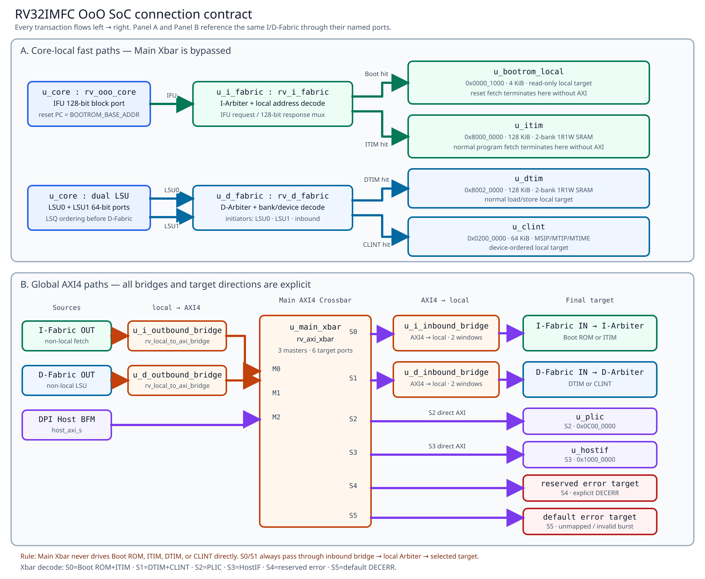](diagrams/soc-architecture.svg)

그림은 선이 되돌아가거나 교차하지 않도록 같은 물리 module을 두 관점으로 나누어 표현한다. 위쪽 A 패널은 Xbar를 사용하지 않는 core-local fast path이고, 아래쪽 B 패널의 `I-Fabric OUT/IN`, `D-Fabric OUT/IN`은 각각 위 패널에 표시한 동일한 `rv_i_fabric`, `rv_d_fabric`의 outbound/inbound port를 뜻한다. `I-Fabric`과 `I-Arbiter`는 직렬로 연결된 별도 RTL module이 아니다. `rv_i_fabric` module 안에 I-Arbiter, 주소 decode, response mux, Boot ROM과 ITIM 연결이 들어 있다. D 쪽도 같은 방식으로 `rv_d_fabric` 안에 D-Arbiter가 있다.

대표 요청 경로는 다음과 같다.

| 요청 | 왼쪽에서 오른쪽으로 읽는 실제 경로 |
|---|---|
| IFU reset fetch | `IFU → rv_i_fabric(I-Arbiter) → u_bootrom_local` |
| IFU normal ITIM fetch | `IFU → rv_i_fabric(I-Arbiter) → u_itim` |
| Host ELF write to ITIM | `DPI Host(M2) → u_main_xbar(S0) → u_i_inbound_bridge → rv_i_fabric.xbar_in_bus → I-Arbiter → u_itim` |
| LSU data access to ITIM | `LSU → rv_d_fabric OUT → u_d_outbound_bridge(M1) → u_main_xbar(S0) → u_i_inbound_bridge → rv_i_fabric → u_itim` |
| LSU local DTIM/CLINT | `LSU0/1 → rv_d_fabric(D-Arbiter) → u_dtim 또는 u_clint` |
| Host access to DTIM/CLINT | `DPI Host(M2) → u_main_xbar(S1) → u_d_inbound_bridge → rv_d_fabric → u_dtim 또는 u_clint` |
| LSU access to PLIC/HostIF | `LSU → rv_d_fabric OUT → u_d_outbound_bridge(M1) → u_main_xbar(S2/S3) → u_plic 또는 u_hostif` |
| Host access to PLIC/HostIF | `DPI Host(M2) → u_main_xbar(S2/S3) → u_plic 또는 u_hostif` |
| unmapped access | `M0/M1/M2 → u_main_xbar(S5) → u_default_error_target → zero data + DECERR` |
| future large SRAM | `M0/M1/M2/(future debug M3) → u_main_xbar(S4 재사용) → AXI SRAM controller → SRAM banks` |

Main Xbar는 Boot ROM, ITIM, DTIM, CLINT의 native port를 직접 구동하지 않는다. AXI4의 AW/W/B/AR/R channel을 단순한 `rv_local_mem_if` request/response로 바꾸기 위해 S0/S1 뒤에 반드시 `rv_axi_to_local_bridge`가 있다. 반대로 I/D-Fabric에서 non-local 주소로 나가는 local request는 `rv_local_to_axi_bridge`를 거쳐 M0/M1 AXI master transaction이 된다. local address는 Fabric에서 먼저 흡수하므로 outbound→inbound self-loop는 발생하지 않는다.

### 3.2 코어 내부 microarchitecture

[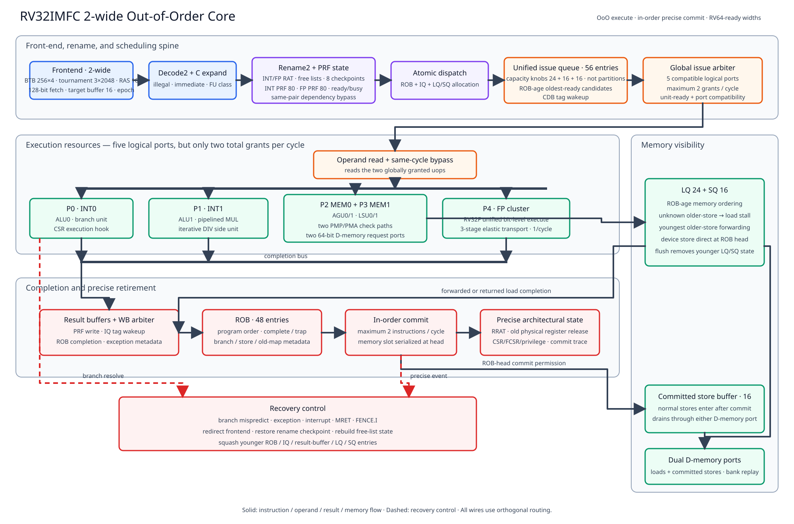](diagrams/core-microarchitecture.svg)

<details>
<summary>논리 연결 원본(Mermaid) 보기</summary>

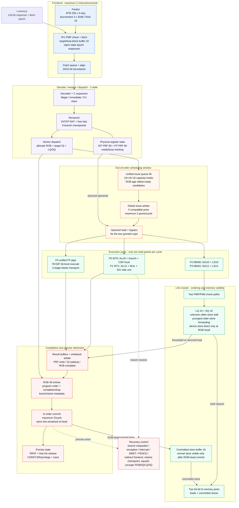
```mermaid
flowchart TB
    IMEM["I-memory<br/>128-bit response + fetch epoch"]

    subgraph FE["Frontend - maximum 2 instructions/cycle"]
      direction LR
      PRED["Predict<br/>BTB 256 x 4-way<br/>tournament 3 x 2048 / RAS 16"]
      FETCH["IFU PMP check + fetch<br/>target/loop block buffer 16<br/>reject stale epoch responses"]
      FQ["Fetch queue + align<br/>16/32-bit boundaries"]
      PRED --> FETCH --> FQ
    end

    subgraph DR["Decode / rename / dispatch - 2-wide"]
      direction LR
      DEC["Decode2 + C expansion<br/>illegal / immediate / FU class"]
      REN["Rename2<br/>INT/FP RAT + free lists<br/>8 branch checkpoints"]
      PRF["Physical register state<br/>INT PRF 80 + FP PRF 80<br/>ready/busy tracking"]
      DISP["Atomic dispatch<br/>allocate ROB + target IQ + LQ/SQ"]
      DEC --> REN --> DISP
      REN --- PRF
    end

    subgraph WINDOW["Out-of-order scheduling window"]
      direction LR
      IQ["Unified issue queue 56<br/>24+16+16 capacity knobs<br/>ROB-age oldest-ready candidates"]
      ARB["Global issue arbiter<br/>5 compatible ports<br/>maximum 2 grants/cycle"]
      OPR["Operand read + bypass<br/>for the two granted uops"]
      IQ --> ARB --> OPR
    end

    subgraph EX["Execution ports - only two total grants per cycle"]
      direction LR
      INTEX["P0 INT0: ALU0 + branch + CSR hook<br/>P1 INT1: ALU1 + MUL + DIV side unit"]
      MEMEX["P2 MEM0: AGU0 + LSU0<br/>P3 MEM1: AGU1 + LSU1"]
      FPEX["P4 unified FP pipe<br/>RV32F bit-level execute<br/>3-stage elastic transport"]
    end

    subgraph MEM["LSU cluster - ordering and memory visibility"]
      direction LR
      PMP["Two PMP/PMA check paths"]
      LSQ["LQ 24 + SQ 16<br/>unknown older-store stall<br/>youngest older-store forwarding<br/>device store direct only at ROB head"]
      SB["Committed store buffer 16<br/>normal store visible only after ROB-head commit"]
      DMEM["Two 64-bit D-memory ports<br/>loads + committed stores"]
      PMP --> LSQ
      LSQ -->|"load request"| DMEM
      SB -->|"committed store"| DMEM
    end

    subgraph RETIRE["Completion and precise retirement"]
      direction LR
      WBA["Result buffers + writeback arbiter<br/>PRF write / IQ wakeup / ROB complete"]
      ROB["ROB 48 entries<br/>program order + completion/trap<br/>branch/store metadata"]
      COMMIT["In-order commit<br/>maximum 2/cycle<br/>store slot serialized at head"]
      ARCH["Precise state<br/>RRAT + free-list release<br/>CSR/FCSR/privilege + trace"]
      WBA --> ROB --> COMMIT --> ARCH
    end

    REC["Recovery control<br/>branch mispredict / exception / interrupt / MRET / FENCE.I<br/>redirect frontend, restore checkpoint, squash younger ROB/IQ/LQ/SQ"]

    IMEM --> FETCH
    FQ --> DEC
    DISP --> IQ
    DISP --> ROB
    PRF -->|"physical operands"| OPR

    OPR --> INTEX
    OPR --> MEMEX
    OPR --> FPEX

    INTEX --> WBA
    FPEX --> WBA
    MEMEX --> PMP
    LSQ -->|"forwarded or returned load"| WBA
    COMMIT -->|"ROB-head normal store"| SB

    INTEX -.->|"branch resolve"| REC
    COMMIT -.->|"precise event"| REC

    classDef frontend fill:#e8f2ff,stroke:#2563eb,color:#111827;
    classDef rename fill:#f5f3ff,stroke:#7c3aed,color:#111827;
    classDef window fill:#fff7ed,stroke:#ea580c,color:#111827;
    classDef execute fill:#ecfdf5,stroke:#059669,color:#111827;
    classDef retire fill:#fef2f2,stroke:#dc2626,color:#111827;
    class PRED,FETCH,FQ frontend;
    class DEC,REN,PRF,DISP rename;
    class IQ,ARB,OPR window;
    class INTEX,MEMEX,FPEX,PMP,LSQ,SB,DMEM execute;
    class WBA,ROB,COMMIT,ARCH,REC retire;
```

</details>

실선은 instruction/operand/result의 정상 dataflow를, 점선은 branch·trap recovery 같은 control path를 뜻한다. 여러 블록을 돌아가는 화살표가 그림을 가리지 않도록 CDB의 `PRF write / IQ wakeup / ROB complete`와 recovery control의 `frontend redirect / checkpoint restore / younger-state squash`는 각 블록 라벨에 피드백 책임을 묶어 표시했다. `P0..P4`는 동시에 모두 발행되는 5-wide 구조가 아니라, global arbiter가 호환되는 후보 중 매 cycle 최대 2개만 선택하는 execution port다. ROB는 program order를 소유하고 실행은 IQ에서 out-of-order로 진행하며, architectural state와 store의 외부 가시성은 ROB head commit에서만 확정된다.

### 3.3 초기 physical memory map

| 시작 주소 | 끝 주소 | 크기 | 대상 | 속성 |
|---:|---:|---:|---|---|
| `0x0000_1000` | `0x0000_1FFF` | 4 KiB | Boot ROM | RX, reset vector |
| `0x0200_0000` | `0x0200_FFFF` | 64 KiB | CLINT-compatible | device, strongly ordered |
| `0x0C00_0000` | `0x0C3F_FFFF` | 4 MiB | PLIC | device, 32-bit register access |
| `0x1000_0000` | `0x1000_0FFF` | 4 KiB | HostIF | device, DPI mailbox/console |
| `0x8000_0000` | `0x8001_FFFF` | 128 KiB | ITIM | RWX, 2-bank 1R1W |
| `0x8002_0000` | `0x8003_FFFF` | 128 KiB | DTIM | RW, optional X by PMP policy |
| 현재 미할당 | - | - | Xbar S4 reserved | future large SRAM/DDR controller slot |
| 그 외 | - | - | Error slave | AXI `DECERR`, core access fault |

`mtvec`의 boot 값과 ITIM base는 모두 `0x8000_0000`이다. CLINT는 표준적인 `0x0200_0000` base를 사용하므로 MSIP는 `0x0200_0000`, MTIMECMP low/high는 `0x0200_4000`/`0x0200_4004`, MTIME low/high는 `0x0200_BFF8`/`0x0200_BFFC`에 위치한다. 주소는 `rv_soc_pkg` 한 곳에서 정의하고 생성 스크립트가 SW·BootROM·검증 설정에 동일하게 반영한다.

서버 HTIF 모드에서는 DTIM의 첫 두 64-bit word를 mailbox로 예약한다.
`TOHOST_ADDR=0x8002_0000`, `FROMHOST_ADDR=0x8002_0008`이며 별도 address-decode
slave가 아니다. 따라서 ELF linker script는 일반 `.data/.bss`를 `0x8002_0010`
이후에 배치하거나 명시적인 `.htif` section으로 첫 16 bytes를 소유해야 한다.

### 3.4 Address parameterization

모든 region은 `rtl/soc/rv_soc_pkg.sv`에 `*_BASE_ADDR`와 `*_SIZE_KB`로 정의한다. byte 수와 exclusive end address는 package가 파생한다.

```systemverilog
parameter logic [31:0] ITIM_BASE_ADDR   = 32'h8000_0000;
parameter int unsigned ITIM_SIZE_KB     = 128;
parameter logic [31:0] DTIM_BASE_ADDR   = 32'h8002_0000;
parameter int unsigned DTIM_SIZE_KB     = 128;
parameter logic [31:0] TOHOST_ADDR      = 32'h8002_0000;
parameter logic [31:0] FROMHOST_ADDR    = 32'h8002_0008;
parameter logic [31:0] HOSTIF_BASE_ADDR = 32'h1000_0000;
parameter int unsigned HOSTIF_SIZE_KB   = 4;
parameter int unsigned AXI_PROGRESS_TIMEOUT_CYCLES = 4096;
```

동일 방식으로 Boot ROM, CLINT, PLIC, HostIF를 정의한다. CLINT/PLIC/HostIF 내부 register offset도 package constant만 사용한다. address hit는 `base <= addr < base + size_bytes`인 half-open range로 비교한다.

`rv_soc_top`은 package 값을 default parameter로 다시 노출한다. 따라서 사용자는 다음 두 방법을 쓸 수 있다.

1. 프로젝트 공통 memory map 변경: `rv_soc_pkg.sv`의 default 값 수정
2. 특정 test/instance만 변경: `rv_soc_top #(.ITIM_BASE_ADDR(...))` override

모든 하위 fabric/peripheral에는 top parameter를 전달하며 하위 module이 package default를 다시 참조해 override를 무시하지 않게 한다. elaboration check module은 다음을 `$fatal`로 검사한다.

- 모든 size가 0보다 크고 KiB 단위인지
- 모든 region의 base가 최소 4 KiB aligned인지
- 모든 region pair가 overlap하지 않는지
- TIM size가 16-byte block과 2-bank interleave 조건을 만족하는지
- `BOOT_MTVEC_ADDR`가 ITIM range 안이고 4-byte aligned인지
- TOHOST/FROMHOST가 서로 다른 8-byte aligned word이고 DTIM 안에 있는지
- 32-bit address에서 `base + size`가 overflow하지 않는지

SystemVerilog testbench는 package/top parameter 값을 DPI-C `host_config()` 인자로 넘긴다. ELF의 실제 적재 주소는 `PT_LOAD.p_paddr`, 없으면 `p_vaddr`가 결정하므로 software linker map도 RTL map과 같아야 한다. 기본 저장소의 directed fixture에는 기본 주소 literal이 일부 남아 있지만, 아래 프로젝트 생성기는 새 복사본의 C linker script, C/assembly MMIO 주소와 commit-filter ITIM base를 같은 설정으로 다시 쓴다.

### 3.5 대화형 project configurator와 Windows/Linux 재현 계약

`scripts/configure_project.py`는 Python 표준 라이브러리만 사용하는 공통 생성기다. Windows는 `scripts/configure_project.ps1`, Linux는 `scripts/configure_project.sh`가 이 Python entry point를 호출한다. 원본 tree 내부 또는 이미 존재하는 출력 폴더에는 쓰지 않으며 `.git`, build/out/obj_dir와 Python cache를 제외한 새 복사본을 만든다.

대화형 질문 항목은 project name, BootROM/CLINT/PLIC/HostIF/ITIM/DTIM의 base와 KiB size, boot mtvec, BootROM HEX, Host payload folder, 기본 ELF, artifact folder, simulation timeout이다. `auto` BootROM을 선택하면 생성기가 `mtvec`을 적재하고 `mie.MSIE`, `mstatus.MIE`를 켠 뒤 WFI loop에 들어가는 RV32 image를 현재 주소에 맞춰 인코딩한다. 사용자가 별도 HEX를 지정하면 `config/assets/bootrom.hex`로 복사한다.

생성 결과의 source of record는 `config/soc_project.json`이다. 다음 산출물이 같은 transaction에서 생성되거나 갱신된다.

| 산출물 | 역할 |
|---|---|
| `rtl/soc/rv_soc_pkg.sv` | 합성 RTL의 모든 region base/size와 boot mtvec |
| `sw/tests/rv32_c_loop/rv32_tim.ld` | ELF ITIM/DTIM `MEMORY` layout과 stack top |
| C/assembly smoke source | HostIF access, CLINT MSIP clear 주소 |
| `config/soc_memory_map.h/.inc` | 이후 firmware가 포함할 C/assembly 상수 |
| `config/assets/bootrom.hex` | 선택한 map에 대응하는 BootROM image |
| `config/soc_project.env` | Linux Host runner 기본 ELF/artifact/timeout |
| `scripts/run_configured_elf.ps1/.sh` | Windows/Linux DPI ELF 실행 entry point |

Host ELF를 생성 시 지정하면 외부 절대 경로를 설정에 남기지 않고 새 project의 `host/payload/` 아래로 복사한다. DPI-C는 실행 시 `+elf=<copied ELF>`로 파일을 열고 ELF header의 `PT_LOAD` 주소에 따라 ITIM/DTIM에 올린다. 즉 Host가 ELF를 읽는 **파일 위치**는 project config가, core memory에 올라가는 **주소 위치**는 linker script와 ELF program header가 소유한다. 이 둘을 구분해야 한다.

생성 전 Python validator와 생성 후 `rv_soc_map_check`가 4 KiB 정렬, non-zero size, 32-bit overflow, region overlap, TIM 2-bank divisibility, mtvec-in-ITIM을 중복 검사한다. Python은 추가로 CLINT가 `mtime`까지, PLIC가 M/S context register까지 포함하는 최소 aperture인지 확인한다. Linux DPI runner는 PATH의 Verilator/GNU make/g++를 사용하며 Windows runner는 기존 Verilator/w64devkit 경로 parameter를 그대로 받는다.

```powershell
scripts/configure_project.ps1
```

```bash
./scripts/configure_project.sh --non-interactive \
  --config config/soc_project.example.json \
  --output ../company_rv_core
cd ../company_rv_core
./scripts/run_configured_elf.sh /path/to/program.elf
```

### 3.6 Xcelium `verilog_sub` 실행 계약

`verilog_sub`는 전달 폴더 이름이 아니라 회사 Linux 서버에서 Xcelium을 실행하는
wrapper command로 정의한다. 신규 기준 entry는 `sim/xcelium/run_verilog_sub.sh`다.
사용자는 script 상단 `BINARY=`에 RISC-V ELF 절대경로 하나만 지정한다. script는
`elf_loader.cpp`를 PIC shared library로 빌드한 뒤 `verilog_sub`에 다음 항목을 넘긴다.

- `sim/xcelium/rtl.f`: 합성 RTL compile order
- `sim/xcelium/htif_tb.f`: DPI Host와 `rv_soc_htif_dpi_tb`
- `-top rv_soc_htif_dpi_tb`
- `-sv_lib <libcore_htif_dpi.so>`
- `+elf=<BINARY>`와 timeout plusarg

`setup_env.sh`는 자신의 실제 위치에서 `CORE_ROOT`, `RTL_DIR`, `TB_DIR`,
`XCELIUM_DIR` 절대경로를 계산한다. 두 `.f` 파일은 `$RTL_DIR/backend/...`와
`$TB_DIR/e2e/...` 형식만 사용하므로 checkout 위치나 사용자 이름에 의존하지 않는다.

```bash
vi sim/xcelium/run_verilog_sub.sh   # BINARY=/server/path/program.elf
chmod +x sim/xcelium/*.sh
./sim/xcelium/run_verilog_sub.sh
```

server wrapper가 xrun-compatible option을 그대로 받는 것을 기본 계약으로 한다.
wrapper가 별도 sub-command를 요구하면 runner 마지막의 단일 `exec verilog_sub ...`
부분만 회사 형식에 맞춘다. 과거 `sources_core.f`, `sources_soc.f`,
`run_xcelium.sh`는 기존 직접-xrun flow 호환을 위해 유지하지만 신규 경로의 기준은
`setup_env.sh`, `rtl.f`, `htif_tb.f`, `run_verilog_sub.sh` 네 파일이다. 개발 PC에는
Xcelium이 없으므로 actual Cadence invocation은 server gate이며, 동일한 TB/DPI의
ELF load, direct-string print, proxy write syscall, TOHOST=1 종료는 Verilator E2E로
기능 검증한다.

## 4. 기준 파라미터

| 파라미터 | 기본값 | 근거 |
|---|---:|---|
| `XLEN` | 32 | 1차 RV32, 허용값 32/64 |
| Front/rename/dispatch width | 2 | 목표 issue 폭과 정렬 |
| Global issue width | 2 | 클러스터 전체 합산 최대 2 uop/cycle |
| Commit width | 2 | 정상 경로 2 inst/cycle |
| ROB entries | 48 | 지연 은닉과 초기 구현 복잡도의 절충 |
| Integer physical registers | 80 | x0 포함 32 architectural + 최대 48 speculative destination |
| FP physical registers | 80 | 32 architectural + speculative destination |
| Integer IQ capacity knob | 24 | 현재 unified IQ 총량에 더하는 구성값 |
| Memory IQ capacity knob | 16 | 현재 별도 partition이 아닌 총량 구성값 |
| FP IQ capacity knob | 16 | 현재 별도 partition이 아닌 총량 구성값 |
| Load queue | 24 | dual LSU의 speculative load 추적 |
| Store queue | 16 | 두 store address/data update와 forwarding |
| Committed store buffer | 16 | dual enqueue와 cache backpressure 흡수 |
| Branch checkpoints | 8 | RAT/free-list 즉시 복구 |
| Fetch block | 16 bytes | C 포함 2개 이상 명령어 정렬 여유 |
| Fetch queue | 64 bytes | TIM/AXI 응답과 decode decouple |
| Target/loop block buffer | 16 × 16 bytes, direct-mapped | correct predicted-taken target의 재요청/리필 지연 제거 |
| ITIM / DTIM | 각 128 KiB | 초기 deterministic memory |
| TIM banks | 2 × 64-bit 1R1W | dual fetch/data bandwidth |
| Main AXI | A32/D64/ID6 | Host burst와 16-byte fetch 지원 |
| I outstanding fetch | 1 block | 현재 PMP/fabric response ordering baseline; 2~4개는 후속 확장 |
| RAS | 16 entries | call/return 예측 |
| BTB | 256 entries, 4-way | 강한 IFU 기준선 |
| Direction predictor | 2 Ki bimodal + 2 Ki gshare + 2 Ki chooser tournament, 2-bit | local/global branch 특성에 적응 |
| PLIC sources | 32 | source 0 reserved, M-context 1 |
| PMP entries | 8 | M/U 초기 protection |

모든 용량은 parameter로 노출하되, 검증 configuration은 무분별하게 늘리지 않는다. 최초 sign-off 구성은 `rv32_default`와 `rv64_smoke` 두 개다.

### 4.1 Issue 폭 고정 범위

현재 제품/검증 baseline은 fetch, decode, rename, dispatch, global issue와 commit이 모두
**2-wide**인 구조로 고정한다. `ISSUE_WIDTH=4` 같은 단일 parameter 변경으로 4-wide가
되는 구조가 아니며, 4-issue는 현재 요구사항과 구현 milestone에서 제외한다. RTL의
여러 architectural bundle이 명시적인 `[1:0]` port인 것은 의도된 interface 계약이다.
`XLEN=64` 확장 가능하다는 표현은 register/data/주소 관련 폭을 넓힐 수 있다는 뜻이지
issue 폭 확장을 뜻하지 않는다. 향후 별도 프로젝트에서 폭을 넓힐 경우 frontend,
rename intra-bundle dependency, PRF port, ROB prefix commit, checkpoint와 completion
arbitration을 함께 재설계하고 새 verification configuration으로 취급해야 한다.

### 4.2 Package encoding과 폭 계약

재구현 시 enum의 선언 순서를 바꾸면 decode, issue mask, trace와 testbench가 동시에
깨질 수 있으므로 아래 값은 wire encoding으로 고정한다. 명시하지 않은 reserved 값은
생성하지 않으며 입력에서 발견되면 illegal/default 처리한다.

| Type | 값 |
|---|---|
| `exec_port_e` | `INT0=0`, `INT1=1`, `MEM0=2`, `MEM1=3`, `FP=4` |
| `fu_class_e` | `NONE=0`, `INT=1`, `BRANCH=2`, `MUL=3`, `DIV=4`, `LOAD=5`, `STORE=6`, `FP=7`, `CSR=8`, `FENCE=9` |
| `reg_class_e` | `NONE=0`, `INT=1`, `FP=2` |
| `inst_len_e` | `NONE=0`, `16=1`, `32=2` |
| `privilege_e` | `U=2'b00`, `S=2'b01`, `M=2'b11` |
| `csr_cmd_e` | `NONE=0`, `WRITE=1`, `SET=2`, `CLEAR=3` |
| `multiply_op_e` | `LOW=0`, `HIGH_SS=1`, `HIGH_SU=2`, `HIGH_UU=3` |
| `divide_op_e` | signed quotient=0, unsigned quotient=1, signed remainder=2, unsigned remainder=3 |
| `axi_resp_e` | `OKAY=00`, `EXOKAY=01`, `SLVERR=10`, `DECERR=11` |
| `soc_target_e` | I-local=0, D-local=1, PLIC=2, HostIF=3, reserved=4, error=5 |
| `host_event_e` | TOHOST=0, EXIT=1, CONSOLE_TX=2, RESERVED=3 |

`int_alu_op_e`는 ADD, SUB, SLT, SLTU, XOR, OR, AND, SLL, SRL, SRA,
COPY_SRC0, COPY_SRC1 순서로 `0..11`이고 `branch_op_e`는 NONE, EQ, NE, LT,
GE, LTU, GEU, JAL, JALR 순서로 `0..8`이다. exception cause는 RISC-V 값을
그대로 사용한다: instruction misaligned/access/illegal/breakpoint=`0/1/2/3`,
load misaligned/access=`4/5`, store misaligned/access=`6/7`, ECALL U/S/M=`8/9/11`.

`lsq_stall_reason_e`는 NONE, UNKNOWN_ADDR, STORE_DATA, PARTIAL_OVERLAP,
BANK_CONFLICT, DEVICE_SERIALIZE 순서의 `0..5`다. local fabric의
`mem_replay_reason_e`는 NONE, BANK_CONFLICT, UNKNOWN_STORE, STORE_DATA,
PARTIAL_OVERLAP, FLUSHED 순서의 `0..5`다. 현재 D-Fabric은 충돌 request를
handshake하지 않는 backpressure 방식을 우선 사용하므로 replay 값은 주로 bridge와
향후 decoupled memory 경로의 계약으로 남는다.

`prediction_meta_t`의 packed field는 `valid`, `taken`, `bimodal_taken`,
`global_taken`, `use_global`, `is_call`, `is_return`, `target[63:0]`,
`global_history[10:0]`, `btb_index[7:0]`, `ras_pointer[3:0]`,
`ras_count[4:0]` 순서다. `target`은 RV32에서도 64-bit로 저장하며 consumer가
`[XLEN-1:0]`만 사용한다. 현재 RTL은 별도의 `decoded_uop_t` package struct를
사용하지 않고 동일 필드를 `rv_decode2`의 flattened port로 전달한다.

## 5. 파이프라인

### 5.1 정상 ITIM-hit 경로

| 단계 | 이름 | 주요 동작 |
|---:|---|---|
| F0 | Predict | next PC, BTB, bimodal/gshare/chooser, RAS lookup |
| F1 | ITIM | PMP/PMA check, 2-bank ITIM read 또는 AXI request |
| F2 | IFData | 128-bit data 반환, fetch queue 삽입 |
| F3 | Align | 16/32-bit 경계 검출, 최대 2개 instruction 추출 |
| D0 | Decode | C expand, opcode decode, immediate 생성, early illegal 검출 |
| R0 | Rename | RAT lookup, physical destination allocation, intra-pair dependency bypass |
| D1 | Dispatch | ROB/IQ/LQ/SQ를 원자적으로 할당 |
| I0 | Select | ready wakeup, age 기반 select, global 2-uop grant |
| E0..n | Execute | ALU/BRU 1, MUL 2, DIV variable, FPU fast 5-stage(현재 LATENCY=5), load 3+ cycles |
| W0 | Writeback | PRF write, dependent wakeup, ROB completion |
| C0 | Commit | head부터 최대 2개 retire, RRAT/CSR/fflags 갱신 |

동일 cycle의 두 rename lane 사이에는 lane 0의 새 destination을 lane 1 source가 참조할 수 있어야 한다. 두 instruction이 같은 architectural destination을 쓰면 lane 1이 최종 speculative mapping이 된다.

### 5.2 backpressure

다음 자원 중 하나라도 두 lane 전체를 수용하지 못하면 dispatch bundle을 부분 삽입하지 않고 stall한다.

- ROB free entry
- 필요한 integer/FP physical destination
- 대상 IQ entry
- load/store인 경우 LQ/SQ entry
- branch checkpoint

lane 0만 유효하거나 lane 1이 decode 단계에서 제거된 경우에는 실제 유효 uop 수만 검사한다. architectural instruction을 여러 uop으로 분해하는 기능은 초기 버전에 사용하지 않으며, 필요해질 경우 dispatch 전에 uop count를 확정한다.

## 6. Frontend

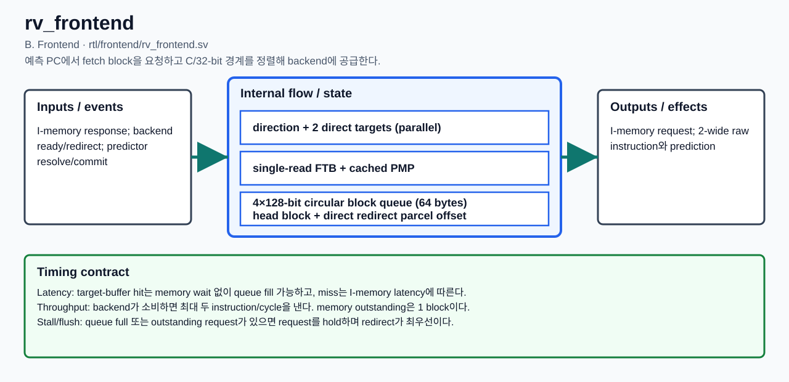

### 6.1 fetch와 정렬

- fetch PC는 2-byte aligned여야 한다.
- local ITIM fetch block은 16-byte aligned 128-bit이며 bank0/1에서 64-bit씩 같은 cycle에 읽는다.
- fetch queue는 64 byte를 4개의 128-bit aligned block으로 보유하고 SRAM/AXI 응답과 decode backpressure를 분리한다. `head_block_q`, `tail_block_q`, `block_count_q`, `head_parcel_offset_q`가 위치와 점유량을 나타낸다. consume 때 전체 배열을 shift하지 않고 현재/다음 block을 이어 붙여 최대 4개의 16-bit parcel을 추출한다.
- block 경계를 넘는 32-bit instruction은 circular queue의 연속 두 parcel에서 조립한다.
- aligner는 cycle당 최대 2개 architectural instruction을 출력하고, 16/32-bit 길이 조합을 모두 지원한다.
- 각 instruction에는 `pc`, raw instruction, expanded instruction, original length, prediction metadata, fetch fault를 부착한다.
- C expansion은 decode 입력에서 canonical 32-bit instruction으로 변환하지만 original raw bits와 length는 trace/exception을 위해 보존한다.
- taken prediction 뒤의 동일 bundle younger instruction은 무효화한다.
- redirect는 fetch epoch를 증가시키며 이전 epoch의 outstanding AXI response를 폐기한다.
- 현재 IFU는 instruction request 한 block만 outstanding으로 둔다. response를 accept하는 cycle에는 다음 request를 동시에 accept할 수 있다.
- predicted-taken redirect cycle에 request slot이 비어 있거나 기존 response가 끝나면 target block request를 즉시 발행한다.
- target/loop block buffer가 hit하면 외부 request 없이 redirect와 같은 edge에 해당 16-byte block을 fetch queue에 원자적으로 적재한다.
- non-local fetch는 64-bit AXI beat 두 개의 INCR burst로 16-byte block을 만든다. 2~4 outstanding은 PMP fault response와 I-Fabric response ordering table을 함께 확장한 뒤 적용한다.

ITIM bank mapping은 64-bit beat 기준으로 `bank = address[3]`, `row = (address - ITIM_BASE)[16:4]`이다. 16-byte aligned IFU fetch는 bank0과 bank1을 한 번씩 읽으므로 매 cycle 128-bit 공급이 가능하다.

### 6.2 I-Arbiter

I local fabric은 IFU request와 Main Xbar inbound access를 Boot ROM 또는 ITIM에 연결하고, 두 I-local window 밖의 IFU request만 AXI master로 내보낸다. Boot ROM은 reset fetch latency와 Xbar 의존성을 줄이기 위해 `rv_i_fabric` 내부 local target으로 둔다.

- Boot ROM local port: IFU 128-bit block을 두 64-bit read로 조립한다. Xbar inbound Boot ROM access와는 한 요청씩 serialize하며 write는 SLVERR다.
- ITIM bank별 read port: IFU fetch와 AXI inbound read가 경쟁한다.
- ITIM bank별 write port: AXI inbound write가 사용하며 IFU read와 1R1W로 동시 수행할 수 있다.
- IFU read 우선이 기본이지만 inbound read가 8회 연속 대기하면 한 번 grant하는 bounded fairness를 적용한다.
- Host ELF loading은 코어가 Boot ROM의 WFI에 있을 때 수행하므로 정상 boot에서는 IFU/Host ITIM 충돌이 없다.
- 실행 중 Host가 ITIM을 수정할 경우 software halt 또는 store completion 뒤 `FENCE.I`가 필요하다.
- AXI inbound burst는 64-bit beat로 분해해 bank write/read로 변환하고 ID와 beat 순서를 response queue에 유지한다.

불변조건:

- 한 ITIM bank의 read port와 write port는 각각 cycle당 최대 한 번만 grant된다.
- `valid && !ready`인 request/response payload는 변하지 않는다.
- flush된 epoch의 fetch data는 decode queue에 들어갈 수 없다.
- fetch fault는 해당 instruction의 ROB entry까지 전달되며 speculative fetch 시점에 즉시 trap하지 않는다.
- architectural redirect와 `FENCE.I`는 target/loop block buffer valid를 모두 지운다.
- predicted redirect와 current memory response가 겹치면 old-path response는 queue에 넣지 않고 수락하여 outstanding slot만 해제한다. target-buffer block이 redirect+fill 경로를 단독 사용한다.

### 6.3 Target/loop block buffer

`rv_fetch_target_buffer`는 16-byte fetch block 16개를 보존하는 direct-mapped 구조다. 각 entry는 valid, physical block tag, 128-bit data와 fetch 당시의 8-bit PMP parcel allow mask를 저장하며 기본 용량은 `IF_TARGET_BUFFER_ENTRIES`로 parameter화한다. 이는 일반적인 coherent I-cache가 아니라, 이미 정상 응답을 받은 backward branch target을 짧게 재사용해 correct predicted-taken branch마다 64-byte queue 전체를 다시 채우는 비용을 줄이는 frontend 전용 buffer다.

memory response가 current epoch이고 OKAY일 때 `outstanding_addr_q`의 aligned block과 그 response에 대해 계산한 PMP parcel mask를 fill한다. 두 lane의 direct target은 direction PHT와 병렬로 미리 계산해 두 lookup address를 만들지만, direction이 정해진 뒤 선택된 entry의 128-bit data RAM만 한 번 읽는다. 이는 두 개의 wide read mux와 마지막 128-bit lane mux를 만들지 않으면서 target address 계산을 direction 결정과 겹친다. hit이면 `redirect_valid_i`와 `fill_valid_i`를 fetch queue에 함께 보내고 저장된 PMP mask도 같이 복원한다. queue는 old-path parcel을 전부 폐기한 뒤 target PC가 가리키는 block offset 이전 parcel을 건너뛰고 나머지 block을 같은 edge에 적재한다. 따라서 별도 replay register와 redirect 직후의 강제 empty cycle이 없다. sequential request pointer는 target 다음 block으로 이동한다. miss이면 redirect cycle request slot을 사용할 수 있을 때 target request를 즉시 보낸다. old-epoch response는 queue와 buffer를 갱신하지 않고 slot만 해제한다.

FTB hit에서 PMP comparator를 다시 직렬 통과시키지 않는 것이 timing 최적화의 핵심이다. PMP configuration write, trap/interrupt privilege 진입, `MRET`, `FENCE.I`는 모두 architectural redirect를 만들고 그 redirect가 FTB valid 전체를 먼저 지운다. 따라서 권한이나 privilege가 바뀐 뒤 이전 allow mask가 재사용될 수 없다. 이 invalidate 불변조건을 깨는 새 privilege 전이가 추가된다면 반드시 같은 redirect/invalidate 계약에 포함해야 한다.

direct-mapped 16-entry와 32-entry CoreMark A/B는 각각 548,343 cycle과 548,318 cycle로 차이가 25 cycle뿐이었다. 따라서 추가 256-byte data/tag 면적을 정당화하지 못해 16-entry를 기본값으로 유지했다. 실행 중 Host/LSU가 ITIM을 수정한 뒤에는 반드시 `FENCE.I`를 실행해야 하며, architectural redirect가 buffer 전체를 invalidate하므로 self-modifying code가 stale block을 재사용하지 않는다.

### 6.4 branch predictor

초기 predictor는 다음 세 요소를 사용한다.

- 256-entry 4-way BTB: tag, target, branch type, instruction length
- 2048-entry PC-indexed 2-bit bimodal PHT
- 2048-entry 2-bit gshare PHT와 11-bit global history
- 2048-entry PC-indexed 2-bit chooser: bimodal과 gshare가 다를 때 맞은 component 쪽으로 학습
- 16-entry RAS: JAL/JALR hint에 따른 call/return 추적

conditional branch는 chooser가 bimodal 또는 gshare 결과를 선택한다. resolve 시 두 PHT를 모두 실제 결과로 학습하고, 두 component의 예측이 달랐을 때만 chooser를 갱신한다. `prediction_meta_t`는 IQ와 backend의 ROB-sequence-indexed branch table이 실행 완료까지 보관하므로 학습은 lookup 당시 판단을 기준으로 한다. ROB entry 자체에는 이 metadata가 없다. 예측기는 speculative history와 committed/recovery state를 구분한다. branch resolve 시 direction 또는 target이 틀리면 해당 branch checkpoint로 rename state와 predictor history를 복구하고 younger state를 flush한다.

## 7. Decode와 명령어 표현

decode 결과는 최소 다음 제어 정보를 가진다.

- instruction class와 functional-unit class
- integer/FP source 최대 3개와 destination 1개
- immediate와 PC-relative 여부
- branch/jump type와 predicted target/direction
- load/store size, sign extension, fence 속성
- CSR address와 read/write semantics
- FP rounding mode와 fflags write 여부
- serializing, illegal, fetch fault 표시

초기 구현은 macro-op fusion을 사용하지 않는다. C는 별도 uop이 아니라 32-bit canonical instruction으로 확장한다.

### 7.1 현재 decoder/commit 구현 범위

아래 표는 장기 ISA 목표가 아니라 2026-09-10 RTL의 실제 경로다. “decode”만 된
명령과 ROB-head에서 architectural completion까지 되는 명령을 구분한다.

| 그룹 | 현재 completion 경로 | 비고 |
|---|---|---|
| RV32I integer | LUI/AUIPC/JAL/JALR, 6 branch, LB/LH/LW/LBU/LHU, SB/SH/SW, OP-IMM/OP | natural-aligned memory만 지원 |
| RV64 base hook | LD/LWU/SD, OP-IMM-32, OP-32 | `XLEN=64` elaboration 경로이며 SoC sign-off 대상은 아직 RV32 |
| M | MUL/MULH/MULHSU/MULHU, DIV/DIVU/REM/REMU 및 RV64 W forms | MUL 2-stage, DIV iterative |
| F | FLW/FSW, FADD.S/FSUB.S/FMUL.S/FDIV.S/FSQRT.S, FMADD family, sign/min/max/compare/class/convert/move | unified 3-stage transport, full differential sign-off 전 |
| C | `rv_c_expander`가 legal RV32C를 canonical instruction으로 변환 | raw 16-bit는 predictor/trace, canonical 32-bit는 execute에 사용 |
| Zicsr/system | 6 CSR RMW forms, ECALL, EBREAK/C.EBREAK, MRET, WFI | CSR/system은 ROB head에서 serialize |
| Zifencei | FENCE, FENCE.I | conservative D-memory drain + retire redirect |
| 예외 | fetch/access/illegal, breakpoint, address-misaligned, ECALL U/M | precise ROB-head trap |

현재 gap을 숨기지 않는다. `HAS_SMODE=1`에서 SRET decode와 PLIC S-context는
열리지만 S-mode CSR/delegation 및
SRET completion은 미구현이므로 기본값은 반드시 0이다. `debug_halt_req_i`는 새
dispatch를 막는 quiesce 입력일 뿐 Debug Module/abstract command/resume 기능이 아니다.
A/B/V/D, misaligned split access, MMU/page fault는 범위 밖이다.

## 8. Rename, PRF, free list

### 8.1 목적

rename은 architectural register 이름의 false dependency인 WAR/WAW를 제거한다. 실제 RAW dependency만 physical tag로 남기므로 younger independent instruction이 older long-latency instruction을 추월해 실행할 수 있다. RRAT은 commit된 architectural mapping, RAT은 speculative mapping을 나타낸다.

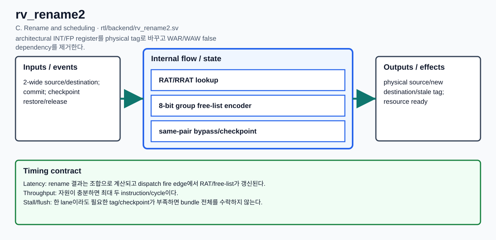

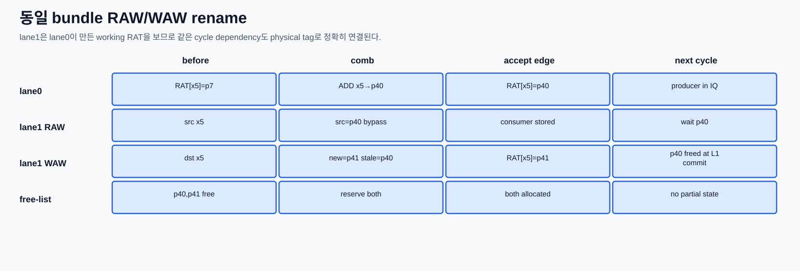

### 8.2 보관 상태

| 상태 | 크기 | 내용 |
|---|---:|---|
| Integer RAT/RRAT | 각 32 × 7-bit | x0..x31 → p0..p79 |
| FP RAT/RRAT | 각 32 × 7-bit | f0..f31 → fp0..fp79 |
| Integer PRF | 80 × XLEN | speculative/committed integer value |
| FP PRF | 80 × 32 | F-extension value, `FLEN=32` |
| Free list | INT/FP 각 80 bits+allocator | 사용 가능한 physical register |
| Busy/ready table | INT/FP 각 80 bits | producer writeback 완료 여부 |
| Branch checkpoint | 8 entries | `rv_rename2`의 INT/FP RAT와 free bitmap snapshot; predictor/queue는 sequence 기반 별도 복구 |

x0는 zero 전용 physical register p0에 고정하고 ready=1/value=0으로 유지한다. destination x0에는 새 physical register를 할당하지 않는다.

### 8.3 2-wide rename 상태 전이

1. lane0과 lane1의 source architectural register로 현재 RAT을 읽는다.
2. destination이 있는 lane마다 free-list에서 새 physical tag를 할당한다.
3. lane1 source가 lane0 destination과 같으면 RAM/RAT read 결과 대신 lane0의 새 tag를 bypass한다.
4. 두 lane destination이 같으면 lane1의 stale tag는 lane0의 새 tag이고, 최종 RAT mapping은 lane1의 새 tag다.
5. 각 ROB entry에 architectural destination, new tag, stale tag를 기록한다.
6. 새 tag의 ready를 0으로 만들고 dispatch가 원자적으로 성공한 경우에만 RAT/free-list를 갱신한다.
7. writeback이 승인되면 PRF value를 기록하고 ready를 1로 만든다.
8. commit 시 RRAT을 new tag로 갱신하고 stale tag를 free-list에 반환한다.

dispatch에 필요한 ROB/IQ/LSQ/checkpoint 중 하나라도 부족하면 두 lane 모두 rename state를 변경하지 않는다. lane0만 부분 할당한 뒤 lane1 실패로 되돌리는 동작은 금지한다.

### 8.4 recovery

- branch mispredict: branch checkpoint의 RAT/free-list allocation state를 복원하고 younger ROB/IQ/LQ/SQ entry를 무효화한다.
- exception: exception instruction이 ROB head일 때 RRAT→RAT 복사, committed allocation bitmap→free-list 복구 후 전체 speculative state를 flush한다.
- interrupt: commit 경계에서 exception recovery와 같은 committed-state 복구를 사용한다.
- stale long-latency writeback: ROB valid+sequence와 destination allocation generation이 일치할 때만 PRF/ready를 갱신한다.

### 8.5 핵심 불변조건과 trade-off

- physical register 하나가 동시에 free와 RAT/RRAT mapped일 수 없다.
- architectural register마다 RAT과 RRAT에 각각 정확히 하나의 mapping이 있다.
- commit 전에는 stale physical register를 free-list로 반환하지 않는다.
- flush된 instruction이 할당한 physical register는 정확히 한 번 반환한다.
- 80-entry PRF는 32 architectural + 최대 48 ROB destination을 수용해 PRF 부족이 ROB보다 먼저 발생하지 않는 기준선이다.
- 현재 backend instance는 INT/FP 각각 8 data-read + 6 readiness-query + 2 write + 2 allocation port의 flop-array다. PPA 단계에서 banking/replication으로 교체한다.

## 9. ROB와 precise state

### 9.1 ROB가 필요한 이유

실행은 순서가 바뀌지만 software가 보는 register, memory, CSR, exception 순서는 program order여야 한다. ROB는 speculative instruction의 program order를 보존하고 완료 여부와 side effect를 모아 in-order commit을 수행한다. 따라서 younger load가 먼저 끝나도 older exception이 있으면 younger 결과는 architectural state가 되지 않는다. 단, memory에서 잘못 읽은 load 값으로 younger instruction이 실행되는 문제는 ROB만으로 해결되지 않으므로 LSQ ordering과 forwarding이 별도로 필요하다.

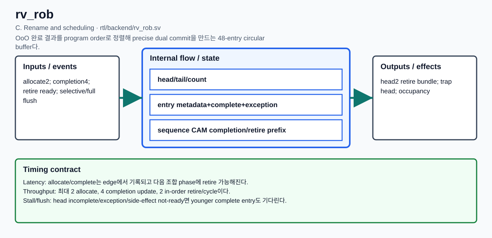

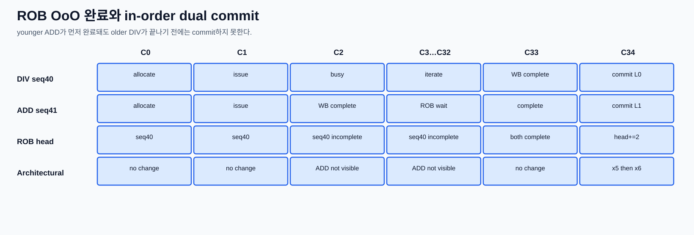

위 예시에서 `ADD seq41`은 `DIV seq40`보다 먼저 WB되어 ROB의 complete bit가 먼저
1이 된다. 그러나 head가 아직 incomplete DIV이므로 ADD는 architectural register를
바꾸지 못한다. DIV까지 완료된 다음 cycle에 lane0은 DIV, lane1은 ADD를 순서대로
동시 commit한다. 이것이 OoO execute와 in-order retire를 동시에 만족시키는 핵심이다.

### 9.2 ROB entry

48-entry circular ROB의 각 entry는 다음을 저장한다.

| 분류 | 필드 |
|---|---|
| Identity/order | `valid`, wrapped `sequence_id`, array index(implicit), PC, raw instruction, length |
| Rename | destination class, architectural destination, new physical tag, stale physical tag, writes-destination |
| Operand/system aid | source0 physical tag, serializing bit |
| Completion | `complete`; writeback acceptance이 이 bit를 set |
| Exception | exception valid, cause, `tval` |
| Branch | is-branch, mispredict bit, resolved next-PC/target |
| Memory | is-load/is-store, LQ index, SQ index |
| FP | accrued `fflags[4:0]` |

ROB entry에는 canonical instruction, branch checkpoint/prediction meta, memory
address/size/mask, CSR write data를 저장하지 않는다. canonical instruction과 predictor
meta는 IQ 및 별도 branch sequence table이 실행 완료까지 보유하고, 주소/데이터는
LQ/SQ가, CSR RMW pending state는 `rv_csr_file`이 소유한다. ROB의
`alloc_instruction_i`에는 retire trace와 system 재분류에 필요한 raw instruction이
들어간다.

`sequence`는 ROB index가 wrap된 뒤에도 age를 비교할 수 있게 한다. IQ와 LQ/SQ는 ROB index만이 아니라 sequence 또는 wrap-aware age 정보를 함께 보관한다.

### 9.3 상태 전이

| 이벤트 | ROB 상태 변화 |
|---|---|
| Dispatch | tail에서 최대 2 entry 원자 할당, metadata 기록, complete=0 |
| Issue | ROB 상태 변화 없음; issued 상태는 IQ/execution unit만 소유 |
| Execute | 승인된 completion이 branch resolved-next-PC/mispredict, exception, fflags와 complete를 갱신; memory address/data는 LQ/SQ에만 기록 |
| Writeback | PRF write가 승인되면 destination instruction complete=1 |
| Store execute | SQ address/data 준비를 기록하되 ROB complete는 필요한 store operand가 모두 준비된 때 설정 |
| Commit | head부터 최대 2 entry 제거, RRAT/CSR/fflags/store-buffer side effect 적용 |

head/tail 규칙:

- free count가 유효 dispatch lane 수보다 작으면 어떤 entry도 할당하지 않는다.
- lane0은 lane1보다 older sequence를 받는다.
- writeback은 임의 순서로 complete bit를 세울 수 있지만 head만 commit 후보가 된다.
- lane1 commit은 lane0이 같은 cycle에 정상 commit되고 lane1도 complete이며 serializing/exception/store-buffer 제약을 만족할 때만 가능하다.
- head가 complete가 아니면 younger complete entry가 있어도 retire하지 않는다.

### 9.4 precise exception, interrupt, branch recovery

- head exception: faulting instruction은 commit하지 않는다. `mepc/mcause/mtval`을 기록하고 younger ROB/IQ/LQ/SQ, execution result를 flush한다. RAT은 RRAT에서 복원한다.
- interrupt: 현재 baseline은 ROB가 완전히 빈 instruction boundary에서만 받는다. 마지막 retire가 만든 architectural next-PC를 `mepc`로 사용하고 speculative state를 full recovery한다.
- branch mispredict: branch 자신은 complete 상태로 남고 해당 sequence보다 younger인 state만 제거한다. RAT/free-list는 rename checkpoint로 복구하고 predictor history는 prediction metadata로 복구한다. ROB는 tail/count를 재계산하고 IQ/LQ/SQ/checkpoint table은 sequence 비교로 younger entry를 각각 무효화한다.
- store: commit된 store만 store buffer로 이동한다. store buffer가 필요한 entry를 받을 수 없으면 ROB head에서 commit을 대기한다.

### 9.5 불변조건과 예시

- ROB sequence는 allocation program order와 동일하고 commit sequence는 감소할 수 없다. wrong-path flush가 만든 sequence gap은 건너뛸 수 있다.
- exception instruction과 그 younger instruction은 register/CSR/memory side effect를 만들 수 없다.
- 같은 cycle의 dual commit에서 lane1 side effect는 lane0 side effect보다 논리적으로 뒤다.
- ROB 밖 또는 generation이 다른 writeback은 PRF ready와 complete를 변경할 수 없다.

예: `I0: DIV x5`, `I1: ADD x6`, `I2: STORE x6`. ADD가 먼저 끝나도 I0가 head에서 완료되기 전에는 I1/I2가 commit하지 않는다. I2는 execute 후 SQ에만 존재하며 I0와 I1이 정상 commit된 뒤에야 store buffer로 이동한다. I0가 exception을 내면 I1 PRF 값과 I2 SQ entry는 모두 폐기된다.

## 10. Issue와 실행 유닛

### 10.1 issue policy

Issue Queue의 목적은 operand가 준비된 uop을 program order와 무관하게 실행 유닛으로 보내 latency를 숨기는 것이다. 각 entry는 `valid`, ROB sequence, FU/5-bit execution-port mask, 최대 3개의 source used/class/physical tag/ready, destination valid/class/tag, PC/canonical instruction/length/prediction, immediate/operation과 operand-select control, memory size/sign, rounding mode, branch checkpoint와 LQ/SQ index, store-address-issued를 저장한다. ROB array index는 저장하지 않으며 sequence가 completion/recovery identity다.

상태 전이:

1. dispatch가 ROB와 대상 IQ entry를 같은 cycle에 원자 할당한다.
2. dispatch 시 busy table과 dispatch 시점의 PRF ready로 source-ready 초기값을 만든다.
3. writeback tag broadcast와 일치하는 source를 clock edge에서 registered-ready로 바꾼다. WB→oldest-select 조합 bypass는 사용하지 않는다.
4. 단일 unified IQ가 registered-ready만 사용해 전체 entry에서 oldest-ready candidate 최대 두 개를 만든다.
5. central arbiter가 두 candidate의 포트 호환성과 issue-port slot 여유를 검사해 최대 2 uop을 grant한다.
6. grant payload와 PRF operand를 5개의 issue-port register에 capture한 때에 IQ entry를 제거한다. 각 slot은 실행 유닛 consume과 같은 edge에 refill할 수 있다.

현재 RTL은 INT/MEM/FP를 물리적으로 분리하지 않는다. `INT_IQ_ENTRIES`,
`MEM_IQ_ENTRIES`, `FP_IQ_ENTRIES`는 `rv_backend`에서 합산되어
`IQ_ENTRIES=56`을 만들며 모든 FU class가 하나의 `rv_issue_queue`를 공유한다.
따라서 한 class가 전체 queue를 점유할 수 있고 정적 partition imbalance는 없지만,
56-entry wakeup/select fan-in이 timing·전력 부담이 된다. 향후 split IQ로 바꿀 때에도
공통 ROB sequence age와 global 2-grant arbiter 계약은 유지한다.

불변조건:

- source-ready가 0인 uop은 issue할 수 없다.
- 같은 IQ entry가 두 포트에 중복 issue될 수 없다.
- unit `ready=0`이면 grant/entry 제거가 일어나지 않는다.
- flush된 ROB sequence의 entry는 다음 cycle까지 모두 invalid가 되어야 한다.
- 실행 포트는 5개지만 global issue count는 cycle당 2 이하이다.

unified IQ는 모든 class가 빈 entry를 공유해 용량 활용은 좋지만 wakeup/select 비교망이
커진다. PPA 단계에서 INT/MEM/FP split을 적용하면 timing과 CAM 전력은 줄지만 class별
고정 용량 imbalance가 생기므로 queue-full/class-occupancy counter를 근거로 분할한다.

### 10.2 확정 execution resource

| 자원 | 개수 | 역할 |
|---|---:|---|
| 범용 integer ALU | 2 | 두 개의 독립 integer uop 동시 실행 |
| Branch unit | 1 | INT0에 결합, branch/jump resolve |
| Pipelined integer multiplier | 1 | INT1에서 accept 후 독립 파이프 진행 |
| Iterative integer divider | 1 | INT1 side unit, accept 후 ALU1을 점유하지 않음 |
| LSU pipeline | 2 | cycle당 최대 2 memory uop issue |
| AGU | 2 | 두 load/store virtual address 동시 생성 |
| D-TLB/PMP path | 2 | 초기 PMP/PMA, 향후 D-TLB를 LSU0/1과 1:1 추가 |
| D local request path | 2 | LSU0/1 → D-Arbiter |
| FP fast execute/transport | 1 | add/mul/FMA/misc/convert를 accept 시 계산하고 3-stage elastic pipe로 전달 |
| FP iterative div/sqrt | 1 shared | FDIV 88-step, FSQRT 64-step recurrence와 별도 result register |
| CSR/privileged unit | 1 | commit과 INT0에 결합, serializing 처리 |

현재 `rv_fpu`의 add/mul/FMA/misc/convert는 request handshake 시 synthesizable
integer/bit-level 함수로 결과와 flags를 계산하고 `LATENCY=4` elastic fast pipe에
넣는다. FDIV.S와 FSQRT.S는 큰 `/`, `%`, 완전 전개 sqrt 조합망을 사용하지 않고
각각 1 quotient bit/cycle, 1 root bit/cycle iterative slow path를 사용한다. 한 개의
in-order FP result port만 유지하기 위해 slow operation이 실행되는 동안 fast request를
받지 않으며, slow request도 fast pipe가 빈 때만 받는다. 이는 면적·Fmax·검증을
우선한 baseline이고 후속 단계에서 fast pipe와 divsqrt output queue를 분리하면
독립 실행 overlap을 추가할 수 있다.

### 10.3 execution port binding

| 논리 포트 | 연결 실행 유닛 | 지원 uop | accept bandwidth |
|---|---|---|---:|
| P0 / INT0 | ALU0 + BRU + CSR hook | add/sub, logic, shift, compare, branch/jump, CSR address/control | 1/cycle |
| P1 / INT1 | ALU1 + MUL + DIV accept | add/sub, logic, shift, compare, multiply, divide/remainder | 1/cycle |
| P2 / MEM0 | AGU0 + LSU0 | integer/FP load/store | 1/cycle |
| P3 / MEM1 | AGU1 + LSU1 | integer/FP load/store | 1/cycle |
| P4 / FP | unified RV32F pipe | F arithmetic/FMA/div/sqrt/convert/compare/move | 1/cycle |

모든 포트가 동시에 grant되지는 않는다. central arbiter는 준비된 후보 중 age, 포트 호환성, long-latency unit ready를 검사해 최대 2개를 선택한다.

| 조합 | 동시 issue | 설명 |
|---|---|---|
| ALU + ALU | 가능 | P0 + P1 |
| branch + ALU | 가능 | branch는 P0, ALU는 P1 |
| ALU + load/store | 가능 | INT + MEM |
| ALU + FP | 가능 | INT + FP |
| load/store + FP | 가능 | MEM + FP |
| multiply/divide accept + ALU | 가능 | P1 + P0 |
| load + load | 가능 | 서로 다른 DTIM bank면 두 access 진행; 같은 bank면 초기 RTL에서 younger backpressure |
| load + store | 가능 | 두 AGU 사용, store는 SQ update 후 commit까지 cache write 금지 |
| store + store | 가능 | SQ가 cycle당 두 address/data update 수용 |
| FP + FP | 불가 | FP issue bandwidth가 1 |
| branch + branch | 불가 | BRU가 1개 |

unified IQ는 전체 class에서 age가 가장 오래된 ready 후보 최대 두 개를 만든다. central
arbiter는 candidate의 5-bit port mask와 unit-ready가 반영된 effective mask를 사용해
서로 다른 포트에 최대 두 개를 배치한다. 두 MEM 후보는 AGU 이후 계산된 bank가 같을
수 있으므로 D-Fabric의 request backpressure와 replay metadata를 보존한다.

### 10.4 latency와 throughput

| unit | RV32 latency 목표 | RV64 latency 목표 | throughput |
|---|---:|---:|---:|
| ALU/shift/compare | 1 | 1 | 1/cycle/ALU |
| branch/jump resolve | 1 | 1 | 1/cycle |
| integer multiply | 2 | 3 | 1/cycle |
| integer divide/remainder | 2~34 | 2~66 | non-pipelined, early-out |
| DTIM-hit integer/FP load | 3 이상 | 3 이상 | 최대 2/cycle, bank conflict 제외 |
| FP add/sub/mul | 3 | 3 | 1/cycle |
| 현재 FP 모든 operation | 3 | 3-stage transport, RV64 F는 별도 sign-off 필요 | 1/cycle if unstalled |

integer multiplier는 `2*XLEN` full product를 만들고 2-stage elastic pipe로 전달한다.
integer divider만 non-pipelined iterative side unit이며 특수 case가 아니면 RV32는 32회,
RV64는 64회 radix-2 iteration을 수행한다. FP div/sqrt는 현재 별도 busy side unit이
아니라 다른 FP operation과 동일하게 3-stage pipe를 사용한다.

### 10.5 PRF와 writeback bandwidth

논리 register-file port 기준선은 다음과 같다.

- Integer PRF: 8 asynchronous data-read, 6 readiness-query, 2 write, 2 allocate port
- FP PRF: 8 asynchronous data-read, 6 readiness-query, 2 write, 2 allocate port
- data-read 0..5는 두 issue candidate의 source 3개씩, 6..7은 dual-retire value/CSR source probe에 사용한다.
- readiness-query 0..5는 dispatch 두 lane의 source 3개씩 ready bit를 읽는다.
- 두 write port는 dual integer/FP load가 같은 cycle에 반환되는 경우를 지원한다.
- FP compare/convert-to-integer 결과는 integer writeback network로 들어간다.

variable-latency 결과가 겹치면 실행 유닛 output skid buffer가 결과를 유지한다. integer 결과와 FP 결과는 각각 최대 2개를 cycle당 PRF에 기록하고, 실제 writeback이 승인된 때에만 dependent wakeup과 ROB completion을 발생시킨다. destination이 없는 store/branch도 별도 completion event가 필요하므로 ROB completion 입력은 PRF write port 수와 동일하다고 가정하지 않는다.

물리 PRF는 논리 포트를 그대로 flop으로 만들지 않고 bank/replication 가능성을 유지한다. 최초 기능 구현에서는 flop-array PRF로 correctness를 검증하고, 합성 결과에 따라 banked 또는 replicated SRAM 구조로 교체한다.

### 10.6 Dual LSU 구조

LSU0와 LSU1은 load/store 기능이 같은 symmetric pipeline이다. 두 번째 LSU를 단순 AGU 추가로 만들지 않고 다음 경로를 모두 dual 처리한다.

- unified IQ에서 최대 두 ready memory uop select
- integer/FP PRF source read
- 두 AGU의 virtual address 계산
- PMP/PMA check 두 개와 향후 D-TLB hook
- LQ/SQ allocation과 age/order 검사
- older store 검색과 store-to-load forwarding compare
- D-Arbiter의 2-bank DTIM CPU access
- load-result alignment/extension와 writeback

DTIM은 64-bit beat interleave 방식의 2-bank SRAM이다. `bank=(addr-DTIM_BASE)[3]`, `row=(addr-DTIM_BASE)[16:4]`로 선택하며 각 bank는 8192×64-bit 1R1W이다. 두 load가 서로 다른 bank면 동시에 진행한다. 같은 bank이면 초기 tightly-coupled RTL은 older load만 `req_ready=1`로 accept하고 younger request에 backpressure를 건다. decoupled request queue를 추가하는 단계에서는 younger를 accept한 뒤 `bank_conflict` replay response로 돌려주는 방식도 허용한다.

store issue는 address/data를 SQ에 기록할 뿐 cache를 변경하지 않는다. SQ는 cycle당 두 entry update를 지원하고 commit된 store만 16-entry store buffer로 이동한다. store buffer는 최대 두 store를 enqueue하며, 서로 다른 bank이고 ordering/PMA 조건을 만족할 때 최대 두 store를 drain할 수 있다. MMIO와 fault 가능 access는 항상 하나씩 ROB head에서 처리한다.

동일 cycle의 두 memory uop 사이에서도 ROB age를 보존한다. 현재 통합 `rv_lsq`는 두 AGU update를 같은 edge에 SQ/LQ에 기록하고 다음 cycle의 load candidate scan에서 새 SQ 상태를 본다. 따라서 same-cycle older-store/younger-load 조합은 store data가 준비됐으면 다음 cycle forwarding하고, 미정이면 stall하며 잘못된 memory read를 먼저 내보내지 않는다. 별도 조합 `rv_lsq_order_check`의 pair-bypass port는 저지연 후속 통합용 reference hook이다.

dual LSU 때문에 LQ는 24, SQ는 16, committed store buffer는 16 entry로 확장한다. DTIM/CLINT 밖 요청은 D-Arbiter outbound queue가 AXI transaction으로 변환한다.

### 10.7 completion 충돌

서로 다른 latency의 완료 충돌은 unit output skid buffer와 writeback arbitration으로 처리한다. 결과가 받아들여지기 전에는 해당 실행 유닛이 ROB tag, physical destination tag, result, exception/fflags를 유지한다. flush된 ROB tag의 결과는 writeback arbitration 전에 제거한다.

### 10.8 branch resolve

branch/jump는 INT0에서 resolve한다. actual direction, target, next PC 중 하나라도 prediction과 다르면 misprediction이다. 해당 branch 자신은 유지하고 모든 younger ROB/IQ/LSQ 상태를 제거한다.

## 11. LSU, LSQ, memory ordering

### 11.1 목적과 불변조건

두 LSU는 서로 다른 cycle과 latency로 완료되므로 ROB의 in-order commit만으로 memory dependency를 보장할 수 없다. 예를 들어 older store가 아직 주소를 계산하지 못한 동안 younger load가 같은 주소의 DTIM 값을 읽으면 잘못된 값이 PRF와 dependent chain에 전파된다. LSQ는 ROB age와 memory 주소를 함께 추적해 이 문제를 막는다.

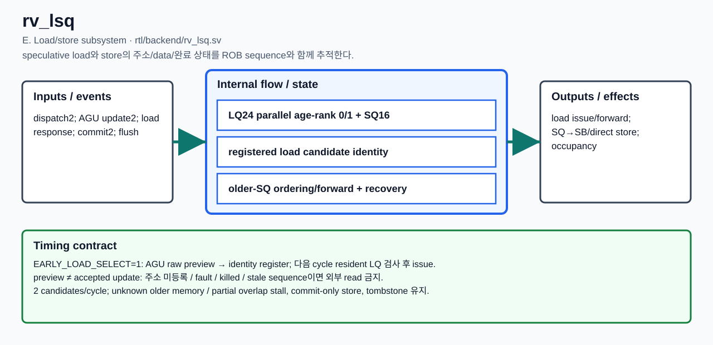

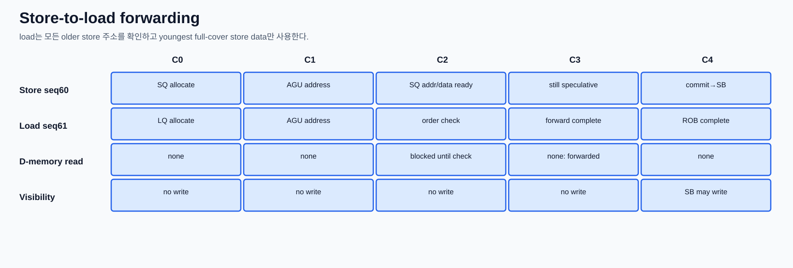

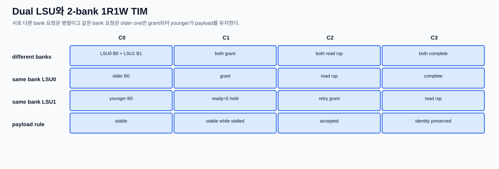

핵심 불변조건:

- load는 모든 older store의 address 상태를 검사하기 전 memory request를 보낼 수 없다.
- 같은 byte를 쓰는 older store가 여러 개면 program order상 가장 젊은 older store의 byte가 load에 전달된다.
- uncommitted store는 DTIM, CLINT, PLIC, HostIF 또는 AXI write를 만들 수 없다.
- memory exception이 있는 store와 그 younger store는 외부에 보일 수 없다.
- 두 LSU가 같은 주소를 처리해도 결과는 단일 program-order LSU와 동일해야 한다.

### 11.2 LQ/SQ entry와 ROB age 연계

| Queue | Entry field |
|---|---|
| LQ 24 | `valid`, killed tombstone, ROB sequence, destination-valid/physical tag, address/address-valid, size, byte mask, unsigned-load, device, issued, completed, exception/cause |
| SQ 16 | `valid`, ROB sequence, address/address-valid, size, byte mask, data/data-valid, device, exception/cause |
| Store buffer 16 | `valid`, sent, done, device, ROB sequence, address, data, byte mask, size; FIFO head/tail/count와 sticky machine-check |

LQ/SQ age는 circular index 대소 비교가 아니라 ROB sequence 또는 wrap-aware comparison으로 판단한다. dispatch lane0/1의 ROB sequence와 LQ/SQ sequence가 동일한 order를 가져야 한다. 현재 RTL은 load data, forwarding SQ index, replay reason을 LQ entry에 저장하지 않는다. load data와 forwarding은 candidate/completion 경로로 전달하고, replay response는 `issued`만 되돌려 같은 LQ entry를 재선택한다.

### 11.3 Store와 load 상태 전이

Store:

1. dispatch에서 SQ entry를 할당하고 ROB에 SQ index를 기록한다.
2. base operand가 준비되면 unified IQ가 `store-address` phase를 먼저 발행하고 AGU address/mask/PMP 결과를 SQ에 기록한다. store data가 이미 준비됐으면 같은 phase에 data도 기록한다.
3. data가 늦으면 IQ entry는 `address-issued=1` 상태로 남아 있다가 data producer writeback에 wakeup되어 `store-data` phase를 다시 발행한다. 이 phase는 기존 SQ address-valid를 지우지 않는다.
4. address와 data가 모두 valid이면 ROB store entry를 complete로 표시한다. address-only phase는 completion을 만들 수 없다.
5. ROB head에서 정상 commit될 때만 SQ entry를 committed store buffer로 이동한다.
6. store buffer가 D-Arbiter write를 승인하고 target response가 정상일 때 entry를 제거한다.

Load:

1. dispatch에서 LQ entry를 할당한다.
2. source-ready가 되면 unified IQ에서 issue candidate가 된다.
3. AGU address가 준비되면 모든 valid older SQ entry를 병렬 또는 단계적 CAM으로 검사한다.
4. ordering/forwarding 조건을 만족한 경우에만 DTIM/AXI read 또는 SQ forwarding을 실행한다.
5. LQ에는 completed/exception 상태를 기록하고, load data는 completion 경로에서 PRF로 전달한다. PRF writeback이 승인될 때 ROB complete를 설정한다.
6. commit 또는 flush에서 LQ entry를 제거한다.

### 11.4 Store-to-load forwarding

forwarding 선택 규칙:

1. load보다 older인 SQ entry만 후보로 만든다.
2. address-valid 후보의 byte mask와 load byte mask를 비교한다.
3. 겹치는 후보 중 ROB sequence가 가장 큰, 즉 youngest older store를 우선한다.
4. load의 모든 요청 byte가 data-valid인 older store byte로 완전히 덮이면 SQ data를 정렬·확장해 load 결과로 사용한다.
5. 여러 older store가 서로 다른 byte를 덮는 merge forwarding은 후속 최적화다. 초기 구현은 한 youngest store가 full-cover할 때만 forwarding한다.
6. partial overlap 또는 matching store data-invalid이면 load를 memory로 보내지 않고 stall/replay한다.
7. 주소가 알려진 모든 older store가 non-overlap이면 memory read를 허용한다.

동일 cycle에 `older store + younger load`가 LSU0/1으로 issue되면 현재 통합 경로는 두 AGU update를 먼저 register한다. 다음 cycle에 younger load를 candidate로 고를 때 newly written SQ를 포함해 검사하므로 full-cover/data-ready면 forwarding하고, data 미정 또는 partial overlap이면 stall한다. standalone `rv_lsq_order_check`는 같은 규칙을 조합 pair-bypass 입력으로도 표현하지만 현재 `rv_lsu_cluster`에는 인스턴스되지 않는다.

### 11.5 미확정 older store 정책

초기 구현은 correctness-first conservative policy를 사용한다.

- address-valid=0인 older SQ entry가 하나라도 있으면 younger load는 LSU로 issue하지 않는다.
- address는 valid지만 matching store의 data-valid=0이면 해당 load를 stall한다.
- 주소가 미확정인 older LQ entry가 있거나 older device load가 있으면 younger normal load도 보수적으로 대기한다. 뒤늦게 MMIO로 판명되는 older access를 추월하지 않기 위한 현재 RTL 규칙이다.
- `load_stall_reason_o`는 `LSQ_STALL_UNKNOWN_ADDR`, `LSQ_STALL_STORE_DATA`, `LSQ_STALL_PARTIAL_OVERLAP`, `LSQ_STALL_DEVICE_SERIALIZE`를 구분한다. 현재 값은 내부 control/debug signal이며 architectural CSR counter로 구현되지는 않았다.
- 이 정책에서는 store address resolution 뒤 이미 실행된 younger load를 찾는 violation recovery가 정상 경로에 필요하지 않다.

향후 speculative mode에서는 unknown older store를 load가 추월할 수 있다. 그 경우 store address가 resolve될 때 모든 younger executed LQ address와 비교하고, overlap violation이 있으면 가장 오래된 violating load와 그 dependent younger instruction을 squash/replay한다. store-set predictor와 selective replay는 별도 milestone이며 초기 RTL에서 enable하지 않는다.

### 11.6 두 LSU와 bank arbitration

- 두 load가 서로 다른 DTIM bank면 같은 cycle에 read를 시작한다.
- 두 load가 같은 bank면 older ROB sequence를 grant한다. 초기 RTL은 younger request의 `req_ready=0`을 유지하고, 향후 decoupled accept 모드만 `bank_conflict` replay response를 사용한다.
- load와 committed store-buffer drain이 같은 bank를 접근하면 1R1W이므로 read와 write를 동시에 허용한다. 같은 row/byte overlap은 program-order bypass로 read value를 명시한다.
- 두 committed store가 서로 다른 bank면 같은 cycle에 write할 수 있다. 같은 bank면 older store만 drain한다.
- CLINT/PLIC/HostIF 같은 device access는 speculative하지 않고 ROB head에서 한 건씩 수행한다.
- two-LSU memory issue가 global issue 두 slot을 모두 사용하므로 같은 cycle에 ALU/FP uop을 추가 issue하지 않는다.

### 11.7 Commit, flush, exception

- Store external visibility point는 ROB head commit 후 store-buffer enqueue다. execute/SQ complete는 visibility가 아니다.
- commit lane0/lane1이 모두 store이면 store buffer에 두 entry 공간이 있을 때만 두 개를 순서대로 enqueue한다.
- branch recovery는 checkpoint보다 younger인 LQ/SQ entry를 sequence로 무효화한다.
- exception/interrupt recovery는 uncommitted LQ/SQ를 모두 비우고 committed store buffer는 유지한다. 이미 commit된 store는 trap보다 older이므로 drain을 계속할 수 있다.
- flush 당시 이미 request handshake된 LQ entry는 `killed_outstanding` tombstone으로 남기고 response ID가 돌아올 때까지 그 LQ index를 재할당하지 않는다. 현재 D-memory response에는 epoch/ROB sequence echo가 없으므로 이 규칙으로 stale response가 새 load entry를 오염시키는 것을 막는다. response는 받아 버리되 PRF/ROB를 갱신하지 않는다.
- store access fault 가능성이 있는 external/MMIO write는 commit 시 non-speculative transaction으로 실행하고 response를 받은 뒤 trap 여부를 확정한다. 해당 store가 head를 점유하는 동안 younger commit을 막는다.

### 11.8 FENCE와 FENCE.I

- 초기 `FENCE`는 conservative full fence로 구현한다: older load 완료, SQ의 older store commit, store buffer drain, outstanding D-memory response 완료 후 completion한다.
- `FENCE.I`는 같은 D-memory idle 조건을 만족한 뒤 ROB에서 completion하고, retire 다음 cycle architectural redirect로 다음 PC를 refetch한다. 현재 backend는 `rv_fence_controller.i_fabric_idle_i`를 `1'b1`로 묶어 별도 I-Fabric idle acknowledgement를 기다리지 않는다. redirect가 fetch epoch를 증가시키므로 이미 요청된 old-epoch response는 폐기된다.
- 초기 TIM에는 일반 I-cache가 없지만 target/loop block buffer와 fetch queue가 instruction block을 보존하므로 `FENCE.I` architectural redirect에서 둘 다 invalidate한다.

### 11.9 초기 TIM과 향후 cache

초기 모델은 I/D cache 없이 ITIM/DTIM을 사용한다. TIM wrapper에 parity/ECC hook과 future cacheable attribute를 둔다. 후속 cache 단계에서는 32 KiB 4-way 64-byte-line L1 I/D cache, non-blocking MSHR, write-back D-cache를 local fabric 앞에 추가하되 LSQ ordering과 store commit visibility 규칙은 바꾸지 않는다.

## 12. Floating point

F architectural register width는 `FLEN=32`로 고정한다. integer `XLEN`과 별도이다.
현재 `rv_fpu`는 일반 연산을 request 시점의 bit-level arithmetic function과
`LATENCY=4`개의 ready/valid register로 처리한다. FDIV.S/FSQRT.S는 별도 iterative
side-unit이며 finite non-special FDIV는 88 recurrence + pack, FSQRT는 64 recurrence
+ pack을 거쳐 result valid가 된다. NaN/zero/infinity/divide-by-zero 같은 special
case는 accept edge에서 slow result register로 바로 들어간다. fast/slow path는 동일
result port에서 program-order를 보존하도록 상호 배타적으로 accept한다.

- 설계 목표는 IEEE-754 결과와 RISC-V canonical NaN 규칙 준수다. 현재 FADD/FSUB/FMUL/FDIV/FSQRT, 4종 fused operation, FSGNJ*, FMIN/FMAX, FEQ/FLT/FLE, FCVT.W[U].S/FCVT.S.W[U], FCLASS와 FMV 양방향은 host FP를 사용하지 않는 Python `Fraction`/integer-sqrt oracle의 6,470개 deterministic vector로 result bit와 `fflags`를 비교한다. 5개 rounding mode, signed zero, normal/subnormal, infinity, qNaN/sNaN과 overflow/underflow를 포함하지만 SoftFloat/Spike exhaustive differential sign-off 전에는 완전 준수를 선언하지 않는다.
- FMA의 finite zero product는 product operand의 synthetic exponent를 alignment에 사용하지 않는다. addend가 non-zero이면 부호 변형을 적용한 addend bit를 exact 반환하고, addend도 zero이면 add/sub exact-zero sign 규칙을 적용한다.
- dynamic rounding mode는 `frm`을 읽고 reserved rounding encoding은 illegal instruction으로 처리한다.
- accrued exception flag는 execute 결과에 실어 ROB에 저장하고 commit에서 `fflags`에 OR한다.
- FP exception은 trap을 발생시키지 않는다.
- fused multiply-add는 단일 rounding operation으로 계산하는 것이 architectural 계약이다.
- reference model은 Berkeley SoftFloat 또는 Spike 결과를 사용한다.

RV64에서 FPR이 64-bit가 되는 것은 아니다. F-only 구성은 `FLEN=32`를 유지한다. `FMV.X.W`는 RV64 규칙에 맞게 integer 결과를 sign-extend하고 `FMV.W.X`는 integer source 하위 32-bit를 사용한다.

## 13. CSR, privilege, trap

### 13.1 초기 M/U privilege

초기 모델은 Machine와 User mode를 구현한다. `current_priv`는 2-bit architectural state로 두어 M/U를 사용하고 S encoding은 `HAS_SMODE=1` 확장 시 활성화한다. U-mode의 exception, ECALL, interrupt는 delegation이 없으므로 M-mode로 trap된다.

필수 CSR:

- User-visible: `fflags`, `frm`, `fcsr`, `cycle`, `time`, `instret`와 RV32 high halves
- Machine information: `mvendorid`, `marchid`, `mimpid`, `mhartid`, `misa`
- Machine trap: `mstatus`, `mie`, `mip`, `mtvec`, `mscratch`, `mepc`, `mcause`, `mtval`
- Counters: `mcycle`, `minstret`, `mcycleh`, `minstreth`, `mcounteren`
- Protection: `pmpcfg0..`, `pmpaddr0..7`

`misa`는 RV32에서 MXL=1과 I/M/F/C/U bit를 나타낸다. Zicsr/Zifencei는 `misa` single-letter bit가 없다. `mstatus.MPP`의 WARL 값은 M/U이며 `FS`, `MIE`, `MPIE`, `MPRV`, `TW` 등 구현 필드를 명시적으로 decode한다.

CSR instruction은 read/write suppression 조건을 decode에서 구분하고 실제 CSR write는 commit에서 수행한다. CSR read가 younger CSR write를 추월하지 않도록 CSR uop은 serializing 또는 CSR scoreboard로 순서를 보장한다.

### 13.2 PMP

U-mode를 의미 있게 사용하기 위해 8-entry PMP를 구현한다. OFF/TOR/NA4/NAPOT와 R/W/X/L을 지원한다. LSU0/LSU1은 각 architectural memory operation 단위로 검사하고, IFU는 기본 16-byte transport block 안의 8개 2-byte instruction parcel을 병렬 검사한다.

- M-mode unlocked region access는 privileged specification 규칙을 따른다.
- U-mode는 matching PMP permission이 있어야 한다.
- 초기 Boot ROM은 bring-up을 위해 pmp0를 전체 physical address RWX NAPOT으로 설정할 수 있다.
- production firmware는 ITIM RX, DTIM RW, device RW처럼 region을 재구성한다.
- PMP fault는 instruction/load/store access fault로 ROB에 기록하고 precise trap 처리한다.

2026-09-08 보호 설정 갱신 보완: 실제 write intent가 있는 `pmpcfg*`/`pmpaddr*`
CSR가 ROB lane 0에서 commit되면 다음 cycle에 architectural redirect로 CSR 다음
PC를 refetch한다. CSR write 자체는 취소하지 않으며 younger uop, fetch queue,
target buffer를 폐기하고 epoch를 갱신한다. CSRRS/CSRRC 및 immediate형의
rs1/zimm=0은 read-only이므로 이 redirect를 요청하지 않는다. CSRRW[I]는
rs1/zimm=0이어도 write이다. locked entry 때문에 쓰기가 무시되는 경우에도
보수적으로 refetch한다. 해당 commit과 refetch 사이 dispatch는 기존
`system_redirect_pending_q`로 차단된다. 별도 software FENCE.I 없이 새 PMP 권한이
다음 실행에 적용되어야 한다. 검증 근거는 `verification/tests/pmp_refetch`이다.
`rv_trap_controller.retire_is_pmp_write_i`는 backend가 retiring instruction의
CSR 주소와 write intent에서 생성하는 1-bit 입력이다. `retire_fire_i[0]`와
동시에 참이면 다음 cycle에 `redirect_pending_o=1`,
`architectural_redirect_pc_o=$past(retire_next_pc_i[0])`가 되어야 한다.

IFU의 `FETCH_BYTES=16`은 ITIM/I-Fabric 전송 최적화이며 architectural PMP access
크기가 아니다. frontend는 block이 queue에 들어가는 시점에 aligned address
`block+2*n` (`n=0..7`)을 execute/size=2 bytes로 검사하고 allow bit를 해당 두
byte의 fault metadata로 보관한다. 16-bit instruction은 한 parcel, 32-bit
instruction은 자신이 점유한 연속 두 parcel의 fault OR만 사용한다. 32-bit
instruction이 block 경계를 넘으면 기존 queue의 연속 byte metadata가 두 block의
결과를 자연스럽게 합친다. target-buffer hit도 저장 당시 권한을 재사용하지 않고
현재 privilege/PMP 설정으로 parcel 권한을 다시 계산한다.

이 규칙으로 TOR `[0,0x800008fc)`가 `0x800008f0` transport block 일부와 겹쳐도
`0x800008fc`의 M-mode unlocked/no-match instruction은 default allow로 정상
실행한다. 반대로 실제 instruction의 어느 parcel이든 거부되면 instruction access
fault를 ROB에 기록하고 추가 sequential fetch를 정지하며 precise trap redirect가
queue/epoch를 폐기한다. PMP CSR commit은 기존 architectural refetch를 사용하므로
queue/target-buffer에 남은 이전 권한 결과가 실행되지 않는다. local Boot ROM/ITIM
read는 side effect가 없어 block 전체를 물리적으로 읽은 뒤 permission metadata를
적용한다. 향후 side-effect가 있는 instruction target이나 보안 side-channel 요구가
추가되면 I-Fabric transaction 자체를 허용 구간별로 split해야 한다. 검증 근거는
`verification/tests/pmp_fetch_boundary`와 `verification/tests/pmp_refetch`이다.

성능 계약상 parcel 판정은 memory response/target-buffer fill의 기존 cycle 안에서
8개 조합 port가 병렬 동작하며 pipeline stage, fetch handshake 또는 stall cycle을
추가하지 않는다. 따라서 PMP fault가 없는 CoreMark의 architectural cycle/IPC는
동일해야 한다. 다만 합성 관점에서는 단일 16-byte checker보다 PMP compare logic의
면적·동적 전력과 response-to-fetch-queue timing 부담이 증가할 수 있으므로 Fmax 영향은
합성/STA에서 별도로 확인한다. critical path가 되면 data와 8-bit permission vector를
함께 register하는 response stage를 검토하되, instruction별 parcel fault 계약은 유지한다.

### 13.3 trap과 interrupt

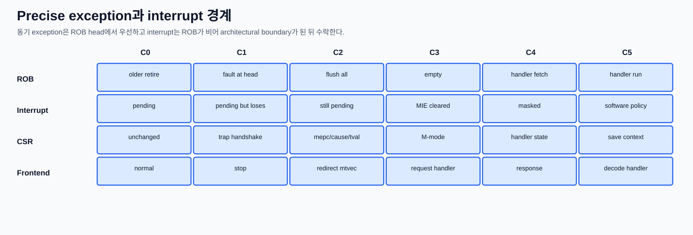

trap entry는 ROB commit 경계에서 다음 순서로 architectural state를 갱신한다.

1. `mepc`에 faulting PC 또는 interrupt 다음 PC를 기록한다.
2. `mcause`, `mtval`을 기록한다.
3. `mstatus.MPIE←MIE`, `MIE←0`, `MPP←current_priv`를 수행한다.
4. `current_priv←M`으로 바꾸고 `mtvec` direct/vectored 규칙에 따른 PC로 redirect한다.
5. speculative RAT/ROB/IQ/LQ/SQ/frontend epoch를 flush한다.

`MRET`은 ROB head의 serializing instruction으로 실행하며 `current_priv←MPP`, `MIE←MPIE`, `MPIE←1`, `MPP←U` 후 `mepc`로 redirect한다.

`EBREAK`와 `C.EBREAK`는 decode에서 이미 완료된 breakpoint exception ROB entry로
만들되, trap side effect는 해당 entry가 ROB head에 도달할 때만 발생한다. cause는 3,
`mepc`는 breakpoint instruction PC다. 이 구현은 `mtval`에 0 대신 같은 instruction
PC를 기록하는 informative 정책을 선택한다. breakpoint와 같은 dispatch bundle의
younger lane은 실행 여부와 무관하게 trap recovery에서 폐기되어 architectural
register/CSR/memory side effect를 만들 수 없다. 외부 Debug Module이 없으므로 현재
EBREAK는 halt request가 아니라 항상 M-mode breakpoint trap이다.

초기 interrupt source:

- `MSIP`: CLINT software interrupt
- `MTIP`: CLINT timer compare
- `MEIP`: PLIC M-context external interrupt

interrupt eligibility는 `mip & mie`, current privilege와 `mstatus.MIE` 규칙을 따른다. WFI는 M-mode에서 구현하며 locally enabled interrupt가 pending되면 wake한다. Boot flow에서는 `mie.MSIE=1`과 `mstatus.MIE=1`을 모두 설정해 wake와 trap을 동시에 보장한다.

### 13.4 Supervisor 확장 frame

`HAS_SMODE=0`이 유일한 현재 sign-off 구성이다. RTL에는 privilege enum의 S encoding,
decoder의 SRET 인식, MPP WARL S 허용, PLIC S-context가 일부 존재하지만 이것만으로
Supervisor mode가 동작하는 것은 아니다. S CSR, delegation, S trap/return completion,
MMU가 없고 SRET은 backend head-special 분류에 연결되지 않았다. 따라서
`HAS_SMODE=1`은 integration 실험용 hook일 뿐 제품 configuration으로 사용하면 안 된다.
완성 단계에서는 다음 hook을 연결한다.

- privilege enum의 S value와 trap target mux
- `medeleg/mideleg`, `sstatus/sie/sip/stvec/sepc/scause/stval/sscratch/satp`
- PLIC S-context와 `SEIP`
- SSWI/STIP source hook
- IFU/LSU translation request의 ASID, privilege, access type
- RV32 Sv32, RV64 Sv39 TLB/page-walker interface
- `SFENCE.VMA`, `SRET` decode slot

virtual address는 `XLEN`, physical address는 `PADDR_WIDTH`로 분리한다. 초기 `MMU_EN=0`에서는 address를 zero/sign policy에 따라 physical path로 전달하고 PMP/PMA만 적용한다.

## 14. RV64 전환 설계 규칙

RV64는 단순히 버스 폭만 64-bit로 늘리는 작업이 아니다. 아래 항목을 독립 검증한다.

| 영역 | RV64 요구사항 |
|---|---|
| Decode | `OP-IMM-32`, `OP-32`, RV64 load/store와 RV64C encoding 추가 |
| ALU | 기본 연산은 64-bit, W 연산 결과는 bit 31에서 sign-extension |
| Shift | 기본 shamt 6-bit, W 연산 shamt 5-bit와 reserved encoding 구분 |
| LSU | `LD/SD/LWU`, 8-byte mask, alignment와 sign/zero extension |
| M | 128-bit multiply intermediate, `MULW/DIVW/DIVUW/REMW/REMUW` |
| CSR | XLEN-width CSR, RV32 high-half counter access 차이 |
| C | RV32의 `C.JAL`과 RV64의 `C.ADDIW` 등 XLEN별 decode 분기 |
| Trace | PC, integer write data, address가 XLEN/PADDR parameter를 따름 |
| MMU future | RV32 Sv32와 RV64 Sv39 page-walk/control 분리 |

RTL coding rule:

- `logic [31:0]`은 instruction와 F data처럼 본질적으로 32-bit인 곳에만 사용한다.
- integer value/PC는 `[XLEN-1:0]`, physical address는 `[PADDR_WIDTH-1:0]`를 사용한다.
- sign extension은 destination width를 명시한 공용 함수로 수행한다.
- multiply intermediate는 `[2*XLEN-1:0]`로 선언한다.
- `XLEN==32`와 `XLEN==64` 이외의 구성은 elaboration에서 실패시킨다.
- RV32/RV64 opcode 차이는 넓은 datapath의 우연한 truncation에 의존하지 않는다.

## 15. SoC interconnect와 module interface

### 15.1 AXI4 profile

Main Xbar는 AXI4를 사용한다.

| 항목 | 값 |
|---|---|
| Address width | 32-bit initial, parameterized PADDR future |
| Data width | 64-bit |
| Local master ID | 4-bit |
| Xbar slave-side ID | 6-bit = 2-bit master prefix + 4-bit local ID |
| Burst | INCR, 최대 16 beats |
| 4 KiB rule | 한 burst의 first/last byte는 같은 4 KiB page에 있어야 함 |
| Transfer size | 1/2/4/8 bytes, naturally aligned baseline |
| Outstanding | 현재 master별 read burst 1건 + write burst 1건; read와 write는 동시 가능 |
| Unsupported | exclusive/locked, WRAP burst, atomics |
| Response | OKAY/SLVERR/DECERR, EXOKAY 미사용 |

채널 payload:

- AW: `id, addr, len, size, burst, prot, cache, qos, valid/ready`
- W: `data[63:0], strb[7:0], last, valid/ready`
- B: `id, resp, valid/ready`
- AR: AW와 동일한 read address/control
- R: `id, data[63:0], resp, last, valid/ready`

AXI invariant:

- `valid && !ready` 동안 모든 payload는 stable이다.
- AW를 grant한 write burst는 WLAST까지 해당 slave의 W ownership을 유지한다.
- 동일 ID response ordering을 보존한다.
- AXI4 burst는 4 KiB boundary를 넘지 않는다. Main Xbar는 위반 transaction 전체를 default error slave로 보내며 target에는 첫 beat도 전달하지 않는다. inbound bridge를 단독 사용할 때도 같은 검사를 반복해 local side effect 없이 SLVERR로 끝낸다.
- CLINT/PLIC/HostIF의 register semantics는 32-bit naturally aligned access를 기준으로 하며 잘못된 접근은 error를 반환한다. Boot ROM은 S0 inbound bridge가 AXI burst를 64-bit local read로 분해하므로 ROM leaf 자체는 AXI channel을 갖지 않는다.
- unmapped 또는 slave-window를 넘는 burst는 DECERR이며 일부 beat만 side effect를 만들 수 없다.

### 15.2 Main AXI Xbar

Main Xbar가 이 SoC의 **최종 system bus**다. Xbar 뒤에 다시 하나의 공용 bus가 있는
구조가 아니라, Xbar의 각 downstream AXI port가 선택된 slave로 이어진다. 현재 AXI
master port는 정확히 세 개다.

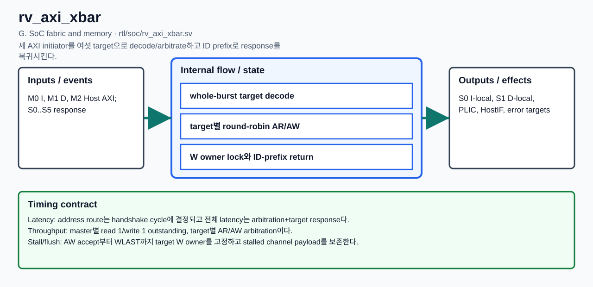

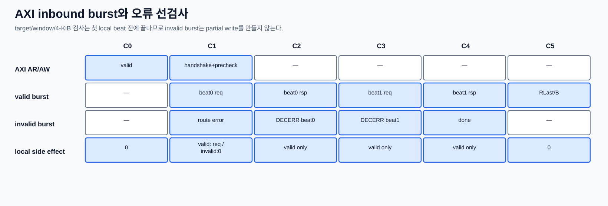

| Master index | Initiator | 용도 |
|---:|---|---|
| M0 | I-Fabric outbound bridge | Boot ROM/ITIM 이외의 non-local instruction fetch |
| M1 | D-Arbiter outbound | PLIC/HostIF/ITIM/non-local data access |
| M2 | DPI Host AXI master | ELF load, memory inspect, CLINT MSIP, peripheral access; RISC-V Debug Module은 아님 |

AXI slave port:

| Slave index | Target |
|---:|---|
| S0 | I-local inbound bridge: Boot ROM와 ITIM windows |
| S1 | D-Arbiter inbound: DTIM와 CLINT windows |
| S2 | PLIC |
| S3 | HostIF register block |
| S4 | Reserved error slave |
| S5 | Default/unmapped error slave |

주소 채널은 slave별 3-master round-robin arbitration을 사용한다. 각 master는 read response의 마지막 beat 전까지 다음 AR을, B response 전까지 다음 AW를 받지 않으므로 현재 ID 폭은 routing/echo 용도이지 한 master의 multi-outstanding reorder 용도가 아니다. AW를 승인한 slave는 WLAST까지 해당 master의 W channel을 독점한다. Host ELF loading이 진행되는 boot 구간에는 core traffic이 거의 없다고 가정하며, 별도 QoS 우선순위나 16-grant bound는 현재 Xbar RTL에 없다.

현재 S4는 decode 결과가 도달하지 않는 `SOC_TARGET_RESERVED`이고 실제 연결은
`rv_axi_error_slave`다. 따라서 “대용량 SRAM을 붙일 수 있다”는 말은 인터페이스상
확장 가능하다는 뜻이며, 현재 bitstream/RTL에 외부 SRAM 용량이 이미 존재한다는 뜻은
아니다. S4를 SRAM에 할당하는 구체 변경 계약은 Section 15.42에 정의한다.

I/D local fabric은 같은 module 안에 `axi_m` outbound와 `axi_s` inbound를 분리한다. local requester가 자기 local window를 접근하면 outbound로 보내지 않는다. 다음 assertion을 둔다.

- I outbound transaction은 Boot ROM 또는 ITIM window를 가질 수 없다.
- D outbound transaction은 DTIM/CLINT window를 가질 수 없다.
- Xbar inbound bridge가 받은 request를 다시 outbound로 보내지 않는다.

### 15.3 Core local request/response interface

IFU block request:

| Signal | 방향 | 의미 |
|---|---|---|
| `if_req_valid/ready` | core→I fabric | 16-byte block request |
| `if_req_addr[31:0]` | core→I fabric | 16-byte aligned address |
| `if_req_id[3:0]` | core→I fabric | outstanding block ID |
| `if_req_epoch[3:0]` | core→I fabric | redirect generation |
| `if_rsp_valid/ready` | I fabric→core | response handshake |
| `if_rsp_data[127:0]` | I fabric→core | little-endian fetch block |
| `if_rsp_resp[1:0]` | I fabric→core | OKAY/SLVERR/DECERR |

LSU local interface는 두 lane의 packed array로 노출한다.

| Signal | 방향 | 의미 |
|---|---|---|
| `d_req_valid/ready[1:0]` | core→D fabric | LSU0/1 request |
| `d_req_id[1:0][5:0]` | core→D fabric | LSU/LQ/store-buffer transaction ID |
| `d_req_addr[1:0][31:0]` | core→D fabric | physical byte address |
| `d_req_write[1:0]` | core→D fabric | 0=read, 1=committed write |
| `d_req_size[1:0][2:0]` | core→D fabric | log2(bytes) |
| `d_req_wdata[1:0][63:0]` | core→D fabric | aligned data |
| `d_req_wstrb[1:0][7:0]` | core→D fabric | byte enable |
| `d_req_priv[1:0][1:0]` | core→D fabric | U/S/M access context |
| `d_req_rob_seq[1:0][7:0]` | core→D fabric | modulo-256 age/arbitration and assertion metadata; 48-entry window는 반주기 128보다 작음 |
| `d_rsp_*[1:0]` | D fabric→core | ID, rdata, response, replay reason |

`d_req_write=1`은 committed store buffer에서 나온 transaction만 허용한다. SQ execute path가 이 interface를 직접 write 용도로 구동할 수 없게 type/interface boundary를 분리한다.

### 15.4 D-Arbiter / D local fabric

D-Arbiter의 local initiator는 요청대로 세 개다.

1. LSU0 master port
2. LSU1 master port
3. Main Xbar inbound AXI slave bridge

local target은 DTIM bank0, DTIM bank1, CLINT다. LSU의 non-local 주소는 단일 outbound local channel과 AXI master bridge로 보내므로 memory slave 개수에 포함하지 않는다. Xbar inbound request는 main decoder가 이미 DTIM/CLINT만 전달했으므로 outbound로 재전송하지 않는다.

DTIM bank별로 read arbiter와 write arbiter를 분리한다. 1R1W이므로 같은 bank에서 read 하나와 write 하나를 동시에 수행할 수 있다.

- LSU0/1 read-read conflict: ROB sequence가 older인 request 우선
- LSU committed write-write conflict: store-buffer order가 older인 request 우선
- Xbar inbound와 core conflict: round-robin + core maximum consecutive grant 8
- CLINT conflict: 한 cycle 한 request, device-order FIFO
- non-local LSU request: LSU0/1 중 ROB age가 older인 한 요청을 outbound로 전달하고 requester별 busy/response owner로 route

64-bit SRAM read-modify-write가 필요한 RV32 byte/half/word store는 byte write enable을 SRAM wrapper가 직접 지원한다. 지원하지 않는 SRAM macro를 사용할 경우 wrapper 내부 RMW를 사용하고 해당 bank write port를 완료까지 lock한다.

### 15.5 I-Arbiter / I local fabric

I-Arbiter initiator는 IFU fetch와 Main Xbar S0 뒤의 `u_i_inbound_bridge`다. 두 initiator의 주소를 Boot ROM/ITIM으로 decode하고 응답 ID를 원래 requester로 돌린다. IFU ITIM hit는 두 read bank를 묶어 128-bit를 반환한다. AXI inbound ITIM 64-bit write는 해당 bank write port를 사용하므로 IFU read와 동시에 가능하다. inbound read와 IFU read가 같은 bank에서 충돌하면 IFU를 우선하되 bounded fairness를 적용한다.

IFU Boot ROM hit는 Xbar로 나가지 않는다. `u_bootrom_local`의 64-bit local port를 low/high 두 번 읽어 128-bit block으로 조립한다. 같은 시간 Host/LSU가 S0를 통해 Boot ROM을 읽으면 IFU와 inbound 중 한 요청만 local ROM port를 소유한다. Boot ROM write는 ROM leaf에서 SLVERR로 끝나며 ITIM이나 outbound에 전달되지 않는다. Boot ROM과 ITIM 이외 executable window만 I outbound AXI master가 low/high 두 64-bit transaction으로 읽는다. AXI response 중 하나라도 error이면 block response 전체를 fault로 표시한다.

### 15.6 ITIM/DTIM SRAM wrapper

각 TIM은 두 개의 `8192 × 64-bit` bank로 총 128 KiB를 제공한다.

| Memory | Bank select | Row | Port use |
|---|---|---|---|
| ITIM | offset bit 3 | offset `[16:4]` | IFU/inbound read, Host write |
| DTIM | offset bit 3 | offset `[16:4]` | LSU/inbound read, committed write |

wrapper contract:

- synchronous read, request accept 후 1 cycle data
- bank별 read 1개, write 1개/cycle
- 8-bit byte write enable
- same-row read/write는 explicit bypass로 선택된 ordering의 new data를 반환
- FPGA BRAM/ASIC SRAM 교체를 위한 단일 wrapper
- parity/ECC injection과 MBIST hook은 port에 예약

### 15.7 CLINT-compatible block

base는 `0x0200_0000`, aperture는 64 KiB다.

| Offset | Register | 동작 |
|---:|---|---|
| `0x0000` | `msip[0]` | bit0 write/read, 1이면 MSIP assert |
| `0x4000` | `mtimecmp[31:0]` | hart0 compare low |
| `0x4004` | `mtimecmp[63:32]` | hart0 compare high |
| `0xBFF8` | `mtime[31:0]` | timer low |
| `0xBFFC` | `mtime[63:32]` | timer high |

`mtime`은 10 MHz timebase를 기본으로 하며 core clock divider parameter를 사용한다. `mtimecmp` reset은 all-one, `msip` reset은 0이다. RV32 software는 `mtimecmp` 갱신 중 일시적인 MTIP 발생을 막기 위해 high=all-one, low, final high 순서를 사용한다. CLINT는 D local target이므로 LSU access와 Host의 Xbar inbound access가 같은 register path를 사용한다.

### 15.8 PLIC

PLIC은 Main Xbar의 독립 AXI slave이고 base는 `0x0C00_0000`이다.

- source 1..31 사용, source0 reserved
- 3-bit priority, 0=disabled
- initial context0 = hart0 M-mode
- level-sensitive gateway baseline
- 동일 priority는 낮은 interrupt ID 우선
- claim read는 선택 pending을 atomic clear
- completion write는 해당 gateway를 re-arm

주요 offset:

| Offset | Register |
|---:|---|
| `0x000004 + 4×ID` | source priority |
| `0x001000` | pending bits 0..31 |
| `0x002000` | context0 enable bits 0..31 |
| `0x200000` | context0 threshold |
| `0x200004` | context0 claim/complete |

PLIC register는 32-bit access가 원자 단위다. 64-bit AXI beat의 byte strobe로 하위/상위 word를 선택하지만 한 transfer에서 두 side-effect register를 동시에 접근하지 않는다. `HAS_SMODE=1`이면 context1 enable `0x2080`, threshold/claim `0x201000/0x201004`, `SEIP` output을 활성화한다.

### 15.9 DPI Host master와 HostIF

DPI-C Host BFM은 Main Xbar의 M2 AXI master다. ELF32 little-endian RISC-V file의 `PT_LOAD` segment를 `p_paddr`, 없으면 `p_vaddr` 기준으로 ITIM/DTIM에 burst write하고 BSS(`memsz-filesz`)를 zero-fill한다. 모든 B response를 받은 뒤에만 boot 완료를 선언한다.

CPU→Host 통신을 위해 Host가 master 역할만 가져서는 부족하므로 HostIF AXI slave를 추가한다.

| Offset | Register | 방향/의미 |
|---:|---|---|
| `0x00` | `HOST_ID` | RO, version/signature |
| `0x04` | `BOOT_ENTRY` | Host write, ELF `e_entry` |
| `0x08` | `BOOT_FLAGS` | bit0 image_loaded, bit1 vector_ready |
| `0x0C` | `TOHOST` | core write, DPI event |
| `0x10` | `FROMHOST` | Host write, core read |
| `0x14` | `EXIT_CODE` | core write, simulation finish request |
| `0x18` | `CONSOLE_TX` | core write low byte |
| `0x1C` | `CONSOLE_RX` | Host write low byte |
| `0x20` | `STATUS` | RO: bit0=1(ready), bit1=event pending, bit2=`BOOT_FLAGS[0]` |

HostIF local register access는 정확히 32-bit(`req_size=2`)여야 하며 64-bit bus의
하위/상위 lane은 address bit2와 byte strobe로 선택한다. TOHOST, EXIT_CODE,
CONSOLE_TX write는 event payload를 한 entry에 고정하고 `event_ready` 전에는 다음
HostIF transaction에 backpressure한다.

Host는 CLINT `msip`도 반드시 AXI write로 발생시킨다. testbench가 interrupt wire를 직접 force하는 방식은 boot protocol 검증 경로로 사용하지 않는다. PLIC source injection은 별도 DPI input vector로 제공할 수 있지만 claim/complete는 항상 AXI register path를 따른다.

#### 15.9.1 서버 DTIM HTIF 호환 모드

서버 ELF 호환 모드는 위의 합성 가능한 HostIF register block을 삭제하거나 주소를
겹치게 변경하지 않는다. 대신 `rv_host_dpi`가 Main Xbar의 기존 Host AXI master로
DTIM 안의 64-bit `TOHOST_ADDR`와 `FROMHOST_ADDR`를 읽고 쓴다. 기본 주소는 각각
`0x8002_0000`, `0x8002_0008`이다. 즉 두 mailbox는 DTIM storage이며 별도 slave가
아니다.

Host state machine은 다음 순서를 지킨다.

1. ELF `PT_LOAD`와 BSS zero-fill의 모든 AXI response를 완료한다.
2. HostIF의 boot-entry/flag를 기록하고 CLINT MSIP로 Boot ROM을 깨운다.
3. configurable interval마다 TOHOST 64-bit word를 Host AXI로 읽는다.
4. RV32의 두 번짜리 32-bit store publication을 고려해 settling interval 뒤 동일값을
   다시 읽고 값이 안정됐을 때만 consume한다.
5. TOHOST를 0으로 clear한 후 request를 수행한다.
6. 응답이 필요하면 기존 FROMHOST가 0이 될 때까지 기다린 후 response를 쓴다.

지원 protocol은 `TOHOST=1` PASS, raw odd FAIL code, raw even string pointer,
HTIF console device/command `1/1`, proxy syscall `write=64`, `exit=93`,
`exit_group=94`다. string과 syscall argument memory도 hierarchical deposit이 아니라
Host AXI read/write를 사용하므로 Xbar, I/D inbound bridge와 TIM arbitration을 함께
검증한다. polling traffic은 benchmark cycle 측정에 포함될 수 있으므로 서버 HTIF
mode의 cycle 수와 기존 event-sideband CoreMark 수치를 직접 비교하지 않는다.

### 15.10 Boot ROM과 ELF boot sequence

reset vector는 Boot ROM의 `0x0000_1000`이다. Boot ROM은 stack 없이 다음을 수행한다.

1. CLINT `msip=0`, `mtimecmp=0xFFFF_FFFF_FFFF_FFFF`로 초기화한다.
2. 초기 U-mode bring-up을 위해 PMP0 full-address RWX NAPOT을 설정한다.
3. `mtvec=0x8000_0000` direct mode로 설정한다.
4. `mie.MSIE=1`, `mstatus.MIE=1`을 설정한다.
5. `WFI` 후 pending cause를 확인하고 유효하지 않으면 WFI loop로 돌아간다.

DPI Host boot 순서:

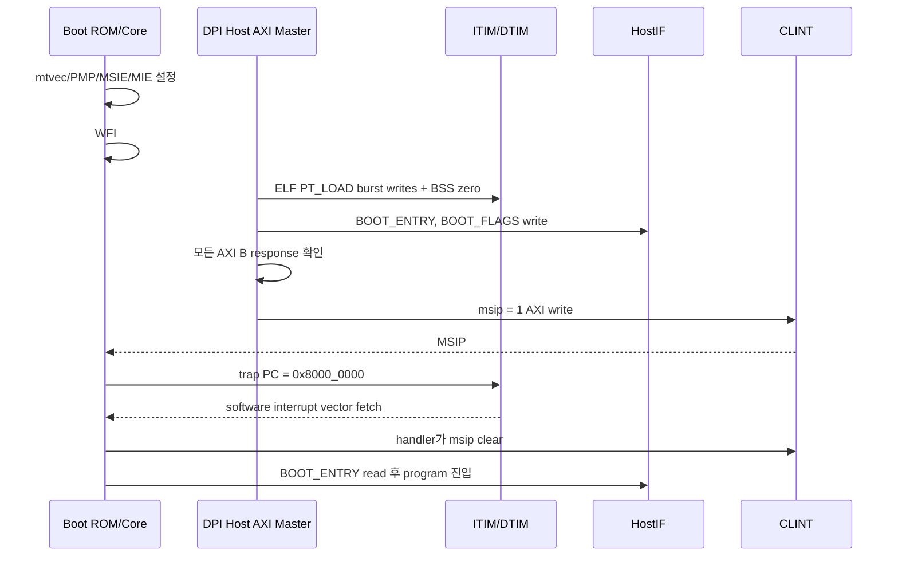
```mermaid
sequenceDiagram
    participant ROM as Boot ROM/Core
    participant HOST as DPI Host AXI Master
    participant TIM as ITIM/DTIM
    participant HIF as HostIF
    participant CL as CLINT
    ROM->>ROM: mtvec/PMP/MSIE/MIE 설정
    ROM->>ROM: WFI
    HOST->>TIM: ELF PT_LOAD burst writes + BSS zero
    HOST->>HIF: BOOT_ENTRY, BOOT_FLAGS write
    HOST->>HOST: 모든 AXI B response 확인
    HOST->>CL: msip = 1 AXI write
    CL-->>ROM: MSIP
    ROM->>TIM: trap PC = 0x8000_0000
    TIM-->>ROM: software interrupt vector fetch
    ROM->>CL: handler가 msip clear
    ROM->>HIF: BOOT_ENTRY read 후 program 진입
```

ITIM image contract는 `0x8000_0000`에 M-mode software interrupt vector/trampoline을 포함하는 것이다. 기본 linker layout은 vector 영역 `0x8000_0000..0x8000_00FF`, program text entry `0x8000_0100` 이후를 권장한다. vector는 `mcause=MSIP`를 확인하고 CLINT msip를 clear한 뒤 HostIF `BOOT_ENTRY`로 jump한다. ELF가 이 contract를 따르지 않으면 Host loader가 임의로 vector를 덮어쓰지 않고 오류를 보고한다.

일반 directed 환경의 `bootrom_wait.hex`는 위 ITIM trap-vector contract를 유지한다.
서버 HTIF top은 별도 `bootrom_host_jump.hex`를 선택한다. 이 ROM은 mtvec를 ROM 내부
wake handler로 두고 WFI한 뒤 MSIP가 오면 CLINT.msip를 clear하고 HostIF
`BOOT_ENTRY`를 읽어 곧바로 ELF `e_entry`로 jump한다. 따라서 서버 ELF가
`0x8000_0000`에 software-interrupt trampoline을 포함하지 않아도 되며, 실행 파일
경로와 ELF header만으로 entry가 결정된다. 이는 testbench boot adapter이고 합성
SoC의 기본 firmware contract를 바꾸지 않는다.

### 15.11 합성 top과 testbench 경계

| Module | 핵심 interface |
|---|---|
| `rv_soc_top` | clock/reset, external IRQ vector, Host AXI master port, retire trace |
| `rv_ooo_core` | IFU block port, dual LSU local ports, MSIP/MTIP/MEIP, debug/trace |
| `rv_i_fabric` | IFU port, local Boot ROM/ITIM, local master outbound, Xbar local inbound |
| `rv_d_fabric` | LSU0/1, DTIM banks, CLINT local port, AXI master outbound, AXI slave inbound |
| `rv_axi_xbar` | 3 AXI masters, 6 slave routes, ID prefix/response routing |
| `rv_clint` | local request/response, msip/mtip |
| `rv_plic` | AXI slave, source vector, meip, optional seip |
| `rv_bootrom_local` | `rv_i_fabric` 내부 64-bit read-only local target |
| `rv_hostif` | AXI slave + DPI event sideband |
| `rv_sram_1r1w` | native read/write bank interface |
| `rv_soc_addr_decode` | package/top parameter 기반 Main Xbar target decode |
| `rv_soc_map_check` | region 정렬, 범위, 중첩, MTvec/TIM 조건 elaboration 검사 |
| `tb_host_dpi` | ELF parser DPI-C + AXI master BFM + console/exit |

### 15.12 Module interface 작성 규칙과 구현 상태

이 절은 실제 RTL port와 예정 module의 interface contract를 한 곳에서 관리한다. 상태 표기는 다음과 같다.

- **Implemented**: 기능 RTL이 존재하며 parse/elaboration 대상이다.
- **Partial**: 데이터 경로가 동작하지만 ISA 또는 성능 목표의 일부 기능이 남아 있다.
- **Contract**: HDD에서 interface를 먼저 고정했으며 이후 같은 이름과 의미로 구현한다.

모든 request/response channel은 `valid/ready` handshake를 사용한다. transfer는 `valid && ready`인 rising edge에서 한 번만 발생하며, sender는 `valid && !ready` 동안 payload를 유지한다. exception/flush가 있더라도 이미 handshake된 request의 response는 반환하되 epoch/ROB sequence가 stale이면 consumer가 architectural state 갱신을 폐기한다.

| Module | 상태 | Clock/reset | 주 parameter |
|---|---|---|---|
| `rv_soc_pkg` | Implemented | 없음 | 전 region base/size, HostIF/CLINT/PLIC offset |
| `rv_axi4_if` | Implemented | `clk_i`, `rst_ni` | address/data/ID width |
| `rv_local_mem_if` | Implemented | `clk_i`, `rst_ni` | address/data/ID/ROB sequence width |
| `rv_soc_map_check` | Implemented | 없음 | 전 region base/size, boot mtvec |
| `rv_soc_addr_decode` | Implemented | 조합 | 전 region base/size |
| `rv_sram_1r1w` | Implemented | single clock, sync active-low reset | data width, depth, init file |
| `rv_tim_2bank` | Implemented | single clock, sync active-low reset | size KiB, data width, bank init file |
| `rv_clint` | Implemented | single clock, sync active-low reset | base/size, clock/timebase Hz |
| `rv_d_fabric` | Implemented | single clock, sync active-low reset | DTIM/CLINT map, ROB sequence, fairness bound |
| `rv_lsq_order_check` | Implemented | single clock, sync active-low reset | PADDR/data/SQ/age width |
| `rv_frontend`, `rv_fetch_queue`, `rv_fetch_target_buffer` | Implemented/verified: 2-wide redirect, 4×128-bit circular block queue, 16-entry single-read atomic target refill, cached 2-byte PMP parcel metadata | single clock, sync active-low reset | XLEN/PADDR/fetch bytes/queue/buffer/epoch |
| `rv_c_expander`, `rv_decode2`, `rv_divider` | Implemented standalone | 조합 또는 core clock/reset | XLEN, ISA enable, ROB sequence/tag |
| `rv_branch_predictor` | Implemented: BTB/tournament/RAS resolve+commit paths | core clock/reset | BTB/bimodal/global/chooser/RAS entries |
| `rv_backend`, `rv_ooo_core` | Integrated baseline: RV32IMFC directed/CoreMark/PMP-boundary regression PASS; ISA sign-off pending | single clock, sync active-low reset | XLEN/PADDR/window/resource sizes |
| `rv_i_fabric` | Implemented | single clock, sync active-low reset | Boot ROM/ITIM map, ROM image, fairness bound |
| `rv_local_to_axi_bridge` | Implemented | single clock, sync active-low reset | local/AXI ID width, instruction attribute |
| `rv_axi_to_local_bridge` | Implemented | single clock, sync active-low reset | target window, device attribute, max burst |
| `rv_axi_error_slave`, `rv_axi_xbar` | Implemented | single clock, sync active-low reset | local/Xbar ID width, 전 region map |
| `rv_bootrom_local/rv_bootrom`, `rv_plic_local/rv_plic`, `rv_hostif_local/rv_hostif` | Implemented | single clock, sync active-low reset | local leaf와 AXI wrapper, register map/event |
| `rv_soc_top` | Integrated baseline: Host AXI ELF load/readback, Boot ROM, MSIP wake directed PASS | single clock, sync active-low reset | 전 region, AXI ID, clock/timebase, S-mode hook |
| `rv_rename2` | Implemented standalone | core clock/reset | INT/FP physical registers, tag width, branch checkpoints |
| `rv_rob` | Implemented standalone | core clock/reset | XLEN, 48 entries, sequence width, allocate/complete/retire width |
| `rv_phys_regfile` | Implemented standalone | core clock/reset | data/tag width, backend instance 8R+6Q+2W+2A, zero-tag option |
| `rv_issue_queue`, `rv_issue_arbiter` | Implemented standalone | core clock/reset / 조합 | entries, wakeup/select/port/global issue width |
| `rv_int_alu`, `rv_branch_unit`, `rv_multiplier` | Implemented standalone | 조합 / core clock-reset | XLEN, ROB sequence/tag metadata |
| `rv_lsu_pipe` | Implemented standalone | core clock/reset | XLEN/PADDR/data/queue-index/ROB sequence 폭, `DEPTH`(1/2) |
| `rv_store_buffer` | Implemented standalone | core clock/reset | PADDR/data/entry/ROB sequence 폭 |
| `rv_lsq`, `rv_lsu_cluster` | Implemented and backend-integrated | core clock/reset | LQ/SQ/PADDR/data/tag/ROB sequence 폭 |
| `rv_fpu` | Implemented/verified: unified RV32F bit-level execute + 3-stage elastic transport, 6,470-vector fast 및 227,200-comparison extended exact-oracle PASS; 외부 Spike/SoftFloat random/exhaustive sign-off pending | core clock/reset | XLEN, latency, ROB sequence/tag 폭 |
| `rv_host_dpi`, `elf_loader.cpp` | Implemented; custom HostIF + server HTIF modes E2E verified | testbench clock/reset + Host AXI | 전 memory-map, ELF path, TOHOST/FROMHOST |
| `rv_writeback_arbiter`, `rv_branch_recovery`, `rv_exec_result_buffer` | Implemented and backend-integrated | core clock/reset 또는 조합 | Section 15.28~15.33 참조 |
| `rv_csr_file` | Implemented and backend-integrated | core clock/reset | Section 15.34 참조 |
| `rv_pmp` | Implemented and IFU/dual-LSU integrated | 조합 | PADDR/PMP entries/check ports, Section 15.34 참조 |
| `rv_trap_controller`, `rv_fence_controller` | Implemented and integrated baseline | core clock/reset 또는 조합 | Section 15.34~15.35 참조 |

### 15.13 공용 interface: `rv_local_mem_if`와 `rv_axi4_if`

`rv_local_mem_if` parameter:

| Parameter | 기본값 | 의미 |
|---|---:|---|
| `ADDR_WIDTH` | 32 | physical byte address 폭 |
| `DATA_WIDTH` | 64 | 한 beat의 data 폭 |
| `ID_WIDTH` | 6 | requester가 response를 식별하는 ID |
| `ROB_SEQ_WIDTH` | 8 | modulo age와 assertion metadata |

`rv_local_mem_if` requester 기준 port:

| Signal | 방향 | 폭 | 의미 |
|---|---|---:|---|
| `req_valid/req_ready` | requester→target / target→requester | 1 | request handshake |
| `req_id` | requester→target | `ID_WIDTH` | response에서 그대로 반환 |
| `req_addr` | requester→target | `ADDR_WIDTH` | byte address |
| `req_write` | requester→target | 1 | 0=read, 1=write |
| `req_size` | requester→target | 3 | `log2(bytes)`; 초기 최대 3=8 bytes |
| `req_wdata/req_wstrb` | requester→target | `DATA_WIDTH`, `DATA_WIDTH/8` | lane-aligned write data/byte enable |
| `req_priv` | requester→target | 2 | U/S/M privilege encoding |
| `req_rob_seq` | requester→target | `ROB_SEQ_WIDTH` | age, debug, store-order metadata |
| `req_committed` | requester→target | 1 | write external visibility 허가; write이면 반드시 1 |
| `req_device` | requester→target | 1 | strongly ordered/non-speculative attribute |
| `rsp_valid/rsp_ready` | target→requester / requester→target | 1 | response handshake |
| `rsp_id` | target→requester | `ID_WIDTH` | accepted request ID |
| `rsp_rdata` | target→requester | `DATA_WIDTH` | read data; write response에서는 0 |
| `rsp_resp` | target→requester | 2 | OKAY/SLVERR/DECERR |
| `rsp_replay` | target→requester | 3 | bank conflict/unknown-store 등 internal replay reason |

interface 자체 assertion은 stalled request/response stability와 `req_write -> req_committed`를 검사한다. `target` modport는 위 방향을 반전한다.

`rv_axi4_if`는 Section 15.1의 AW/W/B/AR/R signal을 그대로 묶는다. master modport는 AW/W/AR를 출력하고 B/R을 입력하며 slave modport는 반대다. `ADDR_WIDTH=32`, `DATA_WIDTH=64`, local `ID_WIDTH=4`, Xbar downstream `ID_WIDTH=6`이 기본이다. 각 channel은 독립 handshake이며 AW와 W가 같은 cycle에 도착할 필요는 없다.

### 15.14 I/D Fabric exact interface

#### `rv_d_fabric`

Parameter:

| Parameter | 기본값 | 제약/용도 |
|---|---:|---|
| `DTIM_BASE_ADDR/DTIM_SIZE_KB` | package 값 | 16-byte 단위로 2-bank 분할 가능해야 함 |
| `CLINT_BASE_ADDR/CLINT_SIZE_KB` | package 값 | CLINT register aperture |
| `CLOCK_HZ/TIMEBASE_HZ` | 100 MHz/10 MHz | 정수 divider 조건 |
| `ROB_SEQ_WIDTH` | 8 | 활성 ROB window가 modulo 반주기보다 작음 |
| `CORE_MAX_GRANTS` | 8 | 대기 중 Xbar inbound 전 강제 grant 상한 |

| Port | 방향/형식 | 의미 |
|---|---|---|
| `clk_i`, `rst_ni` | input | synchronous active-low reset |
| `lsu0_bus`, `lsu1_bus` | `rv_local_mem_if.target` | 두 LSU/store-buffer request |
| `xbar_in_bus` | `rv_local_mem_if.target` | Main Xbar에서 DTIM/CLINT로 들어오는 Host/other-master request |
| `outbound_bus` | `rv_local_mem_if.requester` | LSU의 non-local request; Xbar inbound는 이 port로 전달 금지 |
| `msip_o`, `mtip_o`, `mtime_o` | output | core interrupt와 time CSR source |

Timing/ordering contract:

- 각 initiator는 현재 baseline에서 최대 한 request outstanding이다. idle이면 새 request를 받고, 기존 response가 `rsp_valid && rsp_ready`로 소비되는 cycle에도 다음 request를 동시에 받을 수 있다.
- 서로 다른 DTIM bank read 두 개 또는 write 두 개는 같은 cycle accept할 수 있다.
- 한 bank는 read 하나와 write 하나를 같은 cycle accept할 수 있으며 같은 row이면 SRAM write-first bypass 결과를 read에 반환한다.
- 같은 bank의 LSU0/1 read 또는 write 충돌은 8-bit ROB sequence로 older request를 선택한다.
- 충돌한 younger request는 초기 구현에서 accept하지 않고 `req_ready=0`으로 유지한다. 따라서 requester가 payload를 보존하며, accepted transaction에 가짜 response를 만들지 않는다.
- Xbar inbound가 같은 bank에서 기다리는 동안 core grant가 8회 누적되면 다음 grant는 inbound에 준다.
- DTIM synchronous read, write ack, local error response는 accept 다음 cycle 발생한다. requester가 ready가 아니면 per-master one-entry response skid에 보관한다.
- response/request 동시 handoff에서는 combinational response가 반드시 기존 transaction의 ID/data/source를 유지한다. clock edge에서 기존 busy를 retire한 뒤 새 request metadata를 설치하므로 edge 이후 outstanding 수는 여전히 정확히 1이다. `busy && request_accept -> response_fire`와 handoff 다음 cycle `busy` 유지 assertion으로 이를 고정한다.
- misaligned/8-byte 초과 DTIM access는 SLVERR이며 memory side effect가 없다. uncommitted write도 SLVERR로 차단한다.
- CLINT는 한 request씩 round-robin하고 non-local LSU request는 outbound port 하나에서 older-first로 serialize한다. 단 CLINT/outbound에 grant했지만 target이 `req_ready=0`이면 그 requester를 accept될 때까지 계속 선택한다(`clint_lock_q`/`outbound_lock_q`, v1.18.8). 그 사이 older request가 나타나도 stall 중인 request를 바꾸지 않아 `rv_local_mem_if`의 "stall 중 request 유지" 계약을 target 쪽에서도 지킨다.

이 최적화는 transport turnaround만 줄인다. load issue의 `flush_valid` 차단, LSQ generation/tombstone, store의 `req_committed` 조건과 ROB-head commit 경계는 변경하지 않는다. 따라서 trap/branch flush cycle에 새 speculative load side effect가 생기지 않고, committed store는 recovery와 독립적으로 drain될 수 있다.

#### `rv_i_fabric`

Parameter:

| Parameter | 기본값 | 제약/용도 |
|---|---:|---|
| `BOOTROM_BASE_ADDR/BOOTROM_SIZE_KB` | package 값 | I-local read-only window |
| `BOOTROM_INIT_FILE` | empty string | synthesis/simulation Boot ROM image |
| `ITIM_BASE_ADDR/ITIM_SIZE_KB` | package 값 | 16-byte 단위 2-bank 분할 |
| `CORE_MAX_GRANTS` | 8 | 대기 inbound read 전 IFU 연속 grant 상한 |

| Port | 방향/폭 | 의미 |
|---|---|---|
| `if_req_valid/ready` | input/output | 16-byte IFU block request handshake |
| `if_req_addr[31:0]` | input | 반드시 16-byte aligned |
| `if_req_id[3:0]`, `if_req_epoch[3:0]` | input | frontend outstanding ID와 redirect generation |
| `if_rsp_valid/ready` | output/input | block response handshake |
| `if_rsp_id`, `if_rsp_epoch` | output 4-bit | accepted request metadata 반환 |
| `if_rsp_data[127:0]`, `if_rsp_resp[1:0]` | output | fetch block와 aggregate response |
| `xbar_in_bus` | `rv_local_mem_if.target` | S0 inbound bridge에서 들어오는 Boot ROM/ITIM 64-bit access |
| `outbound_bus` | `rv_local_mem_if.requester` | Boot ROM/ITIM 이외 non-local instruction fetch의 두 64-bit beat |

Local ITIM fetch는 같은 row의 bank0을 `data[63:0]`, bank1을 `data[127:64]`로 묶고 accept 다음 cycle 반환한다. Local Boot ROM fetch는 read-only 64-bit port를 low/high 순서로 두 번 사용한다. Xbar inbound ITIM write는 독립 write port를 사용하므로 IFU ITIM read와 동시 가능하며 같은 row이면 write-first data가 fetch에 보인다. inbound ITIM read가 기다리면 최대 8번의 IFU local grant 뒤 inbound read를 강제로 선택한다. inbound Boot ROM request는 진행 중인 IFU Boot ROM block과 serialize한다. inbound non-I-local access는 outbound로 loop하지 않고 SLVERR를 반환한다.

현재 baseline은 IFU block 한 건만 outstanding으로 처리하며 non-local block을 low/high 두 local beat로 순차 변환한다. target/loop buffer로 correct predicted-taken miss 비용을 먼저 줄였고, 최대 4 outstanding은 Main AXI bridge, I-Fabric response queue와 PMP fault ordering을 함께 확장하는 조건부 성능 단계로 둔다.

### 15.15 TIM과 CLINT leaf interface

`rv_tim_2bank`:

| Port | 방향 | 폭 | 의미 |
|---|---|---:|---|
| `read_en_i` | input | 2 | bank0/1 synchronous read enable |
| `read_row_i` | input | `2×ROW_WIDTH` | bank별 row |
| `read_valid_o/read_data_o` | output | 2 / `2×64` | 한 cycle 뒤 read result |
| `write_en_i` | input | 2 | bank별 write enable |
| `write_row_i` | input | `2×ROW_WIDTH` | bank별 row |
| `write_data_i/write_strb_i` | input | `2×64` / `2×8` | bank별 write data/byte enable |

`SIZE_KB=128`이면 `BANK_ROWS=8192`, `ROW_WIDTH=13`이다. `rv_sram_1r1w` 두 개를 사용하고 bank별 1R1W를 보장한다.

`rv_sram_1r1w`은 `read_en/read_addr -> read_valid/read_data` synchronous 1-cycle path와 독립 `write_en/write_addr/write_data/write_strb` path를 갖는다. 같은 cycle 같은 row read/write는 byte strobe가 적용된 new value를 반환한다. reset은 memory contents를 지우지 않고 read-valid/data register만 초기화한다. FPGA/ASIC memory를 매 reset마다 clear하지 않기 위한 의도다.

`rv_clint`:

| Port | 방향/형식 | 의미 |
|---|---|---|
| `bus` | `rv_local_mem_if.target` | 32-bit naturally aligned register access; 64-bit bus lane은 `addr[2]`로 선택 |
| `msip_o` | output | `msip[0]` level |
| `mtip_o` | output | `mtime >= mtimecmp` |
| `mtime_o[63:0]` | output | `time` CSR source |

CLINT는 response backpressure를 내부 한 entry로 유지한다. `msip` reset=0, `mtime` reset=0, `mtimecmp` reset=all-one이다. 잘못된 size/address는 SLVERR이고 register를 변경하지 않는다.

### 15.16 주소/최상위 utility interface

`rv_soc_map_check`는 port가 없는 elaboration-only module이다. 모든 `*_BASE_ADDR`, `*_SIZE_KB`, `BOOT_MTVEC_ADDR` parameter를 받아 zero-size, 4 KiB alignment, address overflow, pairwise overlap, TIM bank divisibility, mtvec range를 `$fatal`로 검사한다.

`rv_soc_addr_decode`는 `addr_i[31:0]` 하나를 받아 `target_o`를 다음 enum 중 하나로 반환하는 combinational module이다: `I_LOCAL`, `D_LOCAL`, `PLIC`, `HOSTIF`, `RESERVED`, `ERROR`. I local은 Boot ROM과 ITIM 두 window를, D local은 DTIM과 CLINT 두 window를 포함한다. enum 값은 Xbar target index와 일치하도록 S0부터 S5까지 명시적으로 지정한다.

`rv_soc_top`의 합성 경계 port는 다음과 같다.

| Port | 방향/형식 | 의미 |
|---|---|---|
| `clk_i`, `rst_ni` | input | SoC clock/reset |
| `external_irq_i[PLIC_NUM_SOURCES-1:1]` | input | source0을 제외한 external interrupt vector |
| `host_axi_s` | `rv_axi4_if.slave` | DPI Host 또는 검증 BFM이 구동하는 SoC ingress; 표준 RISC-V debugger port는 아님 |
| `soc_ready_o` | output | Boot/SoC fabric이 transaction을 받을 수 있음 |
| `host_boot_entry_o`, `host_boot_flags_o` | output | HostIF boot mailbox sideband |
| `host_event_valid_o/ready_i` | output/input | CPU→DPI event handshake |
| `host_event_kind_o`, `host_event_data_o` | output | tohost/exit/console event |
| `trace_valid_o[1:0]` | output | dual commit trace valid |
| `trace_pc_o`, `trace_instr_o` | output | retire PC/instruction |
| `trace_rd_write_o`, `trace_rd_fp_o`, `trace_rd_o`, `trace_rd_wdata_o` | output | architectural INT/FP destination write record |
| `trace_trap_o`, `trace_cause_o`, `trace_tval_o` | output | precise trap marker, cause, trap value |

top parameter override는 반드시 map-check, decoder, I/D fabric, peripheral instance까지 전달한다. package default를 하위 module에서 다시 참조해 top override를 잃는 연결은 금지한다.

### 15.17 Core shell과 LSQ checker interface

`rv_ooo_core`의 외부 interface는 네 group이다.

| Group | 핵심 signal | 계약 |
|---|---|---|
| IFU | `imem_req_{valid,ready,addr,id,epoch}`, `imem_rsp_{valid,ready,id,epoch,data,resp}` | 16-byte aligned block, 현재 1 outstanding, redirect epoch 반환 |
| Dual LSU | `dmem_req_*[1:0]`, `dmem_rsp_*[1:0]` | 두 64-bit local request/response lane, 8-bit ROB sequence, lane별 1-entry fall-through request buffer |
| Interrupt/debug | `irq_software/timer/external`, `debug_halt_req` | commit boundary에서 precise accept |
| Retire trace | lane별 valid/PC/instruction/rd/write-data/trap | commit한 instruction만 valid |

`rv_frontend`는 backend redirect, predictor resolve/commit update, 2-wide raw/length/prediction fetch output과 IFU block memory port를 갖는다. predicted-taken lane 이후 lane을 억제하고 target block으로 내부 epoch redirect하며 stale response를 버린다. `rv_backend` 안의 decoder가 C instruction을 canonical 32-bit instruction으로 확장한다. `rv_backend`는 2-wide fetch bundle, dual LSU port, interrupt/debug/`mtime_i`, retire trace, privilege/PMP state와 predictor resolve/commit update를 갖는다. integer/branch/M/F/dual-LSU, CSR/privilege/trap/WFI/FENCE 및 IFU/LSU PMP 데이터 경로가 연결된 구조 완성 후보이며, controller를 별도 module로 분리하는 것은 PPA/refactor 단계이지 ISA 기능 미구현을 뜻하지 않는다.

IFU와 각 LSU request는 `valid && !ready`인 동안 valid와 전체 payload를 그대로
유지한다. IFU는 redirect만 명시적인 cancellation/replacement boundary로 인정한다.
dual LSU는 core shell의 lane별 1-entry fall-through buffer가 backend arbitration과
D-Fabric backpressure를 분리한다. 빈 buffer는 zero-cycle bypass하고 stall 시에만
요청을 저장하므로 정상 ready 경로에는 latency가 추가되지 않는다. backend/LSQ는
buffer가 요청을 받은 순간 issue로 기록한다. 따라서 그 뒤 branch flush가 발생해도
accepted load의 LQ entry가 tombstone으로 남아 response ID 재사용을 막는다. 이미
외부에 보인 committed store/load request는 priority 변화만으로 철회하거나 payload를
바꿀 수 없다.

`rv_lsq_order_check`는 load 한 건에 대해 다음 입력을 검사한다.

이 module은 조합 ordering reference와 assertion 단위시험용이며 현재 `rv_lsq` datapath가 직접 인스턴스하지 않는다. `clk_i/rst_ni`는 조합 결과를 검사하는 simulation assertion에만 사용한다.

| Input/output | 의미 |
|---|---|
| `load_valid/addr/mask` | 검사할 load beat와 requested byte |
| `sq_valid`, `sq_older_than_load` | valid하면서 해당 load보다 older인 SQ 후보 |
| `sq_addr_valid`, `sq_data_valid` | store address/data resolution 상태 |
| `sq_age` | 1=youngest older, 값이 클수록 더 older인 wrap-aware distance |
| `sq_addr/mask/data` | forwarding compare/data |
| `pair_store_*` | 같은 cycle lane0 older-store → lane1 younger-load bypass |
| `load_can_issue` | memory 또는 forwarding으로 진행 가능 |
| `memory_read` | 모든 older store와 non-overlap이므로 D-Fabric read 필요 |
| `forward_valid/data/index` | youngest older full-cover store 결과 |
| `stall_reason` | unknown address/store data/partial overlap |

### 15.18 SoC module interface contract

| Module | Initiator/target interface | 부가 port | 필수 동작 |
|---|---|---|---|
| `rv_axi_xbar` | `m0_s..m2_s` AXI slave-facing inputs, `s0_m..s5_m` AXI master-facing outputs | parameterized decode | master-prefix ID, AW/W ownership, B/R return route, round-robin fairness |
| `rv_plic` | AXI4 slave | `source_i[31:1]`, `meip_o`, optional `seip_o` | priority/pending/enable/threshold/claim-complete |
| `rv_bootrom_local` | `rv_local_mem_if.target` | optional init image parameter | 64-bit read, all write SLVERR; `rv_i_fabric` 내부 instance |
| `rv_hostif` | AXI4 slave | DPI console/exit/event sideband | Section 15.9 register semantics |

I-Fabric port는 IFU용 128-bit block channel과 Xbar inbound 64-bit channel을 섞지 않는다. S0 inbound bridge는 Boot ROM/ITIM 두 window를, S1 inbound bridge는 DTIM/CLINT 두 window를 재검사한다. 잘못된 route나 window-crossing burst는 local side effect 없이 error를 반환한다.

### 15.19 Core 내부 module interface contract index

| Module | 주요 input | 주요 output | backpressure/flush 계약 |
|---|---|---|---|
| `rv_decode2` | 2-wide PC/raw instruction/length/fault/prediction | 2-wide decoded uop/control/immediate | lane0 illegal도 lane1의 program order를 유지 |
| `rv_rename2` | 2-wide arch source/destination와 class, commit/recovery/checkpoint control | physical src/dst/stale tag, free count/checkpoint valid | 통합 backend의 ROB/IQ/LSQ/checkpoint 자원 중 하나라도 부족하면 `dispatch_accept_i=0` |
| `rv_rob` | allocate2, completion events, live queries, flush control | head2 retire bundle, scalar head/trap view, count/empty/full | lane1 retire fire는 lane0 fire를 포함; flush는 입력 boundary를 적용 |
| `rv_issue_queue` | dispatch uop, writeback tag broadcast, flush sequence | oldest-ready candidate와 accept | unit accept 전 entry 제거 금지 |
| `rv_issue_arbiter` | unified-IQ candidate 2개와 5-port mask/unit-ready | 최대 2 grant | 같은 entry/port 중복 grant 금지 |
| `rv_phys_regfile`의 INT/FP instance | 8 read, 6 query, 2 write, 2 allocate | read data/ready와 query-ready | writeback grant와 wakeup 동일 cycle 일치 |
| `rv_int_alu`, `rv_branch_unit`, `rv_multiplier`, `rv_divider` | issue payload/valid | completion valid/result/exception/branch resolve | stateful unit은 output backpressure 시 identity/result stable |
| `rv_lsq` | dispatch2, AGU update2, store-data update2, commit2, flush | LSU issue permission, forwarding, store-buffer request | Section 11 불변조건 전체 적용 |
| `rv_store_buffer` | committed SQ enqueue 최대2 | D-Fabric write 최대2 | enqueue sequence 단조 증가, device access serialize |
| `rv_csr_file` | evaluate/commit CSR op, trap/MRET/WFI, interrupt/time, retire/fflags | CSR read/illegal/write-effect, trap vector, MRET PC, interrupt eligibility, privilege/PMP/FCSR state | CSR side effect는 commit에서만; redirect 선택은 trap controller가 소유 |

공통 internal payload의 architectural identity는 8-bit ROB sequence다. PC와 physical
destination/class는 필요한 queue와 completion에만 포함하고 ROB array index는 ROB
allocate/retire 내부 위치이므로 모든 execution bundle에 복제하지 않는다. backend
speculative module의 flush는 `flush_valid`, `flush_all`, `flush_sequence` 세 신호를
사용한다. fetch `epoch[3:0]`는 frontend/I-memory 응답에만 있으며 D-memory는 LQ
tombstone과 request ID로 stale response를 막는다.

### 15.20 AXI/local bridge exact interface

#### `rv_local_to_axi_bridge`

| Port | 방향/형식 | 의미 |
|---|---|---|
| `local_bus` | `rv_local_mem_if.target` | I/D Fabric outbound request 수신 |
| `axi_m` | `rv_axi4_if.master` | Main Xbar master port 구동 |
| `clk_i`, `rst_ni` | input | single clock/reset |

Parameter는 `ADDR_WIDTH=32`, `DATA_WIDTH=64`, `LOCAL_ID_WIDTH=6`, `AXI_ID_WIDTH=4`, `ROB_SEQ_WIDTH=8`, `AXI_PROGRESS_TIMEOUT_CYCLES=4096`, `IS_INSTRUCTION`이다. 한 local request만 outstanding으로 유지하고 원래 local ID를 response까지 보관한다. read는 AR 한 건과 RLAST 한 beat, write는 AW와 W를 서로 독립 handshake한 뒤 B를 기다린다. AW와 W 중 한 channel만 먼저 accept되어도 다른 channel의 payload와 valid를 유지한다. local request가 misaligned이거나 8-byte보다 크면 AXI side effect 없이 local SLVERR를 반환한다. write request는 captured `req_committed=1`일 때만 AW/W를 만들 수 있다.

AXI channel에서 `ARREADY`, 남은 `AWREADY/WREADY`, `RVALID` 또는 `BVALID`의 forward progress가 `AXI_PROGRESS_TIMEOUT_CYCLES` 동안 없으면 bridge는 기다리는 local request에 zero data와 `SLVERR`를 반환한다. I path는 instruction access fault, D path는 load/store access fault로 변환되므로 faulting ROB entry가 영구 미완료 상태로 남지 않는다. 값 0은 watchdog 비활성화다. 기본 4096 cycles는 내부 TIM/MMIO/error-slave의 정상 지연보다 충분히 크며 외부 IP latency 요구에 맞춰 package 또는 `rv_soc_top` instance에서 override한다.

timeout 전에 AR/AW/W가 전혀 accept되지 않았다면 transaction을 안전하게 취소한다. 이미 AXI channel 일부 또는 전부가 accept된 경우에는 AXI transaction을 취소할 수 없으므로 core에는 먼저 오류를 보고한 뒤 bridge가 전용 drain state에서 늦은 R/B를 소비한다. drain 동안 새 outbound transaction은 받지 않으며, 이 규칙이 timeout된 ID의 늦은 response가 재사용된 local ID에 연결되는 것을 막는다. 영구 고장 slave라면 해당 bridge는 drain에 남지만 trap handler가 ITIM/DTIM과 정상 local device만 사용하는 한 core의 faulting instruction과 ROB는 계속 진행할 수 있다. 특히 AW/W가 이미 accept된 write timeout은 외부 side effect 여부를 되돌려 확인할 수 없는 platform-fatal 상태이므로 software가 해당 store를 재시도해서는 안 된다. 정상적인 unmapped 주소는 이 watchdog까지 가지 않고 default error slave의 DECERR로 side effect 없이 종료된다.

현재 bridge는 local 요청 하나를 AXI `LEN=0`, `BURST=INCR` transaction으로 변환한다. Main Xbar의 master별 multiple-outstanding 성능 목표는 이후 ID queue 확장에서 구현하지만, interface와 response ID 계약은 바꾸지 않는다.

#### `rv_axi_to_local_bridge`

| Port | 방향/형식 | 의미 |
|---|---|---|
| `axi_s` | `rv_axi4_if.slave` | Main Xbar downstream transaction 수신 |
| `local_bus` | `rv_local_mem_if.requester` | I/D Fabric 또는 local peripheral request 구동 |
| `clk_i`, `rst_ni` | input | single clock/reset |

주 parameter는 `TARGET_BASE_ADDR`, `TARGET_SIZE_KB`, `TARGET_IS_DEVICE`, 선택적인 `SECOND_TARGET_{ENABLE,BASE_ADDR,SIZE_KB,IS_DEVICE}`, `MAX_BURST_BEATS=16`이다. S0 bridge의 두 window는 ITIM/Boot ROM이고 S1 bridge의 두 window는 DTIM/CLINT다. 각 burst는 두 window 중 정확히 한 window 안에 완전히 들어가야 하고, beat의 `req_device`는 실제로 선택된 window 속성에서 생성한다. bridge는 한 read 또는 write burst만 처리하고 다음 규칙을 적용한다.

- AW와 AR이 동시에 valid이면 AW를 accept하고 AR에 backpressure한다. W는 AW metadata를 저장한 뒤에만 받는다.
- INCR, 1/2/4/8-byte naturally aligned, 최대 16-beat만 정상 transaction이다.
- 첫 local request 전에 `start + (LEN+1)×beat_bytes`가 target의 half-open window 안인지 검사한다. window-crossing burst는 local side effect 0회로 전 beat SLVERR를 반환한다.
- write는 W beat를 capture하고 local write response를 받은 뒤 다음 W beat를 받는다. 최종 B response는 모든 local response 중 DECERR > SLVERR > OKAY 순으로 병합한다.
- read는 local response 하나를 R beat 하나로 보낸 뒤 다음 address를 요청한다. `RLAST`는 `beat_index==ARLEN`에서만 1이다.
- Host/DPI write는 local `req_committed=1`로 변환하며 target device parameter를 `req_device`에 전달한다.

`rv_axi_bridge_tb`는 local→AXI→local write/read 왕복, ID 보존, misaligned 차단에 더해 AR accept 이후 R response 및 AW/W accept 이후 B response를 각각 차단한다. 두 경우 모두 8-cycle watchdog의 SLVERR 완료, late-response drain, 다음 ID의 정상 readback을 검사한다. `rv_axi_to_local_burst_tb`는 4-beat write/read, RLAST, window-crossing burst와 4-KiB-crossing burst의 partial-side-effect 금지를 검사한다.

### 15.21 Main AXI Xbar exact interface와 baseline 동작

`rv_axi_xbar`는 AXI4 32-bit address/64-bit data interconnect다. upstream ID는 기본 4-bit이고 downstream ID는 `{master_prefix[1:0], local_id}`의 6-bit다. `AXI_XBAR_ID_WIDTH`는 `AXI_LOCAL_ID_WIDTH+2` 이상이어야 한다.

| Port | 방향/형식 | 연결 |
|---|---|---|
| `m0_s` | `rv_axi4_if.slave`, local ID | I-Fabric outbound bridge |
| `m1_s` | `rv_axi4_if.slave`, local ID | D-Fabric outbound bridge |
| `m2_s` | `rv_axi4_if.slave`, local ID | DPI Host/검증 BFM master |
| `s0_m` | `rv_axi4_if.master`, prefixed ID | Boot ROM+ITIM/I-Fabric inbound bridge |
| `s1_m` | `rv_axi4_if.master`, prefixed ID | DTIM+CLINT/D-Fabric inbound |
| `s2_m` | `rv_axi4_if.master`, prefixed ID | PLIC |
| `s3_m` | `rv_axi4_if.master`, prefixed ID | HostIF |
| `s4_m` | `rv_axi4_if.master`, prefixed ID | reserved DECERR slave |
| `s5_m` | `rv_axi4_if.master`, prefixed ID | default/unmapped DECERR slave |

baseline Xbar는 다음 규칙을 지킨다.

- AW/AR은 target별 독립 round-robin으로 3 master를 중재한다. 주소, 크기, INCR burst와 마지막 byte가 같은 region인지 handshake 전에 검사하며 최대 16 beat만 허용한다.
- AW가 accept되면 해당 target의 W owner를 WLAST handshake까지 고정한다. 다른 master의 W가 섞일 수 없다.
- B/R ID의 상위 master prefix로 response를 원래 master에 돌리고, 외부에는 하위 local ID만 반환한다. 유효하지 않은 prefix response는 architectural master로 전달하지 않는다.
- 현재 구현은 master마다 write transaction 1개와 read transaction 1개만 outstanding으로 허용한다. read와 write는 동시에 하나씩 진행할 수 있다. 이후 성능 확장에서 ID별 outstanding table을 추가하더라도 port와 prefix 계약은 유지한다.
- unmapped, unsupported burst, region-crossing request는 `s5_m`의 `rv_axi_error_slave`로 보내 DECERR를 반환한다.

### 15.22 `rv_soc_top` exact interface와 실제 연결

`rv_soc_top`은 Core→I/D Fabric→local-to-AXI bridge→Main Xbar와 Xbar→inbound bridge→I/D-Fabric, PLIC, HostIF, error target을 실제 interface instance로 연결한다. Boot ROM은 `rv_i_fabric.u_bootrom_local`이고 ITIM과 함께 I-local target이다. 따라서 core reset fetch는 Xbar를 통과하지 않지만 Host/LSU의 Boot ROM read는 Xbar S0와 `u_i_inbound_bridge`를 통과한다. core reset PC는 `BOOTROM_BASE_ADDR`이며 `BOOT_MTVEC_ADDR`는 map check와 Boot ROM software contract에 사용한다.

| Port | 방향/형식 | 의미 |
|---|---|---|
| `clk_i`, `rst_ni` | input | SoC 단일 clock/synchronous active-low reset |
| `external_irq_i[PLIC_NUM_SOURCES-1:1]` | input | PLIC source0을 제외한 level interrupt |
| `host_axi_s` | `rv_axi4_if.slave` | Main Xbar M2에 직접 연결되는 DPI/debug ingress |
| `soc_ready_o` | output | reset 해제 후 fabric request 수락 가능 |
| `host_boot_entry_o`, `host_boot_flags_o` | output 32-bit | HostIF boot mailbox 관찰 sideband |
| `host_event_valid_o/ready_i` | output/input | CPU→DPI event handshake |
| `host_event_kind_o`, `host_event_data_o` | output | tohost/exit/console event payload |
| `trace_valid_o[1:0]` | output | dual in-order retire valid |
| `trace_pc_o`, `trace_instr_o` | output | retire PC/instruction |
| `trace_rd_write_o`, `trace_rd_fp_o`, `trace_rd_o`, `trace_rd_wdata_o` | output | committed register write; `rd_fp=1`이면 FP namespace |
| `trace_trap_o`, `trace_cause_o[1:0][5:0]`, `trace_tval_o` | output | synchronous/interrupt trap record |

주소/크기, AXI ID 폭, `CLOCK_HZ/TIMEBASE_HZ`, `HAS_SMODE`, `BOOTROM_INIT_FILE`은 top parameter로 노출된다. 모든 region override는 map check, Xbar, inbound bridge, Fabric 및 peripheral까지 동일하게 전달해야 한다. I inbound bridge는 ITIM/Boot ROM을 normal memory window로, D inbound bridge는 DTIM을 normal memory와 CLINT를 device window로 구분한다. PLIC의 `seip_o`는 `HAS_SMODE=1`에서 생성되지만 초기 M/U core에는 아직 연결하지 않고 향후 S-mode interrupt input hook으로 남긴다.

현재 통합 top은 predictor 기반 frontend, RV32IMFC backend, dual D-memory traffic, CSR/privilege/trap/WFI/FENCE/PMP, interrupt/timebase, recovery redirect와 retire trace를 연결한다. CLINT의 MSIP/MTIP와 PLIC MEIP는 CSR interrupt eligibility에 반영되고 `mtime_o`는 `time` CSR source로 전달된다. 실행 가능한 Boot ROM과 directed BFM 경로에 더해 별도 `rv_soc_dpi_tb`가 `rv_host_dpi`를 Host AXI slave ingress에 연결한다. FPU/DPI 동작은 directed ELF로 확인했지만 predictor random stress와 전체 ISA differential sign-off는 Section 18의 후속 검증 항목이다.

### 15.23 `rv_rename2` exact interface와 상태 전이

`rv_rename2`는 INT/FP namespace별 32-entry RAT/RRAT, 기본 80-bit free bitmap과 8개 branch checkpoint를 보관한다. INT/FP tag 값이 같아도 register class가 다르면 서로 다른 physical file을 가리킨다.

| Interface group | 핵심 signal | 계약 |
|---|---|---|
| rename input | `rename_valid_i[1:0]`, 3개 source class/arch, destination class/arch/write | lane1 valid는 lane0 valid를 요구한다 |
| dispatch handshake | `rename_can_accept_o`, `dispatch_accept_i`, `rename_fire_o` | `rename_fire_o`일 때만 RAT/free-list/checkpoint가 원자 갱신된다 |
| renamed output | lane별 `src{0,1,2}_phys_o`, `destination_phys_o`, `stale_phys_o`, `writes_destination_o` | INT x0 destination write는 억제된다 |
| commit | lane별 destination class/arch/new/stale tag | RRAT을 new tag로 바꾸고 stale tag를 free-list 및 모든 live checkpoint에 반환한다 |
| full recovery | `recover_committed_i` | RAT←RRAT, RRAT mapping을 제외한 tag로 free-list 재구축, checkpoint 전부 clear |
| branch checkpoint | lane별 `checkpoint_save_i/id`, restore/release/clear-mask | lane0 branch snapshot에는 lane0 rename까지, lane1 snapshot에는 두 lane rename까지 포함한다 |
| status | checkpoint valid bitmap, INT/FP free count | dispatch 자원 판정과 debug/formal에 사용한다 |

두 lane이 같은 architectural destination을 쓰면 lane0은 기존 RAT mapping을 stale tag로 받고 lane1은 lane0의 새 tag를 stale tag로 받는다. lane1 source는 lane0 destination과 일치할 때 갱신된 working RAT을 읽으므로 별도 비교 mux와 같은 효과를 갖는다. INT와 FP에 필요한 새 tag 수를 lane 순서로 예약하며 어느 class든 tag가 부족하면 `rename_can_accept_o=0`이고 어느 상태도 바뀌지 않는다.

free-list의 first-free 선택은 80-bit 직렬 priority chain이 아니다. INT/FP 각각 bitmap을 8-bit group으로 OR-reduce하고, 첫 non-empty group을 고른 뒤 해당 group 안에서 첫 bit를 고르는 2-level encoder다. architectural allocation 순서는 기존과 같이 낮은 physical tag 우선이며 기능 계약은 바뀌지 않지만 rename critical cone의 직렬 깊이를 줄인다.

commit은 같은 cycle rename보다 논리적으로 먼저 처리한다. 따라서 그 cycle에 반환된 stale tag를 새 instruction이 즉시 재사용할 수 있다. branch snapshot의 free bitmap에도 older commit의 stale-tag 반환을 반영해 반복적인 checkpoint restore가 physical tag를 누수시키지 않게 한다. 현재 baseline은 recovery cycle과 commit 동시 발생을 금지하며 assertion으로 검사한다. backend commit/recovery arbiter가 이 조건을 보장해야 한다.

`rv_rename2_tb`는 reset free count, dual-lane RAW/WAW, dual commit stale 반환,
lane0 checkpoint 뒤 lane1 제거, RRAT 전체 복구 시나리오를 실행하며 현재 Verilator
unit regression에서 PASS한다.

### 15.24 `rv_rob` exact interface와 trap handshake

| Interface group | 핵심 signal | 계약 |
|---|---|---|
| allocate | `alloc_valid_i[1:0]`, 단일 `alloc_ready_o`, index/sequence output, PC/instruction/rename/store/branch/exception metadata | lane1은 lane0 없이 할당할 수 없고 두 entry는 원자 할당된다 |
| complete | 기본 4개 `complete_valid/sequence`, exception, branch resolve metadata | 임의 순서로 matching sequence entry를 complete로 만든다 |
| liveness query | `live_query_sequence_i[LIVE_QUERY_PORTS]` → `live_query_valid_o` | 현재 valid ROB generation인지 조합 검사; WB stale result 차단 |
| retire | `retire_valid_o[1:0]`, `retire_ready_i[1:0]`, rename/store metadata | head부터 in-order이며 lane1 fire는 lane0 fire를 요구한다 |
| head inspection | head valid/complete/sequence/PC/raw instruction/length, destination class/tag, source0 tag | CSR/system/fence를 ROB head에서 실행하기 위한 scalar view |
| trap | `trap_valid/ready`, sequence/PC/cause/tval | complete exception이 head일 때만 valid; accept cycle에 외부 controller가 `flush_all_i=1`을 함께 주어야 한다 |
| recovery | `flush_all_i`, `flush_younger_i`, `flush_sequence_i` | full clear 또는 boundary를 포함하고 younger sequence만 제거한다 |
| status | count/empty/full | dispatch 자원 판정에 사용한다 |

retire와 allocate가 같은 cycle이면 retire로 생긴 공간을 즉시 재사용할 수 있다. active ROB는 8-bit sequence 공간의 절반보다 작아야 하며 현재 48-entry는 wrap-aware signed subtraction 조건을 만족한다. `next_sequence`는 branch flush에서 되돌리지 않아 stale completion과 새 entry가 같은 sequence를 곧바로 공유하지 않는다. `rv_rob_tb`는 incomplete-head blocking, dual retire, precise exception, full/younger flush를 기술한다.

### 15.25 `rv_issue_queue`와 `rv_issue_arbiter` exact interface

`rv_issue_queue`는 현재 backend에서 한 번 인스턴스화되는 unified queue다.
`ENTRIES=INT_IQ_ENTRIES+MEM_IQ_ENTRIES+FP_IQ_ENTRIES=56`,
`SELECT_WIDTH=2`, `EXEC_PORTS=5`, `WRITEBACK_PORTS=8`로 사용한다.
단독 module default의 WRITEBACK_PORTS=4와 backend 실제 instance8을 구분한다.
backend는7개 live execution producer와1개 등록된 system/CSR wakeup을 연결한다.

| Interface group | 핵심 signal | 계약 |
|---|---|---|
| dispatch2 | sequence, FU, execution-port mask, source used/tag/ready 3개, destination, PC/instruction/immediate/op, LQ/SQ index | free slot이 두 lane 모두에 충분할 때 원자 accept |
| wakeup | 단독 기본4, backend8개 `writeback_valid/class/phys` | 저장 ready bit를 edge에서 갱신하고 같은 cycle candidate 판정에도 tag-match bypass; WB grant와 producer presented result를 구분 |
| candidate | 기본 2개 oldest-ready payload, `candidate_store_address_valid_o`, `candidate_store_data_valid_o`, `candidate_accept_i` | 일반 uop/최종 store phase만 제거; address-only store는 entry에 잔류 |
| flush | all 또는 younger-than-sequence | flush cycle candidate/dispatch를 차단하고 해당 valid를 제거 |
| status | count/empty/full | 현재 저장된 valid entry 수이며 예상 issue count가 아니다 |

v1.18.15 FU predecode에는 `candidate_fu_onehot_o[SELECT_WIDTH][FU_ONEHOT_WIDTH]`
출력을 추가한다. `FU_ONEHOT_WIDTH=1 << $bits(fu_class_e)=16`이며 class enum 값에 해당하는
한 bit만 set된다. 각 entry의 저장 `fu_q`를 먼저 decode하고 기존 candidate one-hot 선택으로
reduce하므로 추가 FF나 pipeline cycle은 없다. encoded `candidate_fu_o`도 그대로 제공한다.
payload와 마찬가지로 flush cycle에는 valid만 막으며 one-hot class도 invalid 동안 don't-care다.
backend resource mask는 이 class bit를 사용하고 clocked legacy-mask equality로 검증한다.
whole-backend 공개 screening3381.34→3327.95 ps와 기능 등가 검증 후 채택했다. 서버 STA는 별도 확인한다.

IQ allocation은 현재 register에 저장된 invalid slot만 사용한다. 그 cycle에 accept된 candidate slot을 dispatch가 조합으로 즉시 재사용하지 않으므로 full IQ는 한 cycle dispatch를 멈춘 뒤 다음 cycle 반환 slot을 사용한다. 이 경계가 result/WB→issue accept→allocation→`fu_q` D로 이어지던 장경로를 끊는다. 일반 uop은 저장 ready 또는 현재 live producer/system tag match를 사용하므로 dependent uop의 same-cycle wakeup/select는 유지한다. 현재 oldest/second-oldest 후보는 저장된 age matrix와 subtree의 saturating {any, ge2} 정보를 이용해 병렬로 고르며, 선택 one-hot으로 payload를 AND-OR reduce한다. P0~P3의 정수·분기·memory payload는 fall-through이고 P4 FP payload와 최대 3개 operand만 register에 capture되어 다음 cycle FPU에 도달한다. store는 `address-issued=0`이면 base(src0)만 준비돼도 address phase candidate가 되고 data(src1)가 준비되지 않았으면 accept 후에도 같은 entry를 유지한다. 이후 src1 wakeup은 address-valid=0/data-valid=1인 최종 phase를 만들며 그 accept에서만 entry를 제거한다. 두 phase 모두 동일 ROB sequence와 SQ index를 유지하고 flush는 잔류 phase도 동일한 age 규칙으로 제거한다. `rv_issue_queue_tb`는 same-cycle wakeup/select, oldest-ready dual select, full-queue next-cycle slot reuse, younger flush와 split store-address/data 재발행을 기술한다.

`rv_issue_arbiter`의 module 기본 parameter는 `CANDIDATE_COUNT=5`지만 현재 backend
instance는 unified IQ가 만든 후보 두 개만 연결하므로 `CANDIDATE_COUNT=2`,
`EXEC_PORTS=5`, `ISSUE_WIDTH=2`로 override한다. `candidate_valid/sequence/port_mask`와
`port_ready`를 받아 가장 오래된 eligible candidate를 먼저 고정하되 여러 포트가
가능하면 다른 candidate가 사용할 포트를 남기는 배치를 우선한다. 출력은 candidate별
grant/port, port별 valid/candidate, age 순 issue slot이다. 같은 candidate나 port의
중복 grant 및 2개 초과 grant는 assertion 대상이다. split IQ를 도입할 때만 candidate
수를 다시 5 이상으로 넓힌다.

arbiter의 P0~P3 `port_valid/port_candidate`는 정수·분기·LSU 실행 경로에 fall-through로 연결된다. P4만 registered FP issue slot이 candidate metadata와 최대 3개 PRF operand를 capture한다. FP slot이 비었거나 현재 payload를 FPU가 consume하는 cycle에 새 payload를 받아 같은 edge consume+refill할 수 있으므로 pipelined FP 처리율은 1 request/cycle이다. flush는 boundary보다 younger FP slot 또는 full-flush의 slot을 invalidate한다. 이 경계가 IQ oldest-select와 asynchronous PRF read가 FPU payload register까지 이어진 기존 critical endpoint를 분할한다.

### 15.26 `rv_phys_regfile` exact interface

`rv_phys_regfile`의 module 기본값은 4 read/6 query/2 write/2 allocation port지만,
backend instance는 `READ_PORTS=8`, `QUERY_PORTS=6`, `WRITE_PORTS=2`,
`ALLOC_PORTS=2`로 override한다. 기본 80 entries와 7-bit tag를 갖는 검증용
flop-array다. INT는 `DATA_WIDTH=XLEN`, `ZERO_REGISTER=1`, FP는
`DATA_WIDTH=32`, `ZERO_REGISTER=0`으로 인스턴스화한다.

| Port group | exact signal | 의미 |
|---|---|---|
| data read | `read_addr_i[READ_PORTS][TAG_WIDTH]` → `read_data_o[READ_PORTS][DATA_WIDTH]`, `read_ready_o` | asynchronous read + same-cycle WB bypass |
| readiness query | `query_addr_i[QUERY_PORTS][TAG_WIDTH]` → `query_ready_o` | dispatch source-ready 초기화, data는 읽지 않음 |
| writeback | `write_valid_i`, `write_addr_i`, `write_data_i` arrays | grant된 CDB 결과만 value/ready를 갱신 |
| allocate | `allocate_valid_i`, `allocate_addr_i` arrays | 새 producer tag의 ready를 0으로 clear |
| debug probe | scalar `probe_addr_i` → `probe_ready_o` | assertion/debug용 ready 조회 |

- read는 `read_addr_i`에 대한 data와 ready를 반환하고 같은 cycle writeback tag가 일치하면 새 data/ready를 bypass한다.
- rename이 새 destination tag를 할당하면 `allocate_valid/addr`가 ready bit를 0으로 만든다.
- allocation과 writeback이 같은 tag에서 충돌하면 allocation이 우선한다. 이는 재사용된 tag에 stale producer 결과가 ready를 세우지 못하게 하는 방어선이며, 정상 통합에서는 ROB sequence/generation filter도 stale writeback 자체를 차단한다.
- INT zero tag read는 항상 0/ready이고 write/allocation은 무시한다. 두 write port 또는 두 allocation port가 같은 tag를 동시에 제시하는 것은 assertion 위반이다.

`rv_phys_regfile_tb`는 reset ready map, allocation clear, same-cycle forwarding, allocation-vs-stale-write priority, x0 불변조건을 기술한다. PPA 단계에서 RAM banking/replication으로 교체해도 이 논리 interface와 ready semantics는 유지한다.

### 15.27 Integer ALU, branch, multiplier exact interface

`rv_int_alu`는 두 operand, `int_alu_op_e`, `word_operation_i`를 받아 조합 결과를 만든다. 지원 연산은 ADD/SUB, signed/unsigned SLT, XOR/OR/AND, SLL/SRL/SRA, source copy다. `XLEN=64 && word_operation_i`이면 하위 32-bit 연산 결과를 bit31로 sign-extend한다. 두 ALU instance는 같은 module을 사용하고 포트별 지원 opcode는 issue port mask에서 제한한다.

`rv_branch_unit`은 branch/JAL/JALR operation, PC, 두 operand, immediate, 2/4-byte instruction length, predicted taken/target을 받는다. 출력은 actual taken, target, next PC, link value, target misalignment, mispredict다. JALR target bit0은 강제로 0이며 not-taken 예측에서는 predicted target 차이를 mispredict로 보지 않는다. `rv_execute_units_tb`는 RV32 signed/unsigned/shift, RV64 W-op, conditional branch, not-taken prediction, compressed-length JALR link를 기술한다.

`rv_multiplier`는 다음 decoupled interface를 갖는다.

| Group | Signal | 의미 |
|---|---|---|
| request | valid/ready, operand A/B, `multiply_op_e`, word flag | `MUL`, `MULH`, `MULHSU`, `MULHU`, RV64 `MULW` |
| identity | ROB sequence, destination valid/physical tag | stale completion filtering과 writeback routing metadata |
| result | valid/ready, result와 identity echo | downstream stall 동안 전 payload stable |

내부는 2-stage elastic pipeline이라 result path가 흐를 때 매 cycle 새 multiply를 받을 수 있고, output backpressure이면 두 stage가 차례로 채워진 뒤 request에 backpressure한다. signed×signed, signed×unsigned, unsigned×unsigned 2×XLEN product를 분리해 high-half 의미를 보존한다. word operation은 low 32-bit를 sign-extend한다. `rv_multiplier_tb`는 네 RV32 M multiply opcode, RV64 MULW, sequence/tag 보존, result stall을 기술한다.

### 15.28 Core 공용 폭과 bundle exact contract

이 절부터의 이름과 의미는 v1.3 구현 기준선이다. 고정 폭 enum과 metadata는 `rv_ooo_pkg`의 packed struct로 정의한다. `XLEN/PADDR_WIDTH`에 의존하는 bundle은 parameterized module 내부 typedef 또는 flattened port로 구현하되 아래 field 이름, 산식, handshake 의미를 바꾸지 않는다. package에 RV32 고정 폭으로 선언해 RV64에서 잘리는 구조는 금지한다.

| 이름 | baseline 폭 | 산식/규칙 |
|---|---:|---|
| `XLEN` | 32 | 64 허용 |
| `FLEN` | 32 | 초기 F extension |
| `PADDR_WIDTH` | 32 | 향후 cache/MMU 단계에서 확장 가능 |
| `PHYS_TAG_WIDTH` | 7 | `$clog2(max(INT_PHYS_REGS, FP_PHYS_REGS))` |
| `ROB_INDEX_WIDTH` | 6 | `$clog2(ROB_ENTRIES)` |
| `ROB_SEQ_WIDTH` | 8 | wrap-aware age 비교, active window는 sequence 공간 절반 미만 |
| `LQ_INDEX_WIDTH` | 5 | `$clog2(LQ_ENTRIES)` |
| `SQ_INDEX_WIDTH` | 4 | `$clog2(SQ_ENTRIES)` |
| `SB_INDEX_WIDTH` | 4 | `$clog2(STORE_BUFFER_ENTRIES)` |
| `EXEC_PORTS` | 5 | INT0, INT1, MEM0, MEM1, FP |
| `FETCH_ID_WIDTH/EPOCH_WIDTH` | 4/4 | interface 확장 폭; 현재 active outstanding은 1개, epoch는 redirect generation |
| `DMEM_ID_WIDTH` | 6 | `0xxxxx` load, `10xxxx` committed SB, `110000` direct device store |

`rv_decode2`의 flattened `uop_*` port가 표현하는 논리 field set은 다음과 같다.
현재 package에 `decoded_uop_t` typedef는 없으므로 재구현자는 table을 그대로 packed
struct로 새로 선언하거나 현 RTL처럼 개별 array port로 유지할 수 있다.

| Field | 폭/type | 의미 |
|---|---|---|
| `pc`, `immediate` | `XLEN` | instruction PC와 sign/zero-extended immediate |
| `raw_instruction` | 32 | 32-bit 원본 또는 zero-extended 16-bit C 원본; retire trace용 |
| `canonical_instruction` | 32 | C 확장 후 실행/decode용 instruction |
| `inst_len` | `inst_len_e` | 2 또는 4 byte |
| `prediction` | `prediction_meta_t` | direction/history/BTB/RAS update용 metadata |
| `fu` | `fu_class_e` | 실행 unit class |
| `operation` | 16 | class별 opcode; 서로 다른 class의 값 중복 허용 |
| `exec_port_mask` | 5 | issue 가능한 execution port bitmap |
| `use_pc`, `use_immediate`, `word_operation`, `csr_immediate` | 각 1 | operand mux와 RV64 W-op/CSR zimm 제어 |
| `src_class[2:0]`, `src_arch[2:0]`, `src_used[2:0]` | 3-bit enum/5/1 | 최대 3 source(FMA 포함) |
| `dst_class`, `dst_arch`, `writes_dst` | 3-bit enum/5/1 | architectural destination |
| `mem_size`, `mem_unsigned` | 3/1 | byte 수는 `1<<mem_size`, load extension 방식 |
| `csr_addr`, `rounding_mode` | 12/3 | CSR/F instruction 외에는 0 |
| `fence_predecessor`, `fence_successor` | 4/4 | FENCE의 I/O/R/W mask; FENCE.I 외에는 decoder가 보존 |
| `is_load/store/branch/csr/fence/fence_i/serializing` | 각 1 | scheduling과 commit 제어 |
| `exception_valid/cause/tval` | 1/6/`XLEN` | fetch/decode에서 이미 알려진 precise exception |

rename/dispatch 단계의 논리 payload는 위 decode field에 `rob_index`,
`rob_sequence`, source별 `src_phys/src_ready`, `dst_phys`, `stale_phys`,
`lq_valid/lq_index`, `sq_valid/sq_index`, `checkpoint_valid/checkpoint_id`를
추가한다. 현재 `renamed_uop_t` typedef 없이 owner module 사이 flattened net으로
연결한다. INT x0은 `src_phys=0`, `src_ready=1`, `writes_dst=0` 규칙을 사용한다.

completion의 논리 payload는 `rob_sequence`, `dst_valid`, `dst_class`,
`dst_phys`, `result[XLEN-1:0]`, `exception_valid/cause/tval`,
`branch_mispredict/branch_target`, `fflags[4:0]`다. 현재
`exec_completion_t` typedef 없이 `rv_writeback_arbiter`의 source array port로
전달한다. FP32 결과는 result 하위 32-bit에 들어가며 상위 bit는 0이다.
destination이 없는 branch/store/fence도 ROB 완료를 위해 completion event를 보낸다.

backend speculative state module의 flush 의미는 다음 세 signal로 통일한다.

| Port | 의미 |
|---|---|
| `flush_valid_i` | 해당 cycle flush 명령 유효 |
| `flush_all_i` | RAT←RRAT 복구를 포함한 전체 speculative state 제거 |
| `flush_sequence_i[ROB_SEQ_WIDTH-1:0]` | `flush_all_i=0`일 때 이 sequence보다 younger인 entry 제거; boundary instruction은 유지 |
| fetch `epoch[3:0]` | backend flush port가 아니라 frontend의 request/response generation; redirect에서 증가 |

flush가 handshake와 같은 cycle이면 flush가 younger dispatch/issue/writeback보다 우선한다. 단, boundary보다 older이며 이미 승인된 commit은 유지되고 committed store-buffer entry는 flush하지 않는다.

### 15.29 Frontend, C expander, predictor, decoder exact interface

#### `rv_frontend`

현재 RTL의 top-level port 이름을 그대로 동결한다. `fetch_*[1:0]`은 lane0부터 연속된 prefix만 valid일 수 있고 `fetch_ready_i[1]`은 `fetch_ready_i[0]`이 1일 때만 의미가 있다. `redirect_valid_i`는 backend가 한 cycle pulse로 내며 frontend는 항상 수락하고 같은 edge에서 queue와 aligner를 비우고 epoch를 증가시킨다. redirect cycle에는 새 fetch bundle을 내보내지 않는다.

- request: `imem_req_valid_o/ready_i`, `imem_req_addr_o[PADDR_WIDTH-1:0]`, `imem_req_id_o[3:0]`, `imem_req_epoch_o[3:0]`
- PMP parcels: `pmp_check_valid_o[FETCH_BYTES/2-1:0]`, `pmp_check_address_o[FETCH_BYTES/2-1:0][PADDR_WIDTH-1:0]`, `pmp_check_allow_i[FETCH_BYTES/2-1:0]`
- response: `imem_rsp_valid_i/ready_o`, echo `id/epoch`, `imem_rsp_data_i[FETCH_BYTES*8-1:0]`, `imem_rsp_resp_i[1:0]`
- backend: `fetch_valid_o[1:0]/fetch_ready_i[1:0]`, lane별 `pc[XLEN-1:0]`, raw `instr[31:0]`, `inst_len_e`, `prediction_meta_t`, `fetch_fault`

요청 주소는 `FETCH_BYTES` aligned다. 현재 RTL은 한 ID만 outstanding으로 사용하며 response를 accept하는 cycle에 다음 ID request를 handoff할 수 있다. predicted redirect는 target-buffer hit가 아니면 같은 cycle에 target request를 만들고, hit이면 memory request 없이 redirect edge에서 queue를 target block으로 교체한다. response epoch가 현재 epoch와 다르면 data를 queue/buffer에 넣지 않되 response는 받아 버린다. block 경계에 걸친 32-bit instruction은 인접 block이 모두 준비될 때까지 발행하지 않는다.

#### `rv_fetch_queue`

| Port group | exact signal | 계약 |
|---|---|---|
| fill | `fill_valid_i/ready_o`, `fill_addr_i`, `fill_id_i[3:0]`, `fill_epoch_i[3:0]`, `fill_data_i[127:0]`, `fill_resp_i[1:0]`, `fill_pmp_allow_i[7:0]` | 4-entry circular block queue에 aligned block과 2-byte parcel별 PMP 결과 보관 |
| normal fill address | `normal_fill_addr_i[PADDR_WIDTH-1:0]` | `SEPARATE_NORMAL_FILL_ADDRESS=1`일 때 non-redirect response의 aligned 주소. frontend의 `outstanding_addr_q`에 직결한다. redirect fill은 이 입력을 사용하지 않는다. |
| normal fill valid | `normal_fill_valid_i` | 위 parameter가1이면 non-redirect fill의 valid로 사용. frontend는 current-epoch response valid를 직접 전달한다. redirect 때는 무시하며 non-redirect 때 `fill_valid_i`와 같아야 한다(clock assertion). |
| consume | `out_valid_o[1:0]/out_ready_i[1:0]`, lane별 `out_pc_o`, `out_instruction_o[31:0]`, `out_inst_len_o`, `out_fault_o` | C는 low 16-bit만 유효한 raw instruction을 program order로 출력 |
| control | `redirect_valid_i`, `redirect_pc_i`, `new_epoch_i[3:0]`, `empty_o`, `byte_count_o[6:0]` | redirect가 consume보다 우선; 동시 fill은 새 target block으로 수락 |

queue는 같은 cycle fill과 최대 4-parcel consume를 허용한다. 저장 상태는 `block_data_q[0:3]`(각 128-bit), `block_fault_q[0:3]`(각 8-bit), 2-bit head/tail, 3-bit block count, 3-bit parcel offset, XLEN-bit head PC다. `redirect_valid_i && fill_valid_i`이면 old queue와 consume 결과를 모두 무시하고 `head_pc=redirect_pc_i`, head=0, tail=1, count=1로 설정한다. target block 전체를 slot 0에 저장하고 offset은 redirect PC의 `[3:1]`에서 직접 얻는다. 이 동시 fill은 기존 점유량과 무관하게 ready다.

일반 fill은 기존 tail slot에 쓴 뒤 tail을 modulo 4로 증가시킨다. consume은 PC와 offset을 1~4 parcel만큼 이동하고 offset이 8을 넘으면 head를 한 block 증가시키며 count를 하나 줄인다. 같은 edge에 fill도 수락하면 count는 `old_count - consumed_block + 1`이다. full 상태에서도 block 하나를 consume하면 fill을 수락할 수 있다. 현재/다음 block을 concatenate하고 offset만큼 shift해 추출하므로 byte 14에서 시작하는 32-bit 명령도 다음 block의 첫 parcel과 결합한다. 다음 block이 없으면 해당 명령은 valid가 되지 않는다.

empty 상태에서는 redirect offset이 0이 아니더라도 available parcel과 `byte_count_o`를 반드시 0으로 둔다. 이를 빼먹으면 unsigned subtraction underflow로 stale instruction이 발행될 수 있다. empty 이후 첫 정상 response의 offset은 retained head PC와 aligned fill 주소로 구한다. `empty_o`는 block count=0, byte count는 nonempty일 때 `block_count*16-offset*2`다. id/epoch stale response filtering은 frontend가 수행하며 queue 자체에서는 metadata를 사용하지 않는다. fabric response error 또는 `fill_pmp_allow_i[n]=0`은 parcel `n`의 fault bit 하나로 기록한다. C instruction은 한 parcel, 32-bit instruction은 두 parcel의 fault를 OR하여 `EXC_INST_ACCESS_FAULT`를 만들고, fault가 보이면 frontend가 이후 sequential fetch를 redirect까지 정지한다.

`UNGATED_PAYLOAD=0`, `SEPARATE_NORMAL_FILL_ADDRESS=0`은 standalone 호환 기본값이다.
현재 frontend는 두 parameter를1로 설정한다. `UNGATED_PAYLOAD=1`이면 valid가0인
lane의 PC/raw instruction/length는0이 아니라 resident bytes에서 나온 값일 수 있다.
소비자는 반드시 valid로 gate해야 하며 queue fault, predictor fire/history/RAS update,
decode/rename은 기존 valid/handshake 조건을 유지한다. 유효 lane의 payload는 불변이다.
주소 분리 모드에서는 normal response의 block tag와 retained PC block tag를 비교한 후
PC의 low parcel bits를 offset으로 쓴다. 정렬된 block의 마지막 physical address에서도
`fill_addr+16` overflow가 없다. redirect+fill은 기존 `fill_addr_i`의 실제 target metadata와
정합성을 assertion으로 확인하고, offset은 여전히 redirect PC low bits에서 직접 얻는다.

#### `rv_fetch_target_buffer`

| Port group | exact signal | 계약 |
|---|---|---|
| lookup | `lookup_valid_i[LOOKUP_PORTS-1:0]`, lane별 `lookup_addr_i[PADDR_WIDTH-1:0]`, `lookup_select_i`, `lookup_hit_o`, `lookup_data_o[FETCH_BYTES*8-1:0]`, `lookup_pmp_allow_o[FETCH_BYTES/2-1:0]` | 두 target 후보의 index/tag를 먼저 만들고 선택된 후보만 wide data/PMP mask를 조합 조회 |
| fill | `fill_valid_i`, `fill_addr_i[PADDR_WIDTH-1:0]`, `fill_data_i[FETCH_BYTES*8-1:0]`, `fill_pmp_allow_i[FETCH_BYTES/2-1:0]` | current-epoch OKAY memory response와 당시 PMP parcel 결과를 해당 direct-map entry에 기록 |
| control | `clk_i`, `rst_ni`, `invalidate_i` | reset 또는 architectural redirect에서 모든 valid clear |

parameter는 `PADDR_WIDTH`, `FETCH_BYTES`, `ENTRIES`, `LOOKUP_PORTS`이며 모두 필요한 값은 2의 거듭제곱이어야 한다. index는 `address[OFFSET_BITS +: INDEX_BITS]`, tag는 그 상위 address bit다. lookup/fill 주소는 block aligned여야 하고, 같은 cycle invalidate와 fill이면 invalidate가 우선한다. 주소 후보는 두 개지만 선택 후 wide array read는 하나이므로 data RAM은 논리적으로 1R1W이며, 기본 16-entry 저장량은 data 256 bytes, PMP mask 16 bytes와 valid/tag다.

#### `rv_c_expander`

조합 module이며 runtime `xlen64_i` port는 없다. `XLEN` parameter와
`compressed_i[15:0]`를 받아 `instruction_o[31:0]`, `illegal_o`를 낸다. 입력 low
bits가 `2'b11`이면 사용하지 않는다. legal RV32C를 canonical RV32 instruction으로
변환하고 RV64에서만 legal인 C opcode는 `XLEN=32`에서 illegal이다.

#### `rv_branch_predictor`

| Port group | exact signal | 계약 |
|---|---|---|
| lookup | `query_valid_i[1:0]`, lane별 `query_pc_i`, raw `query_instruction_i[31:0]`, `query_inst_len_i` | cycle당 두 명령을 분류하고 조회 |
| prediction | `prediction_taken/target_o[1:0]`, `prediction_lookup_target_o[1:0]`, `prediction_meta_o[1:0]`, `prediction_fire_i[1:0]` | direct target 후보는 direction과 독립적으로 FTB에 제공; 첫 taken lane 이후 lane은 frontend가 무효화; accept된 branch만 speculative state 진행 |
| resolve | `resolve_valid_i`, PC/raw instruction/length, actual taken/target, mispredict, original prediction meta | raw encoding과 length는 반드시 일치; PHT/BTB 학습 및 snapshot+actual GHR/RAS 복구 |
| commit | lane별 `commit_valid_i`, PC/raw instruction/length/taken | precise fallback용 committed GHR/RAS 갱신 |
| flush | `redirect_valid_i` | resolve-mispredict가 아닌 full architectural redirect는 committed history/RAS로 복구 |

baseline storage는 256-entry 4-way BTB, 각 2048-entry 2-bit인 bimodal/global/chooser table, 16-entry speculative RAS와 committed RAS mirror다. `prediction_meta_t`는 taken/target, lookup 전 11-bit GHR, bimodal/global prediction과 chooser 선택, 8-bit BTB set/way, RAS pointer/count 및 call/return 분류를 보관한다. conditional miss는 tournament direction, direct JAL/C.J는 즉시 계산 target, indirect miss는 not-taken, return은 RAS를 우선한다. execution/IQ는 C expander의 canonical instruction을 사용하지만 predictor의 query/resolve/commit은 raw 16/32-bit encoding을 사용한다. predictor가 access fault를 만들 수 없다.

#### `rv_decode2`

| Port group | exact signal | 계약 |
|---|---|---|
| input | `in_valid_i[1:0]/in_ready_o[1:0]`, lane별 `pc`, raw `instruction`, `inst_len`, `prediction`, `fetch_fault` | prefix-valid/ready; C lane은 expander 두 instance 사용 |
| output handshake | `uop_valid_o[1:0]/uop_ready_i[1:0]` | 조합 decode, downstream prefix-ready를 input ready로 전달 |
| output identity | `uop_pc_o`, raw/canonical instruction, length, prediction | raw는 trace/predictor, canonical은 execute용 |
| output control | `uop_fu/operation/exec_port_mask`, source/destination class+arch, immediate, memory/CSR/FP/fence flags와 exception | Section 15.28의 flattened field set |

decoder는 RV32IMFC, Zicsr, Zifencei와 `XLEN=64`일 때 RV64/W-op를 구분한다. unsupported opcode, privilege-independent reserved encoding, invalid rounding mode는 illegal uop로 만들며 instruction을 drop하지 않는다. lane0 illegal/fault가 있어도 lane1은 ROB에 program order로 들어갈 수 있지만 lane0 trap이 commit되면 lane1은 flush된다. CSR privilege와 read-only 위반처럼 현재 privilege/state가 필요한 검사는 `rv_csr_file`에서 head 실행 시 최종 판정한다.

### 15.30 LSU pipe, LSQ, store buffer exact interface

#### `rv_lsu_pipe`

MEM0/MEM1에 같은 module을 두 개 둔다. 각 instance는 `issue_valid_i/issue_ready_o`, ROB/LQ/SQ identity, `issue_is_load_i`, `issue_is_store_i`, `issue_address_valid_i`, `issue_store_data_valid_i`, `base_i[XLEN-1:0]`, `immediate_i`, `store_data_i[XLEN-1:0]`, `memory_size_i`를 받는다. 출력은 `update_valid_o/update_ready_i`, identity echo, `address_o[PADDR_WIDTH-1:0]`, `byte_mask_o[MEM_DATA_WIDTH/8-1:0]`, aligned `store_data_o[MEM_DATA_WIDTH-1:0]`, `update_address_valid_o`, `update_store_data_valid_o`, `exception_valid/cause/tval_o`다.

effective address는 `base+immediate`이며 natural alignment를 요구한다. misaligned request는 D-Fabric으로 보내지 않고 load/store misaligned exception을 기록한다. store address와 data가 함께 준비되면 두 valid를 한 update에 세운다. 주소-only phase는 address valid만, 후속 data phase는 data valid만 세운다. 후속 phase에서도 주소를 재계산해 PMP/exception 판정을 반복하지만 LSQ는 valid가 0인 address field로 기존 SQ address/mask/device 상태를 덮어쓰지 않는다. store completion은 data-valid phase에서만 허용한다.

`DEPTH` parameter(기본 1)는 update 저장 깊이다. `DEPTH=1`은 단일 register이고 `issue_ready_o = (!update_valid || update_ready_i) && !flush_valid_i`다. `DEPTH=2`는 issue 순서를 유지하는 2-entry buffer이고 `issue_ready_o = !(두 entry 점유) && !flush_valid_i`로 등록된 점유만 본다. flush는 killed entry를 지우고 남은 entry를 head로 당기며 flush cycle에는 push/pop이 없다. `rv_lsu_cluster`의 `AGU_DEPTH`(기본 1)로 전달되고 `rv_backend`는 2를 쓴다(v1.18.8).

#### `rv_lsq`

| Port group | exact signal | 계약 |
|---|---|---|
| allocate | `dispatch_valid_i[1:0]`, 공통 `dispatch_accept_i`, `dispatch_ready_o`, lane별 load/store, sequence, destination-valid/physical tag, size, unsigned, device | LQ/SQ 공간을 lane order로 원자 할당 |
| allocation result | lane별 `lq_valid/index_o`, `sq_valid/index_o` | rename/ROB/IQ에 같은 cycle 전달 |
| AGU update | `agu_valid_i[1:0]/agu_ready_o[1:0]`, lane별 queue index, sequence, address, mask, store data/address/data valid, exception | 두 LSU 결과를 독립 accept |
| load schedule | `load_candidate_present_o`, `load_candidate_valid_o/load_candidate_ready_i`, lane별 LQ index, sequence, address/mask/size/unsigned/device/dst tag, `load_memory_read_o`, `load_forward_valid/data_o`, stall reason, device permit | 주소 준비된 oldest load 최대 2개를 고르고 ordering 결과를 memory/forward/stall로 분류 |
| committed-SB query | dual query valid/address/mask output, full-cover/partial/data input | SQ match가 없을 때만 committed undrained store에서 forwarding |
| load response/commit | response valid/index/replay; commit valid/ready/sequence/LQ index | response 성공은 completed, replay는 issued clear; in-order commit에서 LQ free |
| store commit | valid/ready/error, sequence/SQ index | normal store는 SB 공간, device store는 direct response까지 ROB commit backpressure |
| store-buffer enqueue | `sb_enq_valid_o[1:0]/sb_enq_ready_i[1:0]`, address/data/mask/size/device/sequence | execute가 아니라 normal ROB-head commit에서만 valid |
| direct device store | valid/complete/error, sequence/address/data/mask/size | ROB-head non-speculative write의 응답까지 SQ 유지 |
| recovery/status | 공통 flush, `lq_count_o`, `sq_count_o`, `load_outstanding_o` | younger LQ/SQ 제거, committed SB는 유지 |

LQ entry의 실제 저장 상태는 valid/killed, address-valid/issued/completed, exception, destination-valid/physical tag, unsigned/device, sequence, size, address, mask, exception cause다. SQ entry는 valid, address-valid/data-valid, exception/device, sequence, address, data, mask, size, exception cause를 저장한다. ROB index, PC, register class, response ID/epoch, forwarded data, replay reason, committed/SB-accepted bit은 현재 `rv_lsq` entry에 저장하지 않는다.

24-entry LQ의 eligible identity는 각 subtree가 oldest two를 운반하는 균형 tournament tree에서 lane0/1 후보로 선택한다. 동일 sequence가 비정상적으로 중복되면 낮은 LQ index가 먼저라는 결정적 tie-break를 쓴다. 선택한 lane별 index/sequence는 먼저 2-entry candidate register에 저장한다. 다음 cycle에 그 identity로 LQ payload를 읽고 16-entry SQ ordering/forwarding 및 store-buffer query를 수행한다. blocked 상태는 register로 기억하고 다른 eligible identity가 있을 때만 교체하므로 빈-slot bubble 없이 뒤늦게 주소가 준비된 더 오래된 load가 젊은 candidate를 preempt한다. SQ의 주소가 확정된 overlapping older store들은 4-level reduction tree에서 load와 가장 가까운 youngest store 하나로 축약된다. 그 store가 load mask 전체를 덮으면 data-ready 확인 뒤 forwarding하고, partial overlap이면 stall한다. 이 pipeline/reduction 구조는 LQ select와 SQ compare가 직렬 cone으로 합쳐지는 것을 막으며 load scheduling에는 기존과 같이 한 cycle을 사용한다. 공개 합성 수치는 Section 18.6.3에 기록한다.

load 주소가 준비되면 LSQ는 모든 valid older SQ를 wrap-aware sequence로 비교한다. 주소 미정 older SQ가 하나라도 있으면 stall한다. overlap store의 data가 미정이거나 load byte를 완전히 덮지 않으면 초기 baseline은 stall한다. full-cover 후보가 여러 개면 load보다 older이면서 sequence distance가 가장 작은, 즉 youngest older store를 선택한다. 같은 cycle의 lane0 older store update와 lane1 load update는 edge 뒤 registered SQ/LQ 상태에서 검사하므로 다음 scheduler cycle까지 기다리며 memory read를 먼저 내보내지 않는다.

committed store가 SQ에서 store buffer로 이동한 뒤 아직 drain되지 않았을 수 있으므로 load ordering scan은 store buffer도 조회한다. SQ의 matching store는 모든 SB entry보다 younger이므로 우선한다. SQ match가 없을 때 SB의 youngest matching entry에서 forward한다. SB partial overlap은 해당 entry가 drain될 때까지 load를 stall한다. 이 규칙 없이는 store commit 직후 younger load가 stale DTIM 값을 읽을 수 있으므로 필수다.

`dmem_req_id_o` encoding은 load=`{1'b0,LQ index[4:0]}`, normal committed store-buffer drain=`{2'b10,SB index[3:0]}`, ROB-head direct device/external store=`6'b11_0000`이다. direct store는 한 건만 outstanding이라 SQ index를 ID에 넣지 않고 별도 captured sequence/address state로 응답을 연계한다. load request는 `committed=0`, 두 store 경로는 `committed=1`이다. 여기서 `committed=1`은 fabric side effect가 허가된 ROB-head non-speculative request라는 뜻이며, 오류 응답을 기다리는 direct store가 이미 architectural retire되었다는 뜻은 아니다.

device load candidate는 `device_load_permit_i`가 asserted된 경우에만 issue valid가 되며, 이 permit은 ROB head 일치, SB empty, 다른 outstanding load 0 조건을 Backend가 결합해 만든다. device/external store는 `direct_store_valid/address/data/mask/size/sequence_o`로 분리하고, direct controller가 write response까지 받은 뒤 `direct_store_complete_i`와 error 상태를 반환한다. 성공 completion 전에는 `store_commit_ready_o=0`이므로 SQ/ROB head를 유지하고, error completion은 store access fault trap으로 전달한다. Normal store의 commit 입력은 program-order store event를 lane0부터 pack하며 lane1 valid는 lane0 valid를 전제로 한다.

device load/store는 ROB head, SB empty, 다른 load outstanding 0인 때 한 건만 발행한다. normal load response는 ID가 가리키는 LQ entry가 live이고 `killed_outstanding=0`일 때만 PRF/ROB completion으로 전달한다. flush된 outstanding LQ entry는 tombstone으로 유지하여 response가 돌아오기 전 같은 index를 재사용하지 않는다. current 6-bit D-memory ID에 generation/epoch가 없으므로 tombstone 규칙은 선택 사항이 아니다.

#### `rv_store_buffer`

| Port group | exact signal | 계약 |
|---|---|---|
| enqueue | `enq_valid_i[1:0]/enq_ready_o[1:0]`, lane별 sequence/address/data/mask/size/device | dual commit prefix를 FIFO tail에 원자 추가 |
| drain | `drain_valid_o[1:0]/drain_ready_i[1:0]`, lane별 SB index와 memory payload | head부터 최대 2개; device 또는 같은-bank/overlap은 한 건 |
| response | `drain_rsp_valid_i[1:0]`, SB index, resp; `drain_rsp_ready_o[1:0]` | trusted normal-memory write는 OKAY에서 제거; 예상 밖 post-retire error는 sticky machine-check |
| forwarding query | `query_valid_i[1:0]`, address/mask; lane별 `query_full_cover_o/query_partial_o/query_data_o/query_index_o` | FIFO에서 youngest matching committed entry 선택 |
| status | `empty_o/full_o/count_o`, `head_sequence_o`, `device_pending_o` | fence/interrupt/device serialization에 사용 |

store buffer entry는 alignment/PMP/PMA/decode가 모두 성공한 trusted normal-memory store가 architectural commit한 이후 상태이므로 branch/exception flush로 제거하지 않는다. 두 drain을 같은 cycle 허용하려면 둘 다 normal memory이고 주소 byte range가 겹치지 않으며 D-Fabric target bank가 달라야 한다. 그 외에는 FIFO head 한 건만 내보낸다. write response 전 entry와 payload를 유지하며 같은 SB index를 재사용하지 않는다.

**Committed store의 age는 ROB timestamp가 아니라 FIFO 삽입 순서다.** 현재
`ROB_SEQ_WIDTH=8`이며 live ROB/LSQ window에는 signed modular age 비교가 성립한다.
그러나 이미 retire한 SB store는 그 window 밖이다. 버스 backpressure 동안 arithmetic
instruction이 계속 retire하면 두 SB store의 sequence 간격이128 이상 또는 전체256
wrap이 될 수 있다. 따라서 SB query는 `sequence_after()`로 비교하지 않는다.
sequence field는 drain/debug identity로만 유지한다. 모든 SB entry는 아직 retire하지
않은 load보다 older이고, matching SQ store는 모든 SB store보다 younger다.

16-entry query는4-level balanced tree다. 각 leaf에 `wrapped=(index < head_q)`
한 bit를 붙인다. physical index가 head 이상인 영역이 먼저 삽입된 older 영역이고,
head 미만 영역은 wrap 뒤에 삽입된 younger 영역이다. 매 node의 left subtree index는
모두 right subtree보다 작다. 둘 다 hit이면 `left.wrapped && !right.wrapped`인 경우
left를 선택하고, 나머지는 right를 선택한다. 한쪽만 hit이면 그쪽을 선택한다.
이 규칙은 sequence subtract를 제거하며 추가 pipeline cycle 없이 FIFO age를 보존한다.

예를 들어4-entry FIFO가 full이고 head=2이면 다음 순서다.

| Physical index | Head-relative FIFO age | wrapped | 모두 같은 beat에 hit일 때 |
|---|---:|---:|---|
| 2 | 0, oldest | 0 | 먼저 비교되지만 뒤 store가 우선 |
| 3 | 1 | 0 | index2보다 younger |
| 0 | 2 | 1 | index2/3보다 younger |
| 1 | 3, youngest | 1 | 최종 forwarding source |

선택한 **단일 youngest overlapping entry**가 load mask 전체를 덮으면 full-cover
forwarding이다. 일부만 덮으면 partial/stall이며 여러 store의 byte를 합성하지 않는다.
query 두 lane은 독립적이고 같은 source를 동시에 선택할 수 있다. query는 edge 전
resident 상태를 본다. 그 edge에서 enqueue/pop이 발생하면 edge 후 새 FIFO 상태로
다시 계산된다. sent/done entry도 실제 head pop 전에는 forwarding 대상이다.
branch flush는 committed SB를 지우지 않으며 fence/device serialization은 empty를
기다린다. reset은 entry/metadata/head/tail/count/machine-check를 모두 초기화한다.

검증은 half-space gap(10→210), 같은 timestamp의 재사용, 네 head 위치의 full FIFO
wrap, dual query, partial overlap, response+enqueue, head pop을 포함한다. simulation
assertion은 valid ring의 count 일치와 independent head→tail scan의 data/index/full/
partial 결과를 매 clock 확인한다. `scripts/check_store_buffer_forwarding.py`는 실제
query RTL cone을 추출하여 독립 FIFO scan과 비교한다. ENTRIES2/4/8은 unconstrained
head를, ENTRIES16은16개 head partition 전체를 증명한다. address/mask/data/valid와
두 query는 모두 unconstrained이며 no-hit data/index만 don't-care다. 이는 query의
조합 증명이지 FIFO state transition/AXI protocol 전체의 formal sign-off가 아니다.

SLVERR/DECERR가 architecturally 가능한 device/external store는 store buffer에 넣지 않는다. LSQ가 ROB head에서 direct non-speculative write를 발행하고 B/local response가 OKAY일 때만 store를 retire한다. error이면 store를 retire하지 않고 `EXC_STORE_ACCESS_FAULT`로 trap한다. 이미 retire한 trusted DTIM store의 예상 밖 SRAM/fabric error는 precise rollback이 불가능하므로 별도 sticky machine-check이며, baseline directed tests에서는 발생시키지 않는다.

### 15.31 Divider exact interface

`rv_divider` parameter는 `XLEN`, `ROB_SEQ_WIDTH`, `PHYS_TAG_WIDTH`다. request는 `request_valid_i/request_ready_o`, `operand_a_i`, `operand_b_i`, `operation_i: divide_op_e`(`DIV`, `DIVU`, `REM`, `REMU`), `word_operation_i`, ROB sequence와 destination valid/tag를 받는다. 공통 `flush_valid_i/flush_all_i/flush_sequence_i`를 받으며 result는 `result_valid_o/result_ready_i`, result와 identity echo를 낸다.

baseline은 한 operation만 보관하는 radix-2 iterative unit이며 새 request는 idle일 때만 받는다. divide-by-zero와 signed overflow는 ISA 결과값을 만들며 exception을 발생시키지 않는다. `XLEN=64 && word_operation`은 32-bit operand로 계산해 결과를 sign-extend한다. result가 stall되면 payload를 유지하고 flush된 sequence는 result valid 전에 kill하거나 writeback에서 폐기한다.

### 15.32 FP cluster exact interface

현재 검증 baseline은 단일 `rv_fpu` module 안의 fast pipe와 iterative slow path다. parameter는 `XLEN`, `ROB_SEQ_WIDTH`, `PHYS_TAG_WIDTH`, `LATENCY=4`이며 fast issue bandwidth는 1 uop/cycle이다. request는 `request_valid_i/request_ready_o`, canonical `instruction_i[31:0]`, `operand_a/b/c_i[XLEN-1:0]`, instruction rounding mode와 CSR `frm_i`, ROB sequence, destination valid/class/tag를 받는다. result는 elastic `result_valid_o/result_ready_i`, identity echo, `result_data_o[XLEN-1:0]`, `result_fflags_o[4:0]`, precise illegal-RM exception/cause/tval을 낸다. FDIV.S/FSQRT.S는 fast pipe가 빈 때만 accept되고 slow busy/result-valid 동안 모든 FP request를 backpressure한다.

지원 operation은 FADD/FSUB/FMUL/FDIV/FSQRT, 네 FMA family, FSGNJ, FMIN/MAX, FEQ/FLT/FLE, FCLASS, FCVT와 FMV다. 세 FP source가 필요한 FMA를 위해 INT/FP PRF는 candidate당 3 read port와 retire probe 2개, 총 logical 8 read port를 갖는다. FP 결과와 flag는 writeback에서 ROB entry에 기록되지만 `fflags`는 해당 entry가 in-order retire할 때만 두 lane 값을 OR하여 CSR에 누적한다. squash된 FP operation은 FCSR를 바꾸지 않는다. invalid dynamic `frm`은 illegal instruction이며 IEEE NV/DZ/OF/UF/NX 자체는 trap이 아니다.

FADD/FSUB/FMA의 exact-zero 결과 부호는 IEEE-754 규칙을 따른다. 유효 부호가 같은 두 zero 항의 합은 해당 부호를 보존하므로 `+0 + +0`은 RDN에서도 `+0`, `-0 + -0`은 모든 rounding mode에서 `-0`다. 부호가 다른 zero 항 또는 non-zero magnitude의 exact cancellation은 RDN에서만 `-0`이고 나머지 rounding mode에서는 `+0`다. 이 규칙은 magnitude가 0이라는 사실만으로 부호를 RDN에 고정하지 않고 operand의 zero/sign metadata를 함께 사용한다.

현재 arithmetic은 synthesizable integer/bit-level datapath다. `MAGW=80`, `ALIGN_SH=32`이며 balanced highest-bit tree와 sliced accumulation을 사용한다. standalone 기본 `LATENCY=4`는 arithmetic/precalc → normalize/sticky → round/pack → elastic result transport로 구성한다. 기존 코어 checkpoint는 `LATENCY=5`로 multiply/alignment와 accumulation 사이에도 register를 둔다. `LATENCY=3`은 normalize/pack을 합치고 `LATENCY=1/2`는 소형 시험용 unsplit 경로다. 정상 fast throughput은 1 uop/cycle이며 stall이 없을 때의 stage 수는 `LATENCY`다.

추가 timing 후보 `LATENCY>=6`는 `prepare_align_seed`와 `finish_align_seed` 사이를 실제 register로 분할한다. seed에는 special/direct precalc, 부호/zero/RM/common-exponent metadata, 아직 이동시키지 않은 두 80-bit magnitude와 signed shift count를 저장한다. FMA의 24×24 product와 exponent 준비를 먼저 끝내고, 다음 stage에서 sticky barrel shift를 수행한다. 단순히 완성된 결과 뒤에 delay FF를 붙인 변경이 아니다. special/direct operation은 `sum_pending=0`으로 arithmetic을 우회하지만 동일한 elastic stage와 identity 경로를 따른다. `LATENCY>6`의 추가 stage는 result transport다. 코어 적용 후보의 채택/전체 timing 상태는 아래 checkpoint 기록을 따른다.

`LATENCY=6`, output ready=1, flush=0의 예시는 다음과 같다. C0는 request handshake가 일어난 edge이며 register 값은 각 edge **직후** 상태다.

| Edge | 같은 instruction이 저장되는 상태 | 다음 단계가 사용하는 값 |
|---|---|---|
| C0 | `seed_calc_q`, `seed_metadata_q`, `seed_valid_q` | raw magnitude/product, shift count, sequence/destination/exception |
| C1 | `align_calc_q`, `align_*_q` | sticky-shift된 magnitude와 부호/RM |
| C2 | `pre_calc_q`, `pre_*_q` | signed accumulation/direct result |
| C3 | `norm_calc_q`, `norm_*_q` | leading-bit/normalized magnitude, guard/sticky |
| C4 | `payload_q[0]`, `valid_q[0]` | rounded data/fflags와 전체 identity |
| C5 | `payload_q[1]`, `valid_q[1]`, result visible | writeback로 전달할 stable payload |
| C6 | ready=1이면 result handshake | 뒤 instruction도 매 edge 연속 출력 가능 |

이 표는 accept edge를 포함한 6개의 저장 경계를 명시한다. output ready=0이면 마지막 payload를 유지하고, elastic ready가 앞 단계까지 전달되어 full 상태에서는 새 request를 받지 않는다. synchronous reset은 모든 stage valid/metadata/data를 초기화한다. selective flush는 각 stage의 modular sequence age로 younger instruction만 제거하고 full flush는 모든 stage를 비운다. 새 seed stage도 fast-pipe-empty 판정에 포함하므로 DIV/SQRT가 이를 추월할 수 없다.

현재 iterative FDIV는 `DIV_NUMW=25+28=53`회의 radix-2 recurrence, FSQRT는 `SQRT_ITERS=29`회의 recurrence와 각각 1회의 pack edge를 사용한다. 일반 finite result는 accept edge 이후 FDIV 54, FSQRT 30개의 추가 edge 뒤 visible하고 special result는 accept 직후 slow result register에 저장된다. 앞선 문서의 88/64 recurrence 수치는 현재 RTL에 해당하지 않는다. slow busy/result-valid 동안 모든 FP request를 backpressure한다. FP flag는 ROB commit에서만 architectural FCSR에 누적한다. 향후 fully-pipelined FMA/misc/divsqrt cluster로 분리하더라도 interface와 precise flag 계약은 유지한다. 초기 `FLEN=32` PRF는 32-bit만 저장하며 FLEN 확장 때 NaN-boxing을 추가한다.

### 15.33 Writeback/CDB와 branch recovery exact interface

#### `rv_writeback_arbiter`

parameter는 `SOURCE_COUNT`, `INT_WRITE_PORTS=2`, `FP_WRITE_PORTS=2`,
`ROB_COMPLETE_PORTS=4`다. 입력은 source별 `source_valid_i/source_ready_o`,
`source_live_i`, sequence, destination valid/class/tag, data,
exception/cause/tval, branch mispredict/target, fflags의 flattened array다. 출력은
`int_wb_valid/phys/data_o[1:0]`, `fp_wb_valid/phys/data_o[1:0]`, IQ에 가는
`wakeup_valid/class/phys_o[3:0]`, ROB에 가는
`complete_valid/sequence/exception/cause/tval/branch/fflags_o[3:0]`다.

한 source는 필요한 PRF write port와 ROB completion port를 모두 받을 때만 ready다. destination 없는 completion은 ROB port만 사용한다. same-cycle live source를 한 번씩 독립 분류한 뒤, source별로 자신보다 오래된 INT writer 수와 FP writer 수를 병렬 계산한다. rank가 각 PRF port 수 미만인 source만 resource-eligible이며, 그 union에서 다시 completion age rank 0~3을 선택한다. 따라서 네 번의 직렬 oldest scan 없이도 program age, INT2/FP2, completion4 제약을 동시에 만족한다. 동일 sequence가 중복되는 방어적 경우에는 낮은 source index를 먼저 선택한다. 같은 physical tag/class에 두 write를 허용하지 않는다. grant된 결과만 PRF write, IQ wakeup, ROB complete를 같은 edge에 발생시킨다. flush된 sequence, ROB에 없는 sequence, allocation generation이 다른 result는 모든 출력 전에 drop한다. arbiter 자체와 IQ wakeup bypass는 조합이다. 별도의 LSU completion register는 CoreMark의 load-use/ROB-head latency를 늘려 제거했으며, LSQ candidate register와 P4 FP issue register가 합성용 timing boundary를 담당한다.

#### `rv_branch_recovery`

입력은 architectural redirect `trap_redirect_valid_i/pc_i`와 branch
`resolve_valid_i`, `resolve_live_i`, sequence, checkpoint ID, mispredict,
resolved next-PC다. actual taken/target/instruction/prediction metadata와 exception은
이 module의 port가 아니며 backend가 predictor update와 completion path로 별도
운반한다. 출력은 `redirect_valid_o/redirect_pc_o`,
`flush_valid_o/flush_all_o/flush_sequence_o`, checkpoint restore/release와
`resolve_drop_o`다.

priority는 Section 16을 따른다. branch correct-predict는 checkpoint release만 하고 flush하지 않는다. mispredict는 branch sequence보다 younger인 ROB/IQ/LQ/SQ를 제거하고 해당 checkpoint로 RAT/free-list를 복구한 뒤 더 younger checkpoint를 clear한다. redirect/restore/flush는 같은 cycle 하나의 원자 event다.

### 15.34 CSR, PMP, trap/interrupt exact interface

Commit 로그 확장(2026-09-08): `rv_commit_trace_logger`는 기존 목적지
`rd_write/rd_fp/rd/wdata`와 별도로 `gpr_we`, `fpr_we`, `csr_valid`, `csr_we`,
`csr_addr[11:0]`, `csr_wdata[XLEN-1:0]`를 콘솔/CSV에 기록한다. CSR은 lane 0
commit만 허용하는 현재 backend 계약을 따른다. scalar 입력
`csr_commit_valid_i`, `csr_commit_write_i`, `csr_commit_addr_i`,
`csr_commit_wdata_i`는 DPI TB에서 backend의 `csr_commit && csr_pending_q`,
pending write intent/address/RMW value에 연결한다. 이 TB 관측 연결은
합성 core/SoC port 변경을 요구하지 않는다. `csr_we`는 commit write intent이고
`csr_wdata`는 WARL/lock 적용 전 RMW 결과이므로 실제 저장값 readback과 구분한다.
`csr_addr` 옆에는 구현 CSR 주소표를 해석한 `csr_name`을 기록한다. 정상 CSR
transaction이 아니면 `none`, 알려지지 않은 주소이면 `unknown`으로 구분한다.
각 console record의 마지막과 CSV 마지막 열에는 raw instruction에서 해석한
`mnemonic`을 기록한다. 32-bit RV32IMFC 및 현재 C expander의 압축 명령을
구분하며, 이 문자열은 디버그 편의용이고 architectural 비교는 raw bits로 한다.
trace trap이면 CSR 필드를 억제하며, read-only CSR 접근은 valid=1/write=0,
rd=x0인 CSRRW는 GPR write=0/CSR write=1로 표시한다. 전용 회귀는
`verification/tests/csr_trace`에 기록한다.

#### `rv_csr_file`

parameter는 `XLEN`, `PADDR_WIDTH`, `HAS_SMODE=0`, `PMP_ENTRIES=8`, `RESET_MTVEC`, `HART_ID`다. CSR instruction은 serializing uop이며 ROB head이고 모든 older instruction이 완료된 때 `csr_valid_i/csr_ready_o`, `csr_execute_i`, `csr_addr_i[11:0]`, `csr_cmd_i`, `csr_operand_i[XLEN-1:0]`, `csr_rs1_is_zero_i`로 평가한다. 출력은 `csr_rdata_o`, `csr_illegal_o`, `csr_write_effect_o`다. 평가 때 주소/write intent/write data를 내부 pending transaction으로 고정하고, 같은 instruction의 `csr_commit_i`에서만 상태를 변경한다. 따라서 cycle/time counter가 evaluation과 retire 사이에 증가해도 CSR RMW 결과가 바뀌지 않는다. PMP address storage는 physical byte address의 `[PADDR_WIDTH-1:2]`를 보관하여 RV32/PADDR34도 지원한다.

trap port는 `trap_valid_i/trap_ready_o`, `trap_pc_i`, `trap_cause_i[5:0]`, `trap_tval_i`, `trap_is_interrupt_i`, `trap_next_pc_i`를 받고 `trap_vector_o`를 낸다. return port는 `mret_valid_i`, `mret_commit_i`, `mret_ready_o`, `mret_pc_o`, `mret_illegal_o`다. WFI port는 `wfi_valid_i`, `wfi_illegal_o`, `wfi_wake_o`다. interrupt/time 입력은 `irq_software_i`, `irq_timer_i`, `irq_external_i`, `mtime_i[63:0]`이고 출력은 `interrupt_pending_o`, `interrupt_cause_o[5:0]`다. retire/FP 상태 입력은 `retire_count_i[1:0]`, `fflags_accrue_valid_i`, `fflags_accrue_i[4:0]`, recovery 입력은 `flush_all_i`다. 상태 출력은 `privilege_o`, `mstatus_o`, `mtvec_o`, `mepc_o`, PMP cfg/address array, `frm_o[2:0]`, `fflags_o[4:0]`다. SRET/delegation/satp는 `HAS_SMODE` 확장 단계에서 port를 추가한다.

CSR write, fflags accrue, counters의 architectural side effect는 commit에서만 발생한다. illegal CSR access는 CSR state를 바꾸지 않고 ROB head exception으로 변환한다. interrupt는 현재 head instruction의 정상 commit bundle 뒤 경계에서만 accept하며, 두 instruction이 같은 cycle commit되면 `mepc`는 lane1 다음 PC다. trap과 xRET은 같은 cycle 일반 CSR write보다 우선한다.

#### `rv_pmp`

`rv_pmp` parameter는 `PADDR_WIDTH`, `PMP_ENTRIES=8`, `CHECK_PORTS`이고 CSR file의 flattened `pmpcfg_i[PMP_ENTRIES*8-1:0]`, `pmpaddr_i[PMP_ENTRIES*(PADDR_WIDTH-2)-1:0]`를 받는다. 각 조합 lookup port는 `check_valid_i`, physical address, log2-byte size, access bit R/W/X, privilege를 받고 `allow_o`, `matched_o`, `fault_address_o`를 낸다. core는 IFU용 `FETCH_BYTES/2`-port instance와 LSU용 2-port instance를 사용한다. entry priority는 낮은 index 우선이며 OFF/TOR/NA4/NAPOT과 lock bit를 구현한다. M-mode unlocked bypass와 locked entry 의미를 적용하고, **하나의 architectural access**가 첫 matching entry에 일부만 포함되면 deny한다. LSU는 AGU의 latched size/address를 검사하며 MPRV일 때 MPP를 effective privilege로 사용한다.

각 PMP entry의 cfg/mode와 exclusive bound는 port loop 밖에서 한 번 predecode한다. TOR upper는 `pmpaddr << 2`, NA4 upper는 base+4, NAPOT upper는 encoded prefix-mask와 increment로 base+size를 구성한다. NAPOT trailing-one prefix와 TOR previous-entry bound를 check port마다 복제하지 않는다. 각 port는 `access_high = address + 2^size`를 extra bit와 함께 계산하여 physical-address wrap을 거부한다. 모든 entry의 overlap/containment/permission을 병렬 계산한 뒤 `first_match[e] = overlap[e] && !(|overlap[e-1:0])`를 선택한다(entry0의 earlier reduction은0). 따라서 낮은 index partial match가 뒤의 fully allowed entry보다 우선한다. interface, 권한 규칙과 조합 latency는 불변이다. inclusive-bound와 registered-predecode는 별도 실험했으나 현재 core/LSU에는 없다.

IFU frontend exact interface는 `pmp_check_valid_o[FETCH_BYTES/2-1:0]`, `pmp_check_address_o[FETCH_BYTES/2-1:0][PADDR_WIDTH-1:0]`, `pmp_check_allow_i[FETCH_BYTES/2-1:0]`이다. 모든 valid port의 size는 `3'd1`(2 bytes), access는 execute, privilege는 current privilege로 core가 고정한다. current memory response가 queue 또는 target buffer에 받아들여질 때 valid이며, allow vector는 queue와 target buffer 양쪽에 기록된다. 이후 target-buffer hit는 저장된 mask를 `rv_fetch_queue.fill_pmp_allow_i`로 되돌려 보내므로 predictor redirect 경로에서 PMP를 다시 계산하지 않는다. fetch queue는 fabric response error와 parcel deny를 OR하여 parcel fault로 보존하고 instruction 길이에 맞춰 `out_fault_o`를 만든다. denied instruction은 외부에 architecturally visible한 실행이나 register/memory side effect를 만들지 않지만, side-effect-free local memory transport request 자체는 16 bytes로 유지된다.

#### `rv_trap_controller`

`rv_trap_controller`는 ROB head exception/PC/cause/tval과 ROB empty, CSR interrupt pending/cause, CSR trap ready/vector를 입력으로 받는다. retire 입력은 dual `retire_fire/next_pc`와 lane0의 MRET/WFI/FENCE.I 분류이며, `mret_pc`와 `wfi_wake`도 입력이다. 출력은 CSR trap request의 PC/cause/tval/interrupt/next-PC, architectural redirect valid/PC, redirect-pending, architectural-next-PC, WFI sleep 상태다. synchronous exception이 interrupt보다 우선하고, interrupt는 ROB가 instruction boundary까지 drain된 뒤 수락한다. WFI retire와 MRET/FENCE.I redirect는 rename commit/recovery가 같은 edge에서 충돌하지 않도록 한 cycle pending redirect로 수행한다. WFI는 legal privilege 검사 뒤 sleep하며 locally enabled interrupt로 wake하고 global eligibility가 맞으면 trap을 수행한다. controller assertion은 interrupt의 ROB-empty 수락과 `pc=next_pc`/`tval=0`, synchronous exception 우선순위와 payload 보존, pending redirect 중 trap 억제, CSR vector redirect를 검사한다. backend assertion은 pending interrupt/WFI 중 younger dispatch와 head exception 중 normal retire를 금지한다.

### 15.35 FENCE/FENCE.I controller exact interface

`rv_fence_controller`는 ROB-head FENCE/FENCE.I request, predecessor/successor mask,
sequence와 next PC를 받고, `lsu_memory_idle_i`와 `i_fabric_idle_i` 조건에서
destination 없는 completion을 만든다. 현재 cacheless baseline에서 LSU memory-idle은
older load 완료, SQ→store-buffer 이동, committed store drain, direct device transaction
완료를 모두 포함한다. backend instance는 아직 별도 I-Fabric idle feedback port가
없어서 `i_fabric_idle_i=1'b1`로 고정한다. FENCE.I completion의
`frontend_flush_required_o/frontend_redirect_pc_o`도 backend에서 직접 사용하지 않고,
해당 instruction이 retire된 뒤 `rv_trap_controller`가 한 cycle pending redirect를
만든다. frontend redirect가 queue/target-buffer를 비우고 epoch를 바꿔 stale response를
폐기한다. predecessor/successor mask는 향후 cache/coherent fabric의 선택적 ordering을
위해 interface에 보존하지만 초기 구현은 보수적으로 모든 memory class를 drain한다.

baseline FENCE는 모든 older load 완료와 SQ→SB 이동 및 SB drain이 끝난 후 완료한다. FENCE.I도 같은 조건을 기다리고 fetch queue/outstanding epoch와 target/loop block buffer를 폐기한 뒤 fence 다음 PC에서 refetch한다. 일반 I-cache invalidate port는 아직 없지만 target buffer는 architectural redirect로 내부 invalidate하며, 향후 `icache_invalidate_valid/ready` hook을 추가할 위치를 controller boundary로 고정한다. fence는 단일 serializing uop이며 younger memory/CSR issue를 차단한다.

### 15.36 DPI ELF loader와 Host AXI BFM exact boundary

`rv_host_dpi`는 합성 대상이 아니며 `clk_i/rst_ni`, `rv_axi4_if.master host_axi_m`, SoC의 `soc_ready_i`, Boot ROM WFI 관찰 `boot_wait_i`, HostIF event valid/ready/kind/data를 연결한다. XLEN, AXI data/ID width, BOOTROM/ITIM/DTIM/CLINT/PLIC/HOSTIF base와 size bytes 및 register offset은 module parameter이고 startup의 `host_config()`로 C++에 전달한다. `HTIF_ENABLE`, `TOHOST_ADDR`, `FROMHOST_ADDR`, polling/settling/maximum-print-byte도 parameter다. HTIF 종료는 `htif_exit_valid_o/htif_exit_code_o`로 test top에 전달한다.

DPI-C 함수 계약은 `host_open_elf(path)`, `host_elf_entry()`, `host_segment_count()`, segment별 `paddr/filesz/memsz/byte()` getter, `host_poll_rx()`, `host_event(kind,data)`, `host_finish(code)`다. C++ parser는 ELF32/ELF64 little-endian, `EM_RISCV`, PT_LOAD bounds와 `filesz<=memsz`를 검사한다. SV BFM은 최대 16-beat AXI INCR burst, unaligned head/tail byte strobe와 `memsz-filesz` zero-fill을 구현한다. segment 전체가 parameterized ITIM 또는 DTIM window 안에 있어야 한다.

적재 후 `rv_host_dpi`는 기본 `+elf_verify=1`에서 Host AXI single-beat read로 모든 최종 PT_LOAD memory byte를 다시 읽는다. expected byte는 `offset<filesz`이면 ELF file image, 그 외 `offset<memsz`이면 BSS의 `0`이다. 여러 PT_LOAD가 겹치면 실제 write 순서와 같이 가장 뒤 segment가 최종 byte owner이며, earlier segment 검증은 later segment가 덮는 byte를 제외한다. 따라서 각 최종 byte는 정확히 한 번 비교된다. unaligned segment head/tail은 aligned 64-bit beat를 읽되 segment 내부 lane만 비교한다. AXI RRESP/ID/LAST 오류 또는 4-state mismatch를 포함한 byte 불일치는 `load_failed_o`를 세우고 segment/address/offset/expected/actual/read beat를 기록한다.

boot ordering 불변조건은 **모든 ELF B response OKAY → 선택된 전체 AXI readback PASS → HostIF boot entry/flags → 마지막 `CLINT_BASE+MSIP_OFF=1`**이다. 그러므로 core가 software interrupt로 깨어날 때 검증되지 않은 instruction/data byte를 실행할 수 없다. readback은 약 `ceil(total final PT_LOAD bytes/8)`개의 추가 AXI read가 필요하므로 큰 ELF simulation timeout에는 load와 verify 시간을 함께 포함한다. Xcelium runner의 `ELF_VERIFY=0`/`+elf_verify=0`은 loader 원인 분리용 임시 디버그 옵션이며 정상 회귀와 server 재현은 기본 ON을 유지한다. DPI가 TIM hierarchy나 interrupt wire를 직접 수정하는 것은 금지한다. `rv_soc_dpi_tb`는 기존 custom HostIF 회귀, `rv_soc_htif_dpi_tb`는 server mailbox 회귀를 실행한다. 후자는 Host AXI read/write task로 string/syscall memory와 TOHOST/FROMHOST를 접근하며 제공된 `htif_smoke.elf`로 두 print 방식과 PASS 종료를 확인한다.

### 15.37 Backend integration과 top-level ownership

`rv_backend`의 외부 port는 현재 기능 RTL의 이름과 폭을 동결한다. 내부 ownership은 다음과 같다.

| State/결정 | 유일 owner | consumer |
|---|---|---|
| RAT/RRAT/free bitmap/checkpoint | `rv_rename2` | dispatch/recovery/commit |
| program-order allocation/completion/retire | `rv_rob` | rename, IQ, CSR/trap, trace |
| operand readiness/value | `rv_phys_regfile` + IQ captured ready | issue/writeback |
| LQ/SQ와 load ordering | `rv_lsq` | LSU pipes, ROB, store buffer |
| committed not-yet-visible stores | `rv_store_buffer` | LSQ forwarding, D-memory arbiter, fence |
| architectural CSR/privilege/PMP config | `rv_csr_file` | decode head check, trap, PMP |
| redirect/flush priority | `rv_branch_recovery` + `rv_trap_controller`의 단일 arbiter | frontend와 모든 speculative queue |
| PRF write/wakeup/ROB completion grant | `rv_writeback_arbiter` | PRF, IQ, ROB |

dispatch는 ROB, target IQ, INT/FP free tag, 필요한 LQ/SQ, branch checkpoint가 모두 준비된 경우 두 lane prefix를 하나의 transaction으로 accept한다. resource 예약과 각 owner의 state update는 같은 `dispatch_fire`를 사용한다. 어느 owner도 독자적으로 instruction을 accept할 수 없다.

commit lane0은 ROB head complete, exception 없음, CSR/fence/store side effect ready를 모두 만족해야 한다. lane1은 lane0 fire와 자기 조건을 모두 만족해야 한다. store commit fire와 SB enqueue fire, register RRAT update와 stale tag 반환, CSR side effect, trace valid는 같은 instruction에 대해 같은 edge에 일치해야 한다.

### 15.38 v1.3 interface freeze와 변경 규칙

현재 baseline 구현은 unified IQ, flop-array PRF, conservative unknown-store stall,
natural-aligned memory only, no cache/MMU, commit-time CSR, non-speculative device
access, iterative integer divider와 unified 3-stage FP datapath를 사용한다. split IQ와
iterative FP divsqrt는 현재 interface를 유지하는 PPA 확장안이다.

interface freeze의 완료 조건은 다음과 같다.

- 합성 module과 testbench module inventory가 Section 15.11, 15.12, 15.28~15.37 중 하나에 owner와 interface를 가진다.
- parameter/field 폭은 package 산식으로 계산하고 RTL에 독립 magic number를 만들지 않는다.
- 모든 stateful producer/consumer는 valid/ready, stall 안정성, flush 우선순위가 정의되어 있다.
- architectural side effect의 commit 시점과 exception/redirect recovery owner가 하나뿐이다.
- 향후 internal implementation을 바꿔도 `rv_ooo_core`, `rv_soc_top`, AXI/local interface는 유지한다.

이후 contract 변경은 구현 편의만으로 수행하지 않는다. assertion 또는 architectural test에서 모순이 발견되거나 PPA/benchmark 근거가 있을 때 HDD revision, package type, 연결 RTL, 관련 test를 같은 change set에서 갱신한다.

### 15.39 Integration wrapper와 누락 없는 exact interface

이 절은 앞 절의 leaf 설명을 실제 hierarchy로 조립하기 위한 나머지 port 계약이다.
폭 표기에서 `N=2`, `F=FETCH_BYTES`, `S=ROB_SEQ_WIDTH`, `T=PHYS_TAG_WIDTH`,
`DB=MEM_DATA_WIDTH/8`을 사용한다.

#### `rv_ooo_core`

parameter는 `XLEN`, `PADDR_WIDTH`, `MEM_DATA_WIDTH`, `HAS_C`, `HAS_F`,
`HAS_SMODE`, `FETCH_BYTES`, `IF_TARGET_BUFFER_ENTRIES`, ROB/INT·FP PRF/
INT·MEM·FP IQ/LQ/SQ/store-buffer/checkpoint 크기, `RESET_VECTOR`, `TRAP_VECTOR`,
ITIM/DTIM base와 size다. top port는 다음 네 group만 가진다.

| Group | exact signal과 폭 | 동작 |
|---|---|---|
| instruction request | `imem_req_valid_o/ready_i`, `addr[PADDR_WIDTH]`, `id[4]`, `epoch[4]` | `F`-byte aligned block 한 건 |
| instruction response | `imem_rsp_valid_i/ready_o`, echo `id[4]/epoch[4]`, `data[F*8]`, `resp[2]` | stale epoch는 consume 후 drop |
| data request/response | lane별 `dmem_req_valid/ready,id[6],write,addr,size,wdata,wstrb,priv[2],rob_seq[S],committed,device`; response `valid/ready,id,rdata,resp[2],replay[3]` | 두 독립 local-memory lane |
| control/trace | software/timer/external IRQ, `mtime[64]`, debug halt request; dual commit `valid,pc,instr,rd,rd_write,rd_fp,wdata,trap,cause,tval` | trace는 retire 경계만 표시 |

내부에는 `rv_frontend`, IFU용 `rv_pmp(CHECK_PORTS=F/2)`, `rv_backend`가 있다.
frontend의 parcel address/valid와 backend의 current privilege/PMP CSR array를 core가
IFU PMP에 연결한다. IFU PMP access는 execute, size=2-byte로 고정한다. backend
redirect는 frontend queue/target buffer/epoch에 단일 fanout한다.

#### `rv_backend`

`rv_backend` parameter는 core에서 `FETCH_BYTES`와 target-buffer 크기를 제외한 backend
resource/map parameter를 전달받는다. 외부 port는 다음과 같다.

| Group | exact signal | 계약 |
|---|---|---|
| fetch input | `fetch_valid_i[1:0]/fetch_ready_o[1:0]`, PC, raw instruction, `inst_len_e`, `prediction_meta_t`, fetch fault | prefix handshake; decode 결과는 1-bundle decode→dispatch register(`uq_q`)에 받는다. ready는 그 register가 비었거나 이번 cycle dispatch되고, older serializing op가 in-flight가 아닐 때 선다(v1.18.8) |
| redirect | `redirect_valid_o`, `redirect_pc_o` | branch recovery 또는 architectural trap/return/fence/PMP refetch 중 하나 |
| D-memory | `rv_ooo_core`와 동일한 flattened dual lane request/response | `rv_lsu_cluster`로 직접 전달 |
| async control | software/timer/external IRQ, debug halt, `mtime[63:0]` | interrupt는 retire boundary, halt는 dispatch quiesce |
| retire trace | dual trace group | ROB retire 결과와 PRF retire probe 값 |
| PMP/privilege | `current_privilege_o`, `pmpcfg_o[8][8]`, `pmpaddr_o[8][PADDR_WIDTH-2]` | core IFU PMP의 authority source |
| predictor resolve | scalar valid, PC, raw instruction, length, actual taken/target, mispredict, original meta | execution resolve에서 frontend predictor로 반환 |
| predictor commit | dual valid, PC, raw instruction, length, actual taken | in-order committed history/RAS mirror 갱신 |

내부 resource 산식은 `PHYS_TAG_WIDTH=clog2(max(INT_PHYS_REGS,FP_PHYS_REGS))`,
`IQ_ENTRIES=INT_IQ_ENTRIES+MEM_IQ_ENTRIES+FP_IQ_ENTRIES`, `WB_SOURCES=11`,
`WB_PORTS=4`, `EXEC_PORTS=5`다. completion source index는 fast INT0/INT1=`0/1`,
MUL=`2`, DIV=`3`, FPU=`4`, LSU cluster 5개=`5..9`, ROB-head system=`10`이다.
writeback arbiter는 이 11개 중 최대 4 completion을 선택하되 INT/FP write port를 각각
2개까지만 사용한다.

#### `rv_lsu_cluster`

parameter는 XLEN/PADDR/data/ROB-sequence/tag 폭, LQ/SQ/SB/PMP entry 수,
`AGU_DEPTH`(`rv_lsu_pipe DEPTH`, 기본 1)와 ITIM/DTIM map이다. 다음 group을 모두 연결해야 standalone LSU가 동작한다.

| Group | exact signal과 폭 | 계약 |
|---|---|---|
| LSQ allocate | dual `dispatch_valid`, accept/ready, load/store, sequence, dst valid/class/tag, size/unsigned → LQ/SQ valid/index | ROB allocate와 같은 edge에 원자 할당 |
| issue/AGU | dual valid/ready, sequence, load/store, address/data phase-valid, LQ/SQ identity, base/immediate/store-data/size | 두 `rv_lsu_pipe`로 address/data update 생성 |
| protection | current effective privilege, flattened `pmpcfg[8*PMP_ENTRIES]`, `pmpaddr[(PADDR_WIDTH-2)*PMP_ENTRIES]` | dual `rv_pmp` read/write check |
| retire | ROB head valid/sequence, dual commit valid/load/store/sequence/LQ/SQ index, `commit_ready_o[1:0]` | LQ free 또는 SQ→SB/direct device 완료와 동기화 |
| completion | 5-source valid/ready와 sequence/dst class/tag/data/exception/cause/tval | source0/1=store 또는 AGU exception, source2/3=load0/1 forward·memory result, source4=direct device-store fault |
| D-memory | core와 동일한 dual request/response | load, committed SB drain, direct device store를 arbitrate |
| status | store-buffer empty, total memory idle, sticky store machine-check | fence/trap/debug 계측 |

cluster 내부 owner는 `rv_lsu_pipe` 2개, `rv_lsq` 1개, `rv_store_buffer` 1개,
LSU PMP 1개다. D-memory ID는 load=`{1'b0,LQ index[4:0]}`, committed
SB=`{2'b10,SB index[3:0]}`, direct device store=`6'b11_0000`으로 encode해
response를 원 owner에 route한다. request handshake 후 flush된 load는 LQ tombstone을
유지하고 response가 돌아온 뒤에만 index를 재사용한다.

#### `rv_exec_result_buffer`

ALU0/ALU1 뒤에 하나씩 있는 1-entry registered elastic buffer다. request는
`valid/ready`, sequence, destination valid/class/tag, data, exception/cause/tval,
branch-mispredict/target, fflags를 받고 result side에서 같은 payload를
`valid/ready`로 반환한다. empty이면 combinational ready이지만 result valid/data는
accept edge 뒤 register에서 나온다(입력→출력 fall-through는 없다). stalled result는
모든 payload를 register에 고정한다. `flush_valid/all/sequence`는 killed result를
result handshake 없이 폐기한다. 이 module은 계산하지 않고 completion identity와
backpressure만 보존한다.

#### local leaf와 AXI wrapper pair

| Local leaf | Local port/sideband | AXI wrapper | wrapper 추가 parameter |
|---|---|---|---|
| `rv_bootrom_local` | `rv_local_mem_if.target bus` | `rv_bootrom` | `AXI_ID_WIDTH`; 내부 bridge burst 최대 16 |
| `rv_plic_local` | bus, source vector, MEIP/SEIP | `rv_plic` | `AXI_ID_WIDTH`; device, burst 최대 1 |
| `rv_hostif_local` | bus, boot entry/flags, event valid/ready/kind/data | `rv_hostif` | `AXI_ID_WIDTH`; device, burst 최대 1 |

각 wrapper는 새 state를 소유하지 않고 `rv_axi_to_local_bridge`와 local leaf를
직결한다. `rv_soc_top`은 Boot ROM은 I-Fabric 내부 local leaf를 사용하고 PLIC/HostIF는
AXI wrapper를 사용한다. 따라서 같은 hierarchy에 `rv_bootrom` wrapper와
`rv_bootrom_local`을 동시에 연결하지 않는다.

#### utility/error module

`rv_soc_addr_decode`는 clock/reset이 없는 조합 module로 전 region base/size parameter,
`addr_i[31:0]`, `soc_target_e target_o`만 가진다. Boot ROM/ITIM은 I-local,
DTIM/CLINT는 D-local로 묶고 PLIC와 HostIF를 각각 분류하며 그 밖의 주소는 error를
반환한다. `SOC_TARGET_RESERVED` encoding과 Xbar S4 error port는 현재 address map에서
선택되지 않는 향후 확장 자리다.
`rv_soc_map_check`는 port가 없는 elaboration module이며 parameter가 잘못되면 time 0
`$fatal`을 낸다.

`rv_axi_error_slave`는 `ID_WIDTH`, clock/reset과 AXI slave port만 가진다. 한 transaction
state machine으로 AW 뒤 모든 W beat를 소비하고 B=`DECERR`, AR 뒤 `ARLEN+1`개의
zero-data R beat와 `DECERR`를 반환한다. AW와 AR이 동시에 오면 AW를 우선한다.
`rv_sram_1r1w`, `rv_tim_2bank`, `rv_clint`, I/D Fabric의 exact native port는
Section 15.14~15.16을 따른다.

### 15.40 Module별 저장 상태와 우선순위

동일 cycle event를 다르게 해석하면 port 이름이 같아도 다른 코어가 되므로 우선순위를
다음처럼 고정한다.

| Module | 주요 저장 상태 | 높은 순서의 event priority |
|---|---|---|
| frontend/fetch queue | request outstanding, next block, epoch, byte/data/fault queue | reset → architectural redirect → predicted redirect/target fill → response/fetch consume |
| predictor | BTB/PHT/global/chooser, speculative+committed GHR/RAS | reset → architectural redirect restore; resolve training/recovery; prediction fire; commit mirror |
| rename | RAT/RRAT, INT/FP free bitmap, checkpoint snapshots | reset → committed recovery → checkpoint restore → commit/release → rename fire |
| ROB | entry array, head/tail/count, monotonic next sequence | reset → full flush → younger flush → completion/retire/allocate |
| IQ | entry payload, per-source ready, store phase bits | reset/flush → wakeup + accepted candidate removal + dispatch replacement |
| MUL/FPU/result buffer | elastic valid/payload stages | reset → flush killed stage → downstream advance/new request |
| DIV | busy, iteration, quotient/remainder, result payload | reset → flush → result consume/iteration/new request |
| LSQ | LQ/SQ arrays, allocation pointers/count, request/tombstone status | reset → flush uncommitted → response/update → commit/free/allocate |
| store buffer | committed FIFO, issued/response state, machine-check | reset; drain response; enqueue; drain issue. branch flush는 적용하지 않음 |
| CSR | privilege/trap CSRs, counters, PMP, pending CSR transaction | reset → trap → MRET → committed CSR write/fflags/counter update |
| trap controller | architectural next PC, pending redirect, WFI sleep | reset; existing pending redirect blocks traps → synchronous ROB trap → ROB-empty interrupt; retire MRET/FENCE.I/WFI/PMP-write creates next-cycle pending redirect; trap/wake clears sleep |
| AXI/local bridges | captured request/burst metadata와 response | reset → active response completion → 다음 channel/beat accept |
| I/D Fabric | per-requester busy/response, arbitration age/fairness | reset → old response handoff → new request accept; local hit before outbound |

모든 sequential state는 `posedge clk_i`와 synchronous active-low reset을 사용한다.
ITIM/DTIM/Boot ROM content array만 reset-clear 대상이 아니고, 그 외 valid/pointer/
payload register는 deterministic reset 값을 가져야 한다. combinational unit인 decoder,
ALU, branch, PMP, issue arbiter, fence controller와 address decoder에는 저장 상태가 없다.

### 15.41 문서만으로 재구현하는 build order

1. `rv_ooo_pkg`, `rv_soc_pkg`, 두 interface와 map checker를 먼저 작성해 enum/폭/주소를 고정한다.
2. SRAM/TIM/Boot ROM/CLINT/PLIC/HostIF local leaf와 AXI wrapper를 구현한다.
3. I/D Fabric과 두 bridge, 3×6 Main Xbar를 연결해 Host가 모든 legal region을 read/write할 수 있게 한다.
4. frontend queue/target-buffer/predictor/PMP parcel path를 구현해 dual raw instruction stream을 만든다.
5. decoder→rename→PRF→unified IQ→5-port issue를 원자 dispatch 계약으로 묶는다.
6. ALU/branch/MUL/DIV/FPU completion을 result buffer와 11-source writeback arbiter에 연결한다.
7. dual AGU/LSQ/SB를 구현하고 store visibility, forwarding, tombstone 규칙을 먼저 assertion으로 고정한다.
8. ROB dual retire, CSR/trap/fence/recovery와 predictor update를 연결한 뒤 core/SoC top을 완성한다.

각 단계의 완료 기준은 단순 compile이 아니다. request stall payload stability, prefix
allocate/retire, sequence liveness, flush 후 wrong-path side-effect 0, store commit visibility,
AXI ID/response return, reset 중 request 0이 assertion으로 성립해야 다음 단계로 간다.

### 15.42 RTL 동기화 감사, final bus 및 확장 계약

#### 15.42.1 2026-09-13 module/interface 감사 결과

`rtl/**/*.sv`에는 package/interface를 제외하고 48개의 `module` 선언이 있다. 이 48개
이름은 모두 Section 15.12~15.40의 module inventory, exact-interface 절 또는 wrapper
pair 절에 등장한다. 49개 합성 SystemVerilog source라는 표기는 `rv_ooo_pkg`,
`rv_soc_pkg`, `rv_axi4_if`, `rv_local_mem_if` 같은 package/interface source를 포함한
file 수이며 module 수와 혼동하지 않는다. 외부에서 유지해야 하는 freeze boundary는
`rv_soc_top`, `rv_ooo_core`, `rv_axi4_if`, `rv_local_mem_if` 네 개다. 내부 flattened
signal의 authoritative 이름과 폭은 Section 15.13~15.39이며, RTL header와 충돌하면
해당 revision에서 HDD와 RTL을 같이 수정해야 한다.

감사에서 확인한 현재/미구현 경계는 다음과 같다.

| 항목 | 현재 RTL | 확장 시 필요한 변경 |
|---|---|---|
| Final system bus | `rv_axi_xbar`, 3 master × 6 target | parameterized port array 또는 명시 port 추가 |
| Core masters | M0 instruction, M1 data | cache refill/writeback을 넣어도 I/D ownership 유지 |
| Host | M2 DPI/검증 AXI master + 별도 S3 HostIF slave | production에서 DMA/debug와 arbitration 필요 |
| Local memory | S0→BootROM/ITIM, S1→DTIM/CLINT | base/size는 top/package와 map checker에 동일 전달 |
| Interrupt | S2 PLIC, D-local CLINT, `external_irq_i` | source CDC는 SoC wrapper 책임 |
| S4 | 항상 DECERR인 reserved target | large SRAM controller의 권장 연결 자리 |
| S5 | default/unmapped DECERR | 항상 존재하며 decode miss를 흡수 |
| Debug | core의 `debug_halt_req_i`가 top에서 0에 고정 | DTM/DM, halt/resume ack, abstract command, SBA 미구현 |
| Cache/MMU/coherence | 없음, physical TIM/AXI 직접 접근 | L1/MMU/L2/coherence/IOMMU는 별도 milestone |

`host_axi_s`라는 SystemVerilog modport 이름의 `slave`는 **SoC가 요청을 받는 방향**을
뜻한다. 그 선을 구동하는 DPI Host BFM은 protocol initiator/master다. 반대로 PLIC와
HostIF는 Xbar의 master-facing output에 연결되는 target/slave다. HostIF는 CPU가
console/exit register를 접근하는 합성 MMIO block이고, DTIM의 TOHOST/FROMHOST polling은
DPI가 M2로 DTIM을 읽고 쓰는 서버 호환 mode이므로 서로 다른 경로다.

#### 15.42.2 large SRAM을 S4에 연결하는 contract

초기 확장은 새 crossbar를 직렬로 붙이지 않고 현재 S4를 재사용한다. 권장 경로는
`Core I/D 또는 Host M2 → Main Xbar S4 → AXI SRAM controller → SRAM macro/banks`다.
실제 구현 때 다음 항목을 하나의 change set으로 바꾼다.

1. `rv_soc_pkg`와 `rv_soc_top`에 `EXT_SRAM_BASE_ADDR`, `EXT_SRAM_SIZE_KB`를 추가한다.
2. `SOC_TARGET_RESERVED=3'd4`를 `SOC_TARGET_EXT_SRAM=3'd4`로 명확히 바꾸고
   `rv_soc_addr_decode`와 Xbar `decode_address`가 해당 window를 S4로 선택하게 한다.
3. `rv_soc_map_check`에 non-zero, 4-KiB alignment, 32-bit overflow 및 기존 모든
   region과의 pairwise non-overlap 검사를 추가한다.
4. `rv_soc_top.s4_m`의 error slave를 합성 가능한 AXI SRAM controller로 교체한다.
   물리 SRAM이 1RW이면 controller가 read/write 및 여러 master 요청을 backpressure로
   serialize한다. N-bank이면 address interleave와 bank별 outstanding owner를 controller가
   소유한다.
5. executable SRAM을 허용하면 I-Fabric M0가 현재처럼 128-bit fetch block을 두 개의
   64-bit AXI read로 조립한다. ITIM의 병렬 두-bank local hit보다 latency와 bandwidth가
   낮으므로 대용량 code 성능은 controller latency에 의존한다.
6. ELF loader가 현재 허용하는 PT_LOAD window는 ITIM/DTIM뿐이므로 external SRAM을
   loader allow-list/readback verifier/linker script/configurator에도 추가한다.
7. U-mode 사용 시 PMP가 새 SRAM window를 허용해야 한다. M-mode unlocked bypass만 믿고
   U-mode code/data를 배치하면 access fault가 난다.
8. SRAM ECC/parity error는 `SLVERR`로 반환하고, read data가 0이어도 core는 그 값을
   retire하지 않고 instruction/load access fault로 처리한다.

현재 AXI width는 address 32/data 64다. 4 GiB보다 큰 memory나 RV64 physical address를
사용하려면 SRAM만 추가해서는 안 되고 interface, Xbar decode, bridge, PMP의
`ADDR_WIDTH/PADDR_WIDTH`를 함께 넓혀야 한다. `XLEN=64`와 physical address width는
독립 개념이다.

#### 15.42.3 RISC-V Debug 연결 contract

현재 RTL은 표준 Debug Module이 없다. `debug_halt_req_i`는 backend의 새 dispatch를
막는 quiesce 입력일 뿐, 이미 실행 중인 uop drain, precise halt acknowledgment,
resume, debug ROM, DCSR/DPC, abstract register access를 구현하지 않는다. 따라서 M2
Host port를 “debugger 완성”으로 해석하면 안 된다.

정식 debug 확장은 `JTAG/cJTAG → DTM(DMI) → RISC-V Debug Module`로 구성한다. Debug
Module의 두 연결 면은 다음처럼 분리한다.

- hart control: halt/resume request, halted/resume ack, DPC/DCSR 및 debug-mode entry
- system bus access(SBA): Debug Module이 별도 AXI master로 Main Xbar를 접근

SBA는 권장상 M3로 추가한다. 현재 2-bit master prefix가 0..3을 표현할 수는 있지만
`MASTER_COUNT=3`, `m0_s..m2_s` port와 arbitration array는 고정이므로 M3 port/loop/
response validation을 실제로 확장해야 한다. 대안으로 Host와 Debug SBA를 M2 앞의
별도 2:1 arbiter로 합칠 수 있지만 Host ELF load와 debug access 간 fairness와
ownership을 그 arbiter가 보장해야 한다. Debugger가 실행 중인 hart의 ITIM/DTIM을
수정하려면 halt 완료 또는 software synchronization 뒤에 수행하며, instruction을
고친 뒤에는 resume 전에 frontend invalidate/FENCE.I와 동등한 동작이 필요하다.

#### 15.42.4 AXI와 memory corner-case 동작표

| 조건 | Xbar/target 동작 | Core architectural 결과 |
|---|---|---|
| 정상 mapped read | `RVALID`, `OKAY`, data | load/fetch 완료 |
| 정상 mapped write | `BVALID`, `OKAY` | commit된 store만 완료 |
| unmapped address | S5가 모든 read beat에 zero+`DECERR`, write는 `DECERR` B | instruction/load/store access fault |
| S4 reserved address | 현재 decode되지 않아 S5; S4 직접 연결도 DECERR | access fault |
| unsupported WRAP/FIXED, size>8 B, beat 수>16 (`LEN>=16`) | Xbar가 whole transaction을 S5로 route | access fault; target side effect 0 |
| 4-KiB crossing burst | Xbar가 whole transaction을 S5로 route | access fault; target side effect 0 |
| target-window crossing burst | Xbar 또는 inbound bridge가 whole transaction reject | target side effect 0 |
| naturally misaligned core load/store | LSU가 bus 전 차단 | cause 4/6 |
| aligned unmapped core load/store | AXI DECERR까지 한 transaction | cause 5/7 |
| `LBU/SB 0xffff_ffcb` | byte access라 정렬은 정상, S5 DECERR | cause 5/7 |
| AXI read response ID mismatch 또는 single-beat RLAST 오류 | core outbound bridge가 local SLVERR | access fault |
| core AR/AW/W/R/B no-progress | 4096-cycle watchdog 후 local zero+SLVERR | faulting ROB가 완료되어 precise access fault 가능 |
| timeout 전 address channel 미수락 | AXI side effect 없이 취소 | trap handler 계속 실행 가능 |
| timeout 뒤 이미 address/data 일부 수락 | core에 먼저 error, bridge는 late response drain | 해당 bridge의 새 outbound 요청은 drain까지 차단 |
| accepted write response 영구 유실 | side effect 여부가 모호한 platform-fatal 상태 | software retry 금지 |
| Host M2가 응답을 못 받음 | core watchdog 적용 대상 아님 | DPI/TB timeout이 simulation을 종료해야 함 |
| reset mid-transaction | internal valid/owner state clear; pre-reset response 계약 폐기 | reset vector부터 재시작, external slave도 함께 reset 필요 |

AXI protocol 자체에는 response deadline이 없으므로 무응답 slave가 protocol 위반이라고
단정할 수는 없다. watchdog은 core liveness를 위한 platform policy다. 오류 read에서
RDATA를 0으로 구동하는 것은 deterministic waveform을 위한 값일 뿐이며 `DECERR/SLVERR`
가 함께 있으므로 architectural load 결과로 GPR에 기록하지 않는다. `0+OKAY` default
slave를 넣으면 잘못된 포인터를 정상 접근으로 숨기고 Spike의 unmapped access-fault
동작과 달라지므로 baseline에서는 금지한다.

#### 15.42.5 동시 접근과 visibility corner

- Xbar의 read와 write address channel은 독립이므로 한 master가 read burst 한 건과
  write burst 한 건을 동시에 보유할 수 있다. 같은 target leaf가 한 transaction만
  받으면 READY로 직렬화한다.
- Xbar는 master 사이의 global memory order를 만들지 않는다. Core RVWMO 순서는
  LSQ/store buffer/FENCE가, Host/Core 공유 memory의 순서는 mailbox나 halt handshake가
  보장해야 한다.
- Host가 실행 중인 ITIM의 동일 row를 쓰고 IFU가 동시에 읽으면 SRAM wrapper의
  write-first 결과가 보일 수 있다. 그러나 fetch queue/target buffer에 이미 들어간
  instruction까지 자동 invalidate하지 않으므로 live code patch는 금지하고, core를
  멈추거나 software protocol 뒤 FENCE.I/redirect를 수행한다.
- Host write와 core load/store가 같은 DTIM byte에서 경쟁하면 bank arbitration과
  write-first electrical ordering만 정의된다. LSQ는 외부 Host write를 snoop하지 않으므로
  data race 결과를 coherence로 보장하지 않는다. TOHOST/FROMHOST의 0/nonzero ownership
  protocol처럼 software synchronization을 사용한다.
- 서로 다른 DTIM bank의 두 read 또는 두 write는 같은 cycle 진행할 수 있고, 한 bank의
  read 하나와 write 하나도 가능하다. 동일 bank same-row read/write는 strobe 적용 후
  new data를 반환한다. 동일 bank read-read/write-write는 한 요청만 grant하고 나머지는
  valid/payload를 유지한다.
- PLIC/CLINT/HostIF와 `req_device=1` access는 speculative visibility를 허용하지 않는다.
  특히 store는 ROB head에서 response까지 받은 뒤에만 retire한다.

#### 15.42.6 이 감사에서 추가한 closure

RTL은 Main Xbar와 `rv_axi_to_local_bridge` 양쪽에 4-KiB burst-boundary 검사를 둔다.
`rv_axi_to_local_burst_tb`는 같은 큰 DTIM aperture 안에 있더라도
`base+0xff8`, 2×8-byte burst를 local request 0회와 SLVERR 두 beat로 끝내는지 검사한다.
`rv_soc_top_tb`는 같은 pattern을 Host M2에서 ITIM으로 보내 Xbar S5의 zero+DECERR 두
beat와 정확한 RLAST를 검사한다. 기존 window-crossing no-partial-side-effect,
unmapped DECERR, outbound timeout/late-drain test와 합쳐 address decode 및 liveness
corner의 directed baseline을 이룬다.

<!-- BEGIN GENERATED MODULE WALKTHROUGHS -->

### 15.43 초보자용 module walkthrough와 timing atlas

이 절은 signal 목록을 읽기 전에 실제 동작을 순서대로 이해하기 위한 입문 경로다.
모든 latency는 `valid && ready`가 성립한 clock edge를 accept 기준으로 센다.
`조합`은 별도 state edge가 없다는 뜻이고, `1 registered stage`는 accept 다음
cycle에 output valid가 보인다는 뜻이다. `가변` latency는 기능이 불명확하다는
뜻이 아니라 downstream ready, memory response 또는 iteration 수가 완료 시점을
결정한다는 뜻이다. 각 SVG는 좌→우 data flow, 위→아래 control/state, 5-pixel
직교 화살표를 공통 규칙으로 사용한다.

#### 15.43.1 명령어 한 개를 끝까지 따라가기

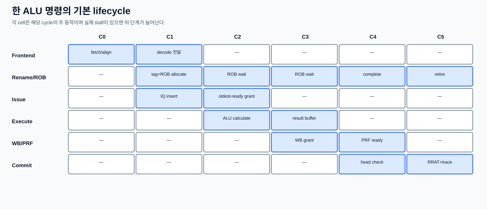

위 그림의 C0~C5는 stall이 없는 교육용 예시다. 실제 Core에서 fetch memory wait,
IQ dependency, WB port conflict 또는 ROB-head wait가 생기면 해당 stage의 valid와
payload가 유지되면서 뒤 cycle로 늘어난다. OoO의 핵심은 Execute/WB 순서는 바뀔
수 있지만 Commit은 ROB head의 program order를 절대 넘지 않는다는 점이다.

#### 15.43.2 반드시 먼저 볼 cycle 예시

##### ROB OoO 완료와 in-order dual commit


younger ADD가 먼저 완료돼도 older DIV가 끝나기 전에는 commit하지 못한다.

##### 동일 bundle RAW/WAW rename


lane1은 lane0이 만든 working RAT을 보므로 같은 cycle dependency도 physical tag로 정확히 연결된다.

##### Branch mispredict selective recovery

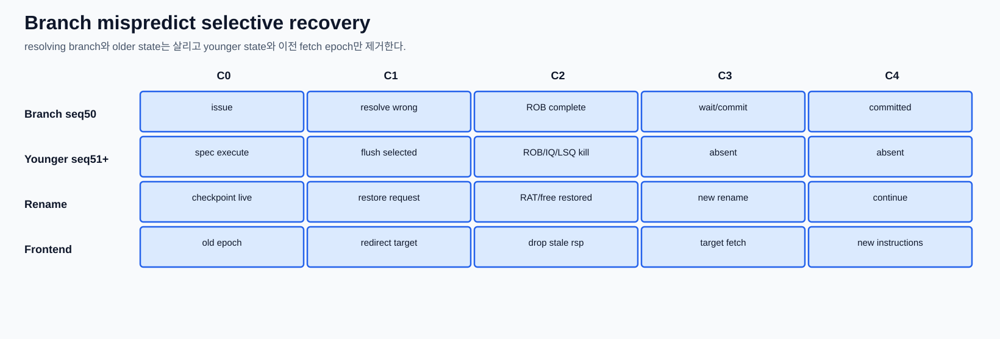

resolving branch와 older state는 살리고 younger state와 이전 fetch epoch만 제거한다.

##### Store-to-load forwarding


load는 모든 older store 주소를 확인하고 youngest full-cover store data만 사용한다.

##### Precise exception과 interrupt 경계


동기 exception은 ROB head에서 우선하고 interrupt는 ROB가 비어 architectural boundary가 된 뒤 수락한다.

##### AXI inbound burst와 오류 선검사


target/window/4-KiB 검사는 첫 local beat 전에 끝나므로 invalid burst는 partial write를 만들지 않는다.

##### Dual LSU와 2-bank 1R1W TIM


서로 다른 bank 요청은 병렬이고 같은 bank 요청은 older one만 grant되어 younger가 payload를 유지한다.

#### 15.43.3 전체 합성 module card

#### A. Top-level integration

먼저 hierarchy를 연결하는 top module을 본다. 이 모듈들은 leaf 연산보다 ownership과 경로 이해가 핵심이다.

##### `rv_soc_top`

[SVG 크게 보기](diagrams/modules/rv_soc_top.svg)

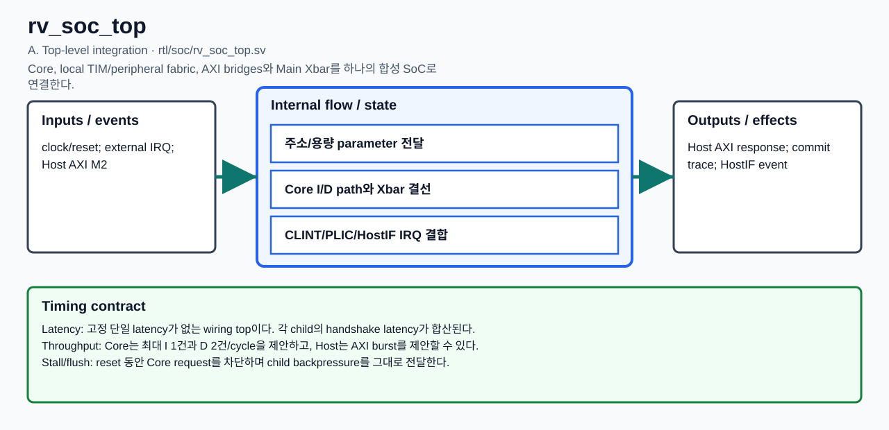

**목적.** Core, local TIM/peripheral fabric, AXI bridges와 Main Xbar를 하나의 합성 SoC로 연결한다.

**Step-by-step.**

1. reset과 address-map parameter를 모든 child에 동일하게 전달한다.
2. Core local hit는 fabric에서 처리하고 miss는 bridge를 거쳐 Main Xbar로 보낸다.
3. target response와 IRQ를 원래 Core/Host port로 되돌린다.

**타이밍.** 고정 단일 latency가 없는 wiring top이다. 각 child의 handshake latency가 합산된다. 처리율은 Core는 최대 I 1건과 D 2건/cycle을 제안하고, Host는 AXI burst를 제안할 수 있다. Backpressure/flush 규칙은 reset 동안 Core request를 차단하며 child backpressure를 그대로 전달한다.

**코너케이스.** 잘못된 map은 elaboration fatal, unmapped access는 DECERR다. Debug halt는 현재 0에 고정된다.

**RTL 위치.** [`rtl/soc/rv_soc_top.sv`](../rtl/soc/rv_soc_top.sv)

##### `rv_ooo_core`

[SVG 크게 보기](diagrams/modules/rv_ooo_core.svg)


**목적.** Frontend와 OoO backend를 묶고 IFU PMP 및 외부 I/D memory 경계를 제공한다.

**Step-by-step.**

1. Frontend가 16-byte block을 받아 최대 두 instruction을 만든다.
2. PMP fault metadata와 instruction을 backend에 prefix handshake로 전달한다.
3. backend redirect/retire 결과를 frontend와 외부 trace에 연결한다.

**타이밍.** 명령 latency는 memory와 execution unit에 따라 가변이며 retire는 최대 2개/cycle이다. 처리율은 fetch/decode/dispatch/issue/commit baseline이 모두 2-wide다. Backpressure/flush 규칙은 redirect는 fetch epoch를 바꾸고, D response는 LSQ identity/tombstone으로 보호한다.

**코너케이스.** stale fetch/load response, exception과 interrupt의 precise boundary가 핵심이다.

**RTL 위치.** [`rtl/rv_ooo_core.sv`](../rtl/rv_ooo_core.sv)

##### `rv_backend`

[SVG 크게 보기](diagrams/modules/rv_backend.svg)

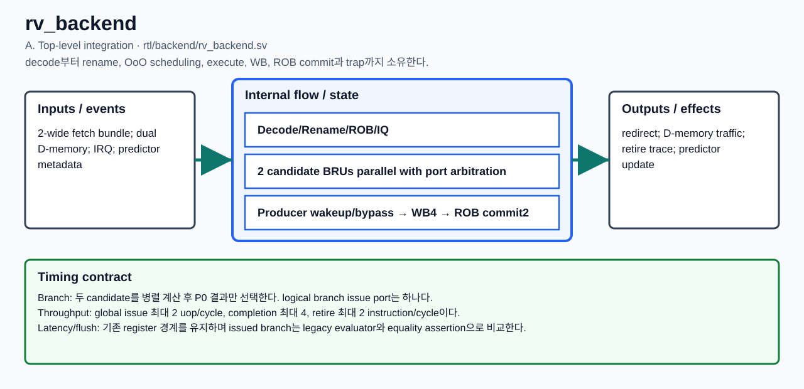

**목적.** decode부터 rename, OoO scheduling, execute, WB, ROB commit과 trap까지 소유한다.

**Step-by-step.**

1. decode 결과를 decode→dispatch register에 받고, 다음 cycle부터 모든 resource ready일 때 원자적으로 rename/allocate한다. flush는 이 register를 비우고, older serializing op가 끝날 때까지 새 bundle을 받지 않는다.
2. IQ가 oldest-ready 두 uop을 실행 port에 보내고 결과를 WB arbitration한다.
3. ROB head만 commit하며 exception/interrupt/branch가 recovery를 요청한다.

**타이밍.** ALU 명령도 여러 pipeline edge를 거쳐 retire하며 DIV/memory/flush에 따라 가변이다. 처리율은 global issue 최대 2 uop/cycle, completion 최대 4, retire 최대 2 instruction/cycle이다. Backpressure/flush 규칙은 어느 resource라도 부족하면 dispatch bundle 전체를 hold한다.

**코너케이스.** same-bundle RAW/WAW, selective flush, serializing CSR/FENCE와 device memory가 교차한다.

**RTL 위치.** [`rtl/backend/rv_backend.sv`](../rtl/backend/rv_backend.sv)

##### `rv_lsu_cluster`

[SVG 크게 보기](diagrams/modules/rv_lsu_cluster.svg)

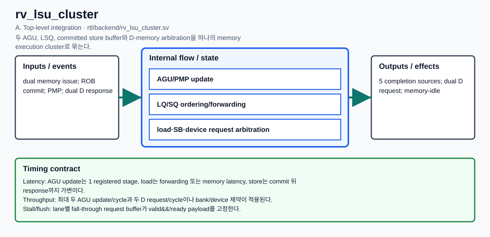

**목적.** 두 AGU, LSQ, committed store buffer와 D-memory arbitration을 하나의 memory execution cluster로 묶는다.

**Step-by-step.**

1. dispatch 때 LQ/SQ entry를 ROB와 동시에 예약한다.
2. AGU가 주소/data를 만들고 LSQ가 older store를 검사한다.
3. load result 또는 committed store response를 해당 ROB sequence로 완료한다.

**타이밍.** AGU update는 1 registered stage, load는 forwarding 또는 memory latency, store는 commit 뒤 response까지 가변이다. 처리율은 최대 두 AGU update/cycle과 두 D request/cycle이나 bank/device 제약이 적용된다. Backpressure/flush 규칙은 lane별 fall-through request buffer가 valid&&!ready payload를 고정한다.

**코너케이스.** unknown older store, same-bank conflict, flushed load tombstone, device-store fault를 다룬다.

**RTL 위치.** [`rtl/backend/rv_lsu_cluster.sv`](../rtl/backend/rv_lsu_cluster.sv)

#### B. Frontend

PC 선택부터 instruction 두 개가 backend에 전달될 때까지 따라간다.

##### `rv_frontend`

[SVG 크게 보기](diagrams/modules/rv_frontend.svg)


**목적.** 예측 PC에서 fetch block을 요청하고 C/32-bit 경계를 정렬해 backend에 공급한다.

**Step-by-step.**

1. 현재 PC로 predictor와 target buffer를 조회한다.
2. 필요한 16-byte block을 요청하거나 target-buffer data를 queue에 넣는다.
3. C 길이를 판정해 taken lane 뒤 younger lane을 막고 backend로 보낸다.

**타이밍.** target-buffer hit는 memory wait 없이 queue fill 가능하고, miss는 I-memory latency에 따른다. 처리율은 backend가 소비하면 최대 두 instruction/cycle을 낸다. memory outstanding은 1 block이다. Backpressure/flush 규칙은 queue full 또는 outstanding request가 있으면 request를 hold하며 redirect가 최우선이다.

**코너케이스.** cross-block 32-bit instruction, stale epoch response, redirect-cycle target fill이 핵심이다.

**RTL 위치.** [`rtl/frontend/rv_frontend.sv`](../rtl/frontend/rv_frontend.sv)

##### `rv_fetch_queue`

[SVG 크게 보기](diagrams/modules/rv_fetch_queue.svg)

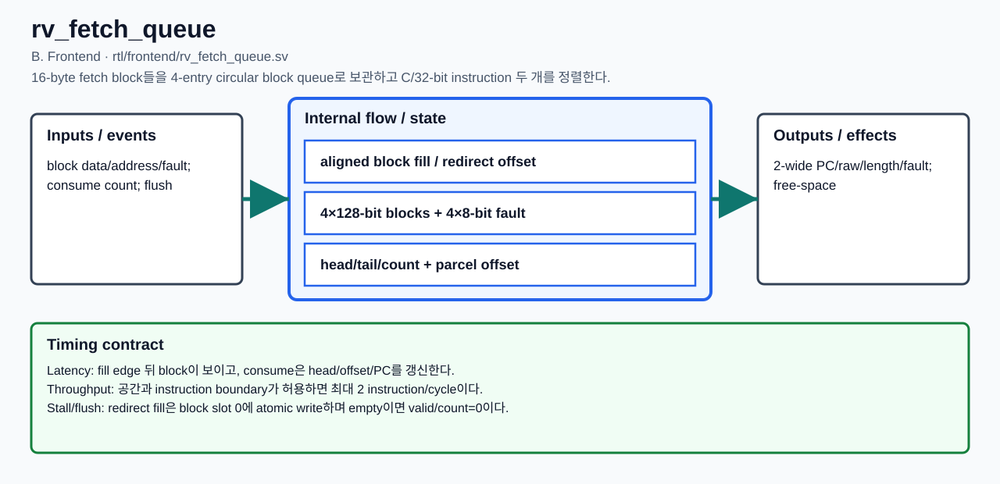

**목적.** 16-byte fetch block들을 16-bit parcel circular queue로 보관하고 C/32-bit instruction 두 개를 정렬한다.

**Step-by-step.**

1. block 주소와 queue tail 사이의 parcel offset을 계산한다.
2. 8개 parcel과 parcel별 fault bit를 `head+count` 위치에 circular write한다.
3. head의 low parcel로 길이를 판정하고 C는 1개, 32-bit는 연속 2개 parcel을 조립한다.
4. 최대 두 instruction이 소비한 1~4 parcel 수만큼 head index/PC/count만 이동하며 저장 배열 전체는 shift하지 않는다.

**타이밍.** fill edge 뒤 저장 parcel이 보이며 consume과 compatible fill은 같은 edge에 처리된다. redirect+FTB hit는 고정 slot 0~7에 쓰고 head index만 target offset으로 선택해 variable tail write cone을 피한다. 처리율은 공간과 instruction boundary가 허용하면 최대 2 instruction/cycle이다. Backpressure/flush 규칙은 공간 부족 시 fill을 거부하고 backend stall 시 head/data를 유지한다.

**코너케이스.** queue wrap, halfword 끝의 32-bit instruction, redirect flush를 검사해야 한다.

**RTL 위치.** [`rtl/frontend/rv_fetch_queue.sv`](../rtl/frontend/rv_fetch_queue.sv)

##### `rv_fetch_target_buffer`

[SVG 크게 보기](diagrams/modules/rv_fetch_target_buffer.svg)

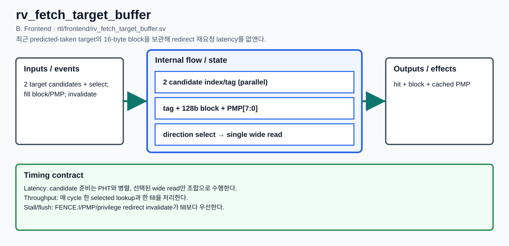

**목적.** 최근 predicted-taken target의 16-byte block을 보관해 redirect 재요청 latency를 없앤다.

**Step-by-step.**

1. target block 주소로 index/tag를 만든다.
2. 두 lane target 후보의 index/tag는 병렬 생성하되 direction으로 선택된 한 entry의 wide data만 읽는다.
3. valid tag가 맞으면 저장 block과 fetch 당시 PMP parcel allow mask를 frontend에 즉시 반환한다.
4. current memory response의 block/data/PMP mask를 해당 entry에 채운다.

**타이밍.** 후보 주소 계산과 tag 준비는 direction PHT와 병렬이고, 선택된 128-bit data read는 하나다. lookup은 조합, fill/invalidate는 clock edge에서 반영된다. FTB hit의 fault metadata는 cached PMP mask를 사용해 predictor→FTB 뒤에 8-port PMP comparator를 직렬 연결하지 않는다. 처리율은 매 cycle 한 선택 lookup, 한 fill을 처리한다. Backpressure/flush 규칙은 FENCE.I/PMP/privilege redirect invalidate가 fill보다 우선한다.

**코너케이스.** alias tag, 같은 cycle invalidate/fill, wrong-path block 재사용을 막아야 한다.

**RTL 위치.** [`rtl/frontend/rv_fetch_target_buffer.sv`](../rtl/frontend/rv_fetch_target_buffer.sv)

##### `rv_branch_predictor`

[SVG 크게 보기](diagrams/modules/rv_branch_predictor.svg)

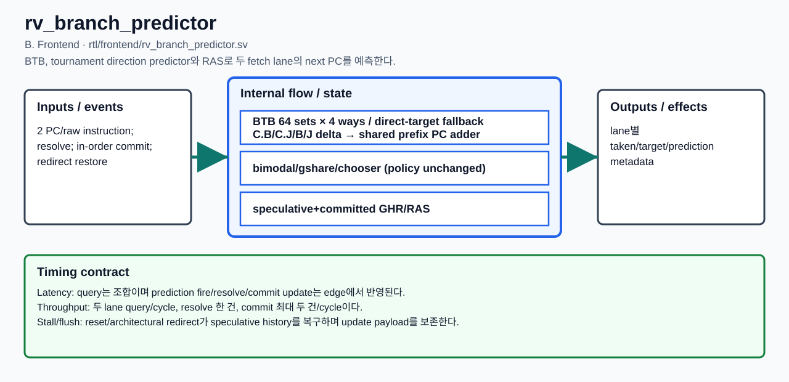

**목적.** BTB, tournament direction predictor와 RAS로 두 fetch lane의 next PC를 예측한다.

**Step-by-step.**

1. PC로 BTB와 세 PHT를 병렬 조회한다.
2. instruction 종류와 RAS를 결합해 taken/target을 결정한다.
3. resolve에서 학습하고 mispredict면 저장 metadata로 speculative history를 복구한다.

**타이밍.** query는 조합이며 prediction fire/resolve/commit update는 edge에서 반영된다. 처리율은 두 lane query/cycle, resolve 한 건, commit 최대 두 건/cycle이다. Backpressure/flush 규칙은 reset/architectural redirect가 speculative history를 복구하며 update payload를 보존한다.

**코너케이스.** compressed raw encoding, 두 lane history 순서, RAS under/overflow가 중요하다.

**RTL 위치.** [`rtl/frontend/rv_branch_predictor.sv`](../rtl/frontend/rv_branch_predictor.sv)

##### `rv_c_expander`

[SVG 크게 보기](diagrams/modules/rv_c_expander.svg)

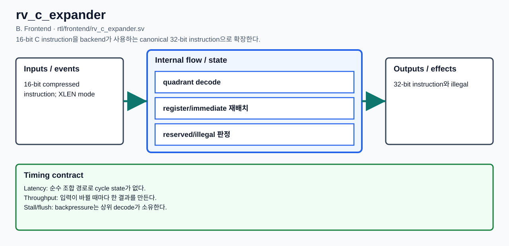

**목적.** 16-bit C instruction을 backend가 사용하는 canonical 32-bit instruction으로 확장한다.

**Step-by-step.**

1. quadrant와 funct field로 instruction class를 찾는다.
2. compressed register와 immediate를 RV I/F encoding으로 재배치한다.
3. reserved encoding이면 illegal을 함께 출력한다.

**타이밍.** 순수 조합 경로로 cycle state가 없다. 처리율은 입력이 바뀔 때마다 한 결과를 만든다. Backpressure/flush 규칙은 backpressure는 상위 decode가 소유한다.

**코너케이스.** RV32/RV64 shared encoding 차이와 zero/reserved immediate를 확인한다.

**RTL 위치.** [`rtl/frontend/rv_c_expander.sv`](../rtl/frontend/rv_c_expander.sv)

#### C. Rename and scheduling

architectural instruction이 physical identity와 ROB sequence를 얻고 실행을 기다리는 과정이다.

##### `rv_decode2`

[SVG 크게 보기](diagrams/modules/rv_decode2.svg)

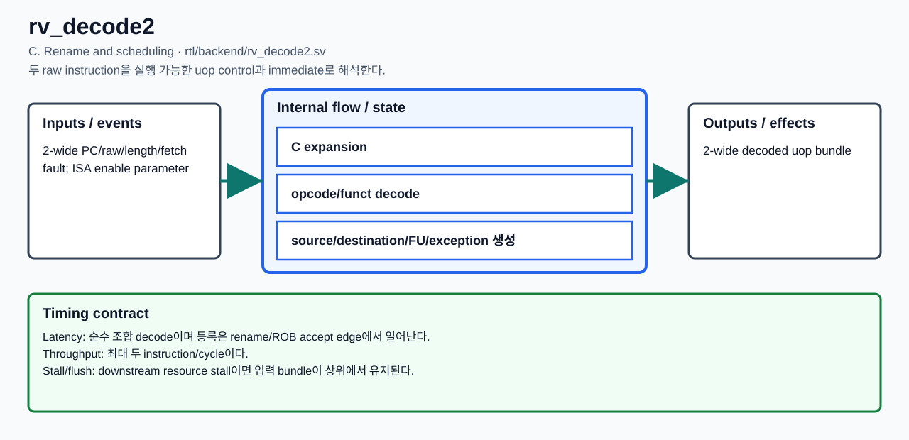

**목적.** 두 raw instruction을 실행 가능한 uop control과 immediate로 해석한다.

**Step-by-step.**

1. 16-bit이면 canonical instruction으로 확장한다.
2. operand class, immediate, FU와 memory/CSR 속성을 만든다.
3. unsupported/reserved encoding을 drop하지 않고 exception uop로 표시한다.

**타이밍.** 순수 조합 decode이며 결과는 `rv_backend`의 decode→dispatch register(`uq_q`)에 등록된다(v1.18.8; 이전에는 rename/ROB accept edge). 처리율은 최대 두 instruction/cycle이다. Backpressure/flush 규칙은 downstream resource stall이면 입력 bundle이 상위에서 유지된다.

**코너케이스.** lane0 illegal이어도 lane1 순서는 유지되고 trap 때 younger가 제거된다.

**RTL 위치.** [`rtl/backend/rv_decode2.sv`](../rtl/backend/rv_decode2.sv)

##### `rv_rename2`

[SVG 크게 보기](diagrams/modules/rv_rename2.svg)


**목적.** architectural INT/FP register를 physical tag로 바꾸고 WAR/WAW false dependency를 제거한다.

**Step-by-step.**

1. 두 lane source의 현재 RAT mapping을 읽는다.
2. lane 순서로 새 destination tag를 예약하고 RAW/WAW bypass를 적용한다.
3. dispatch edge에서 RAT/free-list/checkpoint를 원자적으로 갱신한다.

**타이밍.** rename 결과는 등록된 decode bundle에서 조합으로 계산되고 dispatch fire edge에서 RAT/free-list가 갱신된다. 수락 판정(`rename_can_accept_o`)은 tag 선택 encoder를 기다리지 않고 free bitmap의 `{any, ≥2}` 균형 tree와 class별 필요 tag 수 비교로 구한다(v1.18.8). 처리율은 자원이 충분하면 최대 두 instruction/cycle이다. Backpressure/flush 규칙은 한 lane이라도 필요한 tag/checkpoint가 부족하면 bundle 전체를 수락하지 않는다.

**코너케이스.** lane1 RAW/WAW, x0 no-allocation, commit과 recovery 동시 우선순위가 핵심이다.

**RTL 위치.** [`rtl/backend/rv_rename2.sv`](../rtl/backend/rv_rename2.sv)

##### `rv_phys_regfile`

[SVG 크게 보기](diagrams/modules/rv_phys_regfile.svg)

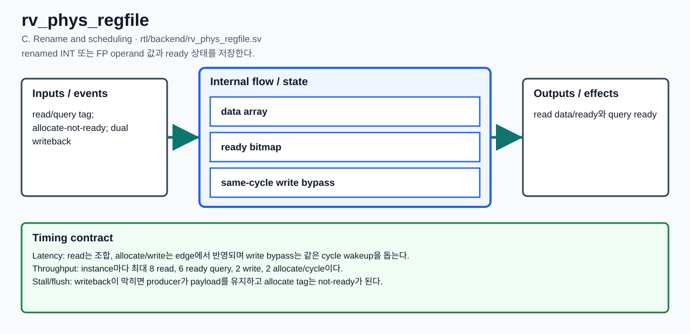

**목적.** renamed INT 또는 FP operand 값과 ready 상태를 저장한다.

**Step-by-step.**

1. rename이 새 tag를 allocate해 ready bit를 내린다.
2. IQ가 tag로 data/ready를 조회한다.
3. WB edge에서 data와 ready를 기록하고 dependent IQ를 깨운다.

**타이밍.** read는 조합, allocate/write는 edge에서 반영되며 write bypass는 같은 cycle wakeup을 돕는다. 처리율은 instance마다 최대 8 read, 6 ready query, 2 write, 2 allocate/cycle이다. Backpressure/flush 규칙은 writeback이 막히면 producer가 payload를 유지하고 allocate tag는 not-ready가 된다.

**코너케이스.** x0 hardwire, 같은 tag allocate/write, dual write collision을 금지한다.

**RTL 위치.** [`rtl/backend/rv_phys_regfile.sv`](../rtl/backend/rv_phys_regfile.sv)

##### `rv_rob`

[SVG 크게 보기](diagrams/modules/rv_rob.svg)


**목적.** OoO 완료 결과를 program order로 정렬해 precise dual commit을 만드는 48-entry circular buffer다.

**Step-by-step.**

1. dispatch가 tail부터 lane0, lane1 entry와 sequence를 예약한다.
2. WB가 sequence로 entry를 찾아 complete/exception/branch metadata를 기록한다.
3. head부터 정상 complete prefix만 commit하고 stale mapping을 반환한다.

**타이밍.** allocate/complete는 edge에서 기록되고 다음 조합 phase에 retire 가능해진다. 처리율은 최대 2 allocate, 4 completion update, 2 in-order retire/cycle이다. Backpressure/flush 규칙은 head incomplete/exception/side-effect not-ready면 younger complete entry도 기다린다.

**코너케이스.** wrap age, completion+flush, lane0 exception+lane1 complete, dual store commit을 다룬다.

**RTL 위치.** [`rtl/backend/rv_rob.sv`](../rtl/backend/rv_rob.sv)

##### `rv_issue_queue`

[SVG 크게 보기](diagrams/modules/rv_issue_queue.svg)

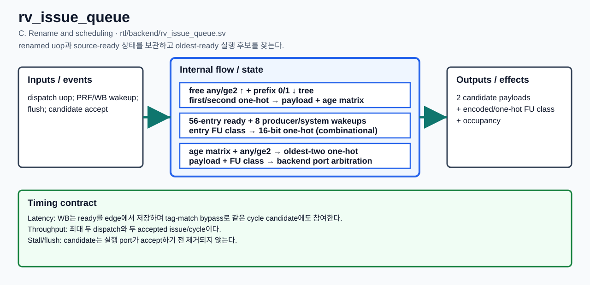

**목적.** renamed uop과 source-ready 상태를 보관하고 oldest-ready 실행 후보를 찾는다.

**Step-by-step.**

1. dispatch uop과 physical source tags를 빈 entry에 쓴다.
2. backend의 live producer/system 8개 wakeup tag가 일치하면 source ready를 저장하고 같은 cycle 선택에도 반영한다.
3. source-ready entry 중 age matrix와 saturating any/ge2 reduction으로 oldest 두 후보를 먼저 고른다. store address-only phase는 base만 준비되어도 후보가 된다.
4. entry별 FU class predecode를 동일한 선택 one-hot으로 payload와 함께 reduce한다. backend가 FU ready와 port mask를 비교해 최대 두 후보를 accept한다. 기본 정책은 FU-busy 후보 대신 제3 후보를 다시 검색하지 않는다.
5. accept된 일반 uop/최종 store phase만 제거하며 address-only store는 data wakeup까지 같은 sequence/SQ index로 남는다.

**타이밍.** WB는 ready를 edge에서 저장하며 tag-match bypass로 같은 cycle candidate에도 참여한다. 처리율은 최대 두 dispatch와 두 accepted issue/cycle이다. Backpressure/flush 규칙은 candidate는 실행 port가 accept하기 전 제거되지 않는다.

**코너케이스.** store address/data split phase, same-cycle wakeup/select, selective flush를 처리한다.

**RTL 위치.** [`rtl/backend/rv_issue_queue.sv`](../rtl/backend/rv_issue_queue.sv)

##### `rv_issue_arbiter`

[SVG 크게 보기](diagrams/modules/rv_issue_arbiter.svg)

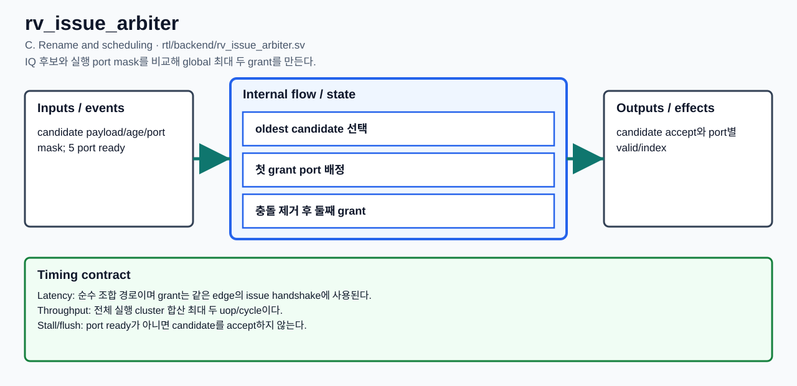

**목적.** IQ 후보와 실행 port mask를 비교해 global 최대 두 grant를 만든다.

**Step-by-step.**

1. 각 candidate가 사용할 수 있는 ready port mask를 만든다.
2. oldest 요청에 첫 port를 주고 해당 entry/port를 제외한다.
3. 남은 후보 중 oldest compatible 요청에 두 번째 port를 준다.

**타이밍.** 순수 조합 경로이며 grant는 같은 edge의 issue handshake에 사용된다. 처리율은 전체 실행 cluster 합산 최대 두 uop/cycle이다. Backpressure/flush 규칙은 port ready가 아니면 candidate를 accept하지 않는다.

**코너케이스.** 같은 entry/port 이중 grant와 younger가 older를 부당하게 추월하는 경우를 금지한다.

`AGE_ORDERED`(기본 0): candidate 0이 항상 older라는 호출 측 보장 아래 sequence 비교 없이 5-bit 병렬 port 선택을 쓴다. backend는 IQ oldest/second-oldest 출력이라 1로 둔다. 일반 탐색과의 일치는 simulation에서 매 cycle 확인한다(v1.18.9).

**RTL 위치.** [`rtl/backend/rv_issue_arbiter.sv`](../rtl/backend/rv_issue_arbiter.sv)

#### D. Execute and writeback

issue된 uop이 계산되고 결과가 PRF/ROB에 돌아오는 경로다.

##### `rv_int_alu`

[SVG 크게 보기](diagrams/modules/rv_int_alu.svg)

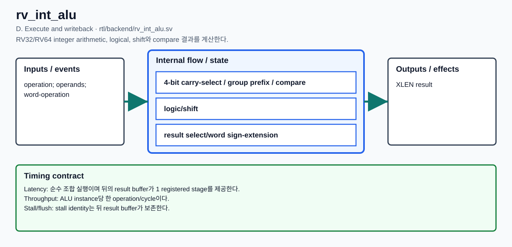

**목적.** RV32/RV64 integer arithmetic, logical, shift와 compare 결과를 계산한다.

**Step-by-step.**

1. operation으로 필요한 arithmetic/logic 결과를 병렬 계산한다.
2. shift amount와 signed/unsigned compare를 XLEN 규칙으로 선택한다.
3. RV64 W-op이면 32-bit 결과를 sign-extend한다.

**타이밍.** 순수 조합 실행이며 뒤의 result buffer가 1 registered stage를 제공한다. 처리율은 ALU instance당 한 operation/cycle이다. Backpressure/flush 규칙은 stall identity는 뒤 result buffer가 보존한다.

**코너케이스.** shift width, signed compare, overflow를 trap으로 오해하지 않는 것이 중요하다.

**RTL 위치.** [`rtl/backend/rv_int_alu.sv`](../rtl/backend/rv_int_alu.sv)

##### `rv_branch_unit`

[SVG 크게 보기](diagrams/modules/rv_branch_unit.svg)

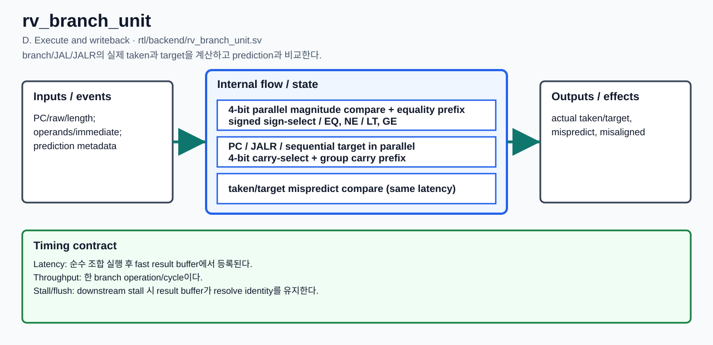

**목적.** branch/JAL/JALR의 실제 taken과 target을 계산하고 prediction과 비교한다.

**Step-by-step.**

1. branch 종류에 맞게 operands를 비교한다.
2. PC-relative 또는 JALR target을 계산하고 IALIGN을 확인한다.
3. 예측 taken/target과 달라지면 recovery request를 만든다.

**타이밍.** 순수 조합 실행 후 fast result buffer에서 등록된다. 처리율은 한 branch operation/cycle이다. Backpressure/flush 규칙은 downstream stall 시 result buffer가 resolve identity를 유지한다.

**코너케이스.** C raw encoding, JALR bit0 clear, target misalignment와 wrong-path training을 확인한다.

**RTL 위치.** [`rtl/backend/rv_branch_unit.sv`](../rtl/backend/rv_branch_unit.sv)

##### `rv_multiplier`

[SVG 크게 보기](diagrams/modules/rv_multiplier.svg)

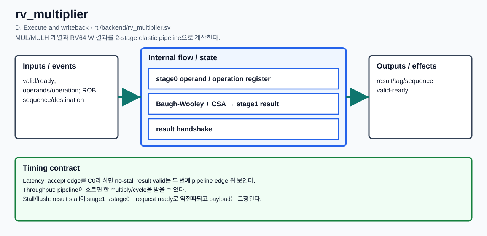

**목적.** MUL/MULH 계열과 RV64 W 결과를 2-stage elastic pipeline으로 계산한다.

**Step-by-step.**

1. signedness 조합에 맞게 full product를 계산해 stage0에 넣는다.
2. 다음 edge에 low/high 또는 W 결과를 stage1로 이동한다.
3. WB가 accept할 때 결과 entry를 비우며 killed sequence는 flush한다.

**타이밍.** accept edge를 C0라 하면 no-stall result valid는 두 번째 pipeline edge 뒤 보인다. 처리율은 pipeline이 흐르면 한 multiply/cycle을 받을 수 있다. Backpressure/flush 규칙은 result stall이 stage1→stage0→request ready로 역전파되고 payload는 고정된다.

**코너케이스.** MULH signedness, back-to-back full pipe, selective flush와 wrap sequence를 검사한다.

**RTL 위치.** [`rtl/backend/rv_multiplier.sv`](../rtl/backend/rv_multiplier.sv)

##### `rv_divider`

[SVG 크게 보기](diagrams/modules/rv_divider.svg)

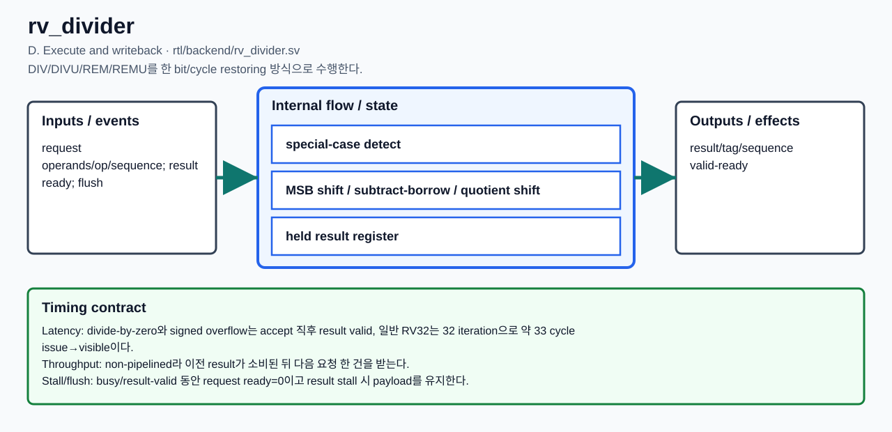

**목적.** DIV/DIVU/REM/REMU를 한 bit/cycle restoring 방식으로 수행한다.

**Step-by-step.**

1. accept 때 부호와 절댓값, iteration 수를 저장한다.
2. 매 cycle dividend bit 하나를 내려 quotient/remainder를 갱신한다.
3. 마지막 iteration에서 부호/W-op를 적용해 result register를 valid로 만든다.

**타이밍.** divide-by-zero와 signed overflow는 accept 직후 result valid, 일반 RV32는 32 iteration으로 약 33 cycle issue→visible이다. 처리율은 non-pipelined라 이전 result가 소비된 뒤 다음 요청 한 건을 받는다. Backpressure/flush 규칙은 busy/result-valid 동안 request ready=0이고 result stall 시 payload를 유지한다.

**코너케이스.** 0 divisor, INT_MIN/-1, flush 중 busy/result, RV64 W 32-iteration을 처리한다.

**RTL 위치.** [`rtl/backend/rv_divider.sv`](../rtl/backend/rv_divider.sv)

##### `rv_fpu`

[SVG 크게 보기](diagrams/modules/rv_fpu.svg)

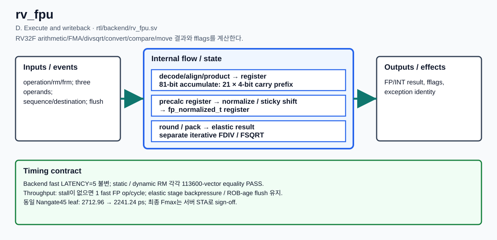

**목적.** RV32F arithmetic/FMA/divsqrt/convert/compare/move 결과와 fflags를 계산한다.

**Step-by-step.**

1. request accept 시 rm/frm, special case, operand sign/exponent/mantissa를 해석한다. 일반 add/FMA는 align·signed accumulate, multiply는 24×24 product를 만들고 direct result 또는 미완성 pack 정보와 ROB/destination identity를 `fp_precalc_t` register에 저장한다.
2. 다음 stage가 leading-bit 탐색, normalize와 sticky shift를 수행해 `fp_normalized_t`에 저장한다. 별도 round/pack stage가 overflow/underflow/subnormal 처리와 fflags를 만들고 결과는 elastic stage에서 stall 중에도 payload와 identity를 안정적으로 유지한다.
3. WB가 결과를 ROB/PRF에 보내고 fflags는 retire 때만 FCSR에 누적한다. branch/exception flush는 pre register와 각 elastic stage의 younger sequence를 모두 제거한다.

**타이밍.** standalone fast path 기본은 `LATENCY=4`, 현재 backend 연결은 `LATENCY=5`다. finite FDIV/FSQRT는 별도 iterative 경로이며 현재 `DIV_NUMW=25+DIV_FRAC=53` 및 `SQRT_ITERS=29`에 따른53/29회 loop를 수행한다. 전후 normalize/pack/result transport와 backpressure 때문에 이를 instruction retire까지의 고정 cycle 수로 사용하면 안 된다. fast 처리율은 stall이 없으면 한 FP operation/cycle이다. 마지막 stage stall은 result, round/pack, normalized, precalc, request-ready 순으로 역전파된다. 과거4-stage 분리 checkpoint의1ns ABC target 공개 preflight는5.079→4.829ns/34,531.1→33,600.9µm²였다. 이 과거 수치를 현재5-stage/서버 STA sign-off로 혼동하지 않는다.

**코너케이스.** NaN/sNaN, signed zero, subnormal, rounding, flush된 fflags를 다룬다.

**RTL 위치.** [`rtl/backend/rv_fpu.sv`](../rtl/backend/rv_fpu.sv)

##### `rv_exec_result_buffer`

[SVG 크게 보기](diagrams/modules/rv_exec_result_buffer.svg)

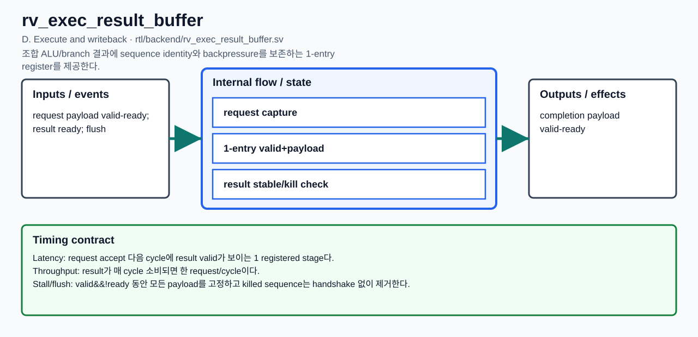

**목적.** 조합 ALU/branch 결과에 sequence identity와 backpressure를 보존하는 1-entry register를 제공한다.

**Step-by-step.**

1. 실행 결과와 ROB/destination/exception metadata를 한 payload로 묶는다.
2. 빈 entry 또는 동시 consume이면 새 payload를 capture한다.
3. WB accept 시 비우고 flush boundary보다 younger면 즉시 invalidate한다.

**타이밍.** request accept 다음 cycle에 result valid가 보이는 1 registered stage다. 처리율은 result가 매 cycle 소비되면 한 request/cycle이다. Backpressure/flush 규칙은 valid&&!ready 동안 모든 payload를 고정하고 killed sequence는 handshake 없이 제거한다.

**코너케이스.** consume+refill, result stall, selective/full flush 동시 조건이 핵심이다.

**RTL 위치.** [`rtl/backend/rv_exec_result_buffer.sv`](../rtl/backend/rv_exec_result_buffer.sv)

##### `rv_writeback_arbiter`

[SVG 크게 보기](diagrams/modules/rv_writeback_arbiter.svg)

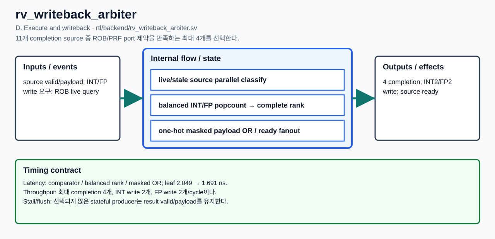

**목적.** 11개 completion source 중 ROB/PRF port 제약을 만족하는 최대 4개를 선택한다.

**Step-by-step.**

1. ROB live와 sequence를 확인해 stale completion을 걸러낸다.
2. source별 INT/FP age rank를 병렬 계산해 각 2개 write port 안에 드는 source만 남긴다.
3. 남은 source의 completion age rank 0~3을 payload mux에 배치하고, 동일 grant를 PRF write, IQ wakeup과 ROB complete에 fanout한다.

**타이밍.** 조합 grant지만 네 번 이어지는 oldest scan 대신 병렬 comparator/rank와 한 payload mux layer를 사용한다. LSQ candidate와 execution-port register가 전후 장거리 경로를 분할한다. 처리율은 최대 completion 4개, INT write 2개, FP write 2개/cycle이다. Backpressure/flush 규칙은 선택되지 않은 stateful producer는 result valid/payload를 유지한다.

**코너케이스.** 동일 destination collision, killed result, write-port 포화와 exception completion을 확인한다.

**RTL 위치.** [`rtl/backend/rv_writeback_arbiter.sv`](../rtl/backend/rv_writeback_arbiter.sv)

##### `rv_branch_recovery`

[SVG 크게 보기](diagrams/modules/rv_branch_recovery.svg)

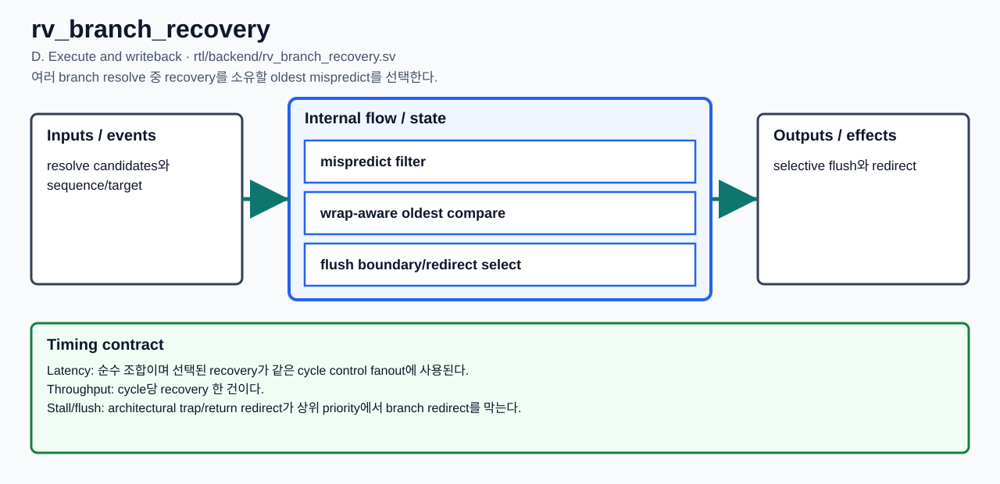

**목적.** 여러 branch resolve 중 recovery를 소유할 oldest mispredict를 선택한다.

**Step-by-step.**

1. valid mispredict 후보만 남긴다.
2. ROB sequence age로 가장 오래된 후보를 선택한다.
3. 그 branch sequence를 flush boundary, actual target을 redirect PC로 낸다.

**타이밍.** 순수 조합이며 선택된 recovery가 같은 cycle control fanout에 사용된다. 처리율은 cycle당 recovery 한 건이다. Backpressure/flush 규칙은 architectural trap/return redirect가 상위 priority에서 branch redirect를 막는다.

**코너케이스.** 두 동시 mispredict, sequence wrap, trap과 branch 동시 발생을 다룬다.

**RTL 위치.** [`rtl/backend/rv_branch_recovery.sv`](../rtl/backend/rv_branch_recovery.sv)

#### E. Load/store subsystem

두 LSU의 out-of-order memory 동작을 program order와 precise visibility로 바꾼다.

##### `rv_lsu_pipe`

[SVG 크게 보기](diagrams/modules/rv_lsu_pipe.svg)

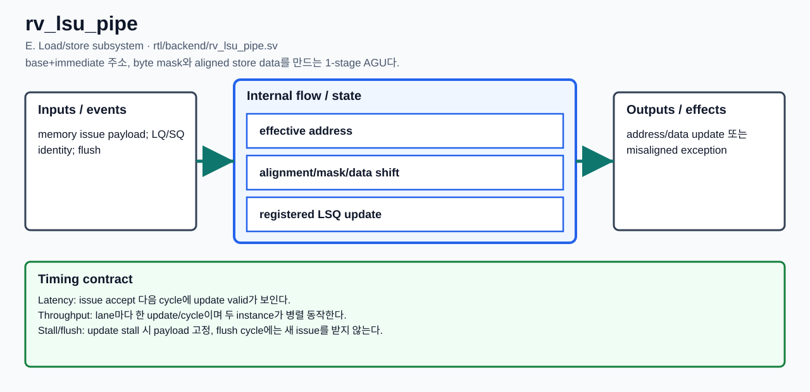

**목적.** base+immediate 주소, byte mask와 aligned store data를 만드는 1-stage AGU다.

**Step-by-step.**

1. base와 immediate로 effective/physical address를 만든다.
2. size/alignment를 검사하고 beat mask와 shifted data를 만든다.
3. LQ/SQ index와 함께 registered update로 전달한다.

**타이밍.** issue accept 다음 cycle에 update valid가 보인다. 처리율은 lane마다 한 update/cycle이며 두 instance가 병렬 동작한다. Backpressure/flush 규칙은 update stall 시 payload 고정, flush cycle에는 새 issue를 받지 않는다. `DEPTH=2`(backend 사용값)는 head가 막혀도 한 개를 더 받고, issue ready가 downstream PMP/completion 판정과 무관한 등록 신호가 된다.

**코너케이스.** unsupported size, beat boundary, store address-only/data-only phase와 flush를 다룬다.

**RTL 위치.** [`rtl/backend/rv_lsu_pipe.sv`](../rtl/backend/rv_lsu_pipe.sv)

##### `rv_lsq_order_check`

[SVG 크게 보기](diagrams/modules/rv_lsq_order_check.svg)

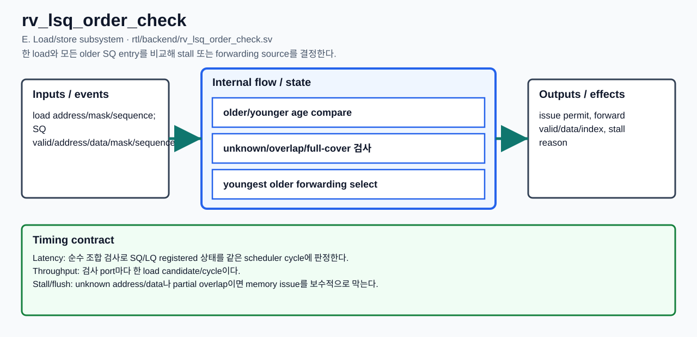

**목적.** 한 load와 모든 older SQ entry를 비교해 stall 또는 forwarding source를 결정한다.

**Step-by-step.**

1. load보다 older인 valid store만 후보로 남긴다.
2. 미확정 주소 또는 부분 overlap이 있으면 stall reason을 만든다.
3. full-cover 후보 중 load에 가장 가까운 youngest older store를 선택한다.

**타이밍.** 순수 조합 검사로 SQ/LQ registered 상태를 같은 scheduler cycle에 판정한다. 처리율은 검사 port마다 한 load candidate/cycle이다. Backpressure/flush 규칙은 unknown address/data나 partial overlap이면 memory issue를 보수적으로 막는다.

**코너케이스.** sequence wrap, 여러 same-address store, byte mask partial overlap을 확인한다.

**RTL 위치.** [`rtl/backend/rv_lsq_order_check.sv`](../rtl/backend/rv_lsq_order_check.sv)

##### `rv_lsq`

[SVG 크게 보기](diagrams/modules/rv_lsq.svg)


**목적.** speculative load와 store의 주소/data/완료 상태를 ROB sequence와 함께 추적한다.

**Step-by-step.**

1. ROB dispatch와 같은 edge에 LQ/SQ entry와 sequence를 예약한다.
2. AGU update 뒤 모든 older store를 검사해 memory/forward/stall을 결정한다.
3. load response 또는 store commit에서 entry를 완료/해제하고 flush younger를 제거한다.

**타이밍.** dispatch/AGU update는 edge에서 반영되고 다음 scheduler cycle에 issue/forward 후보가 된다. 처리율은 최대 LQ/SQ allocate2, update2, commit2 및 load candidate2/cycle이다. Backpressure/flush 규칙은 unknown older store와 partial overlap에서 load를 hold하며 outstanding killed LQ는 tombstone 유지다.

**코너케이스.** same-cycle store→load, flushed outstanding response, device serialization과 dual commit을 처리한다.

**RTL 위치.** [`rtl/backend/rv_lsq.sv`](../rtl/backend/rv_lsq.sv)

##### `rv_store_buffer`

[SVG 크게 보기](diagrams/modules/rv_store_buffer.svg)

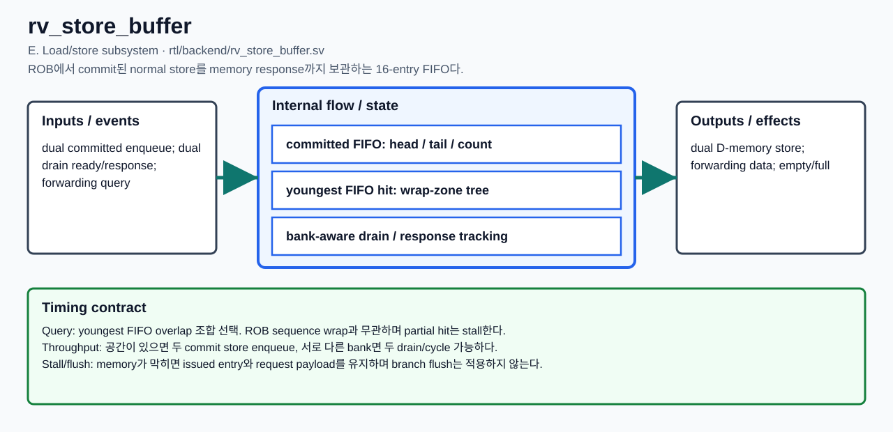

**목적.** ROB에서 commit된 normal store를 memory response까지 보관하는 16-entry FIFO다.

**Step-by-step.**

1. ROB commit lane 순서로 store를 FIFO에 넣는다.
2. oldest eligible entry를 bank별 D request로 보낸다.
3. response ID로 entry를 제거하고 error면 sticky machine-check를 기록한다.

**타이밍.** enqueue 후 drain은 fabric ready와 response latency에 따라 가변이다. 처리율은 공간이 있으면 두 commit store enqueue, 서로 다른 bank면 두 drain/cycle 가능하다. Backpressure/flush 규칙은 memory가 막히면 issued entry와 request payload를 유지하며 branch flush는 적용하지 않는다.

**코너케이스.** dual enqueue 공간, same-bank drain, younger load forwarding, response error를 다룬다.

**RTL 위치.** [`rtl/backend/rv_store_buffer.sv`](../rtl/backend/rv_store_buffer.sv)

#### F. Privilege, trap and protection

CSR, PMP, exception, interrupt와 fence가 architectural boundary를 소유한다.

##### `rv_csr_file`

[SVG 크게 보기](diagrams/modules/rv_csr_file.svg)

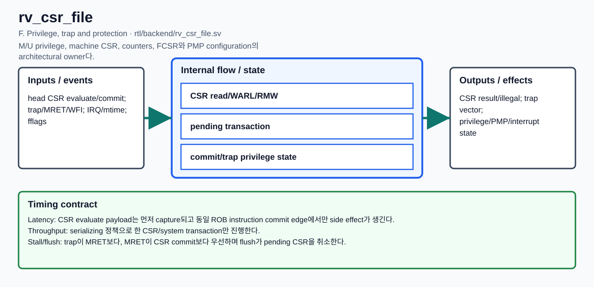

**목적.** M/U privilege, machine CSR, counters, FCSR와 PMP configuration의 architectural owner다.

**Step-by-step.**

1. ROB head CSR의 old value와 write intent/value를 평가한다.
2. pending register에 주소/data를 고정하고 결과를 ROB에 완료한다.
3. 정상 retire edge에서만 CSR/PMP/FCSR를 변경한다.

**타이밍.** CSR evaluate payload는 먼저 capture되고 동일 ROB instruction commit edge에서만 side effect가 생긴다. 처리율은 serializing 정책으로 한 CSR/system transaction만 진행한다. Backpressure/flush 규칙은 trap이 MRET보다, MRET이 CSR commit보다 우선하며 flush가 pending CSR을 취소한다.

**코너케이스.** CSRRS/RC x0 suppression, WARL, nested trap overwrite, counter/fflags order를 다룬다.

**RTL 위치.** [`rtl/backend/rv_csr_file.sv`](../rtl/backend/rv_csr_file.sv)

##### `rv_pmp`

[SVG 크게 보기](diagrams/modules/rv_pmp.svg)

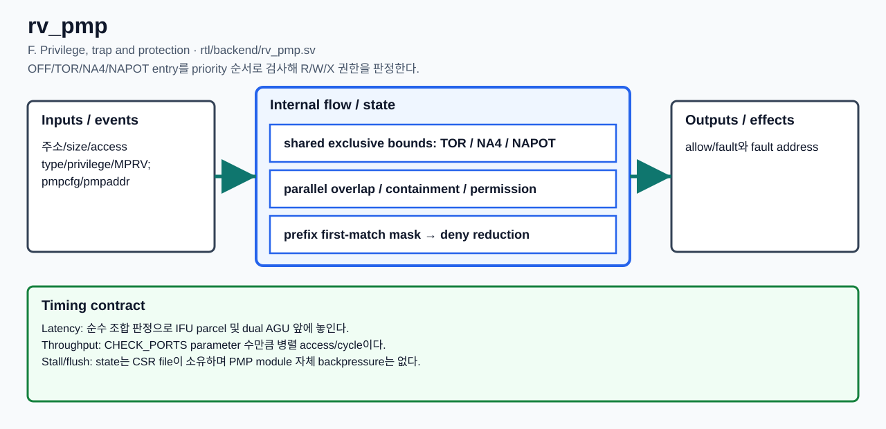

**목적.** OFF/TOR/NA4/NAPOT entry를 priority 순서로 검사해 R/W/X 권한을 판정한다.

**Step-by-step.**

1. 각 entry의 address mode로 lower/upper range를 계산한다.
2. 접근 일부라도 처음 matching entry와 겹치면 그 entry를 선택한다.
3. 전체 접근 포함 여부와 R/W/X, privilege/lock 규칙으로 allow를 결정한다.

**타이밍.** 순수 조합 판정으로 IFU parcel 및 dual AGU 앞에 놓인다. 처리율은 CHECK_PORTS parameter 수만큼 병렬 access/cycle이다. Backpressure/flush 규칙은 state는 CSR file이 소유하며 PMP module 자체 backpressure는 없다.

**코너케이스.** partial first-match, M unlocked bypass, locked entry와 2-byte IFU parcel 경계를 확인한다.

**RTL 위치.** [`rtl/backend/rv_pmp.sv`](../rtl/backend/rv_pmp.sv)

##### `rv_trap_controller`

[SVG 크게 보기](diagrams/modules/rv_trap_controller.svg)

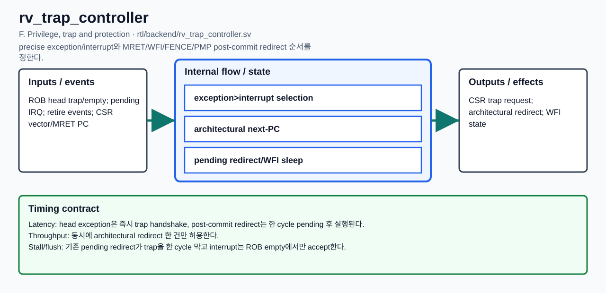

**목적.** precise exception/interrupt와 MRET/WFI/FENCE/PMP post-commit redirect 순서를 정한다.

**Step-by-step.**

1. 동기 exception이 있으면 pending interrupt보다 먼저 선택한다.
2. CSR에 precise PC/cause/tval을 전달하고 mtvec으로 redirect한다.
3. MRET/FENCE.I/PMP write/WFI retire 뒤 next PC redirect 또는 sleep을 관리한다.

**타이밍.** head exception은 즉시 trap handshake, post-commit redirect는 한 cycle pending 후 실행된다. 처리율은 동시에 architectural redirect 한 건만 허용한다. Backpressure/flush 규칙은 기존 pending redirect가 trap을 한 cycle 막고 interrupt는 ROB empty에서만 accept한다.

**코너케이스.** exception+interrupt, trap-in-trap, WFI wake, dual-retire next-PC를 다룬다.

**RTL 위치.** [`rtl/backend/rv_trap_controller.sv`](../rtl/backend/rv_trap_controller.sv)

##### `rv_fence_controller`

[SVG 크게 보기](diagrams/modules/rv_fence_controller.svg)

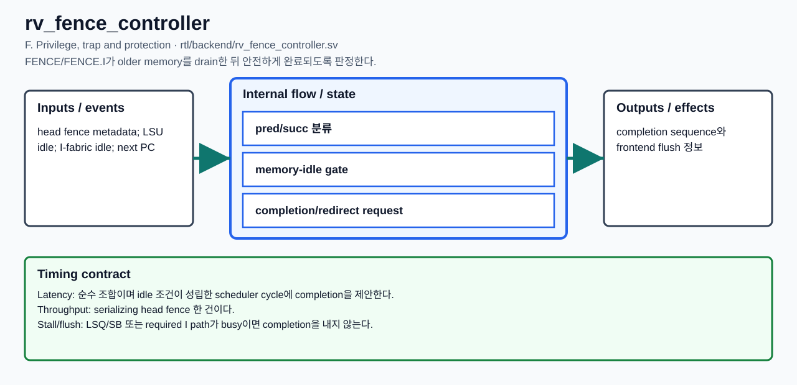

**목적.** FENCE/FENCE.I가 older memory를 drain한 뒤 안전하게 완료되도록 판정한다.

**Step-by-step.**

1. head instruction에서 FENCE/FENCE.I와 mask를 읽는다.
2. 요구된 predecessor operation이 모두 끝났는지 확인한다.
3. 완료 sequence와 FENCE.I next-PC refetch 정보를 반환한다.

**타이밍.** 순수 조합이며 idle 조건이 성립한 scheduler cycle에 completion을 제안한다. 처리율은 serializing head fence 한 건이다. Backpressure/flush 규칙은 LSQ/SB 또는 required I path가 busy이면 completion을 내지 않는다.

**코너케이스.** committed store drain, outstanding load, FENCE.I target-buffer/epoch invalidate를 확인한다.

**RTL 위치.** [`rtl/backend/rv_fence_controller.sv`](../rtl/backend/rv_fence_controller.sv)

#### G. SoC fabric and memory

Core/Host 요청이 TIM, peripheral 또는 error target까지 이동하고 반드시 response로 끝나는 경로다.

##### `rv_local_to_axi_bridge`

[SVG 크게 보기](diagrams/modules/rv_local_to_axi_bridge.svg)

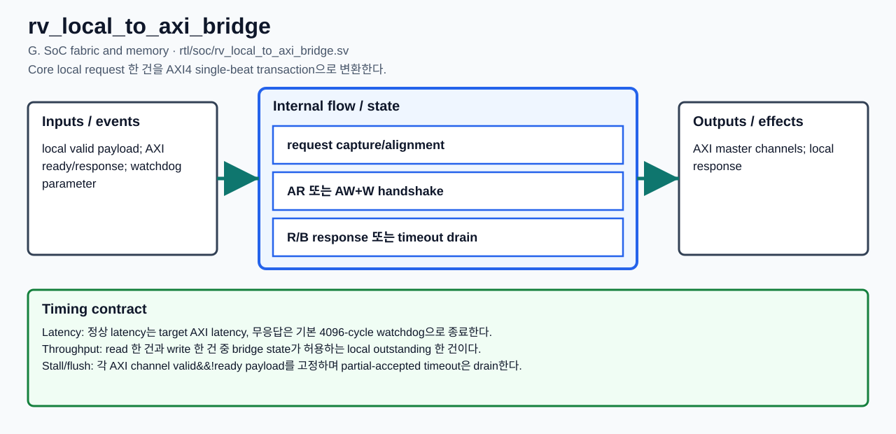

**목적.** Core local request 한 건을 AXI4 single-beat transaction으로 변환한다.

**Step-by-step.**

1. local request와 ID/committed/device를 capture한다.
2. read는 AR, write는 독립 AW/W handshake를 완료한다.
3. R/B를 local response로 바꾸거나 timeout SLVERR 뒤 late response를 폐기한다.

**타이밍.** 정상 latency는 target AXI latency, 무응답은 기본 4096-cycle watchdog으로 종료한다. 처리율은 read 한 건과 write 한 건 중 bridge state가 허용하는 local outstanding 한 건이다. Backpressure/flush 규칙은 각 AXI channel valid&&!ready payload를 고정하며 partial-accepted timeout은 drain한다.

**코너케이스.** AW/W 다른 cycle accept, bad ID/RLAST, timeout 전후 side-effect ambiguity를 다룬다.

**RTL 위치.** [`rtl/soc/rv_local_to_axi_bridge.sv`](../rtl/soc/rv_local_to_axi_bridge.sv)

##### `rv_axi_to_local_bridge`

[SVG 크게 보기](diagrams/modules/rv_axi_to_local_bridge.svg)

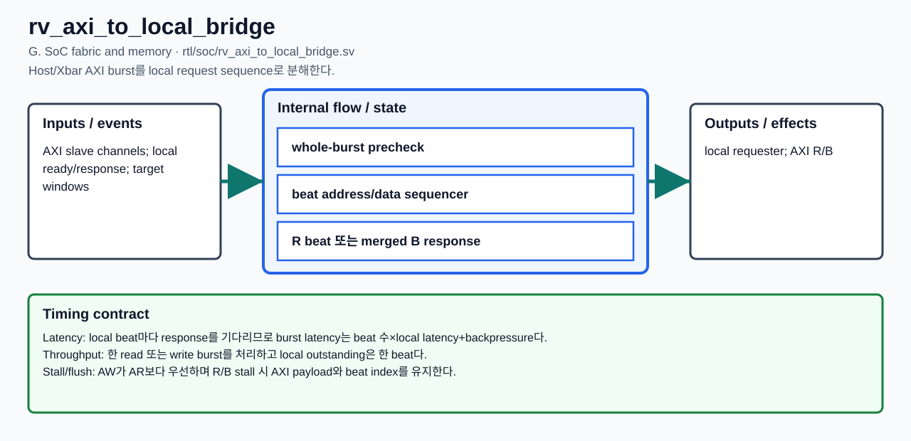

**목적.** Host/Xbar AXI burst를 local request sequence로 분해한다.

**Step-by-step.**

1. INCR/size/alignment/window/4-KiB 경계를 transaction 전에 검사한다.
2. 유효하면 beat 하나씩 local request를 보내고 response를 모은다.
3. read는 각 R beat, write는 최종 merged B response를 반환한다.

**타이밍.** local beat마다 response를 기다리므로 burst latency는 beat 수×local latency+backpressure다. 처리율은 한 read 또는 write burst를 처리하고 local outstanding은 한 beat다. Backpressure/flush 규칙은 AW가 AR보다 우선하며 R/B stall 시 AXI payload와 beat index를 유지한다.

**코너케이스.** window/4-KiB crossing은 local side effect 0, WLAST 오류와 narrow strobe를 처리한다.

**RTL 위치.** [`rtl/soc/rv_axi_to_local_bridge.sv`](../rtl/soc/rv_axi_to_local_bridge.sv)

##### `rv_axi_xbar`

[SVG 크게 보기](diagrams/modules/rv_axi_xbar.svg)


**목적.** 세 AXI initiator를 여섯 target으로 decode/arbitrate하고 ID prefix로 response를 복귀시킨다.

**Step-by-step.**

1. 첫/마지막 byte를 decode해 한 target과 4-KiB 안에 드는지 검사한다.
2. 각 target에서 round-robin으로 한 AR/AW owner를 선택한다.
3. downstream ID 상위 prefix로 B/R을 원 master에 반환한다.

**타이밍.** address route는 handshake cycle에 결정되고 전체 latency는 arbitration+target response다. 처리율은 master별 read 1/write 1 outstanding, target별 AR/AW arbitration이다. Backpressure/flush 규칙은 AW accept부터 WLAST까지 target W owner를 고정하고 stalled channel payload를 보존한다.

**코너케이스.** 동시 AR/AW, bad response prefix, unmapped/unsupported burst와 fairness를 다룬다.

**RTL 위치.** [`rtl/soc/rv_axi_xbar.sv`](../rtl/soc/rv_axi_xbar.sv)

##### `rv_axi_error_slave`

[SVG 크게 보기](diagrams/modules/rv_axi_error_slave.svg)

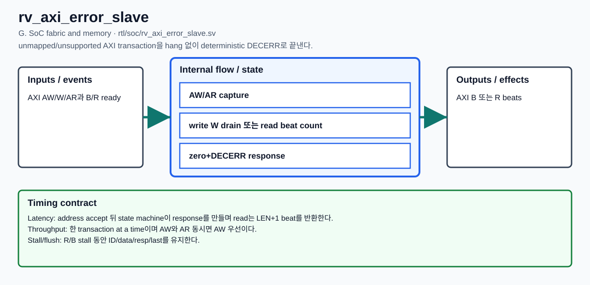

**목적.** unmapped/unsupported AXI transaction을 hang 없이 deterministic DECERR로 끝낸다.

**Step-by-step.**

1. AW 또는 AR metadata를 capture한다.
2. write는 WLAST까지 data를 버리고 read는 beat count를 증가시킨다.
3. B 또는 zero-data R에 DECERR를 실어 종료한다.

**타이밍.** address accept 뒤 state machine이 response를 만들며 read는 LEN+1 beat를 반환한다. 처리율은 한 transaction at a time이며 AW와 AR 동시면 AW 우선이다. Backpressure/flush 규칙은 R/B stall 동안 ID/data/resp/last를 유지한다.

**코너케이스.** malformed WLAST에서도 protocol state가 영구 대기하지 않도록 검증해야 한다.

**RTL 위치.** [`rtl/soc/rv_axi_error_slave.sv`](../rtl/soc/rv_axi_error_slave.sv)

##### `rv_i_fabric`

[SVG 크게 보기](diagrams/modules/rv_i_fabric.svg)

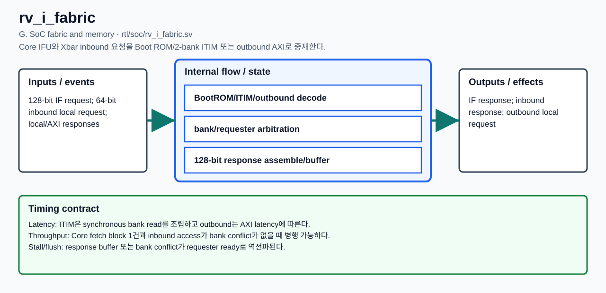

**목적.** Core IFU와 Xbar inbound 요청을 Boot ROM/2-bank ITIM 또는 outbound AXI로 중재한다.

**Step-by-step.**

1. 주소가 Boot ROM/ITIM/local 밖인지 decode한다.
2. 필요한 bank read와 inbound 요청을 공정하게 grant한다.
3. bank data를 fetch block으로 조립하거나 outbound response를 원 requester에 반환한다.

**타이밍.** ITIM은 synchronous bank read를 조립하고 outbound는 AXI latency에 따른다. 처리율은 Core fetch block 1건과 inbound access가 bank conflict가 없을 때 병행 가능하다. Backpressure/flush 규칙은 response buffer 또는 bank conflict가 requester ready로 역전파된다.

**코너케이스.** Core fetch와 Host ITIM write 경쟁, BootROM inbound read, response handoff를 다룬다.

**RTL 위치.** [`rtl/soc/rv_i_fabric.sv`](../rtl/soc/rv_i_fabric.sv)

##### `rv_d_fabric`

[SVG 크게 보기](diagrams/modules/rv_d_fabric.svg)

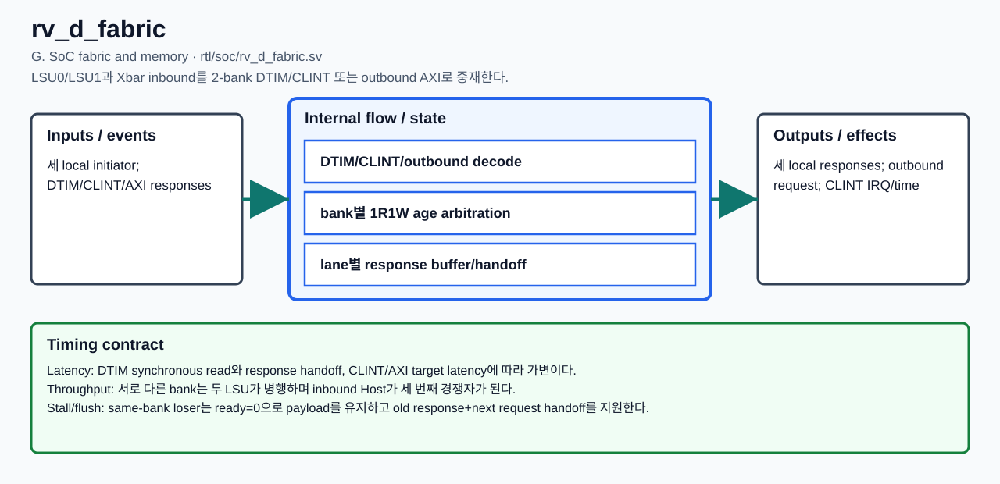

**목적.** LSU0/LSU1과 Xbar inbound를 2-bank DTIM/CLINT 또는 outbound AXI로 중재한다.

**Step-by-step.**

1. 각 요청 주소를 DTIM, CLINT 또는 outbound로 분류한다.
2. bank/target별 age로 grant하고 request identity를 저장한다.
3. response를 원 lane/Host inbound에 돌려주고 다음 요청을 같은 edge에 받을 수 있다.

**타이밍.** DTIM synchronous read와 response handoff, CLINT/AXI target latency에 따라 가변이다. 처리율은 서로 다른 bank는 두 LSU가 병행하며 inbound Host가 세 번째 경쟁자가 된다. Backpressure/flush 규칙은 same-bank loser는 ready=0으로 payload를 유지하고 old response+next request handoff를 지원한다.

**코너케이스.** same-bank dual load/store, Host race, old response ID와 next metadata 분리, stall 중인 CLINT/outbound request를 older request가 가로채지 않도록 하는 선택 고정(v1.18.8)을 다룬다.

**RTL 위치.** [`rtl/soc/rv_d_fabric.sv`](../rtl/soc/rv_d_fabric.sv)

##### `rv_sram_1r1w`

[SVG 크게 보기](diagrams/modules/rv_sram_1r1w.svg)

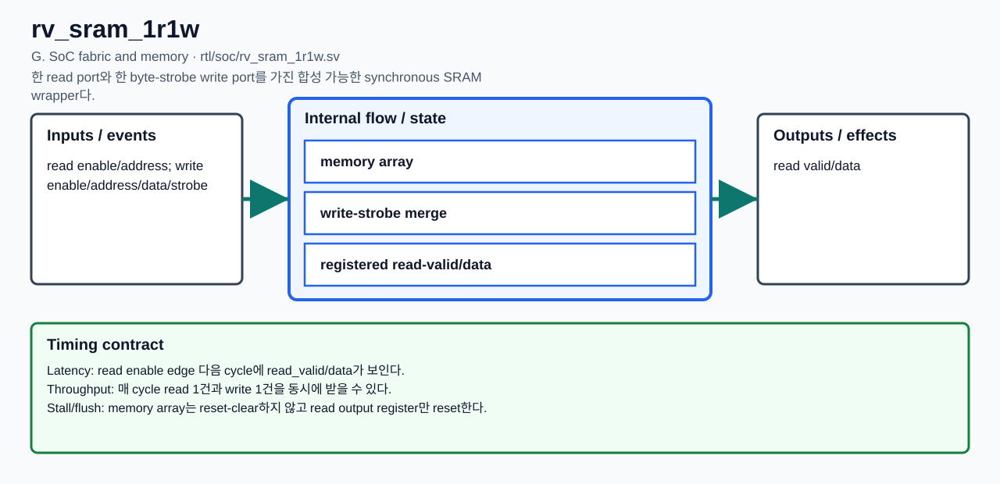

**목적.** 한 read port와 한 byte-strobe write port를 가진 합성 가능한 synchronous SRAM wrapper다.

**Step-by-step.**

1. read/write address와 byte strobe를 받는다.
2. write bytes를 기존 word와 merge해 memory에 기록한다.
3. 동일 주소 read/write면 merge된 new data를 read output에 등록한다.

**타이밍.** read enable edge 다음 cycle에 read_valid/data가 보인다. 처리율은 매 cycle read 1건과 write 1건을 동시에 받을 수 있다. Backpressure/flush 규칙은 memory array는 reset-clear하지 않고 read output register만 reset한다.

**코너케이스.** same-row write-first policy와 미초기화 memory content가 ASIC macro와 일치해야 한다.

**RTL 위치.** [`rtl/soc/rv_sram_1r1w.sv`](../rtl/soc/rv_sram_1r1w.sv)

##### `rv_tim_2bank`

[SVG 크게 보기](diagrams/modules/rv_tim_2bank.svg)

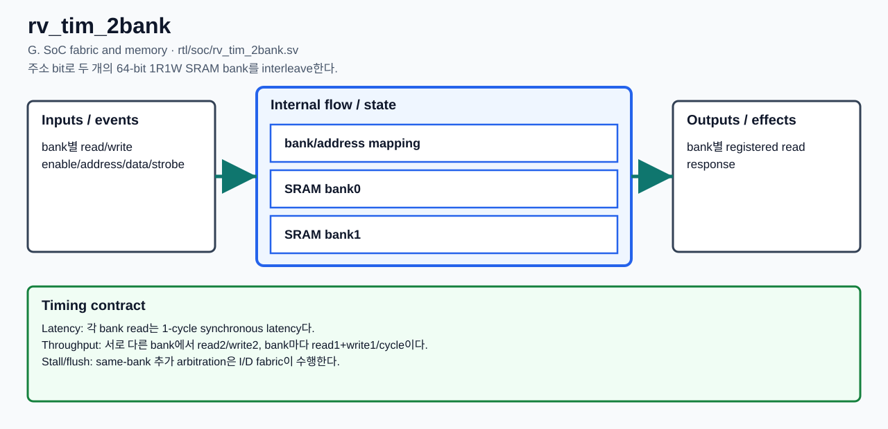

**목적.** 주소 bit로 두 개의 64-bit 1R1W SRAM bank를 interleave한다.

**Step-by-step.**

1. beat address의 interleave bit로 bank를 선택한다.
2. bank-local row address를 생성해 SRAM instance에 보낸다.
3. 두 bank read-valid/data를 fabric에 독립 반환한다.

**타이밍.** 각 bank read는 1-cycle synchronous latency다. 처리율은 서로 다른 bank에서 read2/write2, bank마다 read1+write1/cycle이다. Backpressure/flush 규칙은 same-bank 추가 arbitration은 I/D fabric이 수행한다.

**코너케이스.** bank 선택 bit, odd/even row, same-bank read/write policy를 확인한다.

**RTL 위치.** [`rtl/soc/rv_tim_2bank.sv`](../rtl/soc/rv_tim_2bank.sv)

##### `rv_clint`

[SVG 크게 보기](diagrams/modules/rv_clint.svg)

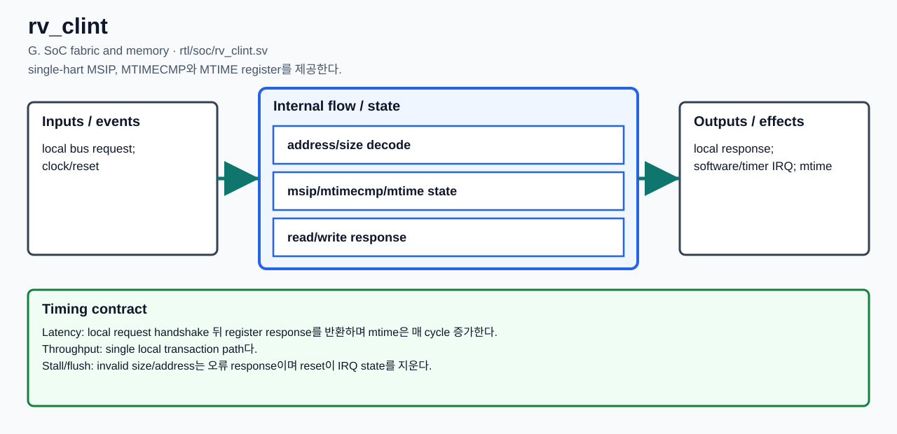

**목적.** single-hart MSIP, MTIMECMP와 MTIME register를 제공한다.

**Step-by-step.**

1. offset과 narrow access를 decode한다.
2. write strobe로 MSIP/MTIMECMP/MTIME word를 갱신한다.
3. mtime>=mtimecmp와 msip bit로 IRQ를 생성한다.

**타이밍.** local request handshake 뒤 register response를 반환하며 mtime은 매 cycle 증가한다. 처리율은 single local transaction path다. Backpressure/flush 규칙은 invalid size/address는 오류 response이며 reset이 IRQ state를 지운다.

**코너케이스.** RV32 high/low word access, compare update 중 transient IRQ와 reset 값을 다룬다.

**RTL 위치.** [`rtl/soc/rv_clint.sv`](../rtl/soc/rv_clint.sv)

##### `rv_plic_local`

[SVG 크게 보기](diagrams/modules/rv_plic_local.svg)

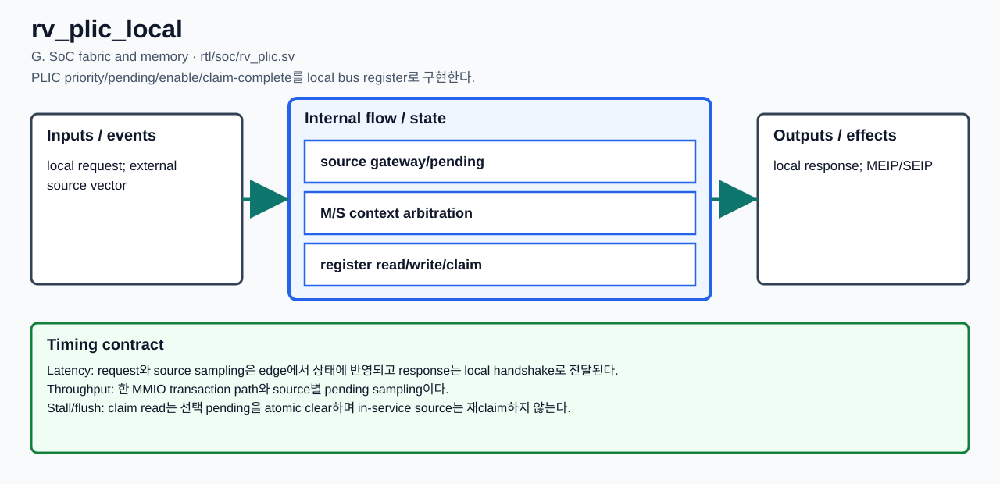

**목적.** PLIC priority/pending/enable/claim-complete를 local bus register로 구현한다.

**Step-by-step.**

1. source level을 pending gateway에 capture한다.
2. priority>threshold인 enabled 최고 priority source를 선택한다.
3. claim read/complete write로 pending/in-service를 변경한다.

**타이밍.** request와 source sampling은 edge에서 상태에 반영되고 response는 local handshake로 전달된다. 처리율은 한 MMIO transaction path와 source별 pending sampling이다. Backpressure/flush 규칙은 claim read는 선택 pending을 atomic clear하며 in-service source는 재claim하지 않는다.

**코너케이스.** priority tie는 낮은 ID, source0 reserved, M/S context 독립 enable을 확인한다.

**RTL 위치.** [`rtl/soc/rv_plic.sv`](../rtl/soc/rv_plic.sv)

##### `rv_plic`

[SVG 크게 보기](diagrams/modules/rv_plic.svg)

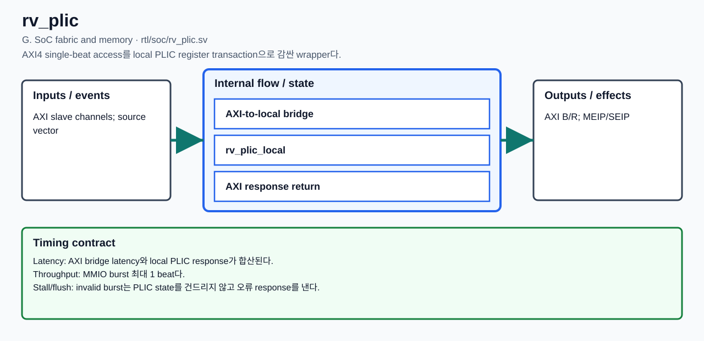

**목적.** AXI4 single-beat access를 local PLIC register transaction으로 감싼 wrapper다.

**Step-by-step.**

1. AXI transaction을 single local request로 변환한다.
2. PLIC local register/gateway 동작을 수행한다.
3. local response를 원 AXI ID의 B/R로 반환한다.

**타이밍.** AXI bridge latency와 local PLIC response가 합산된다. 처리율은 MMIO burst 최대 1 beat다. Backpressure/flush 규칙은 invalid burst는 PLIC state를 건드리지 않고 오류 response를 낸다.

**코너케이스.** narrow/alignment, claim side effect와 AXI retry를 주의한다.

**RTL 위치.** [`rtl/soc/rv_plic.sv`](../rtl/soc/rv_plic.sv)

##### `rv_bootrom_local`

[SVG 크게 보기](diagrams/modules/rv_bootrom_local.svg)

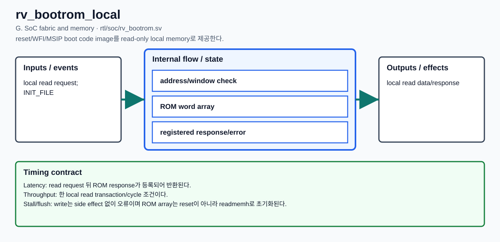

**목적.** reset/WFI/MSIP boot code image를 read-only local memory로 제공한다.

**Step-by-step.**

1. 주소가 ROM window와 정렬에 맞는지 확인한다.
2. 해당 word를 image array에서 읽는다.
3. read data 또는 write/범위 오류 response를 반환한다.

**타이밍.** read request 뒤 ROM response가 등록되어 반환된다. 처리율은 한 local read transaction/cycle 조건이다. Backpressure/flush 규칙은 write는 side effect 없이 오류이며 ROM array는 reset이 아니라 readmemh로 초기화된다.

**코너케이스.** 잘못된 INIT_FILE, window 끝, Host write 시도를 다룬다.

**RTL 위치.** [`rtl/soc/rv_bootrom.sv`](../rtl/soc/rv_bootrom.sv)

##### `rv_bootrom`

[SVG 크게 보기](diagrams/modules/rv_bootrom.svg)

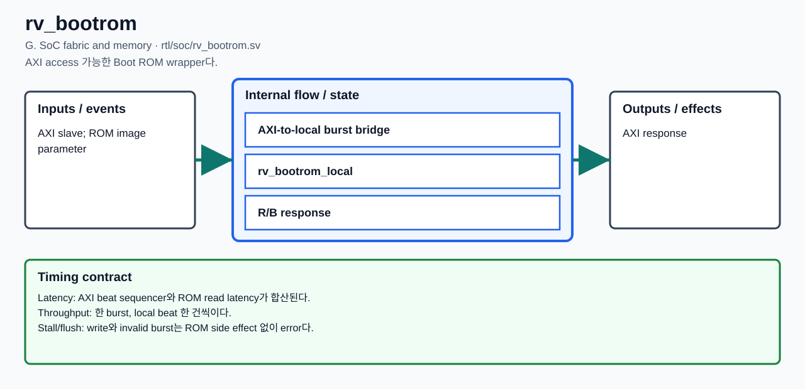

**목적.** AXI access 가능한 Boot ROM wrapper다.

**Step-by-step.**

1. AXI burst 전체 범위를 사전 검사한다.
2. 각 read beat를 local ROM 요청으로 바꾼다.
3. ROM response를 ID/RLAST가 있는 AXI R로 반환한다.

**타이밍.** AXI beat sequencer와 ROM read latency가 합산된다. 처리율은 한 burst, local beat 한 건씩이다. Backpressure/flush 규칙은 write와 invalid burst는 ROM side effect 없이 error다.

**코너케이스.** SoC top은 이 wrapper 대신 I-fabric 내부 local leaf를 사용한다.

**RTL 위치.** [`rtl/soc/rv_bootrom.sv`](../rtl/soc/rv_bootrom.sv)

##### `rv_hostif_local`

[SVG 크게 보기](diagrams/modules/rv_hostif_local.svg)

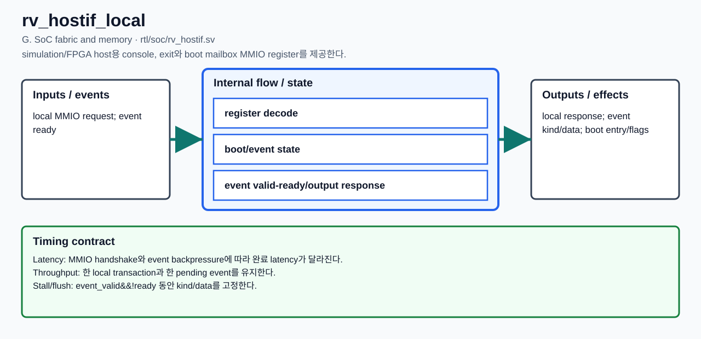

**목적.** simulation/FPGA host용 console, exit와 boot mailbox MMIO register를 제공한다.

**Step-by-step.**

1. 주소/size/write strobe로 HostIF register를 decode한다.
2. console/exit write를 event payload로 capture한다.
3. host가 event를 accept하면 pending을 지우고 MMIO response를 완료한다.

**타이밍.** MMIO handshake와 event backpressure에 따라 완료 latency가 달라진다. 처리율은 한 local transaction과 한 pending event를 유지한다. Backpressure/flush 규칙은 event_valid&&!ready 동안 kind/data를 고정한다.

**코너케이스.** event backpressure, partial write, HostIF와 DTIM HTIF 주소를 혼동하지 않아야 한다.

**RTL 위치.** [`rtl/soc/rv_hostif.sv`](../rtl/soc/rv_hostif.sv)

##### `rv_hostif`

[SVG 크게 보기](diagrams/modules/rv_hostif.svg)

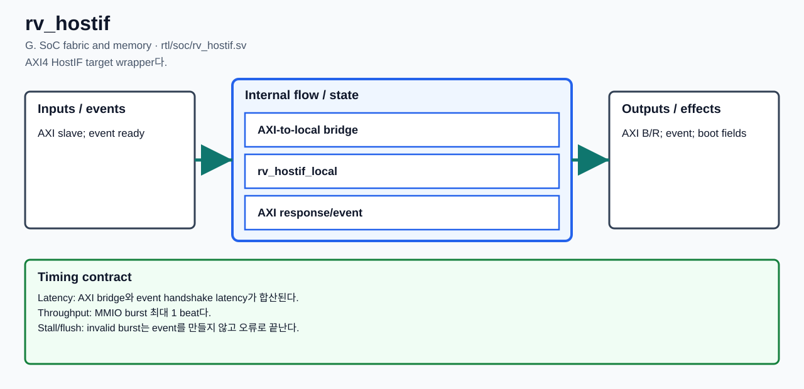

**목적.** AXI4 HostIF target wrapper다.

**Step-by-step.**

1. AXI request를 local MMIO request로 바꾼다.
2. HostIF register/event 동작을 수행한다.
3. local response를 원 AXI ID로 반환한다.

**타이밍.** AXI bridge와 event handshake latency가 합산된다. 처리율은 MMIO burst 최대 1 beat다. Backpressure/flush 규칙은 invalid burst는 event를 만들지 않고 오류로 끝난다.

**코너케이스.** console event 재전송과 write response 순서를 확인한다.

**RTL 위치.** [`rtl/soc/rv_hostif.sv`](../rtl/soc/rv_hostif.sv)

##### `rv_soc_addr_decode`

[SVG 크게 보기](diagrams/modules/rv_soc_addr_decode.svg)

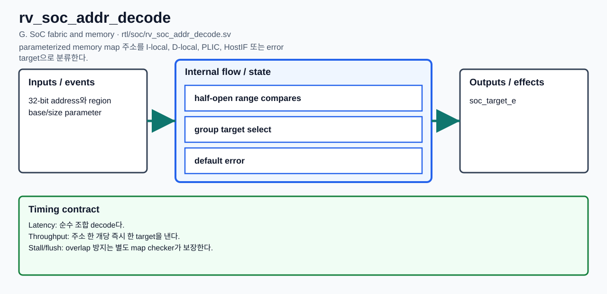

**목적.** parameterized memory map 주소를 I-local, D-local, PLIC, HostIF 또는 error target으로 분류한다.

**Step-by-step.**

1. 각 base<=addr<end를 병렬 비교한다.
2. BootROM/ITIM과 DTIM/CLINT를 local target으로 묶는다.
3. 일치가 없으면 default error target을 선택한다.

**타이밍.** 순수 조합 decode다. 처리율은 주소 한 개당 즉시 한 target을 낸다. Backpressure/flush 규칙은 overlap 방지는 별도 map checker가 보장한다.

**코너케이스.** region 끝의 half-open 경계와 size overflow가 중요하다.

**RTL 위치.** [`rtl/soc/rv_soc_addr_decode.sv`](../rtl/soc/rv_soc_addr_decode.sv)

##### `rv_soc_map_check`

[SVG 크게 보기](diagrams/modules/rv_soc_map_check.svg)

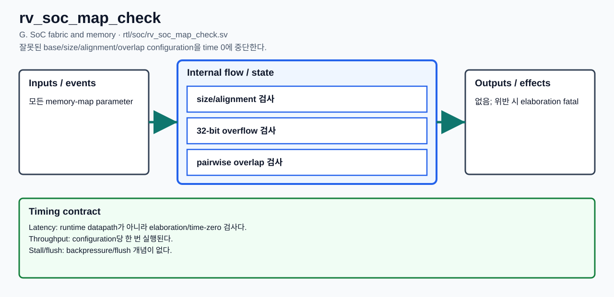

**목적.** 잘못된 base/size/alignment/overlap configuration을 time 0에 중단한다.

**Step-by-step.**

1. 각 region size가 nonzero이고 요구 alignment인지 검사한다.
2. base+size가 address width를 넘지 않는지 계산한다.
3. 모든 region pair가 겹치지 않는지 확인하고 위반 시 fatal한다.

**타이밍.** runtime datapath가 아니라 elaboration/time-zero 검사다. 처리율은 configuration당 한 번 실행된다. Backpressure/flush 규칙은 backpressure/flush 개념이 없다.

**코너케이스.** 새 external SRAM region을 추가하면 반드시 overlap pair에 포함해야 한다.

**RTL 위치.** [`rtl/soc/rv_soc_map_check.sv`](../rtl/soc/rv_soc_map_check.sv)

#### 15.43.4 그림과 RTL을 함께 변경하는 규칙

module port, 저장 state, latency, 처리율 또는 event priority가 바뀌면 해당 RTL과
이 절의 module card source data, SVG, directed test를 같은 commit에서 변경한다.
`python scripts/generate_module_diagrams.py --check`는 checked-in SVG/HDD가 generator
결과와 같은지 검사하고, option 없이 실행하면 다시 생성한다. 그림의 latency는
희망 사양이 아니라 현재 RTL의 handshake edge를 기준으로 유지한다.

<!-- END GENERATED MODULE WALKTHROUGHS -->

## 16. Flush와 recovery 우선순위

같은 cycle에 여러 redirect 원인이 발생하면 older architectural event가 우선이다.

1. reset
2. commit-stage exception/trap/return
3. accepted interrupt
4. older branch misprediction
5. younger branch misprediction
6. frontend prediction redirect

flush는 fetch epoch를 증가시키고 이전 fetch response가 decode state를 갱신하지 못하게 한다. 현재 D-memory response는 epoch를 echo하지 않으므로 flushed outstanding LQ slot을 response까지 tombstone으로 보존한다. long-latency unit은 kill tag 또는 ROB-valid 재확인으로 stale writeback을 버린다.

## 17. 성능·상태 계측

현재 RTL은 아래 항목을 architectural CSR 또는 합성 가능한 hardware counter bank로 제공하지 않는다. CoreMark profiler는 retire trace와 testbench의 내부 관찰로 같은 값을 계산한다. 합성 환경에서 지속 계측이 필요하면 아래 64-bit saturating counter bank를 parameter로 선택 가능하게 추가하되 기본값은 off로 둔다.

- cycles, instructions retired, IPC numerator/denominator
- frontend empty, decode/rename/dispatch stall cycles
- ROB/IQ/PRF/LQ/SQ full stall
- branch count와 direction/target/RAS misprediction
- ITIM/DTIM bank grant, read/write conflict, inbound fairness grant
- load forwarding, unknown-store stall, data-wait, partial-overlap, bank-conflict replay
- AXI master별 requests/beats/latency/outstanding/SLVERR/DECERR
- CLINT/PLIC interrupt count와 interrupt-to-commit latency
- execution-port utilization과 writeback conflict

성능 판정은 최소한 Dhrystone/CoreMark bring-up 후 Embench, riscv-tests/arch-test, Linux-capable 단계에서 SPEC CPU 계열 또는 동등 workload로 진행한다.

## 18. 검증 전략

### 18.0 구현 단계와 검증 단계 분리

개발 방침은 **전체 코어 구조 완성 우선, 통합 검증 후 일괄 보완**이다. v1.4.0에서 FPU, predictor, DPI ELF/Host 경계까지 기능 RTL 연결을 완료 후보로 묶었으므로 이제 구조 추가 단계에서 검증 단계로 전환한다. 이 시점까지의 신규 코드는 interface·state ownership·데이터흐름을 고정한 implementation checkpoint이지 sign-off가 아니다. 다음 순서로 compile/elaboration, unit, core integration, SoC directed/DPI ELF boot, ISA directed/random 및 reference-model differential을 수행하고 발견 결함을 HDD 상태표와 함께 갱신한다.

### 18.1 검증 레이어

1. 단위: C expander, decoder, ALU/M/D/FPU, free list, ROB, age select, LSU forwarding
2. 블록: frontend random boundary, rename dependency, recovery, LSQ ordering/forwarding, TIM bank arbitration
3. core differential: Spike 또는 Sail과 instruction-by-instruction commit trace 비교
4. architectural: riscv-arch-test
5. SoC: AXI VIP/protocol assertion, ELF boot, CLINT/PLIC register/interrupt test
6. software: M/U bare-metal tests, CoreMark/Embench, RTOS, S-mode 이후 Linux
7. formal: x0 invariant, no double allocation, in-order commit, precise exception, no stale writeback

### 18.2 필수 invariant

- 한 physical register는 동시에 free와 mapped 상태일 수 없다.
- committed architectural register마다 정확히 하나의 physical mapping이 있다.
- ROB 밖의 instruction은 commit할 수 없다.
- lane 1은 lane 0보다 먼저 commit할 수 없다.
- exception instruction과 younger instruction은 architectural state를 변경할 수 없다.
- uncommitted store는 외부 memory write를 만들 수 없다.
- flush된 epoch의 response는 PRF/ROB/cache-visible state를 잘못 갱신할 수 없다.
- x0 read는 항상 0이고 x0 write는 무시된다.

### 18.3 Dual LSU/LSQ 필수 시나리오

| 시나리오 | 기대 결과 |
|---|---|
| older store 주소 미정 + younger load | load issue stall, D-Arbiter read 없음 |
| older store 주소 확정 non-overlap + younger load | load memory read 허용 |
| older store same address/data ready + younger load | youngest older store에서 forwarding |
| two older same-address stores + younger load | 더 젊은 older store 선택 |
| matching store data 미정 | load stall/replay, memory read 금지 |
| partial byte overlap | 초기 구현 stall, 잘못된 merge 금지 |
| LSU0/1 two loads different DTIM bank | 두 read 같은 cycle grant |
| LSU0/1 two loads same DTIM bank | older grant, younger `req_ready=0`; decoupled 확장 시 bank-conflict replay |
| same-cycle older store + younger load same address | AGU update register 후 다음 scheduler cycle에 forward; data 미정이면 stall |
| store execute 뒤 older exception | SQ 제거, TIM/AXI write 0회 |
| branch mispredict with younger LQ/SQ | checkpoint 이후 entry 제거 |
| committed store + younger exception | committed store buffer는 유지/drain |
| stale AXI/load response after flush | PRF/ROB 갱신 없음 |

필수 assertion 예시:

- `p_no_uncommitted_store_write`: D fabric write request마다 committed store-buffer entry 또는 Host inbound source가 존재한다.
- `p_load_waits_unknown_older_store`: unknown older SQ가 있으면 해당 younger load의 memory request가 없다.
- `p_forward_from_youngest_older`: forwarding SQ sequence는 모든 matching older 후보 중 최대다.
- `p_same_bank_dual_read_single_grant`: 한 DTIM bank에 cycle당 SRAM read enable은 최대 1개다.
- `p_two_bank_dual_read_allowed`: ready한 서로 다른 bank load 두 개가 backpressure 없을 때 모두 grant된다.
- `p_flush_kills_lsq`: flush boundary보다 younger인 LQ/SQ valid가 정해진 cycle 내 0이 된다.
- `p_store_commit_order`: store-buffer enqueue sequence가 감소하지 않는다.
- `p_axi_stable_when_stalled`: 각 AXI channel payload는 valid&&!ready 동안 stable이다.

### 18.4 Boot/privilege 검증

- reset PC가 Boot ROM base인지 확인
- Boot ROM이 `mtvec`, PMP, `mie.MSIE`, `mstatus.MIE` 설정 후 WFI에 도달하는지 확인
- DPI loader가 마지막 ELF B response 전에 CLINT msip를 쓰지 않는지 assertion
- MSIP trap PC가 `0x8000_0000`인지, handler clear 뒤 재진입하지 않는지 확인
- U-mode illegal CSR, ECALL, PMP R/W/X fault와 MRET transition 검증
- PLIC priority/enable/threshold/claim/complete와 source0=0 검증
- `rv_soc_top_tb`: Host AXI→BootROM/ITIM/DTIM/CLINT/HostIF 왕복과 unmapped DECERR 검증

현재 자동 회귀 완료 항목은 CSR evaluation/commit 분리와 old-value 반환, machine CSR/interrupt enable, vectored mtvec와 trap state, MRET→U 전환, U-mode machine CSR illegal, `mcounteren`, FCSR/fflags, backend WFI→MSIP→mtvec, MRET 복귀, ECALL precise trap이다. CSR interrupt 회귀는 MEIP(11)>MSIP(3)>MTIP(7) 우선순위와 fallback을 검사한다. 독립 trap-controller 회귀는 ROB가 비지 않은 동안 interrupt 진입 금지, 동기 예외와 pending interrupt가 겹칠 때 예외 우선, retired-next-PC를 사용하는 precise interrupt `mepc`, interrupt `mtval=0`, WFI wake/redirect serialization을 검사한다. 같은 조건은 RTL assertion으로도 고정한다. interrupt pending 중 younger dispatch 금지, WFI sleep 중 dispatch 금지, head exception 중 정상 retire 금지, exception payload 보존, interrupt `pc=next_pc`/`tval=0`, trap vector redirect가 매 simulation에서 감시된다. PMP 단위 회귀는 OFF/TOR/NA4/NAPOT, R/W/X, M bypass/lock, lower-index partial-match priority를 확인한다. IFU 회귀는 16-byte transport의 parcel별 fault 합성, TOR 상한 `0x800008fc` 경계의 정상 M-mode retire, target-buffer warm/cold/fenced PMP refetch 및 locked instruction access fault를 확인한다. backend 통합 회귀는 MPRV=U에서 거부된 load/store가 D-memory request 없이 precise trap이 되는 것을 확인하며, `0xffff_ffcb` misaligned LW/SW가 cause 4/6으로 bus request 없이 끝나는지와 `0xffff_ffc8` aligned unmapped LW/SW가 error response 한 번 뒤 cause 5/7로 끝나는지도 확인한다. `external_access_fault.S` full-SoC 회귀는 여기에 `0xffff_ffcb` LBU/SB를 더해 byte access가 misalignment가 아니라 default AXI DECERR 기반 cause 5/7이 되는지, handler의 `mepc += 4` 복구 뒤 여섯 fault 모두 진행되는지를 확인한다. D-Fabric 회귀는 기존 read response를 반환하는 같은 edge에 다음 read를 받아도 old ID/data와 next metadata가 섞이지 않는지 검사한다. PLIC 회귀는 priority/enable/pending/tie-break/threshold/M·S context claim-complete와 오류 응답을, CLINT 회귀는 mtime progression/MSIP/mtimecmp/MTIP와 오류 응답을 확인한다. SoC directed boot 회귀는 실제 Boot ROM image가 WFI에 들어간 뒤 Host AXI로 ITIM/DTIM/HostIF를 접근하고, 마지막 CLINT MSIP write로 `0x8000_0000`의 handler가 retire되는 것을 확인한다. DPI-C ELF 자동 적재는 RV32IMF, 혼합폭 RV32C, M/U privilege self-check ELF 모두 HostIF exit(0)까지 통과했다. RV32C image는 압축 ALU/load-store/branch/jump와 cross-halfword 32-bit `FENCE/FENCE.I`를, M/U image는 PMP allow-all 설정, MRET→U, illegal machine CSR trap(cause 2), U ECALL(cause 8), handler 복귀를 포함한다.

추가로 EBREAK/C.EBREAK 통합 회귀는 cause 3, informative `mtval`, faulting `mepc`,
raw C encoding trace와 same-bundle younger write squash를 검사한다.

#### RV32F extended corner regression (2026-09-10)

`python scripts/run_fpu_corners.py`로 113,600개 vector를 static `rm`과
dynamic `rm=111, frm=vector_rm` 두 경로에서 실행한다 (총 227,200 comparisons).
Icarus의 `iverilog`와 `vvp`가 PATH에 필요하며 Windows에서는
`--iverilog C:/iverilog/bin/iverilog.exe --vvp C:/iverilog/bin/vvp.exe`를 지정할 수 있다.
기본 seed는 `0x20260910`, random-per-op-rm은 1024다. 결과는
`out/fpu_corners/{generate,compile,static,dynamic}.log`와 `vectors.hex`에 보관한다.
생성한 vector 파일은 `op rm a b c expected_result expected_fflags` 형식이다.

검사 범위는 기존 24개 RV32F operation의 random/특수값에 더해
ADD/SUB/MUL/DIV/MIN/MAX/비교의 22개 특수값 전체 pair,
4종 FMA의 10개 대표값 전체 triple, min-normal 경계, half-ULP ties,
인접 값 cancellation, FP→정수의 반올림·포화 경계다. 음수/양수 zero,
subnormal, infinity, qNaN/sNaN 조합을 포함하며 result와 5개 fflags를 함께 비교한다.
dynamic 검사는 arithmetic/conversion에만 rm=111을 적용하고 sign/min/compare 등의
funct3 operation-select는 유지한다.

두 경로 모두 PASS했고 추가 RTL 산술 오류는 발견되지 않았다. 기준값은 host FP를
쓰지 않는 exact rational/integer-sqrt oracle이며 외부 Spike/SoftFloat sign-off와는
구분한다. 이 TB는 순차 request/result 검사이므로 backpressure/flush 및 core-level
FCSR 누적의 모든 조합을 증명하지 않는다. 기존 6,470개 fast fixture는 그대로 유지한다.

#### CSR corner regression (2026-09-10)

`rv_csr_file_tb`는 기존 trap/privilege 검사에 다음 directed checks를 추가한다.

- CSRRS/CSRRC old-value 반환, rs1=x0 쓰기 억제, CSRRW x0의 zero write.
  값이 0인 non-x0 source는 여전히 write intent이므로 read-only CSR에서 illegal이다.
- execute에서 캡처한 주소/데이터가 live 입력 변경에 영향받지 않는지,
  flush 후 늦은 commit pulse가 취소된 CSR write를 되살리지 않는지 검사한다.
- mtvec reserved mode→direct, mepc bit0 제거와 bit1 보존, mie/mcounteren mask,
  unsupported MPP→U, FS=Dirty의 SD 표시, fcsr/frm/fflags alias를 검사한다.
- fflags 초기값 32개에 accrue OR 후 frm write가 flag를 보존하는지 검사한다.
- dual-retire minstret carry와 low/high alias, time low/high read,
  연속 동기 trap의 mepc/mcause/mtval 덮어쓰기와 MPIE 캡처를 검사한다.
- MRET→U의 MPRV clear, U-mode MRET illegal, M-mode WFI의 local enable wake와
  global MIE delivery 구분, U-mode TW 및 machine interrupt eligibility를 검사한다.
- PMP reserved bit read-zero, R=0/W=1 WARL 처리, locked TOR entry와 이전
  pmpaddr의 write 보호를 검사한다.

이 회귀에서 `pmpcfg0=0x7f` write가 reserved `[6:5]`를 보존하여 `0x7f`로
readback되는 오류를 재현했다. 기본 PMP의 해당 비트를 commit 시 0으로 정규화하여
readback이 `0x1f`가 되도록 수정했다. 다른 entry의 L/A/R/W/X 필드와 lock 동작은
유지한다. 기준은 [RISC-V Machine-Level ISA PMP](https://docs.riscv.org/reference/isa/v20260120/priv/machine.html)다.

실행: `powershell -ExecutionPolicy Bypass -File scripts/run_unit_tests.ps1`.
CSR 포함 unit 18종과 Verilator backend integration은 PASS다.
Icarus runner는 SVA 대신 TB의 명시적 check를 실행한다.
FP flag/CSR의 같은 cycle commit은 ROB serializing 규칙으로 분리되므로 임의로
동시 입력을 만들어 ISA order를 추정하지 않는다. 이 검사는 FP instruction의
FS=Off 접근 제한/FS dirty 추적 전체 경로나 모든 core-level CSR instruction
조합의 sign-off를 대신하지 않는다.

#### Local execution-unit control corners (2026-09-10)

`rv_fpu_tb`에 두 개의 연속 FMV.W.X payload `12345678/tag41/seqFE`,
`87654321/tag42/seqFF`를 넣고 output ready를 4 cycle 내린 검사를 추가했다.
full pipe에서 request ready가 내려가고 첫 result의 data/tag/flags가 유지되어야 한다.
boundary FE의 selective flush는 FF만 제거하며, boundary FF에 대한 seq00도
modular age상 younger이므로 제거한다. full flush와 flush 이후 FADD 1+2=3도 검사한다.
flush cycle에는 request를 보내지 않고 result ready도 0으로 두므로, 이 회귀가
flush와 동시 handshake의 모든 조합을 보장하지는 않는다.

`rv_divider_tb`는 기존 5개에 14개 explicit expected-value case를 더했다.
INT_MIN/-1 quotient=INT_MIN 및 remainder=0, divisor=0의 quotient=FFFFFFFF와
remainder=dividend, 0/0, 음수/양수 remainder sign, |dividend|<|divisor|,
INT_MIN/1 및 unsigned FFFFFFFF/80000000의 quotient=1/remainder=7FFFFFFF를 검사한다.
FPU transport와 DIV/REM 모두 PASS이며 추가 RTL 수정은 필요하지 않았다.
unit 18종 전체 회귀도 PASS다. 기존 LSQ forwarding/older-store stall 회귀는
재실행했으며 이번 절의 신규 검사에는 dual-LSU 충돌 시나리오 확장을 포함하지 않는다.

### 18.5 실행 결과와 commit 비교 계약

| Gate | 실행 산출물 | 2026-09-21 결과 |
|---|---|---|
| parse/elaboration | `python scripts/check_rtl.py` | RV32/RV64/PADDR34/relocated SoC 및 TB elaboration PASS |
| unit | `scripts/run_unit_tests.ps1` | rename/PRF/execute/decode/divider/FPU directed+exact differential/fetch/LSU/SB/LSQ/WB/recovery/result buffer/CSR/PMP/trap controller 18종 PASS; RV32F 전체 연산군 6,470 vectors |
| block | `scripts/run_block_tests.ps1` | ROB/IQ/issue arbiter/MUL/predictor/AXI outbound·inbound bridge/I·D fabric/SoC peripheral/PLIC/CLINT 17종 PASS; D-Fabric handoff와 4-KiB burst reject 포함 |
| backend integration | `scripts/run_integration_tests.ps1` | dual dispatch/retire, dependency, branch recovery, FP same-pair dependency와 FADD.S exact-zero retire, LSU/CSR/PMP, EBREAK/C.EBREAK precise trap directed PASS |
| SoC directed boot | `scripts/run_soc_boot_test.ps1` | Boot ROM/Host AXI/ITIM/DTIM/HostIF/CLINT MSIP PASS |
| DPI ELF | `scripts/run_soc_elf_test.ps1` | ELF 3종 각각 PT_LOAD→mailbox→MSIP→ITIM→HostIF exit(0) PASS |
| RV32IMF trace | `scripts/verify_rv32_smoke_trace.ps1` | payload 24, INT writes 16, FP writes 3, dual-commit cycles 8 exact-match PASS |
| RV32C trace | `scripts/verify_rv32c_smoke_trace.ps1` | 혼합폭 payload 18, dual-commit cycles 4, wrong-path PC 2개 미commit PASS |
| M/U trace | `scripts/verify_rv32_priv_smoke_trace.ps1` | MRET→U, illegal CSR cause 2, ECALL-U cause 8, U resume 및 M-mode exit PASS |
| GCC C/ASM loop | `scripts/run_c_loop_test.ps1` | integer/FP/load-store 8회 loop, payload 357, FP write 68, lane-1 commit 125, trap 0, signature `0x009e00b9`, exit(0) PASS |
| CoreMark short RTL | `scripts/run_coremark.ps1` | v1.18 timing RTL, 2 iterations, CRC 4종 PASS, 468,930 cycles, 576,450 instret, IPC 1.229288, estimated 4.265029 CoreMark/MHz, exit(0) |
| PMP fetch boundary | `scripts/check_pmp_fetch_boundary.py` | TOR top `0x800008fc`, 16-byte transport 경계의 `0x800008fc` instruction `trap=0` retire 및 HTIF exit(0) PASS |

GCC workload의 재현 소스, 예상/관측값, ELF header/symbol/disassembly, 결과 요약과 전체 commit CSV는 `verification/tests/rv32_c_loop`에 함께 보관한다. 이 테스트는 compiler가 선택한 RV32IMFC instruction 조합과 반복 branch recovery를 실제 SoC 경로에서 검증한다. 특히 recovery와 같은 cycle에 도착한 older load response는 surviving LQ entry를 완료해야 하고, older writeback은 surviving IQ entry의 source-ready를 반드시 갱신해야 한다. 두 상태 전이는 각각 LSQ/IQ 단위 회귀로 고정한다.

### 18.6 CoreMark short RTL 성능 계약

CoreMark는 upstream `eembc/coremark` commit
`1f483d5b8316753a742cbf5590caf5bd0a4e4777`의 algorithm source를 수정하지
않고 별도 bare-metal port로 빌드한다. 2K performance seed, static memory,
single context, GCC `-O2`, RV32IMC Zicsr/Zifencei/ILP32를 기준으로 하며 code와
read-only data는 ITIM, mutable static data와 stack은 DTIM에 둔다. benchmark
timed region은 `mcycle`과 `minstret`의 RV32 high-low-high 안정 read로 측정한다.

초기 RTL 회귀의 기본 iteration은 2다. 이는 다음 CoreMark 공식 보고 조건 중
최소 10초 실행을 의도적으로 만족하지 않으므로 결과를 **non-certified
implementation estimate**로만 기록한다. 기능 PASS 조건은 known 2K
performance seed CRC `e9f5`, list CRC `e714`, matrix CRC `1fd7`, state CRC
`8e3a`, datatype error 0, CRC error 0이다. 10초 미만 status는 이 short run에서
예상되며 기능 실패에 포함하지 않는다.

`portable_fini`는 printf/UART를 사용하지 않고 HostIF TOHOST에 magic/version,
iteration, 64-bit cycle, 64-bit retired instruction, 5개 CRC, status를 12개의
ordered 32-bit word로 전송한 뒤 EXIT_CODE를 쓴다. 성능 report는
`IPC=instret/cycles`, `cycles/iteration=cycles/iterations`,
`estimated CoreMark/MHz=iterations*1,000,000/cycles`로 계산한다. 마지막 값은
현재 1:1 ITIM/DTIM 모델의 cycle 기반 추정치이며 합성 Fmax 없이 절대
CoreMark/sec로 해석하지 않는다.

PowerShell runner는 공식 source pin/clean 상태, ELF build, DPI Host 적재,
CRC packet과 exit(0), metric 산출을 한 번에 검사한다. Linux runner도 같은
ELF/SoC 경로를 사용하며 raw HostIF packet을 보존한다. 전체 commit trace는
benchmark 시간과 무관하지만 파일이 매우 커지므로 기본 비활성화하고,
architectural count는 commit 경계에서 증가하는 `minstret`로 얻는다.

#### 18.6.1 performance profiler와 1차 튜닝 결과

CoreMark port는 timed region 직전/직후에 simulation-only HostIF marker를 보낸다.
`rv_perf_profiler`는 두 marker 사이만 계수하고 `coremark.perf.json`을 만든다.
따라서 ELF load, Boot ROM, 초기 software interrupt와 결과 packet 전송은 profile에
들어가지 않는다. profile에는 fetch/dispatch/issue/retire의 0·1·2 slot cycle,
frontend empty/backpressure, dispatch resource stall, IQ nonempty/no-issue, ROB-head
incomplete, branch resolve/mispredict, LSQ ordering stall, D-memory wait와 queue
occupancy가 포함된다. stall event는 같은 cycle에 겹칠 수 있으므로 합산해 전체
cycle로 해석하면 안 된다.

| configuration | cycles | IPC | estimated CoreMark/MHz | 결론 |
|---|---:|---:|---:|---|
| 최초 공개 baseline | 684,571 | 0.842060 | 2.921538 | 비교 기준 |
| marker 포함 동일 build baseline | 688,060 | 0.837790 | 2.906723 | profiler A/B 기준 |
| response/request 동시 handoff | 653,304 | 0.882361 | 3.061362 | IFU/I-Fabric bubble 제거 |
| PC bimodal 선택 | 614,717 | 0.937749 | 3.253530 | CoreMark에서 단독 gshare보다 우수 |
| tournament predictor | 604,885 | 0.952991 | 3.306414 | v1.11 baseline |
| 16-entry target/loop block buffer | 548,343 | 1.051258 | 3.647352 | v1.12.0 baseline |
| 32-entry target/loop block buffer | 548,318 | 1.051306 | 3.647518 | 25-cycle 이득뿐이므로 원복 |
| + zero-bubble target redirect/fill | 537,249 | 1.072966 | 3.722669 | 채택 |
| + split store-address/data issue | **533,820** | **1.079858** | **3.746581** | v1.12.1 채택 baseline |
| + raw compressed-branch resolve | **483,143** | **1.193125** | **4.139561** | v1.12.2 채택 baseline |
| + D-Fabric response/request handoff | **464,335** | **1.241453** | **4.307235** | v1.13.0 채택 baseline; IPC 1.2 목표 달성 |
| + v1.18 timing boundary(P4 FP + LSQ candidate) | **468,930** | **1.229288** | **4.265029** | 최종 채택; CRC/instret 보존, baseline 대비 cycle +0.99% |

최종 v1.13.0 profile window는 464,382 cycles이며 branch 121,956회 중 mispredict
7,680회(6.30%), frontend-empty 56,988 cycles, IQ가 비어 있지 않지만 issue가 없는
cycle 83,718회, ROB head incomplete 103,125회, 미확정 older-store 때문에 load가
막힌 cycle 24,020회, D-memory request wait 12,173회다. IQ no-issue는 operand
82,730, resource 988, arbitration 0으로 분해되고 ROB-head incomplete는 load
91,457, store 1,483, control 1,213, other 8,972로 분해된다. event는 서로 중첩되므로
각 감소량을 architectural cycle 감소량으로 합산하지 않는다.

v1.12.2에서 branch checkpoint 8→16을 다시 측정하면 483,143→482,717, 426
cycles(0.09%)만 감소했다. checkpoint stall은 71,735→56으로 없어졌지만 ROB
capacity stall이 3,692→30,042로 이동했다. ROB 64와 checkpoint 16을 함께 적용해도
482,536 cycles로 607 cycles(0.13%) 이득뿐이었다. rename snapshot과 ROB storage
증가를 정당화하지 못하므로 ROB 48/checkpoint 8을 유지한다.

#### 18.6.2 IPC 1.2 목표 달성과 동결 기준

v1.12.2의 576,450 instructions/483,143 cycles에서 IPC 1.2를 달성하려면 같은
instruction stream을 480,375 cycles 이하에 끝내야 했다. v1.13.0은 D-Fabric의
response consume과 next-request accept를 같은 cycle에 허용해 464,335 cycles,
IPC 1.241453를 기록했다. predictor table이나 CoreMark 특화 heuristic은 변경하지
않았고 synchronous memory latency와 single-outstanding 계약도 유지했다. 목표를
넘었으므로 추가 성능 변경은 동결하고 합성/Fmax/PPA 및 외부 differential 검증으로
넘어간다.

| 관측 지표 | v1.13.0 값 | 전체 profile 대비 | 1차 해석 |
|---|---:|---:|---|
| fetched/dispatched | 635,144 / 464,382 cycles | 1.368 uop/cycle | 공급 폭은 목표를 넘지만 wrong-path 포함 |
| branch mispredict | 7,680 / 121,956 resolve | 6.30% | predictor는 v1.12.2와 동일 |
| frontend empty | 56,988 cycles | 12.3% | 다음 병목 후보이나 목표 달성 후 변경 동결 |
| IQ nonempty/no issue | 83,718 cycles | 18.0% | operand 82,730이 지배적 |
| ROB-head incomplete | 103,125 cycles | 22.2% | load wait 91,457이 지배적 |
| unknown older-store load stall | 24,020 cycles | 5.2% | conservative ordering 잔여 비용 |
| D-memory request wait | 12,173 cycles | 2.6% | v1.12.2의 60,828 대비 80.0% 감소 |
| branch checkpoint stall | 52,098 cycles | 11.2% | 단순 증설은 이전 A/B에서 순이득 미미 |
| lane-1 retire blocked | 51,823 cycles | 11.2% | 단독 완화 A/B는 성능 이득 없음 |

#### 18.6.3 v1.18 합성 타이밍 절충 실험

사용자 합성에서 `LSQ lq_killed_q → ROB/WB → IQ select → FPU payload_q`가 약
20 MHz critical path로 보고됐다. 첫 시도는 LSQ candidate, LSU completion,
IQ wakeup, P0~P4 issue에 모두 register를 추가했으나 CoreMark가 730,339 cycles,
IPC 0.789291까지 하락했다. LSU completion register와 registered-only wakeup을
제거해도 전 포트 issue register 구성은 587,490 cycles, IPC 0.981208이었다.
이는 정수·load-use producer-consumer chain마다 한 cycle이 반복 추가됐기 때문이다.

최종 구성은 24-entry LQ oldest scan과 16-entry SQ compare 사이의 candidate
register, 그리고 보고된 endpoint 바로 앞인 P4 FP issue/operand register만 유지한다.
P0~P3, global WB와 IQ same-cycle wakeup은 fall-through로 복구했다. 최종 결과는
468,930 cycles, IPC 1.229288로 v1.13 기능 baseline보다 4,595 cycles(0.99%)만
증가하면서 IPC 1.2 목표를 유지한다. final profile은 frontend-empty 55,215,
IQ nonempty/no-issue 98,389, ROB-head incomplete 115,312 cycles이며 branch
mispredict는 7,041회다. 이 결과는 기능·cycle trade-off의 RTL 기준이고 실제
Fmax 개선은 동일 synthesis constraint/library에서 이전 netlist와 비교해야 한다.

##### 무료 합성 preflight와 v1.18.1 조합 경로 개선

서버 sign-off 전에 심각한 조합 경로를 찾기 위해 `scripts/run_open_timing.ps1`과
`scripts/run_open_timing.sh`를 추가했다. 둘 다 기존 `sim/xcelium/sources_core.f`를
그대로 읽고, Slang frontend가 포함된 Yosys로 `rv_ooo_core` hierarchy/process/check를
수행한다. 이어 Nangate45 typical Liberty, `INV_X1` input driver, output load 5 fF,
wire-load 없음, 10 ns ABC target으로 병목 block을 독립 mapping한다. array-heavy
ROB/IQ/LSQ는 `$mem_v2` macro boundary를 유지하므로 표의 area에는 memory macro가
포함되지 않는다. 이 수치는 배치·배선, clock uncertainty, 실제 SRAM Liberty가 없는
**상대 비교용 preflight**이며 MHz sign-off 값이 아니다.

| Block/configuration | preflight delay | mapped area | 해석 |
|---|---:|---:|---|
| WB arbiter, 이전 4회 직렬 oldest scan | 15.936 ns | 12,611.9 µm² | 사용자 장거리 경로의 가장 큰 조합 원인 |
| WB arbiter, 병렬 INT/FP/completion age rank | **2.347 ns** | **12,453.6 µm²** | delay 85.3% 감소, CoreMark cycle 불변 |
| LSQ, 이전 24-entry 직렬 oldest-two scan | 9.993 ns | 25,024.7 µm² + memory | candidate FF 입력 경로 |
| LSQ, 병렬 load age rank | **6.379 ns** | **41,212.7 µm² + memory** | delay 36.2% 감소, area 64.7% 증가 |
| FPU, current 3-stage/iterative slow path | 8.956 ns | 39,249.6 µm² | 현재 preflight 최장 block |
| Issue queue 56-entry | 7.913 ns | 23,862.1 µm² + memory | wakeup/ready/oldest selection 후보 |
| ROB 48-entry | 3.140 ns | 14,501.5 µm² + memory | 현재 우선순위 낮음 |
| Rename2 | 2.380 ns | 69,500.7 µm² | full FF/free-list mapping 포함 |
| PMP 8 entries × 8 fetch parcels | 2.146 ns | 30,571.6 µm² | parcel 병렬 검사 |
| Issue arbiter, 실제 2 candidates × 5 ports | 1.093 ns | 235.4 µm² | global 2-wide grant 자체는 병목 아님 |

표의 10 ns target은 첫 screening 조건이므로 각 숫자가 절대 최소 delay는 아니다.
ABC target을 5 ns로 낮춘 추가 mapping에서 구조 변경 전 FPU는
7.293 ns/39,951.1 µm², 56-entry IQ는 6.397 ns/24,535.8 µm²였다. 이에
add/FMA의 align/accumulate와 normalize/round/pack 사이를 실제 register로 나눴다.
같은 5 ns target에서 FPU는 **5.079 ns/34,531.1 µm²**가 되어 delay 30.35%,
mapped area 13.57%가 감소했다. 기본 fast latency는 여전히 3 edge이고 처리율도
1 request/cycle이므로 이 최적화는 architecture-visible cycle 수를 추가하지 않는다.
공개 cell library에서는 FPU와 IQ가 다음 후보지만, 서버 STA에서 start/end point와
실제 SRAM/library 조건을 재확인한 뒤 추가 pipeline 또는 구조 변경을 결정한다.

WB/LSQ/FPU 변경 뒤 parse/elaboration, unit 18종, block 17종, backend integration과
CoreMark를 재실행했다. FPU differential 6,470 vectors는 `LATENCY=3` split 경로에서
PASS했고 실제 GCC C/FP/INT/LSU ELF도 FP commit 68건, trap 0건, exit(0)을 기록했다.
CoreMark는 468,930 cycles, 576,450 instret, IPC 1.229288, CRC/exit PASS로 변경 전과
bit/cycle 수준에서 같다. 서버 library 비교가 최종 채택 gate다. 특히 LSQ는 delay
개선과 면적 증가를 함께
평가하여, 서버 합성에서 area 또는 routing이 악화되면 banked tournament selector로
바꾸는 후속 선택지를 유지한다.

##### v1.18.3 selection-tree/resource-return 재구성 preflight

v1.18.3은 IQ와 LQ의 oldest-two 선택을 균형 tournament tree로, SQ forwarding을
4-level youngest-match reduction tree로 바꿨고, commit이 반환한 physical tag와
issue된 IQ slot을 다음 cycle allocation부터 쓰도록 resource-return 경로를 끊었다.
아래는 같은 Nangate45 typical / `INV_X1` driver / output load 5 fF / wire-load 없음
조건에서 ABC target을 **1 ns**로 두고 v1.18.2 baseline(`f634128`)과 v1.18.3 작업
트리를 같은 Linux Yosys 0.69+77 + ABC로 연속 측정한 값이다. memory macro는 area에
포함되지 않는다.

| Block | v1.18.2 delay | v1.18.3 delay | Δdelay | v1.18.2 area | v1.18.3 area | Δarea |
|---|---:|---:|---:|---:|---:|---:|
| Issue queue 56-entry | 6,180.63 ps | **3,309.81 ps** | −46.4% | 24,502.6 µm² | 32,082.8 µm² | **+30.9%** |
| LSQ | 5,785.50 ps | **2,472.17 ps** | −57.3% | 41,782.2 µm² | 23,994.8 µm² | **−42.6%** |
| FPU (`LATENCY=4`, core 실제 구성) | 5,079.32 ps | **4,828.67 ps** | −4.9% | 34,531.1 µm² | 33,600.9 µm² | −2.7% |
| Rename2 | 1,899.51 ps | **1,783.48 ps** | −6.1% | 69,771.3 µm² | 70,444.0 µm² | +1.0% |
| WB arbiter | 2,068.06 ps | 2,068.06 ps | 0 | 12,544.8 µm² | 12,544.8 µm² | 0 |
| ROB 48-entry | 2,684.39 ps | 2,684.39 ps | 0 | 14,617.0 µm² | 14,617.0 µm² | 0 |
| PMP 8×8 parcel | 1,729.21 ps | 1,729.21 ps | 0 | 30,849.6 µm² | 30,849.6 µm² | 0 |
| Issue arbiter | 996.26 ps | 996.26 ps | 0 | 253.2 µm² | 253.2 µm² | 0 |

등록된 block 중 최장 delay는 6,180.63 ps(IQ) → **4,828.67 ps(FPU)** 로 21.9%
줄었고 critical block이 IQ에서 FPU로 옮겨갔다. IQ는 delay를 46% 줄이는 대신
area가 31% 늘었고, LSQ는 delay와 area가 함께 줄었다. 두 결과 모두 배치·배선과
실제 SRAM Liberty가 없는 상대 비교이므로 서버 STA/area가 최종 채택 gate다.

`rv_fpu.sv`의 module 기본값, `rv_backend.sv` 인스턴스와 differential TB는 모두
`LATENCY=4`로 통일되어 있다. 따라서 위 수치와 이 문서의 fast 4-stage 서술이
현재 통합 코어의 실제 구성이다. 처리율은 1 request/cycle을 유지하고 개별 fast FP
결과 latency만 기존 3 edge에서 4 edge로 한 단계 증가한다.

v1.18.3 검증은 공개 툴체인(Yosys 0.69+77 / ABC 1.01 / Verilator 5.053)에서
재실행했다. `rv_ooo_core` hierarchy/proc/check PASS, block 17종 전부 PASS,
backend integration PASS이고 Windows 정규 Icarus unit 18종도 전부 PASS다.
별도 Verilator 실행에서 `rv_fetch_queue_tb` 한 건은 baseline `f634128`과 같은
assertion에서 실패하므로 Icarus용 testbench의 simulator 환경 차이로 분류했다.
FPU differential은 6,470 vectors PASS, GCC C/FP ELF는 host event `0x009e00b9`,
exit 0, payload commit 359건, FP register commit 68건, payload trap 0건이다.
CoreMark 2-iteration은 CRC chain(`0xe9f5/0xe714/0x1fd7/0x8e3a/0x72be`)과 status
`0x9`, exit 0이 같고 **468,408 cycles / 576,450 instret / IPC 1.230658**이다.
같은 환경에서 `f634128`은 468,930 cycles / IPC 1.229288로 재현되므로 v1.18.3은
522 cycles(0.11%) 적고 IPC가 떨어지지 않았다.

표의 FPU v1.18.2 열 5,079.32 ns/34,531.1 µm²는 v1.18.1 절의 5 ns target 측정값을
그대로 옮긴 것이다. 같은 `-D 1000` 조건으로 v1.18.2 `rv_fpu.sv`를 코어가 쓰던
`LATENCY=3`으로 다시 매핑하면 4,994.26 ps / 34,743.1 µm²이고, 이 값을 기준으로 한
v1.18.3(`LATENCY=4`, 4,803.52 ps / 33,646.3 µm²)의 개선은 delay 3.8%, area 3.2%다.
Windows ABC와 Linux ABC 사이의 0.5% 내외 차이가 있어 두 측정 모두 같은 결론이다.

###### FPU critical path는 FMA가 아니라 iterative FDIV/FSQRT pack이다

`LATENCY`만 바꿔 같은 조건으로 매핑하면 delay와 critical start point가 다음과 같다.

| FPU `LATENCY` | preflight delay | mapped area | critical start point |
|---:|---:|---:|---|
| 3 (v1.18.2 RTL) | 4,994.26 ps | 34,743.1 µm² | `pre_calc_q[150]` — fast pre-pack |
| 3 (v1.18.3 RTL) | 4,859.21 ps | 34,664.9 µm² | `operand_b_i[1]` — request → fast path |
| **4 (현재 구성)** | **4,803.52 ps** | **33,646.3 µm²** | `div_quotient_q[85]` — slow path |
| 5 | 4,709.85 ps | 34,131.5 µm² | `div_quotient_q[83]` — slow path |
| 6 | 4,789.56 ps | 35,030.3 µm² | `div_quotient_q[86]` — slow path |

`LATENCY=4`부터 critical path가 fast pipe를 떠나 iterative slow path로 고정되고
delay가 4.7~4.8 ns에서 평탄해진다. 해당 경로는 `div_quotient_q`(88-bit)와
`sqrt_root_q`를 받아 한 cycle 안에 normalize/round/pack을 수행하는 `pack_finite`
조합망이며, sqrt recurrence의 128-bit shift/compare/subtract도 같은 영역에 있다.
따라서 **add/FMA는 더 이상 FPU 병목이 아니다.** align·product·accumulate와
normalize/round/pack 사이는 v1.18.2에서 register로 나뉘었고 v1.18.3에서 한 단 더
분리됐다. fast pipe를 5, 6단으로 더 쪼개도 이득이 없으므로 다음 FPU 작업은
FDIV/FSQRT 결과 packing을 별도 stage로 분리하거나 sqrt recurrence의 비교 폭을
줄이는 방향이다.

###### CoreMark로는 FP latency 변경을 검증할 수 없다

CoreMark ELF는 `rv32imc_zicsr_zifencei` / soft-float ABI로 빌드되므로
FP instruction을 포함하지 않는다(`readelf` Flags: `RVC, soft-float ABI`).
실제로 `LATENCY=3`과 `LATENCY=4`가 **468,408 cycles / 576,450 instret /
IPC 1.230658**로 bit/cycle 수준에서 동일하다. 즉 CoreMark 불변은 FP latency가
무해하다는 증거가 아니라 FP를 쓰지 않는다는 뜻이다. FP 경로 판정은 6,470-vector
differential(`LATENCY=4` PASS)과 GCC C/FP ELF가 담당한다. C/FP ELF는 두 구성
모두 host event `0x009e00b9`, exit 0, payload commit 359건, FP register commit
68건, payload trap 0건이고 마지막 commit cycle만 910 → 911로 1 cycle 늘어난다.
FP-sensitive cycle 지표가 필요하면 hard-float benchmark를 별도로 준비해야 한다.

##### v1.18.4 공개 flow 타이밍 재구성 (store-buffer/ROB/LSQ/IQ/multiplier + FPU 4단계)

###### 0. 측정 blind spot이 먼저 있었다

`scripts/run_open_timing.ps1`의 `$blocks`에 `rv_store_buffer`, `rv_lsu_cluster`,
`rv_multiplier`, `rv_divider`, `rv_fetch_queue`, `rv_csr_file`이 빠져 있었다.
그 결과 실제 최장 block인 `rv_store_buffer`(6,027.28 ps)와
`rv_lsu_cluster`(6,270.32 ps)가 한 번도 화면에 나타나지 않은 채 더 짧은 block을
최적화하고 있었다. 이번 작업에서 6개 leaf를 screening list에 추가했다.
**타이밍 작업의 첫 단계는 "무엇이 측정되고 있지 않은가"를 확인하는 것이다.**

###### 1. 공개 flow 전후 비교 (동일 조건)

Yosys 0.69+77 / `read_slang` / ABC 1.01, Nangate45 typical, `INV_X1` 구동,
5 fF load, wire load 없음, `abc -D 1000`, `synth -flatten -noshare -noabc`,
메모리 매크로는 면적에서 제외. baseline은 `be78fec`.

| Block | baseline delay | v1.18.4 delay | Δdelay | baseline area | v1.18.4 area | Δarea |
| --- | --- | --- | --- | --- | --- | --- |
| `rv_lsu_cluster` | 6,270.32 ps | 2,456.02 ps | **−60.8%** | 121,134.0 µm² | 128,266.5 µm² | +5.9% |
| `rv_store_buffer` | 6,027.28 ps | 1,616.02 ps | **−73.2%** | 30,951.5 µm² | 29,623.9 µm² | −4.3% |
| `rv_fpu` (L=5) | 4,709.85 ps | 2,906.45 ps | **−38.3%** | 34,131.5 µm² | 26,913.9 µm² | −21.1% |
| `rv_issue_queue` | 3,493.28 ps | 2,945.19 ps | −15.7% | 238,496.1 µm² | 277,138.2 µm² | +16.2% |
| `rv_rob` | 3,036.22 ps | 1,243.73 ps | **−59.0%** | 176,883.9 µm² | 177,976.1 µm² | +0.6% |
| `rv_multiplier` | 2,720.65 ps | 2,675.43 ps | −1.7% | 17,195.3 µm² | 17,534.7 µm² | +2.0% |
| `rv_divider` | 2,254.94 ps | 2,254.94 ps | 0 | 2,776.5 µm² | 2,776.5 µm² | 0 |
| `rv_lsq` | 2,240.83 ps | 2,227.08 ps | −0.6% | 62,691.4 µm² | 62,604.2 µm² | −0.1% |
| `rv_rename2` | 1,783.48 ps | 1,783.48 ps | 0 | 70,444.0 µm² | 70,444.0 µm² | 0 |
| `rv_writeback_arbiter` | 1,658.73 ps | 1,658.73 ps | 0 | 8,195.7 µm² | 8,195.7 µm² | 0 |

설계 전체 최장 block은 **6,270.32 → 2,945.19 ps (−53.0%)** 이고 이제
`rv_issue_queue`가 최장이다. `rv_fpu`는 유일하게 delay와 area가 함께 줄었다.

###### 2. 구조 수정 5건 (store-buffer / ROB / LSQ / IQ / multiplier)

- `rv_store_buffer`: 16-entry youngest-match 선형 탐색을 4-level reduction
  tree(`query_cand_t` / `query_younger`)로 교체. ABC가 재구성할 수 없던 것은
  1-bit OR/priority 축약이 아니라 **loop-carried 산술(캐리 체인)과 넓은
  sequence 비교**다.
- `rv_rob`: `flush_kept_count = flush_kept_count + 1'b1`의 48단 직렬 캐리
  체인을 균형 popcount tree(`KEEP_LEVELS` / `keep_tree`)로 교체.
- `rv_lsq`: `first_free_lq` / `first_free_sq`의 선형 first-match를
  binary-search priority encoder(`any_tree`)로 교체.
- `rv_issue_queue`: (a) `count_o`의 56단 직렬 증가를 popcount tree로,
  `empty_o` / `full_o`를 별도 저가 경로로 분리. (b) oldest-two 선택을
  tournament tree에서 age-ordering matrix로 교체. area는 늘지만 1차 목표가
  timing이므로 채택했다.
- `rv_multiplier`: `stage0_q.result <= selected_result` 때문에 32×32 곱이
  stage0 **이전**에 끝나 있고 stage0→stage1이 단순 복사였다.
  `multiply_request_t`를 도입해 stage0은 피연산자만 잡고 곱셈을
  stage0→stage1에서 수행한다. latency 2 cycle은 그대로이고 critical 시작점이
  `operand_b_i`에서 `stage0_q`로 이동한다.

###### 3. FPU 4단계 (4,709.85 → 2,906.45 ps, area −21.1%)

| 단계 | 변경 | delay | area | ABC start-point |
| --- | --- | --- | --- | --- |
| baseline | `LATENCY=4`, MAGW=128 | 4,709.85 ps | 34,131.5 µm² | fast path |
| a | align/accumulate 분리 + negate folding, `LATENCY=5` | 3,657.69 ps | 35,297.9 µm² | `align_calc_q` |
| b | `MAGW` 128 → 80 | 3,711.15 ps | 31,653.2 µm² | `pre_calc_q` |
| c | dual-adder magnitude + `DIV_FRAC` 52 → 28 | 3,649.36 ps | 31,885.2 µm² | `pre_calc_q` |
| d | `normalize_fp_pre` 지수 산술 재구성 | 3,324.35 ps | 30,576.2 µm² | `div_quotient_q` |
| e | `pack_finite` 지수 산술 재구성 | 3,075.83 ps | 29,338.7 µm² | `sqrt_remainder_q` |
| f | FSQRT 피연산자 정규화 + 폭 축소 | **2,906.45 ps** | **26,913.9 µm²** | `align_calc_q` |

스테이지별 예산(동일 probe harness, 상대 비교용):

| 스테이지 | 이전 | 이후 |
| --- | --- | --- |
| `execute_fp_align` (곱 + 정렬) | 3,535.53 ps | 3,535.53 ps |
| `fp_align_finish` (누산) | 3,317.03 ps | 2,350.21 ps |
| `normalize_fp_pre` (LZC + barrel shift) | 2,702.58 ps | 1,842.49 ps |
| `finalize_fp_normalized` (round/pack) | 991.45 ps | 991.45 ps |

###### 4. 왜 128-bit 가산이 필요했나 — IEEE-754 요구사항이 아니다

IEEE-754가 요구하는 것은 **무한정밀도 결과를 한 번만 올바르게 반올림한 값**
뿐이고, 그에 필요한 정보는 significand(24) + guard + round + sticky = 27 bit다.
sticky 1 bit가 그 아래 전부를 대표하므로 잘린 bit를 물리적으로 들고 있을 필요가
없다. 128-bit은 규격이 아니라 **모든 연산을 하나의 공통 exact fixed-point 필드에
정렬해 넣고 마지막에 한 번 반올림하는 구현 스타일**의 부산물이다.
연산별 실제 필요 폭은 FADD/FSUB ~32, FMA `3p+4 ≈ 76`(그래서 `MAGW=80`),
FDIV 몫 소수부 28, FSQRT 근 29다.

###### 5. 핵심 교훈 — 폭은 area 레버, 직렬 캐리 체인이 timing 레버

같은 flow에서 순수 가산기만 폭별로 합성한 결과:

| W | 32 | 48 | 64 | 80 | 96 | 112 | 128 |
| --- | --- | --- | --- | --- | --- | --- | --- |
| delay (ps) | 1,080.61 | 1,534.20 | 1,620.25 | 1,940.60 | 2,016.37 | 2,213.60 | 2,171.46 |
| area (µm²) | 799.6 | 1,215.9 | 1,620.2 | 2,029.8 | 2,362.3 | 2,818.5 | 3,177.1 |

**area는 폭에 정확히 선형(3.97×)이지만 delay는 2.01×에 그친다.** ABC가 `$add`를
carry-skip/select 구조로 매핑하므로 지연은 대략 √W로 움직인다. 따라서
`MAGW` 128 → 80은 area −10.3%를 주고 delay는 사실상 변하지 않았다(단계 b).
timing을 실제로 움직인 것은 폭이 아니라 **직렬로 놓인 캐리 체인의 개수**다.

- `fp_align_finish`: `signed_sum = x+y` 뒤에 `-signed_sum`이 붙어 **풀폭 캐리
  체인 2개가 직렬**이었다. probe 분해 결과 add만 1,622.06 ps, invert/sign 포함
  1,985.21 ps, 전체 3,317.03 ps — 뒤쪽 negate 하나가 1,332 ps(스테이지의 40%)다.
  `x+y`, `x−y`, `y−x`를 **병렬 가산기 3개**로 만들고 부호로 선택하도록 바꿔
  3,317.03 → 2,267.31 ps(−31.7%), area는 오히려 −3.1%.
- `normalize_fp_pre` / `pack_finite`: LZC 결과 `highest_bit` 뒤에
  `hb + lsb_exponent`, `> 127` 비교, `>= -126` 비교, `shift_amount` 계산,
  `+127` bias가 **32-bit `integer` 산술로 직렬** 연결돼 있었다. 32-bit 가산
  하나가 1,080 ps인 flow에서 이것이 스테이지의 대부분이었다
  (LZC 단독 1,516.49 ps → shift amount까지 2,564.56 ps → 전체 2,702.58 ps,
  즉 barrel shifter 자체는 ~140 ps).
  지수 산술을 16-bit로 좁히고 `hb`에 의존하지 않는 항
  (`127 - lsb`, `-126 - lsb`, `-(lsb+149)`, `lsb+127`)을 모두 LZC와 **병렬**로
  앞세워 비교만 남겼다. 반올림 캐리도 새 가산을 시작하지 않도록 두 후보 지수를
  미리 만들어 선택한다. `normalize_fp_pre` 2,702.58 → 1,842.49 ps.

###### 6. 반복 divider/sqrt는 피연산자를 정규화하면 폭과 반복이 함께 준다

`fp_mantissa`는 subnormal에서 선행 0을 그대로 남기므로 `rv_fpu`의 radix-2
FDIV/FSQRT는 최악 subnormal을 덮으려고 과도한 폭을 썼다. 나누기/제곱근 **전에**
mantissa를 정규화(`mantissa_lz` + 좌시프트, 지수 보정)하면 피연산자가
`[2^23, 2^24)`로 고정되어 필요한 폭이 결정된다.

| | baseline | v1.18.4 |
| --- | --- | --- |
| `DIV_FRAC` / `DIV_NUMW` | 52 / 77 | **28 / 53** |
| FDIV 반복 | 77 cycle | **53 cycle** |
| sqrt radicand / root / remainder | 128 / 64 / 130 bit | **58 / 29 / 60 bit** |
| FSQRT 반복 | 64 cycle | **29 cycle** |

`DIV_FRAC`를 정규화 없이 28로 낮추면 vector 1550(`a=0x00000001`,
`b=0x007fffff`, rm=3)에서 1 ULP가 틀린다. 정규화가 선행 조건이다.
이 변경은 타이밍뿐 아니라 **FDIV −24 cycle / FSQRT −35 cycle의 순수 지연
개선**이기도 하다. CoreMark는 soft-float ABI라 이 이득을 보여주지 못한다.

###### 7. 검증

| 항목 | 결과 |
| --- | --- |
| `scripts/check_rtl.py` (pyslang) | 40개 구성 PASS |
| unit 18종 | 17 PASS / `rv_fetch_queue_tb` 1건 |
| block 17종 | 17 PASS |
| backend integration | `rv_backend_int_tb` PASS |
| FPU differential oracle | 6,470 vectors PASS |
| FPU transport/flush | PASS |
| FDIV 등가 co-sim (`DIV_FRAC` 28 vs 52) | 14,600 vectors bit-exact |
| FADD/FSUB/FMUL/FDIV/FSQRT 등가 co-sim | 32,900 vectors bit-exact |
| FSQRT 전용 등가 co-sim | 24,170 vectors bit-exact |
| GCC C/FP ELF | host-finish 0, commit trace md5 baseline과 동일 |
| CoreMark | **468,408 cycles / 576,462 instret / IPC 1.230684**, 593,268행 commit trace md5 baseline과 완전 일치 |

`rv_fetch_queue_tb` 실패는 회귀가 아니다. 손대지 않은 `f634128`를 같은 md5로
두고 실행해도 동일하게 실패하는 Verilator 전용 TB 환경 artifact다
(Windows/Icarus에서는 PASS).

등가 co-sim은 변경 전 모듈을 `rv_fpu_ref`로 rename해 같은 자극을 주고
`result_data_o` / `result_fflags_o`를 bit 단위로 비교하는 방식이다. 오라클을
새로 구현하지 않으므로 오라클 자체의 버그가 결론을 오염시키지 않는다.

###### 8. 남은 병목

1. `rv_issue_queue` 2,945.19 ps — 이제 설계 최장 block.
2. `execute_fp_align` 3,535.53 ps — 24×24 곱과 정렬 배럴시프터가 한 단에 있다.
   `SPLIT_PREMUL`로 분리하는 방향(이전 L7 시도는 dual-adder 이전 구조라 무의미).
3. `fp_align_finish` 2,350.21 ps — 더 내리려면 LZA(leading-zero anticipation)로
   정규화 시프트량을 가산기와 병렬 예측해야 한다.
4. 서버 STA의 cross-module 경로(LSQ → store_buffer → writeback → IQ → mul)는
   PC flow의 block 단위 측정으로는 재현되지 않는다. 저장해 둔
   `rv_backend_pre_abc.il`로 whole-backend ABC를 돌려 확인해야 한다.

##### v1.18.5 FPU/IQ 추가 절감 (2026-09-23)

v1.18.4에서 남은 두 병목(`rv_fpu` 2,906.45 ps, `rv_issue_queue` 2,945.19 ps)을
같은 공개 조건에서 한 번 더 깎았다.

| Block | be78fec | v1.18.4 | v1.18.5 | 누적 Δdelay | area be78fec → v1.18.5 |
| --- | --- | --- | --- | --- | --- |
| `rv_fpu` (L=5) | 4,709.85 ps | 2,906.45 ps | **2,513.04 ps** | **−46.6%** | 34,131.5 → 27,012.6 µm² (−20.9%) |
| `rv_issue_queue` | 3,493.28 ps | 2,945.19 ps | **2,422.98 ps** | **−30.6%** | 238,496.1 → 225,992.5 µm² (−5.2%) |

설계 전체 최장 block은 **6,270.32 → 2,513.04 ps (−59.9%)** 이고, v1.18.4에서
IQ area가 +16.2% 늘었던 절충도 해소되어 baseline보다 −5.2%가 됐다.

###### 1. FPU — 지수 산술이 정렬 단에도 그대로 있었다

v1.18.4에서 `normalize_fp_pre`/`pack_finite`의 32-bit `integer` 지수 산술을
잡았는데, **정렬(align) 단에는 같은 패턴이 그대로 남아 있었다.**
`fp_fma_align`의 실제 직렬 사슬은 다음과 같았다.

```
fp_lsb_exponent(a) + fp_lsb_exponent(b)   // 32-bit 가산
  -> max(product_exponent, c_exponent)    // 32-bit 비교
  -> common_exponent - product_exponent   // 32-bit 감산
  -> right_shift_sticky(...)              // 80-bit barrel shift
```

32-bit 가산 하나가 1,080 ps인 flow에서 배럴시프터 **앞에** 32-bit 연산 3개가
직렬로 놓여 있었다. 게다가 `right_shift_sticky`는 sticky mask를
`if (bit_index < shift_amount)`로 만들면서 32-bit 비교를 MAGW번 돌렸다.

수정: 지수 산술 폭을 `EXPW = 16`으로 통일했다.

- `fp_lsb_exponent` 범위는 [-149, 104], FMA product 지수는 [-298, 208],
  `ALIGN_SH` 보정까지 합쳐도 |e| < 400이므로 16-bit signed로 80배 여유가 있다.
- `fp_precalc_t.lsb_exponent`, `fp_align_t.common_exponent`,
  `fp_normalized_t.unbiased_exponent`, `div_exponent_q`, `sqrt_exponent_q`,
  `pack_finite`/`right_shift_sticky`의 인자를 모두 `logic signed [EXPW-1:0]`로
  바꿨다.
- sticky mask 비교는 해당 분기에서 `0 < s < MAGW`가 보장되므로 7-bit로 좁혔다
  (`shift_minus1`).
- `finalize_fp_normalized`도 `pack_finite`와 같은 방식으로, 반올림 캐리가 새
  가산을 시작하지 않도록 두 후보 지수를 미리 만들어 선택하게 했다.

**2,906.45 → 2,590.69 ps (−10.9%), area 변화 없음.**

폭 캐스팅 함정 하나를 기록해 둔다. SystemVerilog는 이항 연산의 한쪽이
unsigned면 **식 전체가 unsigned**가 된다. `sqrt_lsb - EXPW'(34)`처럼 쓰면
`EXPW'(34)`가 unsigned라 음수 지수에서 `/2`가 unsigned 나눗셈이 되어
FSQRT vector 3442가 깨졌다. 모든 캐스트를 `signed'(EXPW'(x))`로 바꿔야 한다.
원래 코드가 `int'(...)`를 쓰고 있어서 문제가 드러나지 않았던 것이다.

###### 2. FPU — 누산 단 출력 mux 평탄화

`fp_align_finish`는 `if (!sum_pending) return` → `if (sum_zero) return` →
정상 경로의 중첩 early-return이라 가산기 뒤에 mux가 3단 쌓였다.
두 제어항(`sum_pending`, `sum_zero`)은 가산기와 무관하게 일찍 확정되므로,
세 결과(`al.pre` / `pre_zero` / `pre_sum`)를 모두 만들어 두고 **평탄한 select
한 번**으로 바꿨다.

**2,590.69 → 2,513.04 ps (−3.0%), area +0.4%.**

ABC start-point는 `align_calc_q[27]`(= `mag_y[1]`)로, 81-bit 가산기의 캐리
체인 자체다. 같은 flow의 순수 80-bit 가산기가 1,940.60 ps이므로 현재
2,513 ps는 가산기 바닥의 1.29배다. 여기서 더 내리려면 단일 경로 FMA를
near/far 2-path 구조로 바꾸거나 누산 단을 한 번 더 쪼개야 한다(`LATENCY=6`).

###### 3. IQ — am_first → am_second 직렬 축약 제거

```
am_first[i]  = ready[i] && ((age_matrix_q[i] & ready) == 0)
am_ready2    = ready & ~am_first
am_second[i] = am_ready2[i] && ((age_matrix_q[i] & am_ready2) == 0)
```

`am_second`가 `am_first`를 기다리므로 ENTRIES-wide 축약이 **직렬로 두 번**
돌았다. age matrix가 ready 집합 위에서 strict total order이면
second-oldest는 "자기보다 오래된 ready 항목이 정확히 하나인 항목"이다.
따라서 `m_i = age_matrix_q[i] & ready_now`에 대해

```
oldest        == count(m_i) == 0
second-oldest == count(m_i) == 1
```

이고, 두 판정을 **하나의 saturating {any, ge2} 트리**에서 뽑을 수 있다.
노드마다 `any = any_L | any_R`, `ge2 = ge2_L | ge2_R | (any_L & any_R)`.

절차적 3중 루프는 21k 반복이라 slang의 `--unroll-limit 4000`을 넘기므로
`generate`로 기술했다. Verilator는 레벨 배열을 한 덩어리로 보고 UNOPTFLAT
(순환 조합 논리)로 오인하므로 선언에 `/* verilator split_var */`를 붙였다.

**2,945.19 → 2,832.49 ps (−3.8%), area 277,138.2 → 273,013.1 µm² (−1.5%).**

###### 4. IQ — candidate payload를 one-hot AND-OR로

원래는 one-hot(`am_first`) → 우선순위 인코더 → 6-bit `am_index` →
`xxx_q[am_index[slot]]`의 ENTRIES:1 mux였다. 늦게 도착하는 `am_first` 뒤에
인코더와 6단 mux가 **연달아** 붙는다.

- 28개 per-entry 필드를 `cand_payload_t` 하나로 묶고
  `sel_payload |= {CAND_W{am_hot[entry]}} & entry_payload[entry]`로 선택한다.
  늦은 신호 뒤에 남는 것은 OR 트리 하나뿐이다.
- one-hot → binary 인코더도 비트별 OR 축약으로 다시 썼다. 순차 last-wins
  루프로 기술하면 ENTRIES 깊이의 우선순위 사슬로 내려간다.
- `candidate_store_data_valid_o` / `candidate_final_phase`가 쓰던
  `source_ready_now[am_index][1]`(늦은 신호에 대한 또 하나의 ENTRIES:1 mux)도
  `|(am_hot & store_data_ready_vec)` 1-bit 축약으로 바꿨다.

**2,832.49 → 2,422.98 ps (−14.5%), area 273,013.1 → 225,992.5 µm² (−17.2%).**
delay와 area가 함께 크게 줄었다. one-hot AND-OR가 인코더+mux보다 게이트
수에서도 유리하다.

###### 5. 검증

| 항목 | 결과 |
| --- | --- |
| `scripts/check_rtl.py` | 40개 구성 PASS |
| unit 18종 | 17 PASS (`rv_fetch_queue_tb` 기존 환경 artifact) |
| block 17종 | 17 PASS |
| backend integration | `rv_backend_int_tb` PASS |
| FPU differential oracle | 6,470 vectors PASS |
| FPU 등가 co-sim (v1.18.4 FPU 기준) | 5-op 32,900 + FSQRT 24,170 vectors bit-exact |
| GCC C/FP ELF | host-finish 0, commit trace md5 동일 |
| CoreMark | **468,408 cycles / 576,462 instret / IPC 1.230684**, 593,268행 commit trace md5 동일 |

###### 6. 남은 병목

1. `rv_fpu` 2,513.04 ps — 81-bit 누산 캐리 체인(바닥 ≈1,940 ps)이 한계.
   near/far 2-path FMA 또는 누산 단 추가 분할(`LATENCY=6`)이 다음 카드다.
2. `rv_issue_queue` 2,422.98 ps — `tag_wakes`(11 port × 56 entry × 3 source)
   → `ready_now` → age tree → one-hot fan-in의 약 20 논리 단. 구조를 더
   줄이려면 speculative(issue-time) wakeup + shadow window가 필요하다.
3. `rv_lsu_cluster` 2,456.02 ps가 이제 세 번째다.

##### 전체 backend(Top) 기준 합성은 된다 — 멈춘 원인은 ABC 기본 script였다

###### 1. 왜 멈췄나

`rv_backend`를 통째로 내리면 `read_slang → proc → flatten → techmap → dfflibmap`
뒤에 **610,696 cell** 짜리 조합 네트워크가 남는다. yosys의 ABC 기본 script는

```
strash; &get -n; &fraig -x; &put; scorr; dc2; dretime; retime -o -D <t>;
strash; &get -n; &dch -f; &nf -D <t>; &put; buffer; upsize; dnsize; stime -p
```

인데, 이 중 `scorr`(sequential SAT sweeping) / `dc2` / `dretime` / `retime`은
60만 cell 규모에서 실질적으로 끝나지 않는다. 21분 넘게 CPU 97%를 쓰면서
`2.2. Extracting gate netlist ...` 이후로 로그가 한 줄도 나오지 않았다.
도구가 죽은 것이 아니라 **끝나지 않는 pass를 돌고 있었던 것**이다.

앞쪽 sequential 최적화를 빼고 delay 중심으로만 남기면

```
strash; &get -n; &dch -f; &nf -D <t>; &put; buffer;
upsize -D <t>; dnsize -D <t>; stime -p
```

**약 25분에 완주한다.** `retime`을 뺀 것은 속도 때문만이 아니다. retime은
register를 옮기므로 "어느 register에서 어느 register까지"라는 경로 해석 자체를
무의미하게 만든다.

`scripts/run_open_timing.ps1` / `.sh`의 whole-top 항목에 `AbcScript = "trim"`
(bash는 `INCLUDE_WHOLE_TOP=1`)을 추가해 이 script를 쓰도록 했다. ABC의 `source`는
yosys placeholder(`{D}`)를 전개하지 않으므로 delay target은 파일에 직접 써 넣는다.

###### 2. 서버 STA가 지목한 경로가 그대로 재현된다

flatten 후에도 계층 이름이 남아 ABC의 start-point를 읽을 수 있다.

| 트리 | Delay | Area | Start-point |
| --- | --- | --- | --- |
| `be78fec` | 14,827.02 ps | 284,938.40 µm² | `u_lsu_cluster.u_lsq.candidate_found[0]` |
| v1.18.5 | **8,072.33 ps** | 322,086.37 µm² | `u_lsu_cluster.u_lsq.candidate_found[0]` |

**−45.6%.** 그리고 시작점은 사용자가 서버 STA에서 보고한
`lsu_cluster/lsq/candidate_index_reg → mul/stage0`과 **같은 register 그룹**이다.
공개 PC flow에서 서버의 cross-module 경로가 재현된다는 뜻이고, 앞으로 서버를
기다리지 않고 이 경로를 반복 측정할 수 있다.

###### 3. block 단위 측정은 구조적으로 이 경로를 볼 수 없다

whole-backend는 lowering이 `macro`(가벼움)이고 ABC script도 다듬은 것이라
절대값을 block 수치(`synth -flatten` + 전체 ABC script)와 직접 비교할 수 없다.
그래서 **같은 lowering + 같은 trim script로 단일 block을 다시 재서 보정계수**를
구했다.

| | block 정식 flow | whole-backend와 동일 flow | 비율 |
| --- | --- | --- | --- |
| `rv_fpu` | 2,513.04 ps | 2,925.11 ps | 1.16× |
| `rv_issue_queue` | 2,422.98 ps | 3,608.58 ps | 1.49× |

즉 whole-backend 8,072 ps를 정식 flow 기준으로 환산하면 대략 **5.4 ~ 7.0 ns**,
설계 최장 block(2,513 ps)의 **2 ~ 2.7배**다.

이 차이는 측정 오차가 아니라 실제 회로다. `rv_lsq`의 candidate register에서
`rv_multiplier`의 `stage0_q`까지

```
LSQ candidate → store_buffer 16-entry CAM/youngest → lsu_cluster completion
  → writeback_arbiter 11-source arbitration → IQ tag_wakes → select
  → issue arbiter → multiplier stage0
```

**다섯 모듈을 지나는 동안 중간 register가 하나도 없다.** block 단위 screening은
이 경로를 다섯 조각으로 나눠 보므로, 각 조각을 아무리 줄여도 합은 그대로
남는다. 실제로 v1.18.5에서 다섯 모듈을 전부 줄였는데도 start-point는
그대로 LSQ candidate다.

###### 4. 결론

- whole-top 합성은 가능하다. 매 변경마다 돌리기에는 무겁지만(전처리 8분 +
  ABC 25분), 라운드 종료 시 sign-off 용도로는 충분하다.
- 다음 단계는 block 최적화가 아니라 **이 사슬에 register를 하나 넣는 것**이다.
  speculative(issue-time) wakeup + IQ shadow window가 그 방법이고,
  writeback → wakeup 경로를 끊어 사슬을 둘로 나눈다.
- whole-backend area가 +13.0%인 것은 대부분 v1.18.4에서 들어간 56×56
  age matrix의 flip-flop이다(DFF 3,379 → 6,568). block 단위 IQ area는 오히려
  줄었으므로(238,496 → 225,992 µm²), 이 증가분은 lowering 차이와 FF 자체의
  비용이다. 서버 library에서 다시 확인해야 한다.

##### v1.18.7 모듈 간 무등록 경로 절단 — writeback 우회 wakeup과 forwarding 등록

###### 1. 문제: 한 cycle 안에 다섯 모듈이 register 없이 이어져 있었다

whole-backend 합성의 critical path는 144 gate, 8,072.33 ps였고 시작점은
`u_lsu_cluster.u_lsq.candidate_found`, 끝점은 `g_fast[0].u_buffer.payload_q`였다.
서버 STA가 보고한 `lsu_cluster/lsq/candidate_index_reg → mul/stage0`과 같은 경로다.

모듈 경계를 보기 위해 hierarchy를 유지한 JSON에서 모듈별 입력→출력 조합 arc와
top의 연결을 따라가는 도구(`scripts/find_comb_chains.py`)를 만들었다. 결과:

| 모듈 | FF | 조합 arc |
| --- | --- | --- |
| `rv_writeback_arbiter` | 0 | `source_valid_i → wakeup_*_o / source_ready_o / int_wb_*_o` 전부 조합 |
| `rv_issue_queue` | 56 | `writeback_*_i → candidate_*_o` (wakeup→select→payload 동일 cycle) |
| `rv_issue_arbiter` | 0 | `candidate_* / port_mask → issue_* / port_*` 전부 조합 |
| `rv_phys_regfile` | — | `read_addr_i / write_*_i → read_data_o` (비동기 read + write-through) |
| `rv_exec_result_buffer` | — | `result_ready_i → request_ready_o` (writeback grant가 issue 가능 여부로) |
| `rv_lsu_cluster` | — | LQ candidate → SQ/SB CAM → forward → `completion_*_o` 조합 |

즉 `FU 결과 reg → writeback arbiter → IQ wakeup/select → issue arbiter → PRF → FU → 결과 reg`가
**한 cycle 조합 루프**였고, 부하가 있는 load는 그 앞에 LSQ forwarding까지 붙어 있었다.
여기에 writeback grant가 결과 buffer의 ready를 거쳐 issue 마스크로 들어가는
backpressure 경로, recovery flush가 IQ payload와 PRF 주소까지 게이트하는 경로가 겹쳐
있었다. block 단위 측정은 이 사슬을 다섯 조각으로 나눠 보므로 볼 수 없다.

###### 2. IPC 영향을 먼저 측정했다

| 실험 | 내용 | CoreMark cycles | Δ |
| --- | --- | --- | --- |
| E1 | writeback wakeup을 1 cycle 등록 (전부) | 557,232 | **+18.96%** |
| E2a | ALU 결과 buffer만 직접 wakeup + bypass, 나머지는 등록 | 511,820 | +9.27% |
| E2x | mul/div/fpu까지 직접 wakeup | 511,848 | +9.27% |

E2a와 E2x가 같으므로 비용은 전부 **load**에서 나온다. CoreMark의 load 완료는
memory 응답 107,913건, store→load forwarding 1,286건(1.2%)이었다. 따라서
"load 전체 +1 cycle"은 받아들일 수 없고, forwarding만 등록하면 비용이 거의 없다.

###### 3. 수정 A — producer-side wakeup (writeback arbiter를 루프에서 제거)

- 목적지를 쓰는 writeback source 7개(fast result buffer 2, mul, div, fpu, load 2)가
  **자기 결과를 제시하는 동안 스스로 wakeup**하고, PRF에 써질 때까지 operand
  **bypass**로 값을 공급한다. writeback arbiter는 PRF write와 ROB complete만 한다.
  wakeup 시점은 기존 arbiter-grant wakeup과 같거나(대부분) 더 이르다.
- 불변조건 "wakeup을 올린 source는 arbiter가 가져갈 때까지 같은 결과를 계속
  제시한다"를 모든 source에 대해 보장하기 위해:
  - source 2..9(mul/div/fpu/LSU 5 stream)는 pass-through 1-entry skid를 거친다.
    producer가 보는 ready는 skid 점유(register)뿐이다.
  - fast result buffer는 `DEPTH=2` 모드(신규 파라미터, 기본값 1은 기존과 동일)로
    `request_ready`가 등록된 점유만 본다. → writeback → issue 마스크 경로 제거.
- ROB-head system op(CSR read)는 valid가 fence/flush/trap 제어에서 나오므로 직접
  wakeup하면 그 제어 사슬이 select 앞에 붙는다. grant 다음 cycle에 register에서
  wakeup한다(head 직렬화 명령이라 throughput 영향 없음). flush 게이트는 두지 않는다
  — head는 flush에 살아남고, head와 flush 경계 사이의 소비자도 깨워야 한다.
- 모든 소비자 값이 bypass 또는 "write 다음 cycle 읽기"로 공급되므로 PRF의
  same-cycle write-through는 필요 없다. `rv_phys_regfile.WRITE_BYPASS`(기본 1)를
  backend에서 0으로 두어 `writeback → PRF → operand` 경로를 없앴다. CoreMark
  cycle이 비트 단위로 동일해 불필요함을 확인했다.
- flush 후 오래된 결과가 재할당된 tag를 깨우면 안 된다. FU 결과 reg, FPU issue
  reg, skid는 flush cycle에 정리되지만, **outstanding 중 squash된 load의 응답은
  나중에 도착한다**(`lq_killed` 메커니즘). ROB live CAM(48-entry)을 wakeup 앞에
  두는 대신 `rv_lsu_cluster.load_meta_live_q`(request 시 set, 해당 sequence를
  죽이는 flush에서 clear)로 그런 응답의 목적지 claim을 지운다.
- IQ의 candidate payload는 flush로 게이트하지 않는다(valid만 게이트). payload
  게이트는 recovery flush를 PRF 읽기 주소와 operand 경로 앞에 두고 있었다.

###### 4. 수정 B — store→load forwarding 완료 등록

forwarding 결정(`LQ candidate → SQ/SB CAM → youngest match`)의 결과를 같은 cycle에
완료로 내보내던 것을 `rv_lsu_cluster` 안의 `forward_q`에 받아 다음 cycle에 내보낸다.
memory 응답은 기존처럼 같은 cycle에 완료되고, `forward_q`가 제시 중인 cycle에만
응답이 한 cycle 대기한다. forwarded load만 +1 cycle(CoreMark load의 1.2%).

###### 5. 결과

| 단계 | whole-backend delay | start-point |
| --- | --- | --- |
| v1.18.5 | 8,072.33 ps | `u_lsu_cluster.u_lsq.candidate_found` |
| + 수정 A | 6,291.77 ps | `u_lsu_cluster.u_lsq.candidate_found` |
| + 수정 B | **5,687.73 ps (−29.5%)** | **`fetch_instr_i`** → `u_iq.age_matrix_q` |

start-point가 드디어 LSQ에서 벗어났다. 남은 최장 경로는 issue 루프가 아니라
`frontend 입력 → decode(조합) → rename(조합) → dispatch → IQ age matrix`의
dispatch 경로다.

| 항목 | v1.18.5 | v1.18.7 |
| --- | --- | --- |
| CoreMark cycles | 468,408 | 468,967 (+0.119%) |
| IPC | 1.230684 | 1.229217 |
| whole-backend area (macro lowering) | 322,086.37 µm² | 376,587.11 µm² (+16.9%) |
| DFF | 6,568 | 7,366 |
| `rv_issue_queue` block (정식 flow, wake port 4→8) | 2,422.98 ps / 225,992.5 µm² | 2,426.64 ps / 241,355.1 µm² |

CoreMark의 명령·데이터 commit trace(cycle/lane 열 제외)는 `mcycle` 읽기 2건과 그
값을 출력하는 벤치마크 종료 후 명령만 다르고 576k 명령 본문은 동일하다. cycle
증가분은 실행 순서 변화로 분기 예측 학습 시점이 바뀐 잡음이다(중간 단계에서
mispredict +178, port 충돌 −6,168).

###### 6. 검증

| 항목 | 결과 |
| --- | --- |
| `check_rtl.py` | 40개 구성 PASS |
| unit 18종 + 신규 `rv_exec_result_buffer_depth2_tb` | 18 PASS (`rv_fetch_queue_tb` 기존 artifact) — depth2는 200k cycle 무작위, push 110,829 / pop 106,940 / flush 8,597 모두 참조 모델과 일치 |
| block 17종 | 17 PASS |
| backend integration | PASS |
| GCC C/FP ELF | commit trace md5 baseline과 동일 |
| CoreMark | CRC/exit PASS, 명령 본문 trace 동일 |
| 위 전부를 **assertion 활성(-DSYNTHESIS 없이)** 재실행 | PASS (신규 "non-live source direct wake" assertion 포함) |

###### 7. 검증 중 발견한 기존 문제

`rv_local_mem_if.sv:54`의 `p_request_stable_when_stalled`(stall 중 D-bus 요청이
유지돼야 함)가 CoreMark simulation 시각 177,545(약 17,750 cycle)에서 실패한다.
**`be78fec`에서도 같은 시각에 실패**하므로 이번 변경과 무관하다. 모든 기존 실행
스크립트가 `-DSYNTHESIS`로 컴파일해 assertion이 꺼져 있었기 때문에 드러나지 않았다.
원인과 수정은 v1.18.8 절 9항(`rv_d_fabric` outbound/CLINT 선택 고정)에 있다.

###### 8. 다음

1. dispatch 경로(`fetch → decode → rename → dispatch`)에 decode→rename 사이
   pipeline register. 분기 mispredict penalty +1 cycle(CoreMark mispredict 약
   7,000건)과 decode 시점 `mstatus.FS` 판단의 직렬화 처리가 필요하다.
2. issue 루프(`IQ select → arbiter → PRF/bypass → FU`)는 이제 register에서
   시작한다. 더 줄이려면 issue→execute register와 issue-time 추정 wakeup이 필요하다.

##### v1.18.8 dispatch 경로와 issue-select 입력 경로 절단 — decode→dispatch register, rename 병렬 free count, 2-entry AGU

###### 1. 문제: frontend 입력부터 IQ age matrix까지 register가 없었다

v1.18.7 whole-backend의 최장 경로는 `fetch_instr_i → rv_decode2(조합, FF 0) → rv_rename2
(RAT/free-list, 조합) → dispatch 자원 판정(ROB/IQ/LSQ/checkpoint) → dispatch_fire →
u_iq.age_matrix_q`였다(5,687.73 ps). frontend fetch queue register에서 출발하면 IQ 할당까지가
한 cycle이었다.

###### 2. 수정 A — decode→dispatch uop register (`rv_backend`)

- decoder 출력 bundle(2 lane, 필드 35개)을 `uq_q`에 받고, rename/ROB/IQ/LSQ/checkpoint 할당과
  branch/serial 추적은 모두 등록된 `dec_*`에서 계산한다. `rv_decode2`는 수정하지 않았다
  (여전히 순수 조합, 인터페이스 동일).
- 점유는 1 bundle이며 `uq_ready = (empty || dispatch_fire) && !uq_hold`다. 정상 흐름에서는
  bubble이 없다.
- **flush는 register를 항상 비운다.** bundle은 아직 ROB sequence가 없으므로 모든 live ROB
  entry보다 younger이다. `rv_branch_recovery`에서 `flush_valid`는 항상 `redirect_valid_o`와
  같이 뜨므로 frontend가 그 bundle을 다시 fetch한다.
- **decode 시점 CSR 상태(`mstatus.FS`) 직렬화:** `uq_hold = serial barrier live ||
  system redirect pending || register 안에 serializing op`. 즉 older serializing op(CSR/
  FENCE/FENCE.I/system)가 retire하고 refetch redirect까지 끝나기 전에는 새 bundle을 decode해
  받지 않는다. 따라서 decode는 decode와 dispatch가 같은 cycle이던 때와 **정확히 같은
  post-serialization CSR 상태**를 본다. 이는 기존 `retire_is_decode_state_write` refetch와
  독립적인 보장이다. 비용은 serializing op마다 1 cycle이고, serializing op는 어차피 ROB를
  비우고 실행된다.
- serializing bundle을 dispatch하는 cycle에는 hold 때문에 새 bundle을 받지 않으므로 register를
  명시적으로 비운다(처음 구현에서 이 분기가 없어 같은 bundle이 반복 dispatch되는 것을
  backend integration TB가 잡았다).
- `dec_ready`는 dispatch 단 ready로 유지해 기존 hierarchical 참조(HTIF TB stall 출력)를 깨지
  않았다.

###### 3. 수정 B — rename 수락 판정의 병렬화 (`rv_rename2`)

수정 A 뒤 최장 경로는 `u_rename.fp_free_q → lane0 first-free encoder → bit clear →
lane1 |free → rename_can_accept → dispatch_fire → IQ age matrix`였다(4,794.04 ps).
수락 판정은 "필요한 tag 수 ≤ 남은 free 수"와 같으므로 free bitmap마다 `{any, ≥2}`를
균형 tree(`free_any_ge2`)로 구하고 class별 필요 수(0/1/2)와 비교한다
(`allocation_count_ok`). tag 선택 encoder는 그대로 두어 할당되는 tag 번호는 비트 단위로
동일하다. 기존 직렬 판정(`allocation_ok`)과의 일치는 비합성 assertion으로 모든
simulation에서 확인한다. `rv_rename2` block: 1,783.48 → 1,668.06 ps(−6.5%),
70,443.98 → 69,222.78 µm²(−1.7%).

###### 4. 수정 C — 2-entry AGU buffer (`rv_lsu_pipe DEPTH=2`)

수정 B 뒤 최장 경로는 `data PMP(pmpaddr/pmpcfg) → agu_effective_exception →
agu_completion_needed → agu_update_ready → rv_lsu_pipe.issue_ready_o → issue arbiter
effective mask → select → ALU → g_fast[0] result buffer`였다(5,005.97 ps). DEPTH=1 AGU는
`issue_ready = !update_valid || update_ready`여서 PMP 판정과 completion port 사정이 같은
cycle의 issue 선택으로 들어갔다.

- `rv_lsu_pipe`에 `DEPTH` parameter(기본 1 = 기존 동작 그대로)를 추가했다. `DEPTH=2`는
  issue 순서를 유지하는 2-entry buffer이고 `issue_ready_o = !(두 entry 모두 점유) &&
  !flush_valid_i`로 **등록된 점유만** 본다. flush는 killed entry를 지우고 남은 entry를
  head로 당긴다. flush cycle에는 push/pop이 없다.
- `rv_lsu_cluster`에 `AGU_DEPTH`(기본 1)를 추가해 전달하고 `rv_backend`에서 2로 둔다.
- 신규 `tb/unit/backend/rv_lsu_pipe_depth2_tb.sv`: 200k cycle 무작위(issue/ready/flush/
  flush_all/비순차 sequence) 대 queue 참조 모델, push 104,158 / pop 100,807 /
  flush 6,880 / full 38,128 cycle, 일치. `run_unit_tests.ps1`에 등록.
- CoreMark cycle과 commit trace가 수정 B와 **비트 단위로 동일**하다(IPC 비용 0).
- `rv_lsu_pipe` block(DEPTH=2): 998.50 ps / 2,703.36 µm²(DEPTH=1 998.87 ps / 1,385.86 µm²).

###### 5. 결과

| 단계 | whole-backend delay | area (macro lowering) | DFF | 최장 경로 |
| --- | --- | --- | --- | --- |
| v1.18.7 | 5,687.73 ps | 376,587.11 µm² | 7,366 | `fetch_instr_i` → decode → rename → dispatch → `u_iq.age_matrix_q` |
| + A decode→dispatch register | 4,794.04 ps | 377,428.73 µm² | 8,023 | `u_rename.fp_free_q` → rename 수락 → dispatch → `u_iq.age_matrix_q` |
| + B rename 병렬 free count | 5,005.97 ps | 379,070.22 µm² | 8,023 | `u_data_pmp.pmpaddr_i` → LSU `issue_ready` → select → ALU → `g_fast[0].payload_q` |
| + C 2-entry AGU | **4,438.31 ps** | 383,862.21 µm² (+1.9%) | 8,287 | `dmem_rsp_replay_i` → load 완료 → producer wakeup → select → ALU → `g_fast[0].payload_q` |

- v1.18.7 대비 **−22.0%**, v1.18.5(8,072.33 ps) 대비 −45.0%. area +1.9%.
- B 단계에서 수치가 오른 것은 B가 없앤 경로 대신 **B와 무관한 PMP 경로**가 최장으로
  보고됐기 때문이다. 같은 경로도 ABC(`&dch`/`&nf`) 매핑 결과가 넷리스트 전체에 따라 수 %
  흔들린다(A 결과에서 PMP 경로는 4,794 ps 이하였다). 단계별 수치는 "그 run의 최장
  경로"로만 읽어야 하고, 개별 경로 개선은 block 측정과 start-point 이동으로 확인한다.
- A는 hold 조건 추가 전 RTL로 측정했다. hold는 `fetch_ready_o` 쪽 AND 한 단만 추가한다.
- 남은 최장 경로는 v1.18.7에서 IPC 때문에 의도적으로 남긴 **load 응답 same-cycle
  wakeup**이 issue 루프(select → arbiter → operand/bypass → FU → 결과 reg)에 붙은 것이다.

###### 6. CoreMark

| 항목 | v1.18.7 | v1.18.8 |
| --- | --- | --- |
| cycles | 468,967 | 477,581 (+8,614, **+1.84%**) → fabric 수정 후 최종 **477,685 (+1.86%)** |
| IPC | 1.229217 | 1.207046 → 최종 1.206783 |
| branch mispredict | 7,204 | 7,504 (+300) |
| return mispredict | 262 | 411 (+149) |

- 기준값 468,930 / IPC 1.229288 대비 +1.845%. commit trace(cycle/lane 열 제외)는
  `mcycle` 읽기와 그 값 출력만 다르고 576k 명령 본문 동일.
- 비용의 대부분은 설계대로 **mispredict/redirect penalty +1 cycle**(약 7,500건)이다.
- return mispredict +149: speculative RAS는 recovery 때 pointer/count만 복원하고 entry
  내용은 복원하지 않는다. redirect가 1 cycle 늦어지면 wrong-path call이 RAS entry를 더 많이
  덮어쓴다. RAS top entry를 checkpoint에 함께 저장하면 회수 가능한 손실이다(후속 후보).

###### 7. 검증

| 항목 | 결과 |
| --- | --- |
| `check_rtl.py` | 40개 구성 PASS |
| unit 20종(신규 `rv_lsu_pipe_depth2_tb`, `rv_exec_result_buffer_depth2_tb` 포함) | 19 PASS (`rv_fetch_queue_tb` 기존 Verilator artifact) |
| block 17종 | 17 PASS |
| backend integration | PASS (아래 TB 수정 포함) |
| GCC C/FP ELF | exit 0, commit trace(cycle/lane 제외) baseline과 동일 |
| CoreMark | CRC/exit PASS, 명령 본문 trace 동일 |
| 위 전부를 **assertion 활성(-DSYNTHESIS 없이)** 재실행 | PASS — 9항 fabric 수정 후 **비활성화한 assertion 없음** (신규 rename 판정 일치, fabric lock assertion 포함) |

`rv_backend_int_tb`의 MPRV 복구 단계는 `csrw mstatus` 전달 직후 `rob_empty`만 기다렸다.
이제 받아들인 bundle이 uop register를 거쳐 ROB에 들어가므로 `rob_empty && !dec_valid`를
기다리도록 고쳤다(판정 기준은 동일, 대기 조건만 한 단 확장).

###### 8. 다음

1. load 응답 → wakeup → select 경로(현재 최장): load-use를 1 cycle 늘리는 단순 등록은
   v1.18.7 측정으로 +9% 수준이라 받아들이기 어렵다. 후보는 issue→execute register와
   issue-time 추정 wakeup(hit 가정 + replay)이다.
2. `rob trap → trap_controller → recovery flush → IQ candidate_valid → select → FU` 경로
   (find_comb_chains 7 모듈): architectural redirect를 1 cycle 등록하면 끊을 수 있다(trap/
   refetch 빈도가 낮아 IPC 영향 작음).
3. RAS top-entry checkpoint로 return mispredict 증가분 회수.

###### 9. CoreMark assertion 실패 수정 — `rv_d_fabric` outbound/CLINT 선택 고정

v1.18.7에서 "기존 문제"로 남기고 assertion 활성 회귀에서 비활성화했던
`rv_local_mem_if.sv:54`(stall 중 request 유지) 실패를 원인까지 추적해 고쳤다.
이제 **어떤 assertion도 끄지 않고** CoreMark가 통과한다.

- 실패 위치는 `u_dut.d_outbound_bus`(D-fabric → local→AXI bridge)다. 추적 결과
  (예: sim 시각 179,235): LSU1의 younger load(seq 223, `0x8000_287b`)가 outbound에서
  bridge busy로 stall된 동안 LSU0의 older load(seq 218, `0x8000_287a`)가 나타나고,
  `rv_d_fabric`의 outbound 선택이 매 cycle age로 다시 계산돼 stall 중인 request를
  다른 request로 바꿨다. CoreMark 상수 data가 ITIM(`0x8000_xxxx`)에 있어 D-side load가
  Xbar 경유 outbound로 나가므로 흔히 일어난다. 각 LSU bus 자체는 계약을 지켰다.
- bridge는 handshake 시점에만 capture하고 AXI 쪽은 등록 출력이라 기능 오류(잘못된 data)는
  없었지만, local-bus 계약 위반이며 target이 capture 전 request를 참조하면 오동작한다.
- 수정: outbound와 CLINT 선택에 lock을 둔다. grant했지만 `req_ready=0`이면 그 requester를
  기억하고, accept될 때까지 같은 requester를 선택한다(`outbound_lock_q`,
  `clint_lock_q`). 잠긴 requester는 자기 bus 계약상 request를 유지하므로 lock이 사라진
  request를 기다리는 일이 없고, 이를 `p_outbound_lock_holds_candidate`/
  `p_clint_lock_holds_candidate` assertion으로 확인한다. DTIM bank 중재는 grant와 ready가
  같은 cycle이라 해당 없다.
- 영향: CoreMark 477,581 → **477,685 cycles(+104, +0.02%)**, IPC 1.206783. 명령 본문 trace
  동일. `rv_d_fabric`(DTIM 1 KiB wrapper, 1 ns target) 1,002.91 → 999.78 ps,
  78,182.72 → 79,179.69 µm²(+1.3%).
- CoreMark 결과 검증: seedcrc `0xe9f5`, crclist `0xe714`, crcmatrix `0x1fd7`, crcstate
  `0x8e3a`, crcfinal `0x72be`, status `0x9`, exit 0 — 기준 run과 동일.
- **전 assertion 활성(비활성화 없음)** 회귀: unit 20종(`rv_fetch_queue_tb` 기존 artifact
  제외), block 17종, backend integration, C/FP ELF, CoreMark 모두 PASS, assertion 실패 0.

##### v1.18.9 `rv_ooo_core` Top 기준 경로 분석 — issue 선택기 단축과 측정 방법의 맹점

###### 1. `rv_ooo_core` Top 결과 (v1.18.8 RTL, 기존 macro flow)

| 항목 | 값 |
| --- | --- |
| delay | **4,685.99 ps** |
| area | 433,875.53 µm², DFF 8,681 |
| 최장 경로 | `u_frontend.u_fetch_queue.count_q` → head 명령 길이 판정 → predictor direct-target 가산 → predicted redirect PC → fetch target buffer lookup → IFU PMP 주소(8 parcel) → fetch queue fill → `u_fetch_queue.byte_d` |

core Top에서는 frontend가 최장이다. `rv_frontend` 단독은 3,551.26 ps인데, 단독
합성에서는 IFU PMP가 frontend 밖(`rv_ooo_core`)이라 그 판정이 port로 잘리기 때문이다.
"queue 출력 → 예측 → 같은 edge에 target block을 queue에 설치"는 taken branch bubble을
없애려는 의도된 구조이고, 끊으면 predicted redirect(CoreMark 약 86,000건)마다 bubble이
생긴다.

###### 2. D-bus 응답 경로가 긴 이유 (v1.18.8 backend 4,438.31 ps)

경로 이름 추적 도구(`scripts/trace_named_path.py`, 아래 5항)로 본 구성. 숫자는 2-input
gate 환산 누적값(순서 파악용):

| 누적 | 단계 |
| ---: | --- |
| 16 | D-bus 응답 → LSU 완료 → producer-side wakeup valid |
| 29 | IQ tag CAM → `ready_now` |
| 44 | age matrix oldest/second select |
| 102 | 56-entry one-hot payload 선택 |
| 141 | candidate sequence ↔ serial barrier 비교 → effective port mask |
| 258 | **`rv_issue_arbiter`** (두 candidate의 sequence 재비교, port pair 탐색, 두 번째 candidate) |
| 262 | port operand 선택 / bypass |
| 303 | branch 비교 → mispredict → `g_fast[0]` 결과 buffer |

즉 한 cycle 안에 **wakeup + select + port 중재 + payload + operand/bypass + 실행**이
들어 있다. 1~2 ns급 설계는 이것을 2~3 단으로 나눈다. 특정 모듈 하나가 비정상이라서가
아니라 cycle당 일의 양이 많은 구조다. 그 안에서 바로 줄일 수 있는 직렬 요소 두 개를
먼저 없앴다.

###### 3. 수정 (IPC 영향 없음)

- **`rv_issue_arbiter` `AGE_ORDERED`**(기본 0 = 기존 그대로): IQ가 주는 candidate 0/1은
  oldest/second-oldest라 항상 0이 older다. 이 보장 아래 sequence 비교를 없애고 port
  선택을 5-bit 병렬 식으로 바꿨다. 기존 일반 탐색 로직을 같은 process에서 함께 계산해
  simulation 중 매 cycle 일치를 assertion으로 확인하고(합성에서는 제거), 신규
  `rv_issue_arbiter_age_tb`(200k 무작위, dual issue 37,112건)로도 대조했다. block(2
  candidate, 100 ps 목표): 988.72 → **571.38 ps**, 259.88 → 148.69 µm².
- **serializing bundle 분리**: lane 0이 serializing이면 lane 1은 그 barrier가 retire한
  뒤 따로 dispatch한다(uop register에서 lane 1을 lane 0로 당겨 보관). 그러면 IQ에 barrier보다
  younger인 uop이 존재할 수 없으므로 issue 경로의 `candidate sequence ↔ barrier` 비교를
  제거했다(위반 여부는 assertion으로 상시 확인).
- 결과(같은 macro flow): backend **4,438.31 → 3,972.90 ps (−10.5%)**, area 383,862.21 →
  383,266.10 µm². 최장 경로는 `g_fast[0]` ALU 결과 → producer wakeup → select → 중재 →
  ALU → `g_fast[0]`(ALU back-to-back 루프)로 이동.
- CoreMark 477,685 → **477,689 cycles(+4)**, IPC 1.206773, CRC 동일, 명령 본문 trace 동일.
  unit 21종(`rv_fetch_queue_tb` 기존 artifact 제외), block 17종, backend integration,
  C/FP ELF, CoreMark 모두 **assertion 전부 활성** 상태로 PASS.

###### 4. 측정 방법의 맹점 — 기존 whole-top 수치는 낙관적이다

whole-top flow는 추론된 memory를 `$mem` macro로 남긴다. ABC는 macro의 read data를
primary input으로 보므로 **variable-address async read의 주소→데이터 경로가 전부
빠진다.** 해당 array가 49개이며 중요 경로에 걸린 것은:

- frontend: `pht_q`/`global_pht_q`/`chooser_q`(2048×2, async read 6 port), `btb_q`,
  RAS, fetch target buffer, **fetch queue `block_data_q`**(circular block과 parcel offset으로 head 명령 추출)
- backend: **PRF 2개**(operand read), **`load_meta_*`**(D-bus 응답 id → 목적지/live),
  LSQ/SB 주소·sequence, `branch_cp_q`(flush 경로), rename checkpoint, ROB

상수 주소로만 읽는 array(IQ payload, RAT 등)는 flop과 timing이 같아 문제없다.

실제 값을 보기 위한 analysis flow(`scripts/run_analysis_netlist.sh`)를 만들었다.
reset을 비활성으로 묶고(entry별 reset loop가 수백 개 write port가 되어 `memory_map`이
메모리를 소진한다. flop D의 reset mux 한 단이 빠진다), 해당 memory를 하나씩 flop+mux로
바꾼다. 당시 whole-core 실행이 메모리 문제로 완료되지 않아 frontend/backend를 나눴다.
이를 고정된 `7 GB sandbox 한계`로 단정한 설명은 정정한다. 2026-10-02 실제
Windows API 측정에서 physical RAM은 31.64 GiB, commit limit은 34.16 GiB였으며,
프로세스에 고정된 7 GB 제한이 있다는 근거는 확인하지 못했다. 아래 결과는 당시의
reset 제거/부분-array 모델이며 최신 full-array 재시도와 구분해야 한다.

| 대상 | macro flow | analysis flow | 비고 |
| --- | --- | --- | --- |
| `rv_frontend` | 3,551.26 ps / 30,457 µm² | **4,194.16 ps** / 365,932 µm² (DFF 31,258) | predictor table을 flop으로 두면 area 12배. IFU PMP까지 더하면 core 기준 약 5 ns대 |
| `rv_backend` | 3,972.90 ps | 4,282.91 ps | issue 루프 array(PRF, load_meta, branch_cp 등)만 mapping. 최장은 FPU `pre_calc_q → norm_calc_q`로 보고됨 |

backend analysis에서 FPU 경로가 최장으로 나온 것은 같은 RTL에서도 whole-top ABC 결과가
넷리스트 차이로 ±10% 정도 흔들린다는 뜻이기도 하다(macro flow에서는 FPU 경로가 3,973 ps
이하였다). ROB/checkpoint/branch 정보/LSQ·SB array는 sandbox 메모리 안에 mapping되지
않아 아직 macro로 남아 있다. 서버에서 동일 script로 전체를 돌리면 이 공백이 없어진다.

###### 4-1. v1.18.10 frontend feedback 경로 단축 (IPC stage 추가 없음)

서버의 `fetch_queue/count_q_reg2 → branch predictor → target buffer →
fetch_queue/fault_q_reg` 1.5 ns급 경로를 대상으로, predicted-taken branch의 cycle을
늘리지 않는 변경만 적용했다.

1. 64-entry byte shift queue를 32-entry 16-bit circular parcel queue로 바꿨다. C는 한
   parcel, 32-bit는 두 parcel을 읽고 consume은 head/count만 이동한다. redirect refill은
   고정 slot 0~7에 쓰고 head index로 target offset을 선택한다.
2. 두 lane의 direct target 후보는 direction PHT와 병렬로 계산한다. FTB는 후보별
   index/tag를 준비하되 direction 선택 뒤 128-bit data RAM은 하나만 읽는다.
3. current response의 8-bit PMP allow mask를 FTB entry에 data와 함께 저장한다. hit 때
   mask를 복원하므로 `predictor → FTB → 8개 PMP comparator → queue fault FF`의 직렬
   PMP 부분이 사라진다. PMP/privilege/FENCE.I 변화는 architectural redirect에서 FTB를
   전부 invalidate한다.
4. prediction 또는 refill pipeline register는 추가하지 않았다. 따라서 taken branch
   hit의 target instruction visible cycle과 mispredict penalty는 바뀌지 않는다.

동일 Windows open-cell screening의 후보 A/B 결과는 다음과 같다. 이 숫자는 서버 2 nm
sign-off 수치가 아니라 구조 후보를 같은 조건에서 비교하기 위한 값이다.

| 후보 | frontend delay | area | 결정 |
| --- | ---: | ---: | --- |
| two-wide FTB data read, byte queue | 4,692.21 ps | 365,997.65 µm² | wide read 두 개와 마지막 lane mux 때문에 폐기 |
| two-wide FTB data read, parcel queue | 4,227.85 ps | 354,776.17 µm² | queue 개선 확인, FTB 구조는 폐기 |
| **selected single FTB read + cached PMP + parcel queue** | **3,774.23 ps** | **349,936.83 µm²** | 채택 |
| BTB target ahead lookup + verify | 4,029.86 ps | 352,535.65 µm² | 4-way BTB read/compare 비용으로 폐기 |

fetch queue leaf 자체는 기존 byte queue 1,960.94 ps / 27,933.72 µm²에서 parcel queue
1,635.94 ps / 12,829.45 µm²로 **delay 16.6%, area 54.1% 감소**했다. CoreMark 2-iteration
최종 run은 477,680 cycle로 v1.18.9의 477,689보다 9 cycle 짧고 CRC/status가 모두
동일하다. profiler retired 576,462를 같은 기준으로 나누면 IPC는 1.206773 →
1.206795로 감소하지 않는다. 결과 파일의 marker-window IPC 1.206770은 종료 marker
밖 12 instruction을 제외한 576,450을 사용한 표기 차이다. 동일 ELF는
RTL assertion을 활성한 full-SoC Verilator 재실행에서도 동일 profiler 수치와 exit 0을 냈다. 실제 1 GHz 통과 여부는
서버의 동일 constraint/library에서 다시 확인해야 하며, 이 변경만으로 1 ns를
보장한다고 간주하지 않는다.

###### 4-2. v1.18.11 circular block queue timing checkpoint

서버가 보고한 `head_index_q → predictor → target buffer → parcel_q` 경로의
array mux fan-in을 32에서 4로 줄였다. pipeline stage와 FTB hit refill cycle은 그대로다.
redirect+FTB fill에서는 offset을 target PC의 low bits에서 직접 가져와 address
subtract/compare가 prediction feedback 경로에 들어가지 않도록 했다.

| 동일 Nangate45 screening | frontend delay | frontend area | 판정 |
| --- | ---: | ---: | --- |
| v1.18.10 parcel ring | 3,774.23 ps | 349,936.83 µm² | 비교 기준 |
| block ring + direct redirect offset | 2,940.50 ps | 342,718.92 µm² | 현재 checkpoint; delay −22.1%, area −2.1% |
| fixed-head block shift | 4,164.89 ps | 338,989.60 µm² | count/consume→wide write 경로 악화, 폐기 |
| 8-entry FTB | 3,917.58 ps | 328,918.04 µm² | 전체 timing 악화, 폐기 |
| parallel parcel availability threshold | 4,182.80 ps | 338,094.25 µm² | 기능 등가이나 전체 timing 악화, 폐기 |

one-hot block pointer도 queue leaf 1,807.10 ps로 악화돼 폐기했다. 이 수치들은
동일 flow의 상대 비교이며 2 nm 서버 delay로 환산하거나 1 GHz 달성으로 간주하지 않는다.

CoreMark 동일 ELF/2 iteration은 official marker window 기준 477,687 cycle /
576,450 instret / IPC 1.206753, profiler 기준 477,743 cycle / 576,462 instret다.
v1.18.10 official 477,680보다 **7 cycle 증가(+0.0015%)**하므로 엄밀한 IPC
비감소 조건은 아직 충족하지 않았다. CRC seed/list/matrix/state/final은
0xe9f5/0xe714/0x1fd7/0x8e3a/0x72be, status=0x9, exit=0으로 일치한다.
mixed C/32, cross-block PMP fault, atomic redirect/fill, unaligned empty redirect,
ring wrap, single-lane distinct-word consume 단위 회귀가 통과했다. 폐기한 threshold
후보는 현재 block ring과 30,000 randomized cycle에서 모든 출력/handshake가 일치했고,
assertion-enabled full SoC CoreMark에서도 동일 cycle/CRC/exit가 확인됐다.

현재 후보 로그는 `out/block_fifo_direct_coremark.log`, profile은
`out/block_fifo_direct_perf.json`, 합성 요약은
`out/timing_frontend_direct_offset/timing_summary.csv`다. `out/`은 로컬 artifact다.
서버에서는 기존 core filelist와 `rv_ooo_core` top으로 같은 constraint를 적용해
arrival time ≤0.8142 ns 여부와 새로운 start/end point를 확인해야 한다.
남은 구조 후보는 fill 시 direct-branch target/index를 미리 저장하는 predecode다.
cross-block instruction, FTB refill metadata, PMP invalidation까지 함께 다뤄야 하며
아직 RTL에 구현하지 않았다.

###### 4-3. Backend timing experiments (2026-09-30)

서버 목표는 **최소 1 GHz, 도전 목표 1.2 GHz 이상**이다. 1.2 GHz의 clock
period는 0.8333 ns이다. 이전 1 GHz constraint에서의 조합 arrival limit
0.8142 ns가 동일한 clock/setup overhead를 뜻한다면 1.2 GHz limit은 약
0.6475 ns지만, 이는 추정일 뿐 서버 SDC/STA에서 다시 확인해야 한다.
아래 공개 Nangate45 수치를 2 nm 주파수로 환산하지 않는다.

현재 후보는 issue/execute/writeback latency를 늘리지 않는 조합망 변경이다.

| 블록 | 변경 전 delay(ps) | 후보 delay(ps) | 변경 전/후 area(µm²) | 구현 |
| --- | ---: | ---: | ---: | --- |
| ALU RV32 | 1,096.49 | 994.88 | 1,314.572 / 1,336.384 | 4-bit carry-select + parallel group carry |
| ALU RV64 | 2,118.34 | 993.54 | 3,133.214 / 3,207.694 | 같은 prefix, ADDW/SUBW low 32-bit 재사용 |
| DIV RV32 | 2,232.56 | 1,901.92 | 2,756.026 / 2,737.672 | fixed-MSB shift, widened subtract borrow |
| MUL RV32 | 2,675.43 | 2,378.11 | 17,535.784 / 9,434.222 | 공통 signed (XLEN+1)×(XLEN+1) multiplier |
| WB 11-source | 2,048.74 | 1,691.00 | 12,565.308 / 10,543.442 | balanced rank popcount + masked payload OR |

ALU는 각 4-bit slice의 carry=0/1 합을 병렬로 구한 뒤 group propagate/generate
prefix로 carry를 선택한다. ADD/SUB 의미와 word sign extension은 유지된다.
DIV는 dividend MSB를 매 cycle 소비하고 quotient를 shift-in한다. RV64 W-op은
32-bit dividend를 상단에 배치한다. subtraction의 추가 비트가 borrow와 비교를
동시에 제공한다. request/result handshake, 32/64 iteration 및 특수값 shortcut은 유지한다.
MUL은 operand sign-extension bit를 MUL/MULH/MULHSU/MULHU에 따라 선택한다.
공통 product의 low 2×XLEN bit로 low/high 결과를 얻으며, operand register→product
register의 기존 2-stage latency와 cycle당 1개 throughput은 유지한다.
WB는 live ROB sequence window 안에서 age rank가 유일하다는 전제하에 payload를
one-hot masked OR로 선택한다. flush, exception, class별 2-port grant, ROB 4-port
completion과 전체 source-ready 출력은 기존 동작과 같아야 한다.

MUL 결과 stall assertion에는 `disable iff (!rst_ni || flush_valid_i)`를 적용한다.
flush는 대기 중 결과를 합법적으로 취소할 수 있으므로 flush cycle까지 출력 유지를
강제하면 안 된다. reference baseline의 기존 assertion에는 이 예외가 없다.

**단위 개선은 전체 개선을 보장하지 않는다.** 전체 backend macro screening은
baseline 4,369.34 ps / 322,203.672 µm², 위 변경과 parallel operand bypass를 함께
적용한 후보 4,495.60 ps / 314,537.818 µm²로 delay가 2.9% 악화됐다. bypass만의
isolated delay는 1,877.06→1,817.31 ps였지만 이 이유만으로 채택하지 않는다.
현재 bypass 데이터 선택은 원래 priority mux로 되돌렸다. 이 ablation은
4,444.72 ps / 322,502.390 µm²로 여전히 baseline 대비 delay +1.7%, area +0.09%다.
따라서 leaf 개선 후보를 전체 timing 개선 완료판으로 취급하지 않는다.
해당 macro flow의 최장 시작점은 `u_iq.valid_vec[43]`이며, memory output이
pseudo-input으로 처리된 경로이므로 실제 physical start/end point는 서버 STA로 확인한다.
live direct producer의 class/tag 중복 금지 assertion은 유지한다.

측정 조건은 `TargetDelayPs=1000`, 동일 library/ABC flow다. PRF leaf는 실제
80 entries/8 read ports/WRITE_BYPASS=0이고, IQ 56/WB 8, ROB live query 11,
FPU LATENCY=5, LSU AGU_DEPTH=2를 사용한다. whole backend 및 macro queue는
array read path를 제외한 추정치이며 wire/placement/clock signoff가 아니다.
catalog에는 branch, decode, trap/recovery, PRF, LSU pipe, result buffer, fence도
포함한다. `BlockFilter`/`BLOCK_FILTER`는 comma-separated 목록을 받는다.

검증 baseline은 git `8f1c6ba`. `scripts/run_backend_timing_equivalence.ps1`가
해당 commit의 reference RTL을 ignored `out/`에 생성해 interface/cycle 결과를 비교한다.
이 등가 fuzz run은 baseline MUL의 flush 미고려 SVA를 회피하기 위해 `SYNTHESIS`로
내장 SVA만 제외하고, TB의 모든 출력 equality/`$fatal` 검사는 유지한다. SVA-enabled
실행은 별도의 block/integration/SoC 회귀이며 두 검증을 혼동하지 않는다.
ALU/DIV/MUL은 RV32/RV64 각 150,000 vector/cycle, WB는 11-source 30,000 vector로
word-op/극값/sequence wrap/backpressure/flush를 확인한다. assertion-enabled
block 17종 및 backend integration PASS. 전체 후보 SoC CoreMark는
477,687 cycles / 576,450 instret / IPC 1.206753, 직전 v1.18.11과 모든 profiler
counter가 동일하다. 최신 소스로 재빌드한 C/FP/load-store ELF도 signature
`0x009e00b9`, exit=0으로 통과했다. 예전 C ELF는 CLINT 주소 또는 FS enable이
현재 startup과 달라 trap loop를 만들 수 있으므로 재빌드가 필요하다.

###### 5-1. v1.18.13: IQ allocation, early-load preview, wide arithmetic

**동시 목표**는 서버 2 nm STA에서 1.2 GHz 이상, 동일 CoreMark 2-iteration ELF에서
official IPC 1.3 이상이다. 현재 early-load 실험은 469,739 cycles / 576,450 instret /
IPC 1.227171이다. 목표 cycle 상한은 443,423이며 26,316 cycle을 더 줄여야 한다.
profiler 구간은 469,795 cycles / 576,462 instret로 boot/측정 overhead가 포함되므로
official IPC 계산에 혼용하지 않는다. 공개 Nangate45 수치를 2 nm Fmax로 환산하지 않는다.
서버에서 1 GHz arrival budget 0.8142 ns였던 동일 clock overhead를 가정하면
1.2 GHz budget은 약 0.6475 ns지만, 이는 실제 SDC 확인 전 추정치다.

**IQ allocation 목적/상태/전이.** 56-entry IQ의 기존 두 직렬 first-free scan과
binary index decode는 `valid -> allocation -> age_matrix` 경로를 길게 만들었다.
새 allocator는 64-leaf tree(padding leaf는 free=0)를 사용한다. 각 node는 free entry의
`any`(1개 이상)/`ge2`(2개 이상)를 위로 전달한다. 아래로 전달하는 prefix는
앞쪽 subtree의 free 개수가 0개인지 정확히 1개인지를 표현한다. 각 실제 leaf의
`free & prefix_none`이 첫 free one-hot, `free & prefix_one`이 두 번째 one-hot이다.
lane0이 유효하면 lane1은 두 번째, 아니면 첫 번째 one-hot을 받는다. binary index는
각 index bit에 해당하는 winner들을 OR해 얻는다. age matrix row/column도 이
one-hot으로 직접 갱신해 binary-to-one-hot 경로를 반복하지 않는다.

edge 전 registered-valid 상태로만 할당한다. 같은 edge에 issue로 비워지는 slot을
재사용하지 않으며 dispatch handshake/순서/flush/occupancy는 이전 RTL과 같다.
lane1-only bundle은 ready=0이라는 기존 계약도 유지한다. 예를 들어 free={2,9,15}이면
두 dispatch는 {2,9}에 쓰고, 다음 edge부터 각 new entry가 기존 live entry보다 younger,
lane1은 lane0보다 younger라는 age 관계를 보관한다. selector는 여전히 oldest-two ready,
실행 폭은 2이다. allocator tree 추가는 leaf area 약 +4.3%와 delay 개선의 trade-off다.
4/7/56 entry 구성별 30,000 randomized cycles에서 baseline과 모든 output을 비교했다.

**LSQ early-load preview 계약.** 검증 및 whole-backend timing 비교 후 `EARLY_LOAD_SELECT=1`을
기본으로 채택했다. `0`은 기존 selector latency와 비교하는 A/B 설정이다.
`rv_lsu_cluster`의 등록된 AGU head `agu_update_valid`를 새로운 LSQ 입력
`agu_preview_valid_i[1:0]`로 전달한다. 이 신호는 preview identity/sequence/index 선택만
허용하며 PMP 허가나 SQ/LQ update 수락을 의미하지 않는다. 실제 `agu_valid_i`는 기존처럼
PMP/exception/completion backpressure를 반영한 update handshake다. 두 신호를 혼동하면 안 된다.

| edge/cycle | 기존 selector | early preview selector |
|---|---|---|
| C: AGU head에 load 주소 준비 | 아직 LQ address_valid=0 | raw preview로 candidate identity 예약 가능 |
| C edge: 실제 AGU update 수락 | LQ 주소/exception 등록 | 동일한 LQ 주소/exception 등록 |
| C+1 | 등록된 LQ를 보고 candidate 선택 | candidate가 live/sequence 일치/address_valid/무예외인지 재검사 |
| C+1 edge | candidate register 기록 | older-memory 순서 검사 통과 시 forwarding/request 수락 가능 |
| C+2 | 순서 검사 후 request 가능 | 이후 처리 latency는 동일 |

preview가 실제 update보다 먼저 보였지만 update가 stall되면 `candidate_resident=0`으로
request/forwarding을 금지한다. fault/PMP deny, killed entry, stale sequence, 이미 완료/발행된
load도 resident가 아니다. invalid preview는 release/reselect할 수 있으며 외부 메모리에
투기적 read를 내보내지 않는다. unknown older store뿐 아니라 기존 unknown older-load/device
직렬화도 유지한다. store forwarding은 youngest older overlapping store를 찾고, data 미정/
partial overlap 시 대기한다. store는 ROB commit 전에 외부에 쓰지 않는다. replay 정책을
새로 도입한 것이 아니다. flush/tombstone/late response 복구 계약은 불변이다.

PMP-qualified AGU valid를 selection tree에 직접 넣는 첫 실험은 LSU cluster 3,648.78 ps로
악화되어 폐기했다. raw preview와 다음 cycle의 registered resident 검사를 분리한 후보는
2,377.18 ps(기준 2,343.90 ps)다. 보류된 update와 access fault preview가 외부 read를
만들지 않는 directed test 및 SVA-enabled backend integration이 통과했다.
LSU returned-load payload의 metadata/data 선택은 response identity로 하고 valid/replay는
completion-valid에만 적용한다. valid=0 payload는 소비 금지이며 active response ID는
LQ 범위 안이어야 한다. 이 변경은 handshake/event를 바꾸지 않는다.

**FPU arithmetic.** `fp_align_finish`의 81-bit magnitude add/sub는 21개의 4-bit slice에
carry=0/1 결과를 병렬 준비하고 group generate/propagate prefix로 실제 carry를 결정한다.
`x+y`, `x-y`, `y-x` 세 후보가 기존 부호/크기 규칙에 따라 선택된다. stage 수, LATENCY=5,
throughput, rounding/fflags 및 signed-zero 규칙은 변경하지 않는다. static와 dynamic RM 각각
113,600 RV32F vector가 reference와 일치했다. CoreMark ELF는 soft-float이므로 이것만으로
FPU를 검증했다고 간주하지 않고 실제 FP 명령이 포함된 C/load-store ELF도 실행한다.

**CSR counter arithmetic.** `increment_counter`는 low byte의 increment(0..3)과 carry를
계산하고 나머지 7 byte의 +1을 병렬 준비한다. 앞쪽 모든 byte가 0xff일 때만 carry를
선택한다. `mcycle += 1`, `minstret += retire_count`의 modulo-64bit semantics와 CSR write
우선순위는 동일하다. 각 byte 경계/64bit wrap 및 random value를 builtin 64bit addition과
비교하는 400,032-vector oracle을 기존 CSR unit에 추가했다.

| 동일 Nangate45/ABC 1000 ps screening | 이전 delay ps | 후보 delay ps | 해석 |
|---|---:|---:|---|
| IQ macro leaf | 2443.77 | 1181.50 | allocator/age-update 개선; array read 경로 제외 |
| 전체 backend: priority bypass + IQ만 | 4444.72 | 3619.99 | 전체 연결 경로에서도 개선 확인 |
| 전체 backend: IQ + preview + LSU payload | 3619.99 | 3710.52 | IPC와 timing trade-off +2.5% |
| 같은 후보 + parallel operand bypass | 3710.52 | 3790.32 | timing 악화, priority mux 원복 |
| FPU leaf LATENCY=5 | 2712.96 | 2241.24 | area 27012.034→27505.198 µm² |
| CSR leaf | 1870.55 | 1263.57 | counter arithmetic/architectural 회귀 PASS |
| 전체 backend: IQ + preview + FPU + CSR, priority bypass | 4444.72 | 3360.45 | area 322502.390→316996.722 µm², −24.4% delay |

IQ+preview+parallel bypass+FPU의 intermediate whole-backend는 3702.34 ps였다.
이 값은 **CSR 추가 및 priority bypass 원복 후 최종 결과가 아니다**. 해당 변경을 모두
합친 후보는 3360.45 ps이며 `out/timing_backend_iq_preview_fpu_csr_final/timing_summary.csv`에 기록했다.
macro flow는 unmapped arrays의 read 경로, 배치/배선, clock uncertainty를 제외한다.
leaf 단위 개선만으로 1.2 GHz 달성/서버 최장 경로 해결을 주장하지 않는다.

**IPC 실험과 다음 병목.** checkpoint를 8→16으로 늘려 capacity stall을 없애도 같은 ELF는
477,764 cycles로 기준 477,687보다 77 cycle 느렸다. ROB/LQ/SQ 압박이 증가하므로 기본 8을
유지한다. early-load 후보는 7,948 cycle을 줄였지만 ROB-head load wait=90,284,
operand wait=80,625, frontend empty=52,103, port conflict single-issue=20,523이 남았다.
이 counter들은 중첩되므로 합계가 곧 추가 절감량은 아니다. 후속 후보는 general-purpose
load-use latency/issue pair 충돌/redirect refill 구조로 한정하며 predictor benchmark tuning이나
메모리 latency 모델 변경으로 수치를 부풀리지 않는다.

재현: `run_soc_elf_test.ps1 -CoreEarlyLoadSelect -RtlAssertions`와
`run_open_timing.ps1 -Mode Blocks -IncludeWholeTop -BlockFilter rv_backend -EarlyLoadSelect
-TargetDelayPs 1000`. 이들은 현재 기본 early-load 설정이다. 이전 동작을 재현하려면 PS
`-CoreEarlyLoadSelect:$false` / integration·timing `-EarlyLoadSelect:$false`, Linux timing
`EARLY_LOAD_SELECT=0`을 사용한다. parameter를 명시한 사용자 test top도 설정을 확인한다.
새 LSQ preview input은 cluster 외 직접 instantiation에서도 연결해야 한다.
IQ 등가는 `run_backend_timing_equivalence.ps1`; FPU는 `run_fpu_corners.py --simulator verilator`
(`--verilator`, `--make`, `--jobs` 지정 가능)로 실행한다. block runner의 make는
`VM_PARALLEL_BUILDS=1`로 Python includer 의존 없이 각 C++ source를 직접 빌드한다.
최신 CoreMark/C-FP/CSR/block log는 `out/iq_preview_fpu_csr_final_coremark.log`,
`out/iq_preview_fpu_csr_final_perf.json`, `out/iq_preview_fpu_csr_final_fp.log`,
`out/iq_fpu_csr_final_blocks3.log`(기존17 + CSR 추가18 PASS); 최신 runner는 LSQ preview와
IQ pair on/off를 함께 검사하는20 runs PASS(`out/iq_compatible_pair_blocks3.log`)다.
default early-load whole-core structural check도 PASS. generated out/는 Git에 포함하지 않는다.

**추가 opt-in issue-pair 실험.** `COMPATIBLE_PAIR_SELECT=0`이 기본이다. `1`은 oldest
후보의 static port mask가 singleton일 때 같은 포트밖에 못 쓰는 second-oldest 대신,
다른 포트가 가능한 oldest-ready 명령을 두 번째 후보로 고른다. oldest 후보 자체는
바꾸지 않는다. 각 excluded-port별 oldest-ready를 age matrix에서 **동시에** 계산하고
oldest의 포트로 최종 one-hot을 선택하므로 후보 수/PRF read port/실제 issue 폭은 모두
기존 2 그대로다. 첫 mask가 multiple-port이면 기존 second-oldest를 쓴다. 포트 ready는
여전히 downstream arbiter에서 검사하므로 선택했다고 반드시 2개 issue하는 것은 아니다.
동일 singleton-port밖에 남지 않으면 lane1 candidate는 invalid이며 lane0만 실행한다.
skipped 명령은 IQ에 남아 향후 발행되고, sequence wrap/flush/store-address 분리 규칙은 동일하다.

이 실험은 static mask 기준이므로 runtime resource busy에 따른 최적 pair까지 찾지 않는다.
예를 들어 B0(port0), B1(port0), ADD(port0/1)가 ready라면 B0+ADD 후보를 내고 B1은 보존한다.
8bit sequence {fe,ff,00} wrap을 포함한 directed skip/resident 검사, assertion-enabled block
19 runs 및 backend integration PASS. 동일 CoreMark+early preview에서 468042 cycles /
576450 instret / IPC1.231620, CRC/exit PASS; preview 단독 대비1697 cycle 감소다.
profiler468098/576462, port-conflict20523→3088, mispredict7235→7283이다. counter 중첩과
OoO 실행/resolve 순서 변화 때문에 port conflict 감소량이 cycle 절감량과 같지 않다.
predictor 크기/알고리즘/학습 정책 자체는 바꾸지 않았다.
whole timing은3360.45→4152.96 ps(+23.6%), area316996.722→336974.386 µm²(+6.3%)로
악화해 **기본 채택을 거부**했다. opt-in으로만 보관한다. IQ leaf는1181.50→1592.44 ps, area109886.994→137375.434 µm²로
증가했으므로 IPC 이득만 보고 채택하면 안 된다. PS `-CoreCompatiblePairSelect`, integration/timing
`-CompatiblePairSelect`, Linux timing `COMPATIBLE_PAIR_SELECT=1`로만 실험한다.
결과: `out/iq_compatible_preview_coremark_perf.json`, `out/iq_compatible_pair_blocks2.log`,
`out/iq_compatible_preview_integration.log`, `out/timing_iq_compatible_pair/timing_summary.csv`.

로컬 결과: `out/backend_timing_coremark.log`, `out/backend_timing_coremark_perf.json`,
`out/backend_timing_fp_current.log`, `out/backend_equivalence_repro.log`,
`out/timing_whole_backend_candidate/timing_summary.csv`. 서버 목표는 아직 미달/미확인이다.
최종 priority bypass RTL의 assertion-enabled 재회귀도 CoreMark cycle/profile 동일,
C/FP exit=0, Yosys `rv_ooo_core` structural check PASS다. 최종 로그는
`out/backend_timing_final_coremark.log`, `out/backend_timing_final_coremark_perf.json`,
`out/backend_timing_final_fp.log`, `out/backend_timing_final_check.log`다.
후속 우선순위는 (1) whole backend 연결 경로/후보 ablation, (2) IQ wakeup→select
및 LSQ/SB arbitration 경계, (3) FPU arithmetic/normalization과 CSR 64-bit counter,
(4) frontend feedback이다. IPC 개선은 timing/precise trap 회귀를 통과한 이후 별도 A/B로 진행한다.

###### 5-3. v1.18.14 working candidate: branch factoring and AGU load bypass

**목표와 채택 기준.** 목표는 계속 서버 2 nm STA 1.2 GHz 이상과 같은 CoreMark ELF의
official IPC 1.3 이상을 동시에 만족하는 것이다. 이하 공개 합성값은 구조 비교용이며
clock tree/배치배선/공정별 라이브러리/SDC를 포함한 서버 STA 대신 사용할 수 없다.
기본값은 `EARLY_LOAD_SELECT=1`, `COMPATIBLE_PAIR_SELECT=0`, `AGU_LOAD_BYPASS=0`이다.
우회 후보의 IPC 통과가 기본 설정의 IPC 또는 서버 1.2 GHz 통과를 뜻하지 않는다.

**Branch evaluator 목적/상태/전이.** 이전 경로는 두 IQ 후보 → port 중재 → operand mux →
BRU compare/target/link → 결과 buffer였다. 이제 `g_candidate_branch[0:1].u_branch`가
각 후보의 PC/operand/immediate/prediction으로 결과를 중재와 동시에 계산한다.
`port_candidate[0]`가 결정되면 결과만 선택한다. 입력/출력의 XLEN 폭과 raw instruction,
prediction metadata 계약은 그대로다. 두 evaluator는 조합 로직이며 추가 architectural
branch issue port나 register가 아니다. 한 cycle에 branch는 여전히 P0에서 최대 한 개,
전체 issue는 최대 두 개다. ALU는 기존 post-port operand mux 뒤에 둔다.

불변조건: issued FU_BRANCH의 taken/target/link/mispredict가 이전 post-port BRU와
bit-exact해야 한다. `SYNTHESIS`가 없는 assertion-enabled simulation은 legacy evaluator를
reference로 두고 실제 발행 시 전체 결과를 비교한다. 논리 unit 수와 register latency,
redirect/exception/commit 순서는 바뀌지 않는다. whole backend Nangate45 macro flow에서
3360.45→3288.92 ps, area316996.722→320850.530 µm²로 비교됐다. 동일 CoreMark의
모든 profiler counter가 기존과 같고 C/FP signature009e00b9/exit0 및 integration이 통과했다.
ALU까지 candidate 앞에서 계산한 대안은3309.26 ps/324586.234 µm²로 더 나빠 제거했다.

**AGU load bypass 목적/상태/인터페이스.** 등록된 AGU head의 정상 load가 도착한 cycle에
비어 있는 candidate lane으로 fall-through해 selector register 대기를 한 cycle 줄이는 실험이다.
`AGU_LOAD_BYPASS`는 core→backend→LSU cluster→LSQ에 전파되는 bit parameter이며 초기값0이다.
추가 외부 memory port나 TB memory latency 변경은 없다. 기존 `agu_preview_valid_i`는 raw
registered head identity만, `agu_valid_i && agu_ready_o`는 실제 LQ update 수락만 의미한다.
`agu_exception_valid_i`에는 alignment/PMP 검사 결과가 포함된다. preview만으로 접근하지 않는다.

저장 상태는 기존 `candidate_found/index/sequence/blocked`, LQ/SQ와 AGU FIFO 그대로다.
조합 `active_found/index/sequence/address/mask/device`가 resident 후보 또는 동일 lane AGU를
나타낸다. 우회는 해당 candidate가 resident가 아닐 때만 가능하다. index/sequence가 live LQ를
소유하며 not-killed/not-issued/not-completed/not-exception이어야 하고, 다른 resident lane과
중복되지 않아야 한다. 두 LSU lane은 고정 대응시켜 2×2 priority crossbar를 추가하지 않는다.

PMP/수락 여부는 `active_authorized`로 분리한다. raw registered identity/address로 SQ/LQ
ordering과 store-buffer CAM을 먼저 계산하고, 마지막 candidate-valid/memory-read/forward-valid만
authorization으로 gate한다. PMP 결과를 각 store-match/youngest reduction 앞에 넣지 않는다.
이는 권한 검사를 생략하는 것이 아니라 ordering 계산과 권한 검사를 병렬화하는 것이다.

1. issue edge에서 주소 계산 결과가 AGU FIFO에 등록된다.
2. 다음 cycle raw head를 preview한다. vacant lane이면 해당 identity/address를 선택한다.
3. accepted update, no-exception/PMP permit과 conservative ordering이 모두 충족될 때만
   normal memory request 또는 forwarding completion을 허용한다.
4. 우회 identity는 ready와 무관하게 candidate register에 shadow한다. ready=0이면 다음
   cycle LQ에 등록된 주소로 동일 요청을 유지한다. ready=1이면 issued/completed resident
   guard가 다음 cycle 재발행을 막는다. 일반 tournament는 우회 identity를 제외해 중복 할당하지 않는다.
   ordering/CAM→ready를 identity D에 다시 직렬 연결하지 않으려는 의도다.
5. ready=1이면 memory load는 LQ issued가 되고 response/commit까지 기존 경로를 사용한다.
   forwarding load는 기존 registered forwarding completion 경로를 사용한다.

older SQ 주소 미확정/동일 주소 데이터 미확정/partial overlap, older LQ 주소 미확정/MMIO,
device permit 규칙은 그대로다. 같은 edge에 older store 주소가 도착해도 등록 전에는 unknown이다.
예를 들어 seq={ff,00}인 두 load가 동시에 AGU head에 있으면 ff만 즉시 요청 가능하며,
00은 ff의 주소가 LQ에 등록된 다음 cycle부터 가능하다. ready를 잠시 막아 두면 등록 후 두
load가 동시에 서로 다른 요청 lane을 사용할 수 있다. store execute는 여전히 SQ update일 뿐이며
외부 store visibility는 ROB head commit에서만 발생한다. flush/killed-response drain 규칙도 유지한다.

검증: LSQ에 fall-through/backpressure identity 유지/no duplicate/older-store blocking,
dual-load sequence wrap 및 withheld update/PMP fault 시 접근 금지 사례를 추가했다.
live ownership/no duplicate와 unknown-store blocking assertions는 유지한다. 허가 없는 AGU
우회 요청 금지와 unaccepted memory-read의 identity/address/mask 안정성 assertion도 추가했다.
기존 `candidate_blocked_q`가1인 상태에서 older 주소가 막 확정되면, stale blocked bit 때문에
후보를 교체하면서 valid 요청을 바꿀 수 있었다. 대체 eligible 후보가 있는 전환 cycle에는
`active_effect_permit`로 외부 effect-valid를 잠시 억제한다. raw ordering 결과는 mask하지 않아
blocked bit가 정상적으로 clear된다. 새 wide ordering→identity D feedback을 추가하지 않는다.
LSQ bypass는 EARLY_LOAD_SELECT=0/1 두 조합 모두 resident ownership을 검사한다.
backend integration은
두 ready load를 TB memory backpressure로 모은 뒤 동시 acceptance를 검사한다. 먼저 준비된
load가 한 cycle 일찍 요청했다는 이유로 실패시키지 않으며, 요청 개수와 architectural 결과 검사는 유지한다.

fixed-lane 후보의 동일 ELF는 official431783 cycles/576450 instret/IPC≈1.33504,
profiler431839/576462, CRC/status9/exit0 PASS이며 C/FP signature009e00b9/exit0 PASS다.
LSQ directed+SVA와 backend integration도 통과했다. late-permit factoring의 공개 LSU leaf는
3682.26→2744.70 ps/area58710.456→58782.808 µm²다. 기본 LSU2377.18 ps와 비교하면
여전히 지연이 크므로 leaf 수치만으로 기본 채택하지 않는다. late-permit 최종 회귀는 별도 확인한다.
이 값은 `AGU_LOAD_BYPASS=1`인 실험 설정이다. 초기 flexible routing 후보의420155 cycles는
최종 fixed-lane 결과로 혼용하지 않는다. late-permit25-case regression/CoreMark 모든 profiler
counter equality와 integration/C-FP PASS 후 shadow와 request-hold 보강을 추가했고 최종 회귀 중이다.
shadow 이전/이후 LSU leaf2744.70→2726.55 ps였다. request-hold 보강 전 whole fixed-lane/PMP-gated
후보는4053.94 ps로 branch-only3288.92 ps보다 악화했다. 최종 hold+late-permit whole timing과
서버 STA는 아직 확인되지 않았으며 기본 적용하지 않는다.

**Request-hold 최종 기능 재회귀(2026-10-01).** 같은 ELF official431358 cycles/
576450 instret/IPC1.336361, profiler431414/576462, CRC/status9/exit0와 assertions PASS.
bypass0은 official469994/576450/IPC1.226505다. 새 safety hold가 추가되기 전469739와
구분한다. bypass1의 retired PC/instruction593267개 SHA256은 safety hold 전 baseline과
같은 `6d997065100292b46e0e964b56ccacb80657a347dcc21bdc6a85197acb85e58c`다.
이는 PC/instruction 순서 비교이지 cycle CSR 값을 포함한 전체 ISA differential sign-off가 아니다.
C/FP signature009e00b9/exit0 PASS, EARLY_LOAD_SELECT=0/1+bypass1 LSQ stability SVA PASS.
latest25-case block regression과 backend integration도 PASS다.
latest LSU leaf2759.97 ps/59114.244 µm², whole backend는3392.51 ps/327680.346 µm²다.
branch-only3288.92 ps/320850.530 µm² 대비 delay+3.15%, area+2.13%다.
IPC 목표1.3은 이 opt-in 설정으로 넘었지만 서버1.2 GHz와의 동시 달성을 뜻하지 않는다.
최장 구조 경로는 dmem response ID → live producer wakeup → IQ operand-ready/age
selection → FU/resource mask → issue-port arbitration → fast result-buffer push enable다.
끝점이 payload exception_tval bit이어도 branch 계산 자체를 pipeline해야 한다는 증거는 아니다.
이 경로에는 grant/enable control이 포함되어 있다. named-path trace는 구조 진단이고 실제 cell STA가 아니다.
재현: `run_soc_elf_test.ps1 -CoreAguLoadBypass -RtlAssertions`,
`run_integration_tests.ps1 -AguLoadBypass -RtlAssertions`,
`run_open_timing.ps1 -AguLoadBypass -Mode Blocks -IncludeWholeTop -BlockFilter rv_backend -TargetDelayPs 1000`.
Linux timing은 `AGU_LOAD_BYPASS=1`을 사용한다. 최신 결과는 ignored `out/agu_bypass_affinity_*`,
`out/lsq_agu_bypass_affinity.log`, 후속 late-permit 결과는 `out/agu_bypass_late_permit_*`에 보관한다.

**Frontend 후보 기각 기록.** target/predecode metadata 추가는 완전한 cross-block32-bit
join까지 검증했지만 immutable55f2712 frontend2940.50 ps/342718.922 µm² 대비
최종3029.16 ps/395490.13 µm²로 악화해 RTL에서 제거했다. 같은 predictor 정책의 lane1
history lookahead(shift-no/shift-0/shift-1 parallel gshare read)도26-case block regression와
CoreMark counter equality를 통과했지만3190.37 ps로 악화해 제거했다. predictor policy/size/training은
바뀌지 않는다. cross-block C.NOP+JAL/redirect/stall 테스트는 RV32/RV64/32-bit physical alias
회귀로 남긴다. 신호 분리 자체가 성능 개선의 증거는 아니므로 전체 합성으로 판정한다.
추가로 두 lane의 FTB tag compare를 병렬화하고 data/PMP를 one-hot로 선택한 후보는
CoreMark 전체 profiler equality, cross-block3개 설정, independent25000-cycle FTB oracle을
통과했지만 whole frontend3043.41 ps/343633.696 µm²로 악화했다. production RTL은 원복했고
alias/fill/invalidate/query selection을 독립 모델과 비교하는 FTB 테스트만 유지한다.

**Issue-port one-hot 선택(채택).** age-ordered 두 IQ 후보의 ready-port mask를
fm0/fm1이라 한다. fm0에서 fm1의 다른 port를 남기는 선택(fpair)을 우선하고,
그 안의 lowest port를 one-hot으로 보존한다. candidate1의 mask에서 이 one-hot만 제외해
두 번째 lowest port를 정한다. port-valid와 candidate owner는 one-hot에서 직접 생성하며,
encoded port number는 외부 출력에만 사용한다. 목적은 first encode → dynamic shift/decode →
second encode → port-valid decode의 직렬 왕복 제거다. stage/issue width/선택 정책은 불변이다.
generic search와 valid4 × mask32 × mask32 × ready32 × sequence2 =262144 조합의 모든
출력이 같음을 확인했다. 같은 CoreMark의 profiler counter도 전부 같으며 profile431414 cycles다.
whole backend3392.51→3381.88 ps, area327680.346→324563.092 µm²로 개선해 채택했다.
C/FP009e00b9 exit0, backend integration,26-case block regression도 통과했다.
최장 경로는 LSQ candidate index → candidate sequence replacement로 이동했다.
공개 단위/전체 합성과 서버 STA는 별개이며 아직1.2GHz sign-off는 아니다.
Xcelium runner의 `AGU_LOAD_BYPASS=1`은 compile/elaboration에만 전달되며 HTIF TB의
default를1로 선택한다. TB가 실제 설정을 출력한다. RTL 합성은 core parameter를1로
지정해야 같은 후보를 측정하며 core default0은 유지한다.

**추가 control/array leaf 점검(2026-10-01).** 같은 Nangate45 typical/1000 ps target로
다음11개 leaf를 full-map했다. PRF80-entry/8-read-port는 async mux까지 mapping해 확인했다.
이는 각 모듈의 고립된 입력→출력/FF 경로이므로 서로 더하거나2nm Fmax로 환산하지 않는다.
전체 backend macro flow가 생략하는 read-array 경로를 별도로 살피는 용도다.

| 블록/설정 | Delay ps | 점검 의미 |
|---|---:|---|
| rename2 | 1728.68 | free-list/resource allocation |
| PMP, CHECK_PORTS=8 | 1729.21 | permission decode/check |
| branch unit | 1154.27 | target/compare/mispredict |
| decode2 | 968.86 | instruction/control decode |
| trap controller | 311.97 | trap/interrupt state |
| branch recovery | 194.12 | redirect/flush control |
| INT PRF80×32, read8, WRITE_BYPASS=0 | 751.43 | full-map async read/ready logic |
| FP PRF80×32, read8, WRITE_BYPASS=0 | 590.17 | full-map async read/ready logic |
| LSU pipe, DEPTH=2 | 998.50 | address generation/queue |
| execution result buffer, DEPTH=2 | 589.39 | hold/flush/push control |
| fence controller | 137.78 | serializing completion control |

전체 연결에서 load ordering → request-ready → candidate refill도 최장 경로 후보다.
LSQ의 scalar 누적 predicate를 엔트리별 vector와 reduction으로 바꾸는 실험은
네 EARLY/BYPASS 설정의 all-output cycle cosim 및 CoreMark counter equality를 통과했다.
LSU leaf는2759.97→2850.11 ps로 악화했지만 whole backend3381.88→3381.34 ps는
실질 timing 중립이며 area324563.092→322202.608 µm²(−0.73%)로 감소해 reduction 표현을 채택했다.
ROB sequence comparator 대안은65536-byte-pair 및 directed equality를 통과했지만
leaf2769.62 ps로 기존 bypass2759.97 ps보다 느려 production에 반영하지 않았다.
request-ready 대신 registered issued/completed로 resident 후보를 해제하는 대안도
CoreMark431701 cycles/IPC1.335299,26-case block/C-FP/integration을 통과했다.
그러나 leaf2901.64 ps 및+343cycles 비용에 비해 clock 개선 근거가 없어 원복했다.
이 대안의 whole clock은 측정하지 않았으며 production은 same-cycle ready advance를 유지한다.

###### 5-4. v1.18.15: FU predecode와 direct-target 산술 공유

**목적/저장 상태.** IQ의 oldest 선택 뒤 FU class를 다시 decode하는 직렬 경로와
frontend의 형식별 target 가산기 중복을 줄인다. 추가 FF, 실행 단계, 예측 정책 변경은 없다.
LSQ는 older-device/unknown-address 조건을 엔트리별 vector로 만든 뒤 reduction한다.
보수적 ordering, forwarding 및 commit-only store visibility는 그대로다.

**상태 전이/불변조건.** IQ entry의 `fu_q`를16-bit one-hot으로 조합 decode하고,
payload를 고르는 age-selection one-hot으로 함께 reduce한다. backend는 이 class bit와
각 FU ready로 resource mask를 만들며 기존 encoded-class 함수와 valid cycle에서 같아야 한다.
dispatch/wakeup/issue/flush의 edge 및 store split-phase 규칙은 변하지 않는다.
predictor는 C.B/C.J/B/J immediate를 먼저 sign-extend하여 공통 delta를 고른 뒤,
4-bit carry-select/prefix 가산기로 PC+delta를 계산한다. XLEN modular overflow도 기존과 같다.
query/resolve/commit timing, BTB/PHT/chooser/RAS/GHR 알고리즘은 변경하지 않는다.

**검증/절충.** IQ4/7/56-entry 각각30000-cycle all-output equality와 class/mask SVA PASS.
target 독립 oracle는 모든65536 compressed encoding×3 PC와100000 random B/J/other를
RV32/RV64 각각 검사해296608 vectors씩 통과했다. assertion-enabled block27 tests,
backend integration, C/FP signature009e00b9/exit0 PASS. 같은 CoreMark ELF의 모든 profiler
counter/hash가 동일하며 bypass1 official431358 cycles/576450 instret/IPC1.336361,
bypass0 official469994/IPC1.226505다. bypass 기본값0을 유지한다.

| 공개 Nangate45 typical, target1000ps | 이전→채택 delay ps | 이전→채택 area µm² |
|---|---:|---:|
| whole backend, LSQ reduction→FU predecode | 3381.34→3327.95 | 322202.608→324267.566 |
| whole frontend, shared target arithmetic | 2940.50→2924.25 | 342718.922→341856.284 |

backend는 unmapped array read 경로를 생략하는 macro screening, frontend는 flop full-map다.
수치를2nm Fmax로 환산하거나 서버1.2GHz sign-off로 해석하지 않는다. 파일리스트와 core top
port는 불변이며 IQ 내부 interface만 one-hot class 출력이 추가됐다. 현재 whole-core 재측정
산출물 위치는 `out/timing_core_iq_fu_target_add`이며3353.10ps/363156.234µm²다.
이는 backend 단독과 다른 전체 연결이며 array read를 생략해 서버 sign-off를 대신하지 않는다.
core 최장 구조 경로도 CSR system wake class→IQ select/operand→branch mispredict→fast payload다.
서버도 core parameter
`AGU_LOAD_BYPASS=1`로 새로 합성/시뮬레이션해야 IPC1.3 후보와 같은 설정이다.
다음 backend named 구조 경로는 slow FPU valid→IQ wake/age-select→PRF/bypass operand→
candidate branch compare→fast-result payload로, 앞선 push-enable 병목과 구분하여 분석한다.

###### 5-5. v1.18.16: 분기 비교와 target carry 경로 단축

**목적/상태.** wakeup→IQ 선택→operand→branch compare가 한 cycle인 경로의 마지막
연산을 단축한다. `rv_branch_unit`은 조합 블록이고 새로운 FF나 실행 cycle을 추가하지 않는다.
같은 global2 issue, 한 logical branch port, 두 candidate evaluator를 유지한다.

**동작/불변조건.** operand를4-bit group으로 나누어 less/equal을 병렬 계산한다.
각 group의 less는 그보다 높은 모든 group이 equal일 때만 전체 unsigned-less에 참여한다.
signed-less는 sign이 다르면 operand A sign, 같으면 같은 unsigned 비교 결과다.
EQ/NE는 full equality, GE/GEU는 less의 반대다. PC+instruction_bytes,
PC+immediate, operand A+immediate는4-bit carry-select/prefix 가산기로 계산하고
JALR는 마지막 bit0을 clear한다. target 선택/mispredict/misalignment와 flush/identity 계약은 불변이다.

**타이밍/검증.** 공개 leaf1154.27→993.64ps(−13.92%), whole backend3327.95→3127.15ps
(−6.03%), area324267.566→329313.054µm²(+1.56%)로 delay와 area를 교환한다.
comparator만 바꾼1173.41ps와 adder-only1028.52ps는 비교 후보이며 최종값이 아니다.
native 연산 독립 oracle로 RV32/RV64 각각231072 vectors(모든 signed-byte pair,
random/full-width sign boundary, invalid operation default, JALR bit0, PC wrap,
맞는/틀린 prediction, valid0/1)를 검사했다. block28 tests 및 backend integration PASS.
같은 CoreMark official431358/576450/IPC1.336361과 profiler hash2BE75F…는 불변,
C/FP signature009e00b9/exit0 PASS. 서버1.2GHz sign-off는 여전히 별도다.
whole 최장은 이제 FPU `pre_calc_q[99]`→`norm_calc_q[20]` 정규화 내부로 이동했다.
backend는 FPU LATENCY5로 instantiate하며 standalone FPU default4와 구분한다.

**채택하지 않은 추가 후보.** IQ payload balanced OR tree는4/7/56-entry×30000-cycle
등가를 통과했지만 leaf1180.39→1182.07ps/area112963.550→113355.634µm²로 악화해 제외했다.
frontend block-step 사전 계산은 cross-block RV32/RV64/PADDR32와 주소 equality SVA,
CoreMark counter equality를 통과했지만 full-map2924.25→3116.53ps로 악화해 원복했다.
단위 경로의 직렬 gate 감소만으로 전체 mapping 개선을 단정하지 않는다.

###### 5-6. FPU highest-bit tree와 PMP 상한 correctness 보강 (2026-10-01)

**FPU 목적/상태.** 80-bit magnitude의 descending `found` priority chain을
`highest_magnitude_bit` 균형 트리로 대체한다. 128 leaf로 zero-pad하고 각 node가
`{valid,index[6:0]}`를 전달한다. 오른쪽(큰 index) subtree가 valid이면 오른쪽
index를, 아니면 왼쪽 index를 선택한다. 7개 결합 level 뒤 최고 set-bit 위치가 나온다.
zero magnitude의 index는0이며 기존 zero/special-case 판정은 그대로 적용한다.
`normalize_fp_pre`와 iterative div/sqrt의 `pack_finite`가 같은 helper를 사용한다.
추가 FF, pipeline stage, handshake, ROB-age flush 변경은 없다. backend fast
LATENCY=5, standalone default4와 throughput1/cycle은 불변이다.

**FPU 측정/검증.** 동일 Nangate45 leaf2241.24→2122.85ps(−5.28%),
area27505.198→27126.148µm²(−1.38%). FPU 변경만 포함한 whole-backend macro
3127.15→3036.55ps(−2.90%), area329313.054→326915.862µm²(−0.73%).
macro 측정은 array read를 생략하며 후속 PMP/frontend 변경의 전체 timing으로
해석하지 않는다. RV32/RV64 각각1141602 vectors에서 normalize/pack bit equality,
static/dynamic rounding 각각113600 exact-rational RV32F vectors,
block28/backend integration/C-FP signature009e00b9/exit0를 통과했다.
CoreMark official431358 cycles/576450 instret/IPC1.336361, profiler431414 cycles와
모든 profiler counter hash2BE75F…가 불변이다.

```bash
python scripts/check_fpu_lzc_equivalence.py --yosys /path/to/yosys
```

위 helper SAT proof는 실제 RTL function을 추출하여 independent ascending reference와
모든2^80 two-state 입력을 비교한다. pipeline/IEEE 전체 proof가 아니다.
결과는 ignored `out/fpu_lzc_equivalence/report.json`과 `proof.log`에 생성한다.

**PMP 발견/수정.** NAPOT exclusive high bound는 `base + bytes`여야 한다.
기존 `base OR bytes`는 base에 size bit가 이미1일 때 빈 region을 만들었다.
예: pmpaddr0=0x1402, pmpcfg0=0x19는8-byte `[0x5008,0x5010)`인데,
기존 RTL은 high=0x5008로 계산해 U read를 no-match로 거부했다. locked M entry의
권한 검사도 이 no-match 때문에 우회될 수 있었다. upper bound는 carry를 보존하는
encoded-address increment로 계산한다. `mask[i]=AND(pmpaddr[i:0])` parallel prefix가
trailing-one mask를 만들고 `high=((pmpaddr OR ((mask<<1) OR 1))+1)<<2`를 한 bit
넓게 계산한다. 직렬32-bit trailing-one counter/dynamic size decoder는 제거하며
full-space NAPOT은 별도 처리한다. TOR/NA4/entry priority/partial-overlap 정책은 유지한다.
leaf baseline1729.21ps, 단순 base+size 수정2516.20ps, 최종 prefix/increment1584.01ps다.
`rv_pmp_tb`는 원본에서 재현 실패한 후 수정본에서 PASS했다. PADDR32/64 각각8B~half-space,
even/odd base, 양쪽 경계, locked M write deny, 최상위 physical byte와
address-space wrap을 추가했다. 이 unit 발견을 서버 hang 원인으로 단정하지 않는다.
NAPOT encoding/lowest-entry full-access matching 근거는
[RISC-V privileged specification §2.1.7](https://docs.riscv.org/reference/isa/v20260120/priv/machine.html)이다.

**서버 목표의 수치 해석.** 사용자가0e54dbb에서 보고한 arrival1.1855ns,
1GHz required arrival0.8124ns, violation0.3731ns는 서로 일치한다.
setup 약0.14ns 외에도 차감되는 budget은 합계0.1876ns이며,
같은 clock uncertainty/skew 등 가정이면1.2GHz required arrival는
`1/1.2 - 0.1876 = 0.645733ns`다. 서버 상세 SDC 없이는 나머지0.0476ns의
원인을 특정하지 않는다. path는 fetch queue head block→predictor→target buffer→
head parcel offset이며 사용자 추정 구간0.2/0.5/0.2/0.15ns는 대략값이다.
공개45nm 측정으로 서버2nm Fmax 달성을 주장하지 않는다.

###### 5-7. v1.18.17 frontend normal-fill 주소 경로 분리

**목적/경로.** 서버가 보고한 queue head block→predictor→FTB→head parcel offset
경로를 동일 endpoints로 tracing했다. 실제 normal-fill 주소가 `FTB hit ? target :
outstanding_addr` mux 뒤에 있어, predicted redirect가 일반 empty-refill의 주소
subtract/range compare에도 영향을 주는 조합 경로가 있었다. redirect가 있는 edge는
이 normal offset을 사용하지 않지만 STA에는 해당 path가 남았다.

**보관 상태/상태 전이.** FF, occupancy, redirect atomic fill, epoch/held request,
prediction table/history/RAS 학습, fetch/issue/commit latency는 변경하지 않는다.
frontend에서 `normal_fill_addr_i=outstanding_addr_q`와
`normal_fill_valid_i=imem_rsp_valid_i && response_is_current`를 별도로 전달한다.
normal empty fill은 registered PC와 registered outstanding address의 block tag가
같으면 retained PC low bits를 offset으로 쓴다. redirect+fill은 redirect PC low bits를
사용한다. predictor용 PC/raw/length의 invalid payload를0으로 만드는 mux는 우회하되
유효성/consume/fault/fire/history 변경은 반드시 기존 valid/ready로 제한한다.

**측정/트레이드오프.** immutable ad9c042 full-map frontend2924.25ps/341856.284µm²,
ungated payload만2845.57ps/341814.788µm²,
normal-address만 분리2625.15ps/343500.962µm²,
최종 address/valid 분리2638.63ps/343400.946µm²(−9.77% delay, +0.45% area).
valid도 분리해 target-buffer hit가 normal offset write-enable로 돌아오는 경로를 제거한다.
주소-only 대비 whole maximum은0.51% 늘지만 사용자가 보고한 endpoint 경로는 더 분리된다.
named 구조 모델의 head_block[1]→head_parcel_offset[2]는115.3→91.4→73.9units,
86→66→53gates였다. 이는 회로구조 추적일 뿐 STA delay/Fmax로 환산하지 않는다.
one-hot read cursor3109.50ps는 기능/IPC 등가지만 악화해 원복했다.
gshare late-index-bit banking은 독립2923.37ps로 ungated baseline보다 나빴고,
주소 분리와 결합한2598.36ps는 최종 대비 약1% 더 짧았으나 별도 bank read cone을
추가하지 않는 보수적 baseline2625.15ps를 선택했다. 이 banking 후보는 production에 없다.
`out/timing_core_separate_fill_final`은 address-only ablation이며,
최종 공개 whole-core macro run `out/timing_core_separate_fill_valid_final`은 완료했으며
3040.52ps/364956.522µm²였다(v16 3046.47ps/364484.106µm² 대비 delay −0.20%).
이는 아래 address-only ablation과 다른 최종 address/valid 구성이다.
address-only macro 결과는3109.23ps/358300.404µm²로 기존 v16 core3046.47ps보다
약2.06% 느렸다. critical은 backend LSQ candidate_index[5]로 이동해 frontend-only
개선과 구분한다. 따라서 현재 결과를 전체 코어 Fmax 개선의 확정값으로 주장하지 않는다.
frontend full-map과 달리 macro array read 경로를 생략한다. 서버1.2GHz는 미확인이다.

**검증/재현.** `scripts/run_fetch_queue_equivalence.ps1 -Baseline ad9c042`는 immutable
reference와 RV32/64, fetch8/16/32, queue32/64/128 네 구성에서 각각60000 cycles의
유효 payload/control equality를 검사한다. random C/32-bit bytes, cross-block,
fault, stall, redirect+fill, wrap, repeated reset을 포함한다. 마지막 physical block의
normal offset은 별도 directed `rv_fetch_queue_tb`로 검사한다. 최종 CoreMark
official431358 cycles/576450 instret/IPC1.336361, profiler431414와 모든 counter의
SHA256 `2BE75F814945B8A2BFD6ACEF780D759148EDFE99C6AE0D4BEBA385C059B31355`가 동일하다.
filelists와 core/SoC top ports는 불변이다. 내부 `rv_fetch_queue`에만 normal address
address/valid port와 두 parameter를 추가했으므로 이 leaf를 직접 instantiate하면 입력을 연결한다.
default 주소 분리0이면 새 입력은 사용하지 않는다.

###### 5-8. v1.18.18 timing 실험 기록 — 전체 결과로 채택 판단

목표는 서버 1.2GHz와 동일 ELF의 CoreMark IPC≥1.3 동시 달성이다. leaf 숫자만
개선되었다고 전체 코어가 빨라졌다고 판단하지 않는다. 모든 공개 측정은 같은
Nangate45 library/constraint와 core `AGU_LOAD_BYPASS=1` 조건을 사용한다. 기준
ABC target은1000ps다. 아래 일부 실험이 runner의 옛 기본값10000ps로 실행됐음을
확인했으므로 해당 수치는1000ps baseline과 직접 비교하지 않는다. target은 clock
달성 결과가 아니라 ABC mapping/upsize의 optimization budget이다.
macro whole-core는 read-array 경로를 생략하므로 physical STA를 대체하지 않는다.

| 후보/비교 | 공개 delay/area 결과 | 판단/기능 확인 |
|---|---|---|
| PMP parallel first-match만 | leaf1584.01→1557.48ps | 낮은 entry index 우선순위 유지; full8-entry RV32/RV64 reference equality SAT PASS |
| PMP inclusive NA4/NAPOT bound + first-match | target1000: leaf1496.99ps/28581.700µm²; PMP-only core3102.60ps/358957.956µm² | leaf는 개선, 전체는 v17보다+2.04%; 현재 exclusive bound 유지 |
| BTB parallel masked target select | frontend2638.63→2722.32ps | 기능 통과지만 timing 악화로 제거 |
| FTB one-hot shared wide read | frontend3483.88ps/341147.926µm² | 25000-cycle oracle/cross-block PASS; 제거 |
| lane1 gshare late-LSB bank read | frontend3544.46ps/340437.706µm² | predictor policy 불변, block PASS; 제거 |
| AGU completion에 DEPTH2 registered FIFO | core3144.59ps/371224.812µm² | CoreMark431728cycles/IPC1.335216; 지연/area/IPC 비용으로 제거 |
| FPU completion만 DEPTH2 registered FIFO | core3101.86ps/366256.996µm² | PMP-only와 차이가0.74ps뿐; +1 FP completion cycle 비용으로 제거 |
| LSQ ready feedback 제거/registered issued로 slot 회수 | target10000: core3664.88ps/357334.824µm² | 단위/integration/CRC 통과. target1000과 악화 비교 금지; +343cycles 및 leaf 비용으로 현재 미채택 |
| FPU exponent10-bit 또는 parallel shift count | leaf2237.72/2250.08ps vs2122.85ps | 각각 alignment equality PASS지만 모두 제거 |
| FPU LATENCY6 실제 seed/shift 분리 | target1000 leaf2016.46ps/29061.830µm² vsLAT5 2122.85/27126.148; target1000 FP6+inclusive-PMP core3072.66ps/338145.850µm² | leaf delay −5.01%, area +7.14%; core3072.66은PMP-only3102.60보다 짧지만v17 3040.52보다 느림. optional LAT6만 구현, core는 LAT5 |
| LSQ AGU 중복 필터를 tournament 뒤로 이동 | leaf3149.69ps; reference leaf3000.06ps; target10000 FP6+PMP combined core3734.30ps | leaf 악화. 함께 측정한FP6/PMP와 효과를 혼동하지 않음; 현재 미채택. 동일 ELF431352cycles/576450instret/IPC1.336380 |
| PMP registered predecode + coherence backpressure | target10000 core3740.14ps/360880.072µm²; 동일 netlist target1000 재측정3120.23ps/363482.350µm² | 변경/reset/PMP-boundary/FTB permission 시험 통과. target1000 mixed-PMP-only3102.60보다 짧지 않아 현재 미채택 |
| SB FIFO-age wrap-zone selection + PMP priority | target1000 leaf SB1009.67ps/31291.708µm², PMP1557.48ps/29110.774µm²; core2925.99ps/357144.368µm² | SB baseline1695.10ps보다−40.44%; whole3040.52보다−3.77% delay/−2.14% area. extra stage/IPC 비용 없음 |

**PMP 후보의 불변조건.** 모든 entry의 overlap/full coverage/permission을 병렬
계산하고 `first_match[e]=overlap[e] && !(|overlap[e-1:0])`로 최저 index 하나만
선택한다. partial overlap은 뒤 entry가 허용해도 deny한다. unlocked M bypass,
locked M permission, U/S no-match deny, physical wrap deny, invalid check의 allow1/
matched0을 보존한다. 현재 채택 후보는 기존 exclusive bound를 유지하고 first-match만
병렬화한다. immutable bd11890 대비 unconstrained8-entry PADDR32/64 직접 SAT(각size0..7)
PASS이며 `out/pmp_final_priority32/64/report.json`에 exact source hash가 기록된다.
inclusive last-byte는 별도 실험으로 upper-bound increment를 제거했지만 현재 RTL에는
없다. TOR empty/reversed range와 last physical
NA4 word도 directed test에 포함한다. 전 entry range가 바뀌는 모놀리식8-entry SAT는
600초 제한에서 미완료였다. 대신 첫 entry decode와 arbitrary previous-address의
TOR decode를 size0..7로 분할해 PADDR32/64에서 증명하고, actual first-match block은
arbitrary overlap/deny vector로 별도 증명했다. 이 compositional 검사를 완전한 독립
PMP specification proof 또는8-entry 직접 SAT PASS로 표기하지 않는다. 이 제한은
제거된 inclusive 후보의 증명 범위이며, 현재 exclusive+priority 후보의 full8-entry
reference-equivalence SAT와 혼동하지 않는다.

**제거된 LSQ 후보의 동작.** held candidate exclusion/oldest-two tournament는 registered
LQ와 raw AGU address preview만 사용한다. active bypass identity와 같은 winner를
트리 출력에서 제거하고 남은 winner를 낮은 lane으로 compact한다. bypass identity는
기존처럼 별도 candidate shadow에 기록한다. 따라서 duplicate request는 허용하지
않지만 제거된 winner 대신 third-oldest를 같은 cycle에 다시 고르지 않아 refill
bubble이 생길 수 있다. fresh ordering/SQ forwarding/PMP/effect-valid/commit-only-store
규칙은 변경하지 않는다. 초기 conservative memory-ordering 모델 그대로다.

**검증 범위/재현.** `run_block_tests.ps1 -RtlAssertions`는 FPU LATENCY2/5/6,
PMP PADDR32/64, completion FIFO XLEN32/64를 포함해35개 구성을 검사한다.
LSQ는 unknown older store가 resolve되는 순간 competing addressed load가 있고
downstream ready=0인 상태의 request 안정성 및 각 load exactly-once issue를 추가했다.
FIFO test는200000cycles에 destination/exception/branch/fflags까지 전체 payload 비교,
selective/full flush, wrap, repeated reset을 포함하며 FAIL은 `$fatal`로 exit 실패를 낸다.
FPU6은 static/dynamic RM 각각113600 exact-rational vectors, 기존 transport plus
full-capacity stall/flush/DIV-no-overtake, RV32/RV64 각각993216 alignment/seed-composition
vectors와 C/FP ELF signature009e00b9/exit0을 통과했다. 이는 장기 ISA differential
sign-off를 대신하지 않는다. `run_fpu_corners.py --simulator verilator --latency 6`,
`run_fpu_align_equivalence.ps1`(immutable bd11890), `check_pmp_equivalence.py`로 재현한다.
generated reference/log/netlist는 ignored `out/` 아래에만 두며 filelists/top ports는 불변이다.

**SB correctness 및 성능 gate.** 기존 sequence-based selector가10→210 간격에서
새 store22222222 대신11111111을 고르는 red test를 재현했다. 현재는 Section15.30의
FIFO wrap-zone tree로 수정했다. timestamp 재사용/full ring wrap/pop/dual query/partial
overlap directed test와 ENTRIES2/4/8/16 query formal PASS다. 마지막16-entry monolithic
proof는300초 내 미완료여서16개 head partition 전체로 증명했으며 timeout을 PASS로
취급하지 않는다. CoreMark 동일 ELF는431358cycles/576450instret/IPC1.3363609809,
profiler431414cycles/576462instret이며 SHA256
`2BE75F814945B8A2BFD6ACEF780D759148EDFE99C6AE0D4BEBA385C059B31355`로 baseline과
모든 counter가 동일하다. C/FP signature009e00b9/Host exit0도 유지한다.

**측정 재현 안전장치.** Windows/Linux runner의 기본 target을1000ps로 통일했다.
PowerShell은 매 실행 전 command/target/library/constraint/tool/source SHA256를
`run_manifest.json`에 보존하고 CSV에도 target/library/constraint hash를 기록한다.
Linux는 `run_manifest.txt`에 target/command와 library/constraint/source SHA256를
기록한다. 옛10000ps 결과3876.38ps를3040.52ps baseline과 비교해 RTL 악화라고
단정하면 안 된다. 동일 target 재측정 결과는2925.99ps/357144.368µm²이며 macro
read-array 경로 생략과 서버1.2GHz sign-off 미확인은 그대로다. actual ABC critical은
`fpu_issue_operand0_q[2]`에서 FPU alignment 저장 cone으로 이동했다. named trace의
long LZC/add 연쇄는 unit-delay 모델에서 과대평가되므로 ps로 환산하지 않는다.

**Frontend 후속 후보.** CB/CJ/B/J immediate별 prefix target add를 병렬 계산한 뒤
instruction class mux로 선택하는 zero-extra-cycle 후보를 시험한다. policy/history/
BTB/RAS는 변경하지 않는다. RV32/RV64 각각296608-vector independent arithmetic
oracle PASS이나 frontend 전체는2638.63→2644.86ps/area343400.946→345994.446으로
소폭 악화했다. 동일 endpoints의 head-block→head-parcel-offset 구조 추적도73.9→75.6
units여서 현재 미채택이다. 병목은 direct target add보다 lane0 valid/conditional/
predicted-taken→lane1 gshare history/index→PHT read→redirect/queue enable에 있다.
검증한 query 산술만으로 서버 fetch-queue→predictor→FTB 경로가 해결됐다고 하지 않는다.

###### 5-9. v1.18.19 lane1 gshare history-lookahead

**문제와 목적.** 기존 경로는 fetch queue의 명령/valid 판정 → lane0 조건분기
판정/예측 방향 → lane1 global-history 갱신 → gshare index → 2048-entry PHT
read → redirect/FTB/queue 갱신으로 이어졌다. 첫 명령의 늦은 결과 뒤에 큰
테이블 read mux가 연결되어 서버에서 보고한 head-block→head-parcel-offset
경로를 길게 만든다. 이번 변경은 예측 정책 개선이 아니라 같은 결과를 더
일찍 계산하는 조합 회로 재배치이며 추가 pipeline cycle은 없다.

**세 후보와 선택 규칙.** lane1의 PC가 준비되면 현재 history 그대로,
`history_shift(GH,0)`, `history_shift(GH,1)` 각각으로 index를 계산하고 global
PHT의 direction bit를 병렬 조회한다. lane0가 valid 조건분기가 아니면 첫
후보를, valid 조건분기이면 lane0 predicted-taken에 맞는 shifted 후보를
선택한다. 늦은 lane0 결과가 선택하는 것은 전체 index가 아니라 이미
조회된 **1-bit direction**이다. bimodal/chooser/BTB/RAS, speculative history
update, metadata snapshot, resolve recovery, commit training 규칙은 불변이다.
lane0 taken으로 lane1을 소비하지 않는 경우에도 공개 출력은 기존과 같게
유지한다. 외부 port/parameter/filelist 및 backend FPU LATENCY5는 변경 없다.

**검증과 비용.** `scripts/run_predictor_equivalence.ps1`는 immutable `3f9b0ea`
reference와 RV32/RV64 × PHT32/2048 네 구성을 각각100000cycles/200000
edge 전후 비교로 검사한다. taken/target/lookup-target/전체 prediction metadata,
invalid lane 조합, compressed branch/call/return, BTB alias, dual commit training,
reset/redirect/mispredict recovery를 비교하며 양쪽 assertion도 활성화한다.
이는 reference-equivalence 회귀이지 독립 ISA proof는 아니다. assertion-enabled
block 회귀35개도 PASS다. 추가 테이블 저장소는 없지만 조합 read 후보가
늘어 mux 면적/팬아웃 비용이 있다. 동일 Nangate45 full-map/ABC target1000ps
frontend 결과는2638.63→2564.64ps(−2.80%), area343400.946→348869.906µm²
(+1.59%)다. 로그는 `out/timing_frontend_history_lookahead/timing_summary.csv`와
`out/predictor_history_lookahead_equiv/*/result.log`다.

**성능 회귀.** 동일 CoreMark ELF를 assertion-enabled SoC와
`CoreAguLoadBypass=1`로 재실행하여431358cycles/576450instret/IPC1.3363609809,
CRC/Host exit0을 확인했다. profiler431414cycles/576462instret 및 전체 JSON
SHA256 `2BE75F814945B8A2BFD6ACEF780D759148EDFE99C6AE0D4BEBA385C059B31355`가
baseline과 동일하다. C/FP ELF signature009e00b9/Host exit0도 PASS다.
로그는 `out/history_lookahead_coremark_run.log`,
`out/history_lookahead_coremark_perf.json`, `out/history_lookahead_fp_run.log`다.

동일 head-block→head-parcel-offset named 구조 추적은73.9→63.0 units로
짧아졌으며 현재 선택된 경로에는 predictor가 아닌 queue valid/consume/fill-ready가
나타난다. unit-delay 추적은 physical STA가 아니므로 이 수치를 ns로 환산하거나
서버의 기존 path가 해결됐다고 단정하지 않는다. whole-core 재합성과 서버
2nm STA(실제 SRAM/SDC/PVT 포함)는 별도 gate이며 1.2GHz는 아직 미확인이다.

**전체 코어 후속 측정.** pushed `2b17093` 자체를 같은 target1000/macro/
AGU bypass1 조건으로 재합성한 결과는3036.62ps/354977µm²다. 이전 v18의
2925.99ps/357144.368µm²보다 delay+3.78%, area−0.61%이며 최장 경로는
FPU `fpu_issue_operand2_q[19]`→alignment 저장 cone이다. 따라서 frontend
full-map 개선을 whole-core 또는 서버 clock 개선으로 일반화하지 않는다.
`out/timing_core_history_lookahead_1000/timing_summary.csv`에 원본 결과가 있다.

###### 5-10. v1.18.20 queue availability와 sequential BTB prelookup

**목적/보관 상태.** v19 이후에도 queue의 `available_parcels` 산술과 명령 길이
판정 뒤 lane1 PC 생성→BTB read가 prediction feedback에 직렬로 남았다.
이번 변경은 같은 cycle의 결과를 미리 병렬 계산하는 조합 회로 변경이다.
head/tail/count/parcel storage, predictor BTB/PHT/RAS state와 reset/update 우선순위,
예측 정책, consume/redirect/fill 타이밍은 불변이며 추가 FF나 pipeline stage는 없다.

**Queue의 step-by-step 판정.** `count`는 resident fetch-block 수이고 `offset`은
첫 block에서 다음에 읽을 16-bit parcel 위치다. `have1=(count!=0)`이고 k=2~4는
`haveK=(count>1)||((count==1)&&(offset<=FETCH_PARCELS-k))`다. 두 block이 있으면
최소 FETCH_PARCELS+1개의 parcel이 남고 FETCH_PARCELS>=4이므로 네 parcel까지
항상 사용할 수 있다. 첫 parcel의 low2가11이면 첫 명령에는 have2, 아니면
have1이 필요하다. 두 번째 명령은 첫 길이가16bit일 때 parcel1과 have2/3,
첫 길이가32bit일 때 parcel2와 have3/4를 선택한다. 예를 들어 FETCH_BYTES16,
count1/offset7이면 have1만 참이라 C 명령 한 개만 내보낸다. count2/offset7이면
block 경계에 걸친 32bit 첫 명령과 다음 명령 모두 기존과 같이 공급할 수 있다.
명령의 fault parcel OR, PC, raw payload, exported occupancy는 바꾸지 않는다.
clocked SVA는 기존 `available_parcels` 산술과 두 complete 조건의 동치성을
검사한다. 서로 다른 조합 cone의 delta-cycle 과도 상태를 즉시 비교하지 않는다.

**BTB interface/알고리즘/타이밍.** `rv_branch_predictor.SEQUENTIAL_QUERIES`는
새 내부 parameter이며 standalone 기본0은 서로 독립인 query PC 두 개를 허용한다.
`rv_frontend`는 `rv_fetch_queue.UNGATED_PAYLOAD=1`과 함께 이 값을1로 설정한다.
따라서 query1 PC는 invalid일 때도 PC0+len0이며 XLEN overflow는 modulo로 처리한다.
mode1에서는 lane0의 원래 lookup과 별도로 PC0+2, PC0+4의 set/tag/4-way hit/target/
way를 병렬 조회한다. 명령 길이가 늦게 정해져도 이미 읽힌 두 lookup record 중
하나만 고른다. duplicate tag가 있을 때 기존 loop와 같은 높은 way 우선순위를
유지하고 prediction metadata의 raw set/index, history/commit training은 그대로다.
mode0은 native PC1 lookup을 사용한다. SVA는 valid lane1의 sequential PC 관계와
선택된 hit/target/way가 native `lookup_btb(PC1)`과 같은지를 검사한다. 테이블
저장소는 추가되지 않지만 lane1 read가 두 개가 되어 mux/팬아웃/면적 비용이 든다.
외부 core/SoC port, source filelist와 backend fast-FPU LATENCY5는 변경 없다.

**검증 범위.** immutable `2b17093`과 predictor RV32/RV64×PHT32/2048×mode0/1
8구성을 각각100000cycles/200000 edge 전후 비교했다. 모든 공개 출력/metadata를
invalid lane에서도 비교하고 BTB alias, C/32bit, XLEN PC wrap, reset/recovery와
dual training을 포함한다. queue는 (XLEN,FETCH_BYTES,QUEUE_BYTES)=(32,16,64),
(64,16,64),(32,8,32),(64,32,128)×UNGATED0/1×SEPARATE0/1의16구성을 각60000cycles
검사했다. RV64 high-PC/PADDR32 alias, redirect/fill/consume/stall/fault를 포함하며
invalid payload까지 모든 출력을 비교했다. 로그는 `out/predictor_btb_final_equiv_runner.log`,
`out/queue_final_full_equiv_runner.log`이고 runner manifest에 source/reference hash를
남긴다. 이는 reference 동치 검사이지 독립 ISA 또는 Xcelium 실행의 증명은 아니다.
assertion-enabled block35구성, 동일 SoC CoreMark CRC/Host exit0와 C/FP signature
009e00b9/exit0도 PASS다. CoreMark official431358cycles/576450instret/IPC1.3363609809,
profiler431414/576462 및 전체 profiler JSON SHA256은 §5-9와 동일하다.

**같은 조건의 비용/결과.** Nangate45/ABC target1000ps/동일 Liberty·constraint:

| 구성 | frontend full-map delay(ps) | frontend area(µm²) | whole-core macro delay(ps) | whole area(µm²) |
|---|---:|---:|---:|---:|
| pushed v19 `2b17093` | 2564.64 | 348869.906 | 3036.62 | 354977 |
| queue availability만 | 2483.16 | 350393.022 | 별도 최종 측정 없음 | — |
| queue + sequential BTB(v20) | 2443.47 | 365101.758 | 2998.79 | 352749.782 |

v19 대비 frontend delay−4.72%/area+4.65%, whole delay−1.25%/area−0.63%다.
이전 v18 whole2925.99ps보다는 아직2.49% 느리므로 전체 코어 최선값을 갱신한
것으로 표현하지 않는다. whole macro는 memory async read 경로를 생략하는 screening이다.
원본은 `out/timing_frontend_btb_sequential_1000/timing_summary.csv`,
`out/timing_core_queue_btb_final_1000/timing_summary.csv`다. actual server1.2GHz는
실제 SRAM/SDC/PVT를 적용한 STA가 필요하며 아직 미확인이다.

**미채택 후보/다음 병목.** queue의 PC0+2/+4 두 adder를 먼저 계산한 대안은 동치
PASS지만 frontend2654.78ps로 악화하여 제거했다. FCVT FP→integer 65bit helper
축소는 RV32/64 SAT와 각4396032 conversion corner equality에서 PASS였지만 최종
leaf2154.79ps가 원래2122.85ps보다 느렸다. FPU6 조합 whole3080.75ps도 v19보다
느려 production backend/FPU는 원래 LATENCY5/helper로 복구했다. 시험 보강과
`scripts/check_fpu_integer_equivalence.py`만 유지하며 SAT는 실제 helper의 결과/
flags를 immutable reference와 비교할 뿐 pipeline/독립 IEEE proof는 아니다.
현재 whole 최장 경로는 LSU `forward_valid_q`에서 시작한다. named 구조 추적은
ROB live CAM→WB writer rank→completion rank→sequence select→ROB completion CAM을
보여준다(`out/queue_btb_forward_named_paths.log`). 후속 목표는 같은 cycle/순서/flush
정확성을 유지하면서 중복 identity decode를 제거하는 것이다.

###### 5-11. v20 이후 로컬 timing 후보: 단독 블록 개선과 전체 개선 구분

서버에서 재현할 승인 checkpoint는 `081e714`(v1.18.20)다. 아래는 그 이후
로컬 실험 기록이며, 미채택 변경을 해당 GitHub RTL에 포함한 것으로 해석하면
안 된다. 비교는 같은 Nangate45 Liberty/constraint, ABC target1000ps,
`AGU_LOAD_BYPASS=1`, whole-core macro flow다. **array read 경로는 생략되므로
수치는 실제 2 nm Fmax/sign-off가 아니다.**

| 후보 | 단독 블록 지연(ps) | 전체 코어 지연(ps) | 전체 코어 면적(µm², memory 제외) | 판단 |
|---|---:|---:|---:|---|
| 승인 v20 기준 | WB 1722.21 | 2998.79 | 352749.782 | GitHub081e714 |
| ROB live-query entry mask를 WB source 선택과 결합 | — | 3047.90 | 354461.226 | 악화, RTL 원복 |
| WB INT/FP rank를 any/ge2로 축약 | WB 1430.84 | 2996.97 | 357660.674 | 실질 timing 중립·면적 증가, 미채택 |
| 위 변경 + completion rank를 count0..3/ge4로 축약 | WB 1380.81 | 3049.21 | 360314.822 | 악화, RTL 원복 |
| LSQ resident sequence/status 병렬 비교 | — | 3081.58 | 355541.718 | 악화, RTL 원복 |
| LQ exact-order FF cache + winner-mask tournament | LSQ 2617.67(원본2610.11) | 3119.64 | 365175.440 | 악화, RTL 원복 |
| ROB early-entry-mask + WB threshold2 조합 | — | 3106.21 | 357248.374 | 악화 및 source invariant 미확인, 원복 |

**기능 검증의 범위.** ROB mask 후보는 RV32/64 × ROB4/7/48 각각60000cycle에서
원본 public output와 entry/head/tail/count/sequence 상태가 일치했다. WB 후보는
SOURCE3/8/11, INT/FP1/2/3 및 completion2/3 fallback을 포함한8구성에서 모든
public output의 unconstrained two-state SAT가 통과했다. raw SAT의180초 timeout은
PASS가 아니며 ABC gate simplification 후 성공한 결과만 PASS로 기록한다.
위 후보들의 assertion-enabled SoC CoreMark 전체 profiler SHA256은 모두
`2BE75F814945B8A2BFD6ACEF780D759148EDFE99C6AE0D4BEBA385C059B31355`로
기준과 같았고 C/FP signature009e00b9/Hostexit0도 통과했다. 그래도 전체 timing이
악화하면 채택하지 않는다. 독립 ISA/4-state 증명을 했다는 의미는 아니다.

**LSQ resident 후보의 검사.** `scripts/check_lsq_directed_equivalence.py`는
immutable081e714과 유지되는 directed TB를 같은 입력으로 실행한다. EARLY0/1 ×
AGU bypass0/1에서43개 public output(유효하지 않은 payload 포함)과 resident
predicate를 양 clock edge에 비교했다(각176/226/194/244회). directed cycle
equality이며 모든 상태를 증명한 formal은 아니다. 원본 indexed 식을 비교하는
SVA도 SoC에서 활성화했다. 실험본·manifest·로그는 ignored `out/lsq_resident_equiv_*`,
`out/timing_core_lsq_resident_predicate_1000`에 남기고 production 변경은 원복했다.

**미채택 LQ 선택 후보(기능 PASS, timing 악화로 원복).** late eligibility 뒤에 매 tournament
level마다 selected sequence mux→subtract/compare가 반복되는 경로를 줄이기 위해
entry pair의 정확한 modulo-sequence ordering을 allocation edge에 캐시하고,
원래 두-oldest merge topology를 Boolean winner mask로 실행한다. 추가 scheduling
cycle/issue 규칙 변경은 없다. cache는 SRAM으로 가정하지 않는 packed FF이며
synchronous reset을 가진다. sequence equality/index tie와 half-range 동작까지
원본과 같아야 하므로 단순 '나중 allocation은 항상 younger' 가정으로 대체하지
않는다. flush는 sequence를 바꾸지 않아 cache를 유지하며, entry 재할당 및 dual
allocation에서는 바뀐 두 sequence를 동시에 반영한다. 매 pair의 원본 comparison
equality SVA, directed/reference random test, SoC, 전체 합성을 통과해야 채택한다.
현재 단독 macro 측정은 기준2610.11ps/25489.982µm²와 후보2617.67ps/32440.828µm²로,
단독 개선은 없었고 whole은3119.64ps/365175.44µm²로 악화하여 LSQ 변경을 모두
원복했다. PADDR32/64·LQ4/7/24·SQ4/5/16을 포함한6구성×60000cycle에서 원본 public
output/내부 state/cache equality PASS(36만cycle), assertion-directed4구성,
backend integration/35block 회귀/최신SoC CoreMark profiler hash 일치와C-FP009e00b9도
PASS했다. selector SAT4/7은 native miter로 PASS,24는 raw180초 timeout 뒤 ABC
gate simplification+SAT에서 PASS했다. 두-state 조합 증명과 bounded cycle test이며
독립 ISA/전체 cache 갱신에 대한 unbounded formal은 아니다. unpacked cache의 이전 측정은 read path가
생략될 위험이 있어 승인 근거로 쓰지 않는다.

재현 도구는 `check_lsq_random_equivalence.py`(seeded two-state public output/원본
내부 상태 비교, protocol SVA 비활성), `check_lsq_selector_equivalence.py`(실제
selector를 추출한 arbitrary eligibility/sequence SAT)다. 후자의 조합 증명은
cache의 순차 갱신이나 전체 LSQ/ISA/protocol을 증명하지 않는다. 최종 결과는
각 `out/lsq_cached_order_*`의 hash manifest/exit code/완료 marker로 확인한다.
실험본은 `out/lsq_cached_order_packed_random_32_24_16_1_1/candidate.sv`에 있고
각 도구의 `--rtl <saved candidate>`로 재현할 수 있다. ROB early-entry-mask와
WB threshold2의 조합도 별도로 최신SoC CoreMark/C-FP를 통과했으나 whole3106.21ps로
악화하여 모두 원복했다. 개별 실험 결과를 조합의 결과로 간주하지 않는다.
현재 production RTL은081e714와 같다.

**WB source identity에 발견된 증명 조건.** 기존 public-output equality 외에
새 `complete_source_o`가 항상onehot이며 complete sequence와 일치한다는 property를
무제약 two-state 입력에서 추가하면 SAT는 FAIL이다
(`out/rob_mask_wb_threshold2_sat_32`). modulo sequence가 같은 half-range cohort에
있지 않으면 pairwise age가 순환적일 수 있다. 예를 들어 seq00/55/aa의 서로
다른3source는 각자 predecessor1개로 같은 completion rank를 얻을 수 있다.
원본 WB는 그러한 여러 source의 payload를 OR하므로 새 ROB entry-mask OR와
원본 complete-sequence CAM이 같다고 무조건 주장할 수 없다.

이것은 실제SoC에서 위 상태를 재현했다는 뜻은 아니다. 그러나 ROB48개라는
entry count만으로 allocation generation span<128이 보장되는 것은 아니다:
현재 `next_sequence_q`는 younger flush에서 rewind하지 않는다. 향후 mask 재사용을
다시 시도한다면 live sequence의 cohort invariant를 실제 RTL에서 검증하고,
필요하면 ROB allocation span guard 또는 다른 total-order 중재를 설계해야 한다.
`check_wb_equivalence.py --allow-completion-source --assume-source-cohort`는
원본 public output은 무제약으로, 새 source identity만 명시적인 unsigned<128
cohort 조건 아래 검사한다. 그 조건이 실제 ROB에서 성립한다는 증명은 아니며,
해당 조건부 검사 결과를 무제약/full-core PASS로 표현하면 안 된다.

###### 5-12. 미채택 후보: sequential PHT/chooser 사전 조회

기능은 통과했으나 전체 개선이 입증되지 않아 원복했으며 GitHub3351c95의 RTL에 포함하지 않는다.
`SEQUENTIAL_QUERIES=1` 계약(PC1=PC0+length0)을 이용해 lane1의 늦은 instruction
length가 PHT/chooser 주소 계산과 전체 table mux 앞에 놓이지 않게 한다.
PC0+2와PC0+4 각각에 대해 bimodal direction/chooser와 global direction을 먼저
읽는다. global은 unshifted GH, shift-in0 GH, shift-in1 GH의3경우를 모두 조회한다.
`sequential_table_lookup[0:1]`은 FF가 아니라 각5bit의 조합 결과다. length0로
완료된 결과를 선택하고, lane0가 valid conditional일 때만 기존과 동일하게
예측 방향으로 shifted GH의1bit를 선택한다. 이후 training/resolve/recovery/RAS/
prediction metadata는 바꾸지 않는다. 일반 모드0은 서로 무관한 두 query PC를
계속 지원한다. 추가 pipeline cycle, core top port, filelist 변경은 없다.

| 검사 | 현재 증거/범위 |
|---|---|
| stateful reference equality | immutable081e714 대비 RV32/64×PHT32/2048×일반/순차8구성, 각각100000cycle/양edge200000회, 모든 public output 일치(총160만 회) |
| native-table SVA | lane1 bimodal/chooser 및 선택된 GH global bit가 실제 PC1의 native table read와 같음을 reset 이후 valid query edge에서 검사 |
| 최신 assertion SoC | 동일CoreMark431358cycles/576450instret/IPC1.336361, 전체profiler SHA2BE75F… 동일; C/FP009e00b9/Hostexit0 |
| block/backend | assertion-enabled35block/backend integration PASS |
| full frontend | 동일Liberty/constraint/ABC target1000:2443.47→2416.44ps(-1.11%),365101.758→375201.246µm²(+2.77%) |
| whole core 및 서버 | macro2998.79→3183.29ps(+6.15%),352749.782→355973.968µm²(+0.91%); 실제2nm1.2GHz STA 미확인 |

시험/manifest는 `out/predictor_sequential_tables_equiv`와
`out/predictor_sequential_tables_*`, 합성은
`out/timing_frontend_sequential_tables_1000`, `out/timing_core_sequential_tables_1000`이다.
추가 read cone의 area/배선 비용을 숨기지 않는다. 현재 predictor table은 reset 가능한
FF 배열이므로 이 방식은 조합 read mux를 늘린다. 향후 실제 SRAM predictor로
바꿀 때에는 해당 read-port 수를 그대로 공짜라고 가정할 수 없고 banking/복제/
조회 pipeline 계약을 다시 설계해야 한다. 이 상대 비교 수치를 actual1.2GHz
달성의 증거로 표현하면 안 된다.
whole macro는 array read 경로를 생략하여 위 PHT read-cone 최적화 평가에 한계가
있지만, full frontend의1.11% 개선만으로 전체1.2GHz 목표가 더 가까워졌다고
확정하지 않았다. 승인 RTL은 유지하고 실험본을
`out/predictor_sequential_tables_candidate.sv`에 보관했다.

###### 5-13. 미채택 실험: fetch queue head-window shadow

이 절의 두 후보는 기능검사를 통과했지만 전체 개선이 입증되지 않아 원복했다.
승인 RTL/filelist/TB는 `081e714`와 같고 이 기능을 포함하지 않는다.
기존 블록 FIFO의 용량/포인터/PC/occupancy와 출력 계약은
그대로 두고, predictor가 매 사이클 보는 첫 4개 parcel(64bit)과 fault(4bit)를
reset 가능한 shadow FF로 유지한다. 추가 architectural pipeline stage가 아니다.

```text
기존: block FF → head block mux → parcel 정렬 → 명령 길이/decode → predictor
시험: head-window FF ───────────────────────→ 명령 길이/decode → predictor
                  ↑
        같은 edge의 consume/refill/redirect를 반영한 정확한 다음 window
```

1. Reset은 원래 블록 배열과 shadow 모두 0으로 만든다. `head_pc_q`는 이미
   존재하는 PC FF이며 별도의 중복 PC cache를 추가하지 않는다.
2. 정상 소비는 현재 head를 기준으로 consume0..4 각각의 다음 4parcel window를
   준비한다. late ready/예측 결정 뒤에 `next_head_offset`으로 barrel shift하지
   않고, 미리 정렬된 5개 fixed slice 중 하나를 선택한다.
3. 같은 edge에 fill을 수락하면 해당 물리 tail 블록의 새 데이터/fault를 bypass한다.
   FETCH_BYTES=8에서는 다음 window가 세 번째 물리 블록까지 걸칠 수 있다.
   최소 2블록 큐에서는 세 번째 index가 첫 번째로 wrap되는 것도 유지한다.
4. empty refill은 head를 tail로 재배치하므로 별도로 그 head window를 만든다.
   Redirect는 head=0과 target offset을 사용한다. atomic FTB fill은 block0만
   덮어쓰고, fill 없는 redirect는 블록 배열에 남은 바이트를 보존한다.
5. Invalid 상태도 shadow를 갱신한다. `UNGATED_PAYLOAD=1`은 invalid 바이트까지
   predictor에 노출하므로, valid 데이터만 같다는 검증으로는 충분하지 않다.

독립 SVA는 매 edge `head_window_data_q == aligned_data[63:0]` 및
fault4bit equality를 native block read/정렬과 비교한다. immutable081e714와의
24구성(RV32/64, fetch8/16/32, gated/ungated, 정상 주소분리0/1, 최소2block포함)
각60000cycle all-public-output equality PASS. 동일 assertion-enabled SoC
CoreMark431358cycles/576450instret/IPC1.336361, 전체perf SHA2BE75F… 동일,
C/FP009e00b9/Hostexit0 PASS다. 이는 random 회귀이지 전체ISA/4-state formal 증명은 아니다.

첫 후보 full frontend는 동일 Nangate45/constraint/ABC target1000에서
2443.47→2456.02ps(+0.51%),365101.758→375883.536µm²(+2.95%)로 개선되지 않았다.
기존 head-block→predictor 경로를 끊어도 redirect/FTB→shadow 입력으로 지연이
옮겨갈 수 있다. 첫 whole macro도2998.79→3035.68ps(+1.23%),
352749.782→359534.378µm²(+1.92%)로 악화해 그대로 채택하지 않았다.

후속 후보는 실험용 `SEPARATE_NORMAL_FILL_PAYLOAD=1`에서 정상 메모리 응답의
data/resp/PMP bundle을 FTB 선택과 분리했다. 실험용 추가 입력은
`normal_fill_data_i[FETCH_BYTES*8-1:0]`, `normal_fill_resp_i[1:0]`,
`normal_fill_pmp_allow_i[FETCH_BYTES/2-1:0]`다. 기존 standalone은 새parameter0으로
기존fill bundle을 사용했고 시험frontend만1로 direct response bundle을 연결했다.
ignored `out/`에서 별도 비교한 후 working-tree 경로에서도 검사했으나 최종 원복했다.
정상 bundle은 memory response에서 직접 오고 redirect bundle은 기존 fill port로
FTB 데이터/PMP mask를 전달한다. valid 정상 fill의 두 bundle equality를 SVA로 검사하며,
redirect에서 normal data/address/valid가 달라도 결과가 변하지 않는 독립8cfg×60000cycle
검사도 통과했다. 기본24cfg×60000cycle 및 최신SoC CoreMark/C-FP도 PASS이고,
시험 working-tree 경로의 RTL SHA가 isolated 검사본과 byte-for-byte 같음을 확인했고
그 경로에서도 independent-payload24cfg×60000cycle 및35block을 모두 통과했다.

후속 full frontend는2443.47→2216.45ps(-9.29%),365101.758→372832.782µm²(+2.12%)다.
`out/timing_frontend_head_window_v2_1000`에 동일Liberty/constraint/target1000 manifest가
있다. 그러나 전체 core macro는2998.79→3138.14ps(+4.65%),
352749.782→357783.566µm²(+1.43%)였다. critical start는
`u_backend.u_lsu_cluster.u_lsq.candidate_index[0]`로 보고됐다.
macro는 array read 경로를 생략하므로 이 수치만으로 실제2nm STA 악화를 증명하지
않지만, frontend9.29% 개선만으로 전체 목표에 유리하다고 확정하지 않았다.
두 후보를 미채택으로 분류하고 production RTL/두TB/주 인터페이스 표를 원복했다.
새normalpayload port/parameter 및shadow FF는 현재 승인module에 없다.
후속 source는 `out/queue_head_window_v2.sv`(SHA3D24D8…)와
`out/frontend_head_window_v2.sv`(SHA3A1F20…)에 보존했다.
`out/separate_fill_soc`는 여러 후보가 재사용하는 build directory다. 그 이름만으로
승인 RTL 실행파일이라고 판단하면 안 되며 해당 run의 source hash를 확인하고
현재 RTL을 검사할 때 재build한다. 서버2nm1.2GHz는 여전히 미확인이다.
frontend 상대 개선이나 기능 PASS를 전체 core/actual1.2GHz 달성으로 표현하지 않는다.

###### 5-14. 미채택 실험: BTB/target one-hot 및 FTB 선행 hit 비교

세 실험은 `081e714`에서 각각 독립적으로 수행했고 최종 production RTL에는
포함하지 않는다. FF/state/인터페이스/파이프라인 단계/예측 정책은 바꾸지 않았다.
비교는 동일 Nangate45/constraint/ABC target1000 및 `AGU_LOAD_BYPASS=1` 조건이다.

| 후보 | Full frontend delay / area | Whole core macro delay / area | 판단 |
|---|---|---|---|
| 기존 v1.18.20 측정 | 2443.47ps / 365101.758µm² | 2998.79ps / 352749.782µm² | 비교 기준 |
| BTB one-hot | 2452.39ps / 363769.896µm² | 3058.34ps / 356341.846µm² | whole +1.99%, 원복 |
| FTB 선행 hit | 2417.85ps / 364859.964µm² | 3157.67ps / 354215.974µm² | frontend −1.05%, whole +5.30%, 원복 |
| Predictor target one-hot | 2471.09ps / 366569.812µm² | 3065.81ps / 358167.138µm² | frontend +1.13%, whole +2.23%, 원복 |

기존 v20 타이밍 run은 최종 커밋 이전 측정이며 일부 source SHA가 최종081e714와
다르다. source hash가 다르다는 이유만으로 논리 차이/타이밍 차이/동등성을
단정하지 않았다. 같은 tool/Liberty/constraint에서 최종081e714 소스 그대로의
fresh baseline을 `out/timing_frontend_081_exact_1000` 및
`out/timing_core_081_exact_1000`에서 재측정 완료했다(2026-10-02).
fetch queue SHA2843BA…/predictor SHA6AA60C…를 기록한 정확한 승인 RTL에서
frontend2443.47ps/365101.758µm², whole2998.79ps/352749.782µm²로 위 기준과
동일한 결과를 확인했다. 이 결과도 actual2nm STA 또는 inferred SRAM read-path
signoff는 아니다.

BTB 후보는 각 way의 valid/tag match를 병렬 계산하고, multiple matching way가
있어도 원래 priority loop와 동일한 **가장 높은 way**만 선택하도록 mask했다.
선택한 target/way를 masked OR로 합친다. invalid way의 arbitrary target은 출력에
노출하지 않는다. Procedural `if`로 match를 만들었으므로 X 조건을 true로 취급하지
않는 기존 동작도 유지한다. RV32/64 × 작은/큰 PHT × general/sequential query
8구성 각100000cycle/200000 all-public-output 비교 및 native SVA PASS다.
`scripts/check_btb_lookup_equivalence.py`는 actual `lookup_btb` helper와 Git reference를
추출해 모든 two-state PC/BTB contents를 unconstrained SAT 비교한다.
6구성(XLEN32/64, sets2/8/64, ways2/4/8) PASS이며 duplicate-tag multi-hit도 범위에
포함한다. 이는 helper 증명이지 predictor 학습/복구/whole core formal 증명은 아니다.
assertion-enabled SoC CoreMark perf SHA2BE75F… 및 C/FP009e00b9/exit0도 PASS다.
실험본 `out/btb_onehot_candidate.sv`(SHA54A9BF…)와 `out/timing_*_onehot_btb_1000`
결과를 보존하고 기능 통과를 타이밍 개선으로 오인하지 않았다.

FTB 후보는 target port 선택이 늦게 도착해도 각 port의 **좁은 hit bit**를 먼저
계산하고, 마지막에 1bit mux를 사용한다. 128bit data/PMP raw payload는 기존
선택 index의 단일 wide read mux를 그대로 쓴다.

```text
기존 hit:  port select → index/tag mux → resident tag read → compare → hit
시험 hit:  port0 index/tag → resident tag read → compare ─┐
           port1 index/tag → resident tag read → compare ─┴→ 1bit select → hit
data/PMP:  port select → index mux → 기존 단일 wide read (두 후보 모두 동일)
```

miss/invalid 상태의 raw data/PMP도 출력 계약이므로 그대로 비교했다.
`scripts/run_ftb_equivalence.ps1` + `rv_fetch_target_buffer_equiv_tb`는 immutable081e714
대비 RV32/64, fetch8/16/32, entries2/16/32, lookup ports1/2/4의 8구성을 각각
100000cycle/200000회 비교한다. 모든 public outputs와 valid/tag/data/PMP FF state,
same-index overwrite, fill+lookup, reset, invalidate 우선순위 모두 PASS다.
Icarus four-state 검사도 XLEN32/64 × ports1/2/4의 6구성 PASS다.
unknown selector/valid/tag/index 및 ports1의 reserved select1을 case equality로
비교했으며 Icarus에서는 SVA 미지원 때문에 `SYNTHESIS`를 정의하되 TB 비교는 켰다.
Verilator 8구성 및 SoC 검사는 native assertions를 켜고 `SYNTHESIS` 없이 수행했다.
동일 SoC CoreMark perf SHA2BE75F…/IPC1.336361 및 C/FP009e00b9/exit0 PASS다.
별도의 FTB SAT/전체 ISA/전체 코어 four-state 증명이라고 주장하지 않는다.
실험본 `out/ftb_parallel_hit.sv`(SHA44D8C4…)를 보존했다.

Target one-hot 후보는 순차PC/direct target/RAS/BTB의 우선순위를 XLEN-wide
연속 mux가 아닌 네 개의 narrow enable로 판정하고 masked OR로 target을 만든다.
Procedural `if`를 유지해 unknown condition을 true로 취급하지 않으며, conditional
direction이 X이면 taken=X이되 target은 기존처럼 sequential PC를 유지한다.
`scripts/check_predictor_target_equivalence.py`는 actual candidate/reference의
target-selection fragment를 추출한다. decode 결과/target data/RAS data를
unconstrained two-state 입력으로 놓고 모든 조합의 taken/target equality를 증명한다.
XLEN32/64 × helper RAS geometry2/16의 4구성 SAT PASS다. Production predictor가
지원하는 RAS는16뿐이며 helper geometry2를 production support로 표현하면 안 된다.
generated fragment의 Icarus4-state 4구성×4096조합 및 실제 full predictor의
8구성×100000cycle/200000 all-public-output/native SVA 검사도 PASS다.
BTB enable을 의도적으로0으로 잘못 바꾼 negative control은 실제 SAT counterexample로
실패했다. helper 검증과 full predictor의 decode/training/recovery 증명은 구분한다.
같은 assertion-enabled SoC CoreMark perf SHA2BE75F…/IPC1.336361,
C/FP009e00b9/Hostexit0, 35개 assertion-enabled block 회귀 PASS다.
실험본 `out/predictor_onehot_target_candidate.sv`(SHA8FB142…)와
`out/timing_*_onehot_target_1000`, `out/predictor_onehot_target_*`,
`out/target_fourstate_*`, `out/predictor_target_negative_control`을 보존했고 원복했다.

Whole macro는 inferred array read를 생략하므로 실제 2nm STA 악화를 이 수치만으로
증명하지는 못한다. 그러나 frontend의 1.05% 개선만으로 전체 1.2GHz 목표 달성이
가까워졌다고 확정하지 않아 세 후보 모두 채택하지 않았다. 새 검증 도구/TB를
추가해도 RTL filelist에는 검증 전용 파일을 넣지 않는다.

###### 5-15. 미채택 실험: consume 이후 pointer 산술의 선행 계산

이 절은 구현한 뒤 원복한 설계 실험이다. 승인 RTL에는 `advance_sum`/직접 선택
로직이 없으며 기존 `head_parcel_offset_q + consume_parcels` 계산을 사용한다.
비교 기준은 §5-14의 **정확한081e714 fresh baseline**이다.

Dual issue의 각 명령은 1 또는 2 parcel이므로 실제 소비 개수는0..4다.
FETCH_BYTES≥8은 한 블록에 최소4parcel을 제공하므로 정상 한 사이클 소비가
넘는 블록은 최대1개다. 시험본은 head offset+0/+1/+2/+3/+4를 먼저 계산하고
late ready/branch 결과로 소비 개수가 확정되면 wrapped offset와 block carry만
선택했다. Packed combinational wires를 사용했으며 추가 FF/stage/인터페이스/
FIFO 용량/issue 정책 변경은 없다.

```text
승인: instr/ready/branch → consume → offset add → wrap/compare → head FF
시험: head offset FF → +0/+1/+2/+3/+4 ──────────────────┐
      instr/ready/branch → consume ────────────────→ 선택 → head FF
```

예를 들어 FETCH_BYTES=16(8parcel), head offset=6에서 C 명령1parcel과 32bit
명령2parcel이 모두 소비되면 advance3의 sum=9를 선택한다. carry=1, 새offset=1로
다음 블록을 가리킨다. 첫 C 명령만 소비되면 advance1의 sum=7을 선택하여
carry=0/offset=7이다. Redirect/exception은 기존 sequential priority가 이 normal
update보다 우선하며, reset/empty refill/atomic FTB fill 동작은 바꾸지 않았다.

| 후보 | Full frontend delay / area | Whole core macro delay / area | 판단 |
|---|---|---|---|
| 정확한081e714 | 2443.47ps / 365101.758µm² | 2998.79ps / 352749.782µm² | 기준 |
| V4: 기존 식 fallback + known advance 선행 선택 | 2404.85ps / 366022.118µm² | 3044.02ps / 354058.502µm² | FE −1.58%, whole +1.51%, 원복 |
| V5: 실제0..4 범위의 직접 선택 | 2575.90ps / 366788.198µm² | 3178.83ps / 356350.624µm² | FE +5.42%, whole +6.00%, 원복 |

V4의 source SHA는 DDEC77…이며 `out/queue_constant_advance_v4_equiv/candidate.sv`에
고정 보존했다. V4는 정상 범위 밖/unknown count를 기존32bit 식으로 처리하는
fallback을 남겼지만, 구조 추적에서 그 늦은 adder/compare cone도 여전히 남는
것을 확인했다. V5(SHA7FD226…)는 실제 소비 범위의 직접 선택으로 fallback을
제거하고 sampled `consume_parcels<=4` assertion을 추가했다. 현재 승인 RTL에는
이 시험 assertion/선행 계산 로직을 추가하지 않았다.

범위는 테스트 가정만으로 제한하지 않았다. Actual V5 module에 관측용 output만
추가한 fixture에서 모든 임의 two-state 초기 FF 상태/입력을 둔1-step SAT로
consume≤4를 증명했다. FETCH8/16/32 × XLEN32/64 × UNGATED0/1, normal address
분리1의12구성 PASS다. Full queue 상태 동등성/ISA/4-state 증명은 아니며 **범위
불변조건** 증명이다. V5 actual 계산 fragment의 SAT equality는 이 증명된0..4
범위에서만 비교했고, V4 fragment는 임의 two-state length/count에서도 비교했다.
두 후보 모두 FETCH8/16/32의 helper SAT PASS다.

Icarus helper 검사는 각geometry4096조합에서 unknown head/valid/ready/length를
포함했다. 비교 계약은 전체 consume count/block carry와 실제 head FF에 저장되는
offset lowbits다. X 입력에서 사용하지 않는32bit integer padding은 다를 수 있으므로
그 차이를 public output/FF 변화라고 표현하지 않는다. V4는 Icarus의 packed
dynamic index+part-select 제약 때문에 고정5회 loop를 unroll하여 검사했고, V5
direct selector fragment는 그대로 검사했다. 둘 다 PASS다. 중간 V2에서는 carry
comparison=X를 procedural `if`로0 처리하는 차이를 trial5에서 잡고 수정했다.
이를 original ternary의 X 전파와 같다고 잘못 가정하면 안 된다.

각 최종 후보는 immutable081e714 대비24구성×60000cycle의 **모든 public output**
비교(최소2블록 큐/invalid raw payload/normal 주소분리 포함), native SVA, 같은
assertion-enabled SoC CoreMark perf SHA2BE75F…/IPC1.336361,
C/FP009e00b9/Hostexit0 및35개 assertion-enabled block 회귀를 통과했다.
V4/V5 결과는 각각 `out/*constant_advance_v4*`, `out/*direct_advance_v5*` 및
`out/fq_*v4*`/`out/fq_*v5*`에 보존했다. Actual2nm STA 또는 전체ISA signoff가 아니다.

최초7F105… run은 실행 중 source가 바뀌어 geometry별로 다른 버전을 컴파일했으므로
전체 PASS 증거로 사용하지 않는다. 이를 방지하기 위해 queue 회귀 runner는
candidate/TB/package를 BuildRoot에 실행 시작 시 복사하여 고정하고, **그 snapshot의
SHA**를 manifest에 기록하도록 개선했다. 이후 V3/V4/V5 행렬은 고정 소스로 검사했다.
겉보기 RTL depth 감소가 실제 mapped clock 개선을 보장하지 않는 사례이며, 두
최종 후보 모두 전체 목표 개선을 입증하지 못해 원복했다.

구조 tracer의 `--to` regex는 canonical signal 이름만 찾을 수 있다. Alias가
`advance_sum`으로 바뀌면 head-offset path가 출력되지 않아도 FF cut의 증거가 아니다.
V4에서 exact `--tobit u_fetch_queue.head_parcel_offset_q[1]`로 지정했을 때 실제
경로가 다시 출력됐다. Alias-sensitive 검사에는 exact bit selector를 사용한다.

###### 5-16. 미채택 실험: 좁은 pointer 산술과 empty-refill 조건 분리

두 후보는 각각 정확한081e714를 기준으로 시험했으며 서로 합친 설계가 아니다.
승인 RTL/기존 TB/filelist는 모두081e714 그대로다. 실제2nm STA가 없으므로 아래
Nangate45 수치를 실제 서버 주파수로 변환하거나1.2GHz 달성으로 표현하지 않는다.

V6은 선행계산/선택 없이 기존 늦은 offset 덧셈을 필요한 폭으로 제한했다.
Dual issue 소비≤4, FETCH_PARCELS≥4이고2의 거듭제곱이므로
`{carry,offset}=head_offset+consume`의 한 carry가 block wrap을 나타낸다.
Actual module의 임의 two-state 상태/입력1-step SAT12구성에서 소비≤4를 확인하고,
실제 계산 fragment의 조건부 SAT3geometry 및 Icarus X입력4096회/geometry를
통과했다. Fragment 본문은 실제 RTL과 whitespace를 제외한 text equality도 확인했다.
고정 소스24구성×60000cycle 모든 public output/native SVA 비교 PASS지만
frontend2417.85ps/367175.228µm², whole macro3021.35ps/356366.850µm²로
기준2443.47/2998.79ps 대비 FE−1.05%/whole+0.75%라 원복했다.
SourceSHA6EC5E1…, `out/queue_narrow_advance_v6_equiv/candidate.sv` 및
`out/*narrow_advance_v6*`에 보존했다. V6의 SoC/35block 회귀는 별도로 수행하지
않았으므로 이전 후보의 회귀 결과를 V6 결과로 재사용하지 않는다.

V7은 empty queue의 head metadata 갱신 enable을 분리했다. 기존 normal branch는
`fill_valid && fill_ready` 내부에서 count=0을 다시 확인하여 head/offset을 초기화했다.
그러나 count=0이면 `fill_ready=redirect || count<QUEUE_BLOCKS || consume_block`가
항상1이다. 따라서 아래처럼 head metadata만 독립 enable로 갱신해도 같다.

```text
기존 normal: fill_valid AND fill_ready → count=0 → head/offset 갱신
시험 normal: fill_valid AND count=0              → head/offset 갱신
공통: SRAM data/fault/tail/count 쓰기는 원래 fill handshake 유지
공통: reset > redirect > normal 우선순위, empty refill은 normal consume보다 우선
```

예를 들어 count=0, tail=2, 정상 응답 valid=1이면 ready는 predictor 결과와 무관하게1이다.
두 구현 모두 해당 edge에서 head=2/offset=fill_head_offset을 저장한다.
valid=0이면 저장하지 않는다. Redirect가 동시에 있으면 상위 redirect branch만
실행하므로 normal 조건 분리는 redirect/atomic FTB fill 우선순위를 바꾸지 않는다.

V7 sourceSHA3FE305…의 frozen24구성×60000cycle 모든 public output/native SVA PASS.
Head metadata guard의 임의 입력 SAT(2/4/8block)와 X입력8192회/geometry도 PASS.
추가로 Yosys `equiv_make`/`equiv_simple -seq 1`/`equiv_status -assert`로 **모든
matched output 및 공통 state bit**의 two-state equivalence를24구성에서 확인했다.
기본 구성1772개 `$equiv` 전부 PASS; offset에+1을 삽입한 negative fixture는
head-offset3bit를 미증명으로 남기고 실패했다. 이것은 ISA/4-state whole-module
증명이 아니며 단순히 random public output 비교만 한 결과와도 구분한다.
검증 runner `scripts/run_fetch_queue_formal.ps1`는 source/package를 freeze하고 SHA를
기록한다. Native assertions를 생략하는 formal 검사와 assertion-enabled simulation은
별개의 보완적 검사다.

V7 SoC를 새로build해 같은2iteration ELF/CP8/early-load1/AGU1/pair0/`--assert`에서
431358cycles/576450instructions/IPC1.336361, profilerSHA2BE75F…,
C/FP009e00b9/Hostexit0을 확인했다. Status9는known2K+short-run이며공식인증점수가 아니다.
그러나 FE2542.32ps/361810.008µm²(+4.05%delay)로 악화해 원복했다.
Whole macro/35block 회귀는 V7에 대해 별도로 측정하지 않았다.
`out/queue_empty_refill_v7_equiv`/`out/fq_empty_refill_v7_*`/`out/empty_refill_v7_*`에
시험본/증거를 보존했다. `out/empty_refill_v7_soc` executable은 미채택V7이며
승인 버전 executable은 fresh build한 `out/separate_fill_soc`와 혼동하지 않는다.

Named tracer의 head-block[0]→head-offset[1]는 기준55.8units에서V7의51.1units로
바뀌어 `prediction → fill_ready` 우회 연결이 제거됐지만, 남은 경로는 predicted
target→redirect offset이었다. Unit 구조 감소가 mapped critical delay 감소를
보장하지 않았으므로 연결이 짧아졌다는 이유만으로 승인하지 않는다.
실제 목표의 남은 gate는 최신 승인 RTL/동일AGU1 설정의 서버 STA≥1.2GHz다.
최신 Startpoint/Endpoint/cell·net delay/arrival/required/clock 조건 없이 특정
2nm 경로가 해결됐다고 확정하지 않는다.

재현(immutable 비교 기준을 명시한다):

```powershell
powershell -ExecutionPolicy Bypass -File scripts/run_fetch_queue_formal.ps1 `
  -Baseline 081e714 -IncludeMinimumQueue -BuildRoot out/fetch_queue_formal
```

###### 5-17. 미채택 실험: target-add balanced prefix

Target-add의 nibble carry 계산을 펼친 항들의 OR에서 balanced prefix merge로
바꿔 비교했다. `(G_hi,P_hi) ∘ (G_lo,P_lo)`는
`G=G_hi|(P_hi&G_lo)`, `P=P_hi&P_lo`이며 길이1/2/4/... group을 병합한다.
RV32는8nibble/3level, RV64는16nibble/4level이다. Nibble0의 incoming carry는0,
nibble i의 carry는 merged G[i-1]이며 기존 sum0/sum1 중 선택한다.
추가FF/파이프라인/분기 알고리즘/인터페이스 변경 없이 계산 구조만 시험했다.

| 실제 측정 범위 | 정확한 승인 baseline delay / area | 후보 delay / area | 결과 |
|---|---|---|---|
| BRU leaf | 993.64ps / 955.472µm² | 1025.52ps / 979.412µm² | +3.21%delay, 원복 |
| Full frontend, predictor만 변경 | 2443.47ps / 365101.758µm² | 2477.69ps / 362373.928µm² | +1.40%delay, 원복 |

두 변경을 함께 적용한 whole core 결과로 표현하지 않는다. BRU를 먼저 원복한
뒤 predictor-only frontend를 측정했다. Whole macro/SoC/35block 회귀는 이번 후보에
별도로 수행하지 않았다. 공개45nm 숫자로 실제2nm Fmax를 확정하지 않는다.
BRU sourceSHA E06D2A…/predictor B469F0…는 각각
`out/bru_balanced_prefix_candidate.sv`/`out/predictor_balanced_prefix_candidate.sv`에
고정 보존했다. 현재 production RTL/filelist는081e714와 동일하다.

새 `scripts/check_target_add_equivalence.py`는 실제 source에서 target_add function을
추출해 기준 function 및 native modulo-XLEN 덧셈과 **임의 two-state lhs/rhs의 SAT**로
비교한다. 별도 Icarus 검사에서는8192개 carry-chain/overflow/X/Z 조합을 기준
function과 case equality로 비교한다. Native `+`의 X전파 granularity와 기존 helper는
다를 수 있어 X/Z 검사에서는 native 결과를 oracle로 쓰지 않는다.
Predictor/BRU 각각 RV32/RV64 PASS, nibble 결과를 XOR1로 변조한 negative fixture는
SAT 실패 및 failed report로 검출했다. 승인 predictor의 RV32/RV64도 다시 PASS했다.
이 검사는 target-add helper 범위이며 decode/분기 상태/전체 ISA 증명이 아니다.
Artifacts는 `out/*target_add*balanced_prefix*`/`out/target_add_081_exact_*`에 있다.

```powershell
# 실행 경로에 한글이 있으면 ASCII subst alias로 out 경로를 넘긴다.
python scripts/check_target_add_equivalence.py --xlen 32 --out R:/out/target_add_check
# BRU의 기준 함수는 파일명 추측이 아닌 명시적 baseline module로 지정한다.
python scripts/check_target_add_equivalence.py --rtl rtl/backend/rv_branch_unit.sv `
  --reference-module rtl/backend/rv_branch_unit.sv --xlen 64 --out R:/out/bru_add_check
```

다음 실제1.2GHz 판단에는 승인RTL 기준 서버 report가 필요하다. 1.2GHz의 주기는
0.833333ns지만 usable data-arrival budget은 library setup/uncertainty/latency에
따라 달라진다. `rv_ooo_core`의 동일early-load1/AGU1 설정으로 Startpoint/Endpoint,
중간cell·net delay, arrival/required/slack, clock 제약을 함께 확인한다.
사내Liberty 원본 업로드는 요구하지 않으며 path report만으로 우선 분석할 수 있다.

###### 5-18. Reset 유지 / 전체-array top 합성 흐름 (2026-10-02)

서버에서 보고된 `u_lsu_cluster.forward_valid_q → IQ select → int PRF read/bypass →
branch_actual_target_q` 경로는 macro read 경계를 남긴 수치로 제대로 비교할 수 없다.
새 `scripts/run_full_core_timing.ps1`는 `rv_ooo_core`의 전체 core filelist를 snapshot으로
고정하고 `EARLY_LOAD_SELECT=1`, `AGU_LOAD_BYPASS=1`, `COMPATIBLE_PAIR_SELECT=0`,
checkpoint 8 설정을 사용한다. Reset port를 제거하거나 inactive로 묶지 않는다.

1. `Coarse`: Slang의 `--no-implicit-memories`로 unpacked array를 직접 FF/read mux로
   변환한다. 이는 array의 삭제나 SRAM blackbox 처리가 아니다. 계층을 유지한다.
2. `Map`: 남은 memory를 모두 mapping하고 `$mem*` cell 0개를 assertion으로 확인한다.
3. `Fine`: 각 module의 `techmap → opt`를 순차 실행하고 `fine_hierarchy.il`에 저장한다.
   아직 flatten하지 않고 process를 종료해 일시 heap를 해제한다.
4. `Flatten`: 새 process에서 위 checkpoint를 읽어 flatten/opt/DFF mapping한다.
   큰 일시 netlist를 한꺼번에 보관하지 않도록 하는 도구 흐름이며 RTL 변경은 없다.
5. `Abc`: full gate network를 Nangate45에 mapping하고 delay/area/log/netlist를 남긴다.
   이 단계까지 성공하기 전에는 full-top timing이 완료됐다고 말하지 않는다.

```powershell
powershell -NoProfile -ExecutionPolicy Bypass -File scripts/run_full_core_timing.ps1 `
  -BuildRoot "$PWD/out/full_core_run"
# 중간 checkpoint 이후 재개(이미 성공한 단계는 다시 돌리지 않는다)
powershell -NoProfile -ExecutionPolicy Bypass -File scripts/run_full_core_timing.ps1 `
  -BuildRoot "$PWD/out/full_core_run" -StartStage Fine
```

각 단계의 `.memory.csv`와 `.result.json`에 2초 간격 parent Yosys 메모리/최대값과
exit code를 기록한다. child ABC의 개별 peak는 포함하지 않고 system available commit으로
안전 감시한다. 기본 private 10 GiB/available commit 1.5 GiB guard는 이 스크립트의
명시적 안전 설정이지 Yosys/PC의 고정 한계가 아니다. 원본 source/library/tool hash는
manifest에 기록하고 재개 시 검증한다. ignored `out/` 결과는 Git에 올리지 않는다.

최초 direct-flop 시도는 Coarse/Map PASS(peak private 1.38/1.22 GiB), int PRF
`data_q` 2560-bit FF/read mux와 branch target 8192-bit FF를 netlist에서 확인했다.
한번에 flatten한 Fine은 10.05 GiB에서 안전 guard로 중단했고, 따라서 ABC delay는 없다.
모듈별 Fine + 별도-process Flatten 재시도는 **Coarse/Map/Fine/Flatten PASS**다.
Fine sampled peak private는 5.76 GiB, Flatten은 9.54 GiB였다. 최종 pre-ABC top은
111817 `DFF_X1`, 총 2973290 cells이고 memory/미변환 word-level 연산은 0개다.
35개 `$scopeinfo`는 Yosys가 남기는 계층/source-location metadata이며 실제 logic이나
memory boundary가 아니므로 word-level 검사에서만 제외한다. 전체 netlist
`out/full_core_checkpoint_flops_87165a7/pre_abc.il` 및 ABC가 모두 exit0으로 완료됐다.
Nangate45 ABC delay는 3284.24ps, mapped area는 1664601.400µm²이며 ABC는
6127.43초, sampled peak parent private memory 9.47GiB였다. 최악 경로의 시작은
core input `dmem_rsp_id_i[1]`으로 서버의 LSU forward FF 시작점과 다르다.
physical 2nm STA/clock setup/배선 부하는 이
공개 library 결과로 대체하지 않으며 서버와 동일한 start/end가 실제로 포함되는지
확인한 다음 후보를 비교한다. 최신 채택 IPC 하한은 1.25다.

후속 full-array 구조 추적은 `scripts/trace_full_array_path.py`로 실행한다.
두 번의 streaming pass와 compact numeric array를 사용해 2973290개 cell을 모두
검사하면서 Python의 cell dictionary를 수백만 개 만들지 않는다. memory/미지원
cell/multiple driver/선택 cone의 combinational cycle은 성공 결과로 취급하지 않고
오류로 거부한다. source와 endpoint는 실제 FF의 public alias로 제한하며 중간 FF는
경로를 끊는다. 명시적인 input-source/exact-node 옵션도 지원한다. 작은
positive/negative fixture 13건은
`scripts/test_trace_full_array_path.py`로 검증했다.

```powershell
python scripts/trace_full_array_path.py out/full_core_checkpoint_flops_87165a7/pre_abc.il `
  --src forward_valid_q --to branch_actual_target_q --top 3 `
  --json out/full_core_checkpoint_flops_87165a7/forward_to_branch_structural.json
# 같은 이름의 기존 report는 덮어쓰지 않는다. 다시 실행하려면 새 report 이름을 지정한다.
```

실제 이 netlist에서 두 source FF bit와 8192 endpoint FF bit를 찾았고,
`forward_valid_q[0] → direct_wake_valid[5] → IQ source_ready_now → ready_now →
age reduction → am_hot → sel_pl → INT PRF read → bypass → BRU indirect_target →
branch_actual_target_q`를 확인했다. 최장 구조 경로는 141 primitive gates /
166.81 heuristic units였다. 이 값은 **ns가 아니며** ABC가 재균형하는 OR-chain을
과대평가할 수 있다. Boolean path sensitization/배선/clock setup을 검증하지 않으므로
서버 STA의 critical delay를 이 값에서 계산하지 않는다. 약246MB private memory로
전체 분석을 마쳤으며 output JSON에는 입력 netlist SHA-256을 보관한다.

이 근거로 우선 IQ 후보 payload/class/store-ready의 `acc |= masked_entry` loop를
padding-zero balanced tree로 바꾼 **후보**를 만들었다. 56개 leaf면 선택 AND 뒤의
OR-depth는 6단이다. 모든 entry의 masked payload를 OR한다는 의미는 기존과 같고,
추가 FF/stage·issue 정책·candidate 순서·발행/완료 latency는 변경하지 않는다.
동일 tree에 source-ready(store final-phase)도 함께 포함해 선택 규칙을 유지한다.
4/7/56-entry 각30000-cycle 이전 immutable943fcae와 all-output cosim은 통과했다.
fresh assertion-enabled SoC에서 같은 ELF로 실행한 CoreMark는 공식431358cycles /
576450instret / IPC1.336361이고 profiler의 모든 counter와 JSON SHA-256
`2BE75F814945B8A2BFD6ACEF780D759148EDFE99C6AE0D4BEBA385C059B31355`도
기존 기준과 동일하다. CRC e9f5/e714/1fd7/8e3a/72be, 짧은2iteration 실행 status9,
Host exit0을 확인했다. 같은 fresh executable의 C/FP self-check009e00b9/exit0도
통과했다. 하지만 timing A/B가 끝나기 전에는 클럭 개선/채택으로 간주하지 않는다.

전체-array IQ 단독 A/B는 동일 runner의 `-TopModule rv_issue_queue`로 수행할 수 있다.
ENTRIES56/WRITEBACK_PORTS8/PAIR0이며 reset과 모든 배열을 유지한다. baseline은
`-SourceRoot out/full_core_checkpoint_flops_87165a7/snapshot`을 지정해 실제 frozen
source를 재사용하고, 후보는 현재 tree에서 새 BuildRoot로 실행한다. input SHA를
비교해야 하며 현재 Git HEAD만으로 baseline source identity를 판단하지 않는다.
이 IQ 단독 결과는 **전체 core timing을 대체하지 않는다**. 기본 TopModule은 계속
`rv_ooo_core`이며 production filelists/top ports는 변경하지 않는다.

IQ A/B는 이후 두 실행 모두 전체 단계 exit0으로 완료됐다. 같은 library/tool/constraint/
target1000ps, reset-retained/all-array, 20048 DFF 조건이며 snapshot의 source SHA 차이는
`rv_issue_queue.sv` 하나뿐이다.

| IQ 단독 full-array 후보 | ABC delay | mapped area |
|---|---:|---:|
| frozen baseline | 1347.51ps | 300687.996µm² |
| explicit balanced payload tree | 1315.50ps | 299808.866µm² |

delay −32.01ps(−2.38%), area −879.130µm²(−0.29%)다. baseline의 ABC worst는
`src_phys_q[9] → source_ready_now → ready_now → age tree → payload select →
candidate_final_phase → IQ state`이며 서버의 BRU endpoint와 다르다. 그러므로 이
결과만으로 전체 코어 clock 개선/1.2GHz 달성을 주장하거나 최종 채택하지 않는다.
현재 `out/full_core_iq_payload_tree`에서 full candidate Coarse/Map은 exit0으로 완료했고,
core baseline/candidate snapshot의 source SHA 차이도 IQ 한 파일뿐임을 확인했다.
baseline full ABC가 끝난 뒤 충분한 available commit을 확인해 후보 Fine/Flatten/ABC를
진행한다. 두 큰 Fine/Flatten 실행을 동시에 올려 안전 guard를 유발하지 않는다.

###### 5-19. 실험: 분기 전용 raw-tag issue/execute 경계

`BRANCH_TAG_PIPELINE=1`은 **아직 채택하지 않은** 분기 전용 파이프라인 후보다.
backend→core→SoC parameter로 연결하며 기본값은 모두 0이다. issue 폭은 계속2,
논리 분기 port는 P0 하나, INT ALU는2개다. 새로운 branch raw-tag slot을 넣었다고
3-wide issue로 바뀌는 것은 아니다. 외부 top port와 production filelists는 불변이다.

기존 경로는 `LSU result-valid → IQ wake/age/payload → PRF read/bypass → BRU →
branch_actual_target_q`가 한 cycle에 이어졌다. operand **값**을 등록하면 IQ→PRF까지
첫 cycle에 남는다. 이 후보는 PRF 앞에 **tag와 제어 정보**를 등록한다.

```text
cycle N:   producer wake → IQ oldest-two/select → branch_issue_q(raw tags/control)
                                                     │ clock boundary
cycle N+1: registered tags → INT PRF/bypass → BRU → fast0 result buffer + actual metadata
cycle N+2: fast0 completion → branch recovery/predictor training/ROB completion
```

`branch_issue_q`는 ROB sequence, INT source tag2개/source class2개, branch operation,
PC/immediate, instruction length, prediction metadata, destination valid/class/tag를
보관한다. `branch_issue_valid_q`가 유효성을 나타내고 모든 bit는 reset에서0으로
초기화한다. INT PRF에는 registered tag가 구동하는 전용 read port2개(8→10)를
추가한다. FP PRF는8R 그대로다. 지연을 실제로 분리하기 위한 비용이며 read port
추가의 area/fanout 영향은 전체 코어 mapping/서버 STA에서 함께 확인해야 한다.

| 조건 | IQ의 분기 수락 / raw slot 동작 | fast0 input |
|---|---|---|
| slot 비어 있음 | P0 분기는 slot에 tag/control 저장 | 선택된 INT만 기존 fall-through 실행 |
| slot 유효, fast0 ready=1 | 기존 분기 consume, 새 분기를 같은 edge에 refill 가능 | 기존 slot의 분기 sequence/destination/link/exception/target |
| slot 유효, fast0 ready=0 | 새 분기 수락 금지, slot payload/valid 유지 | 기존 분기는 backpressure 대기 |
| slot 유효인 cycle | P0 INT 발행 금지; P1 INT 등 다른 resource는 기존 규칙 유지 | 같은 fast0 input에 INT와 분기가 동시에 들어오지 않음 |
| flush-all / slot이 flush sequence보다 younger | 새 수락/실행을 막고 해당 slot invalidate | 잘못된 경로의 completion 없음 |
| younger-flush지만 slot이 older/equal | payload 보존, flush cycle에는 실행·refill하지 않음 | 다음 cycle부터 재개 |

INT producer가 issue 당시 wake했지만 아직 PRF에 쓰지 못했다면, 다음 cycle에도
held live producer의 direct bypass로 값을 읽는다. source physical tag는 그 live
consumer보다 younger instruction의 commit 전에 재활용할 수 없다는 rename/ROB
불변조건에 의존한다. 실행 시 source-ready 또는 live bypass가 실제로 존재하는지,
blocked slot이 안정적으로 유지되는지, fast0 INT와 branch 소유가 겹치지 않는지를
clocked assertion으로 확인한다. IQ의 predecoded class-onehot을 slot 수락/INT request
valid에 사용해 encoded FU class를 늦게 재해독하지 않는다.

branch 실제 taken/target 기록은 **새로 issue한** sequence가 아니라 **실제로 BRU를
실행한 slot**의 sequence로 저장한다. fast0 buffer도 그 slot의 destination/sequence를
받는다. 그래야 old consume/new refill이 겹치는 cycle에 두 분기의 metadata가
섞이지 않는다. ROB in-order commit, checkpoint restore/release, precise store
visibility 규칙은 변경하지 않는다. 모든 branch opcode에 적용하며 CoreMark의
특정 PC나 분기 패턴을 선택하는 정책은 없다.

첫 prototype의 같은2iteration CoreMark는439557cycles/576450instret/
IPC1.311434(기존431358 대비+8199cycles/+1.90%)였다. CRC와 status9/Host exit0은
통과했으며 checkpoint stall28895→29531, branch mispredict7881→7752였다.
wrong-path timing이 달라져 predictor counter까지 동일할 필요는 없지만, 같은 input과
CRC/architectural result/instret 및 실제 timing 개선을 확인해야 한다. predecoded-class
factoring 후의 CoreMark profiler hash도 첫 prototype과 동일했다:
`B6DF3D7B32B50CD7C292E06B2AF7E648386D7C4114A46F88E2AF1216B3DC8E2D`.
옵션0 fresh rebuild는 기존 profiler hash2BE75F…/IPC1.336361와 동일하다.

첫 prototype의 C/FP009e00b9/exit0, assertion-enabled backend integration의
interrupt/MRET/ECALL/EBREAK/PMP/misaligned/unmapped load-store 검사도 통과했다.
HTIF full-SoC 외부 접근 시험은 cause/tval5/ffffffc8,7/ffffffc8,4/ffffffcb,6/ffffffcb,
5/ffffffcb,7/ffffffcb 및 HTIF TEST PASS/exit0을 확인했다. 처음에 HTIF ELF를
일반 HostIF top으로 실행한 timeout은 **잘못된 harness 선택**이므로 RTL 기능 실패나
검증 성공으로 세지 않는다. 추가 source-availability assertion을 넣은 최종 fresh
`out/branch_tag_availability_soc`도 CoreMark/C-FP/exit0을 통과했다. 측정 종료까지
593263개 commit의 PC/instruction/trap/cause 흐름도 기존 후보와 일치했다.
full-array `out/full_core_branch_tag_pipeline`은 ABC까지 exit0으로 완료했고
3204.62ps / 1680663.544µm²다. baseline 대비 global ABC delay -2.42%, area +0.96%이며
이 후보의 worst 시작은 `dmem_rsp_id_i[6]`다. **2nm 서버 clock 개선은 미확인**이다.
옵션1의 IPC가1.3을 넘었다는 사실만으로
전체 목표 달성/최종 채택을 선언하지 않는다.

```powershell
# 비교 가능한 실제 source/ELF hash와 parameter manifest를 executable 옆에 저장한다.
./scripts/run_soc_elf_test.ps1 -ElfPath out/separate_fill_soc/payload.elf `
  -BuildRoot out/branch_tag_trial -CoreAguLoadBypass -CoreBranchTagPipeline `
  -RtlAssertions -PerfPath out/branch_tag_trial_perf.json
./scripts/run_integration_tests.ps1 -BuildRoot out/branch_tag_integration `
  -AguLoadBypass -BranchTagPipeline -RtlAssertions
./scripts/run_full_core_timing.ps1 -BuildRoot out/full_branch_tag_trial `
  -BranchTagPipeline -StopStage Map
```

###### 5-20. 실험: ROB live CAM와 WB age-rank 조합 깊이 단축 (2026-10-02)

**문제 위치와 분석 범위.** §5-19 후보의 전체 ABC worst는 core의 memory response
ID input에서 시작한다. 해당 ABC endpoint를 full pre-ABC netlist의 정확한 alias로
다시 추적한 결과 `dmem_rsp_id_i[6] → raw/wb sequence → wb_source_live[8] →
source_ready[1] → g_fast[1].u_buffer.g_depth2.pop → 결과 buffer D`를 확인했다.
118 primitive gates/155.71 heuristic units는 연결 구조의 깊이이며 **ns/STA가 아니다**.
보고서는 `out/full_core_branch_tag_pipeline/response_id_worst_structural.json`에
netlist SHA와 함께 저장한다. ABC global 3204.62ps를 서버 FF-to-FF path 시간으로
그대로 사용하거나 이 구조 점수로 2nm 시간을 환산하지 않는다.

**ROB live query.** 48-entry resident-generation CAM은 그대로 유지한다. 각 leaf는
`entry.valid && entry.sequence_id == query_sequence`이고 64-leaf까지 zero padding한다.
내부 node는 좌우 child의 OR, root가 query 결과다. 48개 결과를 procedural
`if (hit) live=1`로 직렬 누적하는 대신 OR depth를 6단으로 명시한다. sequence
bitmap이나 새 generation state, 파이프라인, 새 FF는 추가하지 않는다.

1. query sequence와 48개 entry sequence를 병렬 비교한다.
2. entry가 valid인 비교 결과만 leaf hit로 인정한다.
3. 64→32→16→8→4→2→1 균형 OR reduction으로 하나의 resident bit를 만든다.
4. WB arbiter는 이전과 같은 resident bit를 같은 cycle에 받는다.

flush 입력이 들어온 cycle의 query는 **clock edge 이전 resident entries**를 보고한다.
WB arbiter가 별도의 flush/age mask로 younger 결과를 discard하고, edge에서 ROB
entries가 갱신된다. 기존 unit test의 pre-flush `111`→post-flush killed sequence `0`
계약을 바꾸지 않는다. simulation-only `live_cam_reference`와 매 query의 clocked
assertion은 기존 linear CAM 알고리즘과의 일치를 검사한다. reset/sequence-wrap/
allocate/retire/recovery 이후도 같은 불변조건을 지킨다.

**WB bounded unary rank.** 11개 completion source, INT2/FP2/ROB4 port는 불변이다.
기존 이진 popcount의 덧셈 carry와 `< available_ports` 비교 대신 rank4까지만
보관하는 thermometer vector를 사용한다. bit k는 older contender가 **k+1개 이상**
임을 뜻한다. 예를 들어 0/1/2/3/4+ contenders는 `0000/0001/0011/0111/1111`이다.

균형 binary tree의 leaf는 `{zero padding, contender}`다. 두 subtree를 합칠 때
`count>=k`는 왼쪽>=k 또는 오른쪽>=k, 또는 왼쪽>=j이고 오른쪽>=k-j인 모든
분할의 OR로 계산한다. 덧셈 carry 없이 AND/OR로 합치며 port limit 이상은 포화한다.
일반 parameter에서는 rank width를 `min(SOURCE_COUNT,max(INT,FP,ROB ports))`로
정한다. source보다 큰 port count도 처리하고 존재할 수 없는 output slot은 0이다.

- INT port가 2개이면 `!rank[1]`, ROB port가 4개이면 `!rank[3]`가 capacity 조건이다.
- 정확한 rank0는 `!rank[0]`, rank1은 `rank[0] && !rank[1]`이다.
- resource-eligible source union의 completion rank도 같은 알고리즘을 쓴다.
- wrap-aware older sequence 비교와 동일 sequence의 낮은 source-number 우선 규칙,
  stale/flush discard, exception write 금지, 출력 payload/fflags/wakeup은 불변이다.
- grant 선택, source ready, payload 및 동시 completion timing은 이전과 같다.
  새 register/stage/ready speculations는 없으므로 IPC 비용이 없어야 한다.

| 같은 Nangate45 WB 단독 조건 (11 source, 2/2/4 ports) | ABC delay | mapped area |
|---|---:|---:|
| frozen binary rank baseline | 1501.60ps | 11368.574µm² |
| bounded unary rank 후보 | 1278.74ps | 10577.756µm² |

WB 단독 delay -14.84%, area -6.96%다. leaf delay는 전체 core 결과를 대체하지 않는다.
ROB 단독도 같은 runner/reset/all-array/48-entry/11-query/4-completion 조건에서
1526.65ps / 213495.590µm² → 1159.72ps / 214752.972µm²로 완료했다
(delay -24.04%, area +0.59%). **이 ROB global worst의 시작/끝은 양쪽 모두
head_q→retire_next_pc_o**이며 live-query 경로 자체의 ns 측정이 아니다.
named structural query0 경로는 53→12 primitive gates로 줄었고 OR tree 6단을 확인했다.
`out/full_rob_live_baseline/query0_structural.json`과
`out/full_rob_live_tree_candidate/query0_structural.json`은 heuristic units이지 ns가 아니다.
출력 동등성은 immutable943fcae와 30000 random vectors로 비교했고, unary count/
capacity/rank equality는 11-bit mask 전체 **2048개**를 builtin count oracle로 검사했다.
`out/wb_unary_oracle_equivalence/wb/result.log`가 결과다. 기존 assertion-enabled
ROB 및 WB unit도 통과했다. Icarus는 기존 ROB SVA syntax를 처리하지 못했으므로
그 compile 시도는 PASS로 세지 않고 Verilator assertion-enabled 결과를 사용한다.

fresh assertion-enabled CoreMark는 439557 timed cycles/576450 instret/IPC1.311434,
CRC/status9/Host exit0이며 profiler SHA
`B6DF3D7B32B50CD7C292E06B2AF7E648386D7C4114A46F88E2AF1216B3DC8E2D`가
§5-19 후보와 동일하다. C/FP self-check009e00b9/exit0도 통과했다. 실제 source/tool/
ELF/parameter hash는 `out/wb_rob_balanced_soc/run_manifest.json`에 보관한다.
core 옵션은 AGU1/EARLY1/PAIR0/CP8/BRANCH_TAG_PIPELINE1이다.
default0 fresh `out/wb_rob_balanced_default_soc`는 기존431358/576450/IPC1.336361와
profiler SHA2BE75F…까지 일치했고 C/FP009e00b9/exit0도 통과했다. 최신
assertion-enabled backend integration은 interrupt/MRET/ECALL/EBREAK/PMP/주소 fault를
통과했다. HTIF full-SoC의 6-case aligned/misaligned/byte unmapped LW/SW/LBU/SB는
각각 cause5/7/4/6/5/7 및 tvalffffffc8/ffffffcb, HTIF TEST PASS/Host exit0을 확인했다.

전체 후보 `out/full_core_wb_rob_balanced`의 Coarse/Map은 완료했다. 첫 Fine PID10940은
ROB leaf A/B와 큰 변환 단계의 memory peak가 겹치지 않게 의도적으로 종료했다.
이 -1 exit는 RTL 실패 또는 성공으로 세지 않는다. frozen input과 Coarse/Map은
보존했고 leaf 종료 후 `-StartStage Fine`으로 새 프로세스(session96333)에서 재개했다.
첫 중단 결과는 `memory_schedule_stop_Fine.*`로 보관했다. 재개 Fine은 peak5.70GiB로
완료했다. Flatten/ABC도 2026-10-03 완료했으며 ABC 5409.15s, parent sampled peak
9.48GiB, exit0이다. 전체 결과는 **3288.24ps/1660893.36µm²**로 §5-19의
3204.62ps보다 delay가 **2.61% 악화**했다. 따라서 leaf 개선을 전체 클럭 개선으로
채택하지 않는다. 실제 서버 STA/1.2GHz 달성도 미확인이다. production filelist 불변.

새 ABC worst의 start는 `u_backend.u_csr_file.pmpaddr_q[92]`, end는
`$auto$rtlil.cc:3480:MuxGate$11260937`이다. 동일 pre-ABC 전체 모델의 exact-node
추적(`pmp_worst_structural.json`)은 `PMP NAPOT range → LSU PMP deny → AGU completion
→ WB complete_sequence[0] → ROB entries_q[1381]`을 확인했다. 총190 primitive gates /
243.10 heuristic units이며, WB complete_sequence까지89.98units, 이후 ROB 기록
구간이153.12units다. **이는 구조 경로이며 ABC mapped 구간별 ns나 sensitization
증명은 아니다.** 공유 최적화 때문에 첫 source alias가 pmpaddr[122]로 표시된다.

###### 5-21. 실험: DEPTH2 result buffer의 circular slot 저장 (2026-10-03)

**목적.** WB ready/pop이 head payload 전체 복사를 제어하는 기존 shift FIFO 경로를
제거한다. `rv_exec_result_buffer` DEPTH1은 그대로다. DEPTH2의 interface, latency,
capacity2, `ready=(count<2)&&!flush` 규칙도 유지한다. full+pop에서 same-cycle push를
허용하지 않는 기존 계약은 바꾸지 않는다.

**상태.** payload는 `slots_q[0:1]` 두 고정 슬롯에 보관한다. XLEN32에서는 슬롯당
128bits, XLEN64에서는224bits다. head/tail은 각1bit, count는2bits이며 reset에서
모든 슬롯과 제어 FF를0으로 만든다. 기존 대비 제어 FF2개가 추가된다.

**전이.** push는 tail 슬롯만 기록하고 tail을 반전한다. pop은 head만 반전하며
payload를 복사하거나 지우지 않는다. 동시 push/pop은 non-full 상태에서 각각
진행하고 count를 유지한다. 출력은 `slots_q[head]`, valid는 count!=0이다.
invalid cycle의 payload는 don't-care이며 기존 shift FIFO와의 equality 대상이 아니다.

flush는 두 유효 슬롯의 ROB age를 **독립적으로** 검사한다. issue completion 순서가
program order와 같다고 가정하지 않는다. 둘 모두 keep면 포인터/순서를 유지하고,
head만 keep면 count1/tail=!head, second만 keep면 head=!old_head/count1/tail=old_head,
둘 모두 kill이면 count0/head0/tail0이다. flush 동안 transfer는 없으며 payload는
이동하지 않는다. 이후 free 슬롯을 push가 덮어쓴다.

**불변조건/검증.** count<=2, count1이면 head!=tail, nonempty push는 head와 다른
슬롯을 기록하며 valid&&!ready&&!flush 동안 output stable을 assertion으로 검사한다.
XLEN32/64 각200000-cycle reference queue test에서 push/pop/full/stall/reset/sequence
wrap/임의 age 순서 selective flush가 PASS했다. 각 run push110733/pop106821/flush8669.
fresh assertion-enabled CoreMark는 §5-19의439557cycles/576450instret/IPC1.311434 및
모든 profiler counter/SHA B6DF3D7…를 보존했다. C/FP009e00b9, backend integration,
HTIF6-case unmapped/aligned/misaligned fault도 PASS/Host exit0이다.

동일 full-array/reset/Nangate45 buffer leaf는 shift561.91ps/2759.484µm² → circular
540.38ps/2188.382µm²(−3.83%delay/−20.70%area)다. `out/full_core_circular_result_buffer`
전체 후보는 Coarse/Map만 완료했다. **전체 clock 개선은 미확인**이며 leaf 개선만으로
채택하지 않는다. 이 snapshot은 §5-20과 이 buffer만 포함하고 다음 ROB 후보는 없다.

###### 5-22. 실험: ROB 엔트리별 고정 주소 쓰기 (2026-10-03)

**문제/목적.** §5-20의 worst가 ROB 기록 FF로 끝나므로 가변 인덱스로 배열의 struct
필드들을 갱신하는 allocation/retire 쓰기와 completion 쓰기가 겹치는 합성 구조를
우선 분리한다. `rv_rob`에 state/stage/interface를 추가하지 않고 각 엔트리의 storage
always_ff를 generate하여 쓰기 주소를 상수로 만든다. head/tail/count/next_sequence
cursor는 별도 always_ff에서 기존 식으로 갱신한다.

**우선순위.** reset은 payload 포함 전체0, global flush는 valid만0이다. selective flush는
younger valid만 지우되 same-edge older/boundary completion을 기록한다. normal cycle은
completion → retire → allocation 순서이며 후자가 같은 필드의 우선권을 가진다.
completion의 duplicate sequence는 높은 port가 fflags/branch field를 덮어쓴다. 예외
필드는 exception-valid인 높은 port만 덮어쓰므로 높은 non-exception completion이
낮은 port의 예외를 지우지 않는다. generation 비교는 pre-edge resident state다.
normal retire+동일 슬롯 allocation은 allocation이 우선하여 새 generation을 보존한다.

**검증/진행.** immutable943fcae와 public output 및 모든 entry/head/tail/count/next-sequence
cycle equality를 비교하는 helper를 동일-interface 후보에도 사용 가능하게 확장했다.
RV32/64×4/7/48-entry 각60000cycles(총360000cycles) full-state equality PASS다. 기존 assertion-enabled
ROB unit PASS, fresh CoreMark439557/576450/IPC1.311434 및 **모든 profiler counter/SHA
B6DF3D7…가 동일**, C/FP009e00b9/Host exit0도 확인했다. 최신 assertion-enabled backend
integration 및 HTIF6fault cause/tval/TEST PASS/exit0도 PASS다. default0 fresh CoreMark는
431358/576450/IPC1.336361 및 모든 profiler counter/SHA2BE75F…를 보존했고 C/FP도
009e00b9/exit0이다. finite cycle equivalence이지
unbounded formal 또는 전체 ISA sign-off가 아니다.

ROB leaf는 기존 live-tree1159.72ps/214752.972µm² → constant-entry1227.69ps/
149535.358µm²다. **global leaf delay+5.86%, area−30.37%**이므로 leaf speedup이라고
표현하지 않는다. 새 leaf worst는 head_q[0]→retire_instruction_o[55]이며 이전
head_q→retire_next_pc와도 endpoint가 다르다. 동일 complete_sequence_i[0]→모든
entry FF의 최장 primitive 경로는111→73gates,153.12→99.25heuristic units로 줄었다.
pre-ABC cell 수799528→287231, resident state9386FF는 같으며 read/reset을 생략하지
않았다. artifacts는 `out/full_rob_static_entry_candidate`와 기존 ROB tree run이다.

전체 preABC에서도 **동일 pmpaddr_q[92] → 동일 ROB entries_q[1381] FF bit**를 exact
`--srcbit/--tobit`으로 조회하여190→152gates,243.10→189.19heuristic units를 확인했다.
PMP/LSU 구간은 그대로이고 complete_sequence까지89.98→89.94units로 거의 동일하다.
따라서 감소분은 ROB 기록 구간이라는 구조적 근거다. 이 값 역시 ns 또는 mapped
STA가 아니며 실제 worst 이동 여부는 ABC 완료 후 확인해야 한다. 새 tracer의
exact FF-Q endpoint 선택은 내부 combinational node를 FF로 잘못 취급하지 않으며
Q-bit positive/comb-node negative를 포함한 자체15tests PASS다. artifacts:
`out/full_core_static_rob_candidate/pmp_to_same_rob_bit_structural.json`.

whole snapshot `out/full_core_static_rob_candidate`는 §5-19/20/21과 이 후보를 포함한다.
Coarse/Map/Fine/Flatten/ABC가 모두 완료했다(Fine peak3.81GiB/249.37s,
Flatten7.23GiB/171.89s, 각 exit0). full preABC cells2458499/111794DFF이며 기존
§5-20보다 primitive 수가 줄었지만 배열/PRF/IQ/read path를 생략한 것은 아니다.
SoC 실제 compiled source 및 whole frozen source와 working-tree의 SHA mismatch가
각0건임을 확인했다. ABC3894.30s/peak8.35GiB/exit0, 전체3341.68ps/
1589876.679999µm²다. §5-20의3288.24ps 대비delay+1.63%, area−4.28%이며
§5-19의3204.62ps 대비도delay+4.28%다. 따라서 **전체 timing 개선으로 미채택**이다.
이45nm screening을 실제2nm1.2GHz 달성으로 해석하지 않는다.
production filelist는 불변이다.

###### 5-23. 최신 전체 worst 추적: memory response→IQ→PRF→DIV (2026-10-03)

**관측 근거.** §5-22 ABC의 start는 `dmem_rsp_id_i[6]`, end는
`$auto$rtlil.cc:3480:MuxGate$9507601`, mapped delay3341.68ps다. 같은 SHA의 전체
preABC2458499-cell 모델에서 exact end를 추적한 artifact는
`out/full_core_static_rob_candidate/dmem_id_worst_structural.json`이다. primitive
91gates/118.85heuristic units로 다음 경로를 확인했다.

1. flattened response ID[6]은 lane1의 ID[0], 즉 응답 LQ index의 한 bit다.
2. `rv_lsu_cluster`의 `load_meta_*_q[response_lq_index]` 비동기 조회가 load 목적지
   valid/live/class/tag를 만든다. ID는 반환 data bit가 아니다.
3. 빈 WB skid는 fall-through하므로 metadata가 `direct_wake_valid[6]`으로 전달된다.
   이 wakeup은 same-cycle IQ ready/age/select에 반영된다.
4. 선택된 candidate의 tag로 INT PRF를 읽고 bypass와 실행-port operand mux를 지난다.
   일부 preABC 공유 alias가 fp_read_addr로 표시되지만 실제 endpoint는 FPU가 아니다.
5. `u_div.signed_overflow` 등의 요청 특수값 판정 및 result selection을 거쳐
   **`u_backend.u_div.result_q[1]` FF**로 끝난다. tracer의 shortest alias인
   source_data[97]은 DIV output32bit의 bit1이며, mapped.v/preABC의 source_data concat과
   `div_result_data = u_div.result_q` 연결로 확인했다.

**구조상 분할.** metadata+skid+wakeup까지20.59units, IQ select/read address까지58.68,
INT PRF data까지77.75, bypass candidate operand까지90.95, port operand까지94.22,
DIV result D까지118.85다. **구간별 mapped ns가 아니라 구조 heuristic 누적값**이므로
이 비율을3341.68ps에 곱해 실제 delay로 주장하지 않는다. ABC의 mapped79-cell worst와
preABC91-gate 구조 경로는 mapping 전후 표현도 다르며 동일 sensitized path 증명은 아니다.

**의미.** DIV의32회 iterative division이 한 cycle에 펼쳐진 문제가 아니다. request
accept edge에서 divide-by-zero 또는 signed MIN/−1 overflow의 결과를 즉시 result FF에
기록하는 fast path가 load wakeup→IQ→PRF와 같은 cycle에 이어져 있다. BRANCH_TAG_PIPELINE은
분기만 분리하므로 DIV/INT/LSU request의 issue→operand→execute 경로는 남아 있다.

**당시 다음 후보(이후 §5-24에서 구현).** DIV만 IQ select 뒤 raw physical tags/operation/ROB generation/
destination을 register하고 다음 cycle 전용 PRF read+bypass+DIV setup을 수행하는
issue/execute 경계가 우선이다. 일반 ALU와 모든 load를 일괄1cycle 늦추는 변경과
구분한다. DIV latency+1cycle, PRF read-port 및 slot-area 증가 가능성이 있으므로
flush 시 younger slot kill/older preserve, operand availability, result backpressure,
sequence wrap, signed/unsigned/word, zero/overflow 결과를 검증해야 한다. 현재 CoreMark
전체 commit log에서 DIV/REM은13건이나 이것만으로 IPC 비용을0이라고 단정하지 않고
동일 ELF fresh counter/CRC/trace와 전체 ABC를 다시 확인해야 한다. 이번 요청은
추적이었으며, 당시 DIV pipeline은 RTL 변경/검증/채택하지 않았다. 후속 상태는 §5-24를 따른다.

사용자 지정 다음 screening 목표는 동일 전체 모델 **2500ps 이하**다.3341.68ps에서
841.68ps(25.19%) 이상 줄여야 하며, 한 경로를 분리해도 INT/LSU/FPU/IQ 등 다른
경로가 worst가 될 수 있어 달성을 보장하지 않는다. 실제2nm clock/IPC 목표도 별도다.

###### 5-24. DIV raw-tag issue/execute 경계 후보 (2026-10-03)

**목적/범위.** §5-23의 memory response→wakeup→IQ→PRF→DIV setup을 두 cycle로
분리한다. `rv_backend`, `rv_ooo_core`, `rv_soc_top`의 `DIV_TAG_PIPELINE` 기본값은
0이며, 활성화 여부는 합성/실행 manifest에 기록한다. `rv_divider`의 iterative
알고리즘, signed/unsigned 및 zero/overflow 결과 규칙은 바꾸지 않았다. 생산 filelist와
top 외부 bus/interface는 불변이고 현재는 타이밍 채택 전 후보다.

```text
cycle N:   LSU/WB wake → IQ age/select → port arbitration → div_issue_q(raw tags)
cycle N+1:                                registered tags → INT PRF → bypass → DIV
                                           └ DIV busy이면 slot 유지
```

**보관 상태.** `div_issue_t`는 ROB sequence(8), source physical tag(2×7), source class
(2×3), DIV op(2), word flag(1), destination valid(1)/tag(7)를 보관하며 별도 valid가
있다. RV32에서 word flag는 상수로 제거되어 전체 모델 FF 증가량은39다. source **값**을
select cycle에서 읽어 저장하는 구조가 아니므로 PRF mux가 raw-tag FF 앞에 이어지지 않는다.
`INT_READ_PORTS = 8 + 2×BRANCH_TAG_PIPELINE + 2×DIV_TAG_PIPELINE`이며 DIV read base는
`8 + 2×BRANCH_TAG_PIPELINE`이다. 두 flag가 모두 켜지면12 ports다. FP PRF ports는 그대로다.

**상태 전이/타이밍.** 슬롯은 `!valid || div_req_ready`이면 IQ의 새 DIV를 받을 수 있다.
비어 있는 슬롯은 divider가 busy여도 다음 DIV를 한 개 보관한다. divider가 request를
소비하는 edge에 새 DIV를 동시에 refill할 수 있다. DIV FU는 다른 INT/MUL FU와 결과
source가 독립적이므로 pending DIV 소비와 다른 P1 명령 발행을 동시에 허용한다.
단독 DIV의 select→request는1cycle 증가하며 divider 내부 latency는 동일하다.
valid+not-ready이면 metadata를 유지한다. reset은 valid와 payload를 모두0으로 만든다.

**flush/불변조건.** flush cycle에는 divider request도 새 slot allocation도 발생하지
않는다. younger selective flush는 sequence age 비교로 slot을 제거하고 older slot은
보존한다. global trap flush는 모든 pending slot을 제거한다. 이미 실행 중인 divider의
flush는 기존 divider 계약을 따른다. request 수락 때 두 INT operand가 PRF ready 또는
유효한 same-cycle bypass로 제공되어야 한다. hold-stability, slot availability,
source class(NONE/INT) 및 operand availability는 clocked assertion으로 확인한다.
ROB age는 modular sequence 규칙이며 raw-tag 단계가 precise commit을 대신하지 않는다.

**검증 근거.** `tb/integration/backend/rv_backend_int_tb.sv`의 `DivStressOnly` mode는
일반 commit/bus protocol로16round의 signed DIV/REM, unsigned DIV/REM, zero, MIN/−1,
DIV→DIV 의존성, LW→DIV bypass를 실행한다. wait3256cycle/refill145회, younger kill,
older preserve, global access-fault flush, sequence wrap을 각각 실제 발생시켜 PASS했다.
파일은 `out/div_tag_stress.log`이며 내부 force로 상태를 만들어 통과시킨 시험이 아니다.
일반 integration의 trap/interrupt/MRET/ECALL/CSR/PMP/aligned/misaligned/unmapped와
full-SoC HTIF6fault cause/tval/exit0도 PASS했다.

동일 AGU1/EARLY1/PAIR0/CP8/BRANCH1에서 fresh CoreMark는 timed439557cycles,
576450instructions, **IPC1.311434**이고 전체 profiler439613/576462 및 모든 counter의
SHA256 `B6DF3D7B32B50CD7C292E06B2AF7E648386D7C4114A46F88E2AF1216B3DC8E2D`가
DIV flag0과 같다. 전체 실행 종료 cycle까지 동일하다는 뜻은 아니다(DIV는 대부분 측정
구간 밖). CRC/status9는 기존 short-run 계약이며 공식 CoreMark score 인증이 아니다.
C-FP signature009e00b9/Host exit0도 PASS했다. BRANCH0/DIV0 기본값 fresh build는
IPC1.336361/전체 counter SHA2BE75F…/동일 C-FP signature를 유지했다.
XLEN32/PADDR32, XLEN64/PADDR56 × BRANCH0/1 × DIV0/1의8개 조합은 Verilator
elaboration/assert/noUNOPTFLAT PASS이며 RV64 ISA 실행 signoff는 아니다. 별도 pyslang
check는 설치 패키지 없음으로 실행 실패했으므로 RTL PASS로 기록하지 않는다.

**전체 구조 추적/남은 병목.** 같은 full-array preABC 모델에서 exact
`dmem_rsp_id_i[6]→u_div.result_q[1]`은91→41gates,118.85→58.19heuristic units로
분리되었다. `div_issue_q→같은 result_q[1]`은42gates/53.92units다. 그러나 앞단
`dmem_rsp_id_i[6]→div_issue_q`의 최장은75gates/100.26units이고 IQ ready/age/select
뒤 `u_select`의 compatible-port 선택→older port 선택→younger port 재선택이 남아 있다.
세 artifact는 `out/full_core_div_tag_candidate/*_structural.json`에 있으며 **실제 ns,
sensitized timing path 또는 전체 mapped delay가 아니다**.

전체 `rv_ooo_core` Coarse/Map/Fine/Flatten은 PASS(preABC2465163cells/111833DFF),
ABC는4606.05s/peak8.51GiB/exit0로 **종료**,3369.99ps/1600300.953999µm²다.
직전3341.68ps보다delay+0.85%/area+0.66%로 전체 clock 개선으로 미채택이다.
DIV의 기존 경계는 분리되었으나 새 worst가 ROB head→committed RAS update로 이동했다.
비교 기준3341.68ps와 다음 screening 목표2500ps는 같은
Nangate45/full-array/reset 모델에서만 비교한다. 이 경계의 구조 단축이나 IPC 유지만으로
2500ps 달성/실제2nm1.2GHz/clock 채택을 선언하지 않는다. 다음 독립 후보는 younger
port priority를 모든 가능한 older port별로 미리 계산하여 late selection 뒤 encoder를
제거하는 것으로, 후속 구현/검증은 §5-25에 기록한다.

###### 5-25. 발행 중재기의 compatible-port 병렬 선계산 후보 (2026-10-03)

**문제/목적.** `rv_issue_arbiter`는 oldest candidate를 먼저 발행하면서 가능한 경우
다른 port에 second-oldest도 발행한다. 기존 fast path는 compatible older port를
결정한 뒤 그 port를 younger mask에서 지우고 다시 priority encode했다. 따라서 IQ
출력이 늦게 도착하면 pair search→older priority→younger priority가 직렬로 이어졌다.

**동작을 유지하는 분해.** ready와 candidate mask를 AND한 `fm0/fm1`에서 서로 다른
port에 둘 다 발행할 수 있는 older-port mask `fpair` 및 lowest one-hot `fpair_hot`을
구한다. 동시에 모든 가능한 older port `p`에 대해 younger의 lowest port를 계산한다.

```text
fm1 ─┬─ lowest port excluding p=0 ─┐
     ├─ lowest port excluding p=1 ─┤  fpair_hot[p]로 AND → balanced OR → second_hot
     ├─ lowest port excluding p=2 ─┤
     └─ ...                       ┘
fm0/fm1 → compatible pair mask → oldest compatible one-hot ────────────┘
```

`fm1_except_hot[p][q]`는 q가 p와 다르고 fm1[q]가 켜졌으며 p를 제외한 q보다 낮은
fm1 bit가 없을 때1이다. `second_hot[q] = OR_p(fpair_hot[p] AND
fm1_except_hot[p][q])`로 late older selection 뒤의 두 번째 priority encoder를 없앤다.
pair가 없으면 기존처럼 oldest의 lowest ready port 한 개만 선택하며, oldest가
ineligible이면 younger의 lowest ready port를 선택한다. generic age-search 경로는
그대로 보존하여 `AGE_ORDERED=1 && CANDIDATE_COUNT=2`에서 assertion oracle로 사용한다.

**예시.** older가 port1/2, younger가 port1만 가능하면 older를 port2, younger를
port1로 보낸다. 두 candidate가 port1만 가능하면 older만 발행한다. older valid가
0이면 younger를 port1로 보낸다. 같은 FU가 ready가 아니면 해당 mask bit가 지워지므로
두 후보가 한 execution port를 동시에 점유하지 않는다. 이 변경은 FF나 stage를
추가하지 않으므로 pipeline latency와 architectural age/dual-issue 정책은 불변이다.

**검증/한계.** `rv_issue_arbiter_equiv_tb`의 ExecPorts2/3/4/5/6은 각각
512/4096/32768/262144/2097152개 valid/mask/ready 조합과 straight/wrapped age를 포함해
모든 exported output을 generic search와 비교하여 PASS했다(총2396672개). runner는
`scripts/run_block_tests.ps1 -OnlyTests rv_issue_arbiter_equiv_tb -RtlAssertions`다.
동일 Nangate45/constraint/target1000 leaf A/B는 **678.13→490.81ps(−27.62%)**, area
117.04→121.03µm²(+3.41%)다. artifact는 `out/arbiter_parallel_{baseline,candidate}`다.

변경된 full SoC `out/div_pair_soc` fresh CoreMark는 §5-24와 같은 timed IPC1.311434,
전체 profiler SHA B6DF3D7…를 유지했고 C-FP009e00b9/Host exit0도 PASS했다.
`out/div_pair_integration`의 일반 trap/interrupt/CSR/PMP/unmapped 회귀와 AGU0
`out/div_pair_stress`의 DIV wait3240/refill145/각flush·sequence wrap1도 PASS했다.
DIV 자체는 RV32/64 각150000cycle의 immutable divider interface/timing equality PASS다.
이 병렬 변경 후 기본 BRANCH0/DIV0 full SoC도 fresh IPC1.336361/전체 profiler SHA
2BE75F…/C-FP009e00b9/exit0를 유지했다. fresh HTIF6fault의 cause/tval과 Host exit0,
XLEN32/64×BRANCH0/1×DIV0/1 8cfg elaboration/assert/noUNOPTFLAT도 PASS했다.

현재 working RTL에 이 병렬 후보가 연결돼 있고 생산 filelist는 불변이다. 별도 frozen
`out/full_core_div_pair_candidate`의 whole ABC는 attached actual exit0로 완료됐다.
3369.99→3237.40ps(−3.93%),area1600300.953999→1608962.711999µm²(+0.54%)다.
원래 wrapper의 memory-guard 기록과 실제 계속 실행한 child의 검증 완료를 구분해 보존했다.
이는 DIV-only 대비 개선이지만 branch-only3204.62ps보다 느려 전체 최우수 결과는 아니다.
새 mapped start는 LSQ `candidate_index[5]`, end는 `load_meta_address_q` flattened bit456이다.
§5-29에서 그 경로를 분석한다. 2.5ns screening 또는 실제2nm1.2GHz 달성은 미확인이다. 전체 primitive
구조 ranking에서 FPU normalization loop가 매우 길게 잡히지만 ABC balancing 전 표현의
과대평가이므로 실제 mapped worst를 대신하는 수정 우선순위 근거로 사용하지 않는다.
추가로 younger valid를 pair search에서 빼서 late 선택에만 반영한 별도 후보도262144
equality PASS했지만 leaf495.80ps로490.81ps보다 느려 production에는 반영하지 않았다.

###### 5-26. DIV-only 전체 결과와 ROB retire→committed RAS 경로 (2026-10-03)

§5-24의 전체 ABC 종료 결과는3369.99ps/1600300.953999µm²다. 직전3341.68ps보다
0.85% 느려졌으므로 DIV 경계만으로 전체 clock이 개선됐다고 판단하지 않는다.
mapped start는 `u_backend.u_rob.head_q[1]`, end는 MuxGate$9611863이다. 동일 full
preABC의 exact endpoint 추적은 **committed_ras_q의 flattened bit480**으로 끝나며
60gates/95.54heuristic units다. 이 bit를 확인 없이 특정 unpacked array entry로
읽지 않는다. artifact는 `out/full_core_div_tag_candidate/rob_head_worst_structural.json`이다.

```text
ROB head index → head valid/complete → trap/redirect 결정
 → LSU store commit-valid/ready → retire-ready/fire → bp_commit_valid
 → committed RAS dual-commit variable-index write → RAS word FF
```

이 경로는 instruction 예측 lookup 자체가 아니라 **정확히 retire된 call/return의
fallback image 갱신**이다. committed RAS는 trap/interrupt redirect 때 speculative
RAS를 복구하는 기준이므로 speculative RAS와 분리돼야 한다. 단순히 callback을 한
cycle 늦추고 기존 committed image로 복구하면 직전 call을 잃을 수 있어 안전하지 않다.

다음 별도 후보 `out/ras_static_candidate`는 stage/정책을 바꾸지 않고 주소만 분해한다.
registered pointer의 base/plus1/minus1을 미리 계산한 뒤, lane0가 call이면 lane1 push는
plus1, 유효한 return이면 minus1, 아니면 base slot에 쓴다. 각 word를 constant index로
기록하고 lane1 우선순위를 유지한다. pointer/count/history 갱신, empty return 무시,
full count saturation, compressed call, reset 및 redirect 복구는 기존과 같다.
8cfg(XLEN32/64, small/full PHT·BTB, general/sequential query) ×100000cycles에서
공개 출력과 committed/speculative RAS의 word/pointer/count/history 상태를 매 phase
비교하여 총160만 output 비교 PASS했다. 같은 full-FF predictor leaf는1299.04→1300.13ps,
area329526.386→326967.200µm²로 delay가 조금 악화됐다. commit-valid0→RAS word의
primitive 구조 깊이도10→13gates라 이 첫 형태를 clock 개선으로 채택하지 않는다.
별도 preclass 후보는 call/return 분류를 commit-valid와 분리하고 word 주소만 마지막에
선택한다. 동일8cfg 비교 PASS, leaf1297.01ps/324201.864µm², 같은 입력→word5gates다.
둘 다 전체 코어 개선 증거는 아니며 production predictor는 아직 바꾸지 않았다.
정책 변경이나 CoreMark 맞춤 예측 개선이 아니다. callback 분리 후속은§5-28이다.

###### 5-27. PRF decoded-read 별도 후보 (2026-10-03)

§5-24 전체 모델의 memory-response→fast ALU result-buffer 구조 경로에도 IQ select,
INT PRF indexed read, bypass, ALU가 남는다. 실제 모듈 이름은 `g_fast[0/1].u_buffer`다.
처음 잘못된 `u_fast_*_buffer` 필터는 endpoint0으로 실패했고 PASS로 세지 않았다.
정정한 exact source trace는107gates/138.21heuristic units다. **현재 global mapped
worst라는 뜻은 아니며**, 추가 경로 확인 artifact는
`out/full_core_div_tag_candidate/dmem_id_to_fast_buffers_structural.json`이다.

독립 `out/prf_decoded_candidate`는 address equality로 word를 선택하고 masked data를
고정 balanced OR tree로 모은다. `case(|selected)`의 default X가 unknown/out-of-range
index에서 기존 array read의 X 결과를 유지한다. register state/reset/write priority,
ready/query/probe, allocation-over-write readiness, write bypass 및 zero-register 규칙은
바꾸지 않는다. stage/interface 변경도 없다. same full-FF INT32/READ8 leaf는
671.65→559.50ps(−16.70%),61168.562→46931.178µm²(−23.28%)다.

Width32/64 × Words19/80 × write-bypass0/1 × zero-register0/1의16cfg×20000cycle,
총320000 all-output/assert 비교 PASS 및 Icarus X/Z/out-of-range/data-X/bypass/allocate/
zero corner PASS다. 첫 fuzz는 TB가 duplicate allocation을 만들어 기존 contract SVA로
실패했고, 이를 제외하도록 TB를 고쳐 fresh rerun했다. DUT 오류 수정은 아니었다.
12-read-port all-state/undef formal은32-bit의8cfg,64-bit19word의4cfg,
64-bit80word/bypass0/zero0까지 총13cfg PASS했다(INITIAL_MAPPED_REGS=16).
첫 중단 뒤 재개해 여기까지 확인했고, 전체 mapping RAM 확보를 위해 미완료
64-bit80word/bypass0/zero1의 owned Yosys PID41168을 name/start-time 확인 후 명시 종료했다.
완료 로그를 보존해 `-Resume`으로 이어 실행하며 미완성/중단 case는 PASS로 세지 않는다.
production PRF에는 미반영이고 전체 timing/실제2nm signoff/IPC 개선 증거로 대신하지 않는다.

###### 5-28. Committed predictor callback 분리와 정확한 복구 image (2026-10-03)

목표는 ROB→trap/flush→LSU commit-ready→retire-fire의 늦은 valid가 넓은 RAS word와
pointer/count/history의 갱신 경로를 그대로 통과하지 않게 하는 것이다. 실제 retire,
ROB head 이동, rename commit, store visibility와 예측 알고리즘은 변경하지 않는다.
외부 모듈 interface도 그대로다. 두 후보는 ignored out에 있고 production에는 미반영이다.

첫 word-only overlay 후보(`out/ras_overlay_candidate`)는 lane별 static word-write
mask와 sequential PC를 pending FF에 담고, 다음 cycle에 RAS backing storage로 배출한다.
architecturally current image는 storage에 pending write를 lane0→lane1 순서로 덮어쓴 값이다.
redirect는 반드시 이 current image를 읽으며 lagging storage만 읽지 않는다. pointer,
count,history는 이 후보에서 기존 cycle 그대로 갱신한다. RV32 추가 FF는96개다.
8cfg×100000cycle/160만 public-output 및 effective committed/speculative state 비교 PASS.
same leaf1315.82ps/333013.114µm²로 global leaf는 악화됐지만 commit-valid0→RAS 관련 FF는
10→3 primitive gates로 분리됐다. fresh assertion-enabled SoC는 동일 CoreMark
439557cycles/576450instret/IPC1.311434, CRC/status9/exit0 및 **전체 profiler SHA
B6DF3D7B32B50CD7C292E06B2AF7E648386D7C4114A46F88E2AF1216B3DC8E2D**가 유지됐다.
이 증거는 이 word-only 후보에 해당하며 후속 full-overlay의 IPC 증거로 대신하지 않는다.

full-overlay 후보(`out/ras_full_overlay_candidate`)는 conditional/call/return event,
taken 및 sequential PC를 등록한다. backing RAS/history/pointer/count에 이전 callback을
반영하고, 새 pending callback을 합친 effective view를 공개 committed state로 사용한다.
기존처럼 conditional-history 갱신과 call/return을 동시에 처리하며 call이 return보다
우선이다. lane0 뒤 lane1을 처리하고 empty-return 무시, count saturation과 pointer wrap,
compressed length, PC carry, reset을 모두 유지한다. RV32 추가 FF는72개다.

예: edge N에서 call A를 retire하면 pending=A, backing=이전 image S이고 effective=S+A다.
edge N+1에서 trap redirect가 오면 speculative RAS는 edge 직전의 effective S+A를 복구한다.
같은 edge의 새 callback B가 있다면 committed effective는 S+A+B가 되지만 redirect 복구에는
B를 넣지 않는다. 이것이 기존 nonblocking assignment의 정확한 같은-edge 의미다.
pending을 생략하면 A를 잃고, current incoming callback까지 복구에 넣으면 B를 잘못
포함한다. reset은 backing와 모든 pending FF를 함께0으로 만든다.

full-overlay8cfg의 public/effective committed/speculative state 총160만 비교 PASS.
별도 XLEN32/64 full-table directed128cycles+random10000cycles 각20256 비교도 PASS했다.
empty return/full dual call/wrap/call-return/return-call/compressed call/PC carry와 pending 중
reset 및 redirect를 포함한다. 최초 prototype의 SV end 오타는 compile에서 실패했고
수정한 fresh build 결과만 PASS로 센다. full-ISA/모든4-state/formal signoff 증거는 아니다.
같은 full-FF leaf1299.04→1256.70ps(−3.26%),area329526.386→327334.812µm²다.
commit-valid0→pending/storage FF 최장2gates/2.72heuristic units로 원래10gates와 구분된다.
artifact `commit_to_state_structural.json`은 구조 깊이이며 ns/물리STA로 환산하지 않는다.

whole DIV+parallel-arbiter job은 wrapper가 memory guard를 기록한 뒤 stop 권한을 얻지
못했지만 Yosys35360/ABC31844가 실제 계속 실행한다. 새 합성을 중복 실행하지 않고
같은 process query handle로 종료 코드와 최종 mapped output을 관찰한다. 원래 guard
기록은 보존하며 `Abc.attached_exit.json`/`timing_summary_attached.json`의 검증 종료 결과만
완료로 취급한다. 이전 observer의 `End of script` 조건은 Yosys `-T`에서 footer가 없어
잘못됐고 v2가 실제 exit0+최종 Verilog backend/area/delay/mapped artifact를 확인한다.

full-overlay 최초 whole Coarse도 memory guard가 기록됐고 child가 나중에 종료했다.
exit code가 확보되지 않은 Coarse를 PASS로 바꾸지 않는다. 이 checkpoint에서 Map 재개는
preflight로 거부돼 실패를 보존했다. terminal 상태 확인 뒤 새 frozen run
`out/full_core_ras_full_overlay_recovered`에서 Coarse/Map을 fresh 실행해 exit0 PASS했다.
비교 source 차이는 predictor 한 파일뿐이며 검사 candidate와 frozen predictor SHA는
24C989492546BF94D546F520155B0056C51BD6615F57AC10F67C2769EC80C782로 동일하다.
이 run의 Fine/Flatten/ABC는 앞선 whole job의 검증 완료 뒤 직렬 실행한다. full-overlay
fresh assertion-enabled CoreMark도439557cycles/576450instret/IPC1.311434, CRC/status9/exit0,
전 profiler SHA B6DF3D7… 동일로 PASS했다. 같은 executable의 C/FP signature009e00b9/exit0도
PASS다. SoC compiled-source manifest와 이 frozen whole-core manifest 사이의 core SHA
mismatch는0이며 AGU1/EARLY1/PAIR0/CP8/BRANCH1/DIV1의 동일 구성을 확인했다.
small-table general-query의 XLEN32/64 module formal도 exit0 PASS했다(각2747/5115 equiv
cells proven,0unproven; PHT32/BTB16WAYS2/undef handling scope). Full-size table와 모든4-state
signoff로 확대해 말하지 않는다. redirect가 effective view 대신 lagging backing storage를
읽는 negative variant는512 speculative-RAS bits가 미증명되어 equiv_status에서 명확히
거부됐다. 이 expected rejection을 정상 후보 실패로 세지 않는다. Negative formal의
예상보다 큰 memory peak가 첫 Flatten과 겹쳐 guard를 만들었으므로 그 guarded 로그를
보존했다. child의 terminal 상태를 확인한 뒤 Fine checkpoint에서 Flatten을 새로 실행해
exit0/peak7.86GiB PASS했고, 현재 실제 whole ABC Yosys42536/ABC28728가 진행 중이다.
whole2.5ns/실제2nm1.2GHz 개선은 아직 미확인이다.
모든 production filelist는 불변이고 아직 commit/push하지 않았다.

###### 5-29. LSU replacement 존재 판정과 oldest identity 선택의 분리 (2026-10-03)

§5-25의 새3237.40ps whole worst를 동일 preABC exact start/end로 추적하면
LSQ candidate-index FF→candidate-resident→active-AGU/index→eligible load vector→
two-oldest tournament→selected-candidate-found0→active-effect-permit→load-request-selected→
load-meta-address FF다. 219gates/276.26heuristic units이며 artifact는
`out/full_core_div_pair_candidate/new_worst_structural.json`이다. 메모리 response→IQ→PRF
경로와 다른 **LSU 내부 요청/교체 판단**이므로 과거 critical-path 설명으로 대신하지 않는다.

이 경로의 `active_effect_permit`는 blocked candidate가 ready로 바뀌는 cycle에 다른
replacement가 있으면 request-valid를 숨겨, 미수락 request identity가 다음 edge에
바뀌는 것을 막는다. 필요 정보는 replacement의 주소/sequence/age 순위가 아니라
존재 여부 하나다. 그러나 기존 `selected_candidate_found[0]`를 쓰면 found를 계산하는
five-level sequence/index tournament 전체가 이 현재-cycle 제어 경로에 들어간다.

독립 `out/lsq_existence_candidate`는 동일 eligibility vector를 OR한
`lq_replacement_available`로 이 한 곳의 guard만 대체한다. oldest/second-oldest identity
선택, captured candidate의 sequence/index, queue state, ordering/forwarding, commit,
flush/reset, interface/stage/latency는 그대로다. 추가 FF는0이다. 전체 selector를 다시
24×24 rank matrix로 늘리지 않고 bool과 data 계산의 사용 목적을 분리하는 후보다.

실제 frozen `sequence_after`/`lq_select_before`와 tournament body를 추출한 combinational
lemma는 Entries2/3/4/7/24/32에서 **모든 two-state eligible/sequence 입력**, tie와 wrap을
포함해 root-found0 == OR(eligible)를 SAT로 증명했다. ROB half-window 가정을 추가하지
않았다. eligible entry0를 OR에서 누락한 negative control은 각6cfg 모두 proof fail로
거부됐다. 이 theorem은 존재 bit의 two-state 등가성만 증명하며 arbitrary X/Z 상태나
전체 코어 ISA/clock signoff가 아니다. Actual small LSQ module LQ4/SQ4의
4cfg(EARLY0/1×AGU0/1)는 two-state cycle/state formal equivalence PASS이고,
같은4cfg의 실제 `rv_lsq_tb`는 assertion/UNOPTFLAT 검사 활성 상태에서 PASS다.
full RAS overlay와 결합한 full-SoC CoreMark는439557cycles/576450instret/
IPC1.311434, profiler SHA256 B6DF3D7B32B50CD7C292E06B2AF7E648386D7C4114A46F88E2AF1216B3DC8E2D로
기준과 동일하다. CRC/status9/host-exit0 및 같은 실행 파일의 C/FP signature009e00b9도 PASS다.

동일 full-array/reset-retained LSQ leaf A/B는2994.29→2982.55ps(−0.39%),
area72524.368→72230.704µm²(−0.40%)로 작은 개선에 그쳤다. 이를 whole-core
2.5ns 또는 실제2nm1.2GHz 달성으로 해석하지 않는다. 후보의 mapped worst는
candidate_index[1]→resident/AGU→SQ youngest forwarding tree→candidate-order-valid→
lq_completed_q flattened bit12다. preABC exact mapped start/end 구조 추적은
175gates/221.74heuristic units(NOT STA/ns),
`out/lsq_existence_candidate/worst_structural.json`에 보존했다.
따라서 다음 실험은 존재 bit보다 SQ youngest-store 선택 경로를 우선한다.
production LSQ에는 아직 미반영이고 filelist는 불변이다.

###### 5-30. LSU forwarding 및 후보 identity의 늦은 비교 경로 병렬화 (2026-10-03, 실험 중)

앞 절의 leaf worst는 load 후보 sequence에 대해 SQ의 distance를 빼고, 네 단계에서
distance 비교와 선택 mux를 반복해 youngest overlapping store를 고르는 경로다.
`out/lsq_parallel_forward_candidate`는 SQ entry끼리의 나이 비교를 등록된 sequence에서
병렬 계산한다. Load가 준비되면 기존 older/주소/byte-mask 조건으로 match vector를 만들고,
각 store는 **자신보다 젊거나 같은 sequence에서 낮은 index인 matching store가 없을 때**
winner가 된다. Data-valid/partial-overlap/forward-data는 winner one-hot로 선택한다.
가장 젊은 store가 partial-cover이거나 data-not-ready이면 여전히 stall한다. 더 오래된
완전한 store로 넘어가지 않으며, unknown older address/MMIO/store commit/flush 규칙도 불변이다.

여기서 modular sequence ordering을 무조건 전역 total order로 가정하지 않는다.
Matching store는 모두 `0 < unsigned(load_seq-store_seq) < 2^(SEQ_WIDTH-1)`라는
원래 older 필터를 통과한다. 이 집합에서는 두 store의 signed modular 비교가 distance
순서와 같다는 local pair theorem을 W4/8/12/16 SAT로 증명했다. Tie는 원래 tree와
동일한 lower-index 우선이다. 직접 whole-winner SAT는 SQ2/3/4 및 wrong-age negative
control에서 PASS/rejection을 확인했으나 SQ7 proof는 장시간 종료되지 않아 해당 owned
solver를 중단했고 SQ16은 실행하지 않았다. 이를 default SQ16 exhaustive proof로 부르지 않는다.

Forwarding 후보의 actual LQ4/SQ4 module formal은 진행 중이며 완료 구성만 PASS로 센다.
별도로 assertion/UNOPTFLAT 활성 actual LSQ TB4cfg PASS, 32/64-bit address 및
LQ24/SQ16·LQ7/SQ5·LQ4/SQ4를 포함한4cfg×60000cycle all-public-output/original-state
random differential PASS다(protocol SVA 비활성 random stimulus임을 구분한다).
Full-SoC CoreMark439557/576450/IPC1.311434 및 profiler SHA B6DF…는 기준과 동일하며,
CRC/status9/exit0, 동일 실행 파일 C/FP009e00b9도 PASS다.

다음 후보 `out/lsq_decoupled_valid_candidate`는 LQ 각 subtree의 rank 존재를
`any=left.any|right.any`, `ge2=left.ge2|right.ge2|(left.any&right.any)`로 직접 계산한다.
Identity 순서는 그대로 유지하면서 candidate replacement control을 age/data mux에서
분리한다. Frozen 원래 tree의 second-found == count(eligible)>=2를 LQ2/3/4/7/24/32의
unrestricted two-state sequence/eligibility에서 SAT PASS, 잘못된 threshold3 negative는
각6cfg에서 거부했다.

가장 최근 `out/lsq_onehot_identity_candidate`는 원래 top-two tournament topology를 유지하되
중간 payload를 sequence/index 대신 entry one-hot identity로 전달한다. 모든 entry 간
sequence 비교는 등록된 LQ sequence만으로 병렬 준비하고, 각 merge는 두 identity가
가리키는 pair comparison을 선택한다. 마지막 root에서만 one-hot AND/OR로 index/sequence를
복원한다. **전역 rank matrix scheduling으로 바꾸지 않는다**: half-window 밖의 임의
sequence에서 비교가 비추이적이어도 원래 같은 subtree/merge 순서를 따른다. Invalid leaf도
원래의 identity/default를 유지한다. 추가 pipeline cycle/FF/queue entry/interface 변경은0이다.
Source SHA256은63794D451574141C5C42B0953D9BB3802C189BE8F5D3102B1A482A6DD005A447이다.

동일 Nangate45 library/script/target1000ps, all-array/reset-retained **LSQ leaf** 측정:

| 후보 | Delay ps | Area µm² | 판단 |
|---|---:|---:|---|
| frozen 기준 | 2994.29 | 72524.368 | 실제 FF/reset 포함 |
| replacement OR guard | 2982.55 | 72230.704 | 미미한 개선 |
| parallel SQ forwarding | 2890.26 | 78681.736 | delay 개선, area 증가 |
| + independent rank existence | 2835.66 | 78840.804 | found-control 경로 분리 |
| + one-hot identity tournament | 2370.15 | 92878.156 | 기준 대비 delay−20.85%, area+28.06% |

마지막 후보 ABC exit0이며 mapped worst candidate_index[5]→candidate_sequence flattened bit10다.
Exact preABC start/end 구조 trace119gates/141.07heuristic units는 이름/구조 추적용이며
ps/ns/STA 값이 아니다. `out/lsq_onehot_identity_candidate/worst_structural.json`에 보존한다.
Latest candidate는4cfg×60000cycle public-output/original-state random differential,
assertion/UNOPTFLAT 활성 actual LSQ TB4cfg PASS다. Small LQ4/SQ4 module formal은
EARLY1/AGU1 한 구성에서 actual runner exit0/two-state equivalence PASS다.
다른3cfg/default LQ24 exhaustive formal/arbitrary X/Z/ISA signoff로 확대 해석하지 않는다.
Full-SoC actual run은439557cycles/
576450instret/IPC1.311434, profiler SHA B6DF3D7B32B50CD7C292E06B2AF7E648386D7C4114A46F88E2AF1216B3DC8E2D,
CRC/status9/host-exit0 PASS이고 같은 executable의 C/FP009e00b9/exit0도 PASS다.
Compiled SoC의31개 core source와 whole immutable snapshot의 SHA mismatch0 및
AGU1/EARLY1/PAIR0/CP8/BRANCH1/DIV1 parameter 일치를 확인했다.
Whole-core는 Coarse/Map exit0까지 준비했다. `out/queue_ras_lsq_onehot_whole.ps1`가
실제 이전 whole Yosys42536의 handle/start identity를 확인해 기다리고, actual exit0와
owning wrapper의 Abc.result/timing summary를 확인한 뒤에만 새 후보 Fine부터 이어 간다.
Queue session55025, log `out/ras_lsq_onehot_whole_queue.log`이며 기존 ABC를 재시작하지 않는다.
Leaf2370ps를 whole2500ps 또는 실제2nm
1.2GHz 달성으로 대체하지 않는다. 아직 production LSQ/새 후보 Git push는 없고 `.f`는 불변이다.

###### 5-31. Pairwise age 비교의 양방향 산술 공유 (2026-10-03, 독립 실험)

§5-30의 one-hot 선택은 늦은 candidate identity에 대한 sequence mux/compare 연쇄를
줄였지만, 각 unordered entry pair의 양방향 비교를 별도로 표현해 leaf area가 늘었다.
`out/lsq_shared_age_candidate`는 a<b마다 unsigned `delta=seq[b]-seq[a]`를 한 번 계산한다.
H는 half-window 값 `1<<(SEQ_WIDTH-1)`이다.

| 비교 | 공유 delta에서 계산 | 같은 sequence 처리 |
|---|---|---|
| LQ a before b | `!delta[MSB]` | a가 낮은 index이므로 true |
| LQ b before a | `delta[MSB] && delta!=H` | false |
| SQ b beats a | `!delta[MSB] && delta!=0` | false |
| SQ a beats b | `delta==0 || (delta[MSB] && delta!=H)` | 낮은 index a가 true |

delta==H이면 두 signed 방향 모두 positive가 아니므로 양쪽 비교가 false여야 한다.
이를 단순 `reverse=!forward`로 바꾸면 half-window corner에서 원래 tree 의미를 바꾼다.
Shared comparator는 정확히 그 corner도 유지한다. W1/2/4/8/16/32의 모든 two-state
seq[a]/seq[b]에서 위 네 비교의 SAT equivalence PASS이고, half-window guard를 제거한
negative control은 각6cfg에서 proof fail로 거부됐다. 추가 FF/latency/ports 및 실제
queue/flush/forwarding policy는 변경하지 않는다. Arbitrary X/Z 등가성은 주장하지 않는다.

동일 full-array/reset-retained LSQ leaf는2392.90ps/78659.658µm²다. 기준2994.29ps/
72524.368 대비 delay−20.08%/area+8.46%, 기존 onehot2370.15ps/92878.156 대비
delay+0.96%/area−15.31%다. ABC actual exit0이며 current mapped worst는 input
agu_sq_index_i[0]→agu-ready/active-AGU→eligible→onehot tournament→candidate_sequence
flattened bit9다. Exact preABC trace114gates/134.43heuristic units는 NOT STA/ns다.
관련 artifact는 `out/full_lsq_shared_age_candidate/timing_summary.json`,
`out/lsq_shared_age_candidate/worst_structural.json`에 있다.

Source SHA256은0AAEC87B879AF921382E81DDF7D0A598DD93C1409338ADF139A50BF20C8D9AAD다.
새 actual module formal/4cfg random differential/4cfg SVA/SoC CoreMark를 별도 실행 중이다.
먼저 검증된 onehot candidate의 whole 합성 대기열은 그대로 유지해 전후 whole-clock
변화를 측정한다. 이 후보는 leaf area tradeoff를 추가로 검토하는 것이며 production
LSQ/그 대기열의 frozen source를 몰래 바꾸지 않는다. Whole clock과 실제2nm signoff는 미확인이다.

후속 shared-age actual run은4cfg×60000cycle random, assertion-enabled LSQ TB4cfg,
LQ4/SQ4 EARLY1/AGU1 module formal1746cells/0unproven PASS다. Full-SoC CoreMark
439557/576450/IPC1.311434/profiler SHA B6DF… 불변, CRC/status9/host-exit0와 동일
executable C/FP009e00b9도 PASS다. Default SQ16/odd SQ5의 winner 알고리즘은 original/
shared pair 각각300000case, 총120만 focused 비교로 모든 winner index, no-match,
tie/half-window 제외를 계측했다. Algorithm test와 actual module/ISA proof를 구분한다.
Helper SV quote 오타와 Windows includer build 실패는 보존했고 수정 후 final67994 exit0만 PASS다.

###### 5-32. 실제 whole 결과와 commit-ready availability 분리 (2026-10-03, 독립 후보)

Full committed-RAS overlay whole은 actual ABC42536 exit0,3265.54ps/
1619320.219999µm²다(peak8.6246GiB). DIV+pair3237.40ps보다0.87% 느리므로 단독
clock 개선으로 채택하지 않는다. 이전 failed Flatten.guard도 보존했다.
Mapped worst는 ROB head_q[1]→trap/CSR redirect→LSU store_commit_valid/ready→
dual retire-fire→trap controller architectural_next_pc_q다. End alias csr_trap_next_pc[27]를
RAS word storage로 혼동하지 않는다. Exact trace42gates/70.92heuristic units(NOT STA/ns)는
`out/full_core_ras_full_overlay_recovered/worst_structural.json`에 있다.

`out/lsq_commit_probe_candidate`는 shared-age/one-hot을 유지하고 기존 두 commit-ready
출력만 side-effect-free indexed availability로 바꾼다. Port/stage/FF 추가는0이다.

1. Load ready는 range/live/not-killed/completed/sequence-match로 계산한다.
2. Store ready는 live/sequence/address/data/nonexception과 SB capacity 또는 기존 MMIO
   completion/error로 계산한다. Request-valid/flush를 이 조회에 먼저 넣지 않는다.
3. Ready는 valid=0에서도1일 수 있다. **SB enqueue/MMIO request/error/payload는 기존
   commit-valid를 계속 요구**하며 LSU cluster는 여전히 flush 때 valid를 차단한다.
4. Queue release는 기존 valid&&ready, flush recovery 우선이다. Actual backend retire도
   기존 !flush/!rob-trap 조건을 유지한다. Idle-ready1은 commit/외부 메모리 쓰기가 아니다.

Adjacent shared-age reference와 qualified-ready/all-other-output/original-state two-state
formal6cfg PASS: LQ4/SQ4 EARLY0/1×AGU0/1, default LQ24/SQ16 EARLY1/AGU1 PADDR32,
LQ7/SQ5 EARLY0/AGU1 PADDR64. Observation wrapper는 **ready만 valid일 때 비교**한다.
Raw idle-ready equality/full ISA/arbitrary X/Z proof가 아니다. Store effect의 valid 조건을
없앤 negative는 SB enqueue-valid를 포함한466cells unproven으로 거부했다.
Actual LSQ SVA/UNOPTFLAT TB4cfg, qualified-random4cfg×60000 vs Git943fcae, backend
trap/interrupt/CSR/PMP/server08c8 integration PASS다. Checker 새
`--qualified-commit-ready`는 의도적인 availability 변경에만 opt-in하고 기본은 모든 ready
bit 엄격 비교다. Checker unit3개는 mask 생성/active-lane 검출 검사이지 RTL proof가 아니다.

RAS overlay 포함/원래 predictor 유지 두 actual SoC 모두 CoreMark439557/576450/
IPC1.311434, profiler SHA B6DF… 불변, CRC/status9/hostexit0 및 같은 executable
C/FP009e00b9 PASS다. No-overlay compiled vs whole snapshot31core sources mismatch0,
AGU1/EARLY1/PAIR0/CP8/BRANCH1/DIV1 일치다. Predictor policy 튜닝이 아니다.
LSQ SHA256 D8F3653EBA6AB061B59E366537A939BA6A78D29658FC821F986B2B32A9D77FE9,
actual full-array/reset leaf2342.15ps/79109.198µm²이며 **whole delay는 아니다**.

Current onehot+RAS whole queue55025 actual ABC13544/39496 live, Fine/Flatten exit0
(Flatten peak8.01GiB). Next `out/full_core_lsq_commit_probe_no_ras_candidate` Coarse/Map
exit0, queue79223/`lsq_commit_probe_no_ras_whole_queue_v2.log`는 현재13544 actual exit0와
result/summary 뒤 Fine부터 이어 간다. 최초 queue의 잘못된 build-manifest 경로는 SHA gate가
실행 전에 거부했고 log를 보존했다. Current whole을 restart/변경하지 않는다.
Production LSQ/predictor 미변경, 새 후보 Push 없음, `.f` 불변이다. 최종 실제2nm1.2GHz와
whole-screening2500ps는 아직 미확인이다.

###### 5. 도구

- `scripts/trace_named_path.py`: pre-ABC RTLIL에서 named 신호를 따라 최장 구조 경로를
  출력한다(`--src/--frm/--srcbit` 시작, `--to/--tobit/--tonode` 끝).
  `--frm`은 `--src`와 동일한 실제 source filter다(종전 무시되던 옵션을 수정).
  단위 delay 모델이라
  ABC가 재균형하는 직렬 loop(FPU LZC, one-hot OR 사슬)는 과대평가한다. ABC가 보고한
  경로의 **단계 이름을 붙이는 용도**다.
- `scripts/run_analysis_netlist.sh <top> <out_dir> [EXCLUDE] [INCLUDE]`: 위 4항 flow.

###### 6. 다음 (IPC 비용이 있는 구조 변경 — 방향 결정 필요)

1. **backend issue/execute 분리**: select+중재 → register → operand/bypass+실행. 1-cycle
   ALU는 select 시점 wakeup으로 back-to-back 유지. load/mul/div/FPU 소비자는 +1 cycle이
   되며 v1.18.7 측정(E2a)상 CoreMark 약 +9%. DTIM load hit 가정 wakeup + replay를 붙이면
   대부분 회수 가능하나 IQ entry 보존/취소 로직이 필요하다.
2. **frontend 예측 경로**: queue 출력 기반 예측을 fetch block 주소 기반(ahead) 예측으로
   바꾸거나 예측을 한 단 등록(taken branch마다 bubble). predictor table의 async read를
   SRAM형 sync read로 바꾸는 일과 함께 해야 한다.
3. **area**: `branch_*_q`가 ROB sequence(8-bit, 256 entry)로 index되어 ROB 48 entry의
   5.3배를 차지한다(약 60k bit). ROB index로 바꾸면 약 11k bit.


위 event는 동시에 발생할 수 있으므로 표의 비율을 합산하지 않는다. 특히
profiler의 `frontend_empty`는 fetch queue의 byte count가 반드시 0이라는 뜻이
아니다. `fetch_valid[1:0]`이 모두 0인 cycle을 세므로 queue가 비었거나, 남은
2 bytes 뒤에 32-bit instruction이 걸쳐 있어 완전한 명령어를 만들지 못한
상태도 포함한다.

##### A. Frontend empty의 RTL 원인과 개선

v1.11의 `rv_frontend`는 predicted-taken instruction이 consume되면
`frontend_redirect_valid`를 만들고 64-byte fetch queue를 비운다. 이는 target
경로 정확성을 위해 필요하지만, **정확히 예측한 taken branch도 매번 target
refill latency를 지불**했다. 같은 redirect cycle에는 `imem_req_valid`가
차단됐고 instruction side는 한 요청만 outstanding으로 유지했다. 이미
sequential block 요청이 진행 중이면 epoch만 stale로 바꾸고 해당 응답이
돌아올 때까지 기다린 뒤 target을 요청한다. CoreMark의 반복 loop처럼
backward taken branch가 많은 code에서 이 동작이 반복된다.

v1.11 profile에서 I-memory request wait는 0이고 request/response는 각각
434,845회로 동일하다. 따라서 현재 empty의 주원인은 I-Arbiter가 요청을
거절하거나 response를 잃는 문제가 아니라 **redirect 정책, single-outstanding,
target refill 지연**으로 판단한다.

v1.12.0에서 다음 변경을 적용했다.

1. request slot이 가능한 predicted redirect cycle에 target address request를 바로
   만들도록 state 전이를 재구성했다.
2. current-epoch OKAY response만 16-entry direct-mapped target/loop block buffer에
   보존하고, hit target은 memory request 대신 queue로 replay한다.
3. stale response는 queue/buffer를 갱신하지 않고 slot만 해제한다. target block과
   current response가 fill port에서 충돌하면 target을 우선한다.
4. `frontend_empty`를 queue-zero와 incomplete-instruction으로 나누고, outstanding,
   target replay, redirect-refill 상태를 중첩 counter로 추가했다.
5. 16→32 entry 실험은 25 cycle만 줄어 면적 대비 이득이 없어 16 entry로 유지했다.

v1.12.1은 replay register를 제거하고 target-buffer hit의 128-bit block을
`redirect_valid && fill_valid`로 같은 edge에 queue에 적재한다. target PC가 block
중간이면 그 이전 byte를 건너뛰며 old-path queue state는 원자적으로 폐기한다.
이 변경만으로 architectural cycle은 548,343→537,249(-2.02%), frontend-empty는
137,139→107,108이 됐고 replay counter는 45,957→0으로 줄었다. target-hit 직후
empty는 다른 redirect/backpressure가 겹친 2,596 cycle로 제한됐다.

current implementation은 memory/PMP fault ordering을 단순하게 유지하기 위해
external request 한 건만 outstanding으로 둔다.
2~4 outstanding table은 target buffer miss와 straight-line underflow가 다음 profile의
주원인으로 확인될 때 I-Fabric response FIFO와 PMP fault adapter를 함께 변경한다.

##### B. Branch prediction과 recovery

v1.12.2 profiler는 branch type과 actual/predicted direction/target을 분리한다.
초기 계측에서 135,984 resolve 중 약 60,000개 control-flow가 어떤 subtype에도
분류되지 않았고 33,832 miss 중 33,089가 direction mismatch였다. 원인은 frontend
query가 raw 16-bit C encoding을 사용하지만 backend resolve metadata가 canonical
32-bit expansion을 저장하면서 `INST_LEN_16`을 함께 전달한 interface 불일치였다.
predictor의 compressed classifier는 raw encoding을 기대하므로 해당 C branch는
PHT/BTB training과 speculative GHR/RAS recovery에서 누락됐다.

backend는 execution/IQ에는 canonical instruction을 유지하되 predictor resolve용
`branch_instruction_q`에는 `dec_raw`를 저장한다. ROB commit도 원래부터 raw
instruction을 보존하므로 query/resolve/commit 세 경계가 동일해졌다. predictor unit
test는 raw C.BNEZ taken resolve가 동일 PHT entry를 학습하는지 검사한다. CoreMark는
533,820→483,143 cycles(-9.49%), IPC 1.079858→1.193125, mispredict
33,832→7,477(-77.9%)로 개선됐다. 최종 122,031 resolve는 conditional
106,465/7,195(resolve/miss), direct 11,233/0, indirect 4,333/282이며 call
3,659/4와 return 3,694/278은 각 분류와 중첩된다. direction miss는 7,198,
target miss는 279다.

추가 predictor 개선은 특정 benchmark에 과적합될 위험이 있고 IPC 1.2 목표도 다른
경로에서 달성했으므로 보류한다. 향후 여러 workload의 PC별 miss 분포가 동일한
원인을 가리킬 때만 local-history 또는 loop predictor를 검토한다.

##### C. Issue, execution, writeback, ROB

v1.13.0 평균 issue는 1.277 uop/cycle이고 IQ가 비어 있지 않은 무발행 83,718회는
operand wait 82,730, resource wait 988, arbitration wait 0으로 분해됐다. 동일 port
충돌로 single issue가 된 cycle은 32,018회다. ROB-head incomplete 103,125회도 load
91,457, store 1,483, control 1,213, other 8,972로 분해돼 dependency가 있는 load
latency가 남은 주원인임을 확인했다. integer multiplier는 고정 2-cycle, throughput
1/cycle이고 ROB/IQ capacity가 주원인이 아니므로 multiplier나 window 증설은 하지
않는다.

##### D. LSQ와 D-memory

v1.12.1은 conservative load ordering을 유지하면서 store base(src0)가 준비되는
즉시 address-only phase를 LSU로 발행한다. data(src1)가 늦으면 IQ entry가 SQ/ROB
identity를 유지한 채 남아 있다가 data wakeup 후 최종 data phase를 발행한다.
SQ는 valid가 들어온 field만 갱신하므로 후속 data-only update가 기존 address/mask를
지우지 않으며, address-only phase는 ROB completion이나 외부 write를 만들 수 없다.
그 결과 unknown-older-store load stall은 50,534→23,551(-53.4%), D-memory wait는
49,083→46,051로 줄고 architectural cycle은 537,249→533,820(-0.64%)가 됐다.

남은 unknown-address stall을 없애려면 speculative load, store-address resolution
violation detection, dependent-uop squash/replay와 generation-tagged response를 함께
구현해야 한다. replay가 없는 load 추월은 허용하지 않는다. D-memory wait는
two-LSU bank conflict, committed store drain, inbound AXI와 local target별로 나눈 후
arbitration 또는 bank mapping을 바꾼다.

v1.13.0은 D-Fabric requester의 one-entry response를 소비하는 edge에 같은 requester의
다음 request를 accept한다. 이전 구현은 response handshake 뒤 한 cycle 동안 busy를
비운 후에야 다음 request를 받아 synchronous TIM access 사이에 turnaround bubble이
있었다. 새 handoff는 old response ID/data/source를 그대로 반환하고 edge에서 next
request metadata로 교체한다. outstanding은 1이며 memory ordering이나 architectural
visibility는 바꾸지 않는다. CoreMark D-memory wait는 60,828→12,173(-80.0%),
ROB-head load wait는 107,445→91,457, architectural cycle은
483,143→464,335(-3.89%)가 됐다.

##### E. 적용 순서와 성능 gate

| 단계 | 변경 | 채택 조건 |
|---|---|---|
| P0a 완료 | frontend queue-zero/partial/outstanding/replay/redirect-refill counter | CoreMark JSON에 원인별 수치 보존 |
| P1a 완료 | redirect-cycle target request + 16-entry target/loop block buffer | CRC/exit PASS, cycle 9.35% 감소 |
| P1b 완료 | target-buffer redirect+queue fill 원자 처리 | replay counter 0, cycle 추가 2.02% 감소 |
| P1c 조건부 | 2~4 outstanding IF + I-Fabric/PMP response ordering table | miss/straight-line latency가 다음 우선 병목일 때만 착수 |
| P0b 일부 완료 | branch subtype/direction/target counter | compressed resolve 계약 오류 확정 및 수정 |
| P0c 완료 | issue operand/resource/arbitration, port conflict, ROB-head class counter | load dependency가 잔여 primary cause임을 확정 |
| P2a 완료 | raw compressed-branch resolve/training/recovery | mispredict 77.9%, cycle 9.49% 감소 |
| P2b 조건부 | loop/local-history/target predictor와 early recovery | PC별 conditional miss 근거가 있을 때 적용 |
| P3a 완료 | split store-address/data issue | unknown-address stall 53.4%, cycle 추가 0.64% 감소 |
| P3b 완료 | D-Fabric response/request handoff | CRC/instret 보존, IPC 1.241453, 전체 회귀 PASS |
| P4 보류 | speculative load + violation replay | 여러 workload에서 ordering stall이 재확인될 때만 착수 |
| Final 진행 | 합성 및 외부 검증환경 | CoreMark IPC ≥1.2 달성; Fmax/PPA와 differential sign-off 보고 |

모든 단계는 같은 pinned CoreMark source, ELF option, TIM latency로 변경 전후를
비교한다. CRC/exit만 맞고 instruction count가 달라지는 결과는 성능 개선으로
채택하지 않는다. 각각의 최적화는 독립 commit으로 측정하며 효과가 없으면
baseline에서 제거한다.

첫 CoreMark 장기 실행은 recovery cycle의 stale load-response alias를 발견했다.
flush와 같은 cycle에 pre-flush candidate가 read request를 발행하면 LSQ는 해당
younger entry를 제거한 뒤 response가 도착하기 전에 index를 재사용할 수 있다.
따라서 `rv_lsu_cluster`는 `flush_valid` cycle에 speculative load request와
forward completion handshake를 모두 금지한다. 불변조건은
`flush_valid -> !(dmem_req_valid && !dmem_req_write)`이며, committed store drain은
recovery와 독립적으로 유지된다. late response를 generation/sequence까지 태깅하는
방식은 향후 decoupled fabric 확장 항목이지만, 초기 모델은 요청 자체를 차단해
orphan speculative response 생성을 방지한다.

`rv_commit_trace_logger`는 ROB의 in-order retire 경계만 CSV로 기록한다. WB는 speculative이고 flush될 수 있으므로 architectural reference 비교점으로 사용하지 않는다. WB log는 microarchitecture latency나 wakeup 디버그에는 유용하지만 ISA 정답 비교에는 commit log를 사용한다. CSV 한 행은 기존 `order,cycle,lane,pc,instruction,rd_write,rd_fp,rd,wdata,trap,cause,tval` 뒤에 `gpr_we,fpr_we,csr_valid,csr_we,csr_addr,csr_wdata,csr_name,mnemonic`을 추가한 20개 열을 가진다. `order`는 유효 retire마다 연속 증가하고 lane 1 record는 같은 cycle의 lane 0 다음에만 나타나야 한다. 정상 instruction은 `trap=0`이며 destination write가 없으면 `rd/wdata`는 비교 대상이 아니다. trap record는 register write가 없어야 하고 `cause/tval`을 비교한다. `csr_name`은 CSR 주소의 architectural 이름을, `mnemonic`은 사람이 마지막 실행 명령을 빠르게 찾기 위한 보조 정보를 제공하며 정답 비교는 `instruction` raw bits를 기준으로 한다. 각 verifier는 Boot ROM과 의도된 MSIP trap을 별도로 두고 ITIM payload의 program-order PC/instruction, INT/FP write 값, wrong-path 부재와 precise trap cause를 exact-match한다.

서버 파형 계약(2026-09-10): `isrun.scr`는 `FSDB_ENABLE=1`일 때 `RV_FSDB`를 define하고
서버의 Novas 환경을 source한 뒤 `-loadpli1 debpli:novas_pli_boot -pli_export`로 PLI를
elaboration에 등록한다. `issim.scr`도 같은 환경을 source하고 `+fsdbfile`, MDA, flush
주기를 전달한다. HTIF TB의 guarded `$fsdbDumpfile/$fsdbDumpvars/$fsdbDumpflush` block이
이를 소비해 파형을 기록한다. PLI 없이 이 task를 호출할 때의 `E,MSSYSTF`는 ELF/RTL이
아니라 user-defined system task 미등록 오류다.

기본 파형 이름은 ELF basename을 따른다. `BINARY=/path/arch_arith.elf`이면
`${DUMP}`가 있을 때 `${DUMP}/arch_arith.fsdb`, 없으면
`sim/xcelium/out/arch_arith.fsdb`다. `FSDB_FILE` 명시는 이 자동 parsing보다 우선한다.
직접 `issim.scr`를 호출하는 경우도 `-FSDB_FILE`을 생략하면 `-BINARY`에서 같은 이름을
계산한다. Verilator는 FSDB를 직접 생성하지 않고 VCD/FST/SAIF만 지원한다.

FSDB dump는 testbench 기능이므로 `mcycle`, `minstret`, CoreMark timed-region cycle과
IPC를 바꾸지 않는다. 대신 모든 hierarchy 변화를 기록하므로 simulator wall-clock과
disk 사용량은 크게 증가할 수 있다. 성능 측정은 `FSDB_ENABLE=0`, hang 재현은
`FSDB_ENABLE=1`을 기본 운영 규칙으로 사용한다. ELF AXI readback 역시 core wake 이전
시간만 늘리므로 CoreMark 내부 `start_time()`~`stop_time()` 측정에는 포함되지 않는다.

### 18.7 Cross-block corner-case audit

이 절은 개별 module이 정상 입력에서 동작한다는 설명을 넘어, 서로 다른 block의
상태 전이가 같은 cycle 또는 같은 instruction에 겹칠 때의 architectural 규칙을
고정한다. `확인`은 현재 RTL과 directed test가 함께 존재한다는 뜻이고, `RTL`은
구현은 확인했지만 해당 조합의 독립 directed test를 더 보강해야 한다는 뜻이다.

| 경계/동시 사건 | 현재 RTL 규칙 | 상태와 추가 closure |
|---|---|---|
| lane0 invalid, lane1 valid | frontend/decode/rename/ROB는 program-order prefix만 수락하며 lane1 단독 allocate/retire를 금지 | 확인: rename/ROB assertion과 block test |
| 같은 bundle RAW | lane1 source가 lane0 destination이면 lane0의 새 physical tag를 사용 | 확인: rename 및 backend same-pair test |
| 같은 bundle WAW | lane1 stale tag는 lane0의 새 tag이고 lane1 mapping이 최종 RAT가 된다 | 확인: rename test; 두 stale tag는 commit 순서로 반환 |
| x0 destination/source | x0 write는 physical register를 할당하지 않고 read는 항상 0 | 확인: invariant; long random/formal은 잔여 |
| resource 부족과 같은-cycle retire | ROB/IQ/LQ/SQ/free-list 중 하나라도 부족하면 bundle 전체 dispatch를 멈추며, 허용된 same-cycle 반환 자원만 allocation 계산에 포함 | RTL+directed; 모든 자원 조합 random 필요 |
| ROB head/tail wrap | 8-bit sequence의 modular age를 쓰고 active speculative window를 half-range보다 작게 유지 | 확인: ROB/LSQ wrap directed; parameter map check 유지 필요 |
| completion과 selective branch flush 동시 | boundary 및 older completion은 보존하고 younger ROB/IQ/LQ/SQ/result는 제거 | 확인: ROB/recovery directed |
| full flush와 completion/dispatch 동시 | architectural trap/reset full flush가 우선하고 해당 cycle의 speculative allocate/writeback은 architectural state를 만들지 않는다 | RTL+assertion; multi-source collision random 필요 |
| lane0 exception, lane1 normal complete | lane0은 정상 retire하지 않고 trap하며 lane1과 모든 younger state를 flush | 확인: illegal/EBREAK same-bundle test |
| 두 branch가 같은 cycle resolve | wrap-aware age상 older mispredict만 recovery boundary를 소유하고 younger resolve는 폐기 | RTL+directed; predictor history long random 필요 |
| redirect와 stale I response | redirect가 fetch epoch를 증가시키고 이전 epoch의 block은 queue를 갱신하지 않는다 | 확인: frontend recovery/PMP boundary test |
| redirect와 stale load response | flush cycle에 새 speculative read/forward handshake를 막고 기존 killed LQ slot은 response까지 tombstone으로 보존 | 확인: LSQ/backend/CoreMark 회귀 |
| unknown older store와 younger load | store 주소가 모두 확정될 때까지 load가 memory request를 내지 않는다 | 확인: LSQ directed |
| 같은 주소의 여러 older store | load보다 가까운 youngest older store가 load byte 전체를 덮고 data-ready일 때만 forwarding | 확인: LSQ directed |
| partial-overlap 또는 matching data 미정 | byte merge를 추측하지 않고 load를 stall한다 | 확인: LSQ directed; speculative replay는 비목표 |
| 같은 cycle lane0 store-address와 lane1 load | SQ update가 edge에서 확정된 다음 scheduler cycle에 비교하며 load가 먼저 memory로 나가지 않는다 | RTL+documented pair bypass; dedicated dual-LSU waveform test 보강 대상 |
| LSU0/1 서로 다른 DTIM bank | 두 load 또는 두 store를 동시에 처리할 수 있고 bank별 1R1W를 독립 사용 | 확인: fabric/LSQ test |
| LSU0/1 동일 bank | older 요청 하나만 grant하고 younger valid/payload를 유지해 재시도 | 확인: fabric test; 장시간 backpressure fairness random 필요 |
| 동일 bank same-row read/write | byte strobe가 적용된 write-first 값을 read에 반환 | RTL+SRAM directed; ASIC macro가 다른 정책이면 wrapper bypass 필요 |
| speculative store 완료 뒤 exception | data/address는 SQ에만 있고 외부 write는 만들지 않으며 flush에서 제거 | 확인: LSQ/store-buffer invariant |
| committed store와 younger trap | ROB head에서 SB로 넘어간 store는 younger flush와 무관하게 drain한다 | 확인: LSQ/SB directed |
| device/MMIO load/store | ROB head, older memory drain과 단일 outstanding 조건으로 serialize하고 store response 전 retire하지 않는다 | RTL+SoC directed; AXI VIP random 필요 |
| FENCE/FENCE.I와 outstanding memory | LSQ/SB idle까지 기다리고 FENCE.I는 다음 PC refetch, fetch epoch 및 target buffer invalidate를 수행 | 확인: RV32C ELF directed; 전체 pred/succ 조합 pending |
| PMP CSR write와 prefetched instruction | CSR commit 뒤 next PC로 강제 redirect하여 새 PMP 권한으로 parcel을 다시 검사 | 확인: PMP boundary regression |
| PMP entry partial match | 가장 낮은 index의 matching entry가 전체 접근을 포함하지 못하면 후순위 entry를 찾지 않고 fault | 확인: PMP unit; IFU는 16-byte transport를 2-byte parcel로 별도 판정 |
| misaligned이면서 unmapped인 data access | LSU alignment 검사에서 먼저 cause 4/6, AXI request 0회 | 확인: backend/full-SoC external-fault test |
| aligned unmapped data/fetch | Xbar default error target이 DECERR를 반환하고 cause 5/7 또는 instruction access fault로 ROB를 완료 | 확인: full-SoC 및 watchdog test |
| synchronous exception과 interrupt 동시 | ROB head synchronous exception이 우선하며 interrupt는 ROB-empty architectural boundary에서만 수락 | 확인: trap-controller test/assertion |
| trap handler 내부 synchronous exception | 다시 M-mode trap으로 진입하고 `mepc/mcause/mtval`을 새 fault로 덮어쓴다 | 확인: 연속 trap CSR unit; software context-save 책임 |
| trap handler 내부 maskable interrupt | trap entry가 `MIE=0`으로 만들기 때문에 handler가 명시적으로 다시 enable하지 않는 한 중첩되지 않는다 | RTL+CSR directed |
| WFI와 pending interrupt | locally enabled pending은 sleep을 깨우며 global eligibility가 맞으면 precise trap으로 전환 | 확인: CSR/backend WFI→MSIP test |
| FP result와 flush | result/tag/fflags는 speculative buffer에서 제거되고 `fflags`는 해당 instruction retire에서만 OR accrue | 확인: FPU transport/backend test; 모든 CSR/FP same-cycle 조합은 serializing 계약에 의존 |
| AXI unsupported/window/4-KiB crossing burst | whole transaction을 오류로 종료하고 target local request와 partial write를 만들지 않는다 | 확인: inbound bridge와 SoC Xbar 신규 directed test |
| AXI 무응답 또는 늦은 response | core outbound bridge는 watchdog 후 SLVERR로 완료하며 accept된 transaction의 늦은 response를 drain | 확인: read/write timeout과 ID-reuse directed |
| Host와 core의 같은 TIM byte 경쟁 | 전기적 bank arbitration 외 coherence는 제공하지 않으며 mailbox/halt/FENCE.I software protocol이 필요 | 명시된 platform contract; data-race 결과는 검증 대상 아님 |
| reset 중 또는 mid-transaction | 모든 합성 control/pipeline `always_ff`는 reset branch를 가지며 request valid를 차단한다. SRAM/ROM data array는 reset-clear하지 않는다 | `check_rtl.py` reset-policy 검사+회귀; external slave도 동일 reset domain이어야 함 |

trap handler에서 다시 잘못된 `LW/SW/fetch`가 발생하는 것은 RTL 교착 조건이 아니다.
두 번째 synchronous exception은 첫 trap context의 `mepc/mcause/mtval`을 덮어쓰고 다시
`mtvec`으로 이동한다. handler가 같은 faulting 경로를 반복하거나 첫 context를 저장하지
않으면 software 관점에서 무한 trap 또는 복귀 정보 손실이 된다. 따라서 production
handler는 진입 즉시 필요한 CSR/GPR context를 저장하고, access-fault handler가 접근하는
stack·code·data가 현재 PMP와 memory map에서 허용되는지 보장해야 한다.

현재 directed baseline이 **전체 sign-off를 뜻하지는 않는다**. 남은 필수 항목은
RV32IMFC+Zicsr/Zifencei의 장시간 Spike/Sail commit differential, riscv-arch-test 및 넓은
riscv-dv generated suite, AXI VIP random backpressure/interleave, rename/ROB/LSQ formal,
production lint warning-zero(폭·signedness 포함), RV64 functional ELF/differential,
gate-level reset/X-propagation, 합성 STA/PPA와 CDC/RDC다.
S-mode, 표준 RISC-V Debug Module, cache/MMU/coherence와 external SRAM controller는 현재
interface 확장 지점만 정의됐고 구현 완료 범위가 아니다.

## 19. Clock/reset/DFT 원칙

- 초기 RTL은 단일 SoC clock, synchronous active-low reset을 사용한다.
- clock gating은 RTL에서 직접 `clk & enable`로 만들지 않고 enable 또는 ICG wrapper를 사용한다.
- RAM은 FPGA block RAM/ASIC SRAM inference가 가능하도록 read/write 패턴을 제한한다.
- scan/MBIST는 memory wrapper 경계에 hook을 둔다.
- 비동기 PLIC source 입력은 SoC wrapper에서 2-flop synchronizer를 거친다.
- reset 해제 순서는 SRAM wrapper, interconnect, peripherals, core 순의 synchronous enable로 검증한다.

## 20. Open decisions

아래 항목은 측정 또는 구현 경험 후 고정한다.

- branch predictor를 TAGE 계열로 교체할지 여부
- PRF multi-port 구현: replicated RAM, banked PRF, flop array 중 PPA 선택
- unified IQ와 split IQ의 실제 면적/타이밍 비교
- future D-cache VIPT index/way prediction과 PADDR width
- misaligned access hardware 지원 여부
- full load replay/store-set predictor 도입 시점
- L2와 cache coherence protocol
- PLIC source별 edge/level gateway configuration 범위
- HostIF를 simulation 전용으로 둘지 FPGA debug transport로 유지할지

이 문서의 용량값은 baseline이며, 변경할 때에는 benchmark와 합성 결과를 근거로 이 문서 revision history에 기록한다.

## 21. 구현 순서와 완료 조건

### M0 — SoC/RTL contract

- 통합 HDD, memory map package, AXI/local interface type
- RV32/RV64 core elaboration과 SoC initial elaboration
- address overlap/static parameter assertion

완료 조건: parser/lint에서 RV32 SoC와 RV64 core smoke configuration error 0.

### M1 — Bootable in-order spine

- Boot ROM, ITIM/DTIM SRAM wrapper, I/D local fabric
- RV32I/C fetch/decode/ALU/branch/load/store
- M-mode CSR/trap, CLINT MSIP, commit trace
- DPI ELF loader와 AXI Host master

완료 조건: Boot ROM WFI→ELF load→MSIP→ITIM vector 진입과 RV32I/C architectural test.

### M2 — M/U + peripherals

- U-mode, PMP 8 entries, MRET/ECALL/access fault
- CLINT MTIMER, PLIC 32 sources, HostIF
- FENCE/FENCE.I와 AXI error path

완료 조건: M/U directed tests, CLINT/PLIC/HostIF register 및 interrupt tests.

### M3 — Rename/ROB/OoO integer

- INT RAT/RRAT/free-list/PRF, ROB 48, checkpoint 8
- unified IQ wakeup/select(향후 split PPA hook), ALU2/MUL/DIV, 2-wide commit
- branch predictor/recovery

완료 조건: formal rename/ROB invariant와 long random Spike differential mismatch 0.

### M4 — Dual LSU/LSQ

- LQ24/SQ16/store-buffer16
- conservative older-store blocking과 store-to-load forwarding
- dual bank D-Arbiter, same-bank replay, external/MMIO serialization
- LSQ assertion와 directed/random ordering tests

완료 조건: Section 18.3 전 시나리오, RVWMO litmus 대상 subset, uncommitted write assertion 통과.

### M5 — F extension

- FP rename/PRF/IQ, 현재 unified FP datapath와 향후 FMA/misc/div-sqrt 분리
- rounding/canonical NaN/fflags

완료 조건: RV32F architectural tests와 SoftFloat/Spike differential.

### M6 — RV64/S-mode 확장

- RV64I/M/C W-op, 64-bit CSR/LSU
- S-mode CSR/delegation, Sv32/Sv39, PLIC S-context
- A extension/cache는 software 요구에 따라 별도 결정

완료 조건: RV32 regression 0, RV64IMFC test, S-mode page/trap tests.

## 22. 문서 관리와 revision history

프로젝트 설계 문서는 이 HDD 하나를 authoritative source로 사용하고 README는 진입점과 build command만 제공한다. 별도 ADR/계획 문서를 만들지 않고 주요 결정과 milestone을 이 문서에 합친다.

| Revision | 핵심 변경 |
|---|---|
| v0.1 | RV32IMFC 2-wide OoO baseline |
| v0.2 | execution resource 2 ALU/1 LSU/1 FP cluster |
| v0.3 | single LSU 결정을 폐기하고 dual LSU/2-bank path 채택 |
| v1.0-draft | AXI4 SoC, ITIM/DTIM, CLINT/PLIC, DPI boot, M/U와 LSQ 상세 통합 |
| v1.0-draft.1 | 전 SoC region의 base/size-KiB와 HostIF offset package화, relocated-map smoke 추가 |
| v1.1-draft | module별 exact interface 계약, 8-bit ROB sequence, 2-bank TIM과 I/D Fabric baseline RTL |
| v1.1-draft.1 | local↔AXI bridge, 16-beat inbound burst/window precheck, bridge directed TB 계약 |
| v1.2-draft | Main AXI Xbar/DECERR target, PLIC/BootROM/HostIF, dual-window D inbound bridge, RV32/RV64 parameterized SoC top 연결 |
| v1.2-draft.1 | INT/FP dual-lane rename, RAT/RRAT/free-list, lane-specific branch checkpoint와 recovery RTL |
| v1.2-draft.2 | ROB directed contract, split issue queue, global 2-wide port arbiter, INT/FP 공용 4R2W physical register file RTL |
| v1.2-draft.3 | RV32/RV64 integer ALU, branch/JAL/JALR resolve, 2-stage elastic M-extension multiplier RTL |
| v1.3 | 전 core module exact contract, 공용 uop/completion/flush bundle, frontend/decode/divider/FPU/CSR/PMP/fence/DPI 경계, LQ tombstone과 precise device-store 규칙을 확정 |
| v1.3.1 | C expander, RV32/RV64 dual decoder, iterative divider, 64-byte sequential fetch queue와 redirect epoch frontend RTL 추가 |
| v1.3.2 | dual-LSU 공용 elastic AGU, alignment exception, 64-bit beat byte-mask/store-data alignment RTL 추가 |
| v1.3.3 | committed store buffer의 dual enqueue, youngest forwarding/partial stall, 2-bank dual drain, response 추적과 sticky machine-check RTL 추가 |
| v1.3.4 | LSQ dual allocation/AGU update, conservative ordering/forwarding, tombstone recovery, normal/device store commit 분리 RTL 추가 |
| v1.3.5 | decoder→rename/ROB/IQ/PRF→ALU/BRU/MUL/DIV→writeback/commit를 통합하고 checkpoint branch recovery를 연결. dual LSU cluster와 D-memory response를 backend에 연결해 SQ/SB youngest forwarding, commit-only store visibility, precise device store, dual independent load를 Verilator 통합 회귀로 검증. CSR/FPU/PMP/DPI는 후속 구현으로 명시 |
| v1.3.6 | commit-time `rv_csr_file`, M/U privilege, machine CSR/counter/FCSR/PMP-config storage, precise exception/interrupt, direct/vectored mtvec, MRET/WFI/FENCE/FENCE.I와 `mtime`/interrupt 연결을 backend에 통합. 수락된 MMIO store의 younger-flush 생존 규칙을 수정하고 CSR/WFI/MSIP/MRET/ECALL 통합 회귀를 추가. PMP permission checker, FPU, Boot image/DPI는 후속 범위로 유지 |
| v1.3.7 | `PADDR_WIDTH-2` PMP address storage, OFF/TOR/NA4/NAPOT lower-index checker, R/W/X/lock/M-mode 및 MPRV rules를 구현. IFU denied-fetch local fault adapter와 dual-AGU access-fault path를 연결하고 PMP-denied load/store의 precise trap 및 외부 request 0건을 회귀로 검증 |
| v1.3.8 | 실행 가능한 Boot ROM image가 ITIM mtvec, MSIE/MIE 설정 후 WFI에 진입하도록 구성. directed Host AXI BFM이 ITIM/DTIM/HostIF 접근과 unmapped DECERR를 확인하고, 마지막 CLINT MSIP write 뒤 ITIM vector instruction retire까지 통과. DPI-C ELF parser/자동 loader는 다음 구현 범위로 유지 |
| v1.4.0 | unified RV32F bit-level executor와 3-source PRF/FP writeback/ROB precise-fflags commit 경로, 2-wide BTB·gshare·RAS predictor와 resolve/commit recovery 경로, ELF32/64 RISC-V DPI parser와 16-beat Host AXI loader/HostIF/MSIP/test top을 통합. 사용자 요청에 따라 신규 구조 전체는 아직 미검증이며 다음 revision에서 일괄 검증·보완 |
| v1.4.1 | `HAS_C/HAS_F/HAS_SMODE`를 SoC→core→backend→decoder/CSR까지 parameter 전달하고, dual-issue 실제 8R PRF 포트 상수를 정렬. 구현 우선 정책에 따라 검증은 전체 구조 완료 후 일괄 수행 |
| v1.5.0 | trap/interrupt/WFI/post-commit redirect와 FENCE/FENCE.I drain 조건을 각각 `rv_trap_controller`, `rv_fence_controller`로 분리하고 backend에 통합. 1차 RTL 구조를 완료 상태로 동결하되 사용자 요청에 따라 compile/simulation sign-off는 후속 단계로 연기 |
| v1.6.0 | 일괄 검증 착수. FPU/branch-predictor 조합 ready-loop, backend의 잔존 FP issue 차단, DPI Host AXI narrow-write와 Windows make 경로를 수정. ROB retire CSV에 INT/FP destination 및 trap cause/tval을 추가하고, self-contained RV32IMF ELF/exit-code 검사/24-instruction architectural trace exact-match를 구축. parse/elaboration, unit 12종, backend, directed boot, DPI ELF가 통과했으나 full ISA differential은 계속 진행 |
| v1.7.0 | Icarus unit을 15종으로 확대하고 Verilator block 11종 회귀를 추가. FPU arithmetic/FMA/divsqrt/misc/convert/rounding/fflags, predictor BTB/gshare/RAS 및 compressed `C.J`, PLIC/CLINT를 강화. 혼합폭 RV32C ELF와 M/U privilege ELF를 추가해 branch squash, FENCE/FENCE.I, MRET→U, illegal CSR/ECALL precise trap을 ROB commit trace로 exact-match. Spike/Sail, riscv-arch-test, random/formal sign-off는 후속 범위 |
| v1.8.0 | xPack GCC 15.2로 실제 RV32IMFC C/ASM integer·FP·load/store loop를 빌드하고 DPI ELF SoC self-check를 추가. RV32 `C.FLW/C.FSW/C.FLWSP/C.FSWSP` expansion과 RV64 shared encoding 구분을 보완하고, branch recovery 동시 older load response 및 IQ wakeup 유실을 수정해 단위 회귀로 고정. 결과 log/disassembly/symbol/commit CSV를 `verification/tests/rv32_c_loop`에 보관 |
| v1.8.1 | 검증 파일을 역할과 범위가 드러나는 `tb/unit/{frontend,backend,soc}`, `tb/integration/{backend,soc}`, `tb/e2e/dpi`, `tb/fixtures`, `tb/elaboration` 구조로 재배치. 실행 software는 `sw/tests/<case>`, 보존 결과는 `verification/tests/<case>`에서 같은 case 이름을 사용하도록 통일 |
| v1.9.0 | RTL 연결을 기준으로 Main AXI Xbar·I/D local fabric·TIM/peripheral·DPI Host를 표현한 전체 SoC architecture diagram과, 2-wide frontend·rename/ROB/IQ·5-port/2-grant execution·dual LSU/LSQ·commit/recovery를 표현한 core microarchitecture diagram을 추가 |
| v1.9.1 | 자동 배치 구조도의 얇고 구불거리는 wire를 대체하기 위해 SoC/core 구조도를 고정 그리드 SVG로 재작성. 4–6 px 배선과 수평·수직만 사용하는 orthogonal route, 라이트/다크 테마, 클릭 시 원본 확대를 적용 |
| v1.9.2 | Boot ROM을 독립 Xbar S3 AXI slave에서 `rv_i_fabric` 내부 I-local target으로 이동. S0를 Boot ROM+ITIM dual-window inbound bridge로 구성하고 S3=HostIF, S4/S5=error로 재배치. Core-local/Global-AXI 경로를 좌→우 두 패널 구조도로 재작성하고 Host→ITIM/LSU→ITIM 경로와 bridge 역할을 명시 |
| v1.9.3 | Windows/Linux 공통 대화형 project configurator 추가. 새 폴더 복제 시 전체 memory map, mtvec, parameterized BootROM WFI image, linker/C/assembly 주소, 기본 DPI ELF와 artifact 경로를 한 번에 생성하고 JSON/H/INC/ENV 산출물 및 플랫폼별 runner로 재현하도록 정의 |
| v1.10.0 | 공식 CoreMark source 고정 commit을 사용하는 RV32 bare-metal TIM port와 Windows/Linux runner 추가. 2-iteration short RTL run의 CRC 검증, mcycle/minstret 기반 cycle·IPC·CoreMark/MHz 추정, ordered HostIF result packet과 비공식 결과 분류 계약을 정의 |
| v1.11.0 | CoreMark timed-region profiler와 JSON artifact를 추가. IFU/I-Fabric response→request bubble을 제거하고 bimodal/gshare/chooser tournament predictor를 채택해 최초 baseline 대비 cycle 11.64% 감소, IPC 13.17% 증가. checkpoint/LQ 증설과 lane-1 load retire는 A/B상 이득이 없어 원복 |
| v1.11.1 | IPC 1.2 목표에 필요한 124,510-cycle 절감량을 정의하고 frontend empty의 predicted-taken queue flush/single-outstanding/stale-response 원인, branch 종류별 계측, issue/ROB dependency 분해, speculative load replay와 단계별 correctness·성능·PPA gate를 문서화 |
| v1.12.0 | predicted redirect cycle target request와 16-entry direct-mapped target/loop block buffer/replay를 frontend에 추가. queue-zero/partial/outstanding/replay/redirect-refill profiler와 buffer 단위 회귀를 추가하고 CoreMark CRC/exit를 유지하며 604,885→548,343 cycle, IPC 0.952991→1.051258을 달성. 32-entry는 25-cycle 이득뿐이라 16-entry 유지 |
| v1.12.1 | target-buffer hit의 redirect와 fetch-queue fill을 같은 edge에 원자 처리해 replay register/bubble을 제거하고, IQ store address/data phase 분할로 base-ready 주소를 SQ에 조기 확정. split update는 valid field만 덮어쓰며 store completion/visibility 규칙을 유지. CoreMark CRC/576,450 instret를 보존하면서 548,343→533,820 cycle, IPC 1.051258→1.079858을 달성. checkpoint 16개 재실험은 544-cycle 이득뿐이라 8개 유지 |
| v1.12.2 | predictor branch subtype/direction/target profiler를 추가하고 backend resolve metadata가 compressed canonical instruction과 `INST_LEN_16`을 섞던 계약 오류를 수정. execution은 canonical instruction, predictor query/resolve/commit은 raw encoding을 사용하도록 분리하고 C.BNEZ 학습 단위 회귀를 추가. CoreMark CRC/576,450 instret를 보존하면서 533,820→483,143 cycle, mispredict 33,832→7,477, IPC 1.079858→1.193125를 달성. ROB 48/checkpoint 8을 유지하고 4-wide migration 경계를 문서화 |
| v1.13.0 | issue wait와 ROB-head instruction class profiler를 추가해 load-dependent latency를 주병목으로 확정. D-Fabric이 old response handshake와 next request accept를 같은 cycle에 수행하되 old ID/data와 single-outstanding를 보존하도록 변경하고 directed assertion/test를 추가. CSR interrupt priority와 독립 trap-controller 회귀 및 backend/trap assertions로 exception-over-interrupt, ROB-empty interrupt 경계, pending interrupt의 dispatch quiesce, precise mepc/cause/tval, WFI serialization을 고정. CoreMark CRC/576,450 instret를 보존하면서 483,143→464,335 cycle, D-memory wait 60,828→12,173, IPC 1.193125→1.241453를 달성하고 성능 변경을 동결 |
| v1.13.1 | Xcelium-safe package/interface/RTL compile order를 core/SoC file list로 추가하고, 49개 합성 RTL·memory-map config·BootROM image·상대경로 `verilog_sub.f`·Linux xrun wrapper·SHA-256 manifest를 하나의 self-contained 전달 폴더로 만드는 `export_verilog_sub.py`를 추가. 서버 TB/DPI/tohost protocol은 export에서 제외해 기존 회사 검증환경이 소유하도록 분리 |
| v1.14.0 | DTIM 내부 64-bit `TOHOST=0x8002_0000`, `FROMHOST=0x8002_0008`을 package/top/map-check/configurator에 추가. Host AXI polling 기반 HTIF DPI가 raw PASS/FAIL, direct string, console packet, proxy write/exit와 RV32 two-store settling을 처리하고, server Boot ROM이 ELF entry로 jump하도록 구성. `$RTL_DIR/$TB_DIR` filelist, source 환경, `BINARY=` 단일 설정 `run_verilog_sub.sh`, portable Xcelium bundle 및 HTIF smoke ELF/결과 log를 추가. Verilator E2E와 기존 custom HostIF ELF 회귀는 통과했으며 실제 회사 `verilog_sub` invocation은 서버 확인 필요 |
| v1.14.1 | 모든 합성 `always_ff`의 synchronous active-low reset을 전수 점검하고 target-buffer payload flop을 명시적으로 초기화. TIM/Boot ROM data array만 memory-macro 추론 예외로 정의. reset 중 I/D request를 차단하고, IFU stall hold 및 dual-LSU lane별 fall-through request buffer로 ready/valid payload 안정성을 보장. Xcelium 4-state time-zero immediate assertion은 reset이 알려진 뒤에만 검사하며 verification runner에서 `SYNTHESIS` define을 제거. assertion-enabled HTIF direct/proxy/exit E2E 통과 |
| v1.14.2 | 기본 CLINT base를 `0x0020_0000`에서 표준 `0x0200_0000`으로 이동. MSIP=`0x0200_0000`, MTIMECMP=`0x0200_4000/4004`, MTIME=`0x0200_BFF8/BFFC` 계약을 RTL package, DPI, Boot ROM, C/CoreMark startup, privilege smoke, configurator, 그림과 검증 artifact에 일괄 반영. block 12종, SoC boot 및 GCC C/FP/LSU ELF 회귀 통과 |
| v1.14.3 | DPI ELF loader에 기본-ON Host AXI full readback을 추가. 최종 PT_LOAD file byte와 BSS zero-fill을 exact-compare하고 overlap은 last-segment-wins로 판정하며, 전체 PASS 전에는 boot mailbox와 CLINT MSIP를 쓰지 않는다. Xcelium `ELF_VERIFY` 전달·진행률·주소별 mismatch 진단을 추가 |
| v1.14.4 | IFU의 16-byte memory transport와 architectural PMP 접근 크기를 분리. fetch fill마다 8개의 2-byte parcel을 현재 privilege/PMP로 병렬 판정하고 byte fault metadata로 보존하여 C/32-bit/cross-block instruction이 실제 사용하는 parcel만 검사한다. TOR top `0x800008fc` 경계 정상 retire, locked PMP refetch fault, unit/integration/RV32·RV64 elaboration 회귀를 추가 |
| v1.14.5 | Xcelium runner의 FSDB PLI 설치경로 자동 탐색, `-loadpli1`, TB의 `$fsdbDump*` user-defined task를 제거. compile에는 FSDB define/library를 추가하지 않고 simulation xrun에 `$DUMP/binary.fsdb` 경로의 `+fsdbfile` plusarg만 전달해 회사 서버 공통 dump flow를 사용하도록 단순화 |
| v1.15.0 | 최신 49개 SystemVerilog file/48개 module을 HDD와 재대조. 실제 backend가 56-entry unified IQ, PRF별 8R+6Q+2W+2A, unified 3-stage FP pipe임을 반영하고 목표 split 구조와 분리. ROB 실제 entry owner, EBREAK/SRET/debug/S-mode gap, FENCE.I epoch 처리, core/backend/LSU cluster/result-buffer/local-wrapper exact interface와 module별 state priority/build order를 추가. `+fsdbfile` 단독은 vanilla Xcelium에서 dump를 만들지 않으며 FSDB PLI/공통 TB가 필요함을 명시 |
| v1.15.1 | 서버 확인본에 맞춰 Novas FSDB PLI elaboration 등록과 HTIF TB `$fsdbDump*` 경로를 복원. ELF basename 기반 자동 파일명을 추가하여 `arch_arith.elf`가 `${DUMP}` 또는 build directory의 `arch_arith.fsdb`로 생성되며 명시적 `FSDB_FILE` override는 유지 |
| v1.15.2 | FADD/FSUB/FMA exact-zero 부호 판정을 IEEE-754에 맞게 수정. 같은 유효 부호의 zero 항은 해당 부호를 보존하고 반대 부호 zero/exact cancellation만 RDN에서 `-0`을 생성한다. zero-sign corner unit vector와 same-pair `FMV.W.X→FADD.S` FP rename/issue/writeback/ROB-retire 통합 회귀를 추가했다. 전체 verification runner의 Python/PowerShell 탐색, 기본 artifact 경로 및 ArtifactRoot 격리를 보완한 뒤 parse/elaboration, unit 17종, block 12종, backend, SoC boot, RV32IMF/RV32C/M·U ELF architectural trace 전체를 재실행해 PASS |
| v1.15.3 | host FP에 의존하지 않는 exact-rational/integer-sqrt RV32F oracle과 6,470-vector differential TB를 추가. FADD/FSUB/FMUL/FDIV/FSQRT·4종 FMA뿐 아니라 sign/min/max/compare/class/convert/move까지 전체 RV32F operation, 5개 rounding mode, signed zero/normal/subnormal/infinity/qNaN/sNaN/overflow/underflow result와 fflags를 비교한다. 이 회귀가 발견한 FMA `large finite × zero + small addend`의 zero-product exponent alignment 오류를 수정하고 vector manifest 재현성 검사를 full runner에 편입 |
| v1.15.4 | 기존 decode-time breakpoint exception 경로를 unit/backend 통합 회귀로 고정하고 HDD의 낡은 EBREAK 미구현 표기를 수정. EBREAK/C.EBREAK가 ROB head에서 cause 3, faulting `mepc`, informative `mtval`로 trap하며 raw compressed trace를 보존하고 same-bundle younger write를 squash하는지 검증. backend runner에 병렬 C++ build option을 추가하고 full runner의 `BuildJobs`를 전달 |
| v1.15.5 | local→AXI bridge에 parameterized forward-progress watchdog을 추가. 기본 4096 cycles 동안 AR/AW/W/R/B 진행이 없으면 core에 SLVERR를 반환해 instruction/load/store access fault로 ROB를 완료하고, 이미 accept된 AXI transaction의 늦은 응답은 drain state에서 폐기해 ID 재사용 오염을 방지. 무응답 read/write와 late-response recovery를 bridge 회귀로 고정 |
| v1.16.0 | 49개 합성 source/48개 module을 최신 RTL과 다시 대조하고 3-master×6-target Main Xbar가 최종 system bus임을 명확화. S4 external SRAM 및 표준 Debug Module 확장 contract, Host/Core TIM visibility, 전 core cross-block corner-case matrix와 sign-off 잔여 범위를 추가. AXI4 4-KiB 경계 burst를 Xbar/inbound bridge 양쪽에서 side effect 없이 거부하고 신규 block/SoC directed 회귀로 고정했으며, 현재 baseline을 2-wide로 확정하고 4-issue는 active milestone에서 제외 |
| v1.17.0 | 초보자가 RTL 없이도 request→state→response 흐름을 따라갈 수 있도록 48개 합성 module 각각에 block diagram, 목적, 3-step 동작, accept-edge 기준 latency/throughput/backpressure와 corner case를 추가. ROB OoO 완료/in-order dual commit, same-bundle rename, branch recovery, LSQ forwarding, precise trap, AXI burst, dual-bank LSU를 cycle-by-cycle timing diagram으로 보강하고 generator/check flow를 추가 |
| v1.18.0 | 합성에서 관측된 LSQ→ROB/WB→IQ select→FPU 장거리 경로를 단계별로 절단. registered LSQ load candidate와 P4 FP issue/operand register를 추가했다. rename first-free를 8-bit group encoder로, PMP range 계산을 shared predecode로 바꾸고 FDIV/FSQRT를 88/64-step iterative unit으로 이동했다. registered load candidate가 stalled younger identity를 고정해 newly-ready older load를 막는 순환 stall을 CoreMark가 발견하여 stalled slot reselect 규칙과 directed regression을 추가했다. 성능 재측정에서 P0~P3 issue register, LSU completion register와 registered-only IQ wakeup이 과도한 load-use/producer-consumer bubble을 만든 것을 확인해 제거하고, global WB와 same-cycle wakeup은 IPC를 위해 조합으로 유지했다. 최종 CoreMark 2-iteration run은 CRC/exit PASS, 468,930 cycles, 576,450 instret, IPC 1.229288, 추정 4.265029 CoreMark/MHz를 기록했다. unit 18종, block 17종, backend integration, RV32/RV64/map변형 elaboration을 재실행해 PASS했으며 실제 Fmax는 사용자 합성 환경에서 재측정한다. |
| v1.18.1 | Slang/Yosys+Nangate45 기반 공개 합성 preflight를 Windows/Linux script로 추가하고 `rv_ooo_core` 구조 check와 8개 주요 block timing을 재현 가능하게 했다. 11-source writeback의 네 번 직렬 oldest scan을 parallel INT/FP/completion age-rank로 바꿔 15.936→2.347 ns, 24-entry LQ oldest-two scan을 parallel load age-rank로 바꿔 9.993→6.379 ns를 기록했다. WB wrap-around directed test와 CSR PMP cfg loop의 synthesis-front-end-safe constant indexing을 추가했다. 두 변경 뒤 parse/elaboration, unit 18종, block 17종, backend integration, CoreMark CRC/exit를 통과했고 CoreMark는 468,930 cycles/IPC 1.229288로 불변이다. LSQ는 64.7% area 증가가 있어 서버 library 결과를 최종 채택 gate로 명시한다. |
| v1.18.2 | `rv_fpu` 기본 fast path를 decode/special/align·product·accumulate pre-stage와 normalize/round/pack stage로 실제 분할하되 총 LATENCY=3과 1 request/cycle 계약은 유지했다. pre-stage에도 ROB identity/exception/flush/backpressure를 적용하고 LATENCY 1/2는 호환용 unsplit 경로로 유지했다. 5 ns 공개 preflight에서 FPU가 7.293→5.079 ns, mapped area가 39,951.1→34,531.1 µm²로 감소했다. differential 6,470 vectors, unit 18종, block 17종, backend integration과 GCC C/FP ELF를 통과했고, C payload startup은 architectural FS=Off reset 뒤 `mstatus.FS=Dirty`를 명시한다. CoreMark는 468,930 cycles/IPC 1.229288로 정확히 불변이다. |
| v1.18.3 | IQ와 LQ의 oldest-two 선택을 균형 tournament tree로, SQ forwarding을 4-level youngest-match reduction tree로 바꾸고 commit 반환 tag/issue된 IQ slot을 다음 cycle allocation부터 쓰도록 resource-return 경로를 끊었다. `rv_fpu`의 normalize/sticky와 round/pack 경계를 나누고 module/backend 기본 `LATENCY`를 4로 통일했다. 공개 1 ns preflight에서 IQ 6,180.63→3,309.81 ps(area 24,502.6→32,082.8 µm²), LSQ 5,785.50→2,472.17 ps(area 41,782.2→23,994.8 µm²), rename2 1,899.51→1,783.48 ps, FPU(LATENCY=4) 5,079.32→4,828.67 ps로 최장 block이 IQ에서 FPU로 이동했다. block 17종·backend integration·FPU differential 6,470 vectors·GCC C/FP ELF PASS, Windows unit 18종 PASS. CoreMark는 468,408 cycles / 576,450 instret / IPC 1.230658, CRC/exit PASS로 baseline 468,930 cycles / IPC 1.229288보다 522 cycles 적다. |
| v1.18.4 | 공개 flow screening list의 blind spot(`rv_store_buffer`, `rv_lsu_cluster` 등 6개 leaf 누락)을 먼저 메우고, store-buffer youngest-match reduction tree, ROB flush-keep popcount tree, LSQ binary-search allocator, IQ popcount count + age-ordering matrix, multiplier stage0 재배치 5건과 FPU 4단계(align/accumulate 분리 + negate folding으로 `LATENCY=5`, `MAGW` 128→80, 직렬 add→negate를 병렬 3-가산기로, `normalize_fp_pre`/`pack_finite` 지수 산술 16-bit 재구성, FDIV/FSQRT 피연산자 정규화로 `DIV_FRAC` 52→28 및 sqrt 128/64/130→58/29/60 bit)를 적용했다. 동일 공개 조건에서 설계 최장 block이 6,270.32→2,945.19 ps(−53.0%)로 줄고 `rv_fpu`는 4,709.85→2,906.45 ps(−38.3%)·area 34,131.5→26,913.9 µm²(−21.1%)로 delay와 area가 함께 개선됐다. FDIV 반복 77→53 cycle, FSQRT 반복 64→29 cycle. check_rtl 40 구성·block 17종·backend integration·FPU differential 6,470 vectors·FDIV/FSQRT 등가 co-sim 71,670 vectors·GCC C/FP ELF PASS, unit 18종 중 `rv_fetch_queue_tb`만 기존 Verilator 환경 artifact로 실패. CoreMark는 468,408 cycles / 576,462 instret / IPC 1.230684로 baseline과 593,268행 commit trace까지 bit-exact 동일하다. |
| v1.18.5 | v1.18.4에서 남은 두 병목을 한 번 더 깎았다. FPU는 정렬 단에 그대로 남아 있던 32-bit 지수 산술(`lsb(a)+lsb(b)` → `max` → `common-own` → barrel shift가 직렬)을 `EXPW=16`으로 통일하고 sticky mask 비교를 7-bit로 좁혀 2,906.45→2,590.69 ps, 이어서 `fp_align_finish`의 중첩 early-return을 평탄한 select 한 번으로 바꿔 2,513.04 ps가 됐다. IQ는 `am_second`가 `am_first`를 기다리며 ENTRIES-wide 축약을 두 번 직렬로 돌던 것을 saturating {any, ge2} 트리 하나로 합치고, candidate payload를 인코더+ENTRIES:1 mux 대신 one-hot AND-OR로 바꿔 2,945.19→2,422.98 ps(area 277,138.2→225,992.5 µm², −17.2%)가 됐다. 설계 최장 block은 6,270.32→2,513.04 ps(−59.9%), `rv_fpu`는 be78fec 대비 −46.6%·area −20.9%, IQ는 −30.6%·area −5.2%다. check_rtl 40 구성·block 17종·backend integration·FPU differential 6,470 vectors·FPU 등가 co-sim 57,070 vectors·GCC C/FP ELF PASS, unit은 `rv_fetch_queue_tb`만 기존 환경 artifact로 실패. CoreMark 468,408 cycles / IPC 1.230684, commit trace md5까지 동일하다. |
| v1.18.6 | 전체 backend(Top) 합성이 멈추던 원인이 yosys ABC 기본 script의 `scorr`/`dc2`/`dretime`/`retime`임을 확인했다(610,696 cell 네트워크에서 종료되지 않음). delay 중심으로 다듬은 script(`strash;&get -n;&dch -f;&nf;&put;buffer;upsize;dnsize;stime -p`)로 바꿔 약 25분에 완주시켰고, `run_open_timing.ps1`/`.sh`의 whole-top 항목이 이 script를 쓰도록 했다. flatten 후에도 계층 이름이 남아 critical path 시작점이 `u_lsu_cluster.u_lsq.candidate_found[0]`으로 찍히는데, 이는 서버 STA가 보고한 `lsu_cluster/lsq/candidate_index_reg → mul/stage0`과 같은 register 그룹이다. whole-backend delay는 be78fec 14,827.02 → v1.18.5 8,072.33 ps(−45.6%)이고 시작점은 그대로다. 같은 lowering/script로 단일 block을 재측정한 보정계수(FPU 1.16×, IQ 1.49×) 기준으로 환산하면 약 5.4~7.0 ns로, 설계 최장 block 2,513 ps의 2~2.7배다. LSQ→store_buffer→writeback→IQ→mul 다섯 모듈 사이에 register가 하나도 없기 때문이며, block 단위 최적화로는 더 줄일 수 없다. 다음 단계는 speculative(issue-time) wakeup + IQ shadow window로 이 사슬을 끊는 것이다. |
| v1.18.7 | whole-backend 경로를 모듈 경계 단위로 추적하는 `scripts/find_comb_chains.py`로 `FU 결과 reg → writeback arbiter → IQ wakeup/select → issue arbiter → PRF → FU`가 한 cycle 조합 루프이고 load는 그 앞에 LSQ forwarding까지 붙어 있음을 확인했다. writeback wakeup을 단순 등록하면 CoreMark +18.96%, fast source만 직접 두면 +9.27%(전부 load 기인)로 측정됐다. 대신 목적지를 쓰는 source가 스스로 wakeup하고 PRF에 써질 때까지 bypass하는 producer-side wakeup으로 바꾸고(source 2..9 skid, fast result buffer `DEPTH=2`, PRF `WRITE_BYPASS=0`, squash된 outstanding load 응답은 `load_meta_live_q`로 claim 제거, system op는 등록 wakeup, IQ payload flush 게이트 제거), store→load forwarding 완료를 `forward_q`로 등록했다. whole-backend 8,072.33 → 5,687.73 ps(−29.5%), start-point가 LSQ candidate에서 `fetch_instr_i → decode → rename → dispatch → IQ age matrix`로 이동했다. CoreMark 468,967 cycles(+0.119%), 명령 본문 commit trace 동일. check_rtl·unit(신규 depth2 TB 포함)·block·backend integration·C/FP ELF PASS, assertion 활성 재실행 PASS. 검증 중 `rv_local_mem_if` D-bus 요청 안정성 assertion이 `be78fec`에서도 실패하는 기존 문제를 발견했다(기존 스크립트가 모두 -DSYNTHESIS라 가려져 있었다). |
| v1.18.8 | v1.18.7의 최장 경로 `fetch → decode → rename → dispatch → IQ age matrix`를 `rv_backend`의 1-bundle decode→dispatch register로 끊었다. flush는 register를 비우고, older serializing op가 끝날 때까지 새 bundle을 받지 않아 decode 시점 `mstatus.FS` 판단이 기존과 같다. 이어서 드러난 `rename free-list encoder → 수락 판정`을 `{any, ≥2}` 병렬 판정으로, `data PMP → AGU ready → issue select`를 `rv_lsu_pipe DEPTH=2`(기본 1 유지)로 끊었다. whole-backend 5,687.73 → 4,438.31 ps(−22.0%), area +1.9%, 최장 경로는 load 응답 same-cycle wakeup → select → ALU로 이동. CoreMark 477,581 cycles / IPC 1.207046(+1.84%, 대부분 redirect penalty +1 cycle, RAS wrong-path 덮어쓰기로 return mispredict +149). check_rtl·unit 20종(신규 `rv_lsu_pipe_depth2_tb`)·block·backend integration·C/FP ELF·CoreMark PASS. v1.18.7에서 비활성화했던 `rv_local_mem_if` stall 안정성 assertion 실패의 원인(`rv_d_fabric` outbound 선택이 stall 중 older request로 바뀜)을 CLINT/outbound 선택 고정으로 고쳐 **모든 assertion 활성** 상태에서 전 회귀와 CoreMark(CRC 일치)가 통과한다. 최종 CoreMark 477,685 cycles / IPC 1.206783. |
| v1.18.9 | `rv_ooo_core`를 Top으로 합성(4,685.99 ps, 최장은 frontend fetch queue → 예측 → FTB → IFU PMP → queue fill). D-bus 응답 경로가 긴 이유를 경로 이름 추적 도구(`scripts/trace_named_path.py`)로 분해했다: 한 cycle에 wakeup+select+port 중재+payload+operand+실행. 그중 `rv_issue_arbiter`를 age 보장 기반 `AGE_ORDERED` 경로로(block 988.72 → 571.38 ps), serializing bundle 분리로 barrier 비교를 issue 경로에서 제거해 backend 4,438.31 → 3,972.90 ps(−10.5%). CoreMark 477,689 cycles(+4), 전 assertion 활성 회귀 PASS. whole-top macro flow가 memory의 variable-address async read(PRF, fetch queue, predictor table, load_meta 등 49개)를 잘라 낙관적임을 확인하고 analysis flow(`scripts/run_analysis_netlist.sh`)로 frontend 4,194.16 ps, backend 4,282.91 ps를 측정했다. 남은 개선은 issue/execute 분리와 frontend ahead 예측 같은 IPC 비용이 있는 구조 변경이다. |
| v1.18.10 | frontend feedback critical path를 cycle 추가 없이 단축했다. byte-shift queue를 16-bit circular parcel queue로 바꾸고, 두 direct-target 후보의 주소/tag 준비와 direction prediction을 병렬화하되 FTB wide data read는 선택된 한 번만 수행한다. FTB entry에 response 당시 PMP parcel mask를 저장해 hit 시 PMP 재검사를 제거하며 PMP/privilege/FENCE.I redirect가 mask를 invalidate한다. open-cell 후보 A/B 최선은 frontend 3,774.23 ps, parcel queue leaf 1,635.94 ps/12,829.45 µm²(기존 byte queue 대비 −16.6%/−54.1%). CoreMark 477,680 cycles(−9), normalized IPC 비감소, CRC/status PASS. 2-port wide FTB, count valid bitmap, BTB-ahead 후보는 timing/area가 나빠 폐기했다. |
